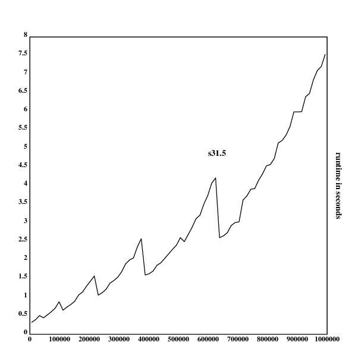

[home](./index.md)
-------------------

*author: niplav, created: 2019-02-10, modified: 2019-09-23, language: english, status: in progress, importance: 3, confidence: possible*

> __Solutions to the [99 problems](./99_klong_problems.md)
> in [Klong](http://t3x.org/klong/index.html) in a [literate
> programming](https://en.wikipedia.org/wiki/Literate_programming)
> style. Attempts to produce the shortest complete solution to these
> problems up to date.__

99 Problems Klong Solutions
===========================

Acknowledgements
----------------

s7 is by [nmh](http://t3x.org/nmh/index.html), who wrote it [in the
Klong documentation](http://t3x.org/klong/klong-ref.txt.html).
[/u/John_Earnest](https://old.reddit.com/user/John_Earnest)
provided a [more
elegant](https://old.reddit.com/r/apljk/comments/59asq0/pack_duplicate_consecutive_elements_into_sublists/)
s9 on [/r/apljk](https://old.reddit.com/r/apljk/). Dave
Long provided a much more elegant s8, s26, c1, s49 and
s55 over email. s31 is from the [Wikipedia article about
K](https://en.wikipedia.org/wiki/K_(programming_language)#Examples).

Code
----

The pure Klong code, without tests, explanations, comments or performance
tests is available [here](./code/99_klong/sol.kg). It currently implements
solutions for all problems up to P63 (excluding P47 and P48), in 2700
bytes.

Conventions
-----------

Since this collection of solutions attempts to maximize for terseness,
several considerations concerning completeness have to be made. There
is nearly no checking for correct arguments, except for empty lists.
Variables are declared locally. The solution for problem N is called
`sN`, helper functions are numbered `aN` for the Nth helper function
in __Working with lists__, `bN` in __Arithmetic__, `cN` in __Logic and
Codes__ and so on.

Prerequisites
-------------

The solutions use `flr` from the util library and `sqr` from the math
library in the standard library.

	.l("util")
	.l("math")

These would be, of course, trivial to implement on your own: `flr::{[f];f::x;y@(f'y)?1}`
and `sqr::{[a];a::x;:[0=x;0;{(x+a%x)%2}:~a]}` (taken directly from the library).

Working with Lists
------------------

### P01 (*) Find the last element of a list.

The function reverses the first argument and then returns the first element.

	s1::{*|x}
	mylast::s1

Testing with the example obtains the correct result:

		mylast([:a :b :c :d])
	:d

Another possible version would be `s1::{x@((#x)-1)}`. These can be
compared to each other in respect to their performance (the performance
test repeated 10 times each to avoid advantages from caching):

		.l("time")
		s1::{*|x}
		(+/1_10{x;time({s1(!3000000)})}\*[])%10
	0.0842222
		s1::{x@((#x)-1)}
		(+/1_10{x;time({s1(!3000000)})}\*[])%10
	0.1471947

One can see that the first version of `s1` is nearly twice as fast
as the second version.

Klong apparently has a very efficient reversing operation for lists.

### P02 (*) Find the last but one sublist of a list.

This implementation uses a property of the Take verb that allows
indexing from the end of the list with negative numbers. A longer and
less elegant solution, re-using `s1`, would be `s2::{((|x)@2),s1(x)}`.
Alternatively, one could also use direct indexing while reversing the
list: `s2::{(|x)@[1 0]}`.

	s2::{(-2)#x}
	mybutlast::s2

We again take the test from the problems list:

		mybutlast([:a :b :c :d])
	[:c :d]

### P03 (*) Find the K'th element of a list.

This one is very straightforward in Klong: indexing is zero-based,
so one subtracts one of the second element and then extracts the value.

	s3::{x@y-1}
	elementat::s3

Testing:

		elementat([:a :b :c :d :e];3)
	:c

### P04 (*) Find the number of elements of a list.

Since `#` is a Klong primitive for the length of a list, this
problem is trivial.

	s4::{#x}

### P05 (*) Reverse a list.

Similar to problem 5, there is a primitive for this.

	s5::{|x}

### P06 (*) Find out whether a list is a palindrome.

Since `=` compares a list element-wise (and returns a list with boolean
values corresponding to the equality of the two lists), we have to use
the `~` primitive, which compares lists by structure and content. So we
compare `x` and its reversion that way.

	s6::{x~|x}

### P07 (**) Flatten a nested list structure.

This particularly elegant solution is taken from the Klong
[documentation]((http://t3x.org/klong/klong-ref.txt.html)). It applies
the concatenation operator to the sublists of a list as long as the list
changes with each operation, and then returns the list.

	s7::{,/:~x}
	myflatten::s7

Tests:

		myflatten([:a [:b [:c :d] :e]])
	[:a :b :c :d :e]

This is also the result in the problems statement.
Testing it with nested empty lists also works:

		myflatten([[] [[]] [[][]]])
	[]

Unfortunately, this solution fails with lists containing only one element:

		myflatten([0])
	0

<!--TODO: Find a solution that doesn't do this.-->

### P08 (**) Eliminate consecutive duplicates of list elements.

This solution first creates a list of `1` and `0` that has `1` at at
positions where in `x` the element is followed by an value different
from itself. Because one has one element too much in the list (`[]` has
the positions `[1]`), we only take as many elements as we need off the
beginning of the resulting positions list (in these cases, it's `#x`,
the length of the argument list).
We then use Expand/Where to find the positions of 1 in the list of
positions, and extract them with At/Index.

	s8::{x@&(#x)#~0,~:'x}
	compress::s8

Compressing the example list returns the desired result:

		compress([:a :a :a :a :b :c :c :a :a :d :e :e :e :e])
	[:a :b :c :a :d :e]

And compressing the empty list (and a 1-element list) works as well:

		compress([])
	[]
		compress([1])
	[1]

### P09 (**) Pack consecutive duplicates of list elements into sublists.

Here, we first do the same matching between the elements as in P08,
but then we reverse the results and append 0 at the start. In that
way, we can use Expand/Where to obtain the positions of `1` in the list
(that's where the element in the list changes). We then can use Cut to
cut out sublists ending before the given positions. Because `~~:'[]`
returns not `[]`, but the number `1` (for whatever reason), we have
to build in a special case for the empty list at the beginning.

	s9::{:[x~[];[];(&0,~~:'x):_x]}
	pack::s9

Since the problems don't specify how we should deal with empty
lists (whether one should return `[]` or `[[]]`), we could consider
`s9::{(&0,~'~:'x):_x}`, which returns the latter. But this clashes with
`s10`, where `s10([])` returns `[[0]]`, which doesn't seem to be correct
at all.

Testing it:

		pack([:a :a :a :a :b :c :c :a :a :d :e :e :e :e])
	[[:a :a :a :a] [:b] [:c :c] [:a :a] [:d] [:e :e :e :e]]

### P10 (*) Run-length encoding of a list.

As the problem statement suggests, this solution is pretty
straightforward. For every sublist of the result of `s9`, we append
its length to its first element.

	s10::{{(#x),*x}'s9(x)}
	encode::s10

Tests:

		encode([:a :a :a :a :b :c :c :a :a :d :e :e :e :e])
	[[4 :a] [1 :b] [2 :c] [2 :a] [1 :d] [4 :e]]

### P11 (*) Modified run-length encoding.

Again, this is quite easy. For the result of `s10`, we test whether the
length of the sublist is 1, and if it is, then we return just the value,
otherwise we return the list.

	s11::{{:[1=*x;*|x;x]}'s10(x)}
	encodemodified::s11

Testing:

		encodemodified([:a :a :a :a :b :c :c :a :a :d :e :e :e :e])
	[[4 :a] :b [2 :c] [2 :a] :d [4 :e]]

This works fine. However, `encodemodified` shows weird behavior with lists with one element:

		encodemodified([0])
	[0 [0]]
		encodemodified([1])
	[1]

<!--TODO: Fix this.-->

It works fine with `[]`, though:

		encodemodified([])
	[]

### P12 (**) Decode a run-length encoded list.

Here, we simply execute a function over the list: If the list element
is an atom (it is itself not a list), we simply return it, otherwise
we use Reshape to repeat the last element of `x` (`x` has the form
`[freq val]`) `freq` times. The result is then flattened by appending
the list elements to each other.

	s12::{,/{:[@x;x;(*x):^x@1]}'x}

### P13 (**) Run-length encoding of a list (direct solution).

The difference between 'creating sublists' and 'indexing them' is
not very big in Klong, but a reasonable attempt is presented here.
We start like in P09: First, we check whether our function argument
is the empty list, in case of which we return immediately with the
empty list. Otherwise we store the outer function argument `x` in
the local variable `a`. Then we proceed by again executing Match
between the elements of the list, and append `1` at the beginning
to indicate that we want to include the first sublist. This results
in a list containing the starting positions of the sublists with different
elements. We pass this list pairwise to a function, where we first
check whether the difference is `1`. In this case, the sublist has
length `1` as well and can be returned as an atom, otherwise we
return the length of the sequence concatenated with its first element.

	s13::{[a];a::x;:[x~[];[];{:[1=y-x;a@x;(y-x),a@x]}:'&1,~~:'x]}
	encodedirect::s13

Testing this function should return the same result as `s11`:

		encodedirect([:a :a :a :a :b :c :c :a :a :d :e :e :e :e])
	[[4 :a] :b [2 :c] [2 :a] :d]

Which it does.

One can now compare the speed of the direct solution with the speed of
the indirect solution:

		.l("time")
		s9::{:[x~[];[];(&0,~~:'x):_x]}
		s10::{{(#x),*x}'s9(x)}
		s11::{{:[1=*x;*|x;x]}'s10(x)}
		time({s11(!10000)})
	0.010219
		s13::{[a];a::x;:[x~[];[];{:[1=y-x;a@x;(y-x),a@x]}:'&1,~~:'x]}
		time({s13(!10000)})
	1.884073

As one can see, the more complex solution `s13` is much slower than the
more idiomatic `s11`.

<!--TODO: Explore further why `s13` is so much slower.-->

### P14 (*) Duplicate the elements of a list.

This solution is a specialization of the solution to P15. We take the function
`2:^x` (repeat x 2 times, abusing Reshape) and call Each-Left on the first
function argument with it. Because the result is a list of lists, we then have
to flatten the list using the well known `,/` pattern.

	s14::{,/2:^:\x}
	dupli::s14

There are two alternative, but longer solutions: `s14::{,/{x,x}'x}`
is more naïve, and `s14::{x@_0.5*!2*#x}` is perhaps slightly more
amusing.

The test runs through, as expected:

		dupli([:a :b :c :c :d])
	[:a :a :b :b :c :c :c :c :d :d]

We're now interested in the performance of these functions, so we time
calling the different versions with `10000` elements:

		.l("time")
		s14::{,/2:^:\x}
		time({s14(!10000)})
	0.666863
		s14::{,/{x,x}'x}
		time({s14(!10000)})
	0.64103
		 s14::{x@_0.5*!2*#x}
		time({s14(!10000)})
	0.022282

As one can see, the indexing-based solution is by far the fastest,
with little difference between the other two.

### P15 (**) Replicate the elements of a list a given number of times.

Here we have the more general case of P14. We simply have to replace `2`
by the second argument `y` here: Repeat `x` `y` times for every `x` in
the first argument, then concatenate the result.

	s15::{,/y:^:\x}
	repli::s15

Test:

		repli([:a :b :c];3)
	[:a :a :a :b :b :b :c :c :c]

### P16 (**) Drop every N'th element from a list.

The example given indicates that the indexing is 1-based. The Drop verb
doesn't work with two lists (although that would make a nice addition
to the language), so we have to find a simpler solution. `s16` works
by creating a list with all indices to `x` (`!#x`) and then executing
the modulo of `y` on it. The result is a list in the form of `[0 1 2 3 … (y-1) 0 1 2 3 …]`.
The elements we want to avoid are at the positions where the list
contains `y-1`, so we create a list where `1` is at the positions
where the original list had elements smaller than `y-1`. We then use
`&` to obtain the positions of the value `1` and then simply index `x`
by those positions.

	s16::{x@&(y-1)>(!#x)!y}
	drop::s16

We test the implementation:

		drop([:a :b :c :d :e :f :g :h :i :k];3)
	[:a :b :d :e :g :h :k]
		drop([:a :b :c];1)
	[]
		drop([];1)
	kg: error: rem: type error: [[] 1]

So our solution fails for empty lists. We could modify it to
include a simple conditional statement to return the empty list
if `x` is `[]`: `s16::{:[x~[];[];x@&(y-1)>(!#x)!y]}`.

<!--TODO: Think about including this into the full text.-->

### P17: (*) Split a list into two parts, the length of the first part is given.

For this problem, Split is the fitting verb. It can receive a list of
lengths, and is quite lenient with lists that don't fit exactly. So we
concatenate `y` with the total length of `x` and then just split `x`
by that.

	s17::{(y,#x):#x}
	split::s17

An alternative solution could be `s17::{(,y#x),,y_x}`, in which one
concatenates taking `y` elements of `x` with dropping `y` elements of `x`.

Executing the test returns the correct result:

		split([:a :b :c :d :e :f :g :h :i :k]; 3)
	[[:a :b :c] [:d :e :f :g :h :i :k]]

The Split verb doesn't work with a range of `0`:

		split([1 2 3];0)
	kg: error: split: range error: 0

### P18: (**) Extract a slice from a list.

Here, we can simply take the first `z` elements from the start of
the list, and then drop `y-1` elements of that list (we have to subtract
`1` because indexing in lists is `0`-based).

	s18::{(y-1)_z#x}
	slice::s18

The test runs through, as expected:

		slice([:a :b :c :d :e :f :g :h :i :k];3;7)
	[:c :d :e :f :g]

However, passing arguments that are not long enough gives some
interesting results:

		slice([:a];3;7)
	[:a :a :a :a :a]

This happens because if Take doesn't find enough elements, it simply
repeats the elements it finds.

An alternative solution, using Index over a range, is
`s18::{x@(y-1)+!1+z-y}`.

### P19: (**) Rotate a list N places to the left.

Klong has a verb for that™. By default, `:+` rotates to the right with
positive, and to the left with negative integers, so we have to reverse
the sign of `y`.

	s19::{(-y):+x}
	rotate::s19

Tests:

		rotate([:a :b :c :d :e :f :g :h];3)
	[:d :e :f :g :h :a :b :c]
		rotate([:a :b :c :d :e :f :g :h];-2)
	[:g :h :a :b :c :d :e :f]

### P20: (*) Remove the K'th element from a list.

It's quite possible that there is a short and elegant solution with 3
combined adverbs, but this solution does the obvious: it concatenates
the first `y-1` elements of `x` with the last elements of `x` that don't
contain the `y`th element.

	s20::{((y-1)#x),y_x}
	removeat::s20

Tests:

		removeat([:a :b :c :d];2)
	[:a :c :d]
		removeat([];1)
	[]

Alternative solutions could use Expand over a list of booleans
`s20::{x@&~(y-1)=!#x}` or double rotation `s20::{(-y-2):+1_(y-1):+x}`

### P21: (*) Insert an element at a given position into a list.

Here, one can use a naïve solution takes the first `z-1` elements from
the list, concatenates them with `x`, and then concatenates the result
with the rest of `y`.

	s21::{((z-1)#y),x,(z-1)_y}
	insertat::s21

The given test passes successfully:

		s21(:alfa;[:a :b :c :d];2)
	[:a :alfa :b :c :d]

Other solutions are possible, for example a hack using the Amend verb with
lists and then flattening the result `s21::{,/y:=(,x,y@z-1),z-1}` or re-using
solution 17 to obtain the sublists `s21::{[r];r::s17(y;z-1);(*r),x,r@1}`.

Timing the different solutions returns unsurprising results:

		s21::{((z-1)#y),x,(z-1)_y}
		(+/1_100{x;time({s21(1;!100000;50000)})}\*[])%100
	0.00247086
		s21::{,/y:=(,x,y@z-1),z-1}
		time({s21(1;!100000;50000)})
	31.133766
		s17::{(y,#x):#x}
		s21::{[r];r::s17(y;z-1);(*r),x,r@1}
		(+/1_100{x;time({s21(1;!100000;50000)})}\*[])%100
	0.00285916

The Amend solution is much slower, mainly because of the flattening at
the end. The solution re-using `s17` is a bit slower, maybe because
of storing the result in a local variable or because Cut is a more
expensive operation.

### P22: (*) Create a list containing all integers within a given range.

This one is quite simple, although a bit clunky. We simply create a
list of integers from 0 to `y-(x-1)` (in Klong, because of right-to-left
operator evaluation, simply `y-x-1`), and add x to that.

	s22::{x+!y-x-1}
	range::s22

Tests run through like a breeze:

		range(4;9)
	[4 5 6 7 8 9]

### P23 (**) Extract a given number of randomly selected elements from a list.

We don't use solution 20 because we don't have to. Instead, we wrap the
function into an Iterate verb that gets executed `(#x)-y` times, and
each of these iterations we drop one element of the list that has been
rotated a random number of positions in the range `0`..`#x`. That way
we remove the right number of elements and return a list of the size `y`.

	s23::{((#x)-y){1_(_.rn()*#x):+x}:*x}
	rndselect::s23

Tests are a bit different here, because we obtain a random result. But
we can check if it does the approximately right thing:

		rndselect([:a :b :c :d :e :f :g :h];3)
	[:b :d :f]
		rndselect([:a :b :c :d :e :f :g :h];1)
	[:h]
		rndselect([:a :b :c :d :e :f :g :h];0)
	[]

### P24 (*) Lotto: Draw N different random numbers from the set 1..M.

The solution to this is pretty simple. With `s23`, we already have a
function to draw N elements from a list, so we only have to create the
set 1..M, or, in Klong-speak, `1+!M` (where M is the second argument
`y` to the function).

	s24::{s23(1+!y;x)}
	lottoselect::s24

Testing:

		lottoselect(6;49)
	[6 11 12 13 35 37]
		lottoselect(1;49)
	[13]
		lottoselect(0;49)
	[]
		lottoselect(10;10)
	[1 2 3 4 5 6 7 8 9 10]

Using `s22` here would be wasteful, since that would use up more bytes
than simply typing `1+!y`: `s24::{s23(s22(1;1+y);x)}`. We don't need
the given hint.

### P25 (*) Generate a random permutation of the elements of a list.

A quite nice solution is the following: First, one creates a list of
random numbers that has the same length as the first argument using the
Iterate adverb. Then, one uses Grade-Down (or Grade-Up, in this case
synonymous) to create a list of random indices, and uses Index/At to
pick the elements in this random order from `x`.

	s25::{x@<(#x){x,.rn()}:*[]}
	rndpermu::s25

Tests:

		rndpermu([:a :b :c :d :e :f])
	[:d :c :b :a :e :f]
		rndpermu([])
	[]
		rndpermu([:a])
	[:a]

It is probably slower than a more naïve
[Fischer-Yates shuffle](https://en.wikipedia.org/wiki/Fisher%E2%80%93Yates_shuffle)
like equivalent `s25::{(#x){p::_.rn()*#x;(x@p),s20(x;p+1)}:*x}`, since
Grade-Up `<` sorts the list, which results in a `$O(n*log(n))$` time
complexity, while Fischer-Yates is just `$O(n)$`.

One can then measure the runtimes of these two functions and generate
a graph of the runtimes using Klong's nplot and time libraries:

	.l("nplot")
	.l("time")

	s25.1::{x@<(#x){x,.rn()}:*[]}

	s20::{((y-1)#x),y_x}
	s25.2::{(#x){p::_.rn()*#x;(x@p),s20(x;p+1)}:*x}

	rt1::{[a];a::x;time({s25.1(!a)})}'1000+500*!19
	rt2::{[a];a::x;time({s25.2(!a)})}'1000+500*!19

	:"frame with the maximum value"

	frame([0 10000 1000]; [0],(1+_|/rt1,rt2),[0.5])

	ytitle("runtime in seconds")

	segplot(rt1)
	text(250;60;"Grading Shuffle")
	setrgb(0;0;1)
	segplot(rt2)
	text(200;250;"Fisher-Yates Shuffle")
	draw()

The output of this is in [Encapsulated
PostScript](https://en.wikipedia.org/wiki/Encapsulated_PostScript)
and now has to be converted into
[PNG](https://en.wikipedia.org/wiki/Portable_Network_Graphics) using
[ImageMagick](https://imagemagick.org/index.php):

	kg -l ./p25plot.kg -e '[]' >runtimes25.eps
	convert -size 750x750 runtimes25.eps runtimes25.png

, and also grows quicker.")

The Fisher-Yates shuffle implementation seems to grow with `$O(n^2)$`,
but the growth behavior of the Grading Shuffle is not entirely
clear. Nonetheless, it seems like the grading shuffle is clearly superior
to the Fisher-Yates Shuffle implementation in terms of performance.
There is probably a Klong verb that runs in `$O(n^2)$` and was used in
`s20` or `s25.2`.

### P26 (**) Generate the combinations of K distinct objects chosen from the N elements of a list.

This solution is a _bit_ more complicated than the previous ones. It
takes a recursive approach, with the base case being `1`, returning a
list that contains all elements in the original list as sublists: `,'y`.
Each recursive step first creates all suffixes of the list, then calls
`s26` with the tail of that suffix and appends the first element to each
of the results.

If the suffixes were not created, calling the function would result in
duplicates: `s26([:a :b];2)` would return `[[:a :b][:b :a]]`.

The suffixes are created with the expression `{x}{1_x}\``y`, using the
While adverb and exploiting the fact that `[]` is equivalent to `0`
(false) in Klong. This expression can be expressed as "While x is not
the empty list, drop one element of the front of list, and return all
intermediary results".

The appending uses the Append verb with the Each-Left adverb, appending
the first element of the list to all sublists.

In the end, the result needs to be flattened with `,/`, because the
elements are themselves put in sublists and empty lists are left in
the result.

	s26::{[k];k::x;:[1=k;,'y;,/{(1#x),:\s26(k-1;1_x)}'{x}{1_x}\~y]}
	combination::s26

Testing:

		combination(3;[:a :b :c :d :e :f])
	[[:a :b :c] [:a :b :d] [:a :b :e] ...]
		combination(3;[])
	[]
		combination(0;[:a :b])
	[]
		combination(3;[:a :b])
	[]

### P27 (**) Group the elements of a set into disjoint subsets.

Fortunately, given `s26`, both `group3` and `s27` are quite easy to
implement. `group3` First generates all subsets of `x` containing 2
members, and then passes them on to another function. This function
creates the set difference `a1` of the argument and the set passed
(for example, when `x` is for the local function is `[:a :b]`, and `a`
is `[:a :b :c :d]`, then `a1(a;x)` is of course `[:c :d]`). Of this,
all subsets with length 3 are generated with `s26`, and the result is
concatenated with the sets from the first call of `s26`. The results
are then passed, and the same procedure is repeated for subsets of size 4.

`a1` is not a very efficient implementation of set difference (it seems
to have a quadratic run-time of `$O(n*m)$`). But it is short and easy to
implement: it filters out all elements out of `x` that can be found in
`y`. The quadratic run-time can thus be explained easily: For each
element in x; that element has to be searched in `y`, resulting in
[a runtime](https://en.wikipedia.org/wiki/Big_O_notation#Product) of
`$O(n)*O(m)=O(n*m)$`, where `$n$` is the size of `x` and `$m$` is the
size of `y`.

`s27` is basically a recursive version of `group3`, producing just the
result of `s26` for the base case and applying the same set-difference
call of `s26` as in `group3`.
It does not check whether the length of `x` corresponds to the size specified
by `+/y`, although that would be trivial to implement.

	a1::{[b];b::y;flr({[]~b?x};x)}
	group3::{[a];a::x;*'{x,:\,'s26(4;a1(a;,/x))}',/{(,x),:\,'s26(3;a1(a;x))}'s26(2;x)}
	s27::{[a b];a::x;b::y;:[1=#y;,'s26(*y;x);,/{x,:\,'s26(*b;a1(a;,/x))}'.f(x;1_y)]}
	group::s27

The tests given in the specification have gigantic results, but small samples confirm
the correct behavior of `group3`:

		group3([:aldo :beat :carla :david :evi :flip :gary :hugo :ida])@[0 1 2 3]
	[[[:aldo :beat] [:carla :david :evi] [:flip :gary :hugo :ida]]
	[[:aldo :beat] [:carla :david :flip] [:evi :gary :hugo :ida]]
	[[:aldo :beat] [:carla :david :gary] [:evi :flip :hugo :ida]]
	[[:aldo :beat] [:carla :david :hugo] [:evi :flip :gary :ida]]]

Similarly, this also works for `s27`:

		s27([:aldo :beat :carla :david :evi :flip :gary :hugo :ida];[2 3 4])@[0 1 2 3]
	[[[:aldo :beat :carla :david] [:evi :flip :gary] [:hugo :ida]]
	[[:aldo :beat :carla :david] [:evi :flip :hugo] [:gary :ida]]
	[[:aldo :beat :carla :david] [:evi :flip :ida] [:gary :hugo]]
	[[:aldo :beat :carla :david] [:evi :gary :hugo] [:flip :ida]]]
		s27([:a :b :c];[1 2])
	[[[:a :b] [:c]] [[:a :c] [:b]] [[:b :c] [:a]]]
		s27([:a :b :c :d];[2 2])
	[[[:a :b] [:c :d]] [[:a :c] [:b :d]] [[:a :d] [:b :c]]
	[[:b :c] [:a :d]] [[:b :d] [:a :c]] [[:c :d] [:a :b]]]
		s27([:a];[1])
	[[[:a]]]

Empty lists don't work

		s27([];[])
	kg: error: interrupted

But set sizes that don't sum to the length of the original list still work:

		s27([:a :b :c :d];[1 2])
	[[[:a :b] [:c]] [[:a :b] [:d]] [[:a :c] [:b]]
	[[:a :c] [:d]] [[:a :d] [:b]] [[:a :d] [:c]]
	[[:b :c] [:a]] [[:b :c] [:d]] [[:b :d] [:a]]
	[[:b :d] [:c]] [[:c :d] [:a]] [[:c :d] [:b]]]

### P28 (**) Sorting a list of lists according to length of sublists

a) Sorting a list after the length of its sublists is nearly trivial in
Klong. Create a list with the lengths of the sublists, then grade that
list and select the indexes from the original argument.

	s28a::{x@<#'x}
	lsort::s28a

Tests:

		lsort([[:a :b :c] [:d :e] [:f :g :h] [:d :e] [:i :j :k :l] [:m :n] [:o]])
	[[:o] [:d :e] [:m :n] [:d :e] [:a :b :c] [:f :g :h] [:i :j :k :l]
		lsort([])
	[]
		lsort([:a])
	kg: error: size: type error: [:a]

It is not stable, though:

		lsort([[:a][:b]])
	[[:b] [:a]]

b) In this exercise, the solution is supposed to sort the sublists of a
list according to the frequency of length of the list. So if there are
5 lists with length 2, and one list with length 7, the five lists with
length 2 come first, and then the list with length 7.

I haven't found a very elegant and beautiful solution for this, but the
obvious answer is quite straightforward and direct: First, one obtains the
lengths of the sublists and groups (so that the indices of lists with the
same length are put into sublists. This is assigned to the variable `f`.
We then sort this list after the length of its sublists so that we simply
repeat the implementation of s28a (which takes more bytes to be called
than to be implemented in-line). Finally, `x` is indexed with the flattened
version of these indices.

	s28b::{[f];f::=#'x;x@,/f@<#'f}
	lfsort::s28b

Tests:

		lfsort([[:a :b :c] [:d :e] [:f :g :h] [:d :e] [:i :j :k :l] [:m :n] [:o]])
	[[:o] [:i :j :k :l] [:a :b :c] [:f :g :h] [:d :e] [:d :e] [:m :n]]
		lfsort([])
	[]
		lfsort([[:a]])
	[[:a]]

One can see that `lfsort` returns the correct result, but is not stable:
`[:o]` occurred after `[:i :j :k :l]` in the original list, but is before
it in the returned value.

Arithmetic
----------

### P31 (**) Determine whether a given integer number is prime.

In the implementation of a primality test, there generally is a great trade-off
between conciseness and performance. This seems only partially applicable in Klong.

Here, I compare four different primality tests written in Klong. The
first three were written by me, and the fourth is a slightly adapted
version from the Klong standard math library. The fifth one is [from
wikipedia](https://en.wikipedia.org/wiki/K_(programming_language)#Examples),
and the sixth is an adaption of the wikipedia version.

`s31.1` is the simplest and therefore the shortest of these four
implementations: it simply checks whether a number is divisible by any
of the numbers smaller than itself, and if that is the case, it returns
0, otherwise 1. It needs a special case for the number 2, but otherwise,
it is quite boring.

	s31.1::{:[x<2;0:|x=2;1;[]~(x!2+!x-2)?0]}

`s31.2` basically does the same thing, but tests less numbers: Only odd
numbers less than the square root of the argument (with special cases
for 2, 3 and 5). Because of this, it should run a lot faster (and as one
will see, it does!).

	s31.2::{:[x<2;0:|[2 3 5]?x;1;&/(x!2,3+2*!_sqr(x)%2)]}

One perhaps a naïve primality check is not optimal, and using a
sieve is a lot faster. These two function implement the [sieve of
Eratosthenes](https://en.wikipedia.org/wiki/Sieve_of_Eratosthenes) :
checking whether the current number divides all smaller prime numbers
until the biggest known prime number is either bigger than the argument
or equal to it.

	s31.3::{[a v];a::x;v::1;x=*{a>*x}{v::v+2;:[[]~(v!x)?0;v,x;x]}:~[2]}
	s31.4::{[n p];n::x;p::[2];{~x>n}{:[&/x!p;p::p,x;0];x+2}:~3;:[x<2;0;x=*|p]}

`s31.5` is especially beautiful: It generate all numbers smaller than x (save 0 and 1);
and makes a division test using the Each-Right adverb (x Modulo Each-Right every number
smaller than x). The resulting list of booleans is then searched for a 1 using Min/And:

	s31.5::{:[x<2;0:|x=2;1;&/x!:\2_!x]}

`s31.6` is basically the same principle, but the list of values generated to be checked
is shorter (through omission of even numbers and numbers greater than the square root
of x).

	s31.6::{:[x<2;0:|x>3;&/x!:\2,3+2*!_sqr(x)%2;1]}

Even quick performance tests reveal massive differences between these
four functions (the result always is the average runtime in seconds):

Testing `s31.1` with 100 random values >100K:

		.l("time")
		s31.1::{:[[0 1]?x;0:|x=2;1;[]~(x!2+!x-2)?0]}
		(+/1_100{x;time({s31.1(100000+_100*.rn())})}\*[])%100
	0.08203387

Testing `s31.2` with 100 random values >1G:

		.l("time")
		s31.2::{:[[0 1]?x;0:|[2 3 5]?x;1;&/(x!2,3+2*!_sqr(x)%2)]}
		(+/1_100{x;time({s31.2(1000000000+_100*.rn())})}\*[])%100
	0.05924128

Testing `s31.3` with 100 random values >10K:

		.l("time")
		s31.3::{[a v];a::x;v::1;x=*{a>*x}{v::v+2;:[[]~(v!x)?0;v,x;x]}:~[2]}
		(+/1_100{x;time({s31.3(10000+_100*.rn())})}\*[])%100
	2.87354341

Testing `s31.4` with 100 random values >10K:

		.l("time")
		s31.4::{[n p];n::x;p::[2];{~x>n}{:[&/x!p;p::p,x;0];x+2}:~3;:[x<2;0;x=*|p]}
		(+/1_100{x;time({s31.4(10000+_100*.rn())})}\*[])%100
	5.4216601

Testing `s31.5` with 100 random values >100K:

		.l("time")
		s31.5::{:[x<2;0:|x=2;1;&/x!:\2_!x]}
		(+/1_100{x;time({s31.5(100000+_100*.rn())})}\*[])%100
	0.28281745

Testing `s31.6` with 100 values >1G:

		.l("time")
		s31.6::{:[x<2;0:|x>3;&/x!:\2,3+2*!_sqr(x)%2;1]}
		(+/1_100{x;time({s31.6(1000000000+_100*.rn())})}\*[])%100
	0.07785973

One can already see that the primality checks implementing sieves are
orders of magnitude slower than the simple and boring divisor-checking
primality tests. One can also see that together with `s31.6`, `s31.2`
is by far the fastest of these three implementations (probably due to
the omission of even divisors).

One can now check the performance of the first two functions to find
out about their runtime behavior (notice that both have similar growth
behavior at 100K and 10G, respectively).

Measuring runtimes of `s31.1` and generating the graph:

	.l("nplot")
	.l("time")

	s31.1::{:[[0 1]?x;0:|x=2;1;[]~(x!2+!x-2)?0]}

	rt::{[a];a::x;time({s31.1(a+_100*.rn())})}'100000+50000*!19

	frame([0 1000000 100000]; [0],(1+_|/rt),[0.5])
	ytitle("runtime in seconds")

	segplot(rt)
	text(300;300;"s31.1")
	draw()

Measuring runtimes of `s31.2` and generating the graph:

	.l("nplot")

	s31.2::{:[[0 1]?x;0:|[2 3 5]?x;1;&/(x!2,3+2*!_sqr(x)%2)]}

	rt::{[a];a::x;time({s31.2(a+_100*.rn())})}'10000000000+5000000000*!19

	frame([0 100000000000 10000000000]; [0],(1+_|/rt),[0.5])
	ytitle("runtime in seconds")

	segplot(rt)
	text(300;300;"s31.2")
	draw()

And, finally, I measure the runtimes of `s31.5` and generate the
corresponding graph:

	.l("nplot")
	.l("time")

	s31.5::{:[x<2;0:|x=2;1;&/x!:\2_!x]}

	rt::{[a];a::x;time({s31.5(a+_100*.rn())})}'100000+50000*!19

	frame([0 1000000 100000]; [0],(1+_|/rt),[0.5])
	ytitle("runtime in seconds")

	segplot(rt)
	text(300;300;"s31.5")
	draw()

As one can see, both grow approximately linearly, and `s31.5` is around
twice as slow as `s31.1`, while having the same growth behavior. I am
not sure where the spikes in the graph come from, they could be from
cache layers, or the internal Klong garbage collector.

One can now give a good justification for choosing `s31.5` as the prime
checking implementation (though it hurts a bit to be alot slower than
`s31.2`, while shaving off a few bits).

	s31::{:[x<2;0:|x=2;1;&/x!:\2_!x]}
	isprime::s31

Tests:

		isprime(7)
	1
		flr(s31;!100)
	[2 3 5 7 11 13 17 19 23 29 31 37 41 43 47 53 59 61 67 71 73 79 83 89 97]
		s31(-1)
	0
		s31(0)
	0
		s31(1)
	0

### P32 (**) Determine the greatest common divisor of two positive integer numbers.

Implementing [Euclid's
algorithm](https://en.wikipedia.org/wiki/Euclidean_algorithm) is not
very hard:

	s32::{:[0=y;x;.f(y;x!y)]}
	gcd::s32

Testing it:

		gcd(36;63)
	9
		s32(1;10)
	1
		s32(0;10)
	10
		s32(-15;10)
	-5
		s32(123456;98765432)
	8

Seems about right.

### P33 (*) Determine whether two positive integer numbers are coprime.

> Two numbers are coprime if their greatest common divisor equals 1.

*– niplav, [“P33“ in 99 Klong Problems](./99_klong_problems.html#P33--Determine-whether-two-positive-integer-numbers-are-coprime), 2019*

This is trivial:

	s33::{1=s32(x;y)}
	coprime::s33

Testing:

		coprime(35;64)
	1
		coprime(35;63)
	0

### P34 (**) Calculate Euler's totient function phi(m).

> Euler's so-called totient function phi(m) is defined as the number of
> positive integers r (1<=r<m) that are coprime to m.

*– niplav, [“P34“ in 99 Klong Problems](./99_klong_problems.html#P34--Calculate-Eulers-totient-function-phim), 2019*

Since a predicate for coprimality is already given with `s33`, it is
not hard to find the number of coprimes for a given integer: Iterating
the smaller integers just works fine. `s34` calculates `s33` for all smaller
integers, returning a list containing 0s and 1s for the respective coprimality.
Using the Where verb compresses the list of boolean values into indices of
1, so one can just return the length of that compressed list.

	s34::{[t];t::x;#&{s33(x;t)}'!x}
	totientphi::s34

An alternative formulation filters the list after coprimality, and then returns
the length of that list: `s34::{[t];t::x;#flr({s33(x;t)};!x)}`, but that solution is
slightly longer.

Tests:

		totientphi(10)
	4
		totientphi(1)
	1
		totientphi(0)
	0
		totientphi'!20
	[0 1 1 2 2 4 2 6 4 6 4 10 4 12 6 8 8 16 6 18]

### P35 (**) Determine the prime factors of a given positive integer.

In short, this solution generates all prime numbers ≤x, iterates to
determine how often x divides the given prime and repeats that prime
that many times.

To find the primes, it filters the numbers from 1 to x using `s31`. The
iteration is similarly easy: it divides `x` by the given prime until
`x!prime` (x modulo the prime) is 0. This produces a list of numbers,
starting with x, with x divided by the prime one or more times. The
length of this list is the number of times x can be divided by the
prime. In theory, one could then just use the Reshape verb to repeat the
prime this many times, but unfortunately Reshape, used as repetition,
has the weird behavior of producing the atom n with 0 as length: `0:^5`
is `5`, not the empty list `[]` or something similar. Because of this,
atoms have to be filtered out of the result list using `{~@x}` as a filter.
The result is then flattened and returned.

Also, this function accesses arguments of outer functions pretty
often. It would be nice to be able to have a shortcut for the arguments of
outer functions (or does this violate some deep structure in functional
programming languages?). If this were possible, it would probably shave
off a couple of bytes from the code.

	s35::{[a];a::x;,/flr({~@x};{[b];b::x;(#{~x!b}{x:%b}\~a):^x}'flr(s31;1+!x))}
	primefactors::s35

Tests:

		primefactors(315)
	[3 3 5 7]
		s46'2+!10
	[[2] [3] [2 2] [5] [2 3] [7] [2 2 2] [3 3] [2 5] [11] [2 2 3] [13] [2 7] [3 5] [2 2 2 2] [17] [2 3 3] [19] [2 2 5] [3 7]]
		primefactors(1)
	[]
		primefactors(0)
	kg: error: plus: type error: [1 []]

Unsurprisingly, this algorithm and its implementation is _abysmally_ slow:

		.l("time")
		time({primefactors'2+!100})
	0.37971
		time({primefactors(1023)})
	1.095063

<!--
TODO:
[Here](https://github.com/kevinlawler/kona/wiki/K-99%3A-Ninety-Nine-K-Problems#problem-30-202)
is a better solution for factoring (it is shorter etc.), but

1. I don't understand it.
2. It is written in K.

Solve these two problems, and adopt it!
-->

### P36 (**) Determine the prime factors of a given positive integer (2).

Given the implementations of `s10` and `s35`, this is very easy:

	s36::{|'s10(s35(x))}
	primefactorsmult::s36

Tests:

		primefactorsmult(315)
	[[3 2] [5 1] [7 1]]

### P37 (**) Calculate Euler's totient function phi(m) (improved).

This problem is also simple to solve: One simply generates the prime
factors and their multiplicities, and then implements the function
that computes them. The only interesting thing in this implementation
is that one can use the verb Apply (`@`) for the list of prime factors
and their multiplicities. Here, a list is treated as arguments, where
`x` is the factor, and `y` becomes the multiplicity.

	s37::{*/{{(x-1)*x^y-1}@x}'s36(x)}

Tests:

		s37(10)
	4
		s37(115)
	88
		s37(1)
	[]
		s37(0)
	kg: error: plus: type error: [1 []]
		(s37'2+!100)~s34'2+!100
	1

The wrong values for 1 and 0 are inherited from `s35`.

### P38 (*) Compare the two methods of calculating Euler's totient function.

> Take the number of logical inferences as a measure for efficiency.

*– niplav, [“P38“ in 99 Klong Problems](./99_klong_problems.html#P38--Compare-the-two-methods-of-calculating-Eulers-totient-function), 2019*

We will not do that, but simply measure the runtimes of the two functions
in seconds.

First, we make a ballpark estimate of how fast the functions are:

		.l("time")
		s32::{:[0=y;x;.f(y;x!y)]}
		s33::{1=s32(x;y)}
		s34::{[t];t::x;#&{s33(x;t)}'!x}
		time({s34(10090)})
	0.113058
		s9::{:[x~[];[];(&0,~~:'x):_x]}
		s10::{{(#x),*x}'s9(x)}
		s31::{:[x<2;0:|x=2;1;&/x!:\2_!x]}
		s35::{[a];a::x;,/flr({~@x};{[b];b::x;(#{~x!b}{x:%b}\~a):^x}'flr(s31;1+!x))}
		s36::{|'s10(s35(x))}
		s37::{*/{{(x-1)*x^y-1}@x}'s36(x)}
		time({s37(10090)})
	106.232003

One can easily see that `s34` is a lot faster than `s37`. But does
the same hold for growth? Maybe `s37` has a much slower growth and is
surpassed by `s34` at some point.

	.l("nplot")
	.l("time")

	s32::{:[0=y;x;.f(y;x!y)]}
	s33::{1=s32(x;y)}
	s34::{[t];t::x;#&{s33(x;t)}'!x}

	s9::{:[x~[];[];(&0,~~:'x):_x]}
	s10::{{(#x),*x}'s9(x)}
	s31::{:[x<2;0:|x=2;1;&/x!:\2_!x]}
	s35::{[a];a::x;,/flr({~@x};{[b];b::x;(#{~x!b}{x:%b}\~a):^x}'flr(s31;1+!x))}
	s36::{|'s10(s35(x))}
	s37::{*/{{(x-1)*x^y-1}@x}'s36(x)}

	rt1::{[a];a::x;time({s34(a)})}'100+50*!19
	rt2::{[a];a::x;time({s37(a)})}'100+50*!19

	:"frame with the maximum value"

	frame([0 1000 100]; [0],(1+_|/rt1,rt2),[0.5])
	ytitle("runtime in seconds")

	segplot(rt1)
	text(250;40;"Naive phi function")
	setrgb(0;0;1)
	segplot(rt2)
	text(200;250;"phi function with prime factors")
	draw()

As one can easily see, this is not the case. This is not surprising,
since calculating prime factors is generally slow (and even slower here,
because `s35` does not use any efficient prime sieves, but the simplest
factoring algorithm). It could be improved runtime-wise by pre-computing
the prime-numbers using a sieve, but that would take up many bytes and
exceed the scope of this exercise.

### P39 (*) A list of prime numbers.

I assume that the range of numbers is inclusive. Then the solution is
just filtering the list of numbers from x to y using `s31`. To construct
this list, one can use `s22`, which returns all the integers in the
range from x to y.

	s39::{flr(s31;s22@x,y)}

Tests:

		s39(2;23)
	[2 3 5 7 11 13 17 19 23]
		s39(4;23)
	[5 7 11 13 17 19 23]
		s39(0;23)
	[2 3 5 7 11 13 17 19 23]
		s39(4;20)
	[5 7 11 13 17 19]
		s39(0;0)
	[]
		s39(-1;0)
	[]

### P40 (**) Goldbach's conjecture.

This solution starts out with a list containing 0 and the argument x.
As long as one number in the list is not a prime (using `s31` over
the list and aggregating the results using And, then negating them),
`[1 -1]` is added to the list, causing the first element to increment
and the second element to decrement in a While loop until a solution
is found.

This way, if a solution exists, the smallest possible solution is
always returned.

	s40::{{~&/s31'x}{[1 -1]+x}:~0,x}
	goldbach::s40

Tests:

		goldbach(4)
	[2 2]
		goldbach(5)
	[2 3]
		goldbach(28)
	[5 23]
		goldbach(12000)
	[13 11987]
		goldbach(1)
	kg: error: interrupted
		goldbach(0)
	kg: error: interrupted
		goldbach(11)
	kg: error: interrupted
		goldbach(2)
	kg: error: interrupted

As one can see, it works quite well for even numbers above 4, and even for
most odd numbers, but goes into infinite loops for all other arguments.
This should not be a problem, though.

### P41 (**) A list of Goldbach compositions.

The idea I followed was to have two helper functions: One that generates
all even numbers from x to y (called `b1`), and another one responsible
for the string formatting and printing (called `b2`), accepting the two
prime summands in a list as an argument.

I wrote several possible implementations for `b1` and chose the shortest
one (since they are all quite similar and simple, I won't bother
explaining them in detail):

	b1.1::{flr({~x!2};s22@x,y)}
	b1.2::{(!y)@&~(x>!y)|(!y)!2}
	b1.3::{2*s22(_0.6+x%2;y:%2)}
	b1.4::{s22(x;y)@&~s22(x;y)!2}
	b1.5::{2*s22@_[0.6 0]+(x,y)%2}
	b1.6::{[v];v::s22@x,y;v@&~v!2}
	b1.7::{[v];v::!y;v@&~(v<x)|v!2}

Afterwards, I did the same thing with `b2`:

	b2.1::{.p@($+/x)," = ",{x," + ",y}/$x}
	b2.2::{.p@($+/x)," = ",{x," + ",y}@$x}
	b2.3::{.p@($+/x)," = ",($*x)," + ",$*|x}

One can now choose the shortest two options for these functions:

	b1::{flr({~x!2};s22@x,y)}
	b2::{.p@($+/x)," = ",{x," + ",y}/$x}

Together with `s40`, the problem is now pretty easy to solve. `s41a`
just applies `s40` to the result of `b1` (which returns the numbers
that interest us), and `b2` (the formatting) is applied to the results
afterwards.

	s41a::{'b2's40'b1@x,y}
	goldbachlist::s41a

In `s41b`, we first filter the output of `s40` by checking whether the
first element of the list is smaller than the argument z. Afterwards, `b2`
is applied for formatting. This function is not called `goldbachlist`,
because the name is later needed for testing and because I don't like
assuming two different namespace for the two functions.

	s41b::{[l];l::z;b2'flr({l<*x};s40'b1@x,y)}

The tests seem to run through pretty well:

		goldbachlist(9;20)
	10 = 3 + 7
	12 = 5 + 7
	14 = 3 + 11
	16 = 3 + 13
	18 = 5 + 13
	20 = 3 + 17
	["10 = 3 + 7" "12 = 5 + 7" "14 = 3 + 11" "16 = 3 + 13" "18 = 5 + 13" "20 = 3 + 17"]
		goldbachlist(4;10)
	4 = 2 + 2
	6 = 3 + 3
	8 = 3 + 5
	10 = 3 + 7
	["4 = 2 + 2" "6 = 3 + 3" "8 = 3 + 5" "10 = 3 + 7" "12 = 5 + 7" "14 = 3 + 11" "16 = 3 + 13" "18 = 5 + 13" "20 = 3 + 17"]
		goldbachlist(2;10)
	kg: error: interrupted

Again, as one can see, `s40` can't deal with the number 2 and goes into
an infinite loop.

Now the test is repeated for the `s41b` with the lower bound:

		s41b(4;2000;50)
	992 = 73 + 919
	1382 = 61 + 1321
	1856 = 67 + 1789
	1928 = 61 + 1867
	["992 = 73 + 919" "1382 = 61 + 1321" "1856 = 67 + 1789" "1928 = 61 + 1867"]

The results are the same as in the problem statement.

Logic and Codes
---------------

### P46 (**) Truth tables for logical expressions.

The problem statements asks to define the functions `and`, `or`, `nand`,
`nor`, `xor`, `impl` and `equ`, which can be done easily with atomic
operations:

	and::{x&y}
	or::{x|y}
	nand::{~x&y}
	nor::{~x|y}
	xor::{~x=y}
	impl::{~x&~y}
	equ::{x=y}

That was easy.

This problem is not really made for Klong. It asks to execute a function
on a list of binary inputs, but doesn't represent these inputs as a list,
and instead treats each one of them as a separate argument, while using
a list and indexing it would be a much simpler and cleaner solution.

Since P47 and P48 can't be implemented nicely, P46 is reduced to mapping
the function given as an argument over the binary representations of
all the numbers from 0 to 3, and then formatting and printing the results.
The formatting simply consists of converting the binary values to strings
and concatenating them with tabs.

	s46::{[f];f::x;.p'{x,"	",y}/'${x,f@x}'[[0 0][0 1][1 0][1 1]]}
	table1::s46

A tests show that it works as intended:

		table1({and(x;or(x;y))})
	0	 0	 0
	0	 1	 0
	1	 0	 1
	1	 1	 1
	["0     0       0" "0   1       0" "1   0       1" "1   1       1"]

There are two longer and more general solution that could be helpful
for P47 and P48 in the future. Both contain helper functions for converting
numbers to binary.

Solution with a separate helper function `c1` that creates the binary
numbers:

	c1::{(-x)#(&x),{:[x;.f(x:%2),x!2;0]}:(y)}
	s46::{[f];f::x;.p'{x,"  ",y}/'${x,f@x}'c1(2;)'!4}

Solution with another separate function `c` that creates all binary
numbers of length x.

	c1::{(-x)#(&x),{:[x;.f(x:%2),x!2;0]}:(y)}
	c2::{{c1@x}'x,:\(!2^x)}
	s46::{[f];f::x;.p'{x,"  ",y}/'${x,f@x}'c2(2)}

Note that this is just code saved for a later point where I might
revisit P47 and P48 to solve them appropriately as well.

<!--
### P47 (*) Truth tables for logical expressions (2).

	s47::{s46(x)}

### P48 (**) Truth tables for logical expressions (3).

	s48::{c3(x;y)}
-->

### P49 (**) Gray code.

The Gray code can be generated as following: The 0-bit Gray code is
the empty list `[]`, the 1-bit Gray code is simply `['0' '1']`. The
n+1-bit Gray code is the n-bit Gray code where 0 is prepended to every
sequence, concatenated with the n-bit Gray code where 1 is prepended
to every sequence of the reversed n-bit Gray code. In the case of n=2,
this would be `['00' '01'],['11' '10']`.

<!--TODO: Wikipedia Link for Gray code-->

This recursive definition can now be put into code quite easily: If x=0,
return the empty list, otherwise return the x-1 Gray code prepended with
first 0 and then 1 to the reversed x-1 code.

	s49::{:[x;{(0,:\x),1,:\|x}:(.f(x-1));,[]]}

One can see that this works for the usual cases:

		s49(0)
	[[]]
		s49(1)
	[[0] [1]]
		s49(2)
	[[0 0] [0 1] [1 1] [1 0]
		s49(10)
	[… [1 0 0 0 0 0 0 0 1 0] [1 0 0 0 0 0 0 0 1 1] [1 0 0 0 0 0 0 0 0 1] [1 0 0 0 0 0 0 0 0 0]]

However, one runs into problems with negative numbers, since `s49`
attempts infinite recursion:

		s49(-1)
	kg: error: interrupted

This is to be expected, since negative-bit Gray codes do not make
any sense.

### P50 (***) Huffman code.

I am especially proud of this code.

The problem statement only asks to create a code from the list of
frequencies, but to make everything easier, one can write a function
that returns this list of frequences for a given string. It does this
by grouping the string, and then concatenating the length of the group
list with the corresponding element.

	frq::{[t];t::x;{(t@*x),#x}'=x}

That seems to work well:

		frq("aabbccccca")
	[[3 0ca] [2 0cb] [5 0cc]]

The implementation of the Huffman code is not very complicated, although it might
look like that on the first view. It was initially separated into three functions,
but for sake of brevity two of them have been contracted.

	c1::{:[2=#x;,(,y),x@1;.f(x@1;y,0),.f(x@2;y,1)]}
	s50::{|'c1(*{1<#x}{{,(+/*'x),x}:(2#x@<*'x),2_x@<*'x}:~|'x;[])}
	huffman::s50

Originally, the code looked like this:

	c1::{:[2=#x;,(,y),x@1;.f(x@1;y,0),.f(x@2;y,1)]}
	c2::{{,(+/*'x),x}:(2#x),2_x}
	s50::{|'c1(*{1<#x}{c2(x@<*'x)}:~x;[])}

Here, one can quite clearly seet he separation of creating the Huffman
code: first, the tree is built up by calling `c2` on the list of code
frequencies repeatedly, until the tree is complete, and then the tree is
passed to `c1`, which creates the code by traversing the tree and adding
1's and 0's to the code. The frequency and the symbol are exchanged
at the beginning to make processing by `c2` easier, and in the end,
codeword and symbol are exchanged again so that the result fits with
the desired format.

`c2` takes the first two elements of the sorted list of trees (in the first
case just lists), adds the first elements of these lists, concatenates
the sum and the two nodes and appends this to the rest of the list.

`c1` traverses the tree recursively, building up the code using the second
argument of the function (giving the left part of the tree a `0` and
the right part a `1`).  If it encounters a leaf, it returns the code
generated so far, together with the symbol represented by the code.

The final solution simply inlines `c2` into `s50`.

Testing it shows that it generate the same code as in the example, but that this
result is not sorted after the length of the code, but is rather in traversal order
of the tree:

		huffman([[0ca 45] [0cb 13] [0cc 12] [0cd 16] [0ce 9] [0cf 5]])
	[[0ca [0]] [0cc [1 0 0]] [0cb [1 0 1]] [0cf [1 1 0 0]] [0ce [1 1 0 1]] [0cd [1 1 1]]]
		s50([[0ca 10][0cb 10]])
	[[0cb [0]] [0ca [1]]]

This is okay.

### A More Complete Implementation

This is not part of the problem statement, but one can now write code
that receives a string and encodes it, as well as code that receives a
an encoded string and a list of frequencies and decodes that given string.

Encoding the string is not particularly difficult: For each character,
the inner function searches for the representation of that character in
the huffman coding and returns the code. The results are then concatenated
and converted to a string.

Decoding is much more complex because huffman decoding is very iterative,
and there doesn't seem to be a array-based equivalent.  Basically,
searches for a prefix of the string that is in the code, appends the
corresponding character from the code to the result string r and removes
the prefix from the encoded string.  The variable o is the huffman code
for the string and p is the matching prefix for the string. This code
is executed in a While-loop until the encoded string is empty, and then
returns the result string.

To summarize, there are 7 helper functions:

* `frq` builds the frequency table
* `treewalk` builds the huffman code from an existing tree
*	`combsmallest` gets a list of trees and combines the ones with
	the smallest root value
*	`gencode` combines `combsmallest` and `treewalk` to generate a
	huffman code from a frequency table
* `bin` returns the binary representation of a number
* `comp` creates an ASCII string from a list of binary digits
*	`decomp` creates a list of binary digits from an ASCII string
	(the inverse operation of `comp`)
*	`encode` generates the huffman-encoded bit-array from a string,
	and from that creates a list with 3 elements
	*	the length of the bit array (needed because the conversion
		to a string pads the bit array with 0s or 1s)
	* the frequency table of the string (using `frq`)
	* the encoded string itself (using `comp`)
*	`decode` receives a list created by `encode` and returns the
	original string by first generating the huffman code from the frequency
	table (using `gencode`), then decompressing the ASCII string using
	`decomp`, and then iterating through the string

Here is the complete code, in all its glory:

	frq::{[t];t::x;{(t@*x),#x}'=x}
	treewalk::{:[2=#x;,(,y),x@1;.f(x@1;y,0),.f(x@2;y,1)]}
	combsmallest::{{,(+/*'x),x}:(2#x),2_x}
	gencode::{|'treewalk(*{1<#x}{combsmallest(x@<*'x)}:~|'x;[])}
	bin::{(-x)#(&x),{:[x;.f(x:%2),x!2;0]}:(y)}
	comp::{,/:#{+/x*'2^|!8}'(8*1+!(#x):%8):_x}
	decomp::{,/{bin(8;x)}'#'x}
	encode::{[c f b];f::frq(x);c::gencode(f);b::,/{*|c@*(x=*'c)?1}'x;(#b),(,f),,comp(b)}
	decode::{[r o];o::gencode(x@1);r::"";{x}{[p];p::*(x{:[&/y=(#y)#x;1;0]}:\*'|'o)?1;r::r,*o@p;(#*|o@p)_x}:~(*x)#decomp(x@2);r}

Test:

		s::"Sun is shining in the sky, there ain't a cloud in sight. It's a blazin', everybody's there to play, and don't you know-it's so beautiful today, he- he- hey. Running down the avenue, see how the sun shines brightly."
		p::encode(s)
	[923 [[0cS 1] [0cu 8] [0cn 17] [0c  38] [0ci 13] [0cs 12] [0ch 13] [0cg 4] [0ct 14] [0ce 18] [0ck 2] [0cy 8] [0c, 5] [0cr 4] [0ca 9] [0c' 6] [0cc 1] [0cl 5] [0co 10] [0cd 6] [0c. 3] [0cI 1] [0cb 4] [0cz 1] [0cv 2] [0cp 1] [0cw 3] [0c- 3] [0cf 1] [0cR 1]] "g�������Q��
	����ʌ����>��E&aT��w��}�����rR���3{��δo�TO�1o�a�J/˻6�÷�}��`�u��KJ�3��܁{��EG
                                                                               myK�""��`"]
		decode(p)
	"Sun is shining in the sky, there ain't a cloud in sight. It's a blazin', everybody's there to play, and don't you know-it's so beautiful today, he- he- hey. Running down the avenue, see how the sun shines brightly."

Using `encode` interactively can cause problems because the string
can contain control characters that change the settings of the current
terminal.

It is unclear when it starts to make sense to compress strings this way,
since there is a considerable overhead due to including the frequency
table and the length of the initial bit-array. More tests are needed
on that.

Binary Trees
------------

A shorter way to write such a list would be to leave the empty lists out
at a leaf of the binary tree, that is, if a list has the form `[a [][]]`,
it can be also written as `[a]`. However, if there is a subtree
for the node (it is not a leaf), the empty list can't be left out: `[a [] [b]]`
is not `[a [b]]`.

Because this is a lot more readable, one can write conversion functions that
remove or add these redundant empty lists:

	pt::{(,x),(,y),,z}
	clean::{:[[[][]]~1_x;1#x:|[]~x;x;pt(*x;.f(x@1);.f(x@2))]}
	litter::{:[(1=#x)&@*x;pt(*x;[];[]):|[]~x;x;pt(*x;.f(x@1);.f(x@2))]}

`clean` removes the redundant empty lists, and `litter` converts a tree
with atoms as leafs into with empty lists added.

`pt` is a small helper function that receives three arguments and puts
them together into a tree: an atom, and two lists as nodes.

Testing `clean`:

		clean([:a [] []])
	[:a]
		clean([])
	[]
		clean([:a [:b [:d [] []] [:e [] []]] [:c [] [:f [:g [] []] []]]])
	[:a [:b [:d] [:e]] [:c [] [:f [:g] []]]]
		clean([:a [:b [:c [:d [:e [:f [] []] []] []] []] []] []])
	[:a [:b [:c [:d [:e [:f] []] []] []] []] []]

Testing `litter`:

		litter([:a])
	[:a [] []]
		litter([])
	[]
		litter([:a [:b [:d] [:e]] [:c [] [:f [:g] []]]])
	[:a [:b [:d [] []] [:e [] []]] [:c [] [:f [:g [] []] []]]]
		litter([:a [:b [:c [:d [:e [:f] []] []] []] []] []])
	[:a [:b [:c [:d [:e [:f [] []] []] []] []] []] []]

### P54A (*) Check whether a given term represents a binary tree.

`s54a` is not very difficult: it simply recursively checks whether a
node contains an atom (and not an empty list) as the first element,
and two lists as the other two elements, with the base case of the
empty list. The check whether the first element is the empty list has
to be done separately because Klong think the empty list is an atom. For
whatever reason.

	s54a::{:[x~[];1:|3=#x;.f(x@2)&.f(x@1)&(~[]~*x)&@*x;0]}
	istree::s54a

This function can now be tested:

		istree(:a)
	kg: error: index: type error: [:a 1]
		istree([:a])
	0
		istree([])
	1
		istree([:a []])
	0
		istree([:a [] []])
	1
		istree([:a [:b [] []] []])
	1
		istree([:a [:b [] []]])
	0
		istree([[] [] []])
	0
		istree([[:a] [] []])
	0
		istree([:a [:b [:d [] []] [:e [] []]] [:c [] [:f [:g [] []] []]]])
	1
		istree([:a [:b [:c [:d [:e [:f [] []] []] []] []] []] []])
	1

### P55 (**) Construct completely balanced binary trees.

`s55` can be implemented as a recursive function. The only balanced
binary tree with 0 nodes is the empty list `[]`, so `s55` returns `[[]]`
(the list containing the only balanced binary tree with 0 nodes) for the
argument `0`. If the tree has more nodes, `s55` first subtracts 1 for
the root node, and then generates the two possible sets of trees: one
with `x:%2` nodes (half of them), and `x-x:%2` nodes (the other half).
These two sets are then given as arguments to another function. This
function checks whether the two sets have the same shape (this is the
case iff `(x:%2)=x-x:%2`). If they have the same shape, it generates
all possible combinations of the two using the helper function `d2`,
which simply executes `d1` on all pairs of `x` and `y` (the cartesian
product).  If their shapes are different, then `d2` is executed on `x`
and `y` in both orders. `d1` simply takes two trees and combines them
into a single tree with the root node `:x`.

	d1::{:x,(,x),,y}
	d2::{x{y d1:/x}:\y}
	s55::{:[x=0;,[];,/{:[x~y;d2(x;x);d2(x;y),d2(y;x)]}@.f'{(x:%2),x-x:%2}@x-1]}
	cbaltree::s55

Tests (using `clean` which was previously defined):

		cbaltree(0)
	[[]]
		 clean'cbaltree(1)
	[[:x]]
		clean'cbaltree(2)
	[[:x [] [:x]] [:x [:x] []]]
		clean'cbaltree(3)
	[[:x [:x] [:x]]]
		clean'cbaltree(4)
	[[:x [:x] [:x [] [:x]]] [:x [:x] [:x [:x] []]] [:x [:x [] [:x]] [:x]] [:x [:x [:x] []] [:x]]]
		#'cbaltree'!41
	[1 1 2 1 4 4 4 1 8 16 32 16 32 16 8 1 16 64 256 256 1024 1024 1024 256 1024 1024 1024 256 256 64 16 1 32 256 2048 4096 32768 65536 131072 65536 524288]
		cbaltree(-1)
	kg: error: interrupted

This seems to work just fine.

### P56 (**) Symmetric binary trees.

In this function, `mirror` is inlined into `s56`. It roughly works like
this: Two trees are the mirror of of each other if and only if both
trees are either empty or have the same shape and

* The left subtree of the left tree has the same shape as the right subtree of the right tree, and
* The right subtree of the left tree has the same shape as the left subtree of the right tree

The problem statement says that the content of the tree can be ignored
and that only structure is important.

The outer function takes the input tree, returns true if it is empty,
and calls the inner mirror-checking function with the two subtrees. The
inner function checks whether the two input trees are empty (and returns
true if they are), recursively checks the trees if they have the same
shape, or returns false.

The function doesn't check whether the tree is a correct tree (that's what
`s54a` is for, after all).

	s56::{:[3=#x;{:[[]~x,y;1:|(^x)~^y;.f(x@1;y@2)&.f(x@2;y@1);0]}@(1_x):|x~[];1;0]}
	testsymmetric::s56

Tests:

		testsymmetric([])
	1
		testsymmetric([:x [] []])
	1
		testsymmetric([:x [] [:x [] []]])
	0
		testsymmetric([:x [:x [] []] [:x [] []]])
	1
		testsymmetric([:x [:x [:x [] []] []] [:x [] [:x [] []]]])
	1
		testsymmetric([:x [:x [:x [] []] []] [:x [:x [] []] [:x [] []]]])
	0
		testsymmetric([:x [:x [:x [] []] []] [:x [:x [] []] []]])
	0

The function sometimes fails if it is not given a correctly shaped tree:

		testsymmetric([:x [:x][:x]])
	kg: error: index: range error: 2

### P57 (**) Binary search trees (dictionaries).

This problem is quite easy to solve with a recursive function that
accepts an already sorted list of integers. The recursive function takes
the middle element, makes it the root of the tree, and then calls itself
with the left half of the tree and the right half of the tree. It then
combines the results together into a single tree. The base case is the
empty list, which returns the empty list (the empty tree) as a result.

	s57::{{[m];m::(#x):%2;:[x;(x@m),(,.f(x@!m)),,.f((1+m)_x);x]}:(x@<x)}
	construct::s57

Example:

		construct([3 2 5 7 1])
	[3 [2 [1 [] []] []] [7 [5 [] []] []]]

This is a bit different from the result `[3 [2 [1 [] []] []] [5 [] [7
[] []]]]` in the problem statement, but both are valid binary search
trees. The solution presented here just makes a left-leaning tree in
the edge-cases, and the solution presented in the original problem is
a right-leaning tree.

Now, one can also test the solution of problem P56:

		testsymmetric(construct([5 3 18 1 4 12 21]))
        1
		testsymmetric(construct([3 2 5 7 1]))
	0

The results are what one would expect from the problem statement.

### P58 (**) Generate-and-test paradigm.

Given the function `flr`, this is easy.

	s58::{flr({s56(x)};s55(x))}

### P60 (**) Construct height-balanced binary trees with a given number of nodes.

	s59::{:[x<2;,x#,:x;{:x,'x}'{d2(x;x),d2(y;x),d2(x;y)}:(,'s59(x-1);,'s59(x-2))]}
	minnodes::{:[x<1;0:|x=1;1;1+.f(x-1)+.f(x-2)]}

<!--
Seems to be the sum of the first `x` fibonacci numbers.

	minnodes::{+/(x-1){(+/2#x),x}:*[1 0]}

Attempt, using the fibonacci number approach:
TODO: currently incorrect.
-->
	maxheight::{[k];k::x;#1_{k>+/x}{(+/2#x),x}:~[1 0]}

	d4::{:[x=0;0;1+_ln(x)%ln(2)]}
	d5::{[n];n::x;({~d4(x)>n}{x+1}:~0)-1}
	d6::{,/x{(,y){x,,y}:\x}:\y}
	d7::{d6(x;y),d6(y;x)}
	d8::{[h];h::(**x),**|x;:[2>#(*h)-*|h;(1+|/h),,[:x],(,(*|*x)),,(*|*|x);[]]}
	s60::{[n];n::x-1;:[x=0;,[0 []]:|x=1;,[1[:x]];
			   {x@((~:'x),0)?0}:({x@<x}:(d8',/{d7(s60(*x);s60(*|x))}'
			   flr({d4(*|x)<2+d5(*x)};{x,,n-x}'!1+n:%2)))]}
	s61::{:[*3=^x;.f(x@1)+.f(x@2);#x]}
	s61a::{:[*3=^x;.f(x@1),.f(x@2);x]}
	s62::{:[*3=^x;(*x),.f(x@1),.f(x@2);[]]}
	s62b::{:[y=1;*x:|3>#x;[];.f(x@1;y-1),.f(x@2;y-1)]}
	d9::{y:=(,x,y@z),z}
	s62c::{{[n];:[(1+z)>#y;n::y,,[];n::y];
		:[*3=^x;.f(x@1;.f(x@2;d9(*x;n;z);z+1);z+1);d9(*x;n;z)]}
		:(x;[];0)}
	s63::{:[0=x;[];
		{(:x,:[y<2*x;[];,.f(x*2;y)]),:[y=2*x;,[]:|y<1+2*x;[];,.f(1+2*x;y)]}:(1;x)]}

<!--
Multiway Trees
--------------

Graphs
------

Miscellaneous Problems
----------------------
-->
