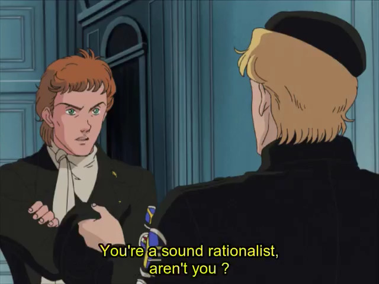

[home](./index.md)
------------------

*author: niplav, created: 2019-04-02, modified: 2020-12-18, language: english, status: in progress, importance: 3, confidence: highly likely*

> __A description of this website and its author.__

About
=====

The Site
--------

### Content

This website contains essays on different topics, ranging
from programming over philosophy to discussions of odd social
behavior, as well as translations, transcriptions, music
recordings and programming projects. It follows the idea of [Long
Content](https://www.gwern.net/About#long-content): pages that are
continually getting refined and updated, never quite completely finished,
but approaching stability. This allows for "perpetual drafts", along
with continuous improvement (similar to a wiki, but mainly edited by one
person).

This is inspired by the idea of Long Content, produced under the motto

> Think Less Wrong, act Long Now and Suck Less.

*– paraphrasing [Gwern Branwen](https://www.gwern.net/), [“About This Website”](https://www.gwern.net/About), 2019*

For this reason, articles are not published by date,
but rather by category, both to make it easier to read
the content of the site in order (i. e. to ["Start at the
Beginning"](https://entirelyuseless.com/2018/06/12/start-at-the-beginning/))
and to structure it by topic and form, rather than to strive for
presenting mainly new information to the reader.

The content on this website is licensed under [Creative Commons
4.0](https://creativecommons.org/licenses/by/4.0/).

#### Essays

The essays contain mainly new material, both short arguments and
collections of links, but also longer descriptions of new ideas or
analyses of concepts where existing descriptions (e.g. on Wikipedia or
other blogs) were deemed incomplete. It is of course not possible to
avoid replicating existing ideas (it is not possible for me to read
anything beyond a slim part of existing texts on a topic before writing
my own ideas down), but it seems likely that the idea will at least
be new to most readers.

Generally I use the rule: Let t be the time it would take to write a
text about the idea I was thinking about. Then the time spent researching
whether the idea exists already should stop take at most `$\frac{t}{2}$`.

There are, of course, some essays that were written about existing and
well-known ideas. These were written mainly for my own enjoyment.

#### Translations, Transcriptions & Archives

It [seems
possible](https://reducing-suffering.org/ways-writing-valuable/#Old_content_vs_new_content)
that archiving content has a much bigger impact than creating new
content. Given that I write mostly for self-expression, it is a small
factor in most of what I do, but occasionally I transcribe or translate
texts in order to make them more easily accessible.

The translations are often intertwined with the effort of learning other
languages or exercising language skills that would otherwise be forgotten.
For that reason, they can be of quite low quality, so I'm always grateful
for corrections sent my way.

#### Programming Projects

This site also acts as a central place of organisation for different
programming related projects and contributions. That includes
pages representing programming projects, but also [literate
programs](https://en.wikipedia.org/wiki/Literate_programming)
containing code, comments, tests and performance measurements. Most
programs will be written in [a small number of programming
languages](./uses_this.html#Programming-languages).

### Inspiration

I always had a few ideas I thought were worth preserving, and a lot
of ideas I thought would be fun writing down, and also thought about
creating a repository for all my personal projects, but somehow these
never really pushed me completely toward actually setting something
up. A good reason might have been that I only visited sites that were
poorly organised and contained little to no personal long-term content
(either blogs focused on new posts or simply haphazard aggregations
of short ideas (like in the form of [2f30.org](http://2f30.org) or the
[suckless.org wiki](https://suckless.org/wiki/))).

This was changed upon discovering [gwern.net](https://www.gwern.net)
and [reducing-suffering.org](https://reducing-suffering.org): both gave
me a good idea of how a long-term website should look and feel like,
and which kind of content could be published there.

I decided to start writing down my ideas, collecting older texts and
reviewing them to see what was still valuable and what was useless.

My decision to start a website was solidified by [guzey
2019](https://guzey.com/personal/why-have-a-blog/) and a question on
[/r/slatestarcodex](https://old.reddit.com/r/slatestarcodex/comments/ab3ry1/whats_the_bottleneck_to_more_things_like_slate/):

> What's the bottleneck to more things like "Slate Star Codex" or Gwern's site existing in the world?

*– [arikir](https://old.reddit.com/user/arikr), [“What's the bottleneck to more things like "Slate Star Codex" or Gwern's site existing in the world?”](https://old.reddit.com/r/slatestarcodex/comments/ab3ry1/whats_the_bottleneck_to_more_things_like_slate/) on [/r/slatestarcodex](https://old.reddit.com/r/slatestarcodex/), 2019*

<!--TODO: Lesswrong question: [What makes people intellectually
active?](https://www.lesswrong.com/posts/XYYyzgyuRH5rFN64K/what-makes-people-intellectually-active)-->

I decided that it could not hurt to try and follow through on the idea
of aggregating the stuff I produced, and a possible (but unlikely)
benefit to other people was just a nice addition.

So far, writing for a website has been beneficial to interacting with
several topics: It streamlines my thoughts, makes it possible to take
notes, include code and images and several other advantages. Even if
I had never gotten around to publishing this site, it would still have
been a net positive project for me.

### Style

The style of writing is mostly formal US english.

#### Titles and Headings

* Titles and headers use the [APA style of capitalization](https://blog.apastyle.org/apastyle/2012/03/title-case-and-sentence-case-capitalization-in-apa-style.html)
* MathJax is used only when necessary
* The [Oxford comma](https://en.wikipedia.org/wiki/Serial_comma) is not used
* Code is not syntax-highlighted
* A passive voice is preferred, but I have to get into the flow of writing, so texts may contain that as well.
* No footnotes/endnotes (see [entirelyuseless 2015](https://entirelyuseless.com/2015/07/11/are-hyperlinks-a-bad-idea/))
* Quotes have the following style: `*– [Author Name](https://en.wikipedia.org/wiki/Author_Name), [“Chapter” in “Work Name”](https://work-name.com) p.1, Year*`. If the work is not online, link the Wikipedia page.
* Quotes of reddit have the following style:
	* Post: `*– [User_Name](https://old.reddit.com/u/User_Name), [“Post Title”](https://old.reddit.com/r/all/post_title/) in [/r/all](https://old.reddit.com/r/all) (100 upvotes), Year*`
	* Comment: `*– [User_Name](https://old.reddit.com/u/User_Name), [comment](https://old.reddit.com/r/all/post_title/deadbeef) on [“Post Title”](https://old.reddit.com/r/all/post_title/) in [/r/all](https://old.reddit.com/r/all) (100 upvotes), Year*`
* For pages, optimal is to give the page number of the quotation in the linked PDF. If it is not available, the page number written at the bottom of the page is used.
* Link to document: typical style
	* for one author: `[Author Year](./title_author_year.pdf)`
	* for two authors: `[Author&Coauthor Year](./title_author_coauthor_year.pdf)`
	* for more than two authors: `[Author et al. Year](./title_author_et_al_year.pdf)`
	* Tooltip: The title of the document
* The year for a text is usually the best date of the last significant change to the text.
* Link individual chapters from books, not whole books, whole papers are okay.
* Sections every article contains:
	* link back to the index page `[home](./index.md)`
	* metadata on the article, bold&quoted abstract
	* title of the article
	* "See Also" for similar links on this website
	* "External Links" for links to other websites discussing the same (or very similar) ideas
	* "Discussions" for external discussions on the article
* Long numbers written with [SI-postfixes](https://en.wikipedia.org/wiki/Metric_prefix#List_of_SI_prefixes) (k for thousand, m for million, b for billion, t for trillion, and so on.)

### Writing Checklist

I use a [script](./code/sitelint) to fix easily catchable mistakes.

* Spell checking using [aspell](http://aspell.net/)
* Check broken markdown
* Broken citations
* [American English](https://en.wikipedia.org/wiki/American_English) ("labour" instead of "labor", "behaviour" instead of "behavior")
* Checking for unbalanced parentheses

<!--
* links for authors to Wikipedia
* capitalization of headings
* proselint
* fixing 404'ed links
-->

### Organisation

For every text, there are several tags attached to it (mainly taken from
[Gwern 2019](http://www.gwern.net/About#confidence-tags)).

#### Author

The "author" tag is quite self-explanatory, the field is the original author
of the piece. This is only relevant for translations and transcriptions.

Similarly, there are two optional tags: "translator" for the person
who translated the text, and "transcriptor" for the person who transcribed
the text. The former can be me or a professional translator, the latter
is always me.

#### Dates

A page has several date tags. The creation date ("created") shows the
date when the text was first created (if the text is by me) or when
the text was first published (if the text is by another author). If it
is unclear when the text was _first_ published, I give my best estimate
for the year, and set the date to the first of January of that year. The
"modified" tag always shows the date of the last modification by me. Both
the "created" and the "modified" tag are present on every text.

If the text is a translation, the "translated" tag shows the date when
I started working on the translation. Similarly, the also optional "transcribed" tag
shows when I started working on the transcription of the text.

The date format is [ISO 8601](https://en.wikipedia.org/wiki/ISO_8601),
rarely using a "-" as a negative sign for a year before the [Common
Era](https://en.wikipedia.org/wiki/Common_Era).

#### Language

The language tag shows the languages the body of the text is written in
(if necessary, separated by commas). Currently, there are only texts in
English and German, but the tag may be one of the following:

* "english"
* "german"
* "french"
* ["esperanto"](https://en.wikipedia.org/wiki/Esperanto)
* ["latin"](https://en.wikipedia.org/wiki/Latin)
* ["serbocroatian"](https://en.wikipedia.org/wiki/Serbo-Croatian)
* ["lojban"](https://en.wikipedia.org/wiki/Lojban)
* ["ithkuil"](https://en.wikipedia.org/wiki/Ithkuil)
* ["toki pona"](https://en.wikipedia.org/wiki/Toki_Pona)

#### Confidence

The confidence tags are also taken mainly from [Gwern
2019](https://www.gwern.net/About#confidence-tags).

I made some additions to the list of tags which I thought were useful:
"translation" for translations, "transcription" for transcriptions
(digitalizing of a book or article written on paper), "theory" for
unfalsifiable ideas that nonetheless might create new perspectives
and approaches, "other" for texts that might not fit into any of these
categories.

The complete list of confidence tags is as follows:

* "certain"
* "highly likely"
* "likely"
* "possible"
* "unlikely"
* "highly unlikely"
* "remote"
* "impossible"
* "log"
* "fiction"
* "theory"
* "translation"
* "transcription"
* "emotional"
* "other"

#### Status

The status tags indicate the state of progress for a piece.

They may be any of the following (in increasing order of
being-finished-ness):

* "notes"
* "draft"
* "in progress"
* "finished"
* "abandoned"

#### Importance

The importance tags are also taken from [Gwern
2019](https://www.gwern.net/About#importance-tags), but I don't do any
resorting, both because that would be too much effort and because I
believe that most of the content I produce is not especially important.

The importance tag is a number `$n \in [10] \subset \mathbb{N}$`.

### Implementation

The website is built writing the articles in
[Markdown](https://en.wikipedia.org/wiki/Markdown)
and them compiling them to standard HTML using
[`markdown_py`](https://pypi.org/project/Markdown/). Mathematical formulae
are typeset using [MathJax](https://en.wikipedia.org/wiki/MathJax). It
only uses only minimal CSS (highlighting code and quotes, centering the
text and limiting line length) and very litte JavaScript. The Javascript
is used for MathJax and converting headers to anchor links.

### Influences

This site is greatly influenced by several websites: The
style of organisation and presentation is shamelessly
influenced by [gwern.net](https://www.gwern.net) and
[reducing-suffering.org](https://reducing-suffering.org/)
(although achieving similar quality in content, breadth and
depth will be diffficult). I try to follow the concept of [Long
Content](https://www.gwern.net/About#long-content) and extensive
presentation.

My views on philosophy are heavily influenced by the [rationalist
movement](https://lesswrong.com), and I stay faithful to
the ideas of the movement by disagreeing sharply with it on
several points. The general principles I broadly agree with are
[consequentialism](https://plato.stanford.edu/entries/consequentialism/),
[bayesian
epistemology](https://plato.stanford.edu/entries/epistemology-bayesian/),
[meta-physical
nominalism](https://plato.stanford.edu/entries/nominalism-metaphysics/),
[reductionism](https://en.wikipedia.org/wiki/Reductionism) and [scientific
naturalism](https://plato.stanford.edu/entries/naturalism/#MetNat)
(but not illusionism/functionalism about consciousness).

My views on ethics are very similar to
(and influenced by) the idea of [suffering focused
ethics](https://foundational-research.org/the-case-for-suffering-focused-ethics/),
especially the writings at
[reducing-suffering.org](https://reducing-suffering.org/).

In regard to software, my views are quite
similar to those of the minimalist unix and [Plan
9](https://en.wikipedia.org/wiki/Plan_9_from_Bell_Labs) supporters at
[suckless.org](https://suckless.org) and [cat-v.org](http://cat-v.org).

The Author
----------

### Pronouns

I'm most happy with they/them.

### Elsewhere on the Internet

* [Github](https://github.com/niplav)
* [Lesswrong](https://www.lesswrong.com/users/niplav)
* [Metaculus](https://www.metaculus.com/accounts/profile/112493/)
* [Reddit](https://old.reddit.com/u/niplav)
* [Wikipedia](https://en.wikipedia.org/wiki/User:Niplav)
* [twtxt](https://niplav.github.io/twtxt.txt)

I used to use [twitter](https://twitter.com/niplavyushtun),
but I got addicted to it and decided to instead switch to
[twtxt](https://github.com/buckket/twtxt).

### Contact

Contact address is `echo avcyni@cbfgrb.arg | tr a-zA-Z n-za-mN-ZA-M`.

PGP public key:

	-----BEGIN PGP PUBLIC KEY BLOCK-----
	mQENBFxjMzUBCAD1GrTHAZ+K50WTzvZJBoUiXhnqIDO7mHpdsD9bpNDGFLudeQKE
	5BjTV4F4Sfp8BxQU3uo9WUGqPWpYsWZ5VHyYbFoQUZaXulDslwNOfLY4vlT6SLHN
	5aoLHVDnZQ7wP44nsubIu4iDVUWpKCSQBaxSLku9u1eINlGshXVPlQbxwWoHpxS1
	Wkpo3wVI8RKDVNuCnSJhUPdYz9L/yIIm833UJ/sSuv6DM3VVKZxNqCB7XJq8qXdg
	JwaOIMzPiJAnJSvIedOAo5JKDdQNpQ1e7thufPRZVG0vOxt8c+zO8eajMiiG6yMk
	PMPNaRuKfv/2wZVX/37sIwaHIgj7NxknHix1ABEBAAG0Gm5pcGxhdiA8bmlwbGF2
	QHBvc3Rlby5uZXQ+iQFUBBMBCAA+FiEEuOHrdbohn8dtrXQGKf5C00UfR10FAlxj
	MzUCGwMFCQPCZwAFCwkIBwIGFQoJCAsCBBYCAwECHgECF4AACgkQKf5C00UfR12Q
	bwf+LpmGTGKThsOx0yycplid03ws4sbdXYlEnfzWMgemiJqa4jmwmcExHGhbNbnq
	wdz7bnXY2qa8oG3mJW/vqWbFIkv8k96bPTshaHg9JzoelooSkmG3rrtSPuKYebrC
	cJN3eyRERGU39oFJGqPLytVlv9XshLBHvZKA4WRZe6iBco++YRRPk8OLfY4GFXrC
	68DQZof/MLYjYqHxsm9y4eGLhT3MjbgKnFeia0J3XvGnKfAsbQpKGdRkJaOG3ht4
	04jb0QHja/3+Px1+iVL0k405IZ1rxiYmstQ1pa3OTQ4HhoB37BMb6R4sKIF8AyMP
	WGw2ZtikL7HiQZdc3o2I1HLCXrkBDQRcYzM1AQgAucsvQoAi/bYfEKcTtUPt4EqM
	z2NUkwPCOFJxTu5sSIgTioZbXAlHeCCIXAUVi8sUK496Ymmf5cLjqw8rUeSVorL6
	Eh9bB6S+gDn8/RlWgqU377pK4f6SIuOCHo1vHcLJ9YeIpwv660KgHci3J40lcTpz
	7oTlJNu3NxU+F53o+YO5IGOmuNsokXpeCERnnpJpEjaqE+IdyYaAxVHfxcwbUODu
	ZhA9hkmdYMn9pNiSiSFSNpCSS/D9ZS4+UWV3602IfKegGt6V1W89W78QA1mzALze
	I1GmpgqlQM5Z/BmKL/zH3NC4rwBTqU62oaf0XZlgIWaM6SbdCZaK4IxDgTDcBwAR
	AQABiQE8BBgBCAAmFiEEuOHrdbohn8dtrXQGKf5C00UfR10FAlxjMzUCGwwFCQPC
	ZwAACgkQKf5C00UfR12icwgAlIpsa66lxUEQrMk27V9fXH89h540Y7W3n2rssDKb
	bY1D8gtfbnQ3Uhs+Sy+XtKSSfpLlI8qVmYfW1UFmyViYkh3bWmT3lQo4ap/JTACm
	bkA6Gxj91lMqwJMUxSTEgAPaZwkvPB2I2PMWuLBjjsXdA3Y/i64kPPRDO+Exxewi
	DxfYMGTQf89lrPifvT5y78NL6S8FqHcGeWrwEXsuumg0RDC7uBm9PC5DFEtZQmxP
	AxRVmda5oa7eNp72JTYpkbna9n6v6QLpWsbr702tKgJmj8NS1QMx+YKFw5U9eP4x
	INanMfBMaiGYGd1BKfd6xJfapLLRimDp6nUbaVMimNo99w==
	=9nws
	-----END PGP PUBLIC KEY BLOCK-----
