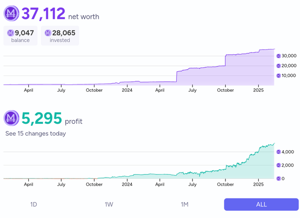

[home](./index.md)
------------------

*author: niplav, created: 2019-04-02, modified: 2023-12-13, language: english, status: in progress, importance: 3, confidence: highly likely*

> __A description of this website and its author.__

About
=====

> Gänzliche Illusionslosigkkeit über das Zeitalter und dennoch ein
rückhaltloses Bekenntnis zu ihm ist ihr Kennzeichen.

*— Walter Benjamin, “Erfahrung und Armut”, 1933*

> But human nature being what it is, there are going to be some people on
the Internet claiming that everything is intrinsically tangled up into a
whole, and another group claiming that different people are allowed to
pick and choose whichever facets they personally like. And the second
group is going to be 100% right just like they always are every single
time that argument happens anywhere.

*— Groon the Walker, [“The Erogamer”](./doc/fiction/the_erogamer_groon_the_walker_2020.epub), 2020*

The Site
--------

### Content

This website contains texts on different topics, ranging from
programming over philosophy to discussions of odd social
behavior, as well as translations, transcriptions, music
recordings and programming projects. It follows the idea of [Long
Content](https://www.gwern.net/About#long-content): pages that are
continually getting refined and updated, never quite completely finished,
but approaching stability. This allows for "perpetual drafts", along
with continuous improvement (similar to a wiki, but mainly edited by
one person)
This is inspired by the idea of Long Content, produced under the motto

> Think [Less Wrong](https://www.lesswrong.com), act [Long Now](https://en.wikipedia.org/wiki/Long_Now_Foundation) and [Suck Less](https://suckless.org).

*— paraphrasing [Gwern Branwen](https://www.gwern.net/), [“About This Website”](https://www.gwern.net/About), 2019*

For this reason, articles are not published by date,
but rather by category, both to make it easier to read
the content of the site in order (i. e. to ["Start at the
Beginning"](https://entirelyuseless.com/2018/06/12/start-at-the-beginning/))
and to structure it by topic and form, rather than to strive for
presenting mainly new information to the reader.

This is also why you might see [multiple](./preagents.html)
[skeletal](./increasing.html) [posts](./leave.html). I've thought about
whether to keep these frames on the index, but decided in favour—it
gives interested people something to hang onto, at my expense of looking
foolish.

Furthermore, the texts are often less
literary essays and more static [computational
notebooks](https://en.wikipedia.org/wiki/Notebook_interface) à la
[Jupyter](https://en.wikipedia.org/wiki/Project_Jupyter#Jupyter_Notebook)
or [Wolfram Mathematica
notebooks](https://en.wikipedia.org/wiki/Wolfram_Mathematica#Notebook_interface)—highly
driven by code, [literate
programming](https://en.wikipedia.org/wiki/Literate_programming)
style (though usually without the interactivity: I execute the code
locally and enter results, which will probably not change, even with
the advent of [WebAssembly](https://en.wikipedia.org/wiki/WebAssembly)
(which would enable a large number of different languages to run in the
browser), because I like to keep the site lean, which runs against the
JavaScript-heavy notebook format).

The content on this website is licensed under [Creative Commons
4.0](https://creativecommons.org/licenses/by/4.0/).

#### Texts

The texts contain mainly new material, both short arguments and
collections of links, but also longer descriptions of new ideas or
analyses of concepts where existing descriptions (e.g. on Wikipedia or
other blogs) were deemed incomplete. It is of course not possible to
avoid replicating existing ideas (it is not possible for me to read
anything beyond a slim part of existing texts on a topic before writing
my own ideas down), but it seems likely that the idea will at least
be new to most readers.

Generally I use the rule: Let `$t$` be the time it would take to write a
text about the idea I was thinking about. Then the time spent researching
whether the idea exists already should stop take at most `$\frac{t}{2}$`.

There are, of course, some texts that were written about existing and
well-known ideas. These were written mainly for my own enjoyment.

##### Not Really a Blog

> A blog (a truncation of "weblog") is a discussion or informational
website published on the World Wide Web consisting of discrete, often
informal diary-style text entries (posts). Posts are typically displayed
in reverse chronological order, so that the most recent post appears
first, at the top of the web page.

*— [English Wikipedia](https://en.wikipedia.org/wiki/English_Wikipedia), [“Blog”](https://en.wikipedia.org/wiki/Blog), 2021*

I don't think this website can be classified as a blog—it strongly
lacks the chronological element of the standard blog format, except for
the [changelog](./changelog.html).

I agree with Gwern that blogs are the victory of the hare over the
tortoise, and I'm deeply unhappy that short-term and unorganized
forms of content aggregation have prevailed on the web over long-term
& maintained sites (culminating in abominations such as discord
servers holding large amounts of local knowledge—with content on
a forum one can at least link or lurk without creating an account,
and potentially just shove it into the internet archive if need
be! "[anicca](https://en.wikipedia.org/wiki/Impermanence), anicca…"). I
do, however, sometimes participate in the guilty pleasure of [ephemeral
shitposting](https://twitter.com/niplav_site).

I'm not big into linguistic prescriptivism (although it
is another one of those guilty pleasures I [occasionally engage
in](./language.html#Better_Names_for_Things)), so call this a blog if you
like. I personally prefer the term simple term "website" or "personal
website". If you want to talk about me as if I had prestige, "essays"
is also okay. (It might send incorrect signals about [how prestigeworthy
I really am](./masturbation_and_attractiveness.html), though).

#### Translations, Transcriptions & Archives

It [seems
possible](https://reducing-suffering.org/ways-writing-valuable/#Old_content_vs_new_content)
that archiving content has a much bigger impact than creating new
content. Given that I write mostly for self-expression, it is a small
factor in most of what I do, but occasionally I transcribe or translate
texts in order to make them more easily accessible.

The translations are often intertwined with the effort of learning other
languages or exercising language skills that would otherwise be forgotten.
For that reason, they can be of quite low quality, so I'm always grateful
for corrections sent my way.

#### Programming Projects

This site also acts as a central place of organisation for different
programming related projects and contributions. That includes
pages representing programming projects, but also [literate
programs](https://en.wikipedia.org/wiki/Literate_programming)
containing code, comments, tests and performance measurements. Most
programs will be written in [a small number of programming
languages](./uses_this.html#Programming_languages).

### Inspiration

I always had a few ideas I thought were worth preserving, and a lot
of ideas I thought would be fun writing down, and also thought about
creating a repository for all my personal projects, but somehow these
never really pushed me completely toward actually setting something
up. A good reason might have been that I only visited sites that were
poorly organised and contained little to no personal long-term content
(either blogs focused on new posts or simply haphazard aggregations
of short ideas (like in the form of [2f30.org](http://2f30.org) or the
[suckless.org wiki](https://suckless.org/wiki/))).

This was changed upon discovering [gwern.net](https://www.gwern.net)
and [reducing-suffering.org](https://reducing-suffering.org): both gave
me a good idea of how a long-term website should look and feel like,
and which kind of content could be published there.

I decided to start writing down my ideas, collecting older texts and
reviewing them to see what was still valuable and what was useless.

My decision to start a website was solidified by [Guzey
2019](https://guzey.com/personal/why-have-a-blog/) and a question on
[/r/slatestarcodex](https://old.reddit.com/r/slatestarcodex/comments/ab3ry1/whats_the_bottleneck_to_more_things_like_slate/):

> What's the bottleneck to more things like "Slate Star Codex" or Gwern's site existing in the world?

*— [arikir](https://old.reddit.com/user/arikr), [“What's the bottleneck to more things like "Slate Star Codex" or Gwern's site existing in the world?”](https://old.reddit.com/r/slatestarcodex/comments/ab3ry1/whats_the_bottleneck_to_more_things_like_slate/) on [/r/slatestarcodex](https://old.reddit.com/r/slatestarcodex/), 2019*

<!--TODO: Lesswrong question: [What makes people intellectually
active?](https://www.lesswrong.com/posts/XYYyzgyuRH5rFN64K/what-makes-people-intellectually-active)-->

I decided that it could not hurt to try and follow through on the idea
of aggregating the stuff I produced, and a possible (but unlikely)
benefit to other people was just a nice addition.

So far, writing for a website has been beneficial to interacting with
several topics: It streamlines my thoughts, makes it possible to take
notes, include code and images and several other advantages. Even if
I had never gotten around to publishing this site, it would still have
been a net positive project for me.

### Style

The style of writing is mostly formal US english.

#### Titles and Headings

* Titles and headers use the [APA style of capitalization](https://blog.apastyle.org/apastyle/2012/03/title-case-and-sentence-case-capitalization-in-apa-style.html)
* MathJax is used only when necessary
* The [Oxford comma](https://en.wikipedia.org/wiki/Serial_comma) is not used
* Code is not syntax-highlighted
* A passive voice is preferred, but I have to get into the flow of writing, so texts may contain active voice as well.
* No footnotes/endnotes (see [entirelyuseless 2015](https://entirelyuseless.com/2015/07/11/are-hyperlinks-a-bad-idea/))
* Quotes have the following style: `*– [Author Name](https://en.wikipedia.org/wiki/Author_Name), [“Chapter” in “Work Name”](https://work-name.com) p.1, Year*`. If the work is not online, link the Wikipedia page.
* Quotes of reddit have the following style:
	* Post: `*– [User_Name](https://old.reddit.com/u/User_Name), [“Post Title”](https://old.reddit.com/r/all/post_title/) in [/r/all](https://old.reddit.com/r/all) (100 upvotes), Year*`
	* Comment: `*– [User_Name](https://old.reddit.com/u/User_Name), [comment](https://old.reddit.com/r/all/post_title/deadbeef) on [“Post Title”](https://old.reddit.com/r/all/post_title/) in [/r/all](https://old.reddit.com/r/all) (100 upvotes), Year*`
* For pages, optimal is to give the page number of the quotation in the linked PDF. If it is not available, the page number written at the bottom of the page is used.
* Link to document: typical style
	* for one author: `[Author Year](./title_author_year.pdf)`
	* for two authors: `[Author & Coauthor Year](./title_author_coauthor_year.pdf)`
	* for more than two authors: `[Author et al. Year](./title_author_et_al_year.pdf)`
	* if the author is unknown, use "anon", if the year is unknown, use "unknown"
	* Tooltip: The title of the document
* The year for a text is usually the best date of the last significant change to the text.
* Link individual chapters from books, not whole books, whole papers are okay.
* Sections every article contains:
	* link back to the index page `[home](./index.md)`
	* metadata on the article, bold&quoted abstract
	* title of the article
	* "See Also" for similar links on this website
	* "External Links" for links to other websites discussing the same (or very similar) ideas
	* "Discussions" for external discussions on the article
* Long numbers written with [SI-postfixes](https://en.wikipedia.org/wiki/Metric_prefix#List_of_SI_prefixes) (k for thousand, m for million, b for billion, t for trillion, and so on).
* If there is a single sentence in a bullet point, don't end it with a dot. If there are several, end them all (even the last one) with a dot.

### Writing Checklist

I use a [script](./code/sitelint) to fix easily catchable mistakes.

* Spell checking using [aspell](http://aspell.net/)
* Check broken markdown
* Broken citations
* [American English](https://en.wikipedia.org/wiki/American_English) ("labour" instead of "labor", "behaviour" instead of "behavior")
* Checking for unbalanced parentheses
* Update the metadata for PDF files according to [Gwern 2022](https://www.gwern.net/Search#post-finding "Internet Search Tips")

> I try to set at least title/​author/​DOI/​year/​subject,
and stuff any additional topics & bibliographic information into the
“Keywords” field. Example of setting metadata:
> 

>	exiftool -Author="Frank P. Ramsey" -Date=1930 -Title="On a Problem of Formal Logic" -DOI="10.1112/plms/s2-30.1.264"
>	-Subject="mathematics" -Keywords="Ramsey theory, Ramsey's theorem, combinatorics, mathematical logic, decidability,
>	first-order logic,  Bernays-Schönfinkel-Ramsey class of first-order logic, _Proceedings of the London Mathematical
>	Society_, Volume s2-30, Issue 1, 1930-01-01, pg264-286" 1930-ramsey.pdf
> 

*—[Gwern Branwen](https://www.gwern.net/Links), [“Internet Search Tips”](https://www.gwern.net/Search), 2022*

I probably won't put as much information into the "Keywords" section, it feels abusive to me to stuff it like that. I also despaired about how to format the [DOI](https://en.wikipedia.org/wiki/Digital_Object_Identifier), Wikipedia says

> Contrary to the DOI Handbook,
[CrossRef](https://en.wikipedia.org/wiki/CrossRef), a major DOI
registration agency, recommends displaying a URL (for example,
`https://doi.org/10.1000/182`) instead of the officially specified format
(for example, [`doi:10.1000/182`](https://doi.org/10.1000/182))

*—[English Wikipedia](https://en.wikipedia.org/wiki/English_Wikipedia), [“Digital Object Identifier”](https://en.wikipedia.org/wiki/Digital_Object_Identifier), 2021*

After some thought, I have decided to go with the handbook recommendation.

<!--
* links for authors to Wikipedia
* capitalization of headings
* proselint
* fixing 404'ed links
* twitter links are nitter.net links
* books are linked to goodreads page (instead of, say Amazon or Wikipedia)
-->

<!--TODO: What use "", “”, »«, ›‹ and ‘’ for? What should they differentiate?-->

### Organisation

For every text, there are several tags attached to it (mainly taken from
[Gwern 2019](http://www.gwern.net/About#confidence-tags "About This Website")).

#### Author

The "author" tag is quite self-explanatory, the field is the original author
of the piece. This is only relevant for translations and transcriptions.

Similarly, there are two optional tags: "translator" for the person
who translated the text, and "transcriptor" for the person who transcribed
the text. The former can be me or a professional translator, the latter
is always me.

#### Dates

A page has several date tags. The creation date ("created") shows the
date when the text was first created (if the text is by me) or when
the text was first published (if the text is by another author). If it
is unclear when the text was _first_ published, I give my best estimate
for the year, and set the date to the first of January of that year. The
"modified" tag always shows the date of the last modification by me. Both
the "created" and the "modified" tag are present on every text.

If the text is a translation, the "translated" tag shows the date when
I started working on the translation. Similarly, the also optional "transcribed" tag
shows when I started working on the transcription of the text.

The date format is [ISO 8601](https://en.wikipedia.org/wiki/ISO_8601),
rarely using a "-" as a negative sign for a year before the [Common
Era](https://en.wikipedia.org/wiki/Common_Era).

#### Language

The language tag shows the languages the body of the text is written in
(if necessary, separated by commas). Currently, there are only texts in
English and German, but the tag may be one of the following:

* "english"
* "german"
* "french"
* ["esperanto"](https://en.wikipedia.org/wiki/Esperanto)
* ["latin"](https://en.wikipedia.org/wiki/Latin)

<!--
* ["serbocroatian"](https://en.wikipedia.org/wiki/Serbo-Croatian)
* ["lojban"](https://en.wikipedia.org/wiki/Lojban)
* ["ithkuil"](https://en.wikipedia.org/wiki/Ithkuil)
* ["toki pona"](https://en.wikipedia.org/wiki/Toki_Pona)
-->

#### Confidence

The confidence tags are also taken mainly from [Gwern
2019](https://www.gwern.net/About#confidence-tags), and describe how
much I believe that the content of a post will turn out to be correct.

I made some additions to the list of tags which I thought were useful:
"translation" for translations, "transcription" for transcriptions
(digitalizing of a book or article written on paper), "theory" for
unfalsifiable ideas that nonetheless might create new perspectives
and approaches, "other" for texts that might not fit into any of these
categories.

The complete list of confidence tags is as follows:

* "certain"
* "highly likely"
* "likely"
* "possible"
* "unlikely"
* "highly unlikely"
* "remote"
* "impossible"
* "log"
* "fiction"
* "theory"
* "opinion"
* "translation"
* "transcription"
* "emotional"
* "other"

#### Status

The status tags indicate the state of progress for a piece.

They may be any of the following (in increasing order of
being-finished-ness):

* "notes"
* "draft"
* "in progress"
* "on hold"
* "maintenance"
* "finished"
* "abandoned"

But, truth be told, nothing on here is ever finished, even when it is
christened with the "finished" tag.

#### Importance

The importance tags are also taken from [Gwern
2019](https://www.gwern.net/About#importance-tags), but I don't do any
resorting, both because that would be too much effort and because I
believe that most of the content I produce is not especially important.

The importance tag is a number `$n \in [10] \subset \mathbb{N}$`.

### Implementation

The website is built writing the articles in
[Markdown](https://en.wikipedia.org/wiki/Markdown)
and them compiling them to standard HTML using
[`markdown_py`](https://pypi.org/project/Markdown/). Mathematical formulae
are typeset using [MathJax 2](https://en.wikipedia.org/wiki/MathJax). It
only uses only minimal CSS (highlighting code and quotes, centering the
text and limiting line length) and very litte JavaScript, mainly for
MathJax and converting headers to anchor links.

### Influences

This site is greatly influenced by several websites: The
style of organisation and presentation is shamelessly
influenced by [gwern.net](https://www.gwern.net) and
[reducing-suffering.org](https://reducing-suffering.org/)
(although achieving similar quality in content, breadth and
depth will be diffficult). I try to follow the concept of [Long
Content](https://www.gwern.net/About#long-content) and extensive
presentation.

My views on philosophy are heavily influenced by the [rationalist
movement](https://lesswrong.com), and I stay faithful to
the ideas of the movement by disagreeing sharply with it on
several points. The general principles I broadly agree with are
[consequentialism](https://plato.stanford.edu/entries/consequentialism/),
[bayesian
epistemology](https://plato.stanford.edu/entries/epistemology-bayesian/),
[metaphysical
nominalism](https://plato.stanford.edu/entries/nominalism-metaphysics/),
[reductionism](https://en.wikipedia.org/wiki/Reductionism) and [scientific
naturalism](https://plato.stanford.edu/entries/naturalism/#MetNat)
(but likely not
illusionism/[eliminativism](https://longtermrisk.org/the-eliminativist-approach-to-consciousness/)
about consciousness).

My view on ethics is very consequentialism-focused, but with a large
amount of moral uncertainty thrown into the mix. Within consequentialism,
my views are similar to (and influenced by) the idea of [suffering focused
ethics](https://foundational-research.org/the-case-for-suffering-focused-ethics/),
especially the writings at
[reducing-suffering.org](https://reducing-suffering.org/).

In regard to software, my views are quite
similar to those of the minimalist unix and [Plan
9](https://en.wikipedia.org/wiki/Plan_9_from_Bell_Labs) supporters at
[suckless.org](https://suckless.org) and [cat-v.org](http://cat-v.org).

### Miscellania

Various measures of size for the website (excluding automatically generated content and transcriptions):

	$ cat (l *.md | g -v 'chrono|tao|_list|exercise_log|declaration') | pr | grep -Eo 'Page [0-9]+' | tail -1
	Page 472
	$ wc (l *.md | g -v 'chrono|tao|_list|exercise_log|declaration') | tail -1
	26416  146341 1072198 total

Benford's law:

	$ grep -ho '[0-9]' *.md | sort | uniq -c | sort -n | tail -10
	6106 4
	7128 9
	7130 6
	7297 8
	7423 3
	7750 5
	7803 7
	26734 1
	28876 2
	44173 0

(Note: as of the time of writing, the list of numbers above is not
iteratively stable, that is, after I update the numbers, the distribution
of digits on my website changes slightly (since the numbers above are
part of the website), but it does not reach fixation at some point,
but rather cycles).

### Friends of the Site

* [Ethan](https://210ethan.github.io): Pure Everests, with careful diligence
* [Tetraspace West](https://thetetra.space): Land value tax : repetitive Georgists :: Conditional prediction markets : That place for Quaternions
* [Skaði þjazidottir](https://ulthar.xyz): Gather some stoic people with guns, who have written low-level code
* [Nyx](https://nyxus.xyz/): Brightly empathetically menacing (we all know she's just joking)
* [Andrew McKenzie](http://andrewtmckenzie.com/), who also writes essays on brain preservation [here](http://andrewtmckenzie.com/) and notes on neurobiology [here](https://neurobiology.substack.com/)
<!--TODO: add harsimony, 1a3orn, others?-->

The Author
----------

> Ich bin ein Teil des Teils, der anfangs alles war,  
ein Teil der Finsternis, die sich das Licht gebar,  
das stolze Licht, das nun der Mutter Nacht  
den alten Rang, den Raum ihr streitig macht.

*—[Johann Wolfgang von Goethe](https://en.wikipedia.org/wiki/Johann_Wolfgang_von_Goethe), [Faust 1, Studierzimmer. (Mephistopheles)](https://en.wikipedia.org/wiki/Faust_I), 1808*

Who I am is not terribly important.

### Track Records

I think that track records are [great &
underrated](http://www.overcomingbias.com/2006/12/the_80_forecast.html),
so insofar this website isn't already a clear display of my
(in)competence, I'll also share my various track records to make
it easier for others to determine whether I'm to be taken serious as a
source of information.

#### Forecasting

<!--TODO: update & add Fatebook-->

Scores (as of 2023-08-05):

* [PredictionBook](https://predictionbook.com/users/niplav)
	* Brier score (131 questions, mostly forecasts about the outcomes of my own research, and success from daygame approaches): 0.2365

* [Metaculus](https://www.metaculus.com/accounts/profile/112493/)
	* Brier score (281 binary questions, basically uniformly sampled from all Metaculus questions): 0.116

	* Continuous log score (204 questions, also uniformly sampled): 1.35

* [Manifold markets](https://manifold.markets/NiplavYushtun)
	* Profit: M̶602
	* Net worth: M̶4016
	* Balance: M̶238
	* Calibration: Grade C+, Score -4.2

### Pronouns

I'm most happy with they/them.

### Psychological Characteristica

My Big Five are:

* Openness: 79%
* Conscientiousness: 46%
* Extraversion: 50%
* Agreeableness: 54%
* Neuroticism: 19%

From a test somewhere on the internet a while ago, I just wrote down
the results.<!--TODO: redo with a better source-->

The last g-loaded test I took (in high school) put me at ~110, which
seems about right.

<!--TODO: Crocker-->

### Elsewhere on the Internet

* [Github](https://github.com/niplav)
* [Lesswrong](https://www.lesswrong.com/users/niplav)
* [Effective Altruism Forum](https://forum.effectivealtruism.org/users/niplav)
* [Metaculus](https://www.metaculus.com/accounts/profile/112493/)
* [PredictionBook](https://predictionbook.com/users/niplav)
* [Reddit](https://old.reddit.com/u/niplav)
* [Wikipedia](https://en.wikipedia.org/wiki/User:Niplav)
* [Fediverse](https://schelling.pt/@niplav)
* [Twitter](https://twitter.com/niplav_site)

### Contact

Contact address is ([rot13ed](https://en.wikipedia.org/wiki/ROT13))
`echo avcyni@cbfgrb.arg | tr a-zA-Z n-za-mN-ZA-M`.

PGP public key:

	-----BEGIN PGP PUBLIC KEY BLOCK-----
	mQINBGAoC4kBEAC0XVBeSsRTmGMJZTruoTBdhCp/r7s6TljIuBSTA7hfES6X5Fzr
	im+g2fYBG3jzyOpbqAO4a9U+5IiVd/QqJR4o262jjQ7dOUYR+XECy0JR/ZutWDiH
	JGFDlT8susQN6GIGdwnPNFsp0sZu+KeY2VuYSFvTO0RmZF02ZwypHAZQnvliZUjL
	vwLnmYst/8HFEUry53fWrb2EbO4Cpus7rNS5BSr3k6AyKz9ZQIHpCptXIJeoam4a
	Bu+3llMWKpUzbH8ctJU/b1Kwmu+kHkokI96nsC2ZxjB0WG8IKGfR6irYVLU+sJ2w
	D7DzrIxfzQExx9L1pgy0NuzpM4Fi2j6nX/FGCBXKEOhl17Eydm1M5eZnDZILFbdN
	TEyjT67PFxD644KMNenRwFi2fWpTaLJiRsorglu1RpWr8GQR7KJ+JfA2vjAEiNjb
	FOf7425RvvFHyipG42TWq9gVz77/QjnHhkhjuo2EmqOQBH7ya+DcxCgW1Uhn7dlI
	AW+YQ8yU1JmAOY1kcA4HfpnRvhh1BK5waySdANSqFkUOTl4xyfKuUEiUlX/gtSrq
	EeWDtMKopEXDpwQ3OgdMCJgluO+mf6AV0SHY+0FpL9MNYKhZX7Ivt4nBCcQIxNki
	Kayc6jsbWCX8tfTprXTBJtV5kT99GWUHO2Hhrf4NBOytLzErbtvZTQuiNwARAQAB
	tCJOaXBsYXYgWXVzaHR1biA8bmlwbGF2QHBvc3Rlby5uZXQ+iQJUBBMBCAA+FiEE
	G/druOT8GFGN/Br3ivrxA5LeB2IFAmAoC4kCGwMFCRLMAwAFCwkIBwIGFQoJCAsC
	BBYCAwECHgECF4AACgkQivrxA5LeB2LULhAAiprJtd+EBzC33wflO81QjoWukdGc
	GwAAEJ8WcghoSWPx7Yx957xXgdZ6CF5HFcBuXjIvyDs4Dr7+wEEtTQOfltwt92QD
	t/f0LXKyOFG4NxCzyAar9u8jmKt90zrQ9/vOsKlRmX/Bp5tMXPoMS12lvwVY8wek
	evyrplLjhFMwvaHVdE9PF0/oZ74XmiYGwdWkZWgM5B4w4vBBFz+rSFVMYZiIr72I
	QQm/p/8b/eZfSymBRLPWBWTcU/kDojSsi6rq9pf0IVnb4xMbKUrmwmZ2pdbPL4yM
	d9t3KutOUKYkYXT8Llw1YBUboWVVo5D31U5sdIW8Kdoc19i0mrRU4Itmx+ZIhmXu
	ZTi0zkUcYB6lXZns5MMEf5Hdo4TSGDyRVmRQ9wcUEWHQ2R16V16GtTSC1rqBz4Q7
	XUiiSB32EhCghwRPeIcvqCCuKftvJ0UOtXpaRATM3WR5Ra81V4TvSiQEci5pKEZC
	mcLYDqy59fxi4InCgiKy3ibPDbddodSxSKSzI1SxZRsF25f8dOHlEcqLC6xJi5KK
	gxIGc7YvesKZM8ABGURvmHw0v2ZYEzJqpJ1XvSUOgADShdoU/2ktIA3rw2TVQ+SS
	1ySJTJ/zbqa4m1X9EJsyjLRm1Ye0UIR0sxa5qvmJYC3TfpYURpYw4LRLs5a2Q1Wy
	eTZHbiAzi2RUe4G5Ag0EYCgLiQEQAM4ck4+OTjNReRGkwLZDH/PP1djiwaLlzu3H
	gYv5v1yRrL13II2IdtuERqhcuc1S7bDbPbBjQ5R9GadvwvTIjE4m7d/HrLbPEzA/
	k1taCN56IEFrdhLRF7Ux2d4D7RixKyCFnXQzFOcO93QXNixOERvebzrMPF41I7Xo
	oM2ZBbTkEx7dbjULT2QgOSztCycCl9bEo0FinIi1A5w7v0bXIrOxrdt4wD+4ROn5
	+pNwQozcWd2JlBv7p8HSDGRpN92SMOCasUfHrrdqVfH+8sw/02SxQBWlmkfcOmi/
	cRlsOW4yFB0agMgO+YCmIJcoSaancX6FSkTQ+bdf0bLikDIQdv97z6eNVayuIyvQ
	p9Vlk2OEqO1Hoshkq3SjM5/9BStmlPsMCBbeGHJld7Dy3wCbDLH+05ZEA+cP/ttd
	6dPX81V2Istaz3EQJIBMvgsOacFdiw74dvsQI2l5Mu5G80H+vRwpUpmm61q9aCoy
	LXrua80pCP/6hioN2mcHa/xocNTKFP26umpZedoaIHbhd3yZAPOIByQGfxc3v92N
	wgR6vTHP8ZtfG2tSibBrrgMstbaX73MxAjwotZ1sMf6jbldZ0M/lp7YlbS07Jc6X
	jVsoH3vIwyZKLNqJdH7XRxZuehqjIec3xwGYt0UWC6GymIrqRf3HTnsUpuXZkypX
	mNfiV2NxABEBAAGJAjwEGAEIACYWIQQb92u45PwYUY38GveK+vEDkt4HYgUCYCgL
	iQIbDAUJEswDAAAKCRCK+vEDkt4HYrjSEACZ/3IrRqKAM6AJu79eC/Yqmp5LmiGB
	jFm+eOvonzfDSYD1WHlrkmOG/Vuq4DP6FO5ehDYbABMcjC2UbfefeIIPB5VQBAxn
	4p1l9jyqEGbzWyZ9C+jm+LV9KkPydfYyi6cErw8jWFrbjN38zX/vO6EH4JORgXw6
	XCer2SzJ4R6qET31ifELx/Gd4voKtYNio9SVxxKALb5b60wLwJbaB+NOYClWg7Sl
	hgLmRI01a+gWPmuRYANxargm4Oj+Jgc5yNGjHDwV8BNmdEOkv37+HfIMV1Oi+WT3
	xMPOyYtl7cU2F0DPFvKKH69V2QNeYbIqgQ89VdMjzgk8AfAmWSwhhKwvDS19q6Xv
	9CHV8qi/OY3JUqmVCSDzSXlBsIkZu9jkf9XuHjCFs0dp24QwVc1bF3JhwC1poQvI
	uYiWvnOHrQmtpopOvEy7E6dpkFL8fiJKO2AHyQ/buhNkTu3dB+9CYExFitXSfQAo
	/gsiCpt+1OOxOqPy4aCJaoJrbI1k2wLLFYf0REp0fArzY6ugcWPmbnOmWkn9EdW6
	zUl9fXDN0fVgmnKsF0F61RJcEGsPisXCd4H4xluolqOZPis/GwGmKEldS7QKRPq5
	A5p2Q1rGc1lUcpgqaOV6dhEutDIUMPTBG+YNKreqkBc5l3McOpebCi4H6k9SWgOO
	qM2WFPlVvENkjQ==
	=S026
	-----END PGP PUBLIC KEY BLOCK-----
