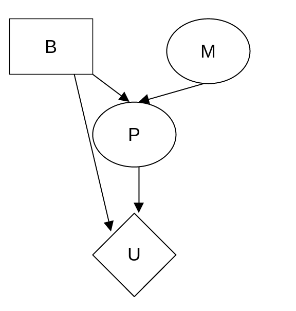

[home](./index.md)
-------------------

*author: niplav, created: 2021-01-21, modified: 2021-03-31, language: english, status: in progress, importance: 2, confidence: likely*

> __In which I solve exercsise from [“Artificial Intelligence: A Modern
Approach”](https://en.wikipedia.org/wiki/Artificial_Intelligence:_A_Modern_Approach),
written by [Stuart
Russell](https://en.wikipedia.org/wiki/Stuart_J._Russell) and [Peter
Norvig](https://en.wikipedia.org/wiki/Peter_Norvig). I use the 3rd edition
from 2010, because the exercises for the 4th edition were moved online.__

Solutions to “Artificial Intelligence: A Modern Approach”
=========================================================

Chapter 1
----------

### 1.1

> Define in your own words: (a) intelligence, (b) artificial intelligence,
(c) agent, (d) rationality, (e) logical reasoning

#### Intelligence

The word “intelligence” is mostly used to describe a property of
systems. Roughly, it refers to the ability of a system to make decisions
that result in consequences are graded high according to some metric,
as opposed to decisions that result in consequences that are graded low
according to that metric.

#### Artificial Intelligence

“Artificial intelligence” refers to systems designed and implemented
by humans with the aim of these systems displaying intelligent behavior.

#### Agent

An “agent” is a part of the universe that carries out goal-directed
actions.

#### Rationality

The usage of the word “rationality” is difficult to untangle from
the usage of the word “intelligence”. For humans, “rationality”
usually refers to the ability to detect and correct cognitive errors
that hinder coming to correct conclusions about the state of the world
(epistemic rationality), as well as the ability to act on those beliefs
according to ones values (instrumental rationality). However, these
seem very related to “intelligence”, maybe only being separated by a
potentiality–intelligence being the potential, and rationality being
the ability to fulfill that potential. One could attempt to apply the
same definition to artificial intelligences, but it seems unclear how
a lawful process could be more intelligent, but is not.

#### Logical Reasoning

“Logical reasoning” refers to the act of deriving statements from
other statements according to pre-defined rules.

### 1.3

A reflex action is not intelligent, as it is not the result of a
deliberate reasoning process. According to my personal definition above
(and also the definition given in the text), it is also not rational
(since the action is not guided by a belief).

Common usage of the term “rational” indicates that
people would describe this reflex as a rational action. I
believe this is fine, and words are just pointers to [clusters in
thing-space](https://www.lesswrong.com/posts/jMTbQj9XB5ah2maup/similarity-clusters)
anyway.

### 1.4

> Suppose we extend Evans’s ANALOGY program so that it can score 200
on a standard IQ test. Would we then have a program more intelligent
than a human? Explain.

No. (At least not for any useful definition of intelligence). IQ
tests as they currently exist measure a proxy for the actual ability
to perform complex tasks in the real world. For humans, geometry
puzzles correlate (and predict) well with such tests ([Sternberg et al.
2001](./doc/psychology/iq/the_predictive_value_of_iq_sternberg_2001.pdf "The Predictive Value of IQ")).

However, this proxy breaks down once we start optimising for it (as
in the case on extending ANALOGY). We can now not predict real-world
performance on arbitrary goals given the result of the IQ test performed
on ANALOGY anymore.

### 1.5

> The neural structure of the sea slug Aplysia has been widely studied
(first by Nobel Laureate Eric Kandel) because it has only about 20,000
neurons, most of them large and easily manipulated. Assuming that the
cycle time for an Aplysia neuron is roughly the same as for a human
neuron, how does the computational power, in terms of memory updates
per second, compare with the high-end computer described in Figure 1.3?

<!--TODO: un-fuck the dimensional analysis here-->

Given the cycle time of `$10^{-3}$` seconds, we can expect

	$$\frac{2*10^{4} \hbox{ neurons}}{10^{-3}\frac{\hbox{s}}{\hbox{update}}}=2*10^{7} \frac{\hbox{neuron updates}}{s}$$

which is seven orders of magnitude lower than a supercomputer. Aplysia
won't be proving any important theorems soon.

<!--
If Aplysia has 20k neurons, then it can be expected to have

`$2*10^{4}\hbox{ neurons }*\frac{10 \hbox{ to } 10^{5} \hbox{ synapses }}{\hbox{neuron}}=2*10^{5}\hbox{ to } 2*10^{9} \hbox{ neurons}$`
-->

Chapter 2
---------

### 2.1

> Suppose that the performance measure is concerned with just the first
T time steps of the environment and ignores everything thereafter. Show
that a rational agent’s action may depend not just on the state of
the environment but also on the time step it has reached.

Example: Let's say that we are in an environment with a button,
and pressing the button causes a light to go on in the next timestep.
The agent cares that the light is on (obtaining 1 util per timestep the
light is on for the first T timesteps).

However, pressing the button incurs a cost of ½ on the agent.

Then, at timestep T, the agent will not press the button, since it does
not care about the light being on at timestep T+1, and wants to avoid
the cost ½. At timesteps `$<T$` it will press the button, with the light
currently being on, at timestep T it will not press the button, under
the same environmental conditions.

### 2.3

> For each of the following assertions, say whether it is true or
false and support your answer with examples or counterexamples where
appropriate.

> a. An agent that senses only partial information about the state cannot
be perfectly rational.

False. An agent that senses only partial information about the state could
infer missing information by making deductions (logical or statistical)
about the state of the environment, coming to full knowledge of the
environment, and making perfectly rational choices using that information.

For example, a chess-playing agent that can't see exactly one square
could infer the piece standing on that square by observing which piece
is missing from the rest of the board.

> b. There exist task environments in which no pure reflex agent can
behave rationally.

True. In an environment in which the next reward depends on the current
state and the previous state, a simple reflex agent will get outperformed
by agents with an internal world-model.

An example for this is a stock-trading agent: The future prices of stocks
doesn't just depend on the current prices, but on the history of prices.

> c. There exists a task environment in which every agent is rational.

True. It is the environment where the agent has no options to act.

> d. The input to an agent program is the same as the input to the
agent function.

Not sure. Both the agent function and the agent program receive percepts,
but sometimes the agent program also needs information that is not a
percept (e.g. priors for bayesian agents). Is that counted as input,
or simply as program-specific data?

> e. Every agent function is implementable by some program/machine
combination.

False. An agent function could be uncomputable
(e. g. [AIXI](https://en.wikipedia.org/wiki/AIXI)), and therefore not
be implementable on a real-world machine.

> f. Suppose an agent selects its action uniformly at random from the
set of possible actions. There exists a deterministic task environment
in which this agent is rational.

True, that would be the environment in which every action scores equally
well on the performance measure.

> g. It is possible for a given agent to be perfectly rational in two
distinct task environments.

True. Given two agents `$A_X$` and `$A_Y$`, and two task environments
`$X$` (giving percepts from the set `$\{x_1, \dots, x_n\}$`) and `$Y$`
(giving percepts from the set `$\{y_1, \dots, y_n\}$`), with `$A_X$` being
perfectly rational in `$X$` and `$A_Y$` being perfectly rational in `$Y$`
an agent that is perfectly rational in two distinct task environments
could be implemented using the code:

	p=percept()
	if p∈X
		A_X(p)
		while p=percept()
			A_X(p)
	if p∈Y
		A_Y(p)
		while p=percept()
			A_Y(p)

> h. Every agent is rational in an unobservable environment.

False. Given an unobservable environment in which moving results in
the performance measure going up (e.g. by knocking over ugly vases),
agents that move a lot are more rational than agents that do not move.

> i. A perfectly rational poker-playing agent never loses.

False. Given incomplete knowledge, a rational poker-playing agent can
only win in expectation.

### 2.4

> For each of the following activities, give a PEAS description of the
task environment and characterize it in terms of the properties listed
in Section 2.3.2

> * Playing soccer.

Performance measure: `$goals_{own}-goals_{enemy}$`; environment: soccer
field; actuators: legs & feet, arms & hands (for goalkeeper), torso,
head; sensors: vision, hearing, tactile

Multi-agent, continuous, partially observable, fully known (both rules
of soccer and classical mechanics underlying the ball & other players,
although fluid dynamics of air-player interaction is probably tricky),
sequential, dynamic, stochastic (in theory deterministic, but practically
stochastic, very small unobservable effects can have large consequences)

> * Exploring the subsurface oceans of Titan.

Performance measure: surface explored; environment: subsurface
environments of Titan; actuators: motor with propeller, arms to grab
things, perhaps wheels; sensors: radar, vision (if the agent has inbuilt
light generation)

Single-agent, continuous, partially observable, partially known (in case
there's actually life there, we don't know how it behaves), sequential,
dynamic (maybe not very dynamic, but there might be currents/geothermal
vents/life), stochastic.

> * Shopping for used AI books on the internet.

Performance measure: `$\frac{n_{books}}{\sum_{b \in books} p(b)}$` (price
per book); environment: web browser; actuators: keyboard, mouse; sensors:
vision of the screen, location of mouse, state of keys on keyboard pressed

Multi-agent (if bidding against others), discrete, partially observable,
fully known (unless bidding against others, since that would need model
of human psychology), sequential (money in bank account is not reset),
static (again, unless bidding against others), deterministic

> * Playing a tennis match.

Performance measure: `$points_{own}-points_{enemy}$` (I think tennis
uses rounds? Maybe `$winrounds_{own}-winrounds_{enemy}$`); environment:
tennis court; actuators: arms, tennis racket, wheels/legs to move around;
sensors: vision, hearing

Multi-agent, continous, fully observable, fully known (though caveats
similar to soccer apply), episodic (after each round there's a reset,
right?), dynamic, stochastic (similar caveats as in soccer example)

> * Practicing tennis against a wall.

Performance measure: number of balls hit; environment: place with wall;
actuators: arms, tennis racket, wheels/legs to move around; sensors:
vision, hearing

Single-agent, continous, fully observable, fully known (though caveats
similar to soccer apply), episodic, dynamic, stochastic (similar caveats
as in soccer example)

> * Performing a high jump.

Performance measure: height of the jump; environment: a place with a
high/nonexistent ceiling; actuators: legs; sensors: tactile sensors in
feet, height sensor

Single-agent, continuous, fully observable (unless wind), fully known
(although, again, caveats as in soccer), episodic (unless falling over
and not being able to get up again), static, deterministic (unless wind)

> * Knitting a sweater.

Performance measure: beauty, robustness and comfortableness of the
sweater; environment: a cozy sofa in the living room; actuators: needles
for knitting; sensors: tactile sensors for the needles, visual sensors
for observing the sweater

Single-agent, continuous, fully observable, fully known (again using
classical mechanics), sequential (unless unraveling completely & starting
again is an option), static, deterministic

> * Bidding on an item at an auction.

Performance measure: `$\frac{nitems}{\sum_{i \in items} price(item)}$`;
environment: bidding platform/auction house; actuators: text entering for
online/audio output for bidding; sensors: vision of the screen/auditory
in the case of the auction house, visual to observe the items presented

Multi-agent, discrete (money is usually discrete), fully observable,
partially known (other bidders might be human and too complex to fully
model), sequential (account balance persistent throughout auction),
dynamic, deterministic

Chapter 3
---------

### 3.1

> Explain why problem formulation must follow goal formulation.

The goal formulation applies first & foremost to the real world. The
problem formulation, however, then translates this real-world goal into
a format that computers can deal with. Formulating the problem before
the goal has no “anchor” as to what to formalize, the goal gives
information on what to concentrate on.

### 3.2

> Your goal is to navigate a robot out of a maze. The robot starts in the
center of the maze facing north. You can turn the robot to face north,
east, south, or west. You can direct the robot to move forward a certain
distance, although it will stop before hitting a wall.

> a. Formulate this problem. How large is the state space?

Assumption: The maze has size `$n*m$`. Size of the state space: `$4*n*m$`.

> b. In navigating a maze, the only place we need to turn is at the
intersection of two or more corridors. Reformulate this problem using
this observation. How large is the state space now?

Let i be the number of intersections. Then there are `$2*((n*m)-i)+i*4$`
different states (2 for each non-intersection state (walking forward
or backward, and 4 for each intersection state, for each direction the
agent can go).

However, this does not consider dead ends or intersections where there
are only 3 valid directions. If there are `$i_d$` dead ends, `$i_3$`
intersections with 3 possible directions, and `$i_4$` intersections
with 4 possible directions, the number of possible states is instead
`$i_d+3*i_3+4*i_4+2*((n*m)-(i_d+i_3+i_4))$`.

> c. From each point in the maze, we can move in any of the four
directions until we reach a turning point, and this is the only action
we need to do. Reformulate the problem using these actions. Do we need
to keep track of the robot’s orientation now?

Since we don't have to turn before moving, we're equivalent to an
unchanging directionless dot (only the position changes). We don't
need to keep track of the orientation anymore, since we don't have to
a specific direction before moving.

> d. In our initial description of the problem we already abstracted
from the real world, restricting actions and removing details. List
three such simplifications we made.

Only 4 different directions allowed, not being able to run into walls,
the robot will move the given distance (and not experience battery
failure/fall into a hole etc.).

Chapter 6
---------

### 6.1

> How many solutions are there for the map-coloring problem in Figure
6.1? How many solutions if four colors are allowed? Two colors?

* 2 colors: 0 possible solutions
* 3 colors: `$3*3*2=18$` possible solutions (TA and SA are free, and then the WA-NT-Q-NSW-V chain can only be colored with 2 different colors, which have to be alternating)
* 4 colors: `$4*4*(3*2*2*2*2)=768$` possible solutions (again, TA and SA are free, and then WA-NT-Q-NSW-V have 3 colors left, but no same color twice, which means 3 colors for the first option, and two for each successor)

### 6.5

> Solve the cryptarithmetic problem in Figure 6.2 by hand, using
the strategy of backtracking with forward checking and the MRV and
least-constraining-value heuristics.

 A cryptarithmetic problem. Each letter stands for a distinct digit; the aim is to find a substitution of digits for letters such that the resulting sum is arithmetically correct, with the added restriction that no leading zeroes are allowed. (b) The constraint hypergraph for the cryptarithmetic problem, showing the Alldiff constraint (square box at the top) as well as the column addition constraints (four square boxes in the middle). The variables C1, C2, and C3 represent the carry digits for the three columns.")

Variables: `$X=\{F, T, U, W, R, O, C_1, C_2, C_3\}$`  
Constraints:

	$$C=\{\langle O, R \rangle: O+O \mod 10=R, \\
	\langle W, U, C_1 \rangle: W+W+C_1 \mod 10=U, \\
	\langle T, O, C_2 \rangle: T+T+C_2 \mod 10=O, \\
	\langle C_1, O \rangle: C_1=1 \hbox{ if } O+O>9 \hbox { else } 0, \\
	\langle C_2, W, C_1 \rangle: C_2=1 \hbox{ if } W+W+C_1>9 \hbox { else } 0, \\
	\langle C_3, T, C_2 \rangle: C_3=1 \hbox{ if } T+T+C_2>9 \hbox { else } 0, \\
	\langle F, C_3 \rangle: F=C_3\\
	\langle F, T, U, W, R, O \rangle: Alldiff(F, T, U, W, R, O)\}$$

Domains: `$\{0..9\}$` for `$\{F, T, U, W, R, O\}$`, and `$\{0, 1\}$` for `$\{C_1, C_2, C_3\}$`.

Replacing the Alldiff constraint with binary constraints:

	$$C := (C \backslash \{\langle F, T, U, W, R, O \rangle: Alldiff(F, T, U, W, R, O)\}) \cup \\{ \langle x_1, x_2 \rangle: x_1 \not = x_2 | x_1, x_2 \in \{ F, T, U, W, R, O \} }$$

Replacing the other trinary constraints with binary ones:

New variables `$X_1, X_2 \in [10] \times \{0, 1\}$`.

We remove the constraints

	$$\{\langle W, U, C_1 \rangle: W+W+C_1 \mod 10=U, \\
	\langle T, O, C_2 \rangle: T+T+C_2 \mod 10=O, \\
	\langle C_2, W, C_1 \rangle: C_2=1 \hbox{ if } W+W+C_1>9 \hbox { else } 0, \\
	\langle C_3, T, C_2 \rangle: C_3=1 \hbox{ if } T+T+C_2>9 \hbox { else } 0 \} $$

and add some constraints to replace the trinary with binary constraints on
`$X_{1 \hbox{ to } 4}$`. The result looks like this:

	$$ C := \{ \langle X_1, U \rangle: U=fst(X_1)+fst(X_1)+snd(X_1) \mod 10, \\
	\langle X_2, O \rangle: O=fst(X_2)+fst(X_2)+snd(X_2) \mod 10, \\
	\langle X_1, C_2 \rangle: C_2=1 \hbox{ if } fst(X_1)+fst(X_1)+snd(X_1)>9 \hbox { else } 0, \\
	\langle X_2, C_3 \rangle: C_3=1 \hbox{ if } fst(X_2)+fst(X_2)+snd(X_2)>9 \hbox { else } 0, \\
	\langle X_1, W \rangle: W=fst(X_1), \\
	\langle X_1, C_1 \rangle: C_1=snd(X_1), \\
	\langle X_2, T \rangle: T=fst(X_2), \\
	\langle X_2, C_2 \rangle: C_2=snd(X_2), \\
	\langle O, R \rangle: O+O \mod 10=R, \\
	\langle C_1, O \rangle: C_1=1 \hbox{ if } O+O>9 \hbox { else } 0, \\
	\langle F, C_3 \rangle: F=C_3 \} \\ \cup
	\{ \langle x_1, x_2 \rangle: x_1 \not = x_2 | x_1, x_2 \in \{ F, T, U, W, R, O \} $$

Variables sorted by domain size: `$X_1: 20, X_2: 20, F: 10, T: 10, U: 10, W: 10, R: 10, O: 10, C_1: 2, C_2: 2, C_3: 2$`

Variables sorted by degree: `$O: 8, W: 6, T: 6, R: 6, U: 6, F: 6, X_1: 4, X_2: 4, C_1: 2, C_2: 2, C_3: 2$`

Now, one can do the actual searching and inference:

* Assign (tie between `$C_1, C_2, C_3$` in remaining values, choosing `$C_1$` randomly): `$C_1=1$`
	* Infer: `$X_1 \in [10] \times \{1\}$`
	* Infer: `$O \in \{5,6,7,8,9\}$`
	* Infer: `$X_2 \in \{2,3,4,7,8,9\} \times \{0, 1\}$`
	* Infer: `$R \in \{0,2,4,6,8\}$`
	* Infer: `$T \in \{2,3,4,7,8,9\}$`
	* Assign: (tie between `$C_2, C_3$` in remaining values, choosing `$C_2$` next): `$C_2=1$`
		* Infer from `$C_2$`: `$X_1 \in \{5,6,7,8,9\} \times \{1\}$`
		* Infer from `$C_2$`: `$X_2 \in \{2,3,4,7,8,9\} \times \{1\}$`
		* Infer from `$X_1$`: `$U \in \{1, 3, 5, 7, 9\}$`
		* Infer from `$X_1$`: `$W \in \{5,6,7,8,9\}$`
		* Infer from `$X_2$`: `$O \in \{5,7,9\}$`
		* Infer from `$X_2$`: `$T \in \{2,3,4,7,8,9\}$`
		* Infer from `$O$`: `$R \in \{0, 4, 8\}$`
		* Assign: `$C_3=1$`
			* Infer from `$C_3$`: `$X_2 \in \{7,8,9\} \times \{1\}$`
			* Infer from `$C_3$`: `$F=1$`
			* Infer from `$F$`: `$U \in \{3,5,7,9\}$`
			* Infer from `$U$`: `$X_1 \in \{6,7,8,9\} \times \{1\}$`
			* Infer from `$X_1$`: `$W \in \{6,7,8,9\}$`
			* Assign: `$R=0$`
				* Infer from `$R$`: `$O \in \emptyset$`
			* Backtrack, assign: `$R=4$`
				* Infer from `$R$`: `$O=7$`
				* Infer from `$R$`: `$T \in \{2,3,7,8,9\}$`
				* Infer from `$O$`: `$X_2=(8,1)$`
				* Infer from `$O$`: `$T \in \{2,3,8,9\}$`
				* Infer from `$O$`: `$W \in \{6,8,9\}$`
				* Infer from `$X_2$`: `$T=8$`
				* Infer from `$W$`: `$X_1 \in \{6,8,9\} \times \{1\}$`
				* Infer from `$T$`: `$W \in \{6,9\}$`
				* Infer from `$W$`: `$X_1 \in \{6,9\} \times \{1\}$`
				* Infer from `$X_1$`: `$U \in \{3,9\}$`
				* Assign: `$W=6$`
					* Infer from `$W$`: `$X_1=(6,1)$`
					* Infer from `$X_1$`: `$U=3$`

The assignments are
`$C_1=1, C_2=1, C_3=1, F=1, T=8, U=3, W=6, R=4, O=7, X_1=(6,4), X_2=(8,1).$`
Or, in the puzzle:

	$$
	\matrix {
		& 8 & 6 & 7 \cr
		+ & 8 & 6 & 7 \cr
		\hline{}
		1 & 7 & 3 & 4 \cr
	}
	$$

Chapter 7
----------

### 7.10

> Decide whether each of the following sentences is valid, unsatisfiable,
or neither. Verify your decisions using truth tables or the equivalence
rules of Figure 7.11 (page 249).

> a. `$Smoke \Rightarrow Smoke$`

	$$Smoke \Rightarrow Smoke \equiv \\
	\lnot Smoke \lor Smoke \equiv \\
	True$$

The sentence is valid since True is valid.

> b. `$Smoke \Rightarrow Fire$`

`$Smoke \Rightarrow Fire \equiv \lnot Smoke \lor Fire$`

Neither: If Smoke=True and Fire=False, then the sentence is false,
if Smoke=False and Fire=False, the sentence is true.

> c. `$(Smoke \Rightarrow Fire) \Rightarrow (\lnot Smoke \Rightarrow \lnot Fire)$`

	$$(Smoke \Rightarrow Fire) \Rightarrow (\lnot Smoke \Rightarrow \lnot Fire) \equiv \\
	\lnot (\lnot Smoke \lor Fire) \lor (Smoke \lor \lnot Fire) \equiv \\
	(Smoke \land \lnot Fire) \lor Smoke \lor \lnot Fire$$

Neither: For Smoke=False and Fire=True, the sentence is false, but for
Smoke=True, the sentence is true.

> d. `$Smoke \lor Fire \lor \lnot Fire$`

`$Smoke \lor Fire \lor \lnot Fire \equiv Smoke \lor True = True$`

This sentence is valid, since it is equivalent to True.

> e. `$((Smoke \land Heat) \Rightarrow Fire) \Leftrightarrow ((Smoke \Rightarrow Fire) \lor (Heat \Rightarrow Fire))$`

	$$((Smoke \land Heat) \Rightarrow Fire) \Leftrightarrow ((Smoke \Rightarrow Fire) \lor (Heat \Rightarrow Fire)) \equiv \\
	((\lnot Smoke \lor \lnot Heat \lor Fire) \Leftrightarrow (\lnot Smoke \lor Fire \lor \lnot Heat)) \equiv \\
	True$$

This sentence is valid since `$a \Leftrightarrow a \equiv True$`.

> f. `$(Smoke \Rightarrow Fire) \Rightarrow ((Smoke \land Heat) \Rightarrow Fire)$`

	$$(Smoke \Rightarrow Fire) \Rightarrow ((Smoke \land Heat) \Rightarrow Fire) \equiv \\
	\lnot (\lnot Smoke \lor Fire) \lor (\lnot (Smoke \land Heat) \lor Fire) \equiv \\
	(Smoke \land \lnot Fire) \lor \not Smoke \lor \lnot Heat \lor Fire \equiv $$

This sentence is valid. If Smoke=True, Heat=True and Fire=False, then
`$Smoke \land \lnot Fire$` is true, and makes the whole sentence true.
Otherwise, any of the other disjunctions make the sentence true.

> g. `$Big \lor Dumb \lor (Big \Rightarrow Dumb)$`

`$Big \lor Dumb \lor (Big \Rightarrow Dumb) \equiv Big \lor Dumb \lor \lnot Big \lor Dumb \equiv True$`.

Therefore, this sentence is valid as heck.

### 7.14

> According to some political pundits, a person who is radical (R) is
electable (E) if he/she is conservative (C), but otherwise not electable.

> a. Which of the following are correct representations of this assertion?  
(i) `$R \land E \Leftrightarrow C$`  
(ii) `$R \Rightarrow (E \Leftrightarrow C)$`  
(iii) `$R \Rightarrow ((C \Rightarrow E) \lor \lnot E)$`

(i) Would mean that a conservative is only electable if they are radical
and electable, which must not be true. (ii) is a good representation:
If someone is radical, they have to be either both conservative and
electable or not conservative and not electable.

For (iii), if R=True, C=True and E=False, then the sentence is true,
but this goes against the earlier formulation: There are no unelectable
radical conservatives (in this hypothetical scenario).

> b. Which of the sentences in (a) can be expressed in Horn form?

(i)

	$$(R \land E) \Leftrightarrow C \equiv \\
	C \Rightarrow (R \land E) \land (R \land E) \Rightarrow C \equiv \\
	\lnot C \lor (R \land E) \land \lnot (R \land E) \lor C \equiv \\
	(\lnot C \lor R) \land (\lnot C \lor E) \land (\lnot R \lor \lnot E \lor C)$$

This sentence can't be represented in Horn form, since it can't be
reduced down to only disjunctions of literals.

(ii)

	$$ R \Rightarrow (E \Leftrightarrow C) \equiv \\
	\lnot R \lor (E \Rightarrow C \land C \Rightarrow E) \equiv \\
	\lnot R \lor (\lnot E \lor C \land \lnot C \lor E) \equiv \\
	(\lnot R \lor \lnot E \lor C) \land (\lnot R \lor \lnot C \lor E) \equiv \\
	\lnot R \land (\lnot E \lor C) \land (\lnot C \lor E) $$

Neither can this sentence.

(iii)

	$$ R \Rightarrow ((C \Rightarrow E) \lor \lnot E) \equiv \\
	\lnot R \lor ((\lnot C \lor E) \lor \lnot E \equiv) \\
	\lnot R \lor \lnot C \lor E \lor \lnot E \equiv \\
	(R \land C \land E) \Rightarrow E \equiv \\
	True$$

This sentence can be represented in Horn form, and is also a tautology.

Chapter 9
----------

### 9.9

> Suppose you are given the following axioms:

> 1. `$0 \le 3$`.
> 2. `$ 7 \le 9$`.
> 3. `$\forall x: x \le x$`.
> 4. `$\forall x: x \le x+0$`.
> 5. `$\forall x: x+0 \le x$`.
> 6. `$\forall x, y: x+y \le y+x$`.
> 7. `$\forall w, x, y, z: w \le y \land x \le z \Rightarrow w+x \le y+z$`.
> 8. `$\forall x, y, z: x \le y \land y \le z \Rightarrow x \le z$`.

> a. Give a backward-chaining proof of the sentence `$7 \le 3 + 9$`. (Be
sure, of course, to use only the axioms given here, not anything else
you may know about arithmetic.) Show only the steps that leads [sic]
to success, not the irrelevant steps.

* Proof: `$7 \le 3+9$`
	* Rule 8: `$\{7/x, 3+9/z\}$`
	* Proof: `$7 \le y \land y \le 3+9$`
		* Substitute `$\{0+7/y\}$`
		* Proof: `$7 \le 0+7$`
			* Rule 8: `$7 \le y \land y \le 0+7$`
			* Substitute: `$\{y/7+0\}$`
			* Proof: `$7+0 \le 0+7$`
				* Rule 6: `$7+0 \le 0+7$`
			* Proof: `$7 \le 7+0$`
				* Rule 4: `$7 \le 7+0$`
		* Proof: `$0+7 \le 3+9$`
		* Rule 7: `$\{0/w, 7/x, 3/y, 9/z\}$`
		* Proof: `$0 \le 3 \land 7 \le 9$`:
			* Rule 1: `$0 \le 3$`
			* Rule 2: `$7 \le 9$`

> b. Give a forward-chaining proof of the sentence `$7 \le 3+9$`. Again,
show only the steps that lead to success.

* Known: `$0 \le 3, 7 \le 9$`
* Rule 7: `$\{0/w, 7/x, 3/y, 9/z\}$`
* Known: `$0+7 \le 3+9$`
* Rule 7: `$\{x/7\}$`
* Known: `$7 \le 7+0$`
* Rule 6: `$\{7/x, 0/y\}$`
* Known: `$7+0 \le 0+7$`
* Rule 8: `$\{7/x, 7+0/y, 0+7/z\}$`
* Known: `$7 \le 0+7$`
* Rule 8: `$\{7/0, 0+7/y, 3+9/z$`
* Known: `$7 \le 3+9$`

<!--
TODO

### 9.10

> A popular children's riddle is “Brothers and sisters have I none,
but that man's father is my father's son.” Use the rules of the family
domain (Section 8.3.2 on page 301) to show who that man is. You may
apply any of the inference methods described in this chapter. Why do
you think that this riddle is difficult?

Constants: `$I$`, referring to the speaker, `$T$` referring to "that man".

Variables: `$x, y, z$`.

Known facts: `$\lnot Sibling(x, I), Father(T)=Son(Father(I))$`

We don't know whether the speaker is male.

Let's say we have a hunch that it is the case that `$Father(T)=I$`

-->

Chapter 13
-----------

### 13.1

> Show from first principile that `$P(a|b \land a) = 1$`.

I'm not sure whether this counts as "from first principles", but

`$P(a|b \land a)=\frac{P(a \land a \land b)}{P(a \land b)}=\frac{P(a \land b)}{P(a \land b)}=1$`

is my solution.

### 13.2

> Using the axioms of probability, prove that any probability distribution
on a discrete random variable must sum to 1.

We know that `$\sum_{\omega \in \Omega} P(\omega)=1$`.

Given a discrete random variable X (X is discrete (and therefore also
countable?)), and a probability distribution `$P: X \rightarrow [0;1]$`.

Then, setting `$\Omega=X$`, one can see that `$\sum_{x \in X} P(x)=1$`.

<!--Possible problem: What about other variables & their distributions?
Conditional on those in joint, the result is still 1, but would be
worthwhile to write down.-->

### 13.3

> For each of the following statements, either prove it is true or give
a counterexample.

> a. If `$P(a|b,c)=P(b|a,c)$`, then `$P(a|c)=P(b|c)$`

	$$P(a|b,c)=P(b|a,c) \Leftrightarrow \\
	\frac{P(a,b,c)}{P(b,c)}=\frac{P(a,b,c)}{P(a,c)} \Leftrightarrow \\
	P(a,c)=P(b,c) \Leftrightarrow \\
	\frac{P(a,c)}{P(c)}=\frac{P(b,c)}{P(c)} \Leftrightarrow \\
	P(a|c)=P(b|c)$$

True.

> b. If `$P(a|b,c)=P(a)$`, then `$P(b|c)=P(b)$`

False: If
`$P(a)=P(a|b,c)=P(a|\lnot b,c)=P(a|b, \lnot c)=P(a|\lnot b,\lnot c)=0.1$`
(`$P(\lnot a)$` elided for brevity), then still can b be dependent on c,
for example `$P(b|c)=0.2$`, `$P(\lnot b|c)=0.8$`, `$P(b|\lnot c)=0.3$`,
`$P(\lnot b|\lnot c)=0.7$`, and `$P(c)=P(\lnot c)=0.5$` (which would
make `$P(b)=\sum_{c \in C} P(b|c)*P(c)=0.5*0.2+0.5*0.3=0.25$` and
`$P(\lnot b)=\sum_{c \in C} P(\lnot b|c)*P(c)=0.5*0.8+0.5*0.7=0.75$`).

> c. If `$P(a|b)=P(a)$`, then `$P(a|b,c)=P(a|c)$`

`$a$` and `$b$` are independent. However, this does not imply conditional
independence given `$c$`. E.g.:

`$P(a)=0.5, P(b)=0.5, P(c|a, b)=1, P(c|\lnot a, \lnot b)=0, P(c|\lnot a, b)=1, P(c|a, \lnot b)=1$`

So this is false.

<!--
### 13.4

> Would it be rational for an agent to hold the three beliefs `$P(A)=0.4, P(B)=0.3$`,
and `$P(A \lor B)=0.5$`? If so, what range of probabilities
would be rational for the agent to hold for `$A \land B$`? Make up
a table like the one in Figure 13.2, and show how it supports your
argument about rationality. Then draw another version of the table where
`$P(A \lor B)=0.7$`. Explain why it is rational to have this probability,
even though the table shows one case that is a loss and three that just
break even. (*Hint*: what is Agent 1 commited to about the probability
of each of the four cases, especially the case that is a loss?)

It is rational for an agent to believe `$P(A)=0.4, P(B)=0.3$` and
`$P(A \lor B)=0.5$`, if
`$P(A \land B)=P(A)+P(B)-P(A \lor B)=0.4+0.3-0.5=0.2$`.

<table>
<thead>
	<tr>
		<td>Proposition</td>
		<td>Belief</td>
	</tr>
</thead>
<tbody>
	<tr>
	</tr>
</tbody>
</table>
-->

### 13.5

> This question deals with the properties of possible worlds, defined
on page 488 as assignments to all random variables. We will work with
propositions that correspond to exactly one possible world because they
pin down the assignments of all the variables. In probability theory,
such propositions are called **atomic events**. For example, with Boolean
variables `$X_1, X_2, X_3$`, the proposition `$x_1 \land \lnot x_2 \land \lnot x_3$`
fixes the assignment of the variables,; in the language of
propositional logic, we would say it has exactly one model.

> a. Prove, for the case of `$n$` Boolean variables, that any two distinct
atomic events are mutually exclusive; that is, their conjunction is
equivalent to *false*.

Let `$s_1, s_2$` be two distinct atomic events. That means there exists at
least one `$x_i$` so that `$x_i$` is part of the conjunction in `$s_1$`
and `$\lnot x_i$` is part of the conjunction in `$s_2$`.

Then:

	$$s_1 \land s_2 = \\
	s_1(1) \land \dots \land s_1(i-1) \land x_i \land s_1(i+1) \land \dots \land s_1(n) \land s_2(1) \land \dots \land s_2(i-1) \land \lnot x_i \land s_2(i+1) \land \dots \land s_2(n)=\\
	s_1(1) \land \dots \land s_1(i-1) \land s_1(i+1) \land \dots \land s_1(n) \land s_2(1) \land \dots \land s_2(i-1) \land s_2(i+1) \land \dots \land s_2(n) \land x_i \land \lnot x_i=\\
	s_1(1) \land \dots \land s_1(i-1) \land s_1(i+1) \land \dots \land s_1(n) \land s_2(1) \land \dots \land s_2(i-1) \land s_2(i+1) \land \dots \land s_2(n) \land false=\\
	false$$

> b. Prove that the disjunction of all possible atomic events is logically
equivalent to *true*.

For every atomic event `$s$`, there is an atomic event
`$s'=\lnot s=\lnot s(1) \land \dots \lnot s(n)$`. Then the
disjunction of all atomic events contains `$s \lor s' \lor \dots=True$`.

> c. Prove that any proposition is logically equivalent to the disjunction
of the atomic events that entail its truth.

Let `$\mathcal{A}$` be the set of `$n$` assignments that make the proposition
true. Then each assignment `$A_i \in \mathcal{A}$` corresponds to exactly
one atomic event `$a_i$` (e.g. assigning true to `$x_1$`, false to `$x_2$` and
false to `$x_3$` corresponds to `$x_1 \land \lnot x_2 \land \lnot x_2$`).
The set of these atomic events exactly entails the proposition.

One can then simply create the conjunction of sentences
`$\bigwedge_{i=1}^{n} a_i$` that is true only if we use an assignment
that makes the proposition true.

### 13.6

> Prove Equation (13.4) from Equations (13.1) and (13.2).

More explicit: Prove `$P(a \lor b)= P(a)+P(b)-P(a \land b)$` from
`$0 \le P(ω) \le 1, \sum_{ω \in Ω} P(ω)=1$`.

Since `$a \lor b \Leftrightarrow ω \in a \cup b$` and `$\sum_{ω \in a \backslash b} P(ω) + \sum_{ω \in a \cap b} P(ω)=\sum_{ω \in a} P(ω)$`:

	$$P(a \lor b)=\\
	\sum_{ω \in a \cup b} P(ω)=\\
	\sum_{ω \in a \backslash b} P(ω) + \sum_{ω \in b \backslash a} P(ω) + \sum_{ω \in a \cap b} P(ω)=\\
	\sum_{ω \in a \backslash b} P(ω) + \sum_{ω \in b \backslash a} P(ω) + \sum_{ω \in a \cap b} P(ω) + \sum_{ω \in a \cap b} P(ω) - \sum_{ω \in a \cap b} P(ω)=\\
	\sum_{ω \in a} P(ω) + \sum_{ω \in b} P(ω) - \sum_{ω \in a \cap b} P(ω)=\\
	P(a)+P(b)-P(a \land b)$$

Chapter 14
----------

### 14.1

> We have a bag of three biased coins a, b, and c with probabilities of
coming up heads of 20%, 60%, and 80%, respectively. One coin is drawn
randomly from the bag (with equal likelihood of drawing each of the
three coins), and then the coin is flipped three times to generate the
outcomes `$X_1$`, `$X_2$`, and `$X_3$`.

> a. Draw the Bayesian network corresponding to this setup and define
the necessary CPTs.

<table>
<thead>
	<tr>
		<td>$Coin$</td>
		<td>$P(Coin)$</td>
	</tr>
</thead>
<tbody>
	<tr>
		<td>a</td>
		<td>1/3</td>
	</tr>
	<tr>
		<td>b</td>
		<td>1/3</td>
	</tr>
	<tr>
		<td>c</td>
		<td>1/3</td>
	</tr>
</tbody>
</table>

The three conditional tables for `$X_1, X_2, X_3$` are very the same.

<table>
<thead>
	<tr>
		<td>$Coin$</td>
		<td>$P(\{X_1, X_2, X_3\}=Head)$</td>
	</tr>
</thead>
<tbody>
	<tr>
		<td>a</td>
		<td>0.2</td>
	</tr>
	<tr>
		<td>b</td>
		<td>0.6</td>
	</tr>
	<tr>
		<td>c</td>
		<td>0.8</td>
	</tr>
</tbody>
</table>

Furthermore, `$X_1, X_2, X_3$` are mutually conditionally independent
given `$Coin$`.

> b. Calculate which coin was most likely to have been drawn from the
bag if the observed flips come out heads twice and tails once.

`$C=\underset{coin \in \{a,b,c\}}{\hbox{argmax}} P(coin|H_1, H_2, T_3)$`

	$$P(coin|H_1, H_2, T_3)=\\
	\frac{P(H_1, H_2, T_3|coin)*P(coin)}{P(H_1, H_2, H_3)}=\\
	\frac{P(H_1, H_2, T_3|coin)*P(coin)}{P(H_1|Coin)*P(H_2|Coin)*P(T_3|Coin)}=\\
	\frac{P(H_1, H_2, T_3|coin)*P(coin)}{\sum_{v \in \{a,b,c\}}(P(H_1|v)*P(v))*\sum_{v \in \{a,b,c\}}(P(H_2|v)*P(v))*\sum_{v \in \{a,b,c\}}(P(T_3|v)*P(v))}=\\
	\frac{P(H_1|coin)*P(H_2|coin)*P(T_3|coin)*P(coin)}{\sum_{v \in \{a,b,c\}}(P(H_1|v)*P(v))^2*\sum_{v \in \{a,b,c\}}(P(T_3|v)*P(v))}=\\
	\frac{P(H_1|coin)*P(H_2|coin)*P(T_3|coin)*P(coin)}{(0.2*1/3+0.6*1/3+0.8*1/3)^2*(0.8*1/3+0.4*1/3+0.2*1/3)}=\\
	\frac{P(H_1|coin)*P(H_2|coin)*P(T_3|coin)*P(coin)}{0.1327407}$$

Now we plug in the values for `$coin$`:

	$$P(a|H_1, H_2, T_3)=\frac{P(H_1|a)*P(H_2|a)*P(T_3|a)*P(a)}{0.1327407}=\frac{0.2*0.2*0.8*1/3}{0.1327407}=0.0803571\\
	P(b|H_1, H_2, T_3)=\frac{P(H_1|b)*P(H_2|b)*P(T_3|b)*P(b)}{0.1327407}=\frac{0.6*0.6*0.4*1/3}{0.1327407}=0.36160725384\\
	P(c|H_1, H_2, T_3)=\frac{P(H_1|c)*P(H_2|c)*P(T_3|c)*P(c)}{0.1327407}=\frac{0.8*0.8*0.2*1/3}{0.1327407}=0.32142867$$

Thus, I conclude that it is most likely that coin b was pulled out of
the bag.

*Note*: the probabilities for `$P(coin|H_1, H_2, T_3)$` don't sum to
1. I'm not sure what's up with that, but it's a good indicator that I
have done something horribly wrong. Don't copy this solution.

Chapter 15
----------

### 15.13

> A professor wants to know if students are getting enough sleep. Each
day, the professor observes whether the students sleep in class, and
whether they have red eyes. The professor has the following domain theory:

>* The prior probability of getting enough sleep, with no observations, is 0.7.
*	The probability of getting enough sleep on night t is 0.8 given
	that the student got enough sleep the previous night, and 0.3
	if not.
* The probability of having red eyes is 0.2 if the student got enough sleep, and 0.7 if not.
* The probability of sleeping in class is 0.1 if the student got enough sleep, and 0.3 if not.

> Formulate this information as a dynamic Bayesian network that
the professor could use to filter or predict from a sequence of
observations. Then reformulate it as a hidden Markov model that has only
a single observation variable. Give the complete probability tables for
the model.

There are three variables: `$E_t$` for getting enough sleep in night t,
`$S_t$` for sleeping in class on day t, and `$R_t$` for having red eyes
on day t.

The conditional probabilities tables for the dynamic Bayesian network are:

`$P(E_{t+1}|E_t)$`:

<table>
<thead>
	<tr>
		<td>$E_t$</td>
		<td>$e_{t+1}$</td>
		<td>$\lnot e_{t+1}$</td>
	</tr>
</thead>
<tbody>
	<tr>
			<td>1</td>
			<td>0.8</td>
			<td>0.2</td>
	</tr>
	<tr>
			<td>0</td>
			<td>0.3</td>
			<td>0.7</td>
	</tr>
</tbody>
</table>

`$P(S_t|E_t)$`:

<table>
<thead>
	<tr>
		<td>$E_t$</td>
		<td>$s_t$</td>
		<td>$\lnot s_t$</td>
	</tr>
</thead>
<tbody>
	<tr>
			<td>1</td>
			<td>0.1</td>
			<td>0.9</td>
	</tr>
	<tr>
			<td>0</td>
			<td>0.3</td>
			<td>0.7</td>
	</tr>
</tbody>
</table>

`$P(R_t|E_t)$`:

<table>
<thead>
	<tr>
		<td>$E_t$</td>
		<td>$r_t$</td>
		<td>$\lnot r_t$</td>
	</tr>
</thead>
<tbody>
	<tr>
			<td>1</td>
			<td>0.2</td>
			<td>0.8</td>
	</tr>
	<tr>
			<td>0</td>
			<td>0.7</td>
			<td>0.3</td>
	</tr>
</tbody>
</table>

For the hidden Markov model, the table for `$P(E_{t+1}|E_t)$` stays
the same. For `$P(S_t, R_t | E_t)$` we assume that `$S_t$` and `$R_t$`
are conditionally independent given `$E_t$`:

<table>
<thead>
	<tr>
		<td>$E_t$</td>
		<td>$r_t, s_t$</td>
		<td>$r_t, \lnot s_t$</td>
		<td>$\lnot r_t, s_t$</td>
		<td>$\lnot r_t, \lnot s_t$</td>
	</tr>
</thead>
<tbody>
	<tr>
			<td>1</td>
			<td>0.02</td>
			<td>0.18</td>
			<td>0.08</td>
			<td>0.72</td>
	</tr>
	<tr>
			<td>0</td>
			<td>0.21</td>
			<td>0.49</td>
			<td>0.09</td>
			<td>0.21</td>
	</tr>
</tbody>
</table>

### 15.14

> For the DBN specified in Exercise 15.13 and for the evidence values

>* e1 = not red eyes, not sleeping in class
* e2 = red eyes, not sleeping in class
* e3 = red eyes, sleeping in class

> perform the following computations:

> a. State estimation: Compute `$P(EnoughSleep_t|e_{1:t})$` for each of t = 1, 2, 3.

Note: In the previous exercise, I used e as a symbol for getting enough
sleep. This collides with the abstract symbol for evidence variables,
but I'm too lazy to change it back (I will use `$ev$` for the evidence
variables instead). I will not mix abstract variables and concrete
variables (here R, S and E) to keep the confusion minimal.

For t=1:

	$$P(E_1|e_{1:1})=\\
	E(E_1|\lnot r, \lnot s)=\\
	\alpha P(\lnot r, \lnot s| E_1)*(P(E_1|e_0)*P(e_0)+P(E_1|\lnot e_0)*P(\lnot e_0)=\\
	\alpha \langle 0.72, 0.21 \rangle * (\langle 0.8, 0.2 \rangle * 0.7 + \langle 0.2, 0.8 \rangle * 0.3)=\\
	\alpha \langle 0.4464, 0.0798 \rangle \approx \\
	\langle 0.8483, 0.151653 \rangle $$

For t=2:

	$$P(E_2|e_{1:2})=\\
	E(E_2|r, \lnot s)=\\
	\alpha P(r, \lnot s| E_2)*(P(E_2|e_1)*P(e_1)+P(E_2|\lnot e_1)*P(\lnot e_1)=\\
	\alpha \langle 0.18, 0.49 \rangle * (\langle 0.8, 0.2 \rangle * 0.8483 + \langle 0.3, 0.7 \rangle * 0.151653)=\\
	\alpha \langle 0.13034446, 0.13515 \rangle \approx \\
	\langle 0.490949, 0.50905 \rangle $$

For t=3:

	$$P(E_3|e_{1:3})=\\
	E(E_3|r, s)=\\
	\alpha P(r, s| E_3)*(P(E_3|e_2)*P(e_2)+P(E_3|\lnot e_2)*P(\lnot e_2)=\\
	\alpha \langle 0.02, 0.21 \rangle * (\langle 0.8, 0.2 \rangle * 0.490949 + \langle 0.3, 0.7 \rangle * 0.50905)=\\
	\alpha \langle 0.0109095, 0.09545 \rangle \approx \\
	\langle 0.1025715, 0.89742846\rangle $$

> b. Smoothing: Compute `$P(EnoughSleep_t|e_{1:3})$` for each of t = 1, 2, 3.

I'll use k instead of t for the point of smoothing here, because, let's
be real, I don't need more double-usage of symbols:

For k=1:

	$$P(E_1|ev_{1:t}=\alpha P(E_1|ev_{1:1})\times P(ev_{2:3}|E_1)=\alpha f_{1:1} \times b_{2:3}=\\
	\alpha \langle 0.8483, 0.151653 \rangle \times b_{2:3}=\\
	\alpha \langle 0.8483, 0.151653 \rangle \times P(ev_{2:3}|E_1)=\\
	\alpha \langle 0.8483, 0.151653 \rangle \times P(r, \lnot s | e_2)*P(ev_{3:3}|e_2)*P(e_2|E_1)+P(r, \lnot s| \lnot e_2)*P(ev_{3:3}|\lnot e_2) * P(\lnot e_2 | E_1)=\\
	\alpha \langle 0.8483, 0.151653 \rangle \times P(r, \lnot s | e_2)*P(r,s|e_2)*P(e_2|E_1)+P(r, \lnot s| \lnot e_2)*P(r,s|\lnot e_2) * P(\lnot e_2 | E_1)=\\
	\alpha \langle 0.8483, 0.151653 \rangle \times 0.18*0.02*\langle 0.8, 0.3 \rangle + 0.49*0.21*\langle 0.2, 0.7 \rangle=
	\alpha \langle 0.8483, 0.151653 \rangle \times \langle 0.02346, 0.07311 \rangle=\\
	\langle 0.64221, 0.3577896 \rangle $$

For k=2:

	$$P(E_2|ev_{1:t}=\alpha P(E_2|ev_{1:2})\times P(ev_{3:3}|E_2)=\alpha f_{1:2} \times b_{3:3}=\\
	\alpha  \langle 0.490949, 0.50905 \rangle \times \langle 0.490949, 0.50905\rangle \times b_{3:3}=\\
	\alpha  \langle 0.490949, 0.50905 \rangle \times \langle 0.490949, 0.50905\rangle \times P(ev_{3:3}|E_2)=\\
	\alpha  \langle 0.490949, 0.50905 \rangle \times P(r, s | e_3)*P(ev_{4:3}|e_3)*P(e_3|E_2)+P(r, s| \lnot e_3)*P(ev_{4:3}|\lnot e_3) * P(\lnot e_3 | E_2)=\\
	\alpha  \langle 0.490949, 0.50905 \rangle \times P(r, s | e_3)*P(e_3|E_2)+P(r, s| \lnot e_3) * P(\lnot e_3 | E_2)=\\
	\alpha  \langle 0.490949, 0.50905 \rangle \times 0.02*\langle 0.8, 0.3 \rangle + 0.21*\langle 0.2, 0.7 \rangle=
	\alpha  \langle 0.490949, 0.50905 \rangle \times \langle 0.058, 0.153\rangle=\\
	\langle 0.2677723998, 0.732276 \rangle $$

Since I don't know `$e_{4:3}$` (I think nobody does), I assign it
probability 1. Should I assign it probability 0? I don't know!

For k=3:

The number is the same as for filtering, since k=t.

> c. Compare the filtered and smoothed probabilities for t = 1 and t = 2.

As a reminder,
`$P(E_1|ev_{1:1})=\langle 0.8483, 0.151653 \rangle, P(E_2|ev_{1:2})=\langle 0.490949, 0.50905 \rangle$`,
and
`$P(E_1|ev_{1:3})=\langle 0.64221, 0.3577896 \rangle, P(E_2|ev_{1:3})=\langle 0.2677723998, 0.732276 \rangle$`.

The probabilities don't disagree sharply at any point. Interestingly,
`$P(E_1|ev_{1:1})$` is more confident than `$P(E_1|ev_{1:3})$`, but
it's the other way around for `$E_2$`.

Otherwise, what's there to compare further?

Chapter 16
----------

### 16.1

> (Adapted from David Heckerman.) This exercise concerns the Almanac Game,
which is used by decision analysts to calibrate numeric estimation. For
each of the questions that follow, give your best guess of the answer,
that is, a number that you think is as likely to be too high as it is to
be too low. Also give your guess at a 25th percentile estimate, that is,
a number that you think has a 25% chance of being too high, and a 75%
chance of being too low. Do the same for the 75th percentile. (Thus,
you should give three estimates in all—low, median, and high—for
each question.)

Using Klong for dealing with the arrays of values when doing calculations.

> a. Number of passengers who flew between New York and Los Angeles in 1989.

80k, 500k, 6m.

> b. Population of Warsaw in 1992.

Population of Warsaw today (2021): Around 2m, I think? Was probably
lower back then. Assume growth of 1.5% a year.

		[600000 2000000 3000000]%(1.015^29)
	[389615.319813051588 1298717.73271017196 1948076.59906525794]

> c. Year in which Coronado discovered the Mississippi River.

Hm, no idea. Mississippi is near to the east coast, so probably discovered
relatively early. I know that Yucatán was discovered very early.

1620, 1710, 1800.

> d. Number of votes received by Jimmy Carter in the 1976 presidential election.

Population of the US at that time around 250m? Electorate is probably
~70% of population (maybe less because population was younger then,
say 65%), combined with 60% participation in presidential elections,
and presidents receiving on average ~50% of the vote.

		[180000000 250000000 300000000]*0.65*0.6*0.5
	[35100000.0 48750000.0 58500000.0]

> e. Age of the oldest living tree, as of 2002.

1.5k, 4k, 10k.

> f. Height of the Hoover Dam in feet.

~3 feet in a meter.

		[50 85 180]*3
	[120 255 540]

> g. Number of eggs produced in Oregon in 1985.

Let's say every Oregonian eats an egg a day, and Oregon produces all
its own eggs.

		[100000 300000 1500000]*365
	[36500000 109500000 547500000]

Maybe even less for the smallest value, because Oregone might not produce
all its eggs on its own.

10m, 109.5m, 547.5m

> h. Number of Buddhists in the world in 1992.

World population in 1992: Around 6b, I think? I vaguely remembers
Buddhists making up 2% of the world population.

		6000000000*[0.003 0.02 0.1]
	[18000000.0 120000000.0 600000000.0]

Other method: Most buddhists probably live in China/India/Japan. China
had 1b, India had ~700m (?), Japan had ~100m. Let's say 20% in each of
those countries (major religion, being generous because other countries
are not included). Median comes out to

		0.2*700000000+1000000000+100000000
	360000000.0

That's not that far off of the other number. Let's say 100m, 240m (the
mean of the two estimates for the median), 600m.

> i. Number of deaths due to AIDS in the United States in 1981.

0 (when did AIDS start exactly?), 50k, 250k.

> j. Number of U.S. patents granted in 1901.

Let's say 1 patent per year for every 1000/2000/10000 people, for
100m/150m/200m people.

That results in 10k, 75k, 200k. But that seems a bit much. How
big could the patent office be? 10k patents would mean processing
~25 patents a day. Let's knock these numbers down a little.

5k, 50k, 150k.

#### Ranking My Answers

> The correct answers appear after the last exercise of this chapter. From
the point of view of decision analysis, the interesting thing is not
how close your median guesses came to the real answers, but rather how
often the real answer came within your 25% and 75% bounds. If it was
about half the time, then your bounds are accurate. But if you’re like
most people, you will be more sure of yourself than you should be, and
fewer than half the answers will fall within the bounds. With practice,
you can calibrate yourself to give realistic bounds, and thus be more
useful in supplying information for decision making.

a. Lies in my given range, but I was a bit pessimistic.  
b. Again, I was pessimistic, but I wasn't so bad, only 300k off.  
c. Yeah, I didn't perform well on this one. I guess I should have been more aggressive in my estimation how early much of the US was explored. Still, 1541 is surprising (the American continent was discovered in 1492, and only 50 years later they find the Mississippi?).  
d. I'm proud of this one–only 7m too optimistic, for a question I know next to nothing about (I couldn't name a single thing Jimmy Carter did during his presidency).  
e. I roughly knew the order of magnitude for this one for today, with the major hurdle being to estimate what the state of knowledge about tree age was in 2002.  
f. Pretty accurate on this one, too. I corrected the number down a couple of times before checking, reflecting on dams probably not being _that_ high.  
g. I was way too pessimistic about this one. I didn't know whether Oregon was a major agricultural state (is it?) and I didn't include the possibility that Oregon overproduces eggs. Too bad.  
h. Also proud of this one. 50m off of the real number (and too low! I was fearing I was being too optimistic, being exposed to Buddhism much more than other religions). Glad I did the dialectical bootstrapping here.  
g. I presume 1980 was just at the start of the AIDS pandemic. I was careful enough to go very low, but I suspected that AIDS started in the 70s, and shit really hit the fan in the 90s, but wasn't sure how bad exactly the 80s were. Still, 250k as an upper range was way too careful (COVID-19 killed ~200k in the US in 2020, and that was the biggest pandemic since the Spanish Flu).  
h. Very proud of this one. Bit too optimistic about the capabilities of the US patent office, but still in the right range.

Summing up: 1 below my 25th percentile estimate, 4 between the 25th
percentile and the median, 4 between the median and the 75th percentile,
and 1 above the 75th percentile. While I am not biased (at least not in
this set of answers), I am too careful (unless most people–probably
the result of doing a bunch of forecasting and being punished for
overconfidence once too often). I should have set my ranges to be
narrower.

> Try this second set of questions and see if there is any improvement:

> a. Year of birth of Zsa Zsa Gabor.

I'm not sure who this is.

1775, 1830, 1930

> b. Maximum distance from Mars to the sun in miles.

The average distance of the Earth from the sun is 150m km (~90m miles).

		[1.5 2 5]*150%1.6
	[140.625 187.5 468.75]

<!--TODO: Mars missions take how long there? That should be the minimum distance-->

> c. Value in dollars of exports of wheat from the United States in 1992.

The US GDP today is ~1t, right? Then it was probably around half of
that back then. Maybe exports is 10% of that, and wheat is ~0.1%/1%/4%
of exports.

		500000000000*0.1*[0.001 0.01 0.04]
	[50000000.0 500000000.0 2000000000.0]

50m, 500m, 2b.

> d. Tons handled by the port of Honolulu in 1991.

Let's say 1/4/10 ships a day, with 20/100/500 tons cargo?

		[1 4 10]*[20 100 1000]*365
	[7300 146000 3650000]

> e. Annual salary in dollars of the governor of California in 1993.

Sometimes politicians get only symbolic salaries, right? Though, that
seems unlikely here. Also, consider inflation.

		[80 130 350]%1.02^30
	[44.1656711183929545 71.7692155673885511 193.224811142969175]

> f. Population of San Diego in 1990.

300k, 1m, 2.5m.

> g. Year in which Roger Williams founded Providence, Rhode Island.

Providence is quite old, right? West-coast, Lovecraft already writes
about it as a very old city.

1600, 1750, 1810.

> h. Height of Mt. Kilimanjaro in feet.

The Kilimanjaro is somwhere between 5500 m and 6000 m. A meter is ~3 feet.

		[5500 5850 6000]*3
	[16500 17550 18000]

> i. Length of the Brooklyn Bridge in feet.

I remember taking ~10 minutes to walk over the Brooklyn Bridge (although
we were walking slowly, a speed of ~4km/h).

		3*4000*[8 12 15]%60
	[1599.99999999999999 2400.0 3000.0]

> j. Number of deaths due to automobile accidents in the United States in 1992.

Car safety was probably worse back then. The US population was probably
smaller (today it's ~310m). I think I remember something of ~20k car
deaths in the US some years ago?

		1.05*[5000 20000 50000]*290%310
	[4911.29032258064515 19645.1612903225806 49112.9032258064515]

### Ranking My Answers

a. I was a bit too careful on the lower rankings (maybe I should have taken into account that being a popstar was really hard before 1880, just because the media didn't exist)  
b. I was quite close to the lower bound, which surprises me. I maybe estimated the orbit of Mars to be more elliptical than circular.  
c. My estimate is way too low. I was probably decomposing too hard here.  
d. Again, my estimate was too low. Probably underestimated the amount of cargo in one ship? Also, duh, Honolulu is in the middle of the Pacific, of course there's going to be a lot of cargo.  
e. I'm quite happy with this one.  
f. Ditto.  
g. This one was close. I shouldn't underestimate how long the history of the US is, and how early the West Coast got explored.  
h. My value for the number of feet per meter was probably too low.  
i. Just below my lower estimate. We were walking pretty slow, I should have taken that more into account.  
j. Again, my estimates were a bit low. I've overestimated the number of deaths in car crashes, was corrected for that, and probably overcorrected here.

Summing up: 1 below my 25th percentile estimate, 2 between the 25th
percentile and the median, 4 between the median and the 75th percentile,
and 3 above the 75th percentile.

Here, I show some bias towards underestimating the values. Maybe because
I decomposed more?

### 16.3

> In 1713, Nicolas Bernoulli stated a puzzle, now called the
St. Petersburg paradox, which works as follows. You have the opportunity
to play a game in which a fair coin is tossed repeatedly until it comes
up heads. If the first heads appears on the nth toss, you win `$2^n$`
dollars.

> a. Show that the expected monetary value of this game is infinite.

	$$EU=\underset{n \rightarrow \infty}{\lim} \sum_{i=1}^{n} \frac{1}{2^i}*2^i=\\
	\underset{n \rightarrow \infty}{\lim} \sum_{i=1}^{n} 1=\\
	\underset{n \rightarrow \infty}{\lim} n$$

> b. How much would you, personally, pay to play the game?

I'm not sure. Maybe ~\\$20? I guess I value money linearly up to that
range.

> c. Nicolas’s cousin Daniel Bernoulli resolved the apparent
paradox in 1738 by suggesting that the utility of money is measured
on a logarithmic scale (i.e., `$U(S_n) = a \log_2 n+b$`, where `$S_n$`
is the state of having \\$n). What is the expected utility of the game
under this assumption?

	$$EU=\underset{n \rightarrow \infty}{\lim} \sum_{i=1}^{n} \frac{a*log_2(2^i+b)}{2^i}=\\
	\underset{n \rightarrow \infty}{\lim} a*\sum_{i=1}^{n} \frac{log_2(2^i+b)}{2^i}=\\
	\underset{n \rightarrow \infty}{\lim} a*\sum_{i=1}^{n} \frac{i}{2^i}=\\
	\underset{n \rightarrow \infty}{\lim} a*\sum_{i=1}^{n} \frac{1}{2^i \ln(2)}= \\
	\frac{a}{\ln(2)}$$

`$2^i+b$` converges towards `$2^i$`.

> d. What is the maximum amount that it would be rational to pay to play
the game, assuming that one’s initial wealth is \\$k ?

I assume that "the maximum amount" refers to "the maximum number of
times".

<!--TODO: actually solve this.-->

### 16.15

> Consider a student who has the choice to buy or not buy a textbook for a
course. We’ll model this as a decision problem with one Boolean decision
node, B, indicating whether the agent chooses to buy the book, and two
Boolean chance nodes, M, indicating whether the student has mastered the
material in the book, and P, indicating whether the student passes the
course. Of course, there is also a utility node, U. A certain student,
Sam, has an additive utility function: 0 for not buying the book and
-\\$100 for buying it; and \\$2000 for passing the course and 0 for not
passing. Sam’s conditional probability estimates are as follows:

> `$P(p|b, m) = 0.9$`  
> `$P(m|b) = 0.9$`  
> `$P(p|b, \lnot m) = 0.5$`  
> `$P(m|\lnot b) = 0.7$`  
> `$P(p|\lnot b, m) = 0.8$`  
> `$P(p|\lnot b, \lnot m) = 0.3$`

> You might think that P would be independent of B given M, But [sic]
this course has an open-book final—so having the book helps.

> a. Draw the decision network for this problem.

> b. Compute the expected utility of buying the book and of not buying it.

	$$EU(b)=\\
	P(p|b)*U(p|b)+P(\lnot p|b)*U(\lnot p|b)=\\
	(P(p|b,m)*P(m|b)+P(p|b,\lnot m)*P(\lnot m|b))*(\$2000-\$100)+((P(\lnot p|b,m)*P(m|b)+P(\lnot p|b,\lnot m)*P(\lnot m|b))*(-\$100)=\\
	(0.9*0.9+0.5*0.1)*(\$2000-\$100)+(0.1*0.9+0.5*0.1)*(-\$100)=\\
	\$1620$$

	$$EU(\lnot b)=\\
	P(p|\lnot b)*U(p|\lnot b)+P(\lnot p|\lnot b)*U(\lnot p|\lnot b)=\\
	(P(p|\lnot b,m)*P(m|\lnot b)+P(p|\lnot b,\lnot m)*P(\lnot m|\lnot b))*(\$2000)=\\
	(0.8*0.7+0.3*0.3)*(\$2000)=\\
	\$1300$$

Since `$U(\lnot p|\lnot b)=0$`, it can be left out of the calculation.

> c. What should Sam do?

Sam should buy the book, since that yields the highest expected utility.

### 16.17

> (Adapted from Pearl (1988). A used-car buyer can decide to carry out
various tests with various costs (e.g., kick the tires, take the car to
a qualified mechanic) and then, depending on the outcome of the tests,
decide which car to buy. We will assume that the buyer is deciding
whether to buy car `$c_1$`, that there is time to carry out at most
one test, and that `$t_1$` is the test of `$c_1$` and costs \\$50. A car
can be in good shape (quality `$q^+$`) or bad shape (quality `$q^-$`),
and the tests might help indicate what shape the car is in. Car `$c_1$`
costs \\$1,500, and its market value is \\$2,000 if it is in good shape;
if not, \\$700 in repairs will be needed to make it in good shape. The
buyer's estimate is that `$c_1$` has a 70% chance of being in good shape.

> a. Draw the decision network that represents this problem.

> b. Calculate the expected net gain from buying `$c_1$`, given no test.

`$E(U|b, \lnot t)=0.7*(\$2000-\$1500)+0.3*(\$2000-(\$700+\$1500))=\$290$`

> c. Tests can be described by the probability that the car will pass
or fail the test given that the car is in good or bad shape. We have
the following information:  
`$P(pass(c_1, t_1)|q^+(c_1))=0.8$`  
`$P(pass(c_1, t_1)|q^-(c_1))=0.35$`  
Use Bayes' theorem to calculate the probability that the car will pass
(or fail) its test and hence the probability that it is in good (or bad)
shape given each possible test outcome.

	$$P(q^+(c_1)|pass(c_1, t_1))=\\
	\frac{P(pass(c_1, t_1)|q^+(c_1)*P(q^+(c_1))}{P(pass(c_1, t_1))}=\\
	\frac{0.8*0.7}{\sum_{i \in \{q^+(c_1), q^-(c_1)\}} P(pass(c_1, t_1)|i)*P(i)}=\\
	\frac{0.8*0.7}{0.8*0.7+0.35*0.3} \approx 0.8421$$

With that, `$P(q^-(c_1)|pass(c_1, t_1)) \approx 0.1579$`.

	$$P(q^+(c_1)|\lnot pass(c_1, t_1))=\\
	\frac{P(\lnot pass(c_1, t_1)|q^+(c_1)*P(q^+(c_1))}{P(\lnot pass(c_1, t_1))}=\\
	\frac{0.2*0.7}{\sum_{i \in \{q^+(c_1), q^-(c_1)\}} P(\lnot pass(c_1, t_1)|i)*P(i)}=\\
	\frac{0.2*0.7}{0.2*0.7+0.65*0.3} \approx 0.4179$$

With that, `$P(\lnot q^-(c_1)|\lnot pass(c_1, t_1) \approx 0.5821$`.

> d. Calculate the optimal decisions given either a pass or a fail,
and their expected utilities.

	$$E(U|b, t, pass(c_1, t_1))=0.8421*(\$2000-\$1500)+0.1579*(\$2000-(\$1500+\$700))=\$389.47 \\
	E(U|\lnot b, t, pass(c_1, t_1))=\$0 \\
	E(U|b, t, \lnot pass(c_1, t_1))=0.4179*(\$2000-\$1500)+0.5821*(\$2000-(\$1500+\$700))=\$92.53 \\
	E(U|\lnot b, t, \lnot pass(c_1, t_1))=0.4179*(-\$50)+0.5821*(-\$50)=\$0$$

> e. Calculate the value of information of the test, and derive an
optimal conditional plan for the buyer.

	$$VOI(pass(c_1, t_1))=(P(pass(c_1, t_1))*EU(b|t, pass(c_1, t_1)+P(\lnot pass(c_1, t_1))*EU(b|t, \lnot pass(c_1, t_1)))-EU(b|\lnot t)=\\
	((0.8*0.7+0.35*0.3)*\$389.47+(0.2*0.7+0.65*0.3)*\$92.53)-\$290 \approx \\
	\$0$$

This makes sense, since in all cases (even if the test says that the
car is a lemon!), the optimal decision is to buy the car.

Chapter 17
-----------

### 17.3

> Suppose that we define the utility of a state sequence to be the
*maximum* reward obtained in any state in the sequence. Show that this
utility function does not result in stationary preferences between state
sequences. Is it still possible to define a utility function on states
such that MEU decsion making gives optimal behavior?

Preferences between state sequences are stationary iff
`$[s_0, s_1, \dots] \bullet [s_0', s_1', s_2', \dots] \Rightarrow [s_1, s_2, \dots] \bullet [s_1', s_2', \dots]$`
for a fixed `$\bullet \in \{\succ, \sim, \prec\}$` and `$s_0=s_0'$`.

Assume that `$s_0=s_0'$` is the maximum of the two state
sequences `$S_1, S_2$`. Then `$S_1 \sim S_2.$` Assume that
`$\max(S_1(1..))>\max(S_2(1..))$`. Then `$S_1(1..) \succ S_2(1..)$`,
even though they two sequences start with the same value. Stationarity
violated.

However, not all hope is lost. Given a sequence of rewards on states,
one can define the utility to be the maximum of the average of all
rewards in the sequence. This utility should be stationary.

Disclaimer: I'm not sure what is exactly being asked in the second
part of the question. We have sequences of rewards, we have the utility
function that ranks sequences based on the maximum, and we then have an
agent that acts based on these utilities. Is my job to modify the reward
sequence so that using the maximum utility function is still optimal? Or
do I have to modify the utility function itself? In the second case,
I set the utility to be the sum of rewards (discounted, if you will).
