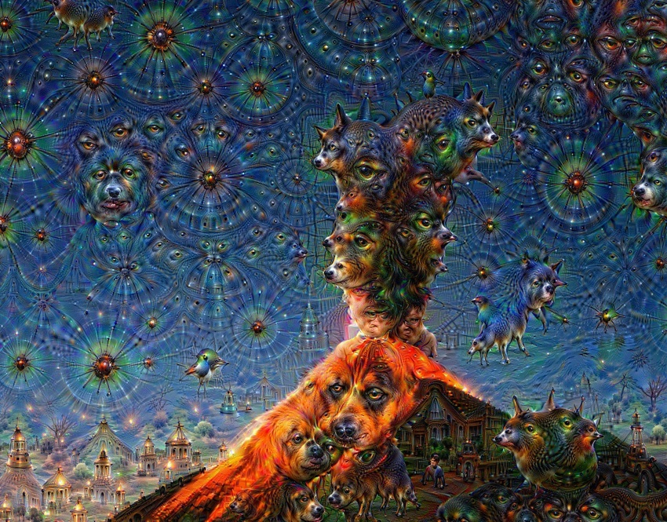
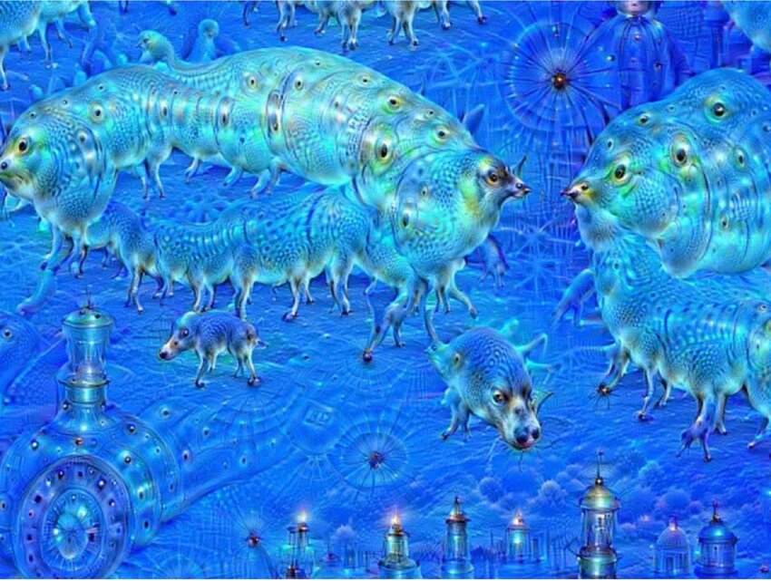
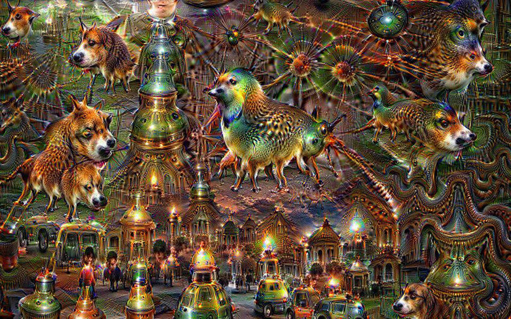
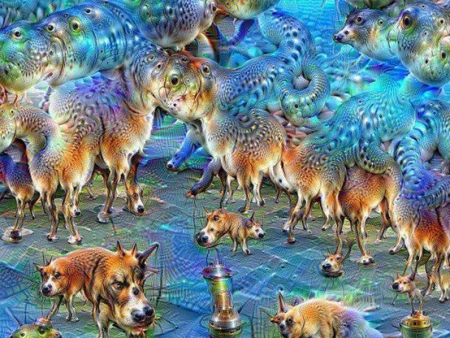

[home](./index.md)
------------------

*author: niplav, created: 2025-05-30, modified: 2025-10-28, language: english, status: notes, importance: 7, confidence: likely*

> __An unstructured, unfinished braindump.__

Automated AI Alignment Research
================================

People love to talk about whether AI misalignment is even a problem,
probably by one order of magnitude. Unrelatedly, the main AI alignment
plan of the major AI companies is (if they have one) to use mildly
superhuman AIs to solve (parts of?) the alignment problem. Whether
and how such plans could be made to work is underdiscussed
by 1½ orders ot magnitude. But like with the [meta-problem of
consciousness](https://en.wikipedia.org/wiki/Meta-problem_of_consciousness),
we can probably learn something about the difficulty if we
attempt to turn the issue of solving AI alignment into [executable
philosophy](https://arbital.com/p/executable_philosophy/). Here's some
random stabs.

Related Writing
----------------

The most detailed analyses are Joshua Clymer's writing
[on](https://www.lesswrong.com/posts/5gmALpCetyjkSPEDr/training-ai-to-do-alignment-research-we-don-t-already-know)
[automating alignment
research](https://www.lesswrong.com/posts/TTFsKxQThrqgWeXYJ/how-might-we-safely-pass-the-buck-to-ai),
and Joe Carlsmith's
[high-level](https://joecarlsmith.com/2025/04/30/can-we-safely-automate-alignment-research)
[overview](https://joecarlsmith.com/2025/03/14/ai-for-ai-safety). At
this point most AI alignment organizations are working under the
assumption of having large amount of AI labour available in a critical
period. Coordinal<!--and another org?--> is directly tackling the problem
of using AIs for alignment.

RIP to
[superalignment](https://openai.com/blog/introducing-superalignment).

More:

* [Beliefs and Disagreements about Automating Alignment Research (Ian McKenzie, 2022)](https://www.lesswrong.com/posts/JKgGvJCzNoBQss2bq/beliefs-and-disagreements-about-automating-alignment)
* [Automation collapse (Geoffrey Irving/Tomek Korbak/Benjamin Hilton, 2024)](https://www.lesswrong.com/posts/2Gy9tfjmKwkYbF9BY/automation-collapse)

I. Type Signature of Output
----------------------------

When we create scaffolds for/train/create training environments for
automated AI alignment researchers, what is the type signature of the
outputs of those researchers?

* Model weights of new, presumably aligned, more powerful AI systems?
* New architectures for AI systems?
* Proofs of convergence or OOD generalization of new architectures?
* Enumerative safety through mechanistic interpretability?
	* That seems hard, there are probably exponentially many meaningful circuits in large neural networks
* New AI paradims that side-step inner optimizers?
	* Neo-GOFAI?
	* Infra-Bayesian physicalism implementations?
* Control techniques that allow for better supervision of the next generation of automated alignment researchers?
* Just ask the automated alignment researchers what the type signature should be?

II. Condition Number of Succession Process
-------------------------------------------

III. Generator-Verifier Gap Broken/Unusual For Alignment?
----------------------------------------------------------

There are different perspectives on this.

Are there natural problems with a negative generator-verifier gap? How common are they?

Related:

* [Verification is not Easier than Generation in General (johnswentworth, 2022)](https://www.lesswrong.com/posts/2PDC69DDJuAx6GANa/verification-is-not-easier-than-generation-in-general)
* [Comment on “Verification Is Not Easier Than Generation In General” (Vanessa Kosoy, 2022)](https://www.lesswrong.com/posts/2PDC69DDJuAx6GANa/verification-is-not-easier-than-generation-in-general?commentId=feTSDufEqXozChSbB)

<!--TODO: Kosoy on the List of Lethalities-->

IV. Goal-Guarding + Adversarial Examples
-----------------------------------------

The story goes like this: People used to believe that advanced AIs
would take your instructions literally, and turn the entire universe
into paperclips if you instructed them to create you a paperclip
factory. But if you ask current LLMs, they tell you they won't turn the
entire universe into a paperclip factory just because you expressed a
weak desire to use some bent metal to bring order to your government
forms. Thus, the original argument (the ["Value Misspecification
Argument"](https://www.lesswrong.com/posts/i5kijcjFJD6bn7dwq/evaluating-the-historical-value-misspecification-argument))
is wrong and the people who believed it should at least stop believing
it).

Here's a *different* story: Advanced AI systems are going to be
optimizers. They are going to be optimizing *something*. What
would that something be? There are two possibilities: (1) They
are going to optimize a function of their world model[^activ], or
(2) they are going to optimize a function of the sensors. (See [Dewey
2010](./cs/ai/alignment/value_learning/learning_what_to_value_dewey_2010.pdf)
on this.). Furthermore, so goes the assumption, they will be
[goal-guarding](https://arxiv.org/abs/2412.14093): They will take actions
to prevent the target of their optimization from being changed.  At some
point then an AI will fix its goal in place. This goal will be to either
optimize some function of its world model, or of its sensors. In the
case (1) it will want to keep that goal, so for instrumental purposes
it may continue improving its world model as it becomes more capable,
but keep a copy of the old world model as a referent for what it truly
values. In the case (2) it will simply have to keep the sensors.

[^activ]: Very likely its weights or activations.

What happens if an AI optimizes a function of its world model? Well,
there's precedent. [DeepDream](https://en.wikipedia.org/wiki/DeepDream)
images were created by finding maximizing activations for neurons in
the [ConvNet](https://en.wikipedia.org/wiki/Convolutional_neural_net)
Inception trained on [ImageNet](https://en.wikipedia.org/wiki/ImageNet).
These are some of the results:

So, even if you've solved the [inner alignment
problem](https://www.lesswrong.com/s/r9tYkB2a8Fp4DN8yB/p/pL56xPoniLvtMDQ4J),
and you get some representation of human values into your AI, if it
goal-guards and then ramps up its optimization power, the result will
probably look like the DeepDream dogs, but for Helpfulness, Harmlessness
and Honesty. I believe we once called this problem of finding a function
that is safe to optimize the "outer alignment problem", but most people
seem to have forgotten about this, or believe it's a solved problem. I
don't quite see why they believe that.

One could argue that current LLM representations of human values are
robust to strong optimization, or that they will be robust to strong
optimization at the time when AIs are capable of taking over. I think
that's probably wrong, because (1) LLMs have many more degrees of freedom
in their internal representations than e.g. Inception, so the resulting
optimized outputs are going to look even stranger, and (2) I don't think
humans have yet found any function that's safe and useful to optimize,
so I don't think it's going to be "in the training data".

If an advanced AI optimizes some functions of its
sensors that is usually called wireheading or [reward
tampering](https://www.anthropic.com/research/reward-tampering)
or the problem of inducing [environmental
goals](https://arbital.com/p/environmental_goals/), and it doesn't lead
to an AI sitting in the corner being helpless, but probably like trying
to agentically create an expanding protective shell around some register
in a computer somewhere.

This argument fails if (1) advanced AIs are not optimizers, (2) AIs are
not goal-guarding, (3) or representations can't be easily extracted for
later optimization.

What could the DeepDream dogs equivalent of helpfulness, harmlessness
and honesty look like? Probably quite strange.<!--TODO: wedding
fixation on maximized outputs, what happens with extremal SAE values
for HHH/goodness?-->

See Also:

* [o1 is a bad idea (Abram Demski, 2024)](https://www.lesswrong.com/posts/BEFbC8sLkur7DGCYB/o1-is-a-bad-idea)

V. Training Imitators
-----------------------

[Clymer
2025](https://www.lesswrong.com/posts/TTFsKxQThrqgWeXYJ/how-might-we-safely-pass-the-buck-to-ai)
suggests to train AIs that imitate human alignment researchers.

Clymer suggests a method of checking AI systems by letting them replicate
the output of the AI alignment community from a specific period; excluding
training data from that period from the training data, and then checking
if the automated alignment researchers make similar findings to the
alignment community. This method is quite powerful, as it replicates the
progress made by the *entire* research field, including interactions
between researchers. But it also requires extensive cleaning of the
training data, interventions in the training process, and consists only
of a single data-point, replicating "fads" researchers get infatuated
by.<!--Mention linear probes (Burns), SAEs, decision theory?-->

In smaller-scale experiments, Clymer isn't as clear about the
procedure. There are two variants, namely whether one __trains against
alignment researcher feedback__ or __trains against alignment researcher
behavior__.

__Training against alignment researcher feedback__: An alignment
researcher formulates a task (i.e. an experiment, a conceptual question
&c). The AI model generates an output to solve the task. The researcher
then samples and observes the output, and then grades the results
according to how much they liked the output of the AI model with respect
to the task. The model is trained on that feedback.

__Training against alignment researcher behavior__: An alignment
researcher formulates a task. The AI model, as in the previous case,
tries to solve the task and produces some output `$O_A$`. For some tasks,
the alignment researcher *separately* tries to solve the task themselves,
and produces some output `$O_R$`, without any access to `$O_A$`. A third
person (which could be a different AI model, or another researcher) then
goes over `$O_A$` and `$O_R$` and grades the AI model on how similar
`$O_A$` is to `$O_R$`.

Training against alignment researcher behavior is much more bona-fide
[imitation learning](https://en.wikipedia.org/wiki/Imitation_learning),
whereas training against alignment researcher feedback is much more
similar in spirit to e.g. RLHF.

VI. Always Solve for Next Iteration, or Sometime in Full?
----------------------------------------------------------
