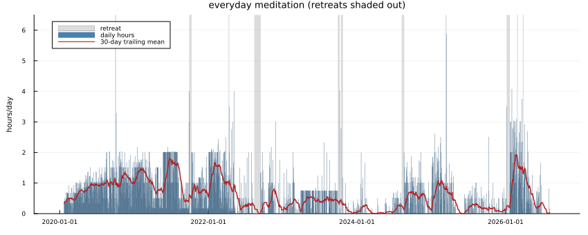
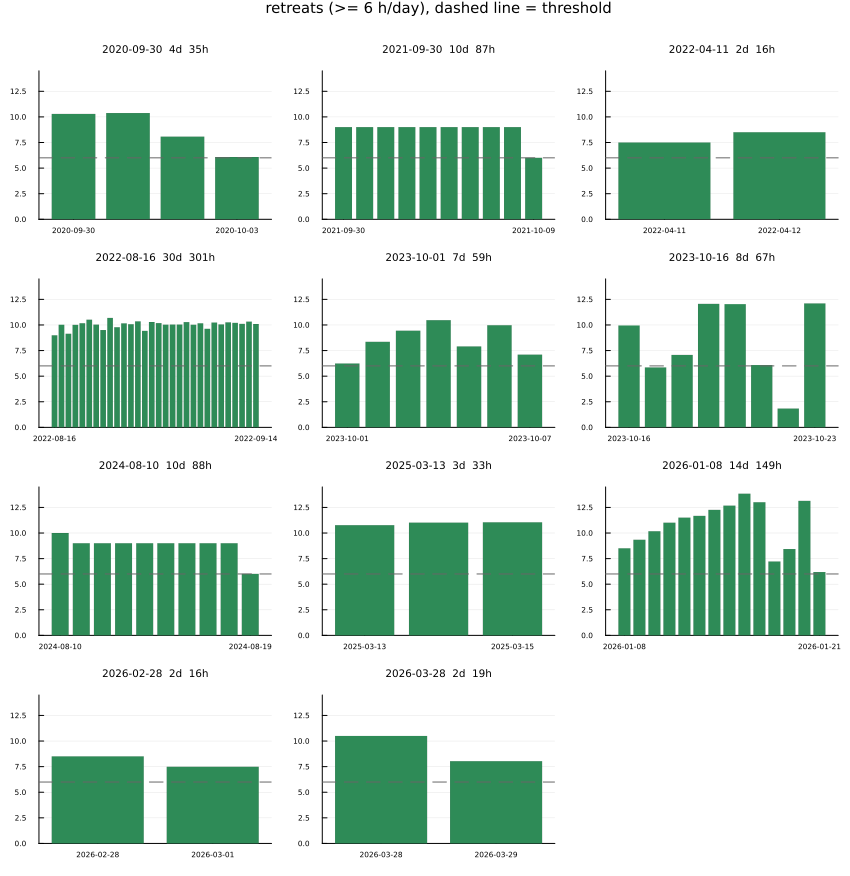

[home](./index.md)
------------------

*author: niplav, created: 2026-06-11, modified: 2026-06-28, language: english, status: in progress, importance: 1, confidence: other*

> __I'm looking for a meditation teacher. Background: ~2.5k hours of
meditation in various techniques, model is broadly [pragmatic
dharma](https://meditative.dev/web/resources/the-core-features-of-pragmatic-dharma/).
Willingness to pay is 40–50€/session, would meet every two
weeks in the European evening.__
>
> __Contact me at my email address `niplav@posteo.net` if that seems interesting.__

Become My Meditation Teacher
==============================

Hi! I'm looking for a meditation teacher. That could be you :-) Read on!

### How I Imagine Teachings Would Go

In general, I'm happy adjusting the format or assumptions if that's what seems wiser.

We have a videocall every two weeks at a
pre-defined time (likely evening of [Central European
Time](https://en.wikipedia.org/wiki/Central_European_Time)) on a
pre-defined date. We show up and I talk (in English or German) about
how my practice has been going (if, indeed, it has been going), and am
given feedback on how I could adjust my practice.

* If I haven't been meditating, we spend some of the session trying to debug why and how to change that for the next week
* If I have been meditating, we talk about how that went
* We do a small guided meditation, run experiments, I get things pointed out to me
* I get feedback, larger-scale guidance on what I could try next, whether/when to go on retreats &c
* ???
* Profit

In general, my current best guess on what my goal with meditation is is summarized in the blogpost [better](https://meditationstuff.wordpress.com/2020/07/14/better/). I do on some level buy the path model, though it looks very ad-hoc/pretheoretic, still, and quite dependent on the type of practice. Cessations/path moments do look pretty real, though, and immensely valuable. I'm not sure what my relationship to them should be, my guess is that I'm currently pretty strive-y towards them, and I don't particularly like that.

I am very happy to experiment around with my practice, e.g. being told "hm, let's try this completely different Tibetan practice for two weeks", or "I think it'd help you if you did some yoga, here's a resource", or "you may need this particular kind of therapy, I can refer you to someone".

I'm happy to compensate people for their work, and surplus should be distributed fairly. I will probably not be earning any income at the time when I start this, so my willingness to pay is ~capped at 40–50€. I'd be fine talking about ways of compensation that partially route through something that is not money (e.g. performing some service on top of monetary compensation). I'd be happy paying after every session.

#### Contact

I'm easiest to reach via email at `niplav@posteo.net`, but I'm also
[elsewhere on the internet](./about#Elsewhere_on_the_Internet) (though
email is the most reliable one that I check ~once per day, if I'm not
on retreat).

### My Past Practice

#### Daily Practice

* Started December 2019
* ~800hrs of absorption-on-breath meditation, which was interesting and fruitful for the first ~200hrs, and then stalled.
		* Interspersed with some metta, which was very engaging in the beginning and then dried out
* Tried several different techniques (core transformation, coming to wholeness, some IFS-ish parts work, do nothing meditation, open awareness, variants of Mahasi-style-labeling/noting) for ~300 hours, in a less-structured-than-optimal way
* Settled on Mahasi-/Ingram-style labeling and with increasing familiarity (optionally fast) noting, as I feel like it suits my mental disposition (slightly ADHD, tends to overthink, so fast noting leaves "no time" to get distracted/is very non-judgmental)

#### Meditation retreats

I've been on four "official" meditation retreats, two run by the Goenka organization, one at [Dhammacari](https://vipassana-dhammacari.com/en/home/), and a recent one at [Dhammaramsi](https://dhammagroupbrussels.be/en/history/dhammaramsi-center/). Three of these were ~10 days long, one was 28 days.

On top of that I've organized some longer retreats with friends at home, specifically [a month-long retreat in August 2022](./reports.html#MonthLong_Meditation_Retreat_At_Home) (during which I tried to go all-in on absorption meditation with the goal to get into the [jhanas](https://en.wikipedia.org/wiki/Jhāna), which was a small mistake at the time, though I'm still happy I did it.)

I also ran an interrupted (intended to be a month long) retreat in October 2023, during which I practiced a strange combination of Mahasi-style fast noting during the day, and fire kasina+internal family systems in the evening. (The loop was fire kasina→some unpleasantness comes up→soothe/drop an question mark into the unpleasantness→repeat this until it resolves→go back to fire kasina.)

Plus some weekend-retreats with a friend. In total ~120 days that I spent north of 6 hours on the cushion.

##### Future Retreats

I'm planning to go on a longer meditation retreat:

* For the month of November 2026 (partially organized)

### My Psychology, as Far as I Can Tell

In short, I'm a high-systematizer not-quite-autistic-but-get-along-weirdly-well-with-autists mild-ADHD guy in my late 20s/early 30s. I don't have any capital-T trauma, but like ~everyone else I have a bunch of "stuff" that I haven't all worked over. (Though it looks like I've [dimensionality-reduced](https://en.wikipedia.org/wiki/Dimensionality_Reduction) a lot of it.)

I have done a single session of therapy in my life (it was fine but a bit disorienting (too many levels of meta, me feeling awkward)), and 2½ MDMA trips geared at unearthing deep pain in my psyche, which didn't unearth anything super bad (only medium-sized internal incoherences).

In the context of meditation, my mind seems to be in a pretty firm basin that it enjoys resting in, even during long retreats, and isn't easily destabilized (as opposed to other people who are more volatile). This means recently I've gravitated more towards higher energy & deconstructive meditation techniques, as opposed to "wet" techniques that really focus on absorption, and never had any adverse effects from meditation. The flip side of this is that meditation is a very slow burn for me. No rush though.

My mind also **really** likes to think. Extremely high [need for cognition](https://en.wikipedia.org/wiki/Need_For_Cognition), extremely high curiosity; I'd guess 99.9th percentile on both, higher on the curiosity?

### How I Currently Think/Feel About Meditation

Most of my current understanding is [provisional](https://tsvibt.blogspot.com/2023/03/provisionality.html), but heavily informed by [Romeo Steven's framing](https://neuroticgradientdescent.blogspot.com/2021/03/threefold-training.html) of meditative progress, which he elaborated on in a few interviews [here](https://uncoiling.substack.com/archive).

Other influences are very cliché; Daniel Ingram, Theravada filtered through the more engaged side of Western Buddhism, reading [Mahasi Sayadaw's](https://en.wikipedia.org/wiki/Mahasi_Sayadaw) Practical Insight Meditation, various strands of computer science & artificial intelligence. And also lots of stumbling around during meditation, not knowing what the hell to do.

---------

Thanks for reading this far! May all beings be happy :-)
