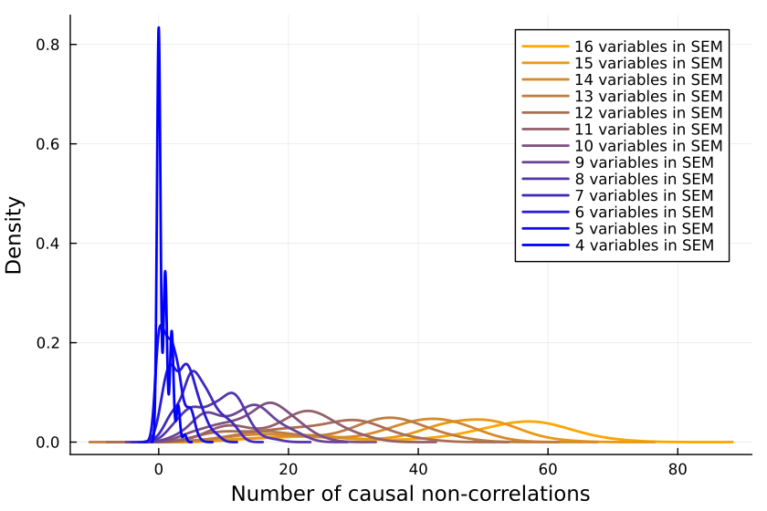
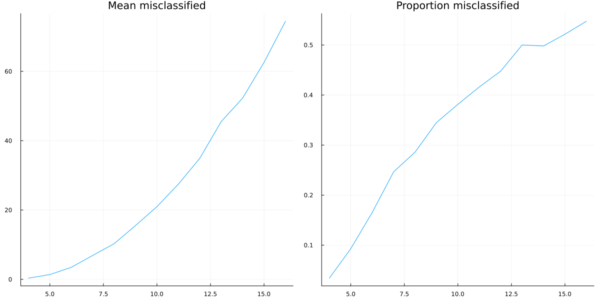
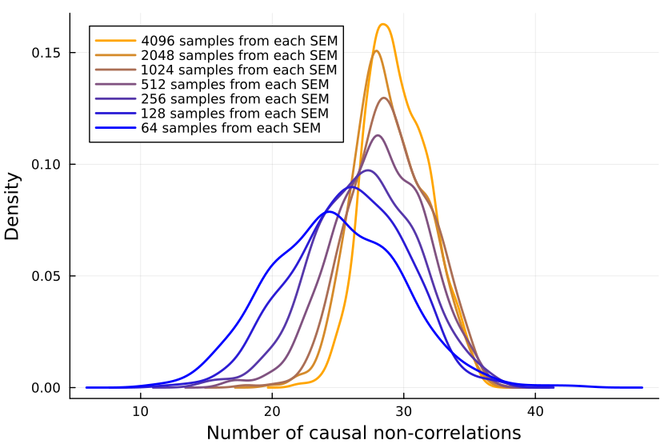

[home](./index.md)
-------------------

*author: niplav, created: 2022-02-04, modified: 2023-09-19, language: english, status: finished, importance: 4, confidence: possible*

> __Absence of correlation almost never implies absence of
causation[55%](https://fatebook.io/q/in-linear-sems-with-0-1-distributed--clujl9idv0001lc0841gwx9te).__

How Often Does ¬Correlation ⇏ ¬Causation?
==========================================

"Correlation ⇏ Causation" is trite by now. And we also know that
[the](https://www.spencergreenberg.com/2022/03/can-you-have-causation-without-correlation-surprisingly-yes/)
[contrapositive](https://stats.stackexchange.com/questions/221936/does-no-correlation-imply-no-causality)
[is false](https://core.ac.uk/download/pdf/82460997.pdf) too:
"¬Correlation ⇏ ¬Causation".

Spencer Greenberg
[summarizes](https://www.spencergreenberg.com/2022/03/can-you-have-causation-without-correlation-surprisingly-yes/):

> All of this being said, while causation does not NECESSARILY imply
correlation, causation USUALLY DOES imply correlation. Some software
that attempts to discover causation in observational data even goes so
far as to make this assumption of causation implying correlation.

I, however, have an inner computer scientist.

And he demands answers.

He will not rest until he knows *how often* ¬Correlation ⇒ ¬Causation,
and how often it doesn't.

This can be tested by creating a [Monte-Carlo
simulation](https://en.wikipedia.org/wiki/Monte-Carlo_simulation)
over random linear [structural equation
models](https://en.wikipedia.org/wiki/Structural_equation_Models)
with `$n$` variables, computing the correlations between the different
variables for random inputs, and checking whether the correlations being
zero implies that there is no causation.

So we start by generating a random linear SEM with `$n$` variables (code
in [Julia](https://en.wikipedia.org/wiki/Julia_programming_language)). The
parameters are [normally
distributed](https://en.wikipedia.org/wiki/Normal-distribution) with
mean 0 and variance 1.

        function generate_random_linear_sem(n::Int)
                g = DiGraph(n)
                for i in 1:n
                        for j in (i+1):n
                                if rand() < 0.5
                                        add_edge!(g, i, j)
                                end
                        end
                end
                coefficients = Dict()
                for edge in edges(g)
                        coefficients[edge] = randn()
                end
                return g, coefficients
        end

We can then run a bunch of inputs through that model, and compute their
correlations:

        function correlation_in_sem(sem::DiGraph, coefficients::Dict, inner_samples::Int)
                n = size(vertices(sem), 1)
                input_nodes = [node for node in vertices(sem) if indegree(sem, node) == 0]
                results = Matrix{Float64}(undef, inner_samples, n) # Preallocate results matrix
                for i in 1:inner_samples
                        input_values = Dict([node => randn() for node in input_nodes])
                        sem_values=calculate_sem_values(sem, coefficients, input_values)
                        sem_value_row = reshape(collect(values(sort(sem_values))), 1, :)
                        results[i, :] = sem_value_row
                end
                correlations=cor(results)
                for i in 1:size(correlations, 1)
                        correlations[i, i] = 0
                end
                return abs.(correlations)
        end

We can then check how many correlations are "incorrectly small".

Let's take all the correlations between variables which don't have
any causal relationship. The largest of those is the "largest uncaused
correlation". Correlations between two variables which cause each other
but are smaller than the largest uncaused correlation are "too small":
There is a causation but it's not detected.

We return the amount of those:

        function misclassifications(sem::DiGraph, coefficients::Dict, inner_samples::Int)
                correlations=correlation_in_sem(sem, coefficients, inner_samples)
                influence=Matrix(Bool.(transpose(adjacency_matrix(sem))))
                not_influence=tril(.!(influence), -1)
                non_causal_correlations=not_influence.*correlations
                causal_correlations=influence.*correlations
                return sum((causal_correlations .!= 0) .& (causal_correlations .< maximum(non_causal_correlations)))
        end

And, in the outermost loop, we compute the number of misclassifications
for a number of linear SEMs:

        function misclassified_absence_mc(n::Int, outer_samples::Int, inner_samples::Int)
                return [misclassifications(generate_random_linear_sem(n)..., inner_samples) for i in 2:outer_samples]
        end

So we collect a bunch of samples. SEMs with one, two and three variables
are ignored because when running the code, they never give me any causal
non-correlations. (I'd be interested in seeing examples to the contrary.)

        results = Dict{Int, Array{Int, 1}}()
        sem_samples=200
        inputs_samples=20000
        for i in 4:16
                results[i]=misclassified_absence_mc(i, sem_samples, inputs_samples)
        end

We can now first calculate the mean number of mistaken
correlations and the *proportion* of misclassified
correlations, using the [formula for the triangular
number](https://en.wikipedia.org/wiki/Triangular_Number#Formula):

        result_means=[mean(values) for (key, values) in sort(results)]
        result_props=[mean(values)/((key^2+key)/2) for (key, values) in sort(results)]

So it *looks like* a growing proportion of causal
relationships are not correlational, and I think the number will
[asymptote](https://en.wikipedia.org/wiki/Asymptote) to include
[almost all](https://en.wikipedia.org/wiki/Almost_all) causal
relations[55%](https://fatebook.io/q/in-linear-sems-with-0-1-distributed--clujl9idv0001lc0841gwx9te).

It could also be that the proportion asymptotes
to another percentage, but I don't think
so[15%](https://fatebook.io/q/in-linear-sems-with-0-1-distributed--clujlfm8b0001kx08z6geffu4).

### Is the Sample Size Too Small?

Is the issue with the number of inner samples, are we
simply *not checking enough*? But 10k samples [ought to be enough for
anybody](https://www.computerworld.com/article/2534312/the--640k--quote-won-t-go-away----but-did-gates-really-say-it-.html)—if
that's not sufficient, I don't know what is.

But let's better go and write some code to check:

        more_samples=Dict{Int, Array{Int, 1}}()
        samples_test_size=12
        sem_samples=100
        inputs_samples=2 .^(6:17)
        for inputs_sample in inputs_samples
                println(inputs_sample)
                more_samples[inputs_sample]=misclassified_absence_mc(samples_test_size, sem_samples, inputs_sample)
        end

Plotting the number of causal non-correlations reveals that 10k samples
*ought* to be enough, at least for small numbers of variables:

The densities fluctuate, sure, but not so much that I'll throw out the
baby with the bathwater. If I was a better person, I'd make a statistical
test here, but alas, I am not.

### See Also

* [What a Tangled Net We Weave When First We Practice to Believe (Gwern, 2019)](https://gwern.net/causality#what-a-tangled-net-we-weave-when-first-we-practice-to-believe): Where I probably got this from, subconsciously.
