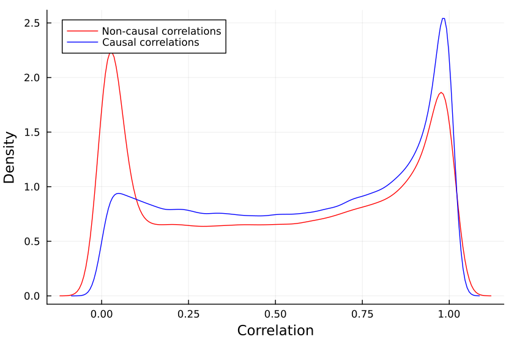

[home](./index.md)
-------------------

*author: niplav, created: 2022-02-04, modified: 2024-04-15, language: english, status: in progress, importance: 4, confidence: unlikely*

> __Absence of correlation implies causation ≤5% of the time in
sparse-ish linear causal networks, but not *never*. The number of causal
non-correlations first grows and then shrinks with the number of nodes
in the causal network, with the maximum at ≈30. I can't explain why.__

<!--
Absence of correlation almost never implies absence of
causation[55%](https://fatebook.io/q/in-linear-sems-with-0-1-distributed--clujl9idv0001lc0841gwx9te)
in linear structural equation models.
-->
<!--TODO: 2×2 of correlation/causation and their absences-->

How Often Does ¬Correlation ⇏ ¬Causation?
==========================================

["Correlation ⇏
Causation"](https://en.wikipedia.org/wiki/Correlation_does_not_imply_causation)
is trite by now. And we know that
[the](https://www.spencergreenberg.com/2022/03/can-you-have-causation-without-correlation-surprisingly-yes/)
[contrapositive](https://stats.stackexchange.com/questions/221936/does-no-correlation-imply-no-causality)
[is also false](https://core.ac.uk/download/pdf/82460997.pdf):
"¬Correlation ⇏ ¬Causation".

Spencer Greenberg
[summarizes](https://www.spencergreenberg.com/2022/03/can-you-have-causation-without-correlation-surprisingly-yes/):

> All of this being said, while causation does not NECESSARILY imply
correlation, causation USUALLY DOES imply correlation. Some software
that attempts to discover causation in observational data even goes so
far as to make this assumption of causation implying correlation.

I, however, have an inner computer scientist.

And he demands answers.

He will not rest until he knows *how often* ¬Correlation ⇒ ¬Causation,
and how often it doesn't.

This can be tested by creating a [Monte-Carlo
simulation](https://en.wikipedia.org/wiki/Monte-Carlo_simulation)
over random linear [structural equation
models](https://en.wikipedia.org/wiki/Structural_equation_Models)
with `$n$` variables, computing the correlations between the different
variables for random inputs, and checking whether the correlations being
very small implies that there is no causation.

So we start by generating a random linear SEM with
`$n$` variables ([code](./code/cause/experiment.jl) in
[Julia](https://en.wikipedia.org/wiki/Julia_programming_language)). The
parameters are [normally
distributed](https://en.wikipedia.org/wiki/Normal-distribution) with
mean 0 and variance 1, but for now we'll assume there is no noise.

	struct LinearSEM
		g::SimpleDiGraph{Int64}
		coefficients::Dict
	end

We can decide how dense/sparse we want the SEM to be via the `threshold`
parameter, the probability that two different nodes have an edge
between them. The higher the threshold, the more edges in the SEM.

	function random_linear_sem(n::Int, threshold=0.5)
		g=DiGraph(n)
		for i in 1:n
			for j in (i+1):n
				if rand() < threshold
					add_edge!(g, i, j)
				end
			end
		end
		coefficients=Dict()
		for edge in edges(g)
			coefficients[edge]=randn()
		end
		return LinearSEM(g, coefficients)
	end

<!--TODO: plot one of those graphs-->

We can then run a bunch of inputs through that model, and compute their
correlations:

	function correlations(sem::LinearSEM, inner_samples::Int)
		n=size(vertices(sem.g), 1)
		input_nodes=[node for node in vertices(sem.g) if indegree(sem.g, node) == 0]
		results=Matrix{Float64}(undef, inner_samples, n) # Preallocate results matrix
		for i in 1:inner_samples
			input_values=Dict([node => randn() for node in input_nodes])
			sem_values=calculate_sem_values(sem, input_values)
			sem_value_row=reshape(collect(values(sort(sem_values))), 1, :)
			results[i, :]=sem_value_row
		end
		cor_matrix==cor(results)
		cor_matrix[diagind(cor_matrix)].=0
		return abs.(cor_matrix)
	end

We can then check how many correlations are "incorrectly small".

Let's take all the correlations between variables which don't have
any causal relationship. The largest of those is the "largest uncaused
correlation". Correlations between two variables which cause each other
but are smaller than the largest uncaused correlation are "too small":
There is a causation but it's not detected.

We can now take the correlations and separate them into correlations
between pairs of variables with causal relationship (i.e., a directed
graph through the DAG representing the SEM), and pairs of variables
without causal relationships.

		correlation=correlations(sem, inner_samples)
		influence=Matrix(Bool.(transpose(adjacency_matrix(transitiveclosure(sem.g)))))
		not_influence=tril(.!(influence), -1)
		non_causal_cors=not_influence.*correlation
		causal_cors=influence.*correlation

This gives us two distributions, the distribution of `non_causal_cors`
and the distribution of `causal_cors`, e.g. for SEMs with 48 variables:

One may notice that some variables that are not causing each other still
have high correlations with each other, this is because they have a
common cause. So we have to decide *what it means* for a correlation
to be too small to be relevant.

I can see three different salient options to decide whether a correlation
is small:

1. A causal correlation is "small" iff it is smaller than the largest non-causal correlation.
	1. I used this criterion in an earlier version of this essay, but I now think that it's too lax, since due to common causes a pair of variables without direct causation can have a very high correlation.
2. A causal correlation is "small" iff it is smaller than the average/median non-causal correlation.
	1. This is stronger than the previous condition, and I vibe with it, but I don't have specific good reasons *why* I choose it. If you think this is stupid for reasons, I'd be interested in hearing the reasons (or even suggestions for improvement).
3. A causal correlation is "small" iff it falls under a certain constant value.
	1.	Wikipedia
		[states](https://en.wikipedia.org/wiki/Effect_size#Pearson_r_or_correlation_coefficient)
		that a correlation of 0.1 is small. I think it's basically
		just an arbitrary cutoff, so I don't use it.

	function misclassifications(sem::LinearSEM, inner_samples::Int)
		return sum((causal_correlations .!= 0) .& (causal_correlations .< mean(non_causal_correlations)))
	end

And, in the outermost loop, we compute the number of misclassifications
for a number of linear SEMs (with a threshold of 0.25, since 0.5 usually
produces SEMs which are too dense):

	function misclassified_absence_mc(n::Int, outer_samples::Int, inner_samples::Int)
		return [misclassifications(random_linear_sem(n, 0.25), inner_samples) for i in 1:outer_samples]
	end

So we collect a bunch of samples. SEMs with one, two and three variables
are ignored because when running the code, they never give me any
causal non-correlations. (I'd be interested in seeing examples to the
contrary).<!--TODO: try to actually find some-->

	results = Dict{Int, Array{Int, 1}}()
	sem_samples=400
	inputs_samples=10000
	upperlim=52
	stepsize=4
	Threads.@threads for i in 4:stepsize:upperlim
		results[i]=misclassified_absence_mc(i, sem_samples, inputs_samples)
	end

We can now first calculate the mean number of small
causal correlations and the *proportion* of of small causal
correlations correlations, using the [formula for the triangular
number](https://en.wikipedia.org/wiki/Triangular_Number#Formula):

	result_means=[mean(values) for (key, values) in sort(results)]
	result_props=[mean(values)/((key^2+key)/2) for (key, values) in sort(results)]

So it *looks like* at most 5% of causal relationships have a correlation
that is "too small", which happens if the SEM has ≈30 variables,
and that number shrinks with a larger SEM.

I find this *very surprising*: Is there a specific mathematical
reason why SEMs with 30 variables have the highest number of causal
non-correlations? The mean number of causal relationships with small
correlations seems to grow quite steadily, so I'm not sure what's going
on here.

<!--the number will
[asymptote](https://en.wikipedia.org/wiki/Asymptote) to include
[almost all](https://en.wikipedia.org/wiki/Almost_all) causal
relations[55%](https://fatebook.io/q/in-linear-sems-with-0-1-distributed--clujl9idv0001lc0841gwx9te).-->

<!--
It could also be that the proportion asymptotes
to another percentage, but I don't think
so[15%](https://fatebook.io/q/in-linear-sems-with-0-1-distributed--clujlfm8b0001kx08z6geffu4).
-->

### Is the Sample Size Too Small?

Is the issue with the number of inner samples, are we
simply *not checking enough*? But 10k samples [ought to be enough for
anybody](https://www.computerworld.com/article/2534312/the--640k--quote-won-t-go-away----but-did-gates-really-say-it-.html)—if
that's not sufficient, I don't know what is.

But let's better go and write some code to check:

	more_samples=Dict{Int, Array{Int, 1}}()
	samples_test_size=20
	sem_samples=400
	inputs_samples=2 .^(6:16)
	for inputs_sample in inputs_samples
		println(inputs_sample)
		more_samples[inputs_sample]=misclassified_absence_mc(samples_test_size, sem_samples, inputs_sample)
	end

Plotting the number of causal non-correlations reveals that 10k samples
*ought* to be enough, at least for small numbers of variables:

The densities fluctuate, sure, but not so much that I'll throw out the
baby with the bathwater. If I was a better person, I'd make a statistical
test here, but alas, I am not.

But… Why?
----------

I don't know why causal non-correlations are so common, especially in linear SEMs.
<!--TODO: speculate here!-->

### See Also

* [What a Tangled Net We Weave When First We Practice to Believe (Gwern, 2019)](https://gwern.net/causality#what-a-tangled-net-we-weave-when-first-we-practice-to-believe): Where I probably got this from, subconsciously.
* [How Often Does Correlation=Causality? (Gwern, 2019)](https://gwern.net/correlation)
* Discussions
	* [LessWrong](https://www.lesswrong.com/posts/ThLMBYZQ4PHKFKHSP/how-often-does-correlation-causation)
