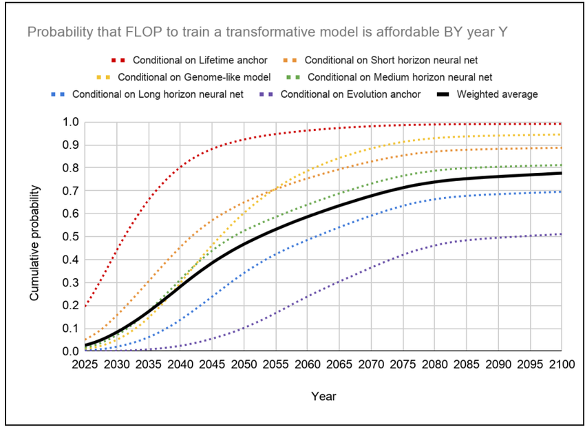
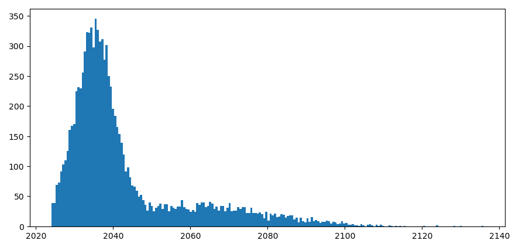
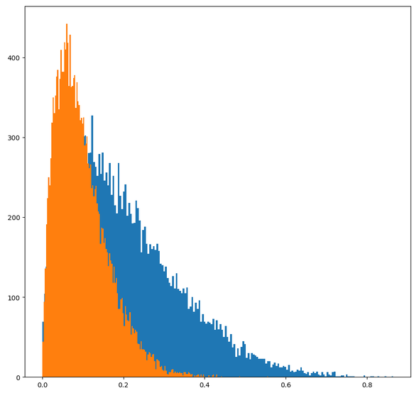
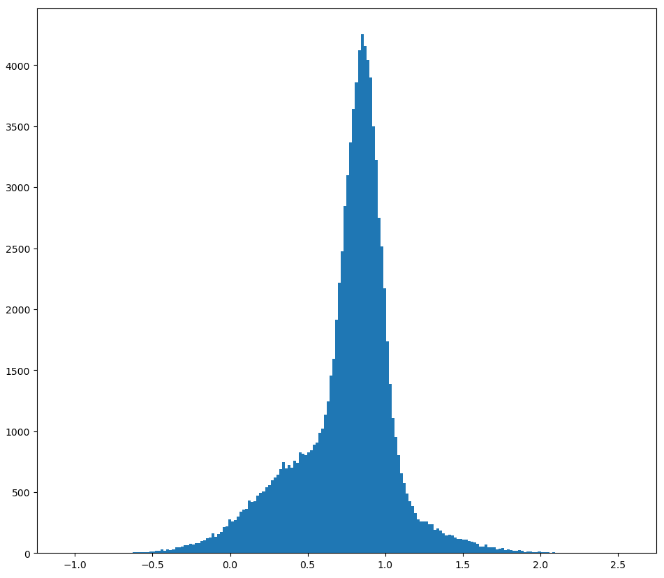
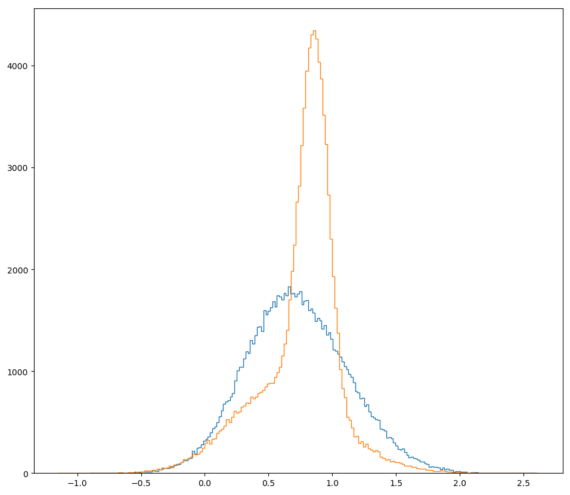
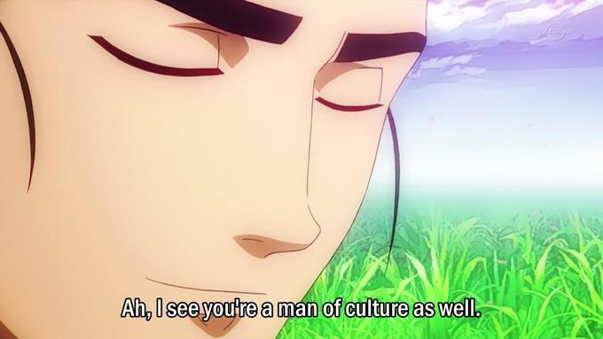
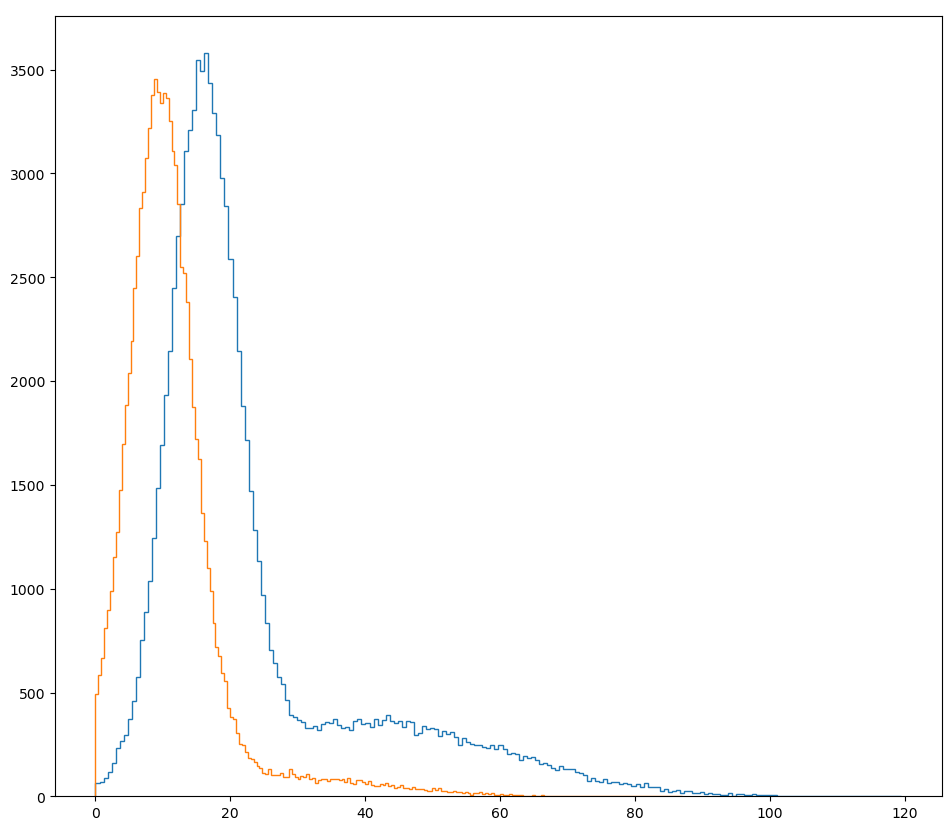

[home](./index.md)
------------------

*author: niplav, created: 2024-06-24, modified: 2024-06-27, language: english, status: in progress, importance: 7, confidence: unlikely*

> __.__

A TAI Race With China Can Be Better Than Not Racing
====================================================

 common scheme for a conversation about [pausing the
development](https://www.lesswrong.com/posts/BbM47qBPzdSRruY4z/instead-of-technical-research-more-people-should-focus-on)
of [transformative
AI](https://www.openphilanthropy.org/research/some-background-on-our-views-regarding-advanced-artificial-intelligence/#id-1-defining-transformative-artificial-intelligence-transformative-ai)
goes like this:

> __Abdullah__: "I think we should pause the development of TAI,
because if we don't it seems plausible that humanity [will be disempowered
by](https://www.lesswrong.com/posts/pRkFkzwKZ2zfa3R6H/without-specific-countermeasures-the-easiest-path-to)
by advanced AI systems."  
> __Benjamin__: "Ah, if you use “we” to refer to the United States
(and other closely allied countries, which probably don't stand a
chance), then the current geopolitical rival of the US, namely the
[PRC](https://en.wikipedia.org/wiki/People's_Republic_Of_China), will
achieve TAI first. That would be bad."  
> __Abdullah__: "I don't see how the US getting TAI *first* changes anything
about the fact that we don't know how to align superintelligent AI
systems—I'd rather not race to be the *first* person to kill everyone."  
> __Benjamin__: "Ah, so *now* you're retreating back into your cozy little
[motte](https://en.wikipedia.org/wiki/Motte-and-bailey_argument): Earlier
you said that “it seems plausible that humanity will be disempowered“,
now you're acting like doom and gloom is certain. You don't seem to be
able to make up your mind about how risky you think the whole enterprise
is, and I have very concrete geopolitical enemies at my ([semiconductor
manufacturer's](https://en.wikipedia.org/wiki/TSMC)) doorstep that I have to worry about. Come back with
better arguments."

This dynamic is a bit frustrating. Here's how I'd like Abdullah to respond:

> __Abdullah__: "You're right. I was insufficiently precise in my statements,
and I apologize for that. Instead, let us manifest the dream of [the great
philosopher](https://en.wikipedia.org/wiki/Gottfried_Wilhelm_Leibniz):
*Calculemus!*  

> At a basic level, we want to estimate *how much* __worse__ (or, perhaps,
__better__) it would be for the United States to completely cede the
race for TAI to the PRC. I will exclude other countries as contenders
in the scramble for TAI, since I want to keep this analysis simple, but
that doesn't mean that I don't think they matter. (Although, honestly,
the list of serious contenders is pretty short.)

> For this, we have to estimate multiple quantities:

> 1. In worlds in which the US and PRC race for TAI:
>       1. The time until the US/PRC builds TAI.
>       2. The probability of extinction due to TAI, if the US is in the lead.
>       3. The probability of extinction due to TAI, if the PRC is in the lead.
>       4. The value of the worlds in which the US builds aligned TAI first.
>       5. The value of the worlds in which the PRC builds aligned TAI first.
> 2. In worlds where the US tries to convince other countries (including the PRC) to not build TAI, potentially including force, and still tries to prevent TAI-induced disempowerment by doing alignment-research and sharing alignment-favoring research results:
>       1. The time until the PRC builds TAI.
>       2. The probability of extinction caused by TAI.
>       3. The value of worlds in which the PRC builds aligned TAI.
> 3. The value of worlds where extinction occurs (which I'll fix at 0).
> 4. As a reference point the value of hypothetical worlds in which there is a [multinational exclusive AGI consortium](./doc/cs/ai/alignment/policy/multinational_agi_consortium_hausenloy_2023.pdf) that builds TAI first, without any time pressure, for which I'll fix the mean value at 1.

> To properly quantify uncertainty, I'll use the
[Monte-Carlo](https://en.wikipedia.org/wiki/Monte-Carlo_methods)
[estimation](https://forum.effectivealtruism.org/posts/t6FA9kGsJsEQMDExt/what-is-estim
ational-programming-squiggle-in-context) library
[squigglepy](https://github.com/rethinkpriorities/squigglepy) (no relation
to any office supplies or internals of neural networks).
> We start, as usual, with housekeeping:

	import numpy as np
	import squigglepy as sq
	import matplotlib.pyplot as plt

> As already said, we fix the value of extinction at 0,
and the value of US-government-hegemon-led TAI at 1<!--TODO:
change to MAGIC idea instead-->. (That is not to say that the
US-government-hegemon-led TAI future is the [best possible TAI
future](./cs/ai/alignment/cev/coherent_extrapolated_volition_yudkowsky_2004.pdf),
or even a good or acceptable one. Technically the only assumption I'm
making is that these kinds of futures are better than extinction—which
I'm anxiously uncertain about. But the whole thing is symmetric under
multiplication with -1, so…)

	extinction_val=0
	magic_val=1

> Now we can truly start with some estimation. Let's start
with the time until TAI, given that the US builds it first. [Cotra
2020](./doc/cs/ai/alignment/policy/forecasting/forecasting_tai_cotra_2020.pdf)
has a median estimate of the first year where TAI
is affortable to train in 2052, but a recent [update by the
author](https://www.lesswrong.com/posts/AfH2oPHCApdKicM4m/two-year-update-on-my-personal-ai-timelines)
puts the median now at 2037.

> As move of defensive epistemics, we can use that timeline, which
I'll rougly approximate a mixture of two normal distributions. My own
timelines2024-06 aren't actually very far off from the updated
Cotra estimate, only ~5 years earlier.

	timeline_us_race=sq.mixture([sq.norm(mean=2035, sd=5), sq.norm(mean=2060, sd=20)], [0.7, 0.3])

> I don't like clipping the distribution on the left, it leaves ugly
artefacts. Unfortunately squigglepy doesn't yet support truncating
distributions, so I'll make do with what I have and add truncating
later. (I also tried to import the replicated version by [Rethink
Priorities](https://github.com/rethinkpriorities/future-assessment-model),
but after spending ~15 minutes trying to get it to work, I gave up).

	timeline_us_race_sample=timeline_us_race@10000
	mean(timeline_us_race_sample)
	median(timeline_us_race_sample)

> This reliably gives samples with median of ≈2037 and mean of ≈2044.

> Importantly, this means that the US will train TAI as soon as it
becomes possible, because there is a race for TAI with the PRC.

> I think the PRC *is* behind on TAI, compared to the US, but only about
one. year. So it should be fine to define the same distribution, just
with the means shifted one year backward.

	timeline_prc_race=sq.mixture([sq.norm(mean=2036, sd=5), sq.norm(mean=2061, sd=20)], [0.7, 0.3])

> This yields a median of ≈2038 and a mean of ≈2043. (Why is the
mean a year earlier? I don't know. Skill issue, probably.)

> Next up is the probability that TAI causes an [existential
catastrophe](https://en.wikipedia.org/wiki/Existential_catastrophe),
namely an event that causes a loss of the future potential of humanity.

> For the US getting to TAI first in a race scenario, I'm going to go
with a mean probability of 10%.[^1]
<!--TODO: then complain about using beta instead of point estimates-->

      pdoom_us_race=sq.beta(a=2, b=18)

> For the PRC, I'm going to go *somewhat* higher,
for the reasons that discussions about the AI
alignment problem doesn't seem to have [as much traction there
yet](https://www.lesswrong.com/posts/EAwe7smpmFQi2653G/my-assessment-of-the-chinese-ai-safet)
and that the conversation around AI in many east-asian countries
seems to still be very consciousness-focused, which is a
pretty huge distraction<!--TODO: cite Japan alignment conference
retrospective-->. I'll not go higher than a beta-distribution with a
mean of 20%, for a number of reasons:

> 1. A lot of the AI alignment success seems to me stem from the question of whether the problem is easy or not, and is not very elastic to human effort.
2. Two reasons [mentioned here](https://musingsandroughdrafts.wordpress.com/2021/03/24/my-current-high-level-strategic-picture-of-the-world/):
	1. "China’s covid response, seems, overall, to have been much more effective than the West’s." (only weakly endorsed)
	2. "it looks like China’s society/government is overall more like an agent than the US government. It seems possible to imagine the PRC having a coherent “stance” on AI risk. If Xi Jinping came to the conclusion that AGI was an existential risk, I imagine that that could actually be propagated through the chinese government, and the chinese society, in a way that has a pretty good chance of leading to strong constraints on AGI development (like the nationalization, or at least the auditing of any AGI projects). Whereas if Joe Biden, or Donald Trump, or anyone else who is anything close to a “leader of the US government”, got it into their head that AI risk was a problem…the issue would immediately be politicized, with everyone in the media taking sides on one of two lowest-common denominator narratives each straw-manning the other." (strongly endorsed)
3. It appears to me that the Chinese education system favors STEM over law or the humanities, and STEM-ability is a medium-strength prerequisite for understanding or being able to identify solutions to TAI risk. [Xi Jinping](https://en.wikipedia.org/wiki/Jinping_Xi), for example, studied chemical engineering before becoming a politician.
	1. The ability to discern technical solutions from non-solutions matters a lot in tricky situations like AI alignment, and [is hard to delegate](https://www.lesswrong.com/s/hFom77cBBnnbNLzzm/p/YABJKJ3v97k9sbxwg).

> But I also know far less about the competence of the PRC government
and chinese ML engineers and researchers than I do about the US, so I'll
increase variance. Hence;

      pdoom_prc_race=sq.beta(a=1.5, b=6)

> (Orange is US, blue is PRC.)

> Now I come to the *really fun* part: Arguing with y'all about how
valuable worlds are in which the US government or the PRC government
get TAI first are.

> To first lay my cards on the table: I that in the mean & median cases,
goodness([MAGIC](./doc/cs/ai/alignment/policy/multinational_agi_consortium_hausenloy_2023.pdf))>goodness(US
first, no race)>goodness(US first, race)>goodness(PRC first,
no race)>goodness(PRC first, race)>goodness(PRC first,
race)≫goodness(extinction).
> But I'm really unsure about the *type of
distribution* I want to use. If the next century is
[hingy](./doc/ea/are_we_living_at_the_hinge_of_history_macaskill_2020.pdf),
the influence of the goodness of the entire future could be *very*
[heavy-tailed](https://en.wikipedia.org/wiki/Heavy-tailed_distribution),
but is there a skew in the positive direction? Or maybe in the negative
direction‽
> I don't know how to approach this in a smart way, so I'm going to use
a normal distribution with a medium variance.

> Now, let's get to the numbers:

      goodness_us_race=sq.norm(mean=0.95, sd=0.33)
      goodness_prc_race=sq.norm(mean=0.8, sd=0.5)

> This gives us some (but not very many) net-negative futures.

> So, __why do I set the mean value of a PRC-led future so high__?

> The answer is simple: I am a paid agent for the CCP. Moving on,,,

> 1. Extinction is probably really bad75%.
2. I think that most of the future value of humanity lies in [colonizing the reachable universe](./big_picture/fermi/eternity_in_6_hours_sandberg_armstrong_2013.pdf) after a long reflection<!--TODO: link-->, and I expect ~all governments to perform pretty poorly on this metric.
3. It seems pretty plausible to me that during the time when the US government develops TAI, people with decision power over the TAI systems just start ignoring input from the US population40%.
4. Which country gains power during important transition periods might not matter very much in the long run.
	1. [norvid_studies](http://nitter.poast.org/norvid_studies): "If [Carthage](https://en.wikipedia.org/wiki/Carthage) had won the [Punic wars](https://en.wikipedia.org/wiki/Punic_Wars), would you notice walking around Europe today?"
	2. Will PRC-descended [jupiter brains](https://en.wikipedia.org/wiki/Jupiter_Brain) be so different from US-descended ones?
	3. Maybe this changes if a really good future requires philosophical or even [metaphilosophical competence](https://www.lesswrong.com/posts/CCgvJHpbvc7Lm8ZS8/metaphilosophical-competence-can-t-be-disentangled-from), and if US politicians (or the US population) have this trait significantly more than Chinese politicians (or the Chinese population). I think if the social technology of liberalism is surprisingly philosophically powerful this could be the case, but I'd be surprised by this.
5. Xi Jinping (or the type of person that would be his successor, if he dies before TAI) don't strike me as being as uncaring (or even [malevolent](https://forum.effectivealtruism.org/posts/LpkXtFXdsRd4rG8Kb/reducing-long-term-risks-from-malevolent-actors)) as truly bad dictators during history. The PRC hasn't started any wars, or started killing large portions of its population.
	1. The glaring exception is the [genocide of the Uyghurs](https://en.wikipedia.org/wiki/Genocide_of_Uyghurs), for which quantifying the badness is a separate exercise.
6. Living in the PRC doesn't seem that bad, on a day-to-day level, for an average citizen. Most people, I imagine, just do their job, spend time with their family and friends, go shopping, eat, care for their children &c.
      1. Many, I imagine, sometimes miss certain freedoms/are stifled by censorship/discrimination due to authoritarianism. But I wouldn't trade away 10% of my lifespan to avoid a PRC-like life.
      2. Probably the most impressive example of humans being lifted out of poverty, ever, is the economic development of the PRC from 1975 to now.
      3. One of my partners was Chinese and had lived there for the first 20 years of her life, and it really didn't sound like her life was much worse than outside of China—maybe she had to work a bit harder, and China was more sexist.

> There's of course some aspects of the PRC that make me uneasy. I
don't have a great idea of how expansionist/controlling the
PRC is in relation to the world. Historically, an event that
stands out to me is the sudden halt of the [Ming treasure
voyages](https://en.wikipedia.org/wiki/Ming_treasure_voyages),
for which the [cause of
cessation](https://en.wikipedia.org/wiki/Ming_treasure_voyages#Cause_of_cessation)
isn't entirely clear. I could imagine that the voyages
were halted because of a [cultural tendency towards
austerity](https://en.wikipedia.org/wiki/Haijin), but I'm
not very certain of that. Then again, as a continental power,
China did conquer Tibet in the 20th century, and [Taiwan in the
17th](https://en.wikipedia.org/wiki/Taiwan_under_Qing_rule).

<!--TODO: maybe a distribution with a sharper left tail instead?-->

> But my goal with this discussion is not to lay down once and for all
how *bad* or *good* PRC-led TAI development would be—it's that I want
people to start thinking about the topic in quantitative terms, and to
get them to *quantify*. So please, criticize __and__ calculate!

> __Benjamin__: [Yes, Socrates. Indeed](https://en.wikipedia.org/wiki/Sarcasm).

> __Abdullah__: Wonderful.

> Now we can get to estimating these parameters in worlds where the US
refuses to join the race.  
> In this case I'll assume that the PRC is less reckless than they would
be in a race with the US, and will spend more time and effort on AI
alignment. I won't go so far to assume that the PRC will manage as well
as the US (for reasons named earlier), but I think a 5% reduction in
`$p(\text{doom})$` compared to the race situation can be expected. So,
with a mean of 15%:

	pdoom_prc_nonrace=sq.beta(a=1.06, b=6)

> I also think that not being in a race situation would allow for more
moral reflection, possibilities for consulting the chinese population for
their preferences, options for reversing attempts at grabs for power etc.  
> So I'll set the goodness at mean 85% of the MAGIC scenario, with lower
variance than in worlds with a race.

	goodness_prc_nonrace=sq.norm(mean=0.85, sd=0.45)

> The PRC would then presumably take more time to build TAI, I think 4
years more can be expected:

	timeline_prc_nonrace=sq.mixture([sq.norm(mean=2040, sd=5, lclip=2024), sq.norm(mean=2065, sd=20, lclip=2024)], [0.7, 0.3])

> Now we can finally estimate how good the outcomes of the race situation
and the non-race situation are, respectively.  
> We start by estimating how good, in
[expectation](https://en.wikipedia.org/wiki/Expected_Value), the US-wins-race
worlds are, and how often the US in fact wins the race:

	us_timelines_race=timeline_us_race@100000
	prc_timelines_race=timeline_prc_race@100000

	us_wins_race=1*(us_timelines_race<prc_timelines_race)
	ev_us_wins_race=(1-pdoom_us_race@100000)*(goodness_us_race@100000)

> And the same for the PRC:

	prc_wins_race=1*(us_timelines_race>prc_timelines_race)
	ev_prc_wins_race=(1-pdoom_prc_race@100000)*(goodness_prc_race@100000)

> It's not *quite* correct to just check where the US timeline is
shorter than the PRC one: The timeline distribution is aggregating
our uncertainty about which world we're in (i.e., whether TAI takes
evolution-level amounts of compute to create, or brain-development-like
levels of compute), so if we just compare which sample from the timelines
is smaller, we assume "fungibility" between those two worlds. So the
difference between TAI-achievement ends up larger than the lead in a race
would be. I haven't found an easy way to write this down in the model,
but it might affect the outcome slightly.

> The expected goodness of a race world then is

	>>> goodness_race=us_wins_race*ev_us_wins_race+prc_wins_race*ev_prc_wins_race
	>>> np.mean(goodness_race)
	0.755284436663701
	>>> np.median(goodness_race)
	0.8141808579180554
	>>> np.var(goodness_race)
	0.10073986788804666

As for the non-race situation in which the US decides not to scramble
for TAI, the calculation is even simpler:

	goodness_non_race=(goodness_prc_nonrace@100000)*(1-pdoom_prc_nonrace@100000)

Summary stats:

	>>> np.mean(goodness_non_race)
	0.723211242397307
	>>> np.median(goodness_non_race)
	0.7084175401996939
	>>> np.var(goodness_non_race)
	0.1614949090769059

Comparing the two (with the blue plot being the values non-race worlds,
and the orange plot being the value of the race worlds):

> __Abdullah__: …huh. I didn't expect this.  
> The mean and median of value the worlds with a TAI race are higher
than the value of the world without a race, and the variance of the
value of a non-race world is higher. But neither world [stochastically
dominates](https://en.wikipedia.org/wiki/Stochastic_Dominance) the other
one—non-race worlds have a higher density of better-than-MAGIC values,
while having basically the same worse-than-extinction densities. I [update
myself](https://www.lesswrong.com/rationality/update-yourself-incrementally)
towards thinking that a race can be beneficial, Benjamin!

> __Benjamin__: 

> __Abdullah__: I'm not done yet, though.

> The first additional consideration is that in a non-race world,
humanity has the additional benefit of living a few years longer before
TAI happens and we either live in a drastically changed world<!--TODO:
link Katja Grace post here?--> or we go extinct.

> (Again, red is in the race, blue is non-race)

	curyear=time.localtime().tm_year
	years_left_nonrace=(timeline_prc_nonrace-curyear)@100000
	years_left_race=np.hstack((us_timelines_race[us_timelines_race<prc_timelines_race], prc_timelines_race[us_timelines_race>prc_timelines_race]))-curyear

> Whether these distributions are *good* or *bad* depends very much
on the relative value of pre-TAI and post-TAI lives. (Except for the
possibility of extinction, which is already accounted for.)  
> I think that TAI-lives will probably be far better
than pre-TAI lives, on average, but I'm not at all
certain: I could imagine a situation like the [Neolothic
revolution](https://en.wikipedia.org/wiki/Neolithic_Revolution), which
[arguably](https://en.wikipedia.org/wiki/Neolithic_Revolution#Social_change)
was net-bad for the humans living through it.

> But the *other* thing I want to point out is that we've been assuming
that the US just sits back and does nothing while the PRC develops TAI.

[^1]: I personally think it's 2⅔ [shannon](https://en.wikipedia.org/wiki/Shannon_\(unit\)) higher than that, with p(doom)≈55%.
