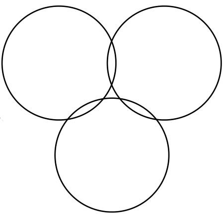

[home](./index.md)
-------------------

*author: niplav, created: 2019-06-21, modified: 2019-07-13, language: english, status: notes, importance: 4, confidence: highly likely*

> __It is currently unknown how many ways exist to [arrange
> n circles](https://www.youtube.com/watch?v=bRIL9kMJJSc) in
> the affine plane. However, for up to 5 circles, the [number is
> known](https://oeis.org/A250001). This page attempts to classify the
> current known combinations.__

Circle Combinations
===================

Characteristic Description of a Circle Combination
--------------------------------------------------

Any unintersected plane is contained by n circles. How many planes exist
that are contained in n circles?

The characteristic description of a circle combination lists
the number of planes contained by n circles, in ascending order.
For example, the following circle has the description 1,2,1,1:

There is only one plane not contained by any circles (the outer plane),
2 planes only contained by one circle, 1 plane contained by 2 circles,
and 1 plane (the innermost circle) contained by all 3 circles.

As one can see, the outer plane is counted as well.

Conjecture: The characteristic description of a circle is a unique
identifier of the circle combination described (no 2 circle combinations
have the same characteristic description).

1 Circle
--------

* Unintersected lines: 1
* Line intersections: 0
* Unintersected planes: 2
* Characteristic description: 1,1

2 Circles
----------

* Unintersected lines: 2
* Line intersections: 0
* Unintersected planes: 3
* Characteristic description: 1,2,0

* Unintersected lines: 4
* Line intersections: 2
* Unintersected planes: 4
* Characteristic description: 1,2,1

* Unintersected lines: 2
* Line intersections: 0
* Unintersected planes: 3
* Characteristic description: 1,1,1

3 Circles
---------

* Unintersected lines: 3
* Line intersections: 0
* Unintersected planes: 4
* Characteristic description: 1,3,0,0

* Unintersected lines: 5
* Line intersections: 2
* Unintersected planes: 5
* Characteristic description: 1,3,1,0

* Unintersected lines: 8
* Line intersections: 4
* Unintersected planes: 6
* Characteristic description: 1,3,2,0

* Unintersected lines: 5
* Line intersections: 2
* Unintersected planes: 5
* Characteristic description: 1,2,2,0

* Unintersected lines: 8
* Line intersections: 4
* Unintersected planes: 6
* Characteristic description: 1,2,2,1

* Unintersected lines: 5
* Line intersections: 2
* Unintersected planes: 5
* Characteristic description: 1,2,1,1

* Unintersected lines: 12
* Line intersections: 6
* Unintersected planes: 8
* Characteristic description: 1,3,3,1

* Unintersected lines: 3
* Line intersections: 0
* Unintersected planes: 4
* Characteristic description: 1,2,1,0

* Unintersected lines: 3
* Line intersections: 0
* Unintersected planes: 4
* Characteristic description: 1,1,2,0

* Unintersected lines: 5
* Line intersections: 2
* Unintersected planes: 4
* Characteristic description: 1,1,2,1

* Unintersected lines: 3
* Line intersections: 0
* Unintersected planes: 4
* Characteristic description: 1,1,1,1

* Unintersected lines: 12
* Line intersections: 6
* Unintersected planes: 8
* Characteristic description: 1,4,2,1

* Unintersected lines: 12
* Line intersections: 6
* Unintersected planes: 8
* Characteristic description: 1,2,4,1

TODO: Remove line in lower left corner

* Unintersected lines: 12
* Line intersections: 6
* Unintersected planes: 8
* Characteristic description: 2,3,3,0
