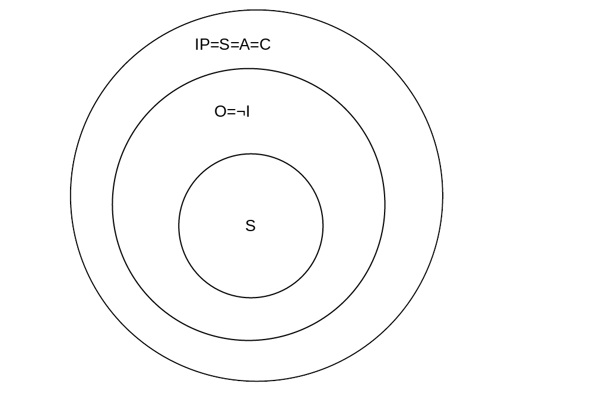
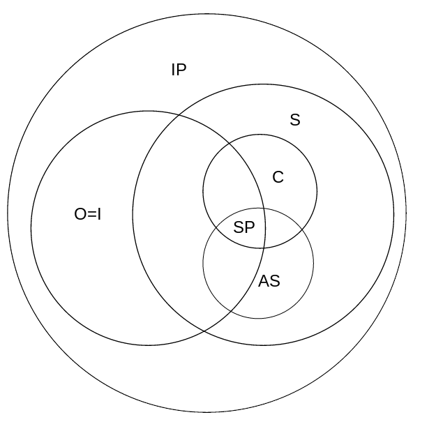

[home](./index.md)
------------------

*author: niplav, created: 2019-08-15, modified: 2020-04-28, language: english, status: notes, importance: 3, confidence: theory*

> __Many people have very different conceptions on how to think about
> consciousness, intelligence, sentience and information processing. A
> method of visualizing these conceptions is presented, some examples are
> discussed and advantages and disadvantages are shown.__

Using Diagrams to Visualize Conceptions of Intelligence, Consciousness and Sentience
=========================================================================================

<!--
"If consciousness is the thoughts and computations that an agent performs
when acting in the world, there seems to be some relationship between
sapience -- the ability to intelligently handle novel situations --
and sentience -- inner "feelings"."

https://longtermrisk.org/flavors-of-computation-are-flavors-of-consciousness/
-->

<!--TODO: links in headers are no good, move them elsewhere-->

When talking about minds, what they contain, entail and are made of,
there are many differing ideas and models that different people have
thought about. However, it can often be very difficult to make meaningful
progress in that area, since people often conflate one or more properties
that minds can have with one another, don't use terms clearly or equate
terms that under closer inspection have nothing to do with each other.

One possible method to clear this confusion could be to establish broad
definitions for different aspects of minds, and make diagrams that
represent the relation of these different aspects.

This text uses [Venn
diagram](https://en.wikipedia.org/wiki/Venn_diagram)-like diagrams to
visualize these different conceptions, but adds notation to indicate
that classes are meaningless or equal (or both).

Relevant Classes
----------------

### Descriptions

Terms (short, and only gesturing towards a definition):

#### Information-Processing (IP):

Complex internal state, responding to stimuli, processes information
(duh!).

Example: Computer  
Counter-example: A rock

#### Optimizing (O):

Optimizes towards a given goal.

Example: Evolution, Paperclip-maximizer  
Counter-example: A piece of paper

#### Intelligent (I):

Internal model of the world, optimizes towards a goal, makes plans and
executes them.

Example: Adult human, artificial intelligence  
Counter-example: A tree

#### [Sentient](https://en.wikipedia.org/wiki/Sentience) (S):

Can experience qualia, such as the color red.

> Sentience is the capacity to feel, perceive, or experience subjectively.

*– [Wikipedia](https://en.wikipedia.org/wiki/Wikipedia), [“Sentience”](https://en.wikipedia.org/wiki/Sentience), 2019*

Example: Myself  
Counter-example: P-Zombie

#### Affectively sentient (AS):

Can experience valenced qualia (qualia that are good/bad).

Example: Presumably most humans  
Counter-example: An electron

#### Conscious (C):

<!--Issue: most people seem to use "conscious" and "sentient"
interchangeably-->

Has internal self-model, passes mirror test (or similar test), can
distinguish "world" and "self"

Example: Myself  
Counter-example: P-Zombie

#### [Sapient](https://en.wikipedia.org/wiki/Sapience) (SP):

Possesses "wisdom" and "insight", think "a good human person"

> […] sapience […] is the ability to think and act using knowledge,
experience, understanding, common sense and insight.

*– [Wikipedia](https://en.wikipedia.org/wiki/Wikipedia), [“Wisdom”](https://en.wikipedia.org/wiki/Sapience), 2019*

Example: Lao-Tse  
Counter-Example: A golden retriever

Notation
--------

Similar to Venn diagrams, a class is generally represented by a circle
or an ellipse that represents all minds that have that property. To
differentiate the classes, the circle contains the abbreviation of the
name of the class.

If a class `$X$` doesn't mean anything, it can be written as `$\neg X$`
in the class it collapses into. If no such class exists, it can be
written outside of all classes, also as `$\neg X$`.

If two classes `$X$` and `$Y$` are equal (all minds with one property
necessarily have another property), they can be written inside the same
circle as `$X=Y$`.

Examples
--------

Model in which all information-processing systems are sentient, conscious,
affectively sentient, and where some information processing systems are
optimizing (intelligence meaning the same thing as optimizing). Some of
the optimizing systems are also sapient.

Another way of looking at consciousness: Intelligent and sentient systems
are both information processing systems, but not necessarily the same,
every conscious system is sentient, just as every affectively sentient
system, and every sapient system is both intelligent, conscious and
affectively sentient. Also, not every information-processing system is
sentient or intelligent.

