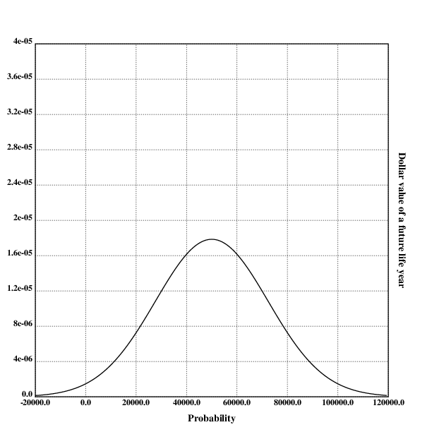
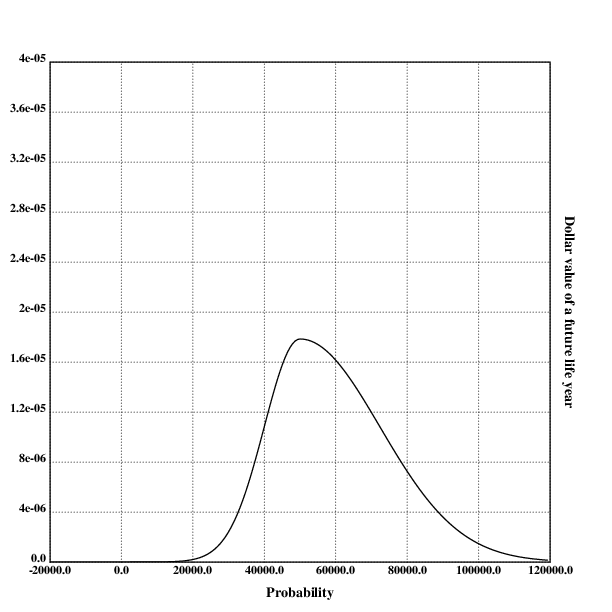
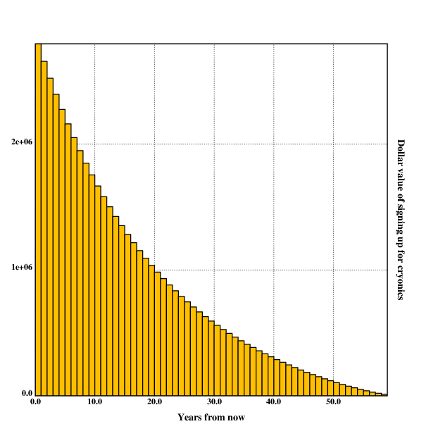
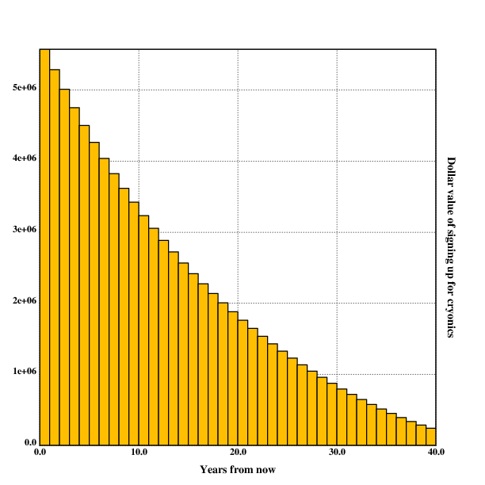
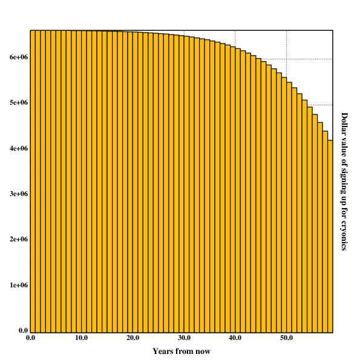
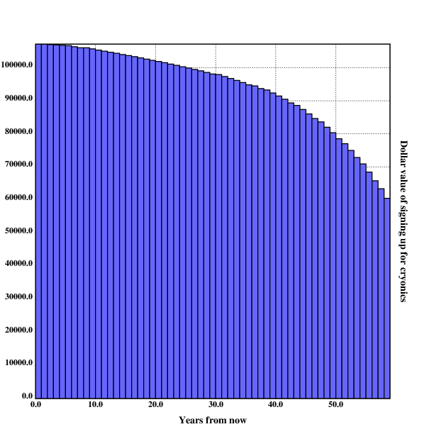
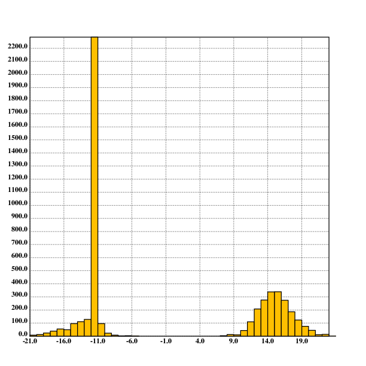

[home](./index.md)
-------------------

*author: niplav, created: 2019-10-18, modified: 2020-10-21, language: english, status: finished, importance: 6, confidence: remote*

> __Is cryonics worth it, and if yes, should one
> [cryocrastinate](https://alcor.org/Library/html/cryocrastination.html)
> (i.e. postpone signing up for cryonics to a later date)?
> [Betteridge's law of
> headlines](https://en.wikipedia.org/wiki/Betteridge's_law_of_headlines)
> only applies partially here: Yes, it is probably worth it (under
> plausible assumptions \$2.7m for a 20 year old, and more for older
> people), and no, cryocrastination is usually irrational. A cost-benefit
> analysis written in Lua.
> I also perform a [Monte-Carlo
> simulation](https://en.wikipedia.org/wiki/Monte_Carlo_method) using
> [Guesstimate](https://www.getguesstimate.com/ "Official website"),
> and find that signing up for cryonics at age 20 is worth in the
> mean \$18m, median -\$100k (90% confidence interval: -\$2.16m,
> \$58.25m). It therefore seems recommendable to sign up for cryonics
> immediately.__

Considerations on Cryonics
==========================

<!--
Metaculus questions related to cryonics:
Revival:
https://www.metaculus.com/questions/3330/will-any-person-that-has-been-cryopreserved-for-more-than-1-year-be-resuscitated-or-emulated-before-2200/
https://www.metaculus.com/questions/1626/before-1-january-2050-will-any-human-cryonically-preserved-for-at-least-1-year-be-successfully-revived/
https://www.metaculus.com/questions/455/if-you-die-today-and-get-cryonically-frozen-will-you-wake-up/
https://www.metaculus.com/questions/3332/will-james-bedford-be-revived-or-emulated-before-2200/
https://www.metaculus.com/questions/3331/when-will-the-first-person-that-has-been-cryopreserved-for-more-than-1-year-be-resuscitated-or-uploaded/
https://www.metaculus.com/questions/3382/what-will-the-earliest-preservation-date-of-any-resuscitated-cryonics-patient-be/
Preservation:
https://www.metaculus.com/questions/3333/when-will-the-number-of-people-in-cryopreservation-preserved-before-2019-fall-to-less-than-50-of-the-current-value/
Signup:
https://www.metaculus.com/questions/3478/how-many-patients-will-be-in-cryonic-suspension-at-the-cryonics-institute-in-2030/
https://www.metaculus.com/questions/4052/if-cryonics-is-at-some-point-offered-for-free-what-percentage-of-americans-will-be-signed-up-within-10-years/
-->

<!--
https://www.tandfonline.com/doi/pdf/10.1080/01459741003715391
https://www.tandfonline.com/doi/full/10.1080/23311886.2016.1167576
https://books.google.de/books?id=9C0ABAAAQBAJ&pg=PA281&lpg=PA281&dq=Cryonics+cost+benefit+calculation&source=bl&ots=IIIVQtzzXt&sig=ACfU3U3KMGKCBWhP1tvegvKvHTyCLtZNGA&hl=en&sa=X&ved=2ahUKEwjc_O6v743qAhUKYcAKHXFVDsUQ6AEwDXoECAMQAQ#v=onepage&q=Cryonics%20cost%20benefit%20calculation&f=false
-->

<!--
Consideration:
Different value of money at different ages
-->

<!--
Why not a Pascal's mugging?
* No adversary
* Probability not _that_ low
* Here assumed rather low bound on payoff to prevent
-->

> If I died, would I be rid of my senses?  
Or will it retain, trapped within my corpse, in stasis?  
If I died, would I be a woman in heaven?  
Or would I fall asleep, not knowing what it’s like to feel alive?
> 
> If I died, would I begin with a new life?  
Or would I be gone as quickly as the breath I give last?  
If I died, would I be a woman in heaven?  
Or would I fall asleep, not knowing what it’s like to feel alive?

*– [Patricia Taxxon](https://www.youtube.com/channel/UCOjLfFE0TABS9bk05oH-kgw), [“Deconstruct”](https://patriciataxxon.bandcamp.com/track/deconstruct) from [“Foley Artist”](https://patriciataxxon.bandcamp.com/album/foley-artist), 2019*

> One day they woke me up  
So I could live forever  
It’s such a shame the same  
Will never happen to you

*– [Jonathan Coulton](https://en.wikipedia.org/wiki/Jonathan_Coulton), [“Want You Gone”](https://genius.com/Aperture-science-psychoacoustic-laboratories-want-you-gone-lyrics) from [“Portal 2: Songs to Test By (Volume 3)”](https://en.wikipedia.org/wiki/Music_of_Portal_2), 2011*

Many would-be cryonicists cryocrastinate, i.e. they put off signing
up for cryonics until a later point in their life. This has often
been explained by the fact that signing up for cryonics [requires high
conscientiousness](https://www.lesswrong.com/posts/hiDkhLyN5S2MEjrSE/normal-cryonics
"Normal Cryonics") and can be easily be delayed until another
point in life: "I'll get around to doing it eventually" – person
who was cremated. However, it hasn't yet been explored whether this
procrastination might be rational if eventually followed through with:
Many cryonics organisations have high membership fees, which might be
avoided by waiting.

To find this out, I first present a point-estimate model of
whether (and if yes, when) to sign up for cryonics. The model is
written in [Lua](https://www.lua.org/). I then proceed and create a
[Guesstimate](https://www.getguesstimate.com/) model to determine the
distribution of the expected value of signing up.

Note
----

This write-up is not intended as an introduction to the concept
of cryonics. For a popular introduction to the topic that
clarifies many common misconceptions about the practice, see [Urban
2016](https://waitbutwhy.com/2016/03/cryonics.html "Why Cryonics Makes Sense").

For more basic information about the topic, the [Cryonics
FAQ](http://www.benbest.com/cryonics/CryoFAQ.html) by Ben Best, a former
director of the Cryonics Institute, answers many questions, as well as
[Alcor's Cryonics FAQ](https://alcor.org/FAQs/index.html).

These texts should answer most questions people usually have about
cryonics.

Caveats
--------

This cost-benefit calculation depends on various factors that carry
significant uncertainty with them, and necessarily contains numerous
simplifications and inadequacies. The calculated values ought to be
equipped with gigantic error bars. I encourage others to make their
own calculations and models, compare results and bet on the relevant
probabilities.

Specifically, this analysis attempts to be relatively
conservative, think of the lower range of a 50% [confidence
interval](https://en.wikipedia.org/wiki/Confidence_interval).  For
example, this leads to excluding singularity scenarios with lifespans of
billions or trillions of years at enormous quality. This is a balancing
act, some people might criticize that the number of worlds with indefinite
life extension and cryonics revival but without cosmic endowment is
very small.  These concerns might be correct, but bare resemblance to
[Pascal's mugging](ttps://en.wikipedia.org/wiki/Pascal's_mugging)-like
scenarios. In order to avoid such concerns, I focus on *relatively*
unspectacular visions of the future. If these scenarios are more likely
than I suspect, this only strengthens the case for signing up.

Cost-Benefit Calculation for Cryonics
-------------------------------------

> If you make 50k\$/yr now, and value life-years at twice your income,
> and discount future years at 2% from the moment you are revived for a
> long life, but only discount that future life based on the chance it
> will happen, times a factor of 1/2 because you only half identify with
> this future creature, then the present value of a 5% chance of revival
> is \$125,000, which is about the most expensive cryonics price now.

*– [Robin Hanson](https://en.wikipedia.org/wiki/Robin_Hanson), [“Break Cryonics Down”](http://www.overcomingbias.com/2009/03/break-cryonics-down.html), 2009*

To find out whether to sign up for cryonics at all, one needs
to make a cost-benefit calculation. This has been [attempted
before](http://www.overcomingbias.com/2009/03/break-cryonics-down.html "Break Cryonics Down"),
but that analysis has been rather short
(disregarding several important factors) and it might be productive to
approach the topic independently.

The costs of cryonics are comparatively easy to calculate and contain
little uncertainty: The price of cryopreservation and life-insurance
are widely known, and can be easily added together. The benefits of
cryopreservation, however, contain a lot more uncertainty: It is not at
all clear that the technology for reuscitation will be developed, cryonics
organizations and humanity survive to develop such technology, or that the
future will be interested in reuscitating people from cryopreservation.

The model presented makes the assumption that a person has a given age
and has the option of waiting for signing up for cryonics every year
up to their expected year of death. So, for example, a person that is
20 years old now is able to plan signing up when they are 20 years old,
21 years, 22 years and so on up to 78 years. The value of cryonics is
calculated, and the value of a regular death is tacitly assumed to be
\$0.

	curage=20
	actval={78.36, 78.64, 78.66, 78.67, 78.68, 78.69, 78.69, 78.70, 78.71, 78.71, 78.72, 78.72, 78.73, 78.73, 78.74, 78.75, 78.75, 78.77, 78.79, 78.81, 78.83, 78.86, 78.88, 78.91, 78.93, 78.96, 78.98, 79.01, 79.03, 79.06, 79.09, 79.12, 79.15, 79.18, 79.21, 79.25, 79.29, 79.32, 79.37, 79.41, 79.45, 79.50, 79.55, 79.61, 79.66, 79.73, 79.80, 79.87, 79.95, 80.03, 80.13, 80.23, 80.34, 80.46, 80.59, 80.73, 80.88, 81.05, 81.22, 81.42, 81.62, 81.83, 82.05, 82.29, 82.54, 82.80, 83.07, 83.35, 83.64, 83.94, 84.25, 84.57, 84.89, 85.23, 85.58, 85.93, 86.30, 86.68, 87.08, 87.49, 87.92, 88.38, 88.86, 89.38, 89.91, 90.47, 91.07, 91.69, 92.34, 93.01, 93.70, 94.42, 95.16, 95.94, 96.72, 97.55, 98.40, 99.27, 100.14, 101.02, 101.91}

	for age=curage,math.floor(actval[curage]) do
		print(value(age) .. ": " .. age)
	end

`curage` contains the current age of the user of the
program. `actval` is an actuarial table that contains at the
nth position the average life expectancy of a person that is
n years old at the moment for a western nation (in this case
[Germany](https://www.destatis.de/DE/Themen/Gesellschaft-Umwelt/Bevoelkerung/Sterbefaelle-Lebenserwartung/_inhalt.html)).

The Disvalue of Waiting
-----------------------

Two important factors play into the value (or disvalue) of waiting
to sign up for cryonics: [Motivation drift](./notes.html#Value-Drift)
and the possibility of dying before signing up.

	function value(age)
		return prob_signup(age)*prob_liveto(age)*(benefit(age)-cost(age))
	end

### Motivation Drift

<!--TODO: find out whether there has been any research into the concrete shape
of motivation drift-->

`prob_signup` is a function that calculates the probability of
signing up for cryonics after having waited up to having a certain
age. It seems clear that people loose motivation to finish plans over
time, especially if they are unpleasant or complex.

A good example for this is people being motivated at the start of the
year to do regular exercise: How many of those actually keep their
promises to themselves? They might start off exercising, but after the
first few weeks the first people drop out, and and a couple of months
there is nearly nobody left still going to the gym except the ones who
already did it before. It seems like there is a strong [regression to
the mean](https://en.wikipedia.org/wiki/Regression_toward_the_mean) in
regards to action: Most regular actions are replaced by inaction, most
strong values are replaced by apathy over time. A similar phenomenon
seems likely for signing up for cryonics: At first, people are very
enthusiastic about signing up, but then loose interest as time progresses.

It isn't obvious to me how strong motivation drift is and how
it develops over time (some people might regain motivation
after some time), but intuitively it seems like a [geometric
distribution](https://en.wikipedia.org/wiki/Geometric_distribution). The
reasoning is as follows: Imagine that a thousand people have the
motivation to perform a given action n years into the future. Every year,
a certain percentage p of the people who were still motivated loses
interest in performing that action and drop out. After n years, the
number of people who perform the action is `$1000*p^n$` (the percentage
of people still motivated is `$p^n$`).

When trying to find out what the value of p is for oneself, one can
imagine a thousand independent identical copies of oneself planning on
executing a complex plan one year ahead. How many of those would actually
follow through on that plan? Intuitively, I'd say that it can't be much
higher than 95%, possibly much lower, especially for something as complex
and time-consuming as signing up for cryonics.

	decay=0.95
	function prob_signup(age)
		return decay^(age-curage)
	end

Interestingly, this does not mean that the decision of whether to be
cryogenically preserved or not is then set in stone as soon as possible:
*Cryonics memberships are very easy to cancel*, very often a simple
email and a cessation of paying membership fees suffices. Signing up for
cryonics earlier protects against regression to the mean, which means
apathy or lack of motivation towards cryonics, but does not protect
against changing ones mind about cryonics: If one becomes convinced it's
bullshit later, one can easily get out (much more easily than getting in).
On the other hand, there might be a feeling of considerable sunk cost
due to already paid membership fees and the acquired life insurance.

In this analysis, it will be assumed that once one is signed up for
cryonics, one stays signed up for it.

<!--TODO: Image here-->

### Dying Before Signing Up

If you die before signing up, all possible value (or disvalue) of cryonics
gets lost. So we want to calculate the probability of dying before having
a certain age given being currently `curage` years old.

Mortality rates are usually calculated using a [Gompertz
distribution](https://en.wikipedia.org/wiki/Gompertz_distribution). I
determined the b and eta values by eyeballing [Wolfram
Alpha](https://www.wolframalpha.com/input/?i=life+expectancy+of+a+0+year+old+german)
and using a calculator in [Tomasik
2016](https://reducing-suffering.org/estimating-aggregate-wild-animal-suffering-from-reproductive-age-and-births-per-female/#Choosing_a_distribution "Estimating Aggregate Wild-Animal Suffering from Reproductive Age and Births per Female").

<!--TODO: find out which exact values statisticians
use, then use them: Maybe take cue from here:
https://www.gwern.net/Longevity#population-survival-curve-->

	b=0.108
	eta=0.0001

	function gompertz(age)
		return math.exp(-eta*(math.exp(b*age)-1))
	end

`gompertz` returns the probability of reaching `age`
starting from birth, but I need the probability of reaching
`age` given one is already `curage` years old. With [Bayes
theorem](https://en.wikipedia.org/wiki/Bayes'_theorem) one can calculate
that

	$$Pr[X \ge age|X \ge curage]\\
	=\frac{Pr[X \ge curage \cap X \ge age]}{Pr[X \ge curage]}\\
	=\frac{Pr[X \ge age]}{Pr[X \ge curage]}$$

`$Pr[X \ge curage \cap X \ge age]$` is equal to `$Pr[X \ge age]$` because
being older than `age` is (in this calculation) a subset of being older
`curage`, and `$A \subset B \Rightarrow A \cap B=A$`. Some precautions
have to apply in the case that the probabilities of reaching `age`
is not completely independent of the probability of reaching `curage`,
but those are difficult to estimate and will not be implemented here.

This way, one can implement the probability of living until `age` given
`curage` the following way:

	function prob_liveto(age)
		return gompertz(age)/gompertz(curage)
	end

### Longevity Escape Velocity

[Longevity Escape
Velocity](https://en.wikipedia.org/wiki/Longevity_escape_velocity) (short
LEV) is the name for the possible year when anti-aging technology becomes
so good that people can be rejuvenated faster than they age. Although the
concept is considered idle speculation in many circles, many futurists
justify not signing up for cryonics because they expect that LEV will
arrive during their lifetime, and see no reason to sign up for a cryonics
membership they are probably not going to need anyway. In this text,
I will consider LEV by assuming there will be a certain year after which
the probability of death from natural causes is practically zero.

I somewhat arbitrarily set this year to 2080<!--TODO: find some estimates
of LEV-->, though many futurists seem more optimistic<!--TODO source-->:

	levyear=2080

<!--
TODO: make probability of extinction explicit, not just implicit in
the expected future life years.

"If one believes that a singularity-like scenario will occur relatively soon,
and estimates the risk of human extinction from such a scenario to be high,"
-->

<!--https://www.fightaging.org/archives/2018/02/aubrey-de-grey-on-progress-and-timescales-in-rejuvenation-research/-->
<!--
Metaculus questions related to longevity/LEV:
https://www.metaculus.com/questions/4125/what-will-be-the-first-year-during-which-most-deaths-are-from-non-disease-related-causes-and-fewer-than-1-of-humans-die/
https://www.metaculus.com/questions/4110/assuming-some-humans-are-alive-what-will-be-the-birthdate-of-the-oldest-living-human-on-january-1st-2200/
https://www.metaculus.com/questions/353/will-someone-born-before-2001-live-to-be-150/
https://www.metaculus.com/questions/1628/what-will-be-the-longest-verified-human-lifespan-on-record-on-january-1-2050/
-->

Calculating the Cost
--------------------

Calculating the cost is comparatively straightforward, but there are
some hidden variables (like opportunity costs and social costs) that
have to be considered (not all of these in this text).

The raw cost for cryonics depends heavily on the organisation choosen for
preservation, the price ranges from ~\$20000 to ~\$250000<!--TODO: Sources
for these, maybe more exact numbers for different organisations.-->. In
this case, I choose the costs for neurocryopreservation at Alcor, though
this analysis should be extended to other organisations.

Raw cryonics cost can be split into three different parts:
membership fees, comprehensive member standby costs and the cost for
cryopreservation.

	function cost(age)
		return membership_fees(age)+pres_cost(age)+cms_fees(age)
	end

### Membership Fees

Membership fees for Alcor are calculated using the age of the member
and the length of their membership.

#### Direct Fees

> Current Membership Dues, net of applicable discounts, are:  
1. First family member: \$525 annually or \$267 semi-annually or \$134 quarterly.  
2. Each additional family member aged 18 and over, and full-time students aged 25 and under: \$310 annually or \$156 semi-annually or \$78 quarterly.  
3. Each minor family member under age 18 for the first two children (no membership dues are required for any additional minor children): \$80 annually or \$40 semi-annually or \$20 quarterly  
4. Full-time student aged 26 to 30: \$460 annually or \$230 semi-annually or \$115 quarterly.  
5. Long-term member (total membership of 20 - 24 years): \$430 annually or \$216 semi-annually or \$108 quarterly.  
6. Long-term member (total membership of 25 - 29 years): \$368 annually or \$186 semi-annually or \$93 quarterly.  
7. Long-term member (total membership of 30 years or longer): \$305 annually or \$154 semi-annually or \$77 quarterly.  
8. Long-term member (total membership of 40 years or longer): \$60.00 annually or \$30.00 semi-annually or \$15.00 quarterly

*– [Alcor Life Extension Foundation](https://alcor.org/), [“Alcor Cryopreservation Agreement - Schedule A”](https://alcor.org/BecomeMember/scheduleA.html), 2016*

The following assumptions will be made in the implementation:

1. The person considering signing up for cryonics is over 18 years old.
2.	If the person is under 25 years old, they are a
	student. Considering the fact that cryonics members seem to
	be more likely to be rich and educated, this seems likely,
	though maybe a bit classist. The code can be changed if personal
	need arises.
3. If the person is over 25 years old, they are not a student.
4. The person stays a member until their death (otherwise the cryonics
	arrangement doesn't apply).
5.	The membership fees will not be changed drastically over time. In
	fact, inflation adjusted prices for cryonics have mostly stayed
	constant (see chart), so this is a reasonable assumption.
6.	The cryonicist will know when LEV has occurred, and will cancel
	their membership starting from that year.

The implementation is quite straightforward:

	function alcor_fees(age)
		local left=math.min(math.floor(actval[age])-age, levyear-curyear)
		local cost=0

		if age<25 then
			newage=25
			cost=(newage-age)*310
		end
		if left>=30 then
			cost=cost+(left-30)*305
			left=30
		end
		if left>=25 then
			cost=cost+(left-25)*368
			left=24
		end
		if left>=20 then
			cost=cost+(left-20)*430
			left=20
		end
		if age<=25 then
			cost=cost+(left-(25-age))*525
		else
			cost=cost+left*525
		end

		return 300+cost
	end

#### Comprehensive Member Standby

<!--TODO: find out how CMS really works!-->

> For Members residing in the continental U.S. and Canada: Alcor will
provide Comprehensive Member Standby (CMS) to all Members (standby
in Canada may be subject to delays due to customs and immigration
requirements), which includes all rescue activities up through the time
the legally pronounced Member is delivered to the Alcor operating room
for cryoprotection. __This charge is waived for full-time students under
age 25 and minors (under age 18).__

*– [Alcor Life Extension Foundation](https://alcor.org/), [“Alcor Cryopreservation Agreement - Schedule A”](https://alcor.org/BecomeMember/scheduleA.html), 2016*

Emphasis mine.

> Current CMS charges are:  
> \$180 annually, \$90 semi-annually, or \$45 quarterly

*– [Alcor Life Extension Foundation](https://alcor.org/), [“Alcor Cryopreservation Agreement - Schedule A”](https://alcor.org/BecomeMember/scheduleA.html), 2016*

I will assume that the cryonics member starts paying a CMS fee starting
10 years before their actuarial age of death.

	cms=180

	function cms_age(age)
		return actval[age]-10
	end

	function cms_fees(age)
		return cms*(actval[age]-cms_age(age))
	end

### Preservation Cost

There are several different methods of funding cryonics, the most
popular of which seems to be life insurance. I haven't spent much time
investigating the price finding mechanisms of life insurance companies,
so I make the assumption that the insurance companies price their products
adequately, so one doesn't have much of a financial advantage by choosing
life insurance as opposed to simply saving money & paying the cryonics
membership in cash. I also assume that life insurance companies can
accurately price in the arrival date of LEV.

> Minimum Cryopreservation Funding:  
> • \$200,000.00 Whole Body Cryopreservation […].  
> • \$80,000.00 Neurocryopreservation […].  
> […]  
> Surcharges:  
> • \$10,000 Surcharge for cases outside the U.S. and Canada other than China.  
> • \$50,000 Surcharge for cases in China.  
> […]

*– [Alcor Life Extension Foundation](https://alcor.org/), [“Alcor Cryopreservation Agreement - Schedule A”](https://alcor.org/BecomeMember/scheduleA.html), 2016*

I assume that the person considering signing up lives outside of the
U.S (but not in China), since a lot more people live outside the U.S
than inside of it. I also assume that the person wants to sign up for
neurocryopreservation. With these assumptions, the function that returns
preservation costs becomes quite simple:

	function pres_cost(age)
		return 90000
	end

### Other Possible Costs

There is a number of different additional costs that have not been
considered here because of their (perceived) small scale or difficult
tractability.

These include opportunity costs for the time spent informing oneself
about cryonics (tens of hours spent), opportunity costs for the time
spent signing up (tens of hours spent), social costs by seeming weird
(though cryonics is easy to hide, and most cryonicists seem to be rather
vocal about it anyways), and alienating family members who necessarily
come into contact with cryonics (considering the ["Hostile Wife
Phenomenon"](https://www.biostasis.com/is-that-what-love-is-the-hostile-wife-phenomenon-in-cryonics/ "Is That What Love is? The Hostile Wife Phenomenon in Cryonics")).

Calculating the Benefit
-----------------------

Calculating the benefit of cryonics carries a great uncertainty, but
basically it can be divided into six distinct components: The probability
of being preserved, the probability of revival, the amount of years gained
by cryonics, the value of one lifeyear, the probability of living to the
year when one will sign up, the probability of then dying before LEV,
and the expected quality of preservation.

	function benefit(age)
		return prob_pres*prob_succ*years_gain*val_year*prob_liveto(age)*prob_diebeforelev(age)*avg_pres_quality(age)
	end

Here, I will only take [point
estimates](https://en.wikipedia.org/wiki/Point_estimation) of these
values.

### Value of a Lifeyear in the Future

<!-- Dangers from incompetent revival -->

Much ink and pixels have been spilled on the question of the quality of
the future, very little of it trying to make accurate or even resolvable
predictions.<!--TODO: find out what positive/negative/circular/other
accounts of history are called, link to some source contrasting them, or
provide some contrasting myself--> One way to look at the question could
be to find clear metrics that encapsulate the most important human values
and then fund a prediction market to bet on these metrics. This could
include the power of humanity to make most important decisions regarding
its development and resource management, diversity among human beings,
average happiness and lifespans and other variables such as inequality
regarding resources.

But a much simpler way of approaching the topic could be the following:
One takes arguments from both sides (proclaiming positive futures
and negative futures) and prematurely concludes that the future is on
average going to be neutral, with a high variance in the result. But
some problems present themselves: In different value systems, "neutral"
means very different things. Strictly speaking, a utilitarian would
see human extinction as neutral, but not net neutral (the utility of
a world without any sentient beings is exactly 0, which is presumably
lower than the current value of the world), anti-natalists consider an
empty world to be a positive thing, and most people working on preventing
human extinction would consider such a world to be a gigantic loss of
opportunity, and therefore net negative.

There seems to be no simple way to resolve these conflicts, otherwise it
would have been written down up to now. But it seems like most people
would take the current state of affairs as neutral, with improvements
in happiness, meaning and wealth to be positive, and decreases in
those to be negative. Also, they don't see dying tomorrow as a neutral
event.

#### Caveats on Future Life Years

Here I will assume that

*	One can exclude future life years with astronomically high values.
	Although these deserve further consideration,
	they are avoided to in order to prevent [Pascal's
	mugging](https://en.wikipedia.org/wiki/Pascal's_mugging)-like
	arguments. Also, they might have quite small probabilities, and
	may be even harder to forecast than naive success from cryonics
*	Future life years can be averaged in their quality, and that
	average has monetary value
*	Future lifeyears are not [temporally
	discounted](https://en.wikipedia.org/wiki/Time_preference#Temporal_discounting),
	i.e a lifeyear 1000 years in the future is as valuable as the
	next lifeyear
*	There are no [diminishing marginal
	returns](https://en.wikipedia.org/wiki/Diminishing_returns)
	to lifeyears, i.e 1000 additional life years are 1000 times as
	valuable as one additional lifeyear

[Greaves
2017](./doc/considerations_on_cryonics/discounting_future_health_greaves_2017.pdf "Discounting future health")
argues against pure positive discounting for health (i.e QALYs):

> A discount rate should be applied to future health for two
reasons. First, to correct for the possibility that the beneficial
future effects of a proposed health intervention, in the relevant
sense of 'effect', are smaller than the model's naïve calculation
suggests. Second, to take into account the fact that earlier health
benefits are generally more instrumentally valuable than otherwise-equal
later ones.
>  
> In both cases, the use of a discount rate for future health is not
the only way to model the effects in question. Alternatively, one could
(i) explicitely represent the various possible actual effects of one's
intervention and their probabilities, and perform a corresponding explicit
expected-value calculation, eschewing the use of the 'naïve calculation'
as an estimaate of effects on future health, and (ii) explicitely model
the instrumental as well as the intrinsic benefits of health improvements
one is considering. If one did both of those things, there would be no
reasons of the kinds we have accepted for discounting future health.

*– [Hilary Greaves](https://en.wikipedia.org/wiki/Hilary_Greaves), [“Discounting future health”](./doc/considerations_on_cryonics/discounting_future_health_greaves_2017.pdf) p. 7, 2017*

She also argues against applying considerations from diminishing marginal
returns to health (although it must be noted that this analysis does
not explicitely use QALY numbers for cryonics, since they have not been
collected by healthcare departments yet):

> this does not give rise to any phenomenon of diminishing
marginal returns of health to well-being when units of health are
measured in QALYs, because the QALY scale has already more-or-less
been constructed to be linear in well-being. There is therefore
no reason based in considerations of diminishing marginal returns
to discount future QALYs.

*– [Hilary Greaves](https://en.wikipedia.org/wiki/Hilary_Greaves), [“Discounting future health”](./doc/considerations_on_cryonics/discounting_future_health_greaves_2017.pdf) p. 3, 2017*

Additionally, problems with interpersonal utility comparison do not apply
in this case, since the externalities from signing up for cryonics are
disregarded in this analysis.

#### QALYs and VSL

There are two different methods of putting a value on human life:
the [VSL](https://en.wikipedia.org/wiki/Value_of_life) and the
[QALY](https://en.wikipedia.org/wiki/Quality-adjusted_life_year).
The Wikipedia page on VSL
[lists](https://en.wikipedia.org/wiki/Value_of_life#Estimates_of_the_value_of_life)
\$181893 for the value of a year of life in Australia, and \$50000 as the
"de facto international standard most private and government-run health
insurance plans worldwide use to determine whether to cover a new medical
procedure". This number seems like a good conservative estimate.

Interestingly, this approximately equals a year of waking hours worth
the minimum wage in some countries (`$\$10*16*7*52=\$58240$`)<!--TODO:
add https://en.wikipedia.org/wiki/List_of_minimum_wages_by_country-->.

Intuitively, the probability distribution over the value of a year of
life in the future should then look like this:

	.l("nplot")
	.l("nstat")

	grid([-20000 120000 20000];[0 0.00004 0.000004])
	xtitle("Dollar value of a future life year")
	ytitle("Probability")
	plot({n.pdf(x;50000;500000000)})
	draw()

Note that this graph is not based on real data and only for illustrative purposes.

But one can take another factor into account: Most negative future
scenarios don't lead to reuscitation (civilisational collapse, stable
totalitarianism, existential catastrophes like AI failure, nuclear
war, biotechnological disaster and natural catastrophe all reduce
human capabilities or keep them constant, preventing the development
of reuscitation technology). In most of the negative futures, there
are either no more humans around or people don't have time, energy or
resources to bring people back from cryonic preservation (if indeed they
still *are* in preservation by that point), and for malicious actors, in
most scenarios it is easier to create new people than to bring preserved
people back.

This effect might be dampened by the consideration that most possible
futures have net-negative value, but on the other hand, nearly all of
those futures don't lead to reuscitation.

This would mean that the probability distribution over the value of
a lifeyear in the future conditional on being reuscitated could look
like this:

	.l("nplot")
	.l("nstat")

	grid([-20000 120000 20000];[0 0.00004 0.000004])

	xtitle("Dollar value of a future life year")
	ytitle("Probability")
	plot({:[x>50000;n.pdf(x;50000;500000000);0.4472*n.pdf(x;50000;100000000)]})
	draw()

<!--TODO: wouldn't that just shift the normal curve rightwards? Think about it.-->

Note that this graph is not based on real data and only for illustrative purposes.

#### Negative Scenarios

However, I can think of 3 very specific (and thereby highly unlikely)
scenarios where people could be reuscitated into a (for them) net-negative
world.

<!--See also:
https://www.lesswrong.com/posts/MzmMZmSzyeLPjLQjD/survey-what-s-the-most-negative-plausible-cryonics-works-->

##### Ascended Economy

The [ascended
economy](http://slatestarcodex.com/2016/05/30/ascended-economy/) is a
scenario where the development of capitalism diverges significantly from
the desires of humans, leading to most (if not all) of humanity becoming
extinct. It seems highly unlikely, but possible that cryopreserved
humans are placed into the hands of an algorithm that invests the
money in the relevant funds to reuscitate the cryopreserved humans at a
certain point. This algorithm could receive little (or no) information
on what to do with the reuscitated humans afterwards, leading either
to these humans quickly dying again because of an economy where they
are worthless, or being kept alive solely for fulfilling the contract
that is embedded in the algorithm. This might lead to insanity-inducing
boredom as the humans are kept alive as long as algorithm manages to,
possibly hundreds or thousands of years. This would have net-negative
value for the people reuscitated.

##### Malevolent Future Actors

A superintelligence becomes a
[singleton](https://en.wikipedia.org/wiki/Singleton_(global_governance))
and starts behaving malevolently because of a [near
miss](https://reducing-suffering.org/near-miss/ "Astronomical suffering
from slightly misaligned artificial intelligence") in its implementation
or or because it has been set up by a malevolent human. This would lead
to cryopreserved people being reuscitated, having their brains scanned
and executed as a brain emulation, copied and put into very painful
conditions.

##### Information from the Past is Valuable

In a future where agents that don't care about humans find the
cryopreserved remains of humans, they might be interested in extracting
information from those brains. If it is not possible to extract this
information without reviving the cryopreserved people, they might
reuscitate them and then interrogate these revived people for a very
long time, with little regard for their well-being.

#### Steps for Reducing the Risk from such Scenarios

> b) When, in Alcor's best good faith judgement, it is determined
that attempting revival is in the best interests of the Member in
cryopreservation, Alcor shall attempt to revive and rehabilitate the
Member. It is understood by the Member that a careful assessment of
the risks versus the benefits of a revival attempt will be material to
determining when to attempt revival. […]  
d) Where it is possible to do so, Alcor represents that it will be guided
in revival of the cryopreserved Member by the Member's own wishes and
desires as they may have been expressed in a written, audio, or video
__Statement of Revival Preferences and Desires__, which the Member may at
his/her discretion attach to this Agreement.

*– [Alcor Life Extension Foundation](https://www.alcor.org/), [“Cryopreservation Agreement”](./doc/considerations_on_cryonics/cryopreservation_agreement_alcor_2012.pdf) p. 15/16, 2012*

Although not a failsafe measure, steps can be taken to reduce
the risks from hellish scenarios above by making arrangements with
cryonics organisations. This may include not wanting cryopreservation
to continue in an ascended economy, objecting to revival as an
[emulation](https://en.wikipedia.org/wiki/Brain_emulation) or revival
after more than a certain number of years (to prevent being reuscitated
in an incomprehensibly strange and alien world).

#### Other Thoughts

Many people argue that the value of a year of life in the future might
be much lower than in the present, because friends and familiy are not
around, and it is very likely that the future will be extremely alien and
unfamiliar.

These are valid considerations, but can be dampened a bit: Humans have
shown to adapt to very different and varied circumstances, and humans
today feel that modern life in big cities with regular calendars and
highly structured lives without any worries about survival is normal,
while for most humans who ever lived, this would be anything but. One
can speculate that very similar facts will also hold for the future
(becoming increasingly unlikely the further reuscitation lies in the
future). There would certainly be a big culture shock in the future,
but it seems not qualitatively different from the shock people have
when they visit different countries today. It is possible that future
societies might try to help people with this kind of future shock,
but that is of course far from certain.

It is true that most cryonicists will not be able to convince their
friends and family to sign up for it too, so they will be alone in
the future at first. People today sometimes leave their friends and
even families to move to other places, but those people seem to be
the exception rather than the norm. However, people nearly always
move on with their life, even as they get divorced, get estranged
from their friends or see their children less regularly – they
don't seem to prefer death to continuing their lives without
specific people. This consideration doesn't seem to be a [True
Rejection](https://www.lesswrong.com/rationality/is-that-your-true-rejection).

-----

<!--
https://en.wikipedia.org/wiki/Value_of_life
-->

After these considerations, I conservatively set the value of a lifeyear
in the future to \$50000.

	val_year=50000

### Probability of Revival

> Specific equations and values have been
> proposed, usually yielding probability of success
> 0 < x < 10%. For example, Steven Harris in 1989 estimated
> [0.2-15%](http://www.alcor.org/Library/html/WillCryonicsWork.html),
> R. Mike Perry in the same article runs a different analysis to arrive at
> 13-77%, [Ralph Merkle](http://www.merkle.com/cryo/probability.html)
> suggests >85% (conditional on things like good preservation,
> no dystopia, and nanotech); Robin Hanson calculated in 2009 a
> [~6%](http://www.overcomingbias.com/2009/03/break-cryonics-down.html)
> chance, Roko gave
> [23%](http://lesswrong.com/lw/3j/rationality_cryonics_and_pascals_wager/);
> Mike Darwin in 2011 (personal communication)
> put the odds at <10%; an [informal survey of >6
> people](https://docs.google.com/spreadsheet/ccc?key=0Ajn1LpstEUO_dE00ZVVfa3pzX2Y2dk9mWWRKOUVkWlE#gid=0)
> ([LW
> discussion](http://lesswrong.com/lw/fz9/more_cryonics_probability_estimates/))
> averaged ~17% success rate; [Jeff
> Kaufman](http://www.jefftk.com/p/breaking-down-cryonics-probabilities)
> in 2011 provides a calculator with suggested
> values yielding 0.2%; The [2012 LessWrong
> survey](http://lesswrong.com/lw/fp5/2012_survey_results/) yields a mean
> estimate of cryonics working of 18% (n=1100) and among ‘veterans’ [the
> estimate](https://web.archive.org/web/20131229234145/http://squid314.livejournal.com/349656.html)
> is a lower 12% (n=59) - but interestingly, they seem to be more likely
> to be signed up for cryonics.

*– [Gwern Branwen](https://www.gwern.net), [“Plastination versus Cryonics”](https://www.gwern.net/plastination), 2014*

Besides these estimates, there exist also two related questions
on the prediction website metaculus. ["Before 1 January 2050,
will any human cryonically preserved for at least 1 year be successfully
revived?"](https://www.metaculus.com/questions/1626/before-1-january-2050-will-any-human-cryonically-preserved-for-at-least-1-year-be-successfully-revived/)
has a median probability of 16% (n=117), ["If
you die today and get cryonically frozen, will you "wake
up"?"](https://www.metaculus.com/questions/455/if-you-die-today-and-get-cryonically-frozen-will-you-wake-up/)
receives 2% (n=407). I am not sure where the difference comes from,
perhaps either from worries about the quality of current preservation or
from a low trust in the longevity of cryonics organisations. [This google
sheet](https://docs.google.com/spreadsheets/d/1qn7c7rYmYx3KtqvhXTUGiiyuBk5e9kG3sA3jF-4zk6U/)
contains 7 estimates of success: 0.04%, 0.223%, 29%, 6.71%, 14.86%,
0.23% and 22.8%, with various different models underlying these estimates.

Calculating the mean of these results in a chance of ~13%:

	$$\frac{0.2\%+15\%+13\%+77\%+85\%+6\%+23\%+9\%+17\%+0.2\%+1100*18\%+59*12\%+117*16\%+407*2\%+0.04\%+0.223\%+29\%+6.71\%+14.86\%+0.23\%+22.8\%}{1700} \approx 13.83\%$$

It would certainly be interesting to set up a prediction market for this
question, or get a team of superforecasters to estimate it, but basically,
it seems like for a young or middle-aged person, the estimated probability
is around 10%. However, the people surveyed are often sympathetic to
cryonics or even signed up, and people in general are overconfident,
so being conservative by halving the estimate seems like a good idea.

	prob_succ=0.05

### Years Gained

Conditional on being revived, what is the average life expectancy?

If revival is achieved, it seems highly likely that aging and most
degenerative diseases have been eradicated (it makes little sense to
revive a person that is going to die again in 10 years). Also, most
revival scenarios hinge upon either the feasibility of very advanced
nanotechnology, which seems to be highly conducive to fixing aging,
or on whole brain emulation scenarios, which would likely make aging
unnecessary (why degrade a digital brain?).

If revival happens, there are still risks from accidents and homicide or
suicide that can kill the reuscitated cryonicist, as well as existential
risks that face all of humanity.

The website Polstats [illustrates](http://polstats.com/#!/life)
the risks purely from accidents and homicides
using data from the [Information Insurance
Institute](http://www.iii.org/fact-statistic/mortality-risk). They
arrive at "a much more impressive 8,938 years" average life
expectancy. An [answer](https://math.stackexchange.com/a/3044240)
on Mathematics StackExchange to the question
["What's the average life expectancy if only dying from
accidents?"](https://math.stackexchange.com/questions/3044194/whats-the-average-life-expectancy-if-only-dying-from-accidents)
arrives at 2850 years.

<!--TODO: there is also an EA forum post about LEV that for some complex
mathematical reasons estimates 1000 years. Find, read & incorporate:
https://forum.effectivealtruism.org/posts/jYMdWskbrTWFXG6dH/a-general-framework-for-evaluating-aging-research-part-1-->

Taking existential risks into account is a bit harder. It is unclear
whether most of the probability mass for existential risks should be
placed before reuscitation of cryonics patients becomes feasible,
or after it. It is also unclear how high the existential risk for
humanity is overall. Assuming that the existential risk for humanity
over the next 10000 years is ~40% (this number is pretty much a
guess)<!--TODO: link Metaculus Ragnarok series, and see if someone
like FHI has done some calculations on that-->, and half of that risk
is placed before reuscitation, then the life expectancy of cryonics is
`$\frac{8938+2850}{2}*(1-0.20)=4715.2$`.

That number should be qualified further in an ["Age of
Em"](https://en.wikipedia.org/wiki/The_Age_of_Em) scenario: that scenario
will contain less natural risks (emulation can be backed up, they live
in a simulated world where homicide risks and car accidents make no
sense), but an em also suffers from the risk of not having enough money
to continue being run, and from the fact that the em era might not last
several subjective millennia. This scenario deserves further consideration
(see also [Hanson 1994](http://mason.gmu.edu/~rhanson/uploads.html "If Uploads Come First")).

To conclude, it seems like reuscitated cryonicists will on average live
around 4500 years, although there is room for debate on this number.

	years_gain=4500

<!--
DOI: 10.2307/1973599
-->

### Probability of Being Preserved

It seems like not all people who sign up for cryonics remain cryonicists
until their death, and not all cryonicists who die as members actually
get preserved.

There seems to be very little data about this question, but as an
extremely conservative estimate I would put the ratio of members of
cryonics organizations who actually get preserved at 90% (this number
doesn't make any statement about the quality of preservation). I have
mailed Alcor asking for the real value, but they haven't responded yet. A
cryonics member can increase this number by being diligent about their
cryonics arrangement, living near the preservation facility before death,
informing family members about their arrangement, trying to lead a safe
life and keeping contact to their cryonics organisation.

	prob_pres=0.9

### Quality of Preservation

A common reason for cryocrastination seems to be the belief that deaths
at an earlier age have causes that make successful cryopreservation less
likely, and that it is therefore not worth it to sign up early.

To determine whether this is correct, one can investigate the leading
causes of death by age group and estimate their penalty on successful
cryopreservation. Note that my medical knowledge is very slim, and I might
be missing many obvious factors.

I obtain the 10 leading causes of death by age group from a [2018 CDC
report](./doc/considerations_on_cryonics/10_leading_causes_of_death_by_age_group_cdc_2018.pdf "10 Leading Causes of Death by Age Group, United States – 2018").

The causes of death, and their effect on successful cryopreservation
(as a percentage; reduction in probability of successful reuscitation
counterfactually to ideal conditions, e.g. controlled voluntary
deanimation), as well as sometimes explanation for reasoning for the
number:

* <1 year:
	* Cause 1: [Congenital Anomalies](https://en.wikipedia.org/wiki/Birth_defect): 70%; brain might already be damaged at birth, or become damaged during birth, but many deaths seem to be due to [congenital heart defects](https://en.wikipedia.org/wiki/Congenital_heart_defect), which only decreases oxygen supply, and [neural tube defect](https://en.wikipedia.org/wiki/Neural_tube_defect), which directly affets the nervous system and often the brain
	* Cause 2: [Short Gestation](https://en.wikipedia.org/wiki/Gestation): 90%; might reduce damage to the brain because of smaller head, but also baby might be born already dead for a while
	* Cause 3: [Pregnancy Complication](https://en.wikipedia.org/wiki/Complications_of_pregnancy): 75%
	* Cause 4: [Sudden Infant Death Syndrome](https://en.wikipedia.org/wiki/Sudden_infant_death_syndrome): 50%; since death usually occurs during sleep, it might take quite a long time until death is noticed and cooling/cryopreservation is initiated
	* Cause 5: [Accident/Unintentional Injury](https://en.wikipedia.org/wiki/Accident): 55%; see also [unintentional injuries in children worldwide](https://en.wikipedia.org/wiki/Preventable_causes_of_death#Among_children_worldwide), traffic accidents, falls and toxins seem to especially harmful to the brain
	* Cause 6: Placenta Cord. Membranes (I didn't find the wikipedia page for this): 60%; but I have no clue what this is, just taking a guessed baserate
	* Cause 7: [Bacterial Sepsis](https://en.wikipedia.org/wiki/Sepsis): 65%; the brain seems to be the second most commonly infected, after the lungs
	* Cause 8: [Circulatory System Disease](https://en.wikipedia.org/wiki/Cardiovascular_disease): 80%; should be noted quickly, but problems with providing oxygen to brain
	* Cause 9: [Respiratory Distress](https://en.wikipedia.org/wiki/Infant_respiratory_distress_syndrome): 70%; wikipedia says it may cause [intracranial hemmorhage](https://en.wikipedia.org/wiki/Intracranial_hemorrhage)
	* Cause 10: [Neonatal hemorrhage](https://en.wikipedia.org/wiki/Subgaleal_hemorrhage): 40%; bleeding inside the brain & dying as a result is probably pretty bad
* 1-4 years:
	* Cause 1: [Accident/Unintentional Injury](https://en.wikipedia.org/wiki/Accident): 55%
	* Cause 2: [Congenital Anomalies](https://en.wikipedia.org/wiki/Birth_defect): 75%; here already slightly less because if somebody survived one year, the damage can't be as substantial
	* Cause 3: [Homicide](https://en.wikipedia.org/wiki/Homicide): 50%; I didn't look for the exact causes of death in infant homicide (*shudder*), but a lot is probably very damaging to the brain and/or collateral to homicide in the rest of the family? Perhaps also by the infant being killed by parents (probably shaking/suffocation)
	* Cause 4: [Malignant Neoplasms](https://en.wikipedia.org/wiki/Cancer): 60%; Wikipedia says that "In children, acute lymphoblastic leukemia and brain tumors are most common", death probably occurs in a hospital which makes the number not too low
	* Cause 5: [Influenza](https://en.wikipedia.org/wiki/Influenza) and [Pneumonia](https://en.wikipedia.org/wiki/Pneumonia): 85%; seems to primarily damage the lungs, perhaps collateral brain damage due to lack of oxygen
	* Cause 6: [Heart Disease](https://en.wikipedia.org/wiki/Cardiovascular_disease): 85%; similar to above
	* Cause 7: [Perinatal Period](https://en.wikipedia.org/wiki/Prenatal_development#perinatal): 60%; This seems to just refer to a period in human fetal development and I don't understand why it is listed as a cause of death, so I'm taking the prior from above.
	* Cause 8: [Septicemia](https://en.wikipedia.org/wiki/Sepsis): 65%; taken from bacterial sepsis above
	* Cause 9: [Chronic Low. Respiratory Disease](https://en.wikipedia.org/wiki/Respiratory_disease): 85%; not sure what exactly this is referring to, so just taking the numbers from influenza and pneumonia
	* Cause 10: [Cerebrovascular Disease](https://en.wikipedia.org/wiki/Cerebrovascular_disease): 30%; this directly affects the brain. Bad.
* 5-9 years:
	* Cause 1: [Accident/Unintentional Injury](https://en.wikipedia.org/wiki/Accident): 55%
	* Cause 2: [Malignant Neoplasms](https://en.wikipedia.org/wiki/Cancer): 60%
	* Cause 3: [Congenital Anomalies](https://en.wikipedia.org/wiki/Birth_defect): 75%
	* Cause 4: [Homicide](https://en.wikipedia.org/wiki/Homicide): 50%
	* Cause 5: [Influenza](https://en.wikipedia.org/wiki/Influenza) and [Pneumonia](https://en.wikipedia.org/wiki/Pneumonia): 85%
	* Cause 6: [Chronic Low. Respiratory Disease](https://en.wikipedia.org/wiki/Respiratory_disease): 85%
	* Cause 7: [Heart Disease](https://en.wikipedia.org/wiki/Cardiovascular_disease): 85%
	* Cause 8: [Cerebrovascular Disease](https://en.wikipedia.org/wiki/Cerebrovascular_disease): 30%
	* Cause 9: [Septicemia](https://en.wikipedia.org/wiki/Sepsis): 65%
	* Cause 10: [Benign Neoplasms](https://en.wikipedia.org/wiki/Benign_tumor): 30%; if this leads to death, it usually happens in the brain: "Unlike most benign tumors elsewhere in the body, benign brain tumors can be life-threatening."
* 10-14 years:
	* Cause 1: [Accident/Unintentional Injury](https://en.wikipedia.org/wiki/Accident): 55%
	* Cause 2: [Suicide](https://en.wikipedia.org/wiki/Suicide): 60%; but I haven't investigated the leading methods of suicide for 10-14 year olds (partially because reading about it is probably horrifying). My guess would be that at this age, suicide is less often commited by using a gun, and more often by overdosing on pills, cutting & then bleeding out, or jumping off heights. Of these, especially jumping seems very damaging to the brain.
	* Cause 3: [Malignant Neoplasms](https://en.wikipedia.org/wiki/Cancer): 60%
	* Cause 4: [Congenital Anomalies](https://en.wikipedia.org/wiki/Birth_defect): 80%; since the person survived this far (although already existing brain damage will of course persist during preservation)
	* Cause 5: [Homicide](https://en.wikipedia.org/wiki/Homicide): 50%
	* Cause 6: [Heart Disease](https://en.wikipedia.org/wiki/Cardiovascular_disease): 85%
	* Cause 7: [Chronic Low. Respiratory Disease](https://en.wikipedia.org/wiki/Respiratory_disease): 85%
	* Cause 8: [Cerebrovascular Disease](https://en.wikipedia.org/wiki/Cerebrovascular_disease): 30%
	* Cause 9: [Influenza](https://en.wikipedia.org/wiki/Influenza) and [Pneumonia](https://en.wikipedia.org/wiki/Pneumonia): 85%
	* Cause 10: [Benign Neoplasms](https://en.wikipedia.org/wiki/Benign_tumor): 30%
* 15-24 years:
	* Cause 1: [Accident/Unintentional Injury](https://en.wikipedia.org/wiki/Accident): 55%
	* Cause 2: [Suicide](https://en.wikipedia.org/wiki/Suicide): 60%
	* Cause 3: [Homicide](https://en.wikipedia.org/wiki/Homicide): 50%
	* Cause 4: [Malignant Neoplasms](https://en.wikipedia.org/wiki/Cancer): 60%
	* Cause 5: [Heart Disease](https://en.wikipedia.org/wiki/Cardiovascular_disease): 85%
	* Cause 6: [Congenital Anomalies](https://en.wikipedia.org/wiki/Birth_defect): 85%; since the person survived even further
	* Cause 7: [Diabetes Mellitus](https://en.wikipedia.org/wiki/Diabetes): 85%; since death from diabetes seems to have a relatively long onset (doesn't come as a surprise, so ample preparations can be made)
	* Cause 8: [Influenza](https://en.wikipedia.org/wiki/Influenza) and [Pneumonia](https://en.wikipedia.org/wiki/Pneumonia): 85%
	* Cause 9: [Chronic Low. Respiratory Disease](https://en.wikipedia.org/wiki/Respiratory_disease): 85%
	* Cause 10: [Complicated Pregnancy](https://en.wikipedia.org/wiki/Diabetes): 55%; already in a hospital, but death is relatively quick & perhaps unforeseen
* 25-34 years:
	* Cause 1: [Accident/Unintentional Injury](https://en.wikipedia.org/wiki/Accident): 55%
	* Cause 2: [Suicide](https://en.wikipedia.org/wiki/Suicide): 55%; I suspect people become more competent with age at committing suicide, which means probably more damage to the brain
	* Cause 3: [Homicide](https://en.wikipedia.org/wiki/Homicide): 50%
	* Cause 4: [Malignant Neoplasms](https://en.wikipedia.org/wiki/Cancer): 60%
	* Cause 5: [Heart Disease](https://en.wikipedia.org/wiki/Cardiovascular_disease): 85%
	* Cause 6: [Liver Disease](https://en.wikipedia.org/wiki/Liver_disease): 70%; maybe there's some problems with poisoning here
	* Cause 7: [Diabetes Mellitus](https://en.wikipedia.org/wiki/Diabetes): 85%; since death from diabetes seems to have a relatively long onset (doesn't come as a surprise, so ample preparations can be made)
	* Cause 8: [Cerebrovascular Disease](https://en.wikipedia.org/wiki/Cerebrovascular_disease): 30%
	* Cause 9: [HIV](https://en.wikipedia.org/wiki/HIV): 55%; immune deficiency might affect brain as well, at least onset is kind of long
	* Cause 10: [Influenza](https://en.wikipedia.org/wiki/Influenza) and [Pneumonia](https://en.wikipedia.org/wiki/Pneumonia): 85%
* 35-44 years:
	* Cause 1: [Accident/Unintentional Injury](https://en.wikipedia.org/wiki/Accident): 55%
	* Cause 2: [Malignant Neoplasms](https://en.wikipedia.org/wiki/Cancer): 60%
	* Cause 3: [Heart Disease](https://en.wikipedia.org/wiki/Cardiovascular_disease): 85%
	* Cause 4: [Suicide](https://en.wikipedia.org/wiki/Suicide): 50%; same reason as in the last age group
	* Cause 5: [Homicide](https://en.wikipedia.org/wiki/Homicide): 50%
	* Cause 6: [Liver Disease](https://en.wikipedia.org/wiki/Liver_disease): 70%
	* Cause 7: [Diabetes Mellitus](https://en.wikipedia.org/wiki/Diabetes): 85%
	* Cause 8: [Cerebrovascular Disease](https://en.wikipedia.org/wiki/Cerebrovascular_disease): 30%
	* Cause 9: [Influenza](https://en.wikipedia.org/wiki/Influenza) and [Pneumonia](https://en.wikipedia.org/wiki
/Pneumonia): 85%
	* Cause 10: [Septicemia](https://en.wikipedia.org/wiki/Sepsis): 65%; The reasons for this being worse for middle-aged's people's brains seem to balance out with the good ones
* 45-54 years:
	* Cause 1: [Malignant Neoplasms](https://en.wikipedia.org/wiki/Cancer): 60%
	* Cause 2: [Heart Disease](https://en.wikipedia.org/wiki/Cardiovascular_disease): 85%
	* Cause 3: [Accident/Unintentional Injury](https://en.wikipedia.org/wiki/Accident): 55%
	* Cause 4: [Suicide](https://en.wikipedia.org/wiki/Suicide): 45%; same reason as in the last age group
	* Cause 5: [Liver Disease](https://en.wikipedia.org/wiki/Liver_disease): 70%
	* Cause 6: [Diabetes Mellitus](https://en.wikipedia.org/wiki/Diabetes): 85%
	* Cause 7: [Cerebrovascular Disease](https://en.wikipedia.org/wiki/Cerebrovascular_disease): 30%
	* Cause 8: [Chronic Low. Respiratory Disease](https://en.wikipedia.org/wiki/Respiratory_disease): 85%
	* Cause 9: [Septicemia](https://en.wikipedia.org/wiki/Sepsis): 65%
	* Cause 10: [Influenza](https://en.wikipedia.org/wiki/Influenza) and [Pneumonia](https://en.wikipedia.org/wiki/Pneumonia): 85%
* 55-64 years:
	* Cause 1: [Malignant Neoplasms](https://en.wikipedia.org/wiki/Cancer): 60%
	* Cause 2: [Heart Disease](https://en.wikipedia.org/wiki/Cardiovascular_disease): 85%
	* Cause 3: [Accident/Unintentional Injury](https://en.wikipedia.org/wiki/Accident): 55%
	* Cause 4: [Chronic Low. Respiratory Disease](https://en.wikipedia.org/wiki/Respiratory_disease): 85%
	* Cause 5: [Diabetes Mellitus](https://en.wikipedia.org/wiki/Diabetes): 85%
	* Cause 6: [Liver Disease](https://en.wikipedia.org/wiki/Liver_disease): 70%
	* Cause 7: [Cerebrovascular Disease](https://en.wikipedia.org/wiki/Cerebrovascular_disease): 30%
	* Cause 8: [Suicide](https://en.wikipedia.org/wiki/Suicide): 45%; I guess it plateaus at some point
	* Cause 9: [Septicemia](https://en.wikipedia.org/wiki/Sepsis): 65%
	* Cause 10: [Influenza](https://en.wikipedia.org/wiki/Influenza) and [Pneumonia](https://en.wikipedia.org/wiki/Pneumonia): 85%
* >64 years:
	* Cause 1: [Heart Disease](https://en.wikipedia.org/wiki/Cardiovascular_disease): 85%
	* Cause 2: [Malignant Neoplasms](https://en.wikipedia.org/wiki/Cancer): 60%
	* Cause 3: [Chronic Low. Respiratory Disease](https://en.wikipedia.org/wiki/Respiratory_disease): 85%
	* Cause 4: [Cerebrovascular Disease](https://en.wikipedia.org/wiki/Cerebrovascular_disease): 30%
	* Cause 5: [Alzheimer's Disease](https://en.wikipedia.org/wiki/Alzheimer's_disease): 20%; unless there are very permissive euthanasia laws in place to allow for a controlled deanimation
	* Cause 6: [Diabetes Mellitus](https://en.wikipedia.org/wiki/Diabetes): 85%
	* Cause 7: [Accident/Unintentional Injury](https://en.wikipedia.org/wiki/Accident): 55%
	* Cause 8: [Influenza](https://en.wikipedia.org/wiki/Influenza) and [Pneumonia](https://en.wikipedia.org/wiki
/Pneumonia): 85%
	* Cause 9: [Nephritis](https://en.wikipedia.org/wiki/Nephritis): 75%
	* Cause 10: [Parkinson's disease](https://en.wikipedia.org/wiki/Parkinson%27s_disease): 35%

These numbers are entered into a Lua table of the following format:

	deathcause=
	{
		{
			lowbound=0,
			upbound=1,
			total_deaths=19339,
			rest_deaths=3627,
			rest_probability=0.6,
			impact={0.7, 0.9, 0.75, 0.5, 0.55, 0.6, 0.65, 0.8, 0.7, 0.4},
			numbers={4473, 3679, 1358, 1334, 1168, 724, 579, 428, 390, 375}
		},
		…
	}

For the age groups starting from age 15, [NCHS
2018](./doc/considerations_on_cryonics/data_brief_mortality_in_the_united_states_nchs_2018.pdf "Data Brief 355. Mortality in the United States, 2018")
provided the number of deaths by age group (I don't understand why they
had to start at age 15 and not just include the whole data).

For the missing first 4 categories (0 to 1 year, 1-4 years, 5-9 years,
and 10-14 years), total deaths were calculated under the
assumption that the top 10 causes of deaths account for 73.8%
of the total number of deaths in that age group (see [Xu et al.
2020](doc/considerations_on_cryonics/mortality_in_the_united_states_xu_et_al_2020.pdf "Mortality in the United States, 2018")
p. 2).

For every age group, it was assumed that the average preservation quality
for the remaining causes of death was 60%.

I can now write another function that calculates the expected quality
of cryopreservation given that one signs up at a certain age.

This can be done by "simulating" signing up at a certain age, and then
observing which deaths one might have died, and their implications for
cryopreservation.

	alldeaths=0
	weighteddeaths=0

This is achieved by iterating through `deathcause_impact` and only observing
deaths if they're above the signup age:

	for i=1, #deathcause_impact do
		local l=deathcause_impact[i].lowbound
		local u=deathcause_impact[i].upbound
		local factor=1

If the signup age is in the given age group, one needs to calculate a
weighing factor for the time the cryonicists will spend in the given
age group:

	if l<age and u>age then
		factor=(age-l)/(u-l)
	end

Then, in case the age group lies further ahead in the future than `age`,
one can calculate the deaths weighted by impact on cryopreservation
and prevalence (and, in one case, the factor for the time spent in the
age group):

	if age<=u then
		alldeaths=alldeaths+factor*deathcause[i].total_deaths
		for j=1, #deathcause[i].numbers do
			weighteddeaths=weighteddeaths+factor*deathcause[i].numbers[j]*deathcause[i].impact[j]
		end
	end

This adds up the deaths that have occured, as well as the deaths weighted
by (hypothetical) preservation quality.

Now, `weighteddeaths` should contain a number whose meaning is roughly
"number of deaths that lead to successful cryopreservation, relative
to optimal conditions, under real world death circumstances", and
`alldeaths` should contain a number that means "number of deaths that
lead to successful cryopreservation, under ideal circumstances".

The factor that now interests us is `weighteddeaths/alldeaths`, so the
function executes

	return weighteddeaths/alldeaths

Now we can simulate whether, in this model, age of signing up has any
impact on the quality of preservation:

	> avg_pres_quality(30)
	0.64963177178483
	> avg_pres_quality(40)
	0.65111068607725
	> avg_pres_quality(50)
	0.6520624345423
	> avg_pres_quality(60)
	0.65100001940528
	> avg_pres_quality(70)
	0.64929715809787

Apparently, the differences in quality of preservation by age are
negligible, although the low expected quality of preservation is quite
shocking.

The low amount of variation is probably due to the fact that most people
die of old age and not due to accidents during their lifetime.

<!--TODO: image here?-->

### Surviving Until LEV

The benefit of cryonics is only realized in one case: One lives to the
planned year of signing up, but then dies before LEV. Both dying before
signing up or living until LEV after having signed up make the value
of cryonics \$0. One can calculate the probability of this scenario by
multiplying the probabilities of living until signup with the probability
of then dying before LEV.

To calculate the probability of living to a given age, we can use
the gompertz distribution again:

	function prob_liveto(age)
		return gompertz(age)/gompertz(curage)
	end

The probability of dying before LEV is 0 if LEV has already occurred:

	if curyear+(age-curage)>levyear then
		return 0

Othewise, we assume that one has signed up for cryonics at `age`
and now wants to know the probability of dying until LEV. That is the
same as `$1-\Pr[\hbox{Living until LEV}]$`, or the probability of living until
`curage+(levyear-curyear)` given one has already lived until `age`.

	else
		return 1-(gompertz(curage+(levyear-curyear))/gompertz(age))
	end

Results
-------

The complete code for the model can be found
[here](./code/considerations_on_cryonics/cryoyear.lua).

### Standard Parameters

With the parameters presented above, it turns out that it is optimal to
sign up for cryonics right away, mainly because the motivation drift
punishes the procrastination quite heavily.

#### Currently 20 years old

At the age of 20 years, the value of signing up for cryonics the
same year is \$2718928 (~`$\$2.7*10^6$`) according to this model,
prolonging the decision until one is 30 reduces this number to \$1622285
(~`$\$1.6*10^6$`), and waiting until 40, 50 and 60 years yields a value
of \$958279 (~`$\$9.5*10^5$`), \$546862 (~`$\$5.4*10^5$`) and \$280704
(~`$\$2.8*10^5$`), respectively.

	.l("nplot")

	data::.r()

	grid([0],(#data),[10];[0],(|/data),[1000000])

	xtitle("Years from now")
	ytitle("Dollar value of signing up for cryonics")
	barplot(data)
	draw()

#### Currently 40 years old

The values of signing up for cryonics look very similar to the values
for a 20 year old. Performing the signup immediately at age 40 is worth
\$6434231 (~`$\$6.4*10^6$`) at age 40 and is the best time to do it.

	.l("nplot")

	data::.r()

	grid([0],(#data),[10];[0],(|/data),[1000000])

	xtitle("Years from now")
	ytitle("Dollar value of signing up for cryonics")
	barplot(data)
	draw()

### Without Motivation Drift

Since many people question the idea of motivation drift and trust
themselves in the future a lot, one can simulate this trust by setting
the `decay` parameter to 1.

In this model, a very different picture emerges:

	.l("nplot")

	data::.r()

	grid([0],(#data),[10];[0],(|/data),[1000000])

	xtitle("Years from now")
	ytitle("Dollar value of signing up for cryonics")
	barplot(data)
	draw()

	$ lua cryoyear.lua 20 50000 0.05 0.6 4500 1 | sort -n | tail -10
	1770851.3434545: 29
	1771271.4463869: 24
	1772258.6631463: 23
	1772455.258346: 28
	1772578.3116184: 25
	1773160.8544677: 22
	1773986.7306506: 21
	1774219.6984224: 27
	1774744.1202585: 20
	1775550.165284: 26

It is now optimal to wait for 6 years, with an added value of
~\$800. This is probably due to very slight variations in the quality
of cryopreservation at different ages of death.

So in the case of high self-trust, it seems possible that limited amounts
of cryocrastination might indeed be rational, although the benefits
are so small that they might be swamped by even slight changes to the
factors for the quality of cryopreservation.

And, in case anybody was wondering, at age 26 the model recommends
signing up immediately:

	$ lua cryoyear.lua 26 50000 0.05 0.6 4500 1 | sort -n | tail -1
	2076784.4016749: 26

For ages 20-25, it recommends waiting until the age of 26.

### The Critic's Scenario

Somebody who is very critical might object and argue that the probability
of success is much lower, and even if cryonics succeeds, it will not
lead to extremely long lifespans. Let's say they also don't believe in value
drift. Such a person might propose the following assignment of variables:

	curage=20
	val_year=50000
	prob_succ=0.01
	years_gain=50
	prob_pres=0.6
	decay=1

In this case, signing up for cryonics has negative value that converges
to 0 the older one gets:

	$ lua cryoyear.lua 20 50000 0.01 0.6 50 1 | sort -n | tail -10
	-81533.552305999: 69
	-79644.977781056: 70
	-78060.880368866: 71
	-75915.347114195: 72
	-73635.266812914: 73
	-71605.456094135: 74
	-69025.930083615: 75
	-66295.81565389: 76
	-63762.191486437: 77
	-60711.195331299: 78

Please note that the following graph should have negative values on the
y-axis. This should get fixed sometime in the future.

	.l("nplot")

	data::-.r()

	grid([0],(#data),[10];0,(|/data),[10000])

	xtitle("Years from now")
	ytitle("Dollar value of signing up for cryonics")
	fillrgb(0.4;0.4;1)
	barplot(data)
	draw()

<!--
### Where Waiting Makes Sense

$ lua cryoyear.lua 22 50000 0.1 0.6 100 1 180 100000 2080
-->

<!--
Higher monetary for life-years make the case stronger
-->

<!--
Near Singularity Scenarios
-->

### Other Modifications

It is possible to think of many other modifications to the parameters
in the script, including the probability of cryonics success, the value
of a lifeyear, the amount of years gained, or even bigger modifications
such as adding models for the probability of the development of life
extension technology in the near future.

The reader is encouraged to modify the variables and execute the script
to determine whether it is advantageous for them to sign up for cryonics,
and if yes, whether cryocrastination would be a good idea.

Appendix A: A Guesstimate Model
-------------------------------

<!--TODO: update with quality factor-->

The website [Guesstimate](https://www.getguesstimate.com/) describes
itself as "A spreadsheet for things that aren’t certain". It provides
[Monte-Carlo](https://en.wikipedia.org/wiki/Monte_Carlo_method)
simulations in a spreadsheet-like interface.

I use Guesstimate to calculate the uncertainty in the value provided
by signing up for cryonics as a 20 year old. The model is available
[here](https://www.getguesstimate.com/models/15527).

### Variables

Most of the parameters were simply taken from this text, but some deserve
more explanation.

#### Year for Longevity Escape Velocity

> When I give any kind of timeframes, the only real care I have to take
is to emphasize the variance. In this case I think we have got a 50-50
chance of getting to that tipping point in mice within five years from
now, certainly it could be 10 or 15 years if we get unlucky. Similarly,
for humans, a 50-50 chance would be twenty years at this point, and
there's a 10 percent chance that we won't get there for a hundred years.

*– [Aubrey de Grey](https://en.wikipedia.org/wiki/Aubrey_de_grey), [“Aubrey de Grey on Progress and Timescales in Rejuvenation Research”](https://www.fightaging.org/archives/2018/02/aubrey-de-grey-on-progress-and-timescales-in-rejuvenation-research/), 2018*

The 90% confidence interval for this variable lies in `$[2040;2150]$`:
Aubrey de Grey gives a mean of 2038, I believe that number to be
quite optimistic, but not completely so. He doesn't give a lower
bound, but judging from the reasonable assumption that longevity
escape velocity is likely not 2 years away, this seems [log-normal
distribution](https://en.wikipedia.org/wiki/Log-normal_distribution)-ish,
which is also what I used in the spreadsheet, with a 90% confidence
interval in `$[2040;2150]$`.

#### Age at Death

Unfortunately, Guesstimate doesn't support Gompertz distributions,
so I had to approximate the age of death by assuming that it
was a log-normal distribution with the 90% confidence interval in
`$[58.9;95.5]$`, but mirrored along the y-axis. The [data by Wolfram
Alpha](https://www.wolframalpha.com/input/?i=life+expectancy+us+age+20)
looks similar to the end result, and both have a mean age of death of
~83 years.

#### Years Lived After Revival

This was another log-normal distribution, with a 90% confidence interval
of `$[20;10000]$` years. Why the huge range? On the one hand, revival
without sufficient rejuvenation technology seems unlikely, but possible;
another possibility is being revived and then dying in an accident or war.
The high upper range accounts for a very stable future with rejuvenation
technology. Although the distribution is log-normal, the mean is still
32000 years, and the 50th percentile is around 1300 years.

#### Value of Lifeyears After Revival

Here, I assumed that both negative and positive development
of the future is equally likely, resulting in a [normal
distribution](https://en.wikipedia.org/wiki/Normal_distribution) with
a 90% confidence interval in `$[-50000;150000]$`. I personally believe
that being revived in a future with negative value is quite unlikely,
as outlined [in this section](#Value-of-a-Lifeyear-in-the-Future),
but it's always what people bring up and want to argue about endlessly
(perhaps trying to convince me of their values or test whether mine
are acceptable), so I included the possibility of substantial negative
development.

#### Provider Cost per Year

Implementing the whole `membership_fees` in Guesstimate seems possible,
but incredibly burdensome. I approximated it using a normal distribution
with a 90% confidence interval of `$[400;900]$`.

### Value

The result is certainly interesting: in this model, signing up for
cryonics has a mean value of \$18m and a median of ≈-\$100k
(perhaps because of longevity escape velocity arriving and making
the value simply the cost for signing up), but with very long tails,
especially on the positive side: a fifth percentile of -\$2.15m,
and a 95th percentile of *squints* \$58.5m – quite a range!

The minimum and maximum of the simulation are even more extreme: -\$39b
for the minimum and \$20b for the maximum (these vary strongly every
time the simulation is run).

Because of these huge numbers, it makes sense to try to visualize them
logarithmically. I exported the numbers for the variable 'Value' from
Guesstimate and converted them into a Klong array.

	.l("math")
	.l("nplot")

	.l("./values.kg")

	logvalues::_{:[x<0;-ln(-x):|x=0;x;ln(x)]}'values
	logvalues::logvalues@<logvalues
	incidence::{(logvalues@*x),#x}'=logvalues

	grid((*logvalues),(*|logvalues),[5];[0],(|/#'=logvalues),[100])

	scplot2(incidence)
	draw()

Note that the scale is logarithmic to the [natural
logarithm](https://en.wikipedia.org/wiki/Natural_logarithm) (symmetrically
for both negative and positive values), not the logarithm to base 10,
because this makes the data more granular and therefore easier to
understand.

As one can see, the distribution has turned out sort-of
[bimodal](https://en.wikipedia.org/wiki/Multimodal_distribution):
Most cases of signing up for cryonics have a value of -\$100k (presumably
because longevity escape velocity arrives first), the
rest is either very negative of very positive. To be exact,
`(+/{*|x}'flr({*x<0};incidence))%#logvalues` `$\approx58.7\%$`
of cases have negative value, and
`(+/{*|x}'flr({*x>0};incidence))%#logvalues` `$\approx41.3\%$` of cases
have positive value. Of the ones with negative value, most are simply
flukes where longevity escape velocity arrives first: `2286%#logvalues`
`$\approx 45.7\%$`.

### Conclusion

In this model, signing up for cryonics is still a good idea from a
strict [expected-value](https://en.wikipedia.org/wiki/Expected_value)
perspective. But decision processes with a [precautionary
principle](https://en.wikipedia.org/wiki/Precautionary_principle) might
be much more wary of doing anything rash before futures with negative
value can be ruled out.

<!--
Now What?
---------

Okay, let's say you're now convinced that you should sign up for cryonics.

What is the next course of action?
-->

<!--
From todo.md:

* Considerations on Cryonics
	* Value of a year of life in the future
		* Freedom to die again?
		* How probable is malevolent AI?
		* What about "meh" futures?
		* What about work, friends, language, culture and other circumstances?
		* What about reduced agency?
			* Historically increasing agency for most agents (is this true?)
	* Which methods of revival?
		* Personal identity?
		* If only neuropreservation, where do I get my body from?

A perhaps similar article by Anders Sandberg?
-->

Discussions
-----------

* [/r/cryonics](https://old.reddit.com/r/cryonics/comments/fualgi/considerations_on_cryonics_apr_2020/)
* [/r/slatestarcodex](https://old.reddit.com/r/slatestarcodex/comments/hde7h5/considerations_on_cryonics_a/)
