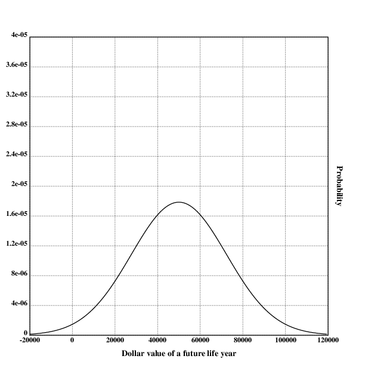
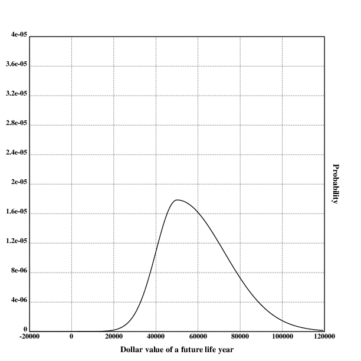

[home](./index.md)
-------------------

*author: niplav, created: 2019-10-18, modified: 2020-01-30, language: english, status: in progress, importance: 6, confidence: remote*

> __Is cryonics worth it, and if yes, should one
> [cryocrastinate](https://alcor.org/Library/html/cryocrastination.html)?
> [Betteridge's law of
> headlines](https://en.wikipedia.org/wiki/Betteridge's_law_of_headlines)
> only applies partially here: Yes, it is probably worth it (under
> plausible assumptions \$2.5 mio. for a 20 year old, and more for older
> people), and no, cryocrastination is usually irrational. A cost-benefit
> analysis written in Lua.__

Considerations on Cryonics
==========================

> If I died, would I be rid of my senses?  
Or will it retain, trapped within my corpse, in stasis?  
If I died, would I be a woman in heaven?  
Or would I fall asleep, not knowing what it’s like to feel alive?
> 
> If I died, would I begin with a new life?  
Or would I be gone as quickly as the breath I give last?  
If I died, would I be a woman in heaven?  
Or would I fall asleep, not knowing what it’s like to feel alive?

*– [Patricia Taxxon](https://www.youtube.com/channel/UCOjLfFE0TABS9bk05oH-kgw), [“Deconstruct”](https://patriciataxxon.bandcamp.com/track/deconstruct) from [“Foley Artist”](https://patriciataxxon.bandcamp.com/album/foley-artist), 2019*

Many would-be cryonicists cryocrastinate, i.e they put off signing
up for cryonics until a later point in their life. This has often been
explained by the fact that signing up for cryonics seems to [require high
conscientiousness](https://www.lesswrong.com/posts/hiDkhLyN5S2MEjrSE/normal-cryonics
"Normal Cryonics") and can be easily be delayed until another
point in life: "I'll get around to doing it eventually" – person
who was cremated. However, it hasn't yet been explored whether this
procrastination might be rational: Many cryonics organisations have high
membership fees, which might be avoided by waiting.

To find this out, I present a point-estimate model of whether (and
if yes, when) to sign up for cryonics. The model is written in
[Lua](https://www.lua.org/).

Note
----

This write-up is not intended as an introduction to the concept of
cryonics. For a popular introduction to the topic that clarifies many
common misconceptions about the practice, see [“Why Cryonics Makes
Sense”](https://waitbutwhy.com/2016/03/cryonics.html) by Tim Urban.

For more basic information about the topic, the [Cryonics
FAQ](http://www.benbest.com/cryonics/CryoFAQ.html) by Ben Best, a former
director of the Cryonics Institute, answers many questions, as well as
[Alcor's Cryonics FAQ](https://alcor.org/FAQs/index.html).

These texts should answer most questions people usually have about
cryonics.

Cost-Benefit Calculation for Cryonics
-------------------------------------

> If you make 50K\$/yr now, and value life-years at twice your income,
> and discount future years at 2% from the moment you are revived for a
> long life, but only discount that future life based on the chance it
> will happen, times a factor of 1/2 because you only half identify with
> this future creature, then the present value of a 5% chance of revival
> is \$125,000, which is about the most expensive cryonics price now.

*– [Robin Hanson](https://en.wikipedia.org/wiki/Robin_Hanson), [“Break Cryonics Down”](http://www.overcomingbias.com/2009/03/break-cryonics-down.html), 2009*

To find out whether to sign up for cryonics at all, one needs
to make a cost-benefit calculation. This has been [attempted
before](http://www.overcomingbias.com/2009/03/break-cryonics-down.html
"Break Cryonics Down"), but that analysis has been rather short
(disregarding several important factors) and it might be productive to
approach the topic independently.

The costs of cryonics are comparatively easy to calculate and contain
little uncertainty: The price of cryopreservation and life-insurance
are widely known, and can be easily added together. The benefits of
cryopreservation, however, contain a lot more uncertainty: It is not
at all clear that the technology for reuscitation will be developed,
cryonics organizations (or humanity) survive to develop such technology,
or that the future will be interested in reuscitating people from
cryopreservation.

The model presented makes the assumption that a person has a given age
and has the option of waiting for signing up for cryonics every year
up to their expected year of death. So, for example, a person that is
20 years old now is able to plan signing up when they are 20 years old,
21 years, 22 years and so on up to 78 years. The value of cryonics is
calculated, and the value of a regular death is tacitly assumed to be
\$0.

	curage=20
	actval={78.36, 78.64, 78.66, 78.67, 78.68, 78.69, 78.69, 78.70, 78.71, 78.71, 78.72, 78.72, 78.73, 78.73, 78.74, 78.75, 78.75, 78.77, 78.79, 78.81, 78.83, 78.86, 78.88, 78.91, 78.93, 78.96, 78.98, 79.01, 79.03, 79.06, 79.09, 79.12, 79.15, 79.18, 79.21, 79.25, 79.29, 79.32, 79.37, 79.41, 79.45, 79.50, 79.55, 79.61, 79.66, 79.73, 79.80, 79.87, 79.95, 80.03, 80.13, 80.23, 80.34, 80.46, 80.59, 80.73, 80.88, 81.05, 81.22, 81.42, 81.62, 81.83, 82.05, 82.29, 82.54, 82.80, 83.07, 83.35, 83.64, 83.94, 84.25, 84.57, 84.89, 85.23, 85.58, 85.93, 86.30, 86.68, 87.08, 87.49, 87.92, 88.38, 88.86, 89.38, 89.91, 90.47, 91.07, 91.69, 92.34, 93.01, 93.70, 94.42, 95.16, 95.94, 96.72, 97.55, 98.40, 99.27, 100.14, 101.02, 101.91}

	for age=curage,math.floor(actval[curage]) do
		print(value(age) .. ": " .. age)
	end

`curage` contains the current age of the user of the
program. `actval` is an actuarial table that contains at the
nth position the median life expectancy of a person that is
n years old at the moment for a western nation (in this case
[Germany](https://www.destatis.de/DE/Themen/Gesellschaft-Umwelt/Bevoelkerung/Sterbefaelle-Lebenserwartung/_inhalt.html)).

This model usually tries to err on the side of conservative estimates,
think of the lower range of a 50% confidence interval<!--TODO: wiki
link-->.

The Disvalue of Waiting
-----------------------

Two important factors play into the value (or disvalue) of waiting
to sign up for cryonics: [Motivation drift](./notes.html#Value-Drift)
and the possibility of dying before signing up.

	function value(age)
		return prob_signup(age)*prob_liveto(age)*(benefit(age)-cost(age))
	end

### Motivation Drift

<!--TODO: find out whether there has been any research into the concrete shape
of motivation drift-->

`prob_signup` is a function that calculates the probability of signing
up for cryonics after having waited up to having a certain age. It
seems clear that people loose motivation to finish plans over time,
especially if they are unpleasant or complex. A good example for this is
people being motivated at the start of the year to do regular exercise:
How many of those actually keep their promises to themselves? They
might start off exercising, but after the first few weeks the first
people drop out, and and a couple of months there is nearly nobody left
still going to the gym. It seems like there is a strong [regression to
the mean](https://en.wikipedia.org/wiki/Regression_toward_the_mean) in
regards to action: Most regular actions are replaced by inaction, most
strong values are replaced by apathy over time. A similar phenomenon
seems likely for signing up for cryonics: At first, people are very
enthusiastic about signing up, but then loose interest as time progresses.

It doesn't seem obvious how strong motivation drift is and
how it develops over time (some people might regain motivation
after some time), but intuitively it seems like a [geometric
distribution](https://en.wikipedia.org/wiki/Geometric_distribution). The
reasoning is as follows: Imagine that a thousand people have the
motivation to perform a given action n years into the future. Every year,
a certain percentage p of the people still motivated loses interest
in performing that action and drop out. After n years, the number of
people who perform the action is `$1000*p^n$` (the percentage of people
still motivated is `$p^n$`).

When trying to find out what the value of p is for oneself, one can
imagine a thousand independent identical copies of oneself planning a
complex plan one year ahead. How many of those would actually follow
through on that plan? Intuitively, I'd say that it can't be much higher
than 95%, possibly much lower, especially for something as complex and
time-consuming as signing up for cryonics.

	decay=0.95
	function prob_signup(age)
		return decay^(age-curage)
	end

Interestingly, this does not mean that the decision of whether to be
cryonically preserved or not is then set in stone as soon as possible:
Cryonics memberships are very easy to cancel, in nearly all cases a
simple email and a cessation of paying membership fees suffices. Signing
up for cryonics earlier protects against regression to the mean, which
means apathy or lack of motivation towards cryonics, but does not protect
against changing ones mind about cryonics: If one becomes convinced it's
bullshit later, one can easily get out (much more easily than getting in).
On the other hand, there might be a feeling of considerable sunk cost
due to already paid membership fees and the acquired life insurance.

It will be assumed that once one is signed up for cryonics, one stays
signed up for it.

### Dying Before Signing Up

If you die before signing up, all possible value (or disvalue) of cryonics
gets lost. So we want to calculate the probability of dying before having
a certain age given being currently `curage` years old.

Mortality rates are often calculated using a so-called [Gompertz
distribution](https://en.wikipedia.org/wiki/Gompertz_distribution). I
determined the b and eta values by eyeballing [Wolfram
Alpha](https://www.wolframalpha.com/input/?i=life+expectancy+of+a+0+year+old+german)
and using a calculator in [Tomasik
2016](https://reducing-suffering.org/estimating-aggregate-wild-animal-suffering-from-reproductive-age-and-births-per-female/#Choosing_a_distribution
"Estimating Aggregate Wild-Animal Suffering from Reproductive Age and
Births per Female")<!--TODO: find out which exact values statisticians
use, then use them-->.

	b=0.108
	eta=0.0001

	function gompertz(age)
		return math.exp(-eta*(math.exp(b*age)-1))
	end

`gompertz` returns the probability of reaching `age`
starting from birth, but I need the probability of reaching
`age` given one is already `curage` years old. With [Bayes
theorem](https://en.wikipedia.org/wiki/Bayes'_theorem) one can calculate
that

	$$Pr[X \ge age|X \ge curage]\\
	=\frac{Pr[X \ge curage \cap X \ge age]}{Pr[X \ge curage]}\\
	=\frac{Pr[X \ge age]}{Pr[X \ge curage]}$$

`$Pr[X \ge curage \cap X \ge age]$` is equal to `$Pr[X \ge age]$` because
being older than `age` is (in this calculation) a subset of being older
`curage`, and `$A \subset B \Rightarrow A \cap B=A$`. Some precautions
have to apply in the case that the probabilities of reaching `age` is
not independent of the probability of reaching `curage`, but those are
difficult to estimate and will not be implemented here.

This way, one can implement the probability of living until `age` given
`curage` the following way:

	function prob_liveto(age)
		return gompertz(age)/gompertz(curage)
	end

### Longevity Escape Velocity

Longevity Escape Velocity<!--TODO: wikipedia link--> (short LEV) is
the name for the possible year when anti-aging technology becomes so
good that people can be rejuvenated faster than they age. Although the
concept is considered idle speculation in many circles, many futurists
justify not signing up for cryonics because they expect that LEV will
arrive during their lifetime, and see no reason to sign up for a cryonics
membership they are probably not going to need anyway. In this text,
I will consider LEV by assuming there will be a certain year after which
the probability of death is practically zero.

I somewhat arbitrarily set this year to 2080<!--TODO: find some estimates
of LEV-->, though many futurists seem more optimistic<!--TODO source-->:

	levyear=2080

Calculating the Cost
--------------------

Calculating the cost is comparatively straightforward, but there are
some hidden variables (like opportunity costs and social costs) that
have to be considered (not all of these are considered in this text).

The raw cost for cryonics depends heavily on the organisation
choosen for preservation, the basic price range is from ~\$20000
to ~\$250000<!--TODO: Sources for these, maybe more exact numbers
for different organisations.-->. In this case, I chose the costs for
neurocryopreservation at Alcor, though this analysis should be extended
to other organisations.

Raw cryonics cost can be split into three different parts:
membership fees, comprehensive member standby costs and the cost for
cryopreservation.

	function cost(age)
		return membership_fees(age)+pres_cost(age)+cms_fees(age)
	end

### Membership Fees

Membership fees for Alcor are calculated using the age of the member
and the length of their membership.

#### Direct Fees

> Current Membership Dues, net of applicable discounts, are:  
1. First family member: \$525 annually or \$267 semi-annually or \$134 quarterly.  
2. Each additional family member aged 18 and over, and full-time students aged 25 and under: \$310 annually or \$156 semi-annually or \$78 quarterly.  
3. Each minor family member under age 18 for the first two children (no membership dues are required for any additional minor children): \$80 annually or \$40 semi-annually or \$20 quarterly  
4. Full-time student aged 26 to 30: \$460 annually or \$230 semi-annually or \$115 quarterly.  
5. Long-term member (total membership of 20 - 24 years): \$430 annually or \$216 semi-annually or \$108 quarterly.  
6. Long-term member (total membership of 25 - 29 years): \$368 annually or \$186 semi-annually or \$93 quarterly.  
7. Long-term member (total membership of 30 years or longer): \$305 annually or \$154 semi-annually or \$77 quarterly.  
8. Long-term member (total membership of 40 years or longer): \$60.00 annually or \$30.00 semi-annually or \$15.00 quarterly

*– [Alcor Life Extension Foundation](https://alcor.org/), [“Alcor Cryopreservation Agreement - Schedule A”](https://alcor.org/BecomeMember/scheduleA.html), 2016*

The following assumptions will be made in the implementation:

1. The person considering signing up for cryonics is over 18 years old.
2.	If the person is under 25 years old, they are a
	student. Considering the fact that cryonics members seem to
	be more likely to be rich and educated, this seems likely,
	though maybe a bit classist. The code can be changed if personal
	need arises.
3. If the person is over 25 years old, they are not a student.
4. The person stays a member until their death (otherwise the cryonics
	arrangement doesn't work).
5.	The membership fees will not be changed drastically over time. In
	fact, inflation adjusted prices for cryonics have mostly stayed
	constant <!--TODO: link the charts from the cryonics wiki
	entry)-->, so this is a reasonable assumption.
6.	The cryonicist will know when LEV has occurred, and will cancel
	their membership starting from that year.

The implementation is quite straightforward:

	function alcor_fees(age)
		local left=math.min(math.floor(actval[age])-age, levyear-curyear)
		local cost=0

		if age<25 then
			newage=25
			cost=(newage-age)*310
		end
		if left>=30 then
			cost=cost+(left-30)*305
			left=30
		end
		if left>=25 then
			cost=cost+(left-25)*368
			left=24
		end
		if left>=20 then
			cost=cost+(left-20)*430
			left=20
		end
		if age<=25 then
			cost=cost+(left-(25-age))*525
		else
			cost=cost+left*525
		end

		return 300+cost
	end

#### Comprehensive Member Standby

<!--TODO: find out how CMS really works!-->

> For Members residing in the continental U.S. and Canada: Alcor will
provide Comprehensive Member Standby (CMS) to all Members (standby
in Canada may be subject to delays due to customs and immigration
requirements), which includes all rescue activities up through the time
the legally pronounced Member is delivered to the Alcor operating room
for cryoprotection. __This charge is waived for full-time students under
age 25 and minors (under age 18).__

*– [Alcor Life Extension Foundation](https://alcor.org/), [“Alcor Cryopreservation Agreement - Schedule A”](https://alcor.org/BecomeMember/scheduleA.html), 2016*

Emphasis mine.

> Current CMS charges are:  
> \$180 annually, \$90 semi-annually, or \$45 quarterly

*– [Alcor Life Extension Foundation](https://alcor.org/), [“Alcor Cryopreservation Agreement - Schedule A”](https://alcor.org/BecomeMember/scheduleA.html), 2016*

I will assume that the cryonics member starts paying a CMS fee starting
10 years before their actuarial age of death.

	cms=180

	function cms_age(age)
		return actval[age]-10
	end

	function cms_fees(age)
		return cms*(actval[age]-cms_age(age))
	end

### Preservation Cost

There are several different methods of funding cryonics, the most
popular of which seems to be life insurance.  I haven't spent much time
investigating the exact inner workings of life insurances, so I will
make the assumption that the insurance companies price their products
adequately, so one doesn't have much of a financial advantage by choosing
life insurance as opposed to simply saving money & paying the cryonics
membership in cash. I also assume that life insurance companies can
accurately price in the arrival date of LEV.

> Minimum Cryopreservation Funding:  
> • \$200,000.00 Whole Body Cryopreservation […].  
> • \$80,000.00 Neurocryopreservation […].  
> […]  
> Surcharges:  
> • \$10,000 Surcharge for cases outside the U.S. and Canada other than China.  
> • \$50,000 Surcharge for cases in China.  
> […]

*– [Alcor Life Extension Foundation](https://alcor.org/), [“Alcor Cryopreservation Agreement - Schedule A”](https://alcor.org/BecomeMember/scheduleA.html), 2016*

I assume that the person considering signing up lives outside of the
U.S (but not in China), since a lot more people live outside the U.S
than inside of it. I also assume that the person wants to sign up for
neurocryopreservation.  With these assumptions, the function that returns
preservation costs becomes quite simple:

	function pres_cost(age)
		return 90000
	end

### Other Possible Costs

There is a number of different additional costs that have not been
considered here because of their (perceived) small scale or difficult
tractability.

These include opportunity costs for the time spent informing oneself
about cryonics (tens of hours spent), opportunity costs for the time
spent signing up (tens of hours spent), social costs by seeming weird
(though cryonics is easy to hide, and most cryonicists seem to be rather
vocal about it anyways), and alienating family members who necessarily
come into contact with cryonics (considering the ["Hostile Wife
Phenomenon"](https://www.biostasis.com/is-that-what-love-is-the-hostile-wife-phenomenon-in-cryonics/
"Is That What Love is? The Hostile Wife Phenomenon in Cryonics")).

Calculating the Benefit
-----------------------

Calculating the benefit of cryonics carries a great uncertainty, but
basically it can be divided into six distinct components: The probability
of being preserved, the probability of revival, the amount of years gained
by cryonics, the value of one lifeyear, the probability of living to the
year when one will sign up, and the probability of then dying before LEV.

	function benefit(age)
		return prob_pres*prob_succ*years_gain*val_year*prob_liveto(age)*prob_diebeforelev(age)
	end

Here, I will only take [point
estimates](https://en.wikipedia.org/wiki/Point_estimation) of these
values. Perhaps a Monte-Carlo simulation would be more appropriate,
but one can use my current implementation provides a starting-point. As
one can see, I will not do any time-discounting on the value of future
life-years.  <!--TODO: find a link that explains why time discounting
for future life years is probably misguided-->

### Value of a Lifeyear in the Future

Much ink and pixels have been spilled on the question of the
quality of the future, very little of it trying to make accurate
predictions.<!--TODO: find out what positive/negative/circular/other
accounts of history are called, link to some source contrasting them,
or provide some contrasting myself--> One way to look at the question
could be to create clear criteria that encapsulate the most important
human values and ask a prediction market to start betting. This could
include the power of humanity to make most important decisions regarding
its development and resource management, diversity among human beings,
average happiness and lifespans and other variables such as inequality
regarding resources.

But a much simpler way of approaching the topic could be the following:
One takes arguments from both sides (proclaiming positive futures
and negative futures) and prematurely concludes that the future is on
average going to be neutral, with a high variance in the result. But
some problems present themselves: In different value systems, "neutral"
means very different things. Strictly speaking, a utilitarian would
see human extinction as neutral, but not net neutral (the utility of
a world without any sentient beings is exactly 0, which is presumably
lower than the current value of the world), anti-natalists consider an
empty world to be a positive thing, and most people working on preventing
human extinction would consider such a world to be a gigantic loss of
opportunity, and therefore net negative.

There seems to be no simple way to resolve these conflicts, otherwise it
would have been written down up to now. But it seems like most people
would take the current state of affairs as neutral, with improvements
in happiness, meaning and wealth to be positive, and decreases in
those to be negative. Also, they don't see dying tomorrow as a neutral
event.

There are two different methods of putting a value on human life:
the [VSL](https://en.wikipedia.org/wiki/Value_of_life) and the
[QALY](https://en.wikipedia.org/wiki/Quality-adjusted_life_year).
The Wikipedia page on VSL
[lists](https://en.wikipedia.org/wiki/Value_of_life#Estimates_of_the_value_of_life)
\$182000 for the value of a year of life in Australia, and \$50000 as the
"de facto international standard most private and government-run health
insurance plans worldwide use to determine whether to cover a new medical
procedure". This number seems like a good conservative estimate.

Interestingly, this approximately equals a year of waking hours worth
the minimum wage (`$\$10*16*7*52=\$58240$`)<!--TODO: find source for
the minimum wage in different countries!-->.

Intuitively, the probability distribution over the value of a year of
life in the future should then look like this:

	.l("nplot")
	.l("nstat")

	grid([-20000 120000 20000];[0 0.00004 0.000004])
	xtitle("Probability")
	ytitle("Dollar value of a future life year")
	plot({n.pdf(x;50000;500000000)})
	draw()

Note that this graph is not based on real data and only for illustrative purposes.

But one can take another factor into account: Most negative future
scenarios don't lead to reuscitation (civilisational collapse, stable
totalitarianism, existential catastrophes like AI failure, nuclear
war, biotechnological disaster and natural catastrophe all reduce
human capabilities or keep them constant, preventing the development
of reuscitation technology). In most of the negative futures, there
are either no more humans around or people don't have time, energy or
resources to bring people back from cryonic preservation (if indeed they
still *are* in preservation by that point), and for malicious actors, in
most scenarios it is easier to create new people than to bring preserved
people back.

This effect might be dampened by the consideration that most possible
futures have net-negative value, but on the other hand, nearly all of
those futures don't lead to reuscitation.

This would mean that the probability distribution over the value of
a lifeyear in the future conditional on being reuscitated could look
like this:

	.l("nplot")
	.l("nstat")

	grid([-20000 120000 20000];[0 0.00004 0.000004])

	xtitle("Probability")
	ytitle("Dollar value of a future life year")
	plot({:[x>50000;n.pdf(x;50000;500000000);0.4472*n.pdf(x;50000;100000000)]})
	draw()

<!--TODO: wouldn't that just shift the normal curve rightwards? Think about it.-->

Note that this graph is not based on real data and only for illustrative purposes.

#### Negative Scenarios

However, I can think of 3 very specific (and thereby highly unlikely)
scenarios where people could be reuscitated into a (for them) net-negative
world.

##### Ascended Economy

The [ascended
economy](http://slatestarcodex.com/2016/05/30/ascended-economy/) is a
scenario where the development of capitalism diverges significantly from
the desires of humans, leading to most (if not all) of humanity becoming
extinct. It seems highly unlikely, but possible that cryopreserved
humans are placed into the hands of an algorithm that invests the
money in the relevant funds to reuscitate the cryopreserved humans at a
certain point. This algorithm could receive little (or no) information
on what to do with the reuscitated humans afterwards, leading either
to these humans quickly dying again because of an economy where they
are worthless, or being kept alive solely for fulfilling the contract
that is embedded in the algorithm. This might lead to insanity-inducing
boredom as the humans are kept alive as long as algorithm manages to,
possibly hundreds or thousands of years. This would have net-negative
value for the people reuscitated.

##### Basilisk

A superintelligence becomes a
[singleton](https://en.wikipedia.org/wiki/Singleton_(global_governance))
and starts behaving malevolently either because of a [near
miss](https://reducing-suffering.org/near-miss/ "Astronomical
suffering from slightly misaligned artificial intelligence") in
its implementation or or because it attempts to perform [acausal
trade](https://wiki.lesswrong.com/wiki/Acausal_trade) with people in
the past. This would lead to cryopreserved people being reuscitated,
having their brains scanned and executed as a brain emulation, copied
and put into very painful conditions.

##### Information from the Past is Valuable

In a future where agents that don't care about humans find the
cryopreserved remains of humans, they might be interested in extracting
information from those brains. If it is not possible to extract this
information without reviving the cryopreserved people, they might
reuscitate them and then interrogate these revived people for a very
long time, with little regard for their well-being.

#### Steps for Reducing the Risk from such Scenarios

> b) When, in Alcor's best good faith judgement, it is determined
that attempting revival is in the best interests of the Member in
cryopreservation, Alcor shall attempt to revive and rehabilitate the
Member. It is understood by the Member that a careful assessment of
the risks versus the benefits of a revival attempt will be material to
determining when to attempt revival. […]  
d) Where it is possible to do so, Alcor represents that it will be guided
in revival of the cryopreserved Member by the Member's own wishes and
desires as they may have been expressed in a written, audio, or video
__Statement of Revival Preferences and Desires__, which the Member may at
his/her discretion attach to this Agreement.

*– [Alcor Life Extension Foundation](https://www.alcor.org/), [“Cryopreservation Agreement”](./doc/considerations_on_cryonics/cryopreservation_agreement_alcor_2012.pdf) p. 15/16, 2012*

Although not a failsafe measure, steps can be taken to reduce
the risks from hellish scenarios above by making arrangements with
cryonics organisations. This may include not wanting cryopreservation
to continue in an ascended economy, objecting to revival as an
[emulation](https://en.wikipedia.org/wiki/Brain_emulation) or revival
after more than a certain number of years (to prevent being reuscitated
in an incomprehensibly strange and alien world).

#### Other Thoughts

Many people argue that the value of a year of life in the future might
be much lower than in the present, because friends and familiy are not
around, and it is very likely that the future will be extremely alien and
unfamiliar.

These are valid considerations, but can be dampened a bit: Humans have
shown to adapt to very different and varied circumstances, and humans
today feel that modern life in big cities with regular calendars and
highly structured lives without any worries about survival is normal,
while for most humans who ever lived, it would be anything but. One
can speculate that very similar facts will also hold for the future
(becoming increasingly unlikely the further reuscitation lies in the
future). There would certainly be a big culture shock in the future,
but it seems not qualitatively different from the shock people have
when they visit different countries today.  It is possible that future
societies might try to help people with this kind of future shock,
but that is of course far from certain.

It is true that most cryonicists will not be able to convince their
friends and family to sign up for it too, so they will be alone in
the future at first. People today sometimes leave their friends and
even families to move to other places, but those people seem to be
the exception rather than the norm. However, people nearly always
move on with their life, even as they get divorced, get estranged
from their friends or see their children less regularly – they
don't seem to prefer death to continuing their lives without
specific people. This consideration doesn't seem to be a [True
Rejection](https://www.lesswrong.com/rationality/is-that-your-true-rejection).

<!--
https://en.wikipedia.org/wiki/Value_of_life
-->

After these considerations, I conservatively set the value of a lifeyear
in the future to \$50000.

	val_year=50000

### Probability of Revival

> Specific equations and values have been
> proposed, usually yielding probability of success
> 0 < x < 10%. For example, Steven Harris in 1989 estimated
> [0.2-15%](http://www.alcor.org/Library/html/WillCryonicsWork.html),
> R. Mike Perry in the same article runs a different analysis to arrive at
> 13-77%, [Ralph Merkle](http://www.merkle.com/cryo/probability.html)
> suggests >85% (conditional on things like good preservation,
> no dystopia, and nanotech); Robin Hanson calculated in 2009 a
> [~6%](http://www.overcomingbias.com/2009/03/break-cryonics-down.html)
> chance, Roko gave
> [23%](http://lesswrong.com/lw/3j/rationality_cryonics_and_pascals_wager/);
> Mike Darwin in 2011 (personal communication)
> put the odds at <10%; an [informal survey of >6
> people](https://docs.google.com/spreadsheet/ccc?key=0Ajn1LpstEUO_dE00ZVVfa3pzX2Y2dk9mWWRKOUVkWlE#gid=0)
> ([LW
> discussion](http://lesswrong.com/lw/fz9/more_cryonics_probability_estimates/))
> averaged ~17% success rate; [Jeff
> Kaufman](http://www.jefftk.com/p/breaking-down-cryonics-probabilities)
> in 2011 provides a calculator with suggested
> values yielding 0.2%; The [2012 LessWrong
> survey](http://lesswrong.com/lw/fp5/2012_survey_results/) yields a mean
> estimate of cryonics working of 18% (n=1100) and among ‘veterans’ [the
> estimate](https://web.archive.org/web/20131229234145/http://squid314.livejournal.com/349656.html)
> is a lower 12% (n=59) - but interestingly, they seem to be more likely
> to be signed up for cryonics.

*– [Gwern Branwen](https://www.gwern.net), [“Plastination versus Cryonics”](https://www.gwern.net/plastination), 2014*

Besides these estimates, there exist also two related questions
on the prediction website metaculus. ["Before 1 January 2050,
will any human cryonically preserved for at least 1 year be successfully
revived?"](https://www.metaculus.com/questions/1626/before-1-january-2050-will-any-human-cryonically-preserved-for-at-least-1-year-be-successfully-revived/)
has a median probability of 16% (n=117), ["If
you die today and get cryonically frozen, will you "wake
up"?"](https://www.metaculus.com/questions/455/if-you-die-today-and-get-cryonically-frozen-will-you-wake-up/)
receives 2% (n=407). I am not sure where the difference comes from,
perhaps either from worries about the quality of current preservation or
from a low trust in the longevity of cryonics organisations. [This google
sheet](https://docs.google.com/spreadsheets/d/1qn7c7rYmYx3KtqvhXTUGiiyuBk5e9kG3sA3jF-4zk6U/)
contains 7 estimates of success: 0.04%, 0.223%, 29%, 6.71%, 14.86%,
0.23% and 22.8%, with various different models underlying these estimates.

Calculating the mean of these results in a chance of ~13%:

	$$\frac{0.2\%+15\%+13\%+77\%+85\%+6\%+23\%+9\%+17\%+0.2\%+1100*18\%+59*12\%+117*16\%+407*2\%+0.04\%+0.223\%+29\%+6.71\%+14.86\%+0.23\%+22.8\%}{1700} \approx 13.83\%$$

It would certainly be interesting to set up a prediction market for this
question, or get a team of superforecasters to estimate it, but basically,
it seems like for a young or middle-aged person, the estimated probability
is around 10%. However, the people surveyed are often sympathetic to
cryonics or even signed up, and people in general are overconfident,
so being conservative by halving the estimate seems like a good idea.

	prob_succ=0.05

### Years Gained

Conditional on being revived, what is the average life expectancy?

If revival is achieved, it seems highly likely that aging and most
degenerative diseases have been eradicated (it makes little sense to
revive a person that is going to die again in 10 years). Also, most
revival scenarios hinge upon either the feasibility of very advanced
nanotechnology, which seems to be highly conducive to fixing aging,
or on whole brain emulation scenarios, which would likely make aging
unnecessary (why on purpose degrade a digital brain?).

If revival happens, there are still risks from accidents and homicide or
suicide that can kill the reuscitated cryonicist, as well as existential
risks that face all of humanity.

The website Polstats [illustrates](http://polstats.com/#!/life)
the risks purely from accidents and homicides
using data from the [Information Insurance
Institute](http://www.iii.org/fact-statistic/mortality-risk). They
arrive at "a much more impressive 8,938 years" average life
expectancy. An [answer](https://math.stackexchange.com/a/3044240)
on Mathematics StackExchange to the question
["What's the average life expectancy if only dying from
accidents?"](https://math.stackexchange.com/questions/3044194/whats-the-average-life-expectancy-if-only-dying-from-accidents)
arrives at 2850 years.

<!--TODO: there is also an EA forum post about LEV that for
some complex mathematical reasons estimates 1000 years. Find,
read & incorporate-->

Taking existential risks into account is a bit harder. It is unclear
whether most of the probability mass for existential risks should be
placed before reuscitation of cryonics patients becomes feasible,
or after it. It is also unclear how high the existential risk for
humanity is overall. Assuming that the existential risk for humanity
over the next 10000 years is ~40% (this number is pretty much a
guess)<!--TODO: link Metaculus Ragnarok series, and see if someone
like FHI has done some calculations on that-->, and half of that risk
is placed before reuscitation, then the life expectancy of cryonics is
`$\frac{8938+2850}{2}*(1-0.20)=4715.2$`.

That number should be qualified further in an ["Age of
Em"](https://en.wikipedia.org/wiki/The_Age_of_Em) scenario: that scenario
will contain less natural risks (emulation can be backed up, they live
in a simulated world where homicide risks and care accidents make no
sense), but an em also suffers from the risk of not having enough money
to continue being run, and from the fact that the em era might not last
several subjective millennia. This scenario deserves further consideration
(see also [Hanson 1994](http://mason.gmu.edu/~rhanson/uploads.html
"If Uploads Come First").

To conclude, it seems like reuscitated cryonicists will on average live
around 4500 years, although there is room for debate on this number.

	years_gain=4500

<!--
DOI: 10.2307/1973599
-->

### Probability of Being Preserved

It seems like not all people who sign up for cryonics remain cryonicists
until their death, and not all cryonicists who die as members actually
get preserved.

There seems to be very little data about this question, but as an
extremely conservative estimate I would put the ratio of members of
cryonics organizations who actually get preserved at 60% (it seems likely
that the actual number is higher). Fortunately, a cryonics member can
increase this number by being diligent about their cryonics arrangement,
living near the preservation facility before death, informing family
members about their arrangement, trying to lead a safe life and keeping
contact to their cryonics organisation.

	prob_pres=0.6

### Surviving Until LEV

The benefit of cryonics is only realized in one case: One lives to
the planned year of signing up, but then dies before LEV. Both dying
before signing up or living until LEV make the value of cryonics
0\$. One can calculate the probability of this scenario by multiplying
the probabilities of living until signup with the probability of then
dying before LEV.

To calculate the probability of living to a given age, we can use
the gompertz distribution again:

	function prob_liveto(age)
		return gompertz(age)/gompertz(curage)
	end

The probability of dying before LEV is 0 if LEV has already occurred:

	if curyear+(age-curage)>levyear then
		return 0

Othewise, we assume that one has signed up for cryonics at `age`
and now wants to know the probability of dying until LEV. That is the
same as `$1-\Pr[Living until LEV]$`, or the probability of living until
`curage+(levyear-curyear)` given one has already lived until `age`.

	else
		return 1-(gompertz(curage+(levyear-curyear))/gompertz(age))
	end

Conclusion
----------

The complete code for the model can be found
[here](./code/considerations_on_cryonics/cryoyear.lua).

### Standard Parameters

With the parameters presented above, it turns out that it is optimal to
sign up for cryonics right away, mainly because the motivation drift
punishes the procrastination quite heavily.

#### Currently 20 years old

At the age of 20 years, the value of signing up for cryonics the
same year is \$2797894 (`$~\$2.7*10^6$`) according to this model,
prolonging the decision until one is 30 reduces this number to \$1666580
(`$~\$1.6*10^6$`), and waiting until 40, 50 and 60 years yields a value
of \$982100 (`$~\$9.8*10^5$`), \$559610 (`$~\$5.5*10^5$`) and \$287758
(`$~\$2.8*10^5$`), respectively.

	.l("nplot")

	data::.r()

	grid([0],(#data),[10];[0],(|/data),[1000000])

	xtitle("Years from now")
	ytitle("Dollar value of signing up for cryonics")
	barplot(data)
	draw()

#### Currently 40 years old

The values of signing up for cryonics look very similar to the values
for a 20 year old. Performing the signup immediately at age 40 is worth
\$6590556 (`$~\$6.6*10^6$`) at age 40 and is the best time to do it.

	.l("nplot")

	data::.r()

	grid([0],(#data),[10];[0],(|/data),[1000000])

	xtitle("Years from now")
	ytitle("Dollar value of signing up for cryonics")
	barplot(data)
	draw()

### Without Motivation Drift

Since many people question the idea of motivation drift and trust
themselves in the future a lot, one can simulate this trust by setting
the `decay` parameter to 1.

In this model, a very different picture emerges:

	.l("nplot")

	data::.r()

	grid([0],(#data),[10];[0],(|/data),[1000000])

	xtitle("Years from now")
	ytitle("Dollar value of signing up for cryonics")
	barplot(data)
	draw()

It is still optimal to sign up without hesitation, but now the difference
is much lower.

	$ lua cryoyear.lua 20 50000 0.05 0.6 4500 1 | sort -n | tail -10
	2785676.2860511: 29
	2787605.1801168: 28
	2789611.0731771: 27
	2791107.7280825: 26
	2792420.5648782: 25
	2793783.1701729: 24
	2794997.5035013: 23
	2796078.6567918: 22
	2797040.1939684: 21
	2797894.3040717: 20

This means that cryocrastination is not that much of a sin even with a
lot of self trust.

### The Critic's Scenario

Somebody who is very critical might object and argue that the probability
of success is much lower, and even if cryonics succeeds, it will not
lead to extremely long lifespans. Let's say they also don't believe in value
drift. Such a person might propose the following assignment of variables:

	curage=20
	val_year=50000
	prob_succ=0.01
	years_gain=50
	prob_pres=0.6
	decay=1

In this case, signing up for cryonics has negative value that converges
to 0 the older one gets:

	$ lua cryoyear.lua 20 50000 0.01 0.6 50 1 | sort -n | tail -10
	-80320.313507659: 69
	-78526.595695932: 70
	-77042.774290053: 71
	-75002.570281634: 72
	-72832.328023689: 73
	-70916.116822976: 74
	-68452.980090227: 75
	-65840.832675399: 76
	-63425.293847013: 77
	-60490.80006618: 78

Please note that the following graph should have negative values on the
y-axis. This should get fixed sometime in the future.

	.l("nplot")

	data::-.r()

	grid([0],(#data),[10];0,(|/data),[10000])

	xtitle("Years from now")
	ytitle("Dollar value of signing up for cryonics")
	fillrgb(0.4;0.4;1)
	barplot(data)
	draw()

<!--
### Where Waiting Makes Sense

$ lua cryoyear.lua 22 50000 0.1 0.6 100 1 180 100000 2080
-->

### Other Modifications

It is possible to think of many other modifications to the parameters
in the script, including the probability of cryonics success, the value
of a lifeyear, the amount of years gained, or even bigger modifications
such as adding models for the probability of the development of life
extension technology in the near future.

The reader is encouraged to enter their own value and execute the script
to determine whether it is advantageous for them to sign up for cryonics,
and if yes, whether cryocrastination would be a good idea.

<!--
Appendix A: A Guesstimate Model
-------------------------------

Use getguesstimate.com here
-->

<!--
From todo.md:

* Considerations on Cryonics
	* Value of a year of life in the future
		* Freedom to die again?
		* How probable is malevolent AI?
		* What about "meh" futures?
		* What about work, friends, language, culture and other circumstances?
		* What about reduced agency?
			* Historically increasing agency for most agents (is this true?)
	* Which methods of revival?
		* Personal identity?
		* If only neuropreservation, where do I get my body from?

A perhaps similar article by Anders Sandberg?
-->
