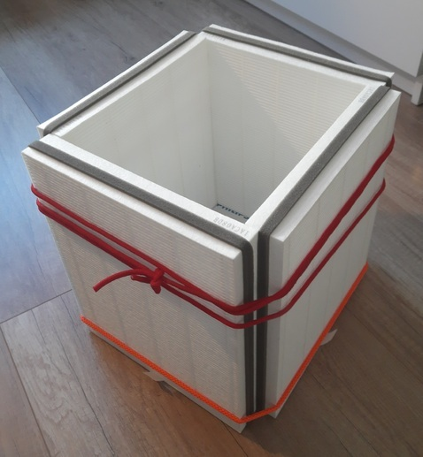

[home](./index.md)
------------------

*author: niplav, created: 2024-01-30, modified: 2024-01-30, language: english, status: finished, importance: 2, confidence: log*

> __Report of having built a [cuboid](https://dynomight.net/better-DIY-air-purifier.html).__

Building a Cuboid
==================

Inspired by [dynomight 2021a](https://dynomight.net/air/ "Better air quality is the easiest way not to die"),
I decided to replicate their design for the
[cuboid](https://dynomight.net/better-DIY-air-purifier.html "The Cuboid: A DIY air purifier that's better than a box-fan")
(the [cheaper box fan air
purifier](https://dynomight.net/2020/12/15/some-real-data-on-a-DIY-box-fan-air-purifier/ "Experiments on a $50 DIY air purifier you can make in 30s")
was intolerably violating my æsthetic sensibilities). The
design is, incidentally, very similar to the [Corsi-Rosenthal
Box](https://en.wikipedia.org/wiki/Corsi%E2%80%93Rosenthal_Box).

### Materials

* 4 filters
* 1 fan
* 2 pieces of string
* 4 pieces of cardboard

### Building Process

First, I arranged the four filters as described in [dynomight
2021b](https://dynomight.net/better-DIY-air-purifier.html "The Cuboid: A DIY air purifier that's better than a box-fan")
and tied them together using some pieces of string I had lying around
(the bungee cords I had ordered were too short and would have broken
the filters—a lesson in thinking about dependencies! Fortunately
they weren't expensive), with the red rope giving the contraption a nice
[kinbaku](https://en.wikipedia.org/Japanese_bondage) æsthetic.

I then cut out two pieces of cardboard (`$2110 \text{mm} \cdot 2400 \text{mm}$`)
that fit right into the column, for stabilization,

and also a piece (`$2340 \text{mm} \cdot 2650\text{mm}$`) that I could
impishly tape to the bottom of the cuboid ("works for me").

Next, the fan arrived, so I cut out a lid from some cardboard I got
my [queal](https://queal.com) packages in (again `$2110 \text{mm} \cdot 2400 \text{mm}$`,
as with the bottom), and from that lid I cut a 950mm diameter circle
for the fan.

Assembling the cuboid was now easy: Just put the lid on top, put in the
fan, plug in the fan, and voilà:

My cuboid ~3200mm wide, ~2900mm deep, and ~3900mm high (the knots in
the cords make exact measurement difficult).
Æsthetically, the three different primary colors are a bit much, but
I'm not *that* bothered by it (although if someone wants to set up a line
of turbo cuboids, all red and black and sleek, sign me up as interested).

### Does it Work?

Probably! I haven't measured air quality yet, but at least it appears
to be sucking the air through the filters:

<video src="./vid/cuboid/it_works.webm" type='video/webm' controls>
The video shows a piece of paper affixed to the cuboid, when I try to move the paper with a pencil, it gets sucked back to the cuboid.
</video>

<!--TODO: add tooltip for video-->

I also haven't checked the energy usage yet.

My cuboid is loud enough that I probably won't be running it while I
try to sleep: With a background noise of ~18dB, the cuboid raises that
to ~40dB at 1m horizontal and 0m vertical distance (measured using [Sound
Meter](https://play.google.com/store/apps/details?id=com.gamebasic.decibel "no affiliation")):

, and the y-axis being 0 to 100 (dB). The chart is barely under 20 for x between 0 and 5 seconds, then for two seconds there are two spikes, after which the line rises to 40dB, where it stays until x is 22. Then, there is a short
spike, after which the curve falls geometrically, until it reaches ~20dB at second 25, where it stays until second 30.")

### Price & Time Cost

My cuboid was a bit pricier than the one by dynomight, but not by much:
4 filters, each 23€, the fan  with 38€, and the two bungee cords
for 2€ (I don't count them since I didn't use them in the end): 130€
in total.

It took me a quite a while longer to assemble my cuboid than the alleged
5 minutes: I would estimate that I spent at least 90 minutes one it
(plus another 45 minutes writing this note).

But, all in all, I'm very happy with
my little cuboid. It's humming along to some
[Beethoven](https://en.wikipedia.org/wiki/Piano_Concerto_No._1_\(Beethoven\))
while I write this.
