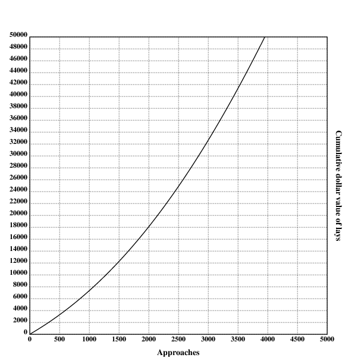
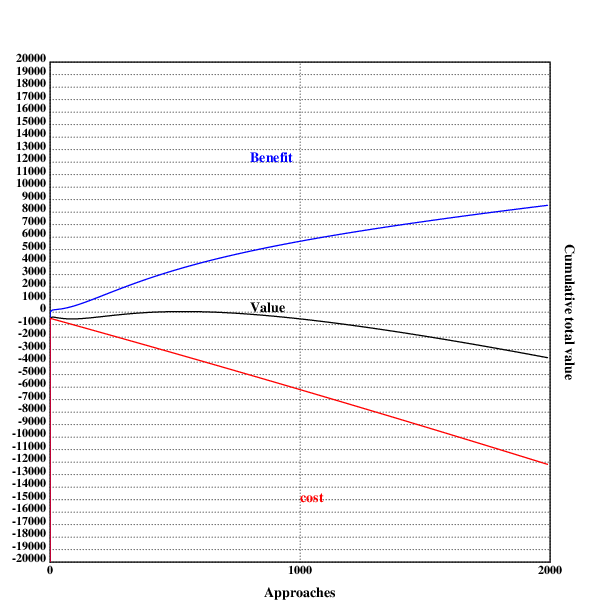

[home](./index.md)
-------------------

*author: niplav, created: 2019-12-25, modified: 2020-08-04, language: english, status: in progress, importance: 4, confidence: remote*

> __Is daygame worth it, and if yes, how much? I first present a simple
> point-estimate cost-benefit value estimation written in Klong and find
> that daygame is probably worth ~\$1000 maximum, at ~500 approaches,
> though the number varies strongly under different assumptions. After
> that, I modify the model to capture more of the nuance, and arrive at
> ~\$2100 of value for ~1000 approaches. I then perform a Monte-Carlo
> estimation to determine the uncertainty around the expected value and
> find that in the simple case the value of daygame ranges from -\$3300 to
> \$3200 (5th/95th percentile), with a median of \$900 and a mean of \$550,
> and in the complex case \_.__

Daygame Cost-Benefit Analysis
=============================

> These things should be left to the frigid and impersonal
> investigator, for they offer two equally tragic alternatives to
> the man of feeling and action: despair if he fail in his quest,
> and terrors unutterable and unimaginable if he succeed.

*– [Howard Phillips Lovecraft](https://en.wikipedia.org/wiki/H._P._Lovecraft), [“From Beyond”](http://www.hplovecraft.com/writings/texts/fiction/fb.aspx), 1934*

<!--TODO: How to hyphenate the title?-->

<!--TODO: different diminishing returns in code, make all
logarithmic/radical/hyperbolic?-->

> Daygame is the art of meeting and attracting women during the daytime
> in different locations and at different times of the day.

*– [Sebastian Harris](https://www.globalseducer.com/), [“Daygame: A Quick Beginner’s Guide“](https://www.globalseducer.com/daygame/), 2018*

Many daygamers follow the [London Daygame
Model](https://tddaygame.com/london-daygame-model/) which is fairly
linear and based on approaches that last 5-10 minutes each.

Is this method of daygame worth it, and if yes, how much should one
be doing?

In this text, I first review existing texts on the topic and find them
lacking in several ways. I then present a simple and general model
for the value of doing a number of daygame approaches, and find that it
recommends doing 484 approaches with a value of \$969 in the optimum. I
then extend the model to more subjective and hard to measure factors
such as positive side effects, effects of daygame on mood and similar
other factors, and estimate that \_.

The models presented don't consider externalities, be they positive or
negative. That is the subject of a different debate.

Similar Analyses
----------------

One already existing cost analysis of game is [Free Northerner
2012](https://freenortherner.wordpress.com/2012/06/12/economic-analysis-of-casual-sex-prostitution-vs-game/ "Economic Analysis of Casual Sex – Prostitution vs Game"),
he focuses on nightgame in bars and clubs and concludes that

> Cost for Sex [from prostitution]: \$300  
> Cost for sex [from game]: \$460 (\$200 is you enjoy clubbing, gaming,
> and dating for their own sake)  
> […]  
> For casual sex, a mid-range prostitute is cheaper than game.
> On the other hand, most of game’s costs are in the form of time
> opportunity costs, so if you have a lot of free time and little money
> or you enjoy the activities of clubbing, game, or dating  even without
> the promise of sex, then game might be a better deal.
> In addition, the higher your average wage, the more expensive game
> becomes relative to prostitution, as the opportunity costs of game
> increase the more potential earning you sacrifice.
> Conclusion: For obtaining casual sex, game is the better option if you
> are paid low wages and have free time or if you enjoy game and related
> activities. Prostitution is the better option if you are middle-class,
> don’t have the free time, or dislike engaging in game.

*– [Free Northerner](https://freenortherner.com/), [“Economic Analysis of Casual Sex – Prostitution vs Game”](http://freenortherner.com/2012/06/12/economic-analysis-of-casual-sex-prostitution-vs-game/), 2012*

(Inconsistent capitalization is in the original text)

However, his analysis doesn't take daygame into account (he mentions
it at the end). Daygame seems to me to be a much better option (not
just for people who don't like nightclubs): it's healthy due to moving
around a lot outside, getting drunk is mostly not an option, it doesn't
mess up the sleep schedule, one doesn't have to pay to get into clubs,
and it can be combined with sightseeing in foreign cities.

He also doesn't consider positive side-effects from game (such as
increased confidence), negative side-effects from prostitution (such as
addiction<!--TODO: link to prostitution addiction-->), and diminishing
returns in his analysis.

<!--TODO: he has written a text about marriage & relationships, analyze that too?
https://freenortherner.com/2012/11/01/financial-analysis-of-sex-relationship-vs-marriage/
-->

Ratios
------

In daygame-lingo, the word "ratio" usually refers to the ratio between
approaches and contact information (such as phone numbers)/dates/women
slept with (colloquially "lays"). In this text, I'm interested in the
approach-to-date ratio (here the ratio of first dates to approaches)
and the approach-to-lay ratio.

> 30 approaches will get me between 10 - 15 phone numbers.  
> Half of these phone numbers will flake leaving me messaging around 5 -
> 8 girls.  
> I will get half of these girls out on dates (between 2 - 4) and sleep
> with 1 or 2.  
> These are realistic stats, this is cold approach, cold approach
> is tough.

*– [James Tusk](https://project-tusk.com), [“Realistic Daygame Statistics (Daygame Tips)”](https://project-tusk.com/blogs/the-tusk-diaries/realistic-daygame-statistics), 2017*

James Tusk is a very good looking daygame coach, so these numbers are
quite high.

[daygamersbible
2018](https://daygamersbible.wordpress.com/2018/05/23/daygame-statistics-and-what-they-tell-your-daygame/ "Daygame Statistics and What They Tell About Your Daygame")
proclaims
16.9% numbers/approaches, 22.4% dates/numbers and 37.1% lays/dates
(that would be `$0.169*0.224=0.0378$` dates per approach, and
`$0.169*0.224*0.371=0.0140$` lays per approach).

Tom Torero presents his experiences with daygame ratios in
[this video](https://www.youtube.com/watch?v=7WzKWHvDOOQ)
[(a)](./vid/daygame_cost_benefit/realistic_daygame_expectations.webm).
He claims that a beginner will on average get a lay out of a hundred
approaches, an intermediate one out of fifty, and an advanced daygamer
one lay out of thirty. He doesn't specify how much practice makes
a beginner/intermediate/advanced daygamer.

The numbers for the approach-to-lay ratios were 1 in
100 for beginners, 1 in 50 for intermediate daygamers and 1 in 30 for
experts. I will assume that this is comparatively over-optimistic, and
assume that the date-to-lay ratio starts at 1 in 200, and then converges
towards 1 in 50 on the scale of thousands of approaches:

	ratiobegin::0.005
	ratioexp::0.02
	ratio::{ratiobegin+(ratioexp-ratiobegin)*(1-500%x+500)}

These numbers are of course heavily dependant on all kinds of factors:
attractiveness, speed of learning, effort exerted in daygame, logistics
and much much more.

I will also assume that one in three series of dates with the same woman
leads to a lay:

	dateratio::{3*ratio(x)}

Visualizing this shows the following:

	.l("./load.kg")

	.l("nplot")

	grid([0 10000 1000];[0 0.07 0.002])
	xtitle("Approaches")
	ytitle("Cumulative ratios")

	plot(ratio)
	text(250;60;"Approach-to-lay ratio")

	setrgb(0;0;1)
	plot(dateratio)
	text(200;250;"Approach-to-date ratio")

	draw()

### Empirical Data for Ratios

Fortunately, daygamers are often very diligent in keeping track records
of their ratios and even publish them.

Here, I collect cumulative date and lay ratios from several blogs. I
don't count idates as dates, because I'm not sure whether daygamers
usually pay for them or not.

Note that these numbers are just stats some guys wrote on the internet,
usual qualifiers about the accuracy of these values apply.

#### Roy Walker

I am also not sure whether at some points "dates" was all dates combined,
and later was split into "first date", "second date" etc. For simplicity I
assume that in the beginning, "dates" simply referred to "first date". It
still seems to be coherent.

[Roy Walker](https://roywalkerdaygame.wordpress.com/):

* [Before 2016](https://roywalkerdaygame.wordpress.com/2016/08/07/the-journey-two-years-in/)
* [2016](https://roywalkerdaygame.wordpress.com/2017/01/02/2016-the-year-of-1000-sets/)
	* [March](https://roywalkerdaygame.wordpress.com/2016/04/02/march-review/)
	* [April](https://roywalkerdaygame.wordpress.com/2016/05/02/april-review/)
	* [May](https://roywalkerdaygame.wordpress.com/2016/06/02/may-review/)
	* [June](https://roywalkerdaygame.wordpress.com/2016/07/03/june-review/)
	* [September](https://roywalkerdaygame.wordpress.com/2016/10/01/herpescelling/)
	* [November](https://roywalkerdaygame.wordpress.com/2016/12/02/nonotchvember/)
* [2017](https://roywalkerdaygame.wordpress.com/2018/01/06/2017-the-year-of-ups-and-downs/)
	* [January](https://roywalkerdaygame.wordpress.com/2017/02/04/keep-er-lit/)
	* [February](https://roywalkerdaygame.wordpress.com/2017/02/27/enjoy-the-process/)
	* [March](https://roywalkerdaygame.wordpress.com/2017/04/09/is-daygame-getting-harder-in-london/)
	* [April](https://roywalkerdaygame.wordpress.com/2017/05/15/update-a-month-on-the-road/) (?)
	* [July-September](https://roywalkerdaygame.wordpress.com/2017/10/09/game-over/)
* [2018](https://roywalkerdaygame.wordpress.com/2019/01/09/2018-a-year-of-change/)
* [4000 sets](https://twitter.com/RoyWalkerPUA/status/1183757732551282690)
* [2019](https://roywalkerdaygame.wordpress.com/2020/01/07/2019-the-year-of-meh/)
	* [January](https://roywalkerdaygame.wordpress.com/2019/02/19/ketchup-in-glass-bottles/)

Lay ratios:

	rwlay::[[511 5][901 10][977 10][1060 11][1143 13][1216 14][1380 16][1448 18][1557 19][1990 27][2063 27][2130 27][2230 27][2373 31][2540 35][2876 44][3442 62][3567 63][3991 83][4092 84]]
	rwlayrat::{(*x),%/|x}'rwlay

Date ratios:

	rwdate::[[511 19][901 38][977 38][1060 40][1143 46][1216 48][1380 58][1448 63][1557 64][1990 81][2063 81][2130 84][2230 85][2373 91][2540 97][2876 126][3442 165][3567 170][3991 200][4092 202]]
	rwdaterat::{(*x),%/|x}'rwdate

#### Seven

[Seven](https://sevendaygame.wordpress.com/) (he says that "I started
my daygame journey back in 2014", so there is information missing):

* [2016](https://sevendaygame.wordpress.com/2017/01/21/dec-2016-report-2016-review-and-kicking-off-2017/) (July to December)
	* [July](https://sevendaygame.wordpress.com/2016/10/03/a-year-of-daygame-in-tallinn-estonia-aug-2015-to-aug-216/) (?)
	* [August](https://sevendaygame.wordpress.com/2016/09/08/august-2016-daygame-stats/)
	* [September](https://sevendaygame.wordpress.com/2016/10/12/september-2016-daygame-report/)
	* [October](https://sevendaygame.wordpress.com/2016/11/06/october-2016-daygame-report/)
	* [November](https://sevendaygame.wordpress.com/2016/12/12/november-2016-daygame-report/)
* [2017](https://sevendaygame.wordpress.com/2018/01/15/2017-review-a-year-in-st-petersburg/)
	* [January](https://sevendaygame.wordpress.com/2017/02/15/january-2017-review-end-of-eurojaunt-and-new-life-in-st-petersburg/)
	* [February](https://sevendaygame.wordpress.com/2017/03/13/february-2017-review-need-to-go-back-to-basic-stacking/)
	* [March](https://sevendaygame.wordpress.com/2017/04/02/march-2017-review-no-lay-month/)
	* [April](https://sevendaygame.wordpress.com/2017/05/10/april-2017-review-pretty-standard-month/)
	* [May](https://sevendaygame.wordpress.com/2017/06/13/may-2017-review-feeling-like-a-number-collector/)
	* [June](https://sevendaygame.wordpress.com/2017/07/17/june-2017-review-another-no-lay-month/)
	* [July](https://sevendaygame.wordpress.com/2017/08/07/july-2017-review-best-month-this-year-so-far/)
	* [August](https://sevendaygame.wordpress.com/2017/09/04/august-2017-review-quiet-in-term-of-game/)
* [2018](https://sevendaygame.wordpress.com/2019/01/20/2018-review-well/)

Lay ratios:

	slay::[[38 3][176 4][238 5][318 8][344 9][367 11][434 12][478 13][543 13][588 14][663 15][691 15][752 17][774 18][853 20][942 20][1087 24]]
	slayrat::{(*x),%/|x}'slay

Date ratios:

	sdate::[[38 8][174 11][236 14][318 21][344 23][367 26][434 27][478 27][543 32][588 33][663 36][691 41][752 44][774 47][853 53][942 54][1087 76]]
	sdaterat::{(*x),%/|x}'sdate

His numbers are quite high, and I'm not really sure why – perhaps a
combination of only taking numbers from somebody experienced, combined
with the fact that he does daygame in russia, which is supposedly easier
than London, where most of the others publishing data do daygame.

<!--Add:
https://sevendaygame.wordpress.com/2020/06/28/2019-review-it-was-good/ -->

#### Mr. White

[Mr. White](https://mrwhitedaygame.wordpress.com/) didn't publish
statistics from the beginning (this data is from his 8th & 9th year of
doing daygame), this information is therefore unfortunately incomplete:

* [2018](https://mrwhitedaygame.wordpress.com/2019/01/02/2018-daygame-results-stats-and-overview/)
* [2019](https://mrwhitedaygame.wordpress.com/2020/01/02/2019-daygame-results-stats-and-overview/)

Lay ratios:

	mwlay::[[700 13][1212 25]]
	mwlayrat::{(*x),%/|x}'mwlay

Date ratios:

	mwdate::[[700 30][1212 68]]
	mwdaterat::{(*x),%/|x}'mwdate

#### Thomas Crown

[Thomas Crown](https://thomascrownpua.wordpress.com):

* [2016/2017](https://thomascrownpua.wordpress.com/2016-17/)
* [2018](https://thomascrownpua.wordpress.com/2018-statistics/)
* [2019](https://thomascrownpua.wordpress.com/2020/01/03/2019-in-review/)

The 2019 review unfortunately doesn't contain the number of approaches, but he writes:

> I got 11 lays this year and my approach to lay ratio was around 1:53
> with roughly the same age and quality: an improvement on last year’s
> ratio.

*– [Thomas Crown](https://thomascrownpua.wordpress.com), [“2019 In Review”](https://thomascrownpua.wordpress.com/2020/01/03/2019-in-review/), 2020*

From this one can deduce that the number of approaches was `$11*53=583$`,
or at least a number somewhere near that.

Lay ratios:

	tclay::[[208 2][1638 20][2453 34][3036 45]]
	tclayrat::{(*x),%/|x}'tclay

Date ratios (he talks about dates, but it's not clear what the number
of first dates is. I'll still collect the data, but take with a grain
of salt) (also, his 2019 review doesn't say anything about the number
of dates, so that is omitted):

	tcdate::[[208 12][1638 79][2453 116]]
	tcdaterat::{(*x),%/|x}'tcdate

#### Krauser

[Krauser](https://krauserpua.com/) (who started sometime in 2009,
I believe, so these numbers are after several years of training):

* [2013](https://krauserpua.com/2014/01/01/my-2013-daygame-stats/)
* [2014](https://krauserpua.com/2015/01/03/my-2014-daygame-stats/)
* [2015](https://krauserpua.com/2016/01/02/my-2015-daygame-stats/)

> Most of these numbers rely upon estimates because I didn’t keep notes.

*– [Nick Krauser](https://krauserpua.com/), [“My 2013 Daygame Stats”](https://krauserpua.com/2014/01/01/my-2013-daygame-stats/), 2014*

Lay ratios:

	klay::[[1000 27][1480 50][2150 65]]
	klayrat::{(*x),%/|x}'klay

Date ratios:

	kdate::[[1000 60][1480 110][2150 160]]
	kdaterat::{(*x),%/|x}'kdate

<!--TODO: these two

#### Runner

[Runner](http://daygamenyc.com):

* [First 2000 approaches](http://daygamenyc.com/2019/05/31/approaching-2000-approaches/)
* [First 2 years](http://daygamenyc.com/2019/08/06/2-years-on-is-daygame-worth-it/)
* [2019](http://daygamenyc.com/2020/01/01/im-now-an-intermediate-level-daygamer/)

#### Tom Torero

[Tom Torero](https://tomtorero.com/):

* [2013](https://krauserpua.com/2014/01/02/guest-post-tom-toreros-2013-daygame-stats/)

And this one:

https://old.reddit.com/r/seduction/comments/9ock2a/my_daygame_experience_so_far_statistics_and/
-->

#### Visualizing the Data

* Green: Roy Walker
* Beige: Seven
* Blue: Mr. White
* Purple: Thomas Crown
* Red: Krauser

The plotted data for lay ratios looks like this:

	.l("./load.kg")
	.l("./data.kg")

	.l("nplot")

	grid([0 10000 1000];[0 0.04 0.002])
	xtitle("Approaches")
	ytitle("Cumulative ratios")

	plot(ratio)
	text(250;60;"Approach-to-lay ratio")

	setdot(4)

	:"Data for Roy Walker ratios"

	fillrgb(0.109;0.847;0.588)
	scplot2(rwlayrat)

	:"Data for Mr. White ratios"

	fillrgb(0.4;0.4;1)
	scplot2(mwlayrat)

	:"Data for Thomas Crown ratios"

	fillrgb(0.7;0.2;0.7)
	scplot2(tclayrat)

	:"Data for Seven ratios"

	fillrgb(0.8;0.8;0.1)
	scplot2(slayrat)

	:"Data for Krauser ratios"

	fillrgb(1;0;0)
	scplot2(klayrat)

	draw()

Similarly, the data for reported date ratios:

	.l("./load.kg")
	.l("./data.kg")

	.l("nplot")

	grid([0 10000 1000];[0 0.08 0.002])
	xtitle("Approaches")
	ytitle("Cumulative ratios")

	plot(dateratio)
	text(200;250;"Approach-to-date ratio")

	setdot(4)

	:"Data for Roy Walker ratios"

	fillrgb(0.109;0.847;0.588)
	scplot2(rwdaterat)

	:"Data for Mr. White ratios"

	fillrgb(0.4;0.4;1)
	scplot2(mwdaterat)

	:"Data for Thomas Crown ratios"

	fillrgb(0.7;0.2;0.7)
	scplot2(tcdaterat)

	:"Data for Seven ratios"

	fillrgb(0.8;0.8;0.1)
	scplot2(sdaterat)

	:"Data for Krauser ratios"

	fillrgb(1;0;0)
	scplot2(kdaterat)

	draw()

A Simple Model
--------------

### Cost

Daygame has several different obvious costs: [opportunity
costs](https://en.wikipedia.org/wiki/Opportunity_cost) from the time
spent approaching and dating women who then flake (one could be doing
better things in the same time, like pursuing other hobbies, learning
a language or musical instrument) and simply the cost of paying for dates.

#### Approaching Opportunity Cost

> First you'll need to desensitise yourself to randomly chatting up
> hot girls sober during the day. This takes a few months of going out
> 3-5 times a week and talking to 10 girls during each session (keep each
> session to no more than 2 hours).

*– [Tom Torero](https://tomtorero.com/), [“Beginner's Guide to Daygame”](./doc/daygame_cost_benefit/beginners_guide_to_daygame_torero_2018.pdf) p. 6, 2018*

> Most regular hustlers go out 3-5 times a week and do 10 approaches
> each session, meaning 30-50 per week.

*– [Tom Torero](https://tomtorero.com/), [“Beginner's Guide to Daygame”](./doc/daygame_cost_benefit/beginners_guide_to_daygame_torero_2018.pdf) p. 13, 2018*

I will assume that most daygamers will do around 4 approaches an hour
(the ones I have met are more choosy, so they have a lower volume),
with 15 minutes for one approach.

The opportunity cost of daygame is unclear – what would one be doing
instead? One could dream of daygamers instead cultivating friendships,
learning languages or instruments and meditating, and while that could
certainly sometimes be the case, a lot of that time would also be spent
on mindlessly browsing the internet, watching netflix or doing other
things that aren't terribly fulfilling or valuable. Economists often
assume that the opportunity cost of an activity to be the money one
could have earned with a minimum wage job during that time<!--TODO:
[citation needed]-->, but that seems to go too far: an additional hour
spent working might be net negative, even with taking wage into account
(working hours have diminishing and at some point negative [marginal
utility](https://en.wikipedia.org/wiki/Marginal_utility) because of
exhaustion).

<!--TODO: minimum wage in different western countries
https://en.wikipedia.org/wiki/Minimum_wage-->

Furthermore, the physical activity while doing daygame is broadly good:
most people probably don't spend enough time outside walking around
(reducing Vitamin D deficiency), and interacting with other people.

On the other hand, it may be that daygame only replaces "productive
personal time", that the energy exerted in daygame misses in other
productive activities, while the amount spent on downtime & unfulfilling
stuff stays constant.

I will tentatively set the opportunity cost of an hour of daygame to \$5,
but would be interested in further input:

	oppcost::5

Daygamers who could earn more with their day job might want to adjust
this number upwards.

#### Costs from Dates

##### Opportunity Cost

[Free Northerner
2012](https://freenortherner.wordpress.com/2012/06/12/economic-analysis-of-casual-sex-prostitution-vs-game/ "Economic Analysis of Casual Sex – Prostitution vs Game")
assumes 3 dates, it is common wisdom <!--TODO: any sort of
link-->originating from Mystery that 7 hours is a normal time spent on
dates until having sex.

Data from [Roy Walker](https://roywalkerdaygame.wordpress.com/) includes
numbers of dates starting from 2018:

* [2018](https://roywalkerdaygame.wordpress.com/2019/01/09/2018-a-year-of-change/)
* [2019](https://roywalkerdaygame.wordpress.com/2020/01/07/2019-the-year-of-meh/)
	* [January](https://roywalkerdaygame.wordpress.com/2019/02/19/ketchup-in-glass-bottles/)

He reports 76 first dates, 27 second dates, 11 third dates and 5 fourth
dates. This means that he went on 5 dates with 4 women, on 3 dates with
`$11-5=6$` women, and so forth. This means that the average number of dates he
went on per first date was
`$\frac{5*4+(11-5)*3+(27-11)*2+(76-27)}{76} \approx 1.566$`
– quite lower than the 3 assumed by [Free Northerner
2012](https://freenortherner.wordpress.com/2012/06/12/economic-analysis-of-casual-sex-prostitution-vs-game/ "Economic Analysis of Casual Sex – Prostitution vs Game")!

For [Seven](https://sevendaygame.wordpress.com/), the numbers can be found here:

* [2016](https://sevendaygame.wordpress.com/2017/01/21/dec-2016-report-2016-review-and-kicking-off-2017/)
* [2017](https://sevendaygame.wordpress.com/2018/01/15/2017-review-a-year-in-st-petersburg/)
* [2018](https://sevendaygame.wordpress.com/2019/01/20/2018-review-well/)

He reports 76 first dates, 21 second dates, 13 third
dates, 6 fourth dates and 1 fifth date. This results in
`$\frac{(1*5+(6-1)*4+(13-6)*3+(21-13)*2+(76-21))}{76} \approx 1.54$`
dates per lay, again smaller.

Similarly, Thomas Crown reports [1.4 dates on average for a lay in
his first year](https://thomascrownpua.wordpress.com/2016-17/ "2016/17 Statistics")
and [1.1 for his
second](https://thomascrownpua.wordpress.com/2018-statistics/ "2018 Statistics").

I will assume 1.8 dates on average lasting 3.5h each, because the numbers
above are from people who have already done many approaches:

	datelen::3.5
	avgdates::1.8

##### Paying for Dates

On dates, one usually needs to pay for drinks, food, and perhaps a taxi,
there doesn't seem to be much information about the exact costs out
there. I will assume \$20 for a date.

	datecost::20

#### Calculating the Cost

The cost of daygame is the sum of the opportunity cost from approaching,
the opportunity cost of dates and the direct cost of paying for dates:

	cost::{(oppcost*x%apprperhour)+(dateratio(x)*datecost*avgdates*x)+dateratio(x)*datelen*avgdates*oppcost}

The resulting function is linear on the number of approaches:

	.l("./load.kg")

	.l("nplot")

	grid([0],maxappr,[1000];[-12000 0 500])
	xtitle("Approaches")
	ytitle("Cumulative dollar cost of dates")
	plot(cost)
	draw()

### Benefit

#### Value of Having Sex

The thing providing most of the value from daygame is the sex with
different women. Sex is not a homogenous commodity, but has a wildly
differing value, depending on the attractiveness of the partner and
their skill at sex. Nethertheless I will assume that the value of
sex averages out to the price of prostitution.

I will consider two different components of the value: the value of
the sex itself (as compared to prostitution) and the [sense of pride and
accomplishment](https://knowyourmeme.com/memes/events/star-wars-battlefront-ii-unlockable-heroes-controversy)
(knowing that one is developing ones skills in daygame, while prostitution
is often accompanied with shame<!--TODO: source-->).

##### Value of the Sex Itself

> According to this intro to escorting guide on a business blog
> for escorts (I guess escorts need business advice too; the weird
> things you find on the internet) costs about $250-500/hr depending
> on the city.

*– [Free Northerner](https://freenortherner.com/), [“Economic Analysis of Casual Sex – Prostitution vs Game”](http://freenortherner.com/2012/06/12/economic-analysis-of-casual-sex-prostitution-vs-game/), 2012*

<!--TODO: find own sources-->

This leaves us with ~\$300 per hour of prostitution.

An analysis of daygame contains some questions that are not obvious
to answer:

* If one has sex as the result of daygame, how long does one have sex?
* How often do daygamers sleep with the women they have seduced?
* How strong are the diminishing returns on sex with different partners?
* And how strong are the diminishing returns on sex with the same partner?

I have not found any people discussing this, and there is probably a
high variance in these numbers depending on the daygamer.

I will assume that one sex session lasts one hour and that the average
daygamer sleeps with the same woman 4 times (some women become regular sex
partners, even if the overwhelming majority is only a one-night stand).

I will also assume that the dimimishing returns on sex with different
partners are square-rooted, because for men having sex with many partners
has a high evolutionary benefit, and logarithmic returns would seem to
punishing for that.

I will also assume that the diminishing returns on sex with the same
partner _is_ logarithmic, because for men, having sex multiple times with
the same woman carries little evolutionary advantage except perhaps for
competition with other mens sperm.

These numbers are only preliminary, informed by reading daygame blogs.

So we can calculate that the value of seducing one woman is

		.l("math")
		300*ln(4*e)
	715.888308335967204

##### A Sense of Pride and Accomplishment

I will assume that the sense of pride and accomplishment is ~\$400. I
have no hard numbers on this, but it seems like a good approximation,
since this is just the number for the first daygame lay.

To wrap it up, one can conclude that the value of the first lay is

	prostcost::300
	prideval::400
	laynum::4
	firstlayval::prideval+prostcost*ln(e*laynum)

#### Calculating the Benefit

As said, I assume that the diminishing marginal returns on additional
sex partners can be calculated with the square root. The benefit of sex
can then be calculated with the square root of the expected amount of
sex for a given number of approaches and the value of the first lay.
Note that this number is cumulative, it considers the benefit of all
lays up to `x` approaches.

	layvals::{firstlayval*sqr(ratio(x)*x)}

This looks like this for up to 10000 approaches:

	.l("./load.kg")

	.l("nplot")

	grid([0],maxappr,[1000];[0 12000 500])
	xtitle("Approaches")
	ytitle("Cumulative dollar value of lays")
	plot(layvals)
	draw()

The benefit of approaching is then simply the value of the sex:

	benefit::{layvals(x)}

### Value

To now calculate the optimal amount of daygame, one simply calculates
the difference between cumulative benefit and cumulative cost for all
possible number of approaches up to the maximum possible number (in this
case 10000, more than that seems very difficult) and chooses the maximum:

		maxappr::10000
		vals::{benefit(x)-cost(x)}'!maxappr
		optim::*>vals
	484
		optimben::vals@*>vals
	969.13165157833204

So one can conclude that 484 approaches are optimal under these
assumptions, with a value of \$969.13.

This can be visualized as well:

	.l("nplot")

	.l("./res.kg")

	grid([0],maxappr,[1000];[-15000 15000 1000])
	xtitle("Approaches")
	ytitle("Cumulative total value")

	plot({benefit(x)-cost(x)})
	text(200;250;"Value")

	setrgb(0;0;1)
	plot(benefit)
	text(200;400;"Benefit")

	setrgb(1;0;0)
	plot({-cost(x)})
	text(250;60;"cost")

	bar(optim;15000+optimben;10000)

	draw()

<!--
### Solving Symbolically
-->

A Slightly More Complex Model
------------------------------

Of course one might answer that the simple model fails to capture much
of the subtlety of the situation: Proponents of daygame might mention
positive psychological side-effects such as increased self-confidence
and resilience to rejection. Opponents of daygame could point at direct
financial expenditures (such as possibly having to buy new clothes,
renting an apartment that is closer to good places for daygame),
and also possible social and psychological costs (scars from constant
rejection and mockery from being found out to be a pick up "artist"),
if they ever stopped moaning about how they disapprove of daygame.

These influences are of course much harder to quantify, and the numbers
presented here are mostly guesswork. As I get to know more daygamers
and do more daygame myself, I intend to update and refine this model
to better reflect reality.

Note that this slightly more complex model adds to the previous, simpler
model. Previously assumed costs and benefits are not altered.

### Additional Benefits

Besides sex, the additional benefits of daygame can be separated into two
broad categories: Increases in subjective well-being (from cultivating
a skill that requires effort and practice), and positive side effects
such as increased salary resulting from a higher willingness to negotiate
ones salary and search for other jobs.

#### Positive Side Effects

Let's assume one does 1000 daygame approaches per year.
Let's then assume that doing 1000 daygame approaches increases ones
expected salary by 0.5% in the first year, with then logarithmic increases
for each additional year, for 10 years.
The [parity purchasing power average annual
wage](https://en.wikipedia.org/wiki/List_of_countries_by_average_wage)
in the US was \$60k in 2017, but many industrialized countries are lower.
I'll assume that the average annual wage for a daygamer is \$40k, just
to be safe.

The code for calculating the monetary value of the positive side-effects of
doing x daygame approaches then is

	annsal::40000
	yearsben::10
	increase::0.005
	apppy::1000
	sideeff::{yearsben*increase*annsal*ln(1+x%apppy)}

#### Mental Benefit

This one is tricky, especially for somebody who has never done any
daygame approaches. Many daygamers seem to highly enjoy what they
do, but that is probably mostly due to selection bias.
I'll mostly rely on my personal experience and on this very biased sample
set here, so take this with a grain of salt. That said, I haven't read
any reports describing that the author stopped doing daygame due to
stress or uncontrollable anxiety, although people who would do that
would probably never start doing daygame in the first place.

To get to the point, I model the mental effects of daygame to be negative
in the beginning (increased anxiety, self-doubt, and insecurity),
and positive effects such as playful enjoyment, flow-states and
extraverted enthusiasm setting after in after an initial hump. These
positive states become less strong over time because of getting used
to pickup. Specifically, the negative effects peak at ~80 approaches
(with -\$500), and break even after ~300. The cumulative value approaches
\$1900 over thousands of approaches.

To model this, I abuse a [log-normal
distribution](https://en.wikipedia.org/wiki/Log-normal_distribution)
to represent the value over time:

	mental::{(10000*(ln.pdf((x*0.005)+0.5;1;1)))-1900}

### Additional Costs

#### Expenditures

Besides the cost for dates & opportunity costs, doing daygame might carry
a great amount of various expenditures: some daygamers move to appartments
that are closer to the centers of cities & are more expensive, there may
be some costs from upgrading ones wardrobe, buying condoms and possibly
sex toys.

In economics, costs are often divided into fixed costs (costs that are
not dependent on the amount of goods produced, in this case approaches
made) and variable costs (costs that are related to the amount of goods
produced).

Making the distinction between fixed costs and variable costs is sometimes
a bit tricky; similar in this case. Is buying new clothes a fixed or a
variable cost? Clothes wear down over time, and need to be bought again,
but the difference doing daygame makes in wearing down clothes is minor
at best. Also, some costs will depend on the time in ones life doing
daygame, but not on the amount of daygame: Doing daygame for 10 years,
but only with 100 approaches a year, will have different fixed costs
from doing it for a year, but 1000 approaches in that year. In making
the distinction between what counts as a fixed cost in this case and
what counts as a variable cost, I will mostly go with my gut feeling.

Note that it is also important to consider the counterfactual case:
Would these expenditures be made if the person wasn't doing daygame?

##### Fixed Costs

I assume that the fixed costs for doing any daygame at all are \$500:

	fixcost::500

<!--
To possible fixed costs I'd count the following:

* Logistics (higher rent from living closer to the city center)
* Sex toys
* Clothes (shoes, leather jacket etc.)
* Accessories (bracelets, beads, tattoos)
* Hygiene (better haircuts, marginal other improvements)
* Contacts (instead of glasses)
* Fitness (gym membership, buying weights)

Of course, not every daygamer pays for all of these.

Some of the above are dependent on the duration of the time in ones
life one spends with daygame. Having better logistics is a good example:
one can procrastinate daygaming and still be paying the higher rent for
better logistics.

Also time-dependent is better hygiene (I assume mostly marginal
improvements such as getting better haircuts, buying a bit more mouthwash
& floss and shaving a bit more often) and fitness (at least the fee for
gym memberships, weights don't need to be replaced that often).

For time-dependent costs, I assume that the daygamer is very committed,
and does 1000 approaches per year.

###### Logistics
-->
<!--TODO: find some examples for sources-->
<!--
I (without any research) assume that a daygamer will pay \$200 more per
year for logistics.

It seems to be relatively common for daygamers to move because of daygame,
I'll assume that 30% of them will do it.

###### Sex Toys
-->
<!--Find sources for average vibrator cost-->
<!--
I assume the daygamer counterfactually buys one vibrator (those who
buy more probably would also have bought sex toys in the counterfactual
case where they weren't doing daygame). A vibrator seems to cost ~\$30
on average.

Although buying sex toys has
been recommended by for example [The Red Quest
2019](https://theredquest.wordpress.com/2019/03/13/tell-your-girl-to-use-a-vibrator-during-sex-and-other-bedroom-tips/ "Tell your girl to use a vibrator during sex, and other bedroom tips and sex skills for guys"),
I haven't heard much discussion of this, and therefore assume that only
10% of daygamers will buy any kind of sex toys.

###### Clothes
-->
<!--TODO: find some sources/discussion?-->
<!--
Many daygamers seem to buy less flashy clothes, sometimes of higher
quality. I'm unsure how much these clothes introduce additional costs
and how much they just displace buying normal clothes. I'll pretty much
baselessly assume that the cost overhead is \$80.

This seems like something many daygamers do, I'll assume 80%.

###### Accessories

###### Hygiene

###### Contacts

###### Fitness

-->

##### Variable Costs

I assume that the variable costs are \$0.5 per approach:

	varcost::0.5

<!--
* Condoms
* Transportation (money for gas, public transport)

###### Condoms

###### Transportation

-->

##### Code

With this, one can easily calculate the additional exppenditures:

	expenditures::{fixcost+varcost*x}

#### Social Costs from Being Found Out

For some people doing daygame, being found out as a daygamer can have
negative consequences: Loosing friends, being publicly shamed, or even
having negative effects in the workplace. For this reason (and probably
also as a precautionary measure), many daygamers publish their writing
online anonymously.

But doing daygame can also have negative side-effects even if one doesn't
write about it online: Acquantainces could see one doing daygame and
tell it around in parts of ones social circle, leading to ostracisation
or financial consequences.

On the other hand, being discovered probably doesn't propagate through
ones whole social circle, and often probably has very small effects.

I model this as having a certain probability of being discovered as
a daygamer for every approach. Being found out more than once has
logarithmically increasing costs with the number of being found out.

I'll (somewhat arbitrarily) set the cost of first being found at \$500,
and the probability of being found out at any approach to 0.1%.

The probability of being discovered `n` times with
`x` approaches can be calculated using the [binomial
distribution](https://en.wikipedia.org/wiki/Binomial_distribution).

To make the code run faster, only the scenarios with a cost of more than
\$0.01 are being considered.

	fcbfo::300
	pbfo::0.001
	cbfo::{[t];t::x;+/{b.pmf(x;t;pbfo)*fcbfo*ln(e*x)}'1+!{(x<t)&00.1<b.pmf(x;t;pbfo)*fcbfo*ln(e*x)}{x+1}:~1}

### Value in the Complex Model

The global optimum is now calculated the same way as [here](#Value):

		optim::*>vals
	1024
		vals@*>vals
	2110.1350422531768

The more complex model with additional considerations therefore recommends
1024 approaches, with a value of ~\$2110.13.

Graphically:

	.l("nplot")

	.l("./res_complex.kg")

	grid([0],maxappr,[1000];[-20000 20000 1000])
	xtitle("Approaches")
	ytitle("Cumulative total value")

	plot({benefit(x)-cost(x)})
	text(200;250;"Value")

	setrgb(0;0;1)
	plot(benefit)
	text(200;400;"Benefit")

	setrgb(1;0;0)
	plot({-cost(x)})
	text(250;60;"cost")

	bar(optim;20000+optimben;10000)

	draw()

Conclusion
----------

I have presented both a simple and a more complicated cost-benefit
analysis for daygame. Both conclude that daygame is worth it, at around
500-1000 approaches, but the value is not enormous, with only a \$1-2k,
and decreases rapidly with less lenient assumptions.

I tentatively conclude that daygame may be worth it, but
it's definitely not a surefire positive deal. Sign up for
[cryonics](./considerations_on_cryonics.html "Considerations on Cryonics")
first.

Appendix A: A Guesstimate Version of the Simple Model
-----------------------------------------------------

Since there is a lot of uncertainty in the presented model, I thought
it'd be good to make a Monte-Carlo version of the model using the website
[Guesstimate](https://www.getguesstimate.com).

The model can be found [here](https://www.getguesstimate.com/models/15526).

### Inputs

Appendix B: A Slightly More Complex Guesstimate Model of the Value
------------------------------------------------------------------

### Inputs

Appendix C: Empirically Checking the Assumptions
------------------------------------------------

Log:

2 datasets, first containing approaches, 2nd containing approach sessions

1st file datapoints (in CSV):

* Approach index number
* Datetime
* Location (country)
* Blowout
* Contact info ∈{number,instagram,facebook,skype,snapchat etc.,other}
* Idate length (minutes)
* Idate cost (euro)
* Flake before 1st date (boolean)
* Date before first sex [1..10] cost (euro)
* Date before first sex [1..10] length (minutes)
* Sex number of times (roughly)
* Attractiveness (∈[1..10])

2nd file:

* Datetime start
* Datetime end
* Approaches index number range
* Number of approaches (evtl.)

<!--
Second one: fix costs & other stuff
Approximate ratio per:

1:200 for the first 500 approaches
1:100 for 500-1000
1:50 for 1000-2000
1:30 for everything afterwards
-->
