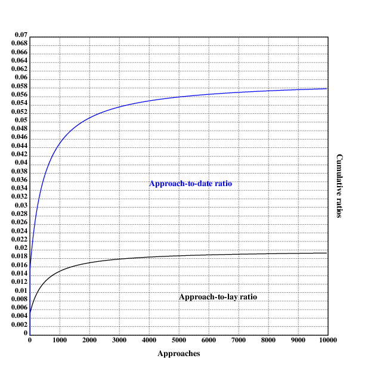
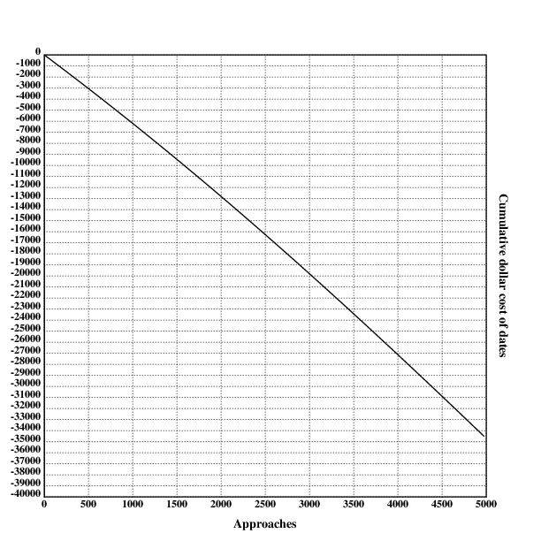

[home](./index.md)
-------------------

*author: niplav, created: 2019-12-25, modified: 2019-01-30, language: english, status: in progress, importance: 4, confidence: remote*

> __Is daygame worth it, and if yes, how much? I first present a simple
> point-estimate cost-benefit value estimation written in Klong and find
> that daygame is probably worth ~\$2000 maximum, at ~2000 approaches,
> though the number varies strongly under different assumptions. After
> that, I modify the model to capture more of the nuance, and arrive at
> \_. I then perform a Monte-Carlo estimation to determine the uncertainty
> around the expected value and find that _.__

<!--TODO: integrate data from here:
Roy Walker:

[Before 2016](https://roywalkerdaygame.wordpress.com/2016/08/07/the-journey-two-years-in/)
[2016](https://roywalkerdaygame.wordpress.com/2017/01/02/2016-the-year-of-1000-sets/)
	[March](https://roywalkerdaygame.wordpress.com/2016/04/02/march-review/)
	[April](https://roywalkerdaygame.wordpress.com/2016/05/02/april-review/)
	[May](https://roywalkerdaygame.wordpress.com/2016/06/02/may-review/)
	[June](https://roywalkerdaygame.wordpress.com/2016/07/03/june-review/)
	[September](https://roywalkerdaygame.wordpress.com/2016/10/01/herpescelling/)
	[November](https://roywalkerdaygame.wordpress.com/2016/12/02/nonotchvember/)
[2017](https://roywalkerdaygame.wordpress.com/2018/01/06/2017-the-year-of-ups-and-downs/)
	[January](https://roywalkerdaygame.wordpress.com/2017/02/04/keep-er-lit/)
	[February](https://roywalkerdaygame.wordpress.com/2017/02/27/enjoy-the-process/)
	[March](https://roywalkerdaygame.wordpress.com/2017/04/09/is-daygame-getting-harder-in-london/)
	[April](https://roywalkerdaygame.wordpress.com/2017/05/15/update-a-month-on-the-road/) (?)
	[July-September](https://roywalkerdaygame.wordpress.com/2017/10/09/game-over/)
[2018](https://roywalkerdaygame.wordpress.com/2019/01/09/2018-a-year-of-change/)
[2019](https://roywalkerdaygame.wordpress.com/2020/01/07/2019-the-year-of-meh/)
	[January](https://roywalkerdaygame.wordpress.com/2019/02/19/ketchup-in-glass-bottles/)
[4000 sets](https://twitter.com/RoyWalkerPUA/status/1183757732551282690)

Seven:

[2016](https://sevendaygame.wordpress.com/2017/01/21/dec-2016-report-2016-review-and-kicking-off-2017/) (July to December)
	[July](https://sevendaygame.wordpress.com/2016/10/03/a-year-of-daygame-in-tallinn-estonia-aug-2015-to-aug-216/) (?)
	[August](https://sevendaygame.wordpress.com/2016/09/08/august-2016-daygame-stats/)
	[September](https://sevendaygame.wordpress.com/2016/10/12/september-2016-daygame-report/)
	[October](https://sevendaygame.wordpress.com/2016/11/06/october-2016-daygame-report/)
	[November](https://sevendaygame.wordpress.com/2016/12/12/november-2016-daygame-report/)
[2017](https://sevendaygame.wordpress.com/2018/01/15/2017-review-a-year-in-st-petersburg/)
	[January](https://sevendaygame.wordpress.com/2017/02/15/january-2017-review-end-of-eurojaunt-and-new-life-in-st-petersburg/)
	[February](https://sevendaygame.wordpress.com/2017/03/13/february-2017-review-need-to-go-back-to-basic-stacking/)
	[March](https://sevendaygame.wordpress.com/2017/04/02/march-2017-review-no-lay-month/)
	[April](https://sevendaygame.wordpress.com/2017/05/10/april-2017-review-pretty-standard-month/)
	[May](https://sevendaygame.wordpress.com/2017/06/13/may-2017-review-feeling-like-a-number-collector/)
	[June](https://sevendaygame.wordpress.com/2017/07/17/june-2017-review-another-no-lay-month/)
	[July](https://sevendaygame.wordpress.com/2017/08/07/july-2017-review-best-month-this-year-so-far/)
	[August](https://sevendaygame.wordpress.com/2017/09/04/august-2017-review-quiet-in-term-of-game/)
[2018](https://sevendaygame.wordpress.com/2019/01/20/2018-review-well/)

Mr. White:

[2018](https://mrwhitedaygame.wordpress.com/2019/01/02/2018-daygame-results-stats-and-overview/)
[2019](https://mrwhitedaygame.wordpress.com/2020/01/02/2019-daygame-results-stats-and-overview/)

Thomas Crown:

[2016/2017](https://thomascrownpua.wordpress.com/2016-17/)
[2018](https://thomascrownpua.wordpress.com/2018-statistics/)
[2019](https://thomascrownpua.wordpress.com/2020/01/03/2019-in-review/)

Krauser:

[2013](https://krauserpua.com/2014/01/01/my-2013-daygame-stats/)
[2014](https://krauserpua.com/2015/01/03/my-2014-daygame-stats/)
[2015](https://krauserpua.com/2016/01/02/my-2015-daygame-stats/)

Runner:

[First 2000 approaches](http://daygamenyc.com/2019/05/31/approaching-2000-approaches/)
[First 2 years](http://daygamenyc.com/2019/08/06/2-years-on-is-daygame-worth-it/)
[2019](http://daygamenyc.com/2020/01/01/im-now-an-intermediate-level-daygamer/)

Tom Torero:

[2013](https://krauserpua.com/2014/01/02/guest-post-tom-toreros-2013-daygame-stats/)

More stats:

https://tddaygame.com/daygame-stats-blatant-lies/
https://project-tusk.com/blogs/the-tusk-diaries/realistic-daygame-statistics
https://daygamersbible.wordpress.com/2018/05/23/daygame-statistics-and-what-they-tell-your-daygame/
-->

Daygame Cost-Benefit Analysis
=============================

<!--TODO: How to hyphenate the title?-->

<!--TODO: different diminishing returns in code, make all
logarithmic/radical/hyperbolic?-->

<!--
> Daygame is the art of meeting and attracting women during the daytime
> in different locations and at different times of the day.

Source: https://www.globalseducer.com/daygame/
-->

I first review existing texts on the topic and find them lacking in
several ways. I then present a simple and general model for the value of
doing a number of daygame approaches, and find that it recommends doing
2032 approaches with a value of \$1914 in the optimum. I then extend the
model to more subjective and hard to measure factors such as positive
side effects, effects of daygame on mood and similar other factors,
and estimate that \_.

The models don't consider externalities, be they positive or
negative. That is the subject of a different debate.

Similar Analyses
----------------

One such already existing cost analysis of game is [Free Northerner
2012](https://freenortherner.wordpress.com/2012/06/12/economic-analysis-of-casual-sex-prostitution-vs-game/
"Economic Analysis of Casual Sex – Prostitution vs Game"), he focuses
on nightgame in bars and clubs and concludes that

> Cost for Sex [from prostitution]: $300  
> Cost for sex [from game]: $460 ($200 is you enjoy clubbing, gaming,
> and dating for their own sake)  
> […]  
> For casual sex, a mid-range prostitute is cheaper than game.
> On the other hand, most of game’s costs are in the form of time
> opportunity costs, so if you have a lot of free time and little money
> or you enjoy the activities of clubbing, game, or dating  even without
> the promise of sex, then game might be a better deal.
> In addition, the higher your average wage, the more expensive game
> becomes relative to prostitution, as the opportunity costs of game
> increase the more potential earning you sacrifice.
> Conclusion: For obtaining casual sex, game is the better option if you
> are paid low wages and have free time or if you enjoy game and related
> activities. Prostitution is the better option if you are middle-class,
> don’t have the free time, or dislike engaging in game.

*– [Free Northerner](https://freenortherner.com/), [“Economic Analysis of Casual Sex – Prostitution vs Game”](http://freenortherner.com/2012/06/12/economic-analysis-of-casual-sex-prostitution-vs-game/), 2012*

(Inconsistent capitalization is in the original text)

However, his analysis doesn't take daygame into account (he mentions
it at the end). Daygame seems to me to be a much better option (not
just for people who don't like nightclubs): it's healthy due to moving
around a lot outside, getting drunk is mostly not an option, it doesn't
mess up the sleep schedule, one doesn't have to pay to get into clubs,
and it can be combined with sightseeing in foreign cities.

He also doesn't consider positive side-effects from game (such as
increased confidence), negative side-effects from prostitution (such as
addiction<!--TODO: link to prostitution addiction-->), and diminishing
returns in his analysis.

<!--TODO: he has written a text about marriage & relationships, analyze that too?-->

Ratios
------

In daygame-lingo, the word "ratio" usually refers to the ratio between
approaches and contact information (such as phone numbers)/dates/women
slept with (colloquially "lays"). In this text, I'm interested in the
approach-to-date ratio (here the ratio of first dates to approaches)
and the approach-to-lay ratio.

I remember a Tom Torero video where he recounts these ratios for
beginners, but it seems to have been hidden since then (the [internet
archive version](https://web.archive.org/watch?v=DgLBWej72is) is also
not complete. If you have a copy, I'd be glad to pay a small amount
for it). The numbers for the approach-to-lay ratios were 1 in 100 for
beginners, 1 in 50 for intermediate daygamers and 1 in 30 for experts. I
will assume that this is comparatively over-optimistic, and assume that
the date-to-lay ratio starts at 1 in 200, and then converges towards 1
in 50 on the scale of thousands of approaches:

	ratiobegin::0.005
	ratioexp::0.02
	ratio::{ratiobegin+(ratioexp-ratiobegin)*(1-500%x+500)}

These numbers are of course heavily dependant on all kinds of factors:
attractiveness, speed of learning, effort exerted in daygame, logistics
and much much more.

I will also assume that one in three series of dates with the same woman
leads to a lay:

	dateratio::{3*ratio(x)}

Visualizing this shows the following:

	.l("./load.kg")

	.l("nplot")

	grid([0 10000 1000];[0 0.07 0.002])
	xtitle("Approaches")
	ytitle("Cumulative ratios")

	plot(ratio)
	text(250;60;"Approach-to-lay ratio")

	setrgb(0;0;1)
	plot(dateratio)
	text(200;250;"Approach-to-date ratio")

	draw()

<!--TODO:
### Empirical Data for Ratios

Empirical data for both date & lay ratios
-->

A Simple Model
--------------

### Cost

Daygame has several different obvious costs: opportunity costs<!--TODO:
wiki link--> from the time spent approaching and dating women who then
flake (one could be doing better things in the same time, like pursuing
other hobbies, learning a language or musical instrument) and simply
the cost of paying for dates.

#### Approaching Opportunity Cost

> First you'll need to desensitise yourself to randomly chatting up
> hot girls sober during the day. This takes a few months of going out
> 3-5 times a week and talking to 10 girls during each session (keep each
> session to no more than 2 hours).

*– Tom Torero<!--TODO: link-->, [“Beginner's Guide to Daygame”](./doc/daygame_cost_benefit/beginners_guide_to_daygame_torero_2018.pdf) p. 6, 2018*

> Most regular hustlers go out 3-5 times a week and do 10 approaches
> each session, meaning 30-50 per week.

*– Tom Torero<!--TODO: link-->, [“Beginner's Guide to Daygame”](./doc/daygame_cost_benefit/beginners_guide_to_daygame_torero_2018.pdf) p. 13, 2018*

I will assume that most daygamers will do around 4 approaches an hour
(the ones I have met are more choosy, so they have a lower volume),
with 15 minutes for one approach.

The opportunity cost<!--TODO: wiki--> of daygame is unclear – what would
one be doing instead? One could dream of daygamers instead cultivating
friendships, learning languages or instruments and meditating, and while
that could certainly sometimes be the case, a lot of that time would also
be spent on mindlessly browsing the internet, watching netflix or doing
other things that aren't terribly fulfilling or valuable. Economists
often assume that the opportunity cost of an activity to be the money
one could have earned with a minimum wage job during that time<!--TODO:
[citation needed]-->, but that seems to go too far: an additional hour
spent working might be net negative, even with taking wage into account
(working hours have diminishing and at some point negative marginal
returns<!--TODO: link--> because of exhaustion).

<!--TODO: minimum wage in different western countries-->

And daygame is generally an activity with comparatively much value:
one spends time outside, moving around and interacting with other people.

On the other hand, it may be that daygame only replaces "productive
personal time", that the energy exerted in daygame misses in other
productive activities, while the amount spent on downtime & unfulfilling
stuff stays constant.

I will tentatively set the opportunity cost of an hour of daygame to \$5,
but would be interested in further input:

	oppcost::5

Daygamers who could earn more with their day job might want to adjust
this number up.

#### Costs from Dates

##### Opportunity Cost

[Free Northerner
2012](https://freenortherner.wordpress.com/2012/06/12/economic-analysis-of-casual-sex-prostitution-vs-game/
"Economic Analysis of Casual Sex – Prostitution vs Game") assumes 3
dates, it is common wisdom <!--TODO: any sort of link-->originating from
Mystery that 7 hours is a normal time spent on dates until having sex.

Many field reports list lower numbers, but selection bias and survivorship
bias might be at play here.

I will assume 2 dates lasting 3.5h each:

	datelen::3.5
	avgdates::2

##### Paying for Dates

On dates, one usually needs to pay for drinks, food, and perhaps a taxi,
there doesn't seem to be much information about the exact costs out
there. I will assume \$40 for a date.

	datecost::40

#### Calculating the Cost

The cost of daygame is the sum of the opportunity cost from approaching,
the opportunity cost of dates and the direct cost of paying for dates:

	cost::{(oppcost*x%apprperhour)+(dateratio(x)*datecost*avgdates)+dateratio(x)*datelen*avgdates*oppcost}

The resulting function is linear on the number of approaches:

	.l("./load.kg")

	.l("nplot")

	grid([0],maxappr,[1000];[-12000 0 500])
	xtitle("Approaches")
	ytitle("Cumulative dollar cost of dates")
	plot(cost)
	draw()

### Benefit

#### Value of Having Sex

The thing providing most of the value from daygame is the sex with
different women. Sex is not a homogenous commodity, but has a wildly
differing value, depending on the attractiveness of the partner and
their skill at sex. Nethertheless I will assume that the value of
sex averages out to the value of prostitution.

I will consider two different components of the value: the value of
the sex itself (as compared to prostitution) and the sense of pride and
accomplishment (knowing that one is developing ones skills in daygame,
while prostitution is often accompanied with shame<!--TODO: source-->).

##### Value of the Sex Itself

> According to this intro to escorting guide on a business blog
> for escorts (I guess escorts need business advice too; the weird
> things you find on the internet) costs about $250-500/hr depending
> on the city.

*– [Free Northerner](https://freenortherner.com/), [“Economic Analysis of Casual Sex – Prostitution vs Game”](http://freenortherner.com/2012/06/12/economic-analysis-of-casual-sex-prostitution-vs-game/), 2012*

<!--TODO: find own sources-->

This leaves us with ~\$300 per hour of prostitution.

An analysis of daygame contains some questions that are not obvious
to answer:

* If one has sex as the result of daygame, how long does one have sex?
* How often do daygamers sleep with the women they have seduced?
* How strong are the diminishing returns on sex with different partners?
* And how strong are the diminishing returns on sex with the same partner?

I have not found any people discussing this, and there is probably a
high variance in these numbers depending on the daygamer.

I will assume that one sex session lasts one hour and that the average
daygamer sleeps with the same woman twice (some women become regular sex
partners, even if the overwhelming majority is only a one-night stand).

I will also assume that the dimimishing returns on sex with different
partners are quadratic<!--TODO: is this the right word?-->(they can be
calculated with the square root), because for men having sex with many
partners has a high evolutionary benefit, and logarithmic returns would
seem to punishing for that.

I will also assume that the diminishing returns on sex with the same
partner _is_ logarithmic, because for men, having sex multiple times with
the same woman carries little evolutionary advantage except perhaps for
competition with other mens sperm.

These numbers are only preliminary, informed by reading daygame blogs.

So we can calculate that the value of seducing one woman is

		.l("math")
		300*ln(2*e)
	507.944154167983596

##### A Sense of Pride and Accomplishment

I will assume that the sense of pride and accomplishment is ~\$250. I
have no hard numbers on this, but it seems like a good approximation.

To wrap it up, one can conclude that the value of the first lay is

	prostcost::300
	prideval::250
	laynum::2
	firstlayval::prideval+prostcost*ln(e*laynum)

#### Calculating the Benefit

As said, I assume that the diminishing marginal returns on additional
sex partners can be calculated with the square root. The benefit of sex
can then be calculated with the square root of the expected amount of
sex for a given number of approaches and the value of the first lay.
Note that this number is cumulative, it considers the benefit of all
lays up to `x` approaches.

	layvals::{firstlayval*sqr(ratio(x)*x)}

This looks like this for up to 10000 approaches:

	.l("./load.kg")

	.l("nplot")

	grid([0],maxappr,[1000];[0 12000 500])
	xtitle("Approaches")
	ytitle("Cumulative dollar value of lays")
	plot(layvals)
	draw()

The benefit of approaching is then simply the value of the sex:

	benefit::{layvals(x)}

### Value

<!--
A Slightly More Complex Model
------------------------------

#### Other Possible Costs

One could take other costs into account: Costs from renting an apartment
near the center of a big city, buying better clothes, whitening ones
teeth, possible costs of being revealed and despised as PUA by friends
or family, negative psychological effects from constant rejection and
similar considerations. Those seemed not central enough for this analysis,
or negligible in scope, but it might be interesting to estimate what
impact they could have.

### Additional Benefits

### Flowthrough Benefits

### Mental Benefit

### Additional Costs
-->

Conclusion
----------

This way, we can calculate the optimal number of approaches and the
cumulative dollar value of these approaches:

	vals::{benefit(x)-cost(x)}'!10000
	*>vals
	vals@*>vals

<!--
Appendix A: A Guesstimate Model of the Value
--------------------------------------------
-->
<!--
Appendix B: Empirically Checking the Assumtpions
------------------------------------------------

Log:

* Date ratio
* Lay ratio
* Number of dates
* Cost per date
-->
<!--
Symbolically determine maximum in first one
Second one: fix costs & other stuff
Approximate ratio per:

1:200 for the first 500 approaches
1:100 for 500-1000
1:50 for 1000-2000
1:30 for everything afterwards
-->
