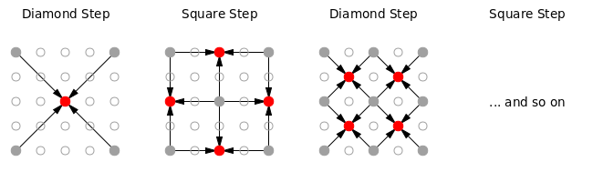
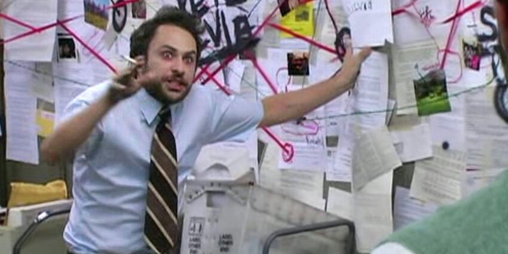
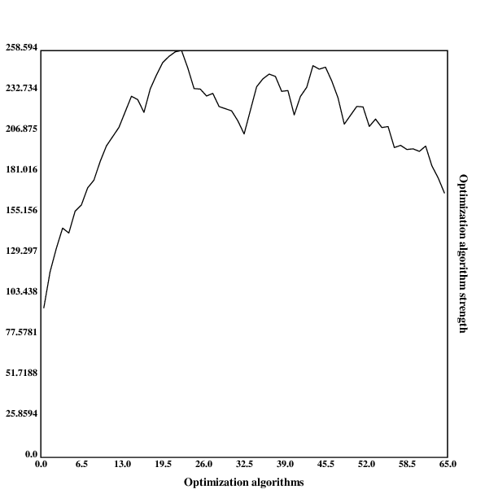
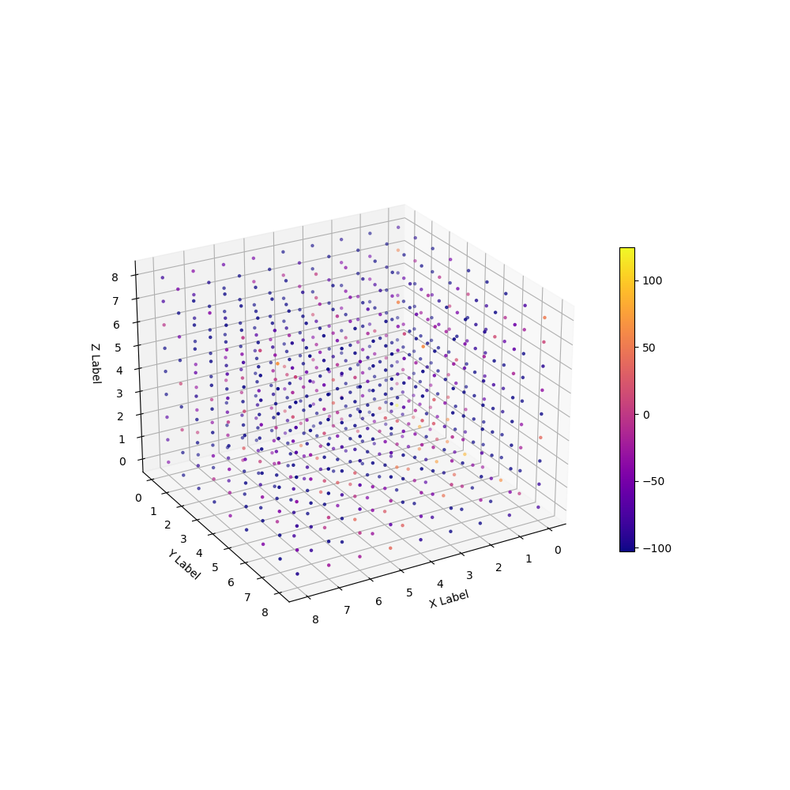

[home](./index.md)
------------------

*author: niplav, created: 2020-11-20, modified: 2025-01-04, language: english, status: in progress, importance: 4, confidence: highly likely*

> __The [Diamond-Square
algorithm](https://en.wikipedia.org/wiki/Diamond-square_algorithm)
is a terrain-generation algorithm for two dimensions (producing a
three-dimensional terrain). I generalize the algorithm to any positive
number of dimensions, and analyze the resulting algorithm.__

<!--TODO: incorporate https://claude.ai/chat/a68c22ab-7a81-4bb3-a566-a1efaf0c4316-->

Generalizing the Diamond-Square Algorithm to n Dimensions
=========================================================

> Libre de la metáfora y del mito  
labra un arduo cristal: el infinito  
mapa de Aquel que es todas Sus estrellas.

*— [Jorge Luis Borges](https://en.wikipedia.org/wiki/Jorge_Luis_Borges), [“Spinoza”](https://thefunambulist.net/literature/litterature-spinoza-by-borges), 1964*

I learned of the diamond-square algorithm by reading through the archives
of [Chris Wellon's blog](https://nullprogram.com/), specifically his post
on [noise fractals](https://nullprogram.com/blog/2007/11/20) and terrain
generation. The algorithm is a fairly simple and old one (dating back
to the 80s), but not being interested in graphics or game programming,
I shelved it as a curiosity.

However, a while later I needed a way to generate high-dimensional
landscapes for [a simulation](./toy_ai_takeoff_model.html), and
remembered the algorithm, I felt like I could contribute something here
by generalizing the algorithm to produce landscapes in an arbitrary number
of dimensions, and that this would be a fun challenge to sharpen my (then
fairly weak) Python and [numpy](https://en.wikipedia.org/wiki/NumPy)
skills.

Description
------------

The original (2-dimensional) diamond-square algorithm, in its simplest
form, starts with a `$2^n+1 \times 2^n+1$` grid of numbers.

It is easiest explained visually:

1. Either a user or the algorithm itself assigns the four corners some values, which can be random.
2. In the __diamond step__ after that, the value in the middle of the grid is determined as the average of the four values in the corners, plus a random value.
3. Next, the middle value every "face" of the grid is determined by the average of the three values in orthogonal directions plus a random value—the __square step__.
4. The grid is broken down into four sub-grids, and each sub-grid undergoes the __diamond step__ and the __square step__. The only difference is in the square step: If a point on the grid lies at the face of two sub-grids, it receives the average of all four orthogonal points.
5. The algorithm terminates if each sub-grid is of size `$1 \times 1$`.

For `$n$` dimensions, do that, just higher-dimensional.

----------

We start by initializing an n-dimensional space with zeros, and the
corners with random values:

	def create_space(dim, size, minval, maxval, factor):
		space=np.zeros([size]*dim)
		corners=(size-1)*get_cornerspos(dim)
		space[*(corners.T)]=np.random.randint(minval, maxval, size=len(corners))

Here, `get_cornerspos` is just the one-liner
`return np.array(list(itertools.product([0, 1], repeat=dim)))`.

We then intialize the variable `offsets`, and call the recursive
diamond-square algorithm:

		offsets=[np.array([0]*dim)]
		return ndim_diamond_square_rec(space, dim, size, offsets, minval, maxval, factor)

Now there are two possible variants of the generalized diamond-square
algorithm: the Long Diamond variation and the Long Square variation.

The Long Diamond ⇔ Long Square Spectrum
----------------------------------------

Let's take a 3×3×3 cubical grid and think about how we can run the
diamond-square algorithm on it.

__One way__ of doing so would be to calculate the center of the cube as
the mean of all the corners, and then the center of each face as the mean
of its corners. The value for the midpoint of each edge is calculated
from the midpoints of the edges and the centers adjacent faces.

<video src="./vid/diamond/long_diamond.mp4" type="video/mp4" controls>
</video>

I call this variant the __Long Diamond__ variant. It performs *two*
diamond steps and only one square step along the three dimensions.

But there's __another way__: Calculate the center of the cube as the
mean of its corners, just as before. But now go directly to the edges
and calculate their midpoints as the mean of the endpoints of each edge.
Then, calculate the value of each face as the mean of the value in the
center of the cube *and* the centers of the adjacent edges.

<video src="./vid/diamond/long_square.mp4" type="video/mp4" controls>
</video>

That is the __Long Square__ variant: It performs one diamond step
(computing the value for the center) and two square steps (for edges
and for faces).

Consecutive diamond steps go from *higher* dimensions to *lower*
ones, consecutive square steps go from *lower* dimensions to *higher*
ones. There is one dimension where the values are "stitched together"—in
the long diamond case it's the first dimension (on edges), in the long
square step it's the second dimension (on faces). I guess one could
also leave out the diamond steps together and calculate the center of
the cube as the mean of the faces—zero diamond, very long square.

The Algorithm
--------------

The algorithm starts out with a base case: If the space is only one
element big, do nothing and return (assuming the value has been filled
in):

	def diamond_square_nd(space, size=None, offsets=None, stitch_dim=1, minval=0, maxval=255, factor=1.0):
		if size==None:
			size=space.shape[0]
		if size<=2:
			return

Next, some housekeeping to initialize values if they haven't been
initialized: We want to know the dimensionality we're dealing with,
and initialize the offsets to be zero:

	dim=len(space.shape)

	if type(offsets)==type(None):
		offsets=np.zeros([1, dim], dtype=int)

Now we come to `offsets`. Remember way above in the two-dimensional
case, when after the first square step, we moved into a diamond step on
the smaller squares? `offsets` describes where the "left lower corner"
of those smaller squares is. We initialized it with zeros, that way we
start in a definite corner.

### Diamond

For the diamond step, we start with this function signature:

	def diamond_rec(space, size, offsets, stitch_dim, minval, maxval, factor, subdim=None):

The only interesting parameter is `subdim`, which describes how many
dimensions the algorithm already has gone "down": It starts at 0, which
means that we take the center of `space`, and assign it the mean of
all corners.

	dim=len(space.shape)
	if subdim==None:
		subdim=dim

If we've already handle so many dimensions that the next one would be
the dimension at which we stitch things together, we return:

	if subdim<=stitch_dim:
		return space

<!--
Next we gather the corner positions for the *entire space*; a bunch of
those dimensions will have to be zeroed out/fixed to a maximum later:

	cornerspos=get_cornerspos(dim)
-->

The next part gets a bit tricky. We can't just, for every offset, add all
corners to that offset, scale it with the size, and say that those are
all the corners. That works *iff* `subdim==0`, in which case we don't have
to worry about handling faces of our space. (In that case we could write
`corners=offsets[:, np.newaxis] + cornerspos[np.newaxis, :]*(size-1)`.)

Instead, something more complicated happens:

Within every offset, we have to (1) choose all possible dimensions we
could fix to either zero or the maximum value, and then (2) generate
all possible ways of fixing those dimensions to zero/maximum values.

(1) is sort of easy to visualize: If we have to assign the values to
the faces of a cube, we have to generate all the centers of the faces
and all the corners for each of those faces. For the top face we have
to fix a dimension to the maximum, for the bottom face to zero, for the
left face another one to zero and for the right one to the maximum,
and so on for the front and back faces. (2) is a bit more tricky,
but should be doable to imagine: If we instead can fix two dimensions,
we can assign them 0 and the maximum *each*, independently.

Abbreviating `$d$` for `dim` and `$c$` for `$subdim$`, the
resulting structure should have have the size `$[{d \choose c},
2^{d-c},2^c, d]$`—*for every c-dimensional direction*, *enumerate all
[hypercubes](https://en.wikipedia.org/wiki/Hypercube) in that direction
on the boundary of `space`*, __list all corners of that c-dimensional
hypercube__, but *__use `dim` dimensions__*.

(Let's hope this makes sense to ≥0 people when read after today.)

We create now an empty canvas for our corners, an object with the right dimensions
but zero everywhere:

	cornerspos=np.broadcast_to(np.zeros(dim), [math.comb(dim, subdim), 2**(dim-subdim), 2**subdim, dim])
	cornerspos=np.array(cornerspos) # because broadcast_to returns readonly

For the sake of my sanity I'm going to write the following code in a
very imperative style, Iverson forgive me.

	occupied_counter=0
	for occupied in it.combinations(range(dim), subdim):
		unfixed_counter=0
		for unfixed in it.product([0, size-1], repeat=dim-subdim):
			cornerspos[occupied_counter, unfixed_counter, :][:, occupied]=get_cornerspos(subdim)*(size-1)
			free=tuple(set(range(dim))-set(occupied))
			cornerspos[occupied_counter, unfixed_counter, :][:, free]=unfixed
			unfixed_counter+=1
		occupied_counter+=1

So, with the previous setup this should be fairly understandable:
We go through the dimensions that are "occupied" with the corners,
and for the rest we set the values to all possible directions.

We then flatten out `cornerspos` one dimension to make it easier to handle:

	cornerspos=np.reshape(cornerspos, [math.comb(dim, subdim)*2**(dim-subdim),2**subdim, dim])

Finally, we generate the corners by, for each offset, adding it to
all corners (basically creating the cartesian product of `offsets` and
`cornerspos` and then summing them):

	corners=offsets[:, np.newaxis, np.newaxis]+cornerspos

But the resulting datastructure has a bad shape, so we flatten the first
two dimensions into one:

	corners=np.reshape(corners, [offsets.shape[0]*cornerspos.shape[0], *cornerspos.shape[1:]])

### Square

--------

Code [here](code/diamond/generalized.py). I think this is probably
the 2nd-most beautiful code I've ever written, just after [this absolute
smokeshow](./99_problems_klong_solution.html#P25__Generate_a_random_permutation_of_the_elements_of_a_list).

Analysis
--------

Results
-------

### One Dimension

### Two Dimensions

### Three Dimensions

<!--TODO: slice plot perhaps-->

