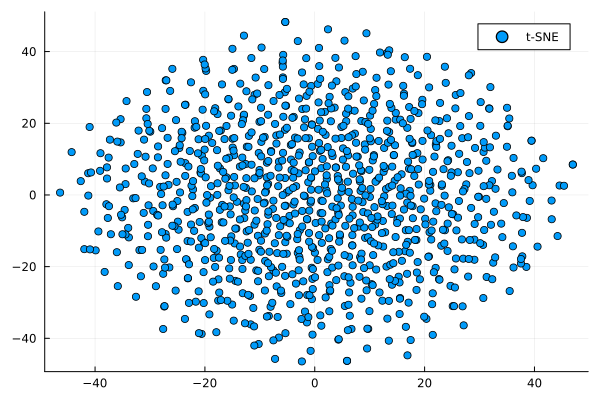
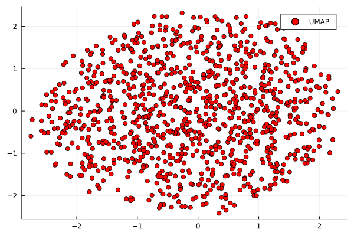
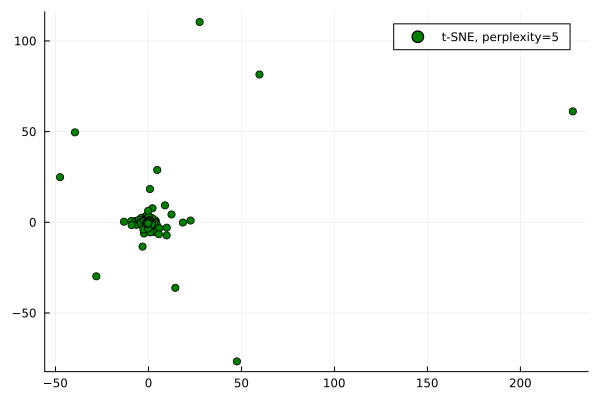
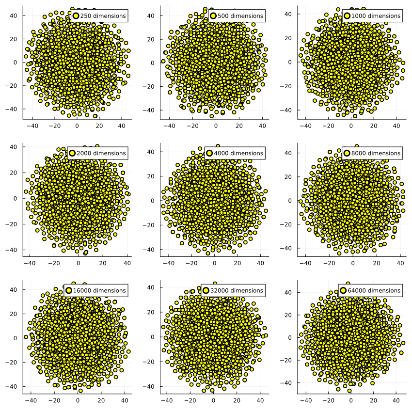
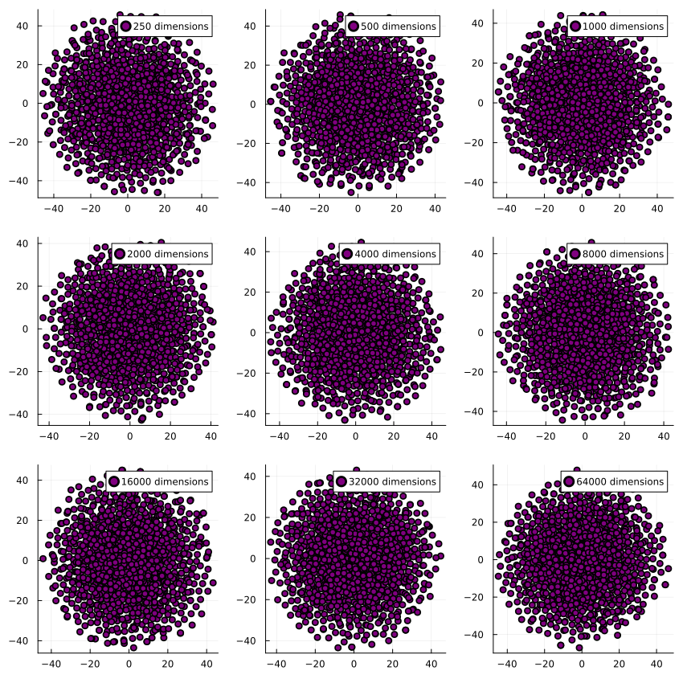
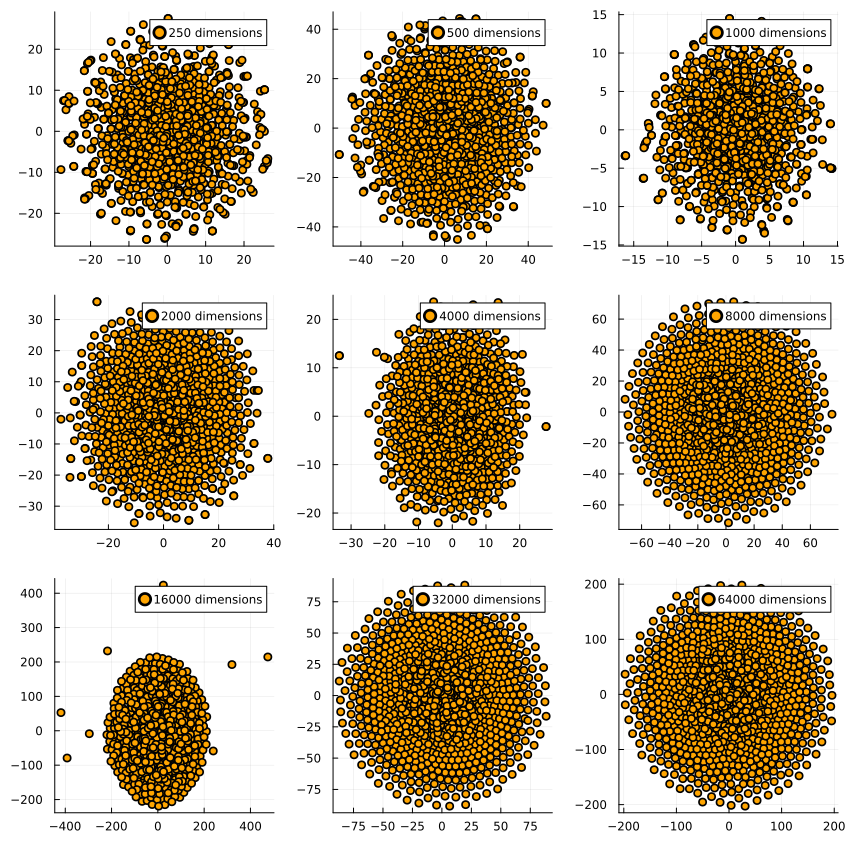
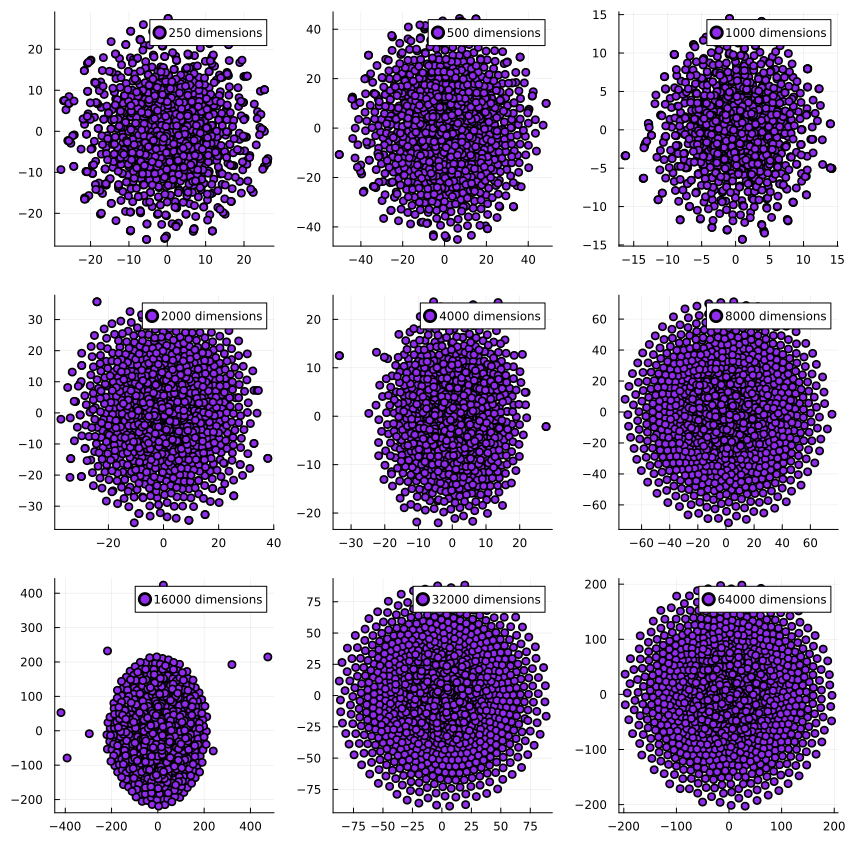

[home](./index.md)
------------------

*author: niplav, created: 2024-06-27, modified: 2024-12-19, language: english, status: finished, importance: 4, confidence: certain*

> __Randomness revived, structure banished, outliers observed, perplexity
examined, and scatterplots produced; all to the discerning enjoyment of
the nobly dimensionality-reduction-interested reader, and for the general
betterment of public knowledge; be it machinic or biological in nature.__

t-SNE and UMAP Don't Produce Clusters on Random Data
======================================================

<!--https://stats.stackexchange.com/questions/263539/clustering-on-the-output-of-t-sne/264647-->

Every once in a while, my corner of 𝕏
erupts in discussion about [dimensionality reduction
techniques](https://en.wikipedia.org/wiki/Dimensionality_reduction_algorithm),
usually in the context of some paper which visualizes high-dimensional
data and clearly shows clusters in the visualization. (Often, this has
to do with discussions about race or gender 🙄)

A common claim in those discussions is that dimensionality reduction
techniques like [t-SNE](https://distill.pub/2016/misread-tsne/) or
[UMAP](https://en.wikipedia.org/wiki/Nonlinear_dimensionality_reduction#Uniform_manifold_approximation_and_projection)
tend to find clusters in random data, even if they're not *really
present*.

I think this is wrong in the strict
sense. I'll generate 10k 2k-dimensional [uniformly
distributed](https://en.wikipedia.org/wiki/Uniform_distribution)
samples, reduce them down to 2 dimensions, and plot
the result (code [here](./code/dimension/code.jl) in
[julia](https://en.wikipedia.org/wiki/Julia_programming_language)):

	using TSne, UMAP, Plots

	datapoints=1000
	dims=200

	data=rand(datapoints, dims)

	reduced=tsne(data)
	reduced_umap=umap(transpose(data))

	gui(scatter(reduced[:,1],reduced[:,2]))

	gui(scatter(reduced_umap[1,:],reduced_umap[2,:], color=:red))

Changing the perplexity to 5 changes the clustering produced by t-SNE —
no obvious *clustering*, but it leads to structure being hallucinated,
especially the tendency towards identifying a cross-shaped pattern in
the data, and imagining outliers where they don't exist.

	reduced_5=tsne(data, 2, 0, 1000, 5.0)
	gui(scatter(reduced_5[:,1],reduced_5[:,2], color=:green))

But—what if we have *more* dimensions than datapoints? Surely it
hallucinates structure in that case‼

(In all cases with 1000 datapoints.)

And the same for UMAP:

[quetzal\_rainbow
suggested](https://x.com/quetzal_rainbow/status/1868307804702069173)
I test it with data where half the dimensions are [normally
distributed](https://en.wikipedia.org/wiki/Normal-distribution)
and the other half is [lognormally
distributed](https://en.wikipedia.org/wiki/Lognormal_Distribution).
Intuitively, the resulting dataset has the shape of a skewed hyperegg,
in which for half the dimensions the cross-section is spherical and for
the other half they extend much further in one direction than the other.

When reducing the dimensions, we see this for t-SNE on 1000 datapoints each:

And similarly for UMAP:

The dimensionality reduction algorithms get executed on the same dataset
per dimensionality, which is why they have very similar outputs for
e.g. 16k dimensions: The generated dataset has a few outliers which end
up far away from the center of the dataset, and both t-SNE and UMAP pick
up on that. I find it pretty encouraging to see how two very different
algorithms find the same structure in the data.

A [steelmanned](https://en.wikipedia.org/wiki/Steelmanning)
critique of these two algorithms could be that sometimes people
use dimensionality reduction techniques for clustering, instead
of separating visualization and clustering (such as via good ol'
[k-means](https://en.wikipedia.org/wiki/K-means_Clustering)),
but t-SNE is [sometimes used even for
clustering](https://en.wikipedia.org/wiki/Clustering_high-dimensional_data#Projection-based_clustering),
all my charity is being exhausted at this point.

Worth noting though:

> Cluster sizes in a t-SNE plot mean nothing […]
The basic message is that distances between well-separated clusters in
a t-SNE plot may mean nothing.

*—Fernanda Viegas/Ian Johnson/Martin Wattenberg, [“How to Use t-SNE Effectively”](https://distill.pub/2016/misread-tsne/), 2016*
