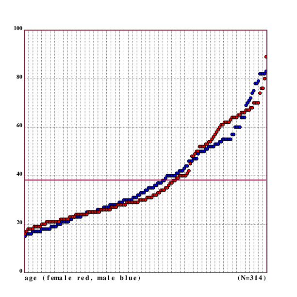
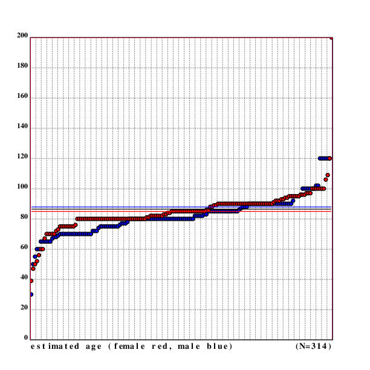

[home](./index.md)
------------------

*author: niplav, created: 2019-04-10, modified: 2019-08-07, language: english, status: draft, importance: 2, confidence: log*

> __A while ago, I became interested in personal estimations
> of life expectancy. I wanted to know how accurate people are
> at estimating their own life expectancy (by checking [actuarial
> tables](https://en.wikipedia.org/wiki/Life_table) and whether accuracy
> correlates with age or gender. I went out and collected data, which is
> shared and analysed here.__

Personal Estimates of Life Expectancy
======================================

Abstract
--------

Actuarial tables are of great interest to statisticians, gerontologists
and policymakers. In this piece, data about subjective life expectancy
of urban germans is presented, analyzed using linear regression and
compared to actuarial tables. Gender and age differences in accuracy of
assessing ones own life expectancy are also considered.

Terminology
-----------

This text uses the terms "subjective life expectancy" and "estimated
life expectancy" interchangeably.

Data Collection Method
----------------------

192 random people were approached during the day in the streets of the
center of a major german city.  They were asked the following questions
(in the presented order):

1. "Entschuldigung, darf ich Ihnen kurz zwei Fragen stellen?"
2. "Wie alt, schätzen Sie, werden sie werden?"
3. "Und wie alt sind Sie?"
4. "Vielen Dank, schönen Tag noch."

If the respondent was unsure after the second question, they were told:
"Nur eine grobe Schätzung" to indicate that they weren't expected to make
a perfect estimate). If at any point the respondent seemed uncomfortable,
the interrogation was stopped with step 4 directly.

If after the first question the respondent didn't seem able to understand,
they were asked the following questions (in that order):

1. "Do you speak English?"
2. "How old, do you think, will you become?"
3. "And how old are you?"
4. "Thank you very much, have a nice day."

Similarly, if the respondent seemed unsure after step 2, they were told
to only give "a rough estimate" of the number.

The perceived gender of the respondent was then noted together with
their age and estimated age.

Data was collected in the time from February 2019 to August 2019<!--(TODO:
Finish, collect at least 1000 data points, then do analysis)-->.

The raw data is available in CSV
[here](./data/estimated_life_expectancy.csv).

Analysis
--------

<!--TODO: Add p-values!-->

Code to load the data from the CSV file:

		.l("csv")
		.l("nstat")
		.fc(.ic("./data/estimated_life_expectancy.csv"));data::csv.load()
		m::1:$'{1_x}'flr({"m"~*x};data)
		f::1:$'{1_x}'flr({"f"~*x};data)
		data::1:$'{1_x}'1_data

### Age

Of the 192 respondents, 96 of which were male and 96 were female. The
mean age was 37.94 years (37.06 years for men and 38.83 years for women)
with the youngest respondents being 16 years old and the oldest being
82 years old (youngest/oldest male: 16/82, youngest/oldest female: 17/74).

		dm::mu(*+data)
	37.9479166666666666
		fm::mu(*+f)
	38.8333333333333333
		mm::mu(*+m)
	37.0625
		ages::(*+data)@<*+data
		mages::(*+m)@<*+m
		fages::(*+f)@<*+f
		*ages
	16
		*|ages
	82
		*mages
	16
		*|mages
	82
		*fages
	16
		*|fages
	74

Code for the image:

	.l("nplot")
	.l("./load.kg")

	cgrid("age (female red, male blue)                      (N=",($#data),")";[0 100 20])
	fillrgb(0;0;1)
	scplot(mages)
	fillrgb(1;0;0)
	scplot(fages)

	setrgb(0;0;0)
	segplot(100:^dm)
	setrgb(0;0;1)
	segplot(100:^mm)
	setrgb(1;0;0)
	segplot(100:^fm)

	draw()

As one can see in the image, the ages of the respondents by gender
follow a very similar pattern, except a lack of women aged 40 to 50
and a lack of women older than 75. Perhaps a bias on my side? But I
remember to have noticed that older women are less likely to answer,
especially questions about age.

### Subjective Life Expectancy

Estimates of life expectancy were interesting: The mean estimate was
83.49 years, 82.29 years for men and 84.69 years for women.  The lowest
estimate of life expectancy was only 30 years, the highest was 200 years
(lowest/highest for males: 30/120, lowest/highest for females: 39/200).

On average, respondents estimated that they had 45.54 years left in
their life, women estimating having 45.85 left in their lifes, men with
45.23 years. The lowest estimate for years of life left was 1, the highest
was 169 (lowest/highest for males: 1/82, lowest/highest for females: 6/169).

		estages::(*|+data)@<*|+data
		mu(estages)
	83.4895833333333333
		mestages::(*|+m)@<*|+m
		festages::(*|+f)@<*|+f
		mu(mestages)
	82.2916666666666667
		mu(festages)
	84.6875
		*estages
	30
		*|estages
	200
		*mestages
	30
		*|mestages
	120
		*festages
	39
		*|festages
	200
		:"yl: years left"
		yl::{(*|x)-*x}'data
		yl::yl@<yl
	        muyl::mu(yl)
	45.5416666666666666
		fyl::{(*|x)-*x}'f
		fyl::fyl@<fyl
		mufyl::mu(fyl)
	45.8541666666666667
		myl::{(*|x)-*x}'m
		myl::myl@<myl
		mumyl::mu(myl)
	45.2291666666666667
		*yl
	1
		*|yl
	169
		*myl
	1
		*|myl
	82
		*fyl
	6
		*|fyl
	169

Code for the image:

		.l("nplot")
	.l("./load.kg")

	cgrid("estimated age (female red, male blue)           (N=",($#data),")";[0 200 20])
	fillrgb(0;0;1)
	scplot(mestages)
	fillrgb(1;0;0)
	scplot(festages)

	setrgb(0;0;0)
	segplot(100:^dem)
	setrgb(0;0;1)
	segplot(100:^mem)
	setrgb(1;0;0)
	segplot(100:^fem)

	setwidth(1)
	setrgb(0;0;0)

	draw()

The black line between the blue line for the male average estimated age
and the red line for female average estimated age is for the overall
average estimated age.

### Linear Regression & Correlation

One can now do a linear regression on the data and try to find out what
the relation between estimated age and real age is.

		lreg(data)
	[0.151862914982186082 77.7986935564643823]
		lreg(f)
	[0.0608377197820622489 82.4196005451742221]
		lreg(m)
	[0.236555690251618827 73.5777002454096563]

The regression shows a positive relation between age and subjective life
expectancy, which is stronger for men than for women.

One can now also calculate the correlation between age and estimated
age, which is 0.1519 for the whole data set, 0.0608 for women and 0.2366
for men, indicating that men become more optimistic when growing older.

		cor@+data
	0.151862914982186104
		cor@+f
	0.0608377197820622755
		cor@+m
	0.23655569025161882

This can be shown in a scatter plot of the data.

	.l("nplot")
	.l("./load.kg")

	grid([0 100 20];[0 220 20])
	fillrgb(0;0;1)
	scplot2(m)
	fillrgb(1;0;0)
	scplot2(f)
	xtitle("age")
	ytitle("estimated age")

	setrgb(0;0;1)
	plot(lr(;lreg(m)))
	setrgb(1;0;0)
	plot(lr(;lreg(f)))
	setrgb(0;0;0)
	plot(lr(;lreg(data)))

	draw()

The red dots represent data points from women, the blue ones are from
men. The red line is the linear regression for the data by women, the
black line is the linear regression for the whole data, and the blue
line is the linear regression for the data by men.  Outliers are clearly
visible, and the difference between the linear regressions is also visible.

### Comparison With Actuarial Tables

One can also compare the data collected to existing actuarial tables,
and determine if there is a systematic deviation between subjective life
expectancy and the values given by actuarial tables.

For this, one can calculate averages for a given age, both separately
for genders and for the whole data set:

		grf::=*+f
		abaf::mu'(*|+f)@grf
		:"female averages, by age"
		rf::(*'(*+f)@grf),'abaf
		grm::=*+m
		abam::mu'(*|+m)@grm
		"male averages, by age"
		rm::(*'(*+m)@grm),'abam
		gr::=*+data
		aba::mu'(*|+data)@gr
		"averages, by age"
		r::(*'(*+data)@gr),'aba

Problems
---------

* Hoped for age, not estimated age
* Joke answers
* Interrogator bias (age, gender)

Conclusion
-----------

See Also
--------

<!--
TODO: read:

/usr/local/doc/unread/sle/*
-->
