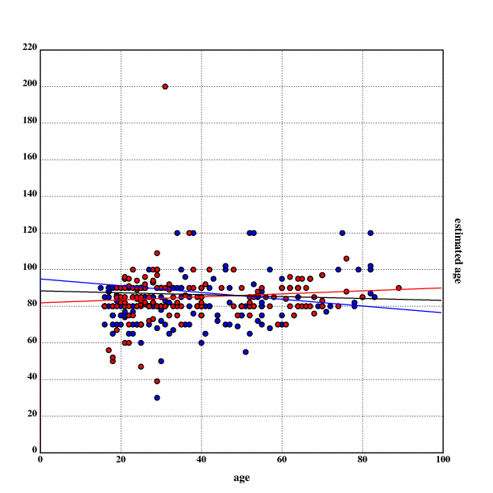

[home](./index.md)
------------------

*author: niplav, created: 2019-04-10, modified: 2020-07-20, language: english, status: in progress, importance: 3, confidence: possible*

> __A while ago, I became interested in personal estimations
> of life expectancy. I wanted to know how accurate people are
> at estimating their own life expectancy (by checking [actuarial
> tables](https://en.wikipedia.org/wiki/Life_table) and whether accuracy
> correlates with age or gender). I went out and collected data, which is
> shared and analysed here.__

Subjective Estimates of Life Expectancy
======================================

Abstract
--------

<!--TODO: at ≥1000 data points, put results into the abstract.-->

Actuarial tables are of great interest to statisticians, gerontologists
and policymakers. In this piece, data about subjective life expectancy
of urban germans is presented, analyzed using linear regression and
compared to actuarial tables. Gender and age differences in accuracy of
assessing ones own life expectancy are also considered.

Terminology
-----------

This text uses the terms "subjective life expectancy" and "estimated
life expectancy" interchangeably.

Data Collection Method
----------------------

~500 random people were approached (the
exact number of approaches was [regrettably not
recorded](./estimated_life_expectancy.html#No-Tracking-of-the-Answering-Rate))
during the day in the streets of the center of a major german city. They
were asked the following questions (in the presented order):

1. "Entschuldigung, darf ich Ihnen kurz zwei Fragen stellen?"
2. "Wie alt, schätzen Sie, werden sie werden?"
3. "Und wie alt sind Sie?"
4. "Vielen Dank, schönen Tag noch."

If the respondent was unsure after the second question, they were told:
"Nur eine grobe Schätzung" to indicate that they weren't expected to make
a perfect estimate. If at any point the respondent seemed uncomfortable,
the interrogation was stopped with step 4 directly.

If after the first question the respondent didn't seem able to understand,
they were asked the following questions (in that order):

1. "Do you speak English?"
2. "How old, do you think, will you become?"
3. "And how old are you?"
4. "Thank you very much, have a nice day."

Similarly, if the respondent seemed unsure after step 2, they were told
to only give "a rough estimate" of the number.

The perceived gender of the respondent was then noted together with
their age and estimated age.

Data was collected in the time from February 2019 to August 2019<!--(TODO:
Finish, collect at least 1000 data points, then do analysis)-->.

The raw data is available in CSV
[here](./data/estimated_life_expectancy.csv).

Analysis
--------

<!--TODO: Add p-values!-->

Code to load the data from the CSV file:

		.l("csv")
		.l("nstat")
		.fc(.ic("./data/estimated_life_expectancy.csv"));data::csv.load()
		m::1:$'{1_x}'flr({"m"~*x};data)
		f::1:$'{1_x}'flr({"f"~*x};data)
		data::1:$'{1_x}'1_data

### Age

Of the 250 respondents, 125 were male and 125 were female. The
mean age was 38.228 years (37.192 years for men and 39.264 years for women),
with the youngest respondents being 15 years old and the oldest being
89 years old (youngest/oldest male: 15/82, youngest/oldest female: 16/89).
The standard deviation for age was 17.5 (17.17 for men, 17.76 for women).

		dm::mu(*+data)
	38.228
		fm::mu(*+f)
	39.264
		mm::mu(*+m)
	37.192
		ages::(*+data)@<*+data
		mages::(*+m)@<*+m
		fages::(*+f)@<*+f
		*ages
	15
		*|ages
	89
		*mages
	15
		*|mages
	82
		*fages
	16
		*|fages
	89
		sd(ages)
	17.4981146412977875
		sd(mages)
	17.1700651134467163
		sd(fages)
	17.7597945934067604

Code for the image:

	.l("nplot")
	.l("./load.kg")

	cgrid("age (female red, male blue)                      (N=",($#data),")";[0 100 20])

	setdot(3)
	fillrgb(0;0;1)
	scplot(mages)
	fillrgb(1;0;0)
	scplot(fages)

	setrgb(0;0;0)
	segplot(100:^dm)
	setrgb(0;0;1)
	segplot(100:^mm)
	setrgb(1;0;0)
	segplot(100:^fm)

	draw()

<!--TODO: there is an annoying red line at the border of the image here
and in est_ages.png. Fix that.-->

As one can see in the image, the ages of the respondents by gender
follow a very similar pattern, except a lack of women aged 40 to 50
and a lack of women older than 75. Perhaps a bias on my side? But I
remember to have noticed that older women are less likely to answer,
especially questions about age.

### Subjective Life Expectancy

Estimates of life expectancy were interesting: The mean estimate was
83.248 years, 82.016 years for men and 84.48 years for women. The lowest
estimate of life expectancy was only 30 years, the highest was 200 years
(lowest/highest for males: 30/120, lowest/highest for females: 39/200).

On average, respondents estimated that they had 45.02 years left in
their life, women estimating having 45.216 left in their lifes, men with
44.824 years. The lowest estimate for years of life left was 1, the highest
was 169 (lowest/highest for males: 1/86, lowest/highest for females: 1/169).

The standard deviation for the estimated age was 14.32 (13.29 for men,
15.18 for women).

		estages::(*|+data)@<*|+data
		mu(estages)
	83.248
		mestages::(*|+m)@<*|+m
		festages::(*|+f)@<*|+f
		mu(mestages)
	82.016
		mu(festages)
	84.48
		*estages
	30
		*|estages
	200
		*mestages
	30
		*|mestages
	120
		*festages
	39
		*|festages
	200
		:"yl: years left"
		yl::{(*|x)-*x}'data
		yl::yl@<yl
		muyl::mu(yl)
	45.02
		fyl::{(*|x)-*x}'f
		fyl::fyl@<fyl
		mufyl::mu(fyl)
	45.216
		myl::{(*|x)-*x}'m
		myl::myl@<myl
		mumyl::mu(myl)
	44.824
		*yl
	1
		*|yl
	169
		*myl
	1
		*|myl
	86
		*fyl
	1
		*|fyl
	169
		sd(estages)
	14.3246115479617805
		sd(mestages)
	13.2941996374358693
		sd(festages)
	15.1860989065658333

Code for the image:

	.l("nplot")
	.l("./load.kg")

	cgrid("estimated age (female red, male blue)           (N=",($#data),")";[0 200 20])

	setdot(3)
	fillrgb(0;0;1)
	scplot(mestages)
	fillrgb(1;0;0)
	scplot(festages)

	setrgb(0;0;0)
	segplot(100:^dem)
	setrgb(0;0;1)
	segplot(100:^mem)
	setrgb(1;0;0)
	segplot(100:^fem)

	setwidth(1)
	setrgb(0;0;0)

	draw()

The black line between the blue line for the male average estimated age
and the red line for female average estimated age is for the overall
average estimated age.

### Linear Regression & Correlation

One can now do a linear regression on the data and try to find out what
the relation between estimated age and real age is.

		lreg(data)
	[0.143075581058418136 77.7785066872987915]
		lreg(f)
	[0.110387262427545795 80.1457545280448419]
		lreg(m)
	[0.17043090258300147 75.6773338711330093]

The regression shows a positive relation between age and subjective life
expectancy, which is stronger for men than for women.

One can now also calculate the correlation between age and estimated age,
which is 0.1431 for the whole data set, 0.1104 for women and 0.1704 for
men, indicating that men become more optimistic when growing older.

		cor@+data
	0.14307558105841815
		cor@+f
	0.110387262427545804
		cor@+m
	0.170430902583001477

This can be shown in a scatter plot of the data.

	.l("nplot")
	.l("./load.kg")

	grid([0 100 20];[0 220 20])
	fillrgb(0;0;1)
	setdot(3)
	scplot2(m)
	fillrgb(1;0;0)
	scplot2(f)
	xtitle("age")
	ytitle("estimated age")

	setrgb(0;0;1)
	plot(lr(;lreg(m)))
	setrgb(1;0;0)
	plot(lr(;lreg(f)))
	setrgb(0;0;0)
	plot(lr(;lreg(data)))

	draw()

The red dots represent data points from women, the blue ones are from
men. The red line is the linear regression for the data by women, the
black line is the linear regression for the whole data, and the blue
line is the linear regression for the data by men. Outliers are clearly
visible, and the difference between the linear regressions is also visible.

### Comparison With Actuarial Tables

One can also compare the data collected to existing actuarial tables,
and determine if there is a systematic deviation between subjective life
expectancy and the values given by actuarial tables.

For this, one can calculate averages for a given age, both separately
for genders and for the whole data set:

		grf::=*+f
		abaf::mu'(*|+f)@grf
		:"female averages, by age"
		rf::(*'(*+f)@grf),'abaf
		grm::=*+m
		abam::mu'(*|+m)@grm
		"male averages, by age"
		rm::(*'(*+m)@grm),'abam
		gr::=*+data
		aba::mu'(*|+data)@gr
		"averages, by age"
		r::(*'(*+data)@gr),'aba

Next, one needs actual actuarial tables for information to compare
the collected data to. Because the data was collected in Germany,
the actuarial tables were taken from the [Federal Statistical Office of
Germany](https://en.wikipedia.org/wiki/Federal_Statistical_Office_of_Germany).
The [actuarial
tables](https://www.destatis.de/DE/Themen/Gesellschaft-Umwelt/Bevoelkerung/Sterbefaelle-Lebenserwartung/_inhalt.html)
were downloaded, converted from [ISO/IEC
8859](https://en.wikipedia.org/wiki/ISO/IEC_8859) to
[UTF-8](https://en.wikipedia.org/wiki/UTF-8) and arranged in the
following form:

	age,life expectancy m,life expectancy f

The resulting data can be viewed [here](./data/de_actuarial_tables.csv).

Now, one can start comparing the collected estimates to the actuarial
tables. To do this, one first loads the data into Klong:

		known::{(1:$*x),(1.0:$x@1),(1.0:$x@2)}'1_known
		mk::{x@[0 1]}'known
		fk::{x@[0 2]}'known
		kr::{(*x),((x@1)+x@2)%2}'known

The variable `kr` contains the mean of the female and male actuarial values.

Since one has already calculate the average estimates for life
expectancy by age (the variables `grm`, `grf` and `gr`), one can now
compute correlations between the estimates and the actuarial tables. The
correlation between the estimates and the actuarial values is 0.0957,
0.0772 for men and 0.0348 for women.

		cord::cor(aba;*|+kr@*'(*+data)@gr)
	0.0957337523144531185
		corm::cor(abam;*|+mk@*'(*+m)@grm)
	0.0772309898403104608
		corf::cor(abaf;*|+fk@*'(*+f)@grf)
	0.0347646631118574528

One can now also visualize the estimates and actuarial values.

For the mean estimate:

	.l("nplot")
	.l("nstat")
	.l("./load.kg")

	grid([0 100 20];[0 150 20])

	setdot(3)

	fillrgb(0;0;0)
	scplot2(mk)

	fillrgb(0;0;1)
	scplot2(rm)

	xtitle("age")
	ytitle("male: average estimated life expectancy (blue), average life expectancy (black)")

	draw()

.")

<!--TODO: Write something about the [Gompertz
distribution](https://en.wikipedia.org/wiki/Gompertz_distribution)
in the tooltip-->

For men:

	.l("nplot")
	.l("nstat")
	.l("./load.kg")

	grid([0 100 20];[0 150 20])

	setdot(3)

	fillrgb(0;0;0)
	scplot2(mk)

	fillrgb(0;0;1)
	scplot2(rm)

	xtitle("age")
	ytitle("male: average estimated life expectancy (blue), average life expectancy (black)")

	draw()

 (how old the person is to how old they will become on average) and the average subjective estimate for life expectancy per age (how old the person is to how old they think they will become). The actuarial data for men rises with the standard Gompertz curve, starting at 80 and beginning to rise at around the person reaching the age of 60. The mean estimate is clustered around this curve, but still quite noisy.")

For women:

	.l("nplot")
	.l("nstat")
	.l("./load.kg")

	grid([0 100 20];[0 150 20])

	setdot(3)

	fillrgb(0;0;0)
	scplot2(fk)

	fillrgb(1;0;0)
	scplot2(rf)

	xtitle("age")
	ytitle("female: average estimated life expectancy (red), average life expectancy (black)")

	draw()

 (how old the person is to how old they will become on average) and the average subjective estimate for life expectancy per age (how old the person is to how old they think they will become).The actuarial data for women also rises with the standard Gompertz curve, starting at 82 and beginning to rise at around the person reaching the age of 60. The mean estimate is clustered around this curve, but still quite noisy.")

<!--TODO: difference between estimated age and actuarial value, is there
a correlation? Would that even be a useful measure?-->

Problems
---------

As with most self-reported data, there are numerous problems with this
approach. The data presented here represents estimates often made in a
very short amount of time, and is prone to misunderstandings.

### Hope Instead of Estimates

It seemed like very often people misunderstood that the estimate they were
asked for was not asking for the age they hoped for, but the age they
estimated. It would not have been practical explaining this to people,
since the response rate already was quite low and there were sometimes
severe difficulties in understanding, but this seems to be the strongest
bias in the data. Interestingly, a surprising number of people seemed
to hope to die earlier than the average person, especially a woman aged
29 who hoped to die at 39.

### Joke Answers

Keeping in line with the [lizardman
constant](http://slatestarcodex.com/2013/04/12/noisy-poll-results-and-reptilian-muslim-climatologists-from-mars/),
there was a number of joke answers and sometimes even straight lies. Most
of the people who answered that they estimated to become 120 years old
fit into this category (the woman who estimated that she would become
200 years old seemed convinced of that, though). There was also a number
of people who either looked way too old or lied about their age.

### Some Ages are Missing

The visualisation of the data shows a clear lack of women aged between
40-50 in the data set, as well as a lack of people older than 70. One
possible explanation for this observation is an age-related bias by the
interrogator. Another possible explanation could be that people older
than 70 don't like to answer questions in the street, don't go outside
very often, are rare, or lie about their age regularly. I note that it
seemed to me that older women were most reluctant to answer my questions,
but that may just be another manifestation of personal bias.

### Selection Bias and Non-Representative Data

As with any street poll, this interrogation got responses from
people willing to answer questions from strangers on the street. This
could select for high openness, which could function as a proxy for
optimism. Also, all people were interrogated in a big city, which
could have biased the data (I am not sure which direction this bias
woul tend). One could also argue that self-reported data is [notoriously
unreliable](https://guzey.com/statistics/dont-believe-self-reported-data/),
but since the point of this data collection was to aggregate subjective
estimates, this should not be an issue here.

### Gender was Determined by Appearance

The gender of the respondent was determined by a subjective estimate
by the interrogator, which can lead to some problems in regard to
incorrect perception by the interrogator (for example misgendering trans
people). If there had been uncertainty about the gender, the respondent
would have been asked about their identified gender. This was not done
on all respondents, since it would have increased the response time and
therefore decreased the amount of usable responses.

One can do a quick statistical estimate of the probability of
encountering and misgendering a trans person. According to [Flores et al.
2016](./doc/estimated_life_expectancy/how_many_adults_identify_as_transgender_us_flores_et_al_2016.pdf "How Many Adults Identify as Transgender in the United States"),
0.6% of the U.S. adult population identifies as transgender. It is
assumed that the numbers for Germany are similar. <!--TODO: Find a
german source--> It is also assumed that the probability for a trans
person passing is around 90% (I am just making this number up).

One can then use the [binomial
distribution](https://en.wikipedia.org/wiki/Binomial_distribution) to
estimate the probability of misgendering at least one trans person. The
code is in [Klong](http://t3x.org/klong/index.html). The probability of
misgendering at least one trans person is calculated by calculating the
probability of encountering n≤maxt trans people, multiplied with the
probability of not correctly gendering all of them.

		.l("nstat")
		:"probability of being trans"
		pt::0.006
		:"probability of passing"
		pp::0.9
		"number of people asked"
		n::250
		:"maxt is the number so that the probability that I met"
		:"more than maxt trans people is less than 1 in a billion."
		maxt::{(1-b.cdf(x;n;pt))>10e-9}{x+1}:~1
		:"probability of encountering at least 1 trans person"
		1-b.pmf(0;n;pt)
	0.777875686117172762
		:"probability of encountering at least 1 trans person and misgendering them"
		+/{(1-pp^x)*b.pmf(x;n;pt)}'1+!maxt
	0.139330765507831189

The result shows that the probability of encountering and misgendering at
least one trans person (and therefore at least one incorrect data point)
is ~13%.

<!--TODO Question: How many people pass as gender X, but identify as gender Y≠X?-->

### No Tracking of the Answering Rate

While answers were tracked, I did not think of writing down the number
and gender of the people approached. It would have been interesting
to see whether there are any gender-specific differences in answering
rates, and it generally have been a better practice to write them down
(also to determine the overall answering rate).

<!--
Conclusion
-----------

### Comparison with Existing Results

External Links
--------------
-->
<!--
TODO: read:

/usr/local/doc/unread/sle/*
-->
