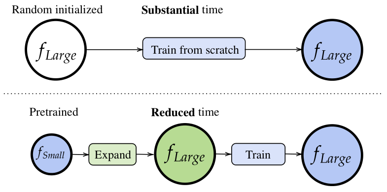

[home](./index.md)
------------------

*author: niplav, created: 2025-04-16, modified: 2025-04-16, language: english, status: in progress, importance: 7, confidence: certain*

> __.__

Model Expansion and AI Alignment
=================================

> Suchst du das Unermeßliche hier, du hast dich geirret,
Meine Größe ist die, größer zu machen dich selbst.

*—Friedrich Schiller, “Kleinigkeiten”, 1805*

The current trajectory of building superintelligent AI systems is
omnicidally dangerous60%.

One way to make it slightly less dangerous is to train small AI models
first, check them for their safety properties *and/or* train them so that
they satisfy some safety properties, and then use the weights of those
AI models to train larger AI models. In machine learning this process
of training a bigger model initialized with a smaller model is called
**model expansion**.

*Diagram from [Wang et al. 2023](https://arxiv.org/abs/2310.07999)*

To my knowledge, model expansion is not used in training frontier
AI models.

There's four reasons why I think that this kind of training would be
safer than pre-training from scratch with randomly initialized weights.

### Building on inductive biases favoring speed over simplicity

I don't think humanity yet has a good theory for the inductive biases
of neural networks, initial attempts include the [neural tangent
kernel](https://en.wikipedia.org/wiki/Neural_tangent_kernel)
and [singular learning theory and its focus on
error-correction](https://www.lesswrong.com/posts/nWRj6Ey8e5siAEXbK/simple-versus-short-higher-order-degeneracy-and-error-1).

My current model is something like this:
Training neural networks performs [Solomonoff
induction](https://en.wikipedia.org/wiki/Solomonoff_induction),
but limited to programs of some maximum length
`$l$` and some maximum runtime `$t$` (similar to
[AIXI-tl](https://en.wikipedia.org/wiki/AIXI#Computational_aspects),
where I'm not sure what the prior is. `$l$` is upper-bounded by the
information-content of the weights of the network: The number of bits in
the program is pre-determined by how much you can fit into the floats of
the weights. `$t$` is upper-bounded by the number of layers, as one can
only do as many operations on the data passed through the activations
as there are layers (or layer-equivalents).[^error]

[^error]: Someone<!--TODO: who again? janbam? the evangelion angel pfp guy?--> on twitter suggested that if we regard models as executing many short programs in superposition<!--TODO: toy models of superposition when read-->, then [SGD](https://en.wikipedia.org/wiki/Stochastic_Gradient_Descent) may select for (1) error-correction, since programs do sometimes interfere with each other, and each program needs to correct its own data after interference (intuitively recapitulating the singular learning story), and (2) for [modularity](https://www.lesswrong.com/posts/JBFHzfPkXHB2XfDGj), since the end result of the individual programs needs to be combined together before producing an output.

If we're worried about [deceptive
alignment](https://www.lesswrong.com/s/r9tYkB2a8Fp4DN8yB/p/zthDPAjh9w6Ytbeks),
then we're arguendo most worried about selecting from programs with a
high `$t$`—many reasoning steps, even for short programs, probably
favor deception, tomfoolery, bamboozlement, shenanigans, trickery &c.

Model expansion here can help: We can *start* with a fairly wide but
shallow network, and train that on the task, so that the resulting network
is almost certainly non-scheming. But that network may have fairly low
capabilities given that it can't do much sophisticated internal reasoning
(though we may want to keep it that way?<!--TODO: link something that
argues for visible CoT vs. neuralese-->). So we can expand our model in
its depth, and continue training it, but with the advantage of having
some non-scheming structure to build upon.

In general, training in this way gives more control over when speed
should be favored, and when simplicity should be favored.

### Understanding smaller models is easier.

### Inheriting safety properties from previous models.

When training smaller models to fulfill some behavioral safety
criterion, it's more likely that the smaller model learns the
concept we're trying to instill directly; be it [environmental
goals](https://arbital.com/p/environmental_goals/),
[low impact](https://arbital.com/p/low_impact/), [mild
optimization](https://arbital.com/p/soft_optimizer/) &c. During model
expansion, we may be able to track how the original learned the concept
and then evaluate how the learned concept changes during further training,
being able to better control how the concept generalizes.

### Allowing for more gradual scaling

As opposed to ever bigger pre-training runs.

### Open questions

1. Is this just a capability nerf?
2. Is this just a capability bump?
3. How much information from the small network gets overwritten?
4. Do circuits from pre-expansion training stick around?
5. Do the inductive biases of the deeper network "overwhelm" the available circuits in the smaller model?

In an ambitious vision, training after model expansion is a tiny
step towards a craft of intelligence: one in which different stages
of a model are trained with different data, invariances are kept
across scalings, interpretability tools transfer partially (or
completely) because sometimes weights can be frozen, tracking [model
splintering](https://www.lesswrong.com/s/kjcioCkqSSS4LiMAe/p/k54rgSg7GcjtXnMHX)…

See Also
---------

* [Inductive biases stick around (Evan Hubinger, 2019)](https://www.lesswrong.com/posts/nGqzNC6uNueum2w8T/inductive-biases-stick-around)
* [Risks from Learned Optimization (Hubinger et al., 2019)](https://arxiv.org/abs/1906.01820)
