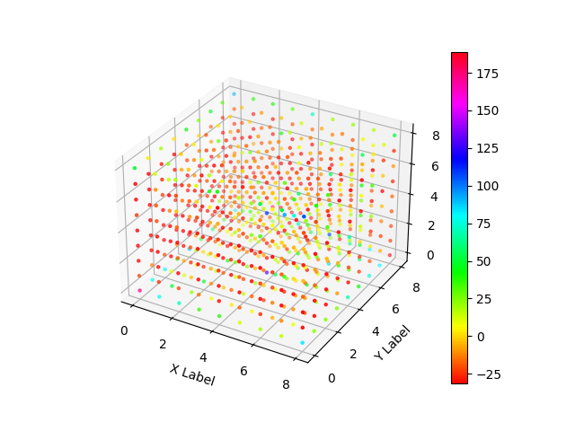

[home](./index.md)
------------------

*author: niplav, created: 2020-11-20, modified: 2020-11-20, language: english, status: notes, importance: 6, confidence: highly likely*

> __.__

Generalizing the Diamond-Square Algorithm to n Dimensions
=========================================================

Introduction
-------------

Description
------------

### Square

### Diamond

Analysis
--------

Results
-------

### One Dimension

### Two Dimensions

### Three Dimensions

