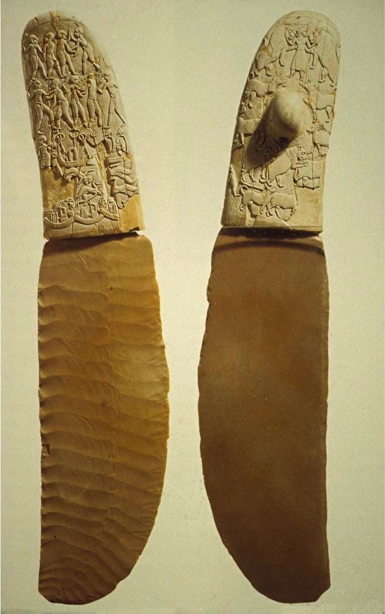
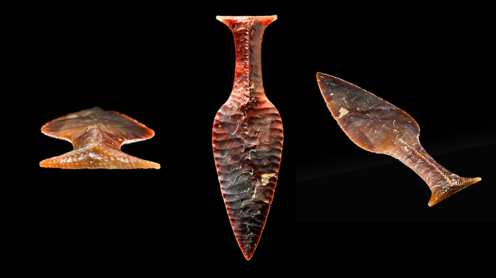
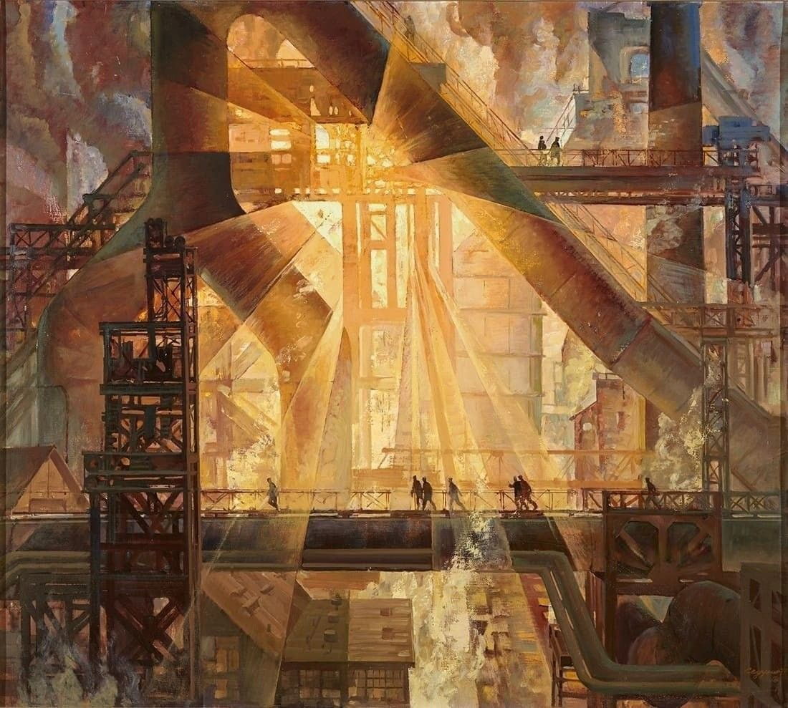

[home](./index.md)
-------------------

*author: niplav, created: 2026-04-17, modified: 2026-05-19, language: english, status: in progress, importance: 1, confidence: possible*

> __.__

Now Is The Golden Age Of Purpose
=================================

In this essay I want to engage and grapple with some questions around the
interplay of **craft** and **purpose**, in a time when it's plausible
that much or all of human activity could be automated soon, *and* it's
possible that the interim period will allow for individuals to exert
large amounts of influence on how the future goes.

Specifically, I want to mourn the notion of **craft**, namely highly
skilled and [attuned](https://joecarlsmith.com/2024/03/25/on-attunement/)
human activity that some people dedicated their entire lives to, and
illustrate this with several examples I find especially vivid.

I want to contrast this with the interim period which has arguably already
begun, in which cultivating a craft runs the risk of being automated
away, and instead encourage myself and others to pursue purpose even
when we feel drawn to becoming skilled craftspeople.

Contra Ergosphere on Fine Machines
-----------------------------------

This whole line of thinking was set off by skimming over
Ergosphere's[^1] post ["The machines are fine. I'm worried about
us."](https://ergosphere.blog/posts/the-machines-are-fine/).  It is a
good blogpost, and I suggest you read it, but if you don't:

[^1]: The author is named Minas Karamanis, the blog has the domain [ergosphere.blog](https://ergosphere.blog); I'll call the author "ergosphere" from here on, since it's such a cool word and [concept](https://en.wikipedia.org/wiki/Ergosphere). I hope they don't mind.

Ergosphere tells the story of Alice and Bob, both starting an
astrophysics PhD.  Alice grinds through her first paper assignment
on her own, Bob vibe-physics it with an AI agent, consequently Alice
emerges a more capable and skillful human being at the end of the year
she spends on the paper, while Bob coasts and learns nothing. The papers
they produce are of similar quality (though the post is unclear on how
certain and robust the equivalence in quality is (…let's put a pin in
that)), but ergosphere hammers home that the paper is, in some sense,
irrelevant; the actual goal of the PhD is to produce *capable people*,
not research artefacts.

Ergosphere goes on to write about how only people who have done the grunt
work can actually tell good AI outputs from bad AI outputs, and the grunt
work is easily avoided as people do everything to avoid [doing the real
thing](https://www.scotthyoung.com/blog/2020/05/04/do-the-real-thing/)/[hugging
the objective](https://www.lesswrong.com/rationality/hug-the-query).

The post draws the distinction between "tool use and cognitive
outsourcing", and encourages readers to use AIs as tools, and
not cognitively outsource to them, as to build up the necessary
skills to distinguish between good and bad outputs, noticing [code
smells](https://en.wikipedia.org/wiki/Code_Smell) and suspicious tells,
developing taste and wisdom.

### We Need To Supervise the Fine Machines?

I respect this post. I've felt it. And… I want to write a requiem to
the world in which it applied. I want to grieve that I'll have to leave
behind a world in which becoming a more capable person is, indeed, one
of the best things to do with ones time. I want to grieve that ergosphere
is, as far as I can tell, wrong.

I also like it because it made me think. Remember that pin we put in it,
three<!--TODO: update--> paragraphs ago?

Ergosphere is, themselves, not quite consistent in how they
judge the quality of the output of LLMs. They write that
Alice's and Bob's papers are identical in quality (or at least
[*publishability*](https://en.wikipedia.org/wiki/Minimum_publishable_unit)),
but then later talks about how Claude confabulated/reward
hacked results in [an experiment by Matthew
Schwartz](https://www.anthropic.com/research/vibe-physics), and how
"[s]tronger models won't eliminate the need for a human who understand
physics".

The question on whether stronger AIs won't eliminate the need for a
human who checks outcomes is, I think, a (the?) crux between ergosphere
and the Bobs of this world (and also me, though see the rest of the text
for subtleties).

In one world, which ergosphere appears to expect: [AI as a normal
technology](https://www.normaltech.ai/p/ai-as-normal-technology),
business-as-usual with better tools, the risk of cognitive atrophy but
also the advantage of being able to provide capable supervision. Planning
for the future is worth it.

Though, ah, even business as usual puts a high discount rate
on the value of becoming highly skilled at a specialized activity…

In the *other* world: Ultraintelligent machines. [Transformative
AI](https://www.metaculus.com/questions/19356/transformative-ai-date/).
[The
Singularity](https://en.wikipedia.org/wiki/Technological_Singularity).
[The Hinge of
History](./doc/ea/are_we_living_at_the_hinge_of_history_macaskill_2020.pdf).
Possibly: [Nothing Human Makes it Out Of The Near
Future](https://en.wikipedia.org/wiki/Fanged_Noumena#"Meltdown"). (Unless:
[Pause](https://pauseai.info/)/[Control AI](https://controlai.com/). "Thou
shalt not make a machine in the likeness of a human mind". [Movement
78](https://en.wikipedia.org/wiki/AlphaGo_versus_Lee_Sedol#Game_4).)

Indeed, I put a probability of ~70% on us being in that fearsome
*other* world, and that being quite frightening (primarily due to
superintelligences leading to human extinction<!--TODO: some link?-->, but
also concentration of power to a small group of humans<!--TODO: link-->,
loss of lots of value even though humans don't technically "go extinct",
and stranger badnesses such as (if we're in a simulation) the simulation
being shut down<!--TODO: Tomasik writes about this, dig it out-->).

But: That's not the only things that will happen. Even if these scary
events don't happen, or take a while to happen, there is a very specific
loss that ergosphere tries to point at and warn about, and that I also
want to honor in detail.

Craft
------

By "craft" I refer to a human engaging in an activity for so long and to
such a degree of skill that the human, in turn, is meaningfully shaped
by that activity so that their being<!--TODO: Being?--> *entwines*
with the activity. Craft, in my mind, is associated with the image of
a highly skilled blacksmith or weaver whose body and mind have been changed
by decades of engaging in their profession, who have intricate and embodied
understandings of the materials and tool of their craft, and whose eyes and hands
and feet are intuitively involved in the activity. I feel myself reaching for
[Heideggerian](https://en.wikipedia.org/wiki/Martin_Heidegger) terms such
as "Zuhandenheit" and "In-der-Welt-sein" to describe a human engaged in
a craft, though I'm not sure they're fully applicable here.

Instead of further defining "craft", I'll instead orbit it
[extensionally](https://www.lesswrong.com/rationality/extensions-and-intensions),
examining three different instances of it (two, mostly dead; one, dying)
and then turn to how AI might entail a total loss of craft, and what
that loss means for craftspeople.

### Flintknapping

Did you play with stones as a kid? If you did, you may remember
having tried shaping stones into something useful (or at least,
useful-to-you back then). I'm pretty sure you didn't succeed at
your goal unless your ambitions were very low. After recently reading
[Altair](https://www.lesswrong.com/posts/bkjqfhKd8ZWHK9XqF/should-you-make-stone-tools)
writing on the topic and weakly recommending one try to make stone tools,
I idly tried during a pause on a hike to find two stones and reshape
one into an [Oldowan tool](https://en.wikipedia.org/wiki/Oldowan). I
failed miserably, not getting anywhere close to even something like this:

Humans, over history, got *really* good at shaping stones into tools. I
fear that you, the reader, might default to skimming over the pictures
here, not internalizing how magnificent these tools are. They are. They
are artistic works of extreme and deep skill, made by lithic virtuosos
with what I'd guess were sometimes *tens of thousands* of hours of
experience, with an uncanny ability to *see through the flint* and trace
its lines of weakness, a sharp David to be knapped into bladehood.

Flintknapping likely had whole *lineages* of teachers, and
hunter-gatherers probably had significant specialization
along broad categories, as we learn from the stories of
[Ishi](https://en.wikipedia.org/wiki/Ishi)—humans who spent every day
with the stone, who in some sense acquired stone-nature.

The culmination of hundreds of thousands of years of
refinement in flintknapping is tools like the [Gebel-el-Arak
knife](https://en.wikipedia.org/wiki/Gebel_el-Arak_Knife). Many
people focus on the handle, which is indeed stunning, I want to focus
on the blade. It almost looks like it is made from moden ceramics,
cast instead of knapped, but no, even a blade this thin was first
[pressure-flaked](https://en.wikipedia.org/wiki/Lithic_reduction#Pressure_flaking)
into [chert](https://en.wikipedia.org/wiki/Chert) by a Paganini of quartz,
and then polished.

I have a pet theory that flintknapping was the activity that allowed for a
social niche for autistic people in hunter-gatherer groups30%.
Paleolithic humans had to spend thousands, maybe tens of thousands of
hours to learn how to knap arrowheads, knives and axeheads. The kind of
person who is able to sit at camp, every evening, not engaging with the
others but instead obsessed with the exact way in which obsidian flakes
off when pressed at a slightly different angle… does that remind you
of people? Maybe even yourself? And being able to gift better stone
tools to others confers social status, which can be converted into
reproductive success.

But flintknapping doesn't just produce tools—sometimes
the resulting objects are too fragile, too *ethereal*
to be used as anything but ritual objects. The [Hindsgavl
dagger](https://en.wikipedia.org/wiki/Hindsgavl_Dagger) is an example of
such an object, forged of deep craftsperson ability, weeks or *months*
of careful pressure, a slow and methodical chipping away where any wrong
pressure breaks the substrate, to have start again. A platonic dagger
flaked out of a volcanoes cooled blood.

### Tracking

> As to the question of tracking, the idea which has been generally
held, that the shoes are used to prevent the tracks being seen will
not be regarded as at all satisfactory by those who are acquainted with
the remarkable power of the Australian native in this respect. They will
neither hide the track nor, though they are shaped alike at each end, will
they even suffice to prevent any native who cares to look from seeing at
a glance which direction the wearer has come from, or gone towards. __Any
even moderately experienced native will, without the slighest difficulty,
tell from the faintest track—from an upturned stone, a down-bent
piece of grass or a twig of shrub—not only that some one has passed
by but also the direction in which he has travelled__. The only way in
which they can be of use in hiding tracks is by preventing it from being
recognised who was the particular individual, and in this way they might
be of service, for __when once an experienced native—almost incredible
though it may sound to those who have not had the opportunity of watching
them —has seen the track of a man or woman he will distinguish it
afterwards from that of any other individual of his acquaintance__.

*—[Baldwin Spencer](https://en.wikipedia.org/wiki/Baldwin_Spencer_(anthropologist))/[Francis James Gillen](https://en.wikipedia.org/wiki/Francis_James_Gillen), “The Native Tribes of Central Australia” p. 483, 1899*

### Coding

[The Story of Mel (Ed Nather, 1983)](http://www.catb.org/jargon/html/story-of-mel.html)

>  it's strange to see the world of the past fade before my eyes
>
> from 2012 through 2024, I wrote code in long sessions of sitting in
vim -- sometimes typing, mostly thinking, flipping between different
terminals, making changes, looking at errors, googling, reading
stackoverflow...
>
I took pride in carrying in my head these towering abstractions. I knew
every nook and cranny of my business logic, like a neighborhood you
live in. I felt extra fast when tab-completing a single long variable
name. Nice. I placed every parenthesis, every semicolon, myself. Hundreds
of thousands of them.
>
> And like a great wave washing over your sandcastle on the beach,
it is now all gone. Engineering will never again be as it once was.
>
> What's especially significant about it to me is that there's barely a
record of the way it was: I've spent thousands of hours writing software,
and I don't think there's a single video recording of me doing it.
>
> I remember how it was: the long breaks of meditative silence, the
frustration of hunting a particularly tricky bug, the relief and joy in
solving it, the expressions of taste and cleverness that come with any
manual craft.
>
> But it's hard to communicate how it was to someone who has never
experienced it. As with all histories, the narrative is lacking in depth:
you really had to be there.

*— John Loebner, [Tweet](https://nitter.poast.org/johnloeber/status/2029335095077945565), 2026*

### The Loss of Craft

#### Cope

There is no good replacement word for "cope", truly an incredible coinage.

Purpose
--------

### Longer Levers

### Peak ~~Oil~~ Purpose

The View of Utopia From Below
-------------------------------

Doch uns ist gegeben, auf keiner Stätte zu ruhn
-------------------------------------------------
