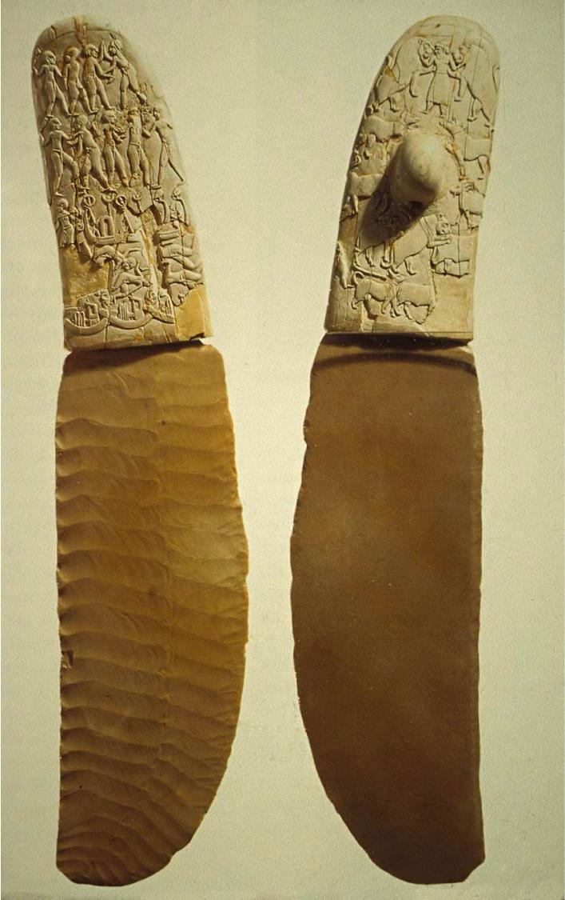
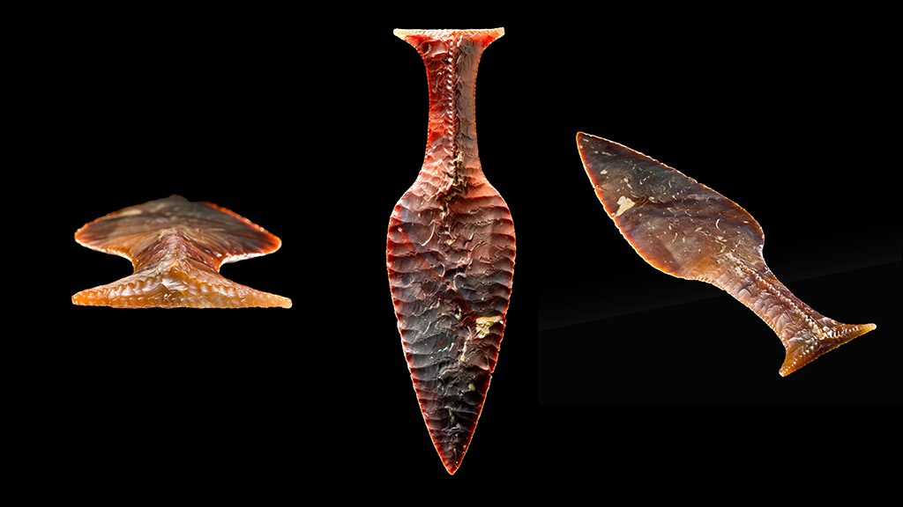
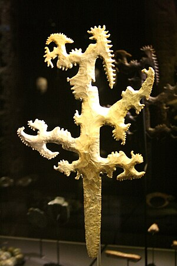
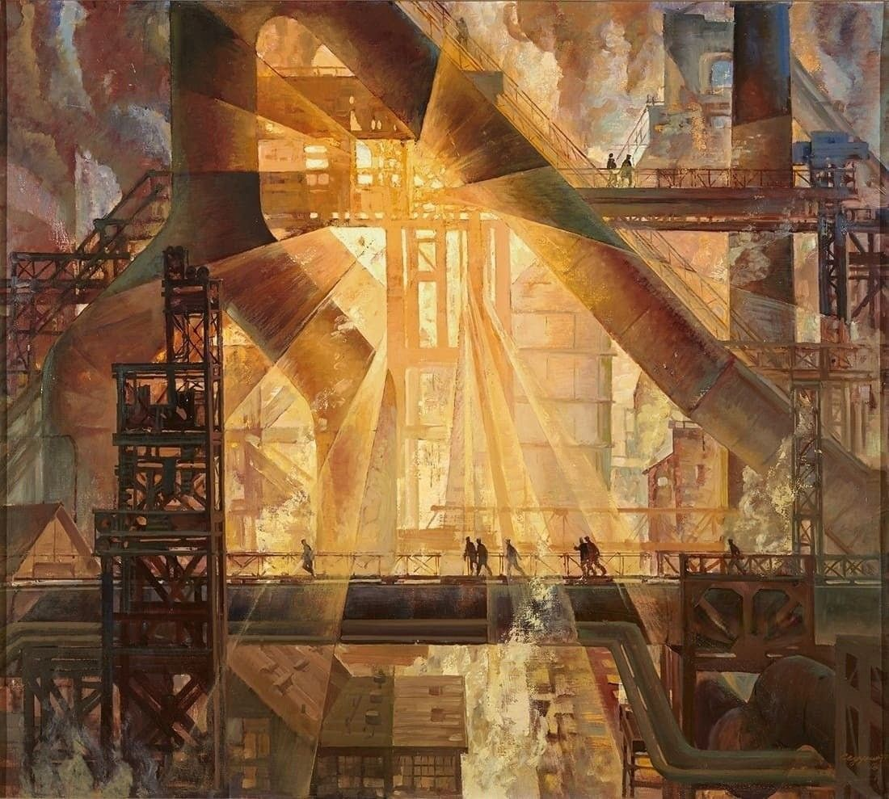

[home](./index.md)
-------------------

*author: niplav, created: 2026-04-17, modified: 2026-08-31, language: english, status: in progress, importance: 1, confidence: possible*

> __An exercise in heartfelt futility.__

Now Is The Golden Age Of Purpose
=================================

In this essay I want to engage and grapple with some questions around the
interplay of **craft** and **purpose**, in a time when it's plausible
that much or all of human activity could be automated soon, *and* it's
possible that the interim period will allow for individuals to exert
large amounts of influence on how the future goes.

Specifically, I want to mourn the notion of **craft**, namely highly
skilled and [attuned](https://joecarlsmith.com/2024/03/25/on-attunement/)
human activity that some people dedicated their entire lives to, and
illustrate this with several examples I find especially vivid.

I want to contrast this with the interim period which has arguably already
begun, in which cultivating a craft runs the risk of being automated
away, and instead encourage myself and others to pursue purpose even
when we feel drawn to becoming skilled craftspeople.

Contra Ergosphere on Fine Machines
-----------------------------------

This whole line of thinking was set off by skimming over
Ergosphere's[^1] post ["The machines are fine. I'm worried about
us."](https://ergosphere.blog/posts/the-machines-are-fine/).  It is a
good blogpost, and I suggest you read it, but if you don't:

[^1]: The author is named Minas Karamanis, the blog has the domain [ergosphere.blog](https://ergosphere.blog); I'll call the author "ergosphere" from here on, since it's such a cool word and [concept](https://en.wikipedia.org/wiki/Ergosphere). I hope they don't mind.

Ergosphere tells the story of Alice and Bob, both starting an
astrophysics PhD.  Alice grinds through her first paper assignment
on her own, Bob vibe-physics it with an AI agent, consequently Alice
emerges a more capable and skillful human being at the end of the year
she spends on the paper, while Bob coasts and learns nothing. The papers
they produce are of similar quality (though the post is unclear on how
certain and robust the equivalence in quality is (…let's put a pin in
that)), but ergosphere hammers home that the paper is, in some sense,
irrelevant; the actual goal of the PhD is to produce *capable people*,
not research artefacts.

Ergosphere goes on to write about how only people who have done the grunt
work can actually tell good AI outputs from bad AI outputs, and the grunt
work is easily avoided as people do everything to avoid [doing the real
thing](https://www.scotthyoung.com/blog/2020/05/04/do-the-real-thing/)/[hugging
the objective](https://www.lesswrong.com/rationality/hug-the-query).

The post draws the distinction between "tool use and cognitive
outsourcing", and encourages readers to use AIs as tools, and
not cognitively outsource to them, as to build up the necessary
skills to distinguish between good and bad outputs, noticing [code
smells](https://en.wikipedia.org/wiki/Code_Smell) and suspicious tells,
developing taste and wisdom.

### We Need To Supervise the Fine Machines?

I respect this post. I've felt it. And… I want to write a requiem to
the world in which it applied. I want to grieve that I'll have to leave
behind a world in which becoming a more capable person is, indeed, one
of the best things to do with ones time. I want to grieve that ergosphere
is, as far as I can tell, wrong.

I also like it because it made me think. Remember that pin we put in it,
three<!--TODO: update--> paragraphs ago?

Ergosphere is, themselves, not quite consistent in how they
judge the quality of the output of LLMs. They write that
Alice's and Bob's papers are identical in quality (or at least
[*publishability*](https://en.wikipedia.org/wiki/Minimum_publishable_unit)),
but then later talks about how Claude confabulated/reward
hacked results in [an experiment by Matthew
Schwartz](https://www.anthropic.com/research/vibe-physics), and how
"[s]tronger models won't eliminate the need for a human who understand
physics".

The question on whether stronger AIs won't eliminate the need for a
human who checks outcomes is, I think, a (the?) crux between ergosphere
and the Bobs of this world (and also me, though see the rest of the text
for subtleties).

In one world, which ergosphere appears to expect: [AI as a normal
technology](https://www.normaltech.ai/p/ai-as-normal-technology),
business-as-usual with better tools, the risk of cognitive atrophy but
also the advantage of being able to provide capable supervision. Planning
for the future is worth it.

Though, ah, even business as usual puts a high discount rate
on the value of becoming highly skilled at a specialized activity…

In the *other* world: [Ultraintelligent
machines](http://incompleteideas.net/papers/Good65ultraintelligent.pdf).
[Transformative
AI](https://www.metaculus.com/questions/19356/transformative-ai-date/).
[The
Singularity](https://en.wikipedia.org/wiki/Technological_Singularity).
[The Hinge of
History](./doc/ea/are_we_living_at_the_hinge_of_history_macaskill_2020.pdf).
Possibly: [Nothing Human Makes it Out Of The Near
Future](https://en.wikipedia.org/wiki/Fanged_Noumena#"Meltdown"). (Unless:
[Pause](https://pauseai.info/)/[Control AI](https://controlai.com/). "Thou
shalt not make a machine in the likeness of a human mind". [Movement
78](https://en.wikipedia.org/wiki/AlphaGo_versus_Lee_Sedol#Game_4). The Brink.)

Indeed, I put a probability of ~70% on us being
in that fearsome *other* world, and that being quite
frightening (primarily due to [superintelligences leading to human
extinction](https://en.wikipedia.org/wiki/Existential_risk_from_artificial_intelligence),
but also [concentration of power to a small group of
humans](https://80000hours.org/problem-profiles/extreme-power-concentration/),
loss of lots of value even though humans don't
technically "go extinct", and stranger badnesses such as
(if we're in a simulation) [that simulation being shut
down](https://simulation-argument.com/pdf/preston-greene-termination-risks.pdf)).

But: That's not the only things that will happen. Even if these scary
events don't happen, or take a while to happen, there is a very specific
loss that ergosphere tries to point at and warn about, and that I also
want to honor in detail.

Craft
------

By "craft" I refer to a human engaging in an activity for so long and to
such a degree of skill that the human, in turn, is meaningfully shaped
by that activity so that their being<!--TODO: Being?--> *entwines*
with the activity. Craft, in my mind, is associated with the image of
a highly skilled blacksmith or weaver whose body and mind have been changed
by decades of engaging in their profession, who have intricate and embodied
understandings of the materials and tool of their craft, and whose eyes and hands
and feet are intuitively involved in the activity. I feel myself reaching for
[Heideggerian](https://en.wikipedia.org/wiki/Martin_Heidegger) terms such
as "Zuhandenheit" and "In-der-Welt-sein" to describe a human engaged in
a craft, though I'm not sure they're fully applicable here.

Instead of further defining "craft", I'll instead satellite it
[extensionally](https://www.lesswrong.com/rationality/extensions-and-intensions),
examining three different instances of it (two, mostly dead; one, dying)
and then turn to how AI might entail a total loss of craft, and what
that loss means for craftspeople.

### Flintknapping

Did you play with stones as a kid? If you did, you may remember
having tried shaping stones into something useful (or at least,
useful-to-you back then). I'm pretty sure you didn't succeed at
your goal unless your ambitions were very low. After recently reading
[Altair](https://www.lesswrong.com/posts/bkjqfhKd8ZWHK9XqF/should-you-make-stone-tools)
writing on the topic and weakly recommending one try to make stone tools,
I idly tried during a pause on a hike to find two stones and reshape
one into an [Oldowan tool](https://en.wikipedia.org/wiki/Oldowan). I
failed miserably, not getting anywhere close to even something like this:

Humans, over history, got *really* good at shaping stones into tools. I
fear that you, the reader, might default to skimming over the pictures
here, not internalizing the magnificence of these tools. They are. You're
looking at artistic works of extreme and deep skill, made by lithic
virtuosos with what I'd guess were sometimes *tens of thousands* of hours
of experience, with an uncanny ability to *see through the flint* and
trace its lines of weakness, a sharp David to be knapped into bladehood.

Flintknapping likely had whole lineages of teachers, and
hunter-gatherers probably had significant specialization
along broad categories, as we learn from the stories of
[Ishi](https://en.wikipedia.org/wiki/Ishi)—humans who spent every day
with the stone, who in some sense acquired stone-nature.

The culmination of hundreds of thousands of years of
refinement in flintknapping is tools like the [Gebel-el-Arak
knife](https://en.wikipedia.org/wiki/Gebel_el-Arak_Knife). Many
people focus on the handle, which is indeed stunning, I want to focus
on the blade. It almost looks like it is made from modern ceramics,
cast instead of knapped, but no, even a blade this thin was first
[pressure-flaked](https://en.wikipedia.org/wiki/Lithic_reduction#Pressure_flaking)
into [chert](https://en.wikipedia.org/wiki/Chert) by a Paganini of quartz,
and then polished.

I have a pet theory that flintknapping was the activity that allowed for a
social niche for autistic people in hunter-gatherer groups30%.
Paleolithic humans had to spend thousands, maybe tens of thousands of
hours to learn how to knap arrowheads, knives and axeheads. The kind
of person who is able to sit at camp, every evening, not engaging with
the others but instead obsessively inspecting the exact way in which
obsidian flakes off when pressed at a slightly different angle… does
that remind you of people? Maybe even yourself? Being able to gift better
stone tools to others confers social status, which can be converted into
reproductive success.

But flintknapping doesn't just produce tools—sometimes
the resulting objects are too fragile, too *ethereal*
to be used as anything but ritual objects. The [Hindsgavl
dagger](https://en.wikipedia.org/wiki/Hindsgavl_Dagger) is an example of
such an object, forged of deep craftsperson ability, weeks or *months*
of careful pressure, a slow and methodical chipping away where any wrong
pressure breaks the damn substrate, to have start again. A Platonic
dagger flaked out of a volcanoes cooled blood.

"What about marble statues? Aren't they much *more* impressive, given that
they're not a simple geometric shape (a blade), but delicate statues? Is
the [Nike of Samothrace](https://en.wikipedia.org/wiki/Nike_of_Samothrace)
not infinitely more impressive than the Hindsgavl daggers? And is this not
an argument against your case, since we have skulptors *today* who can make
status that are as impressive as the Nike?"

Thank you, hypothetical interlocutor! I do find marble statues to
be pretty impressive, but not *more* (or at least not *much* more) than
knapped flint.

This stems from two roots, namely:

1. Flintstone and obsidian are even less forgiving materials than marble; the former splinter & shatter more easily, and techniques like polishing don't apply well when trying to create a blade (as opposed to a surface on the marble).
2. To my knowledge, almost all of the impressive marble statues we know were produced by first making clay of wax models, iterating on the form, and then copying the model with a [pointing machine](https://en.wikipedia.org/wiki/Pointing_machine). Especially modern skulptors almost never create statues by [direct carving](https://en.wikipedia.org/wiki/Direct_carving), or when they do the resulting statue is far less sophisticated.

Arguably, creating stone skulptures is still a respectable craft (though
slightly impressive when done with a pointing machine, and direct carving
a full complicated statue is afaik dead as a craft).

Knapping reached its roccoco height in the [eccentric
flints](https://en.wikipedia.org/wiki/Eccentric_flint)
created by Maya maestri, possibly spurred on by the [relative lack of
metallurgy](https://en.wikipedia.org/wiki/Mesoamerican_chronology#Postclassical_period)
in pre-Columbian meso-America. I do not find these beautiful, per
se; my aesthetic is one of simplicity: please give me the stark
elegance of a chipped obsidian arrowhead instead. Instead these
flint are *splendid*, *impressive*, *decadent*, yes, definitely
__eccentric__. Where the Hindsgavl dagger and Gebel-el-Arak knife are
[sonatas](https://en.wikipedia.org/wiki/Sonata), an eccentric flint is a
[fantasia](https://en.wikipedia.org/wiki/Fantasia_(music)).

I can admire them in the abstract, as craft finally unmoored from even
the pretense of utility.

### Tracking

The second craft I want to mourn is an even older one, the craft of tracking.

> As to the question of tracking, the idea which has been generally
held, that the shoes are used to prevent the tracks being seen will
not be regarded as at all satisfactory by those who are acquainted with
the remarkable power of the Australian native in this respect. They will
neither hide the track nor, though they are shaped alike at each end, will
they even suffice to prevent any native who cares to look from seeing at
a glance which direction the wearer has come from, or gone towards. __Any
even moderately experienced native will, without the slighest difficulty,
tell from the faintest track—from an upturned stone, a down-bent
piece of grass or a twig of shrub—not only that some one has passed
by but also the direction in which he has travelled__. The only way in
which they can be of use in hiding tracks is by preventing it from being
recognised who was the particular individual, and in this way they might
be of service, for __when once an experienced native—almost incredible
though it may sound to those who have not had the opportunity of watching
them —has seen the track of a man or woman he will distinguish it
afterwards from that of any other individual of his acquaintance__.

*—[Baldwin Spencer](https://en.wikipedia.org/wiki/Baldwin_Spencer_(anthropologist))/[Francis James Gillen](https://en.wikipedia.org/wiki/Francis_James_Gillen), “The Native Tribes of Central Australia” p. 483, 1899*

I imagine that if I witnessed this kind of ability, it'd look like
magic[^magic] to me. And yet, there were entire cultures where this kind
of ability was as fundamental as literacy is in ours!

[^magic]: "Magic" in the [Yudkowskian sense](https://www.lesswrong.com/s/6BFkmEgre7uwhDxDR/p/x4dG4GhpZH2hgz59x), in that it's a thing that is so far outside of my understanding what's possible that I can't even rederive *that* it could work.

I'm also almost certain that all the best trackers are long dead,
and that present-day hunter-gatherer groups are too small to have
transmitted all the knowledge from the past, or that (e.g. with the
[Hadza](https://en.wikipedia.org/wiki/Hadza_people)) the surrounding
industrial civilization relieves some of the pressure to drive the art
to its peak, and that Louis Liebenberg and Mark Elbroch are a step of
skill below those present-day hunter-gatherers.

We get glimmers of this depth in some
anthropologies, for example in the [Story of Short
Kwi](https://traditionsofconflict.substack.com/p/the-sad-story-of-short-kwi-legendary):

> Among the Bushmen of Nyae Nyae in Namibia during the 1950’s, the
man known as Short Kwi was famous for his hunting prowess. Tales were
told of his great achievements in the chase—the time he killed an
[eland](https://en.wikipedia.org/wiki/Common_Eland), a wild pig, and
a wildebeest in a single day; the time he killed four wildebeest in a
large herd—his exploits were legendary.
>
> He was said to be a relentless pursuer who almost never lost an
animal. He could pick up a cold trail even over stones. He deduced
subtle clues from fallen leaves, such as whether they had been
disarrayed by the wind or the movements of his prey. The meat
from his pursuits was never wasted, as it was shared liberally
and dried to last weeks.
>
> He had encyclopedic knowledge of the animals in his
environment—from the smallest mice to the largest antelope,
he knew by heart their habits and where they could be
found. Elizabeth Marshall Thomas writes that, “He knew every
bush and stone in the area of thousands of square miles that he
ranged over, and he lived for hunting."
>
> While the Bushman practice of ‘shaming the meat’ to prevent
an effective hunter from getting a big head is well known, with
Short Kwi, “his great ability set him so far apart from ordinary
mortals that for once the Bushmen forgot their jealousy and agreed
that he was the best hunter the Kalahari had ever known.”

*— [William Buckner](https://traditionsofconflict.substack.com), [“The Sad Story of Short Kwi, Legendary Hunter of the Kalahari”](https://traditionsofconflict.substack.com/p/the-sad-story-of-short-kwi-legendary), 2022*

### Coding

This third one is closer to my heart.

>  it's strange to see the world of the past fade before my eyes
>
> from 2012 through 2024, I wrote code in long sessions of sitting in
vim -- sometimes typing, mostly thinking, flipping between different
terminals, making changes, looking at errors, googling, reading
stackoverflow...
>
I took pride in carrying in my head these towering abstractions. I knew
every nook and cranny of my business logic, like a neighborhood you
live in. I felt extra fast when tab-completing a single long variable
name. Nice. I placed every parenthesis, every semicolon, myself. Hundreds
of thousands of them.
>
> And like a great wave washing over your sandcastle on the beach,
it is now all gone. Engineering will never again be as it once was.
>
> What's especially significant about it to me is that there's barely a
record of the way it was: I've spent thousands of hours writing software,
and I don't think there's a single video recording of me doing it.
>
> I remember how it was: the long breaks of meditative silence, the
frustration of hunting a particularly tricky bug, the relief and joy in
solving it, the expressions of taste and cleverness that come with any
manual craft.
>
> But it's hard to communicate how it was to someone who has never
experienced it. As with all histories, the narrative is lacking in depth:
you really had to be there.

*— [John Loeber](https://nitter.poast.org/johnloeber), [Tweet](https://nitter.poast.org/johnloeber/status/2029335095077945565), 2026*

I was recently rewatching [Silicon
Valley](https://en.wikipedia.org/wiki/Silicon_Valley_(series)),
and was surprised by the *pride* that Richard & Dinesh & Gilfoyle
put on their technical ability in software engineering and systems
architecture, in algorithm design and reliability engineering. That
had been my aspirational pride, too, after reading [Eric S. Raymond's
FAQ](https://www.catb.org/~esr/faqs/hacker-howto.html) as a 14-year old,
and decided I wanted to become a great hacker, in the [hacker culture
sense](https://en.wikipedia.org/wiki/Hacker_Culture).

I think I'd forgotten this part of my psyche, swept by
the Gezeiten[^tides] of AI progress around me, silently
and unconsciously giving up on the aim of craft, of
becoming really fucking good at writing [crisp and crystalline
code](https://www.stilldrinking.org/programming-sucks) in the tradition
of the monastic order of the [suckless](https://suckless.org). I hadn't
even quite realized that this part of me was unhappy that something
important had been taken away with the release of Claude Code, back then
in early 2025.

I had been robbed of the opportunity to become
[Mel](http://www.catb.org/jargon/html/story-of-mel.html).

There was another, similar, moment when I installed Claude Cowork for my
partner on their work laptop to test how good it'd be at their job. We
gave it a simple task of setting up an oneline form, and sent Sonnet
grinding away. We watched Claude work (surprisingly slowly, compared
to Claude Code!) away on it while we were cuddling.<!--TODO: that meme
where the couple is cuddling and watching something from the bed?-->
It felt… irreal. Watching something important sublimate in the middle of its existence.

The weaver in front of the industrial loom, the medieval blacksmith
before the factory with a blast furnace.

[^tides]: Alright, this word choice I'll explain a bit. "Gezeiten" means "tides" in German, but "Zeiten" is *also* translateable as "times", and the "Ge-" prefix indicates something that is occurring/being done. So the best translation her would be "tidal times-ings", but even that's not perfect. Forgive my attempts at load-bearing multilingual puns.

>  Importantly, the main thing on my mind here is not really about
programming, it’s the nature of seeing something change and totally
go away, fade in real-time, with the actual way that it once was being
impossible to record or to really convey

*— [John Loeber](https://nitter.poast.org/johnloeber), Followup Tweet<!--TODO: link-->, 2026*

### The Loss of Craft

If we are in the other world of full automation and human obsolescence
and |disempowerent⟩+|Deep Utopia⟩, then we will lose all basis of craft.

*A new star is rising on the firmament*

This type of loss is not new, per se. I've named two crafts that
have ~completely disappeared, and there are many others (reciting the
Iliad or the Vedas from memory<!--TODO: link-->, marine navigation by
stars, blacksmithing…) The loss of craft is one of the [diseases of the
soul](./notes.html#Forager_Society_is_a_Disease_of_the_Flesh_Industrial_Society_is_a_Disease_of_the_Soul)
that the golden goose of civilization demands from us. But, so far,
as far as I can tell, one wasn't expected to deal with more than one
loss of craft in ones lifetime, not to speak of the *whole damn rug*
being pulled away from under oneself.

Every now and then reality jerks your craft away from what is necessary,
see Short Kwi, the flintknappers, the Iliad-singers, the weavers and
blacksmiths, the software engineers and geometers, this happens rarely
and slowly enough that a human will experience it at most once in their
lives, maybe not even that.

Sure, one could technically continue to practice the craft in ones free
time, but what a hollow answer! I am a human who wants to turn himself
into an instrument for a craft, which *is* purpose, as long as it connects
well enough to reality.

This loss was tragic whenever it happened! It was horrible! Such deep
skill was lost, such incredible finesse! LOOK AT THE HINDSGAVL DAGGERS!

…

And now, the whole thing. "All that is solid melts into air, all that
is holy is profaned, and man is at last compelled to face with sober
senses his real conditions of life"

#### Cope

Sometimes (okay, *almost always*) the attachment to a particular craft does
not go quietly.

There is no good replacement word for "cope" in English, truly an
incredible coinage.

None come close: "Sour grapes" is purely about giving up on possibly
valuable things, "rationalization" and "denial" are too clinical,
"motivated reasoning" is too wordy.

"Cope" covers it all, from denying the existence of the fact that one
might never be truly loved, to (ineffectually) dealing with the fact
that your neighbour has a cooler car than you; it can function verb,
noun and imperative; it's not purely dismissive but not exculpatory
either. I don't know how we managed before 4chan gave it to us.

A common reaction to losing ones craft is cope.

Because this is me, and this is my essay, I shall illustrate this with
a German poem. The context for this poem is that during the industrial
revolution, the [silesian](https://en.wikipedia.org/wiki/Silesian)
artisan weavers were being automated, and the poet [Heinrich
Heine](https://en.wikipedia.org/wiki/Heinrich_Heine) wrote an fiery war
cry in their name[^german]:

> Im düstern Auge keine Träne  
Sie sitzen am Webstuhl und fletschen die Zähne:  
Deutschland, wir weben dein Leichentuch,  
Wir weben hinein den dreifachen Fluch -  
Wir weben, wir weben!
>
> Ein Fluch dem Gotte, zu dem wir gebeten  
In Winterskälte und Hungersnöten;  
Wir haben vergebens gehofft und geharrt -  
Er hat uns geäfft, gefoppt und genarrt -  
Wir weben, wir weben!
>
Ein Fluch dem König, dem König der Reichen,  
Den unser Elend nicht konnte erweichen  
Der den letzten Groschen von uns erpreßt  
Und uns wie Hunde erschießen läßt -  
Wir weben, wir weben!
>
Ein Fluch dem falschen Vaterlande,  
Wo nur gedeihen Schmach und Schande,  
Wo jede Blume früh geknickt,  
Wo Fäulnis und Moder den Wurm erquickt -  
Wir weben, wir weben!
>
Das Schiffchen fliegt, der Webstuhl kracht,  
Wir weben emsig Tag und Nacht -  
Altdeutschland, wir weben dein Leichentuch,  
Wir weben hinein den dreifachen Fluch,  
Wir weben, wir weben!"

*— Heinrich Heine, [“Die schlesischen Weber”](https://www.deutschelyrik.de/die-schlesischen-weber.407.html), 1845*

Heine inadvertently describes the cope perfectly: The reaction to the
rising tide is not nimble action, but denial and accusations and a
doubling-down on the very thing that has no power anymore. Ihr webt,
ihr webt, but what use does that have? The mechanical loom over there
could be coping much harder than you, too.

I've felt this cope (and seen it in others!), multiple times, seeing
the LLMs flood a skill I have, and then coping "but they can't do X
yet!!!"; visual artists[^yes] and software engineers and musicians<!--TODO:
link Adam Neely video--> and mathematicians scream "no! not me! I won't
be afflicted by the age of mechanical production!"

No. Stop. Let go. Feel into your cope, give yourself a hug, and then
drop it. Nothing Human Makes It Out Of The Near Future. I'm Sorry. :-|

[^yes]: I fully believe that neither art nor music are as close to being automated as e.g. software engineering and mathematics are. I do think that they *will be*, soon, and that the reaction would be the same either way.

Purpose
--------

### Longer Levers

### Peak ~~Oil~~ Purpose

The View of Utopia From Below
-------------------------------

Nick Bostrom's [Letter from Utopia](https://nickbostrom.com/utopia.html)
is on of my favourite pieces of writing, ever. It takes the perspective
of distant future posthuman eutopians trying to communicate to us,
beckoning us to come closer, to *become them*, to join them at the
[*Festspiel*](https://en.wiktionary.org/wiki/Festspiel) forth
then[^sonnet] in Heaven. I've cried many times upon [listening
to](https://www.youtube.com/watch?v=GWP1rlbjszg)/reading over
it, a unique and to me uncommon religious experience—and I'm [not
the](https://joecarlsmith.com/2021/01/18/actually-possible-thoughts-on-utopia/)
only one<!--TODO: link @yashkaf who reports similarly-->.

[^sonnet]: Thanks to Sonnet 5 for this construction.

Another one of my favourite pieces of writing is [Hyperions
Schicksalslied](https://www.textlog.de/17824.html)
by the German romantic [Friedrich
Hölderlin](https://en.wikipedia.org/wiki/Friedrich_Hölderlin).

It is the [dual](https://en.wikipedia.org/wiki/Dual_(mathematics)) of the
Letter, which speaks to us in the voice of the Posthumans.  Hölderlin,
on the other hand, addresses *them* from __our__ perspective.

> Ihr wandelt droben im Licht  
Auf weichem Boden, selige Genien!  
Glänzende Götterlüfte  
Rühren euch leicht,  
Wie die Finger der Künstlerin  
Heilige Saiten.

[^german]: In this whole text, I will not translate the German to English, as doing so would damage something fragile in the meaning I'm trying to get across. I recommend (but do not mandate) that you consult your favourite large language model to find you an adequate translation.

The Posthumans are cradled by a soft and ubiquitous
[sysopmind](https://intelligence.org/files/CFAI.pdf#page=199), touched
only softly by the most refined aspects of reality. They dwell in the
[realm of the devas](https://en.wikipedia.org/wiki/Deva_(Buddhism)),
unperturbed.

> Schicksallos, wie der schlafende  
Säugling, atmen die Himmlischen;  
Keusch bewahrt  
In bescheidener Knospe,  
Blühet ewig  
Ihnen der Geist,  
Und die seligen Augen  
Blicken in stiller  
Ewiger Klarheit.

No Purpose drives them, no Need propels. Purpose has been handed off
and completely spent; the world has reached a final orbit, and its
inhabitants reside in fatelessness and eternal clarity. Craft is even
*less* necessary than Purpose, now hidden somewhere deep inside the
machinery that underpins the new world.

Whether such a world is a *good* world, and what the posthuman
*Genien* would be doing, exactly, is the purpose of [another
book](https://www.goodreads.com/book/show/208707460-deep-utopia).

*Doch uns ist gegeben, auf keiner Stätte zu ruhn*
--------------------------------------------------

We are *decidedly* not in the world of the *Genien* yet. Perhaps, at
some point, we'll be enveloped. But not right now. Right now we hold
the largest levers over the pulleys and cables of history, the dials
for the circuit of the lightcone, the switches for the machinery of night.

We are, as the saying goes, in that awkward phase between being being
born and dying, but we are also (if I'm correct[^disclaimer]) about to
enter that awkward phase between losing Craft and losing Purpose.

[^disclaimer]: I may still be wrong! Oh god please

In such a case seeking cope in Craft, doubling down on that
ancient and familiar safety, will do no good. You will [waste your
time](https://en.wikipedia.org/wiki/Opportunity_Cost), you will be
jolted by reality as your craft is rugpulled out from under you, only to
finally realize that all relevant time has passed, and all your levers
have disappeared.

Thus, my sad and desperate battlecry: Do not shape yourself
into an instrument of deep skill. Look instead at the world,
grab all the {levers, AI agents, [convergent instrumental
strategies](https://arbital.com/p/convergent_strategies/)} you can
plausibly get, and instrument the universe into the direction you desire.

Craft is clearly ill, its [bubos](https://en.wikipedia.org/wiki/Buboe)
swelling in mathematics and software engineering — it will die, how
long the course is not certain. Mourn it, sings to it elegies, nurse its
healthier parts with expendable free energy, but do *not* ally with it.

Time is precious, now, and focus and attention are, too. Yet you
have [write access](https://en.wikipedia.org/wiki/Write_access)
to the universe, yet it yields. The window is
closing, and [we are on triage every second of the
day](https://forum.effectivealtruism.org/s/HSA8wsaYiqdt4ouNF/p/XXLf6FmWujkxna3E6).
Do not cope.

Now Is The Golden Age of Purpose.

> Doch uns ist gegeben,  
Auf keiner Stätte zu ruhn,  
Es schwinden, es fallen  
Die leidenden Menschen  
Blindlings von einer  
Stunde zur andern,  
Wie Wasser von Klippe  
Zu Klippe geworfen,  
Jahr lang ins Ungewisse hinab.
