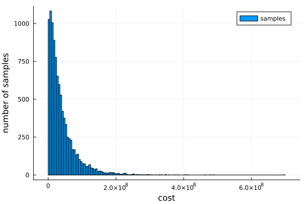

[home](./index.md)
------------------

*author: niplav, created: 2024-01-30, modified: 2024-01-30, language: english, status: draft, importance: 5, confidence: certain*

> __I collect [civilizational
inadequacies](https://www.lesswrong.com/s/oLGCcbnvabyibnG9d/p/yPLr2tnXbiFXkMWvk)
and perform an [inadequacy
analysis](https://www.lesswrong.com/s/oLGCcbnvabyibnG9d/p/pRibkeqBa2AxrpgT6)
on some of them.__

Some Civilizational Inadequacies
=================================

<!--TODO: Fermi estimates for all of these-->

* Cookie warnings in the EU, caused by the GDPR
	* Civilizational cost Fermi estimate
		* 1 warning per day, which takes 2 seconds to close, with ~400 mio. people use the internet regularly, for the 4 years since GDPR was instituted
		* `$\frac{1 \text{ warning}}{\text{person} \cdot \text{day}} \cdot \frac{2 \text{ unskilled labor seconds}}{\text{warning}} \cdot \frac{1 \text{ unskilled labor hour}}{3600 \text{ unskilled labor seconds}} \cdot \frac{365 \text{ days}}{\text{year}} \cdot 4 \text{ years} \cdot 4 \cdot 10^8 \text{ persons} \approx 3.25 \cdot 10^8 \text{ unskilled labor hours}$`
		* Which at `$\frac{5€}{\text{unskilled labor hour}}$` is ~1.6 bio. €
		* Can the benefit compare to this?
* Gear sticks for manual gear shifting (which are much more common in the EU, I think)
	* Civilizational cost Fermi estimate
		* Let's assume that ~half of the population of Europe learned to drive with manual (manual might not have been available beforehand), which took them ~5 hours more on average.
		* That gives `$\frac{5 \text{ unskilled labour hours}}{\text{person}} \cdot 3 \cdot 10^8 \text{ persons}=1.5 \cdot 10^8 \text{ unskilled labour hours}$`
		* At `$\frac{5€}{\text{unskilled labor hour}}$` this is ~7.5 bio. €
		* Although maybe this isn't a civiliational inadequacy (since there is not *really* an equilibrium we're caught in), or at least we're in the process of transitioning [out of it](https://www.nytimes.com/2021/06/24/business/stick-shift-collector-cars.html).
		* Disregarding
			* Any costs from increased numbers of crashes.
			* Increased crash probabilities from higher cognitive load.
		* Further relevant numbers
			* It seems like automatic cars [are now *more* fuel efficient than manual ones](https://20somethingfinance.com/manual-transmission-savings/), at ~\$60 per 1000 kilometers.<!--TODO: maybe use http://www.fueleconomy.
gov/ -->
			* On the other hand, automatic gearshifting mechanisms [are far more expensive to repair](https://www.fbfs.com/learning-center/automatic-vs-manual-cars-costs-to-consider), at a cost of ~\\$2k-\\$4k, whereas manual transmission replacement costs ~\\$1.5k-\\$3k.
			* Additionally, [this page](https://20somethingfinance.com/manual-transmission-savings/) states that manual cars are still ~\\$1k cheaper than automatic ones.
			* The world produces about [100 mio. cars per year](https://en.wikipedia.org/wiki/Car_production#World_motor_vehicle_production).
* Non-velcro shoes
* Courses at university are not 3blue1brown + Q&A + extensive quizzes (or automated tutoring à la DARPA)
* TSA security theater
* A lot of terminology in mathematics, for example using "numerator"/"denominator" instead of "upper number"/"lower number" when talking about [fractions](https://en.wikipedia.org/wiki/Fraction) (which would be vastly easier to understand/remember *and* in one case even has fewer syllables)
* People wear glasses and usually clean the *lenses*, but I've never heard of anyone who washes the *frame* of their glasses, despite wearing them on their face nearly the entire day.
	* Other frequently used and rarely cleaned objects: Salt shakers and pepper mills, laptop keyboards, smartphones, (smart)watches. One might be tempted to argue that this infrequent cleaning is evidence that we are overly obsessive over cleanliness.
* Instead of writing Bachelor's theses, students could simply improve or write Wikipedia articles.
* Most likely recycling
* [Pennies](https://en.wikipedia.org/wiki/Penny_debate_in_the_United_States), 1-cent and 2-cent coins (still present despite [a plurality of citizens in *all eurozone countries* being in favor of abolishing the 1-cent coin](https://europa.eu/eurobarometer/surveys/detail/2291))

### Fragile Tableware

Ceramic/porcelain plates and cups made of glass break easily, while the
æsthetics we have around them seem mostly path-dependent (and perhaps
even *caused* by their fragility, leftovers from a time where fragile
tableware signaled wealth).

__Cooling__: Generally, porcelain plates have the advantage
that food placed on them cools less quickly. Wikipedia [states
that](https://en.wikipedia.org/wiki/List_of_thermal_conductivities)
porcelain has a thermal conductivity of ~1.4 to 1.9
`$\frac{W}{K \cdot m}$` at ~400 Kelvin, and [pyrex
glass](https://en.wikipedia.org/wiki/Pyrex) variants have thermal
conductivities of 1-2 in the the range 273-373 Kelvin, while Aluminium
(a contender for a substance out of which to make plates, glasses &
cups) has a thermal conductivity of ~100 `$\frac{W}{K \cdot m}$` at
273 Kelvin — which leads to faster cooling, and colder food is less
enjoyable to eat. However, we don't *have* to be stupid about this:
plastics lose heat even more slowly than porcelain (generally with
thermal conductivities <1).

__Æsthetics__: The other advantage of porcelain and glass is that they
just *look so much nicer*. I don't have any strong rejoinders here,
my æsthetics rejoice in knowing that I'm doing a thing that is more
economical—but I acknowledge that I'm in the minority there. The
only guidepost I can offer is to look at the price and then ask: "Are
the æsthetics worth this price?" If yes, go ahead! If not, I may have
pointed out something interesting.

Code for a slightly more complicated Fermi
estimate, (mis)using the [probabilistic programming
language](https://en.wikipedia.org/wiki/Probabilistic_programming_language)
Turing.jl:

        using Turing, Plots

        @model function ceramic_glass()
                people ~ Normal(8*10^9, 0.05)
                meals_per_day ~ truncated(Normal(2.5, 1), lower=0)
                proportion_tableware_users ~ Beta(5, 2.5) # Mean ⅔
                breakage_per_meal ~ Beta(1.5, 1000) # Mean ~0.0015
                cost_per_tableware ~ truncated(Normal(2, 0.5), lower=0) # In dollars
        end

        chains = sample(ceramic_glass(), IS(), 10000)
        sampled=get(chains, [:people, :meals_per_day, :proportion_tableware_users, :breakage_per_meal, :cost_per_tableware])
        total_cost_per_day=sampled[:people] .* sampled[:meals_per_day] .* sampled[:proportion_tableware_users] .* sampled[:breakage_per_meal] .* sampled[:cost_per_tableware]
        mean(total_cost_per_day)
        4.00195809996674e7
        gui(histogram(total_cost_per_day, label="samples", xlabel="cost", ylabel="number of samples"))

And using [squigglepy](https://github.com/rethinkpriorities/squigglepy):

	import squigglepy as sq
	import numpy as np
	import matplotlib.pyplot as plt

	people=sq.norm(mean=8*10**9, sd=0.05)
	meals_per_day=sq.norm(mean=2.5, sd=1, lclip=0)
	proportion_tableware_users=sq.beta(a=5, b=2.5)
	breakage_per_meal=sq.beta(a=1.5, b=1000)
	cost_per_tableware=sq.norm(mean=2, sd=0.5, lclip=0)
	total_cost_per_day=(people*meals_per_day*proportion_tableware_users*breakage_per_meal*cost_per_tableware)@100000

	np.mean(total_cost_per_day)
	40423162.50675405

This is a clear case of where [estimational
programming](https://forum.effectivealtruism.org/posts/t6FA9kGsJsEQMDExt/what-is-estim
ational-programming-squiggle-in-context)
has a strong advantage over [probabilistic
programming](https://en.wikipedia.org/wiki/Probabilistic_programming).

Note that this code only estimates the costs of fragile tableware, and
makes no statements about the costs of e.g. switching to alternative
materials.

Appendix A: Civilizational *Adequacies*
----------------------------------------

I use the term "civilizational adequacy" in a very strict sense
here: Areas where our world surprisingly overperforms, implementing
policies or having institutions that, given one were to observe
them, would indicate our civiliation being adequate in many other
dimensions too. "Mundane" but still impressive infrastructure doesn't
count, even though it's really good. See also [Croissanthology
2024](https://croissanthology.com/adequate.html).

* [GPS](https://en.wikipedia.org/wiki/Global_Positioning_System), impressive because it uses both special and general relativity
* The swift implementation of the [Montréal Protocol](https://en.wikipedia.org/wiki/Montreal_Protocol) after we discovered the growing [ozone hole](https://en.wikipedia.org/wiki/Ozone_Hole)
* [Aviation safety](https://en.wikipedia.org/wiki/Aviation_safety)
* [Spectrum auctions](https://en.wikipedia.org/wiki/Spectrum_auction), especially the [structure](https://en.wikipedia.org/wiki/Spectrum_auction#Auction_structure) of the US auctions and of the [UK](https://en.wikipedia.org/wiki/Paul_Klemperer#Public_policy) revenue maximising auctions, earning the UK government multiple billions dollars more
* Efforts at asteroid mapping and [defense](https://en.wikipedia.org/wiki/Double_Asteroid_Redirection_Test) efforts, in my humble opinion adequate for the relatively small annual risk (though we're not yet prepared); [Ord 2020](https://en.wikipedia.org/wiki/The_Precipice_\(book\)) estimates a chance of extinction of 1:1 mio. per century due to asteroid impact.
