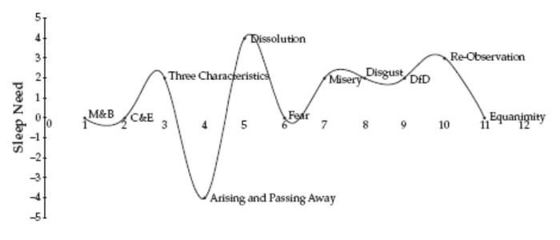

[home](./index.md)
------------------

*author: niplav, created: 2023-07-06, modified: 2024-01-17, language: english, status: notes, importance: 6, confidence: possible*

> __Humans get around 80 years of life. How can that time be made to
feel as long as possible?__

Increasing Subjective Lifespan
================================

[Existing](http://theoryengine.org/life/tips-for-a-longer-life/)
[investigations](https://www.wikihow.com/Slow-Down-Time)
are not well cited, don't consider trade-offs and costs
or effect sizes, given that subjective time is all one has,
it'd be good to have a reliable guide to lengthening it. [Ethan
2023](https://210ethan.github.io/research/slow.html) is the best resource
I currently know of, but a more comprehensive resource including effect
sizes, costs and benefits appears worthwhile to create.

This is *not* about extending healthspan, either by prosaic or
medical interventions, or curing aging, for overview into that see [JackH
2020](https://www.lesswrong.com/posts/RcifQCKkRc9XTjxC2/anti-aging-state-of-the-art)
and [Ricón 2021](https://nintil.com/longevity).

| Intervention | [Net present value](https://en.wikipedia.org/wiki/Net_Present_Value) | State of evidence | Papers | Notes |
| ----------------------------- | -------------------------------------------------------------------- | -------------------------------- | -------| ----- |
| Meditating 2.5 hours per day → Reduces sleep need | \$33k | Poor, a single case study (n=7) | [Kaul et al. 2010](./doc/meditation/science/meditation_acutely_improves_psychomotor_vigilance_and_may_decrease_sleep_need_kaul_et_al_2010.pdf) | Can also confer [other benefits](https://en.wikipedia.org/wiki/Research_on_Meditation), but multiple hours of meditation per day [could be risky](https://harpers.org/archive/2021/04/lost-in-thought-psychological-risks-of-meditation/) | <!--TODO: maybe link MCTB here?-->
| Taking melatonin → Reduces sleep need | \$7.5k | Data collected from two individuals (n=2) | [Gwern 2019](https://www.gwern.net/Melatonin#tempus-fugit), [Niplav 2024](./nootropics.html#Reducing_Sleep_Duration) | Low risk |

Reducing Time Slept
--------------------

[Harsimony 2021](https://harsimony.wordpress.com/2021/02/05/why-sleep/)
argues that we should reduce sleep need, pointing out that these ~30%
of our lives might be better spent on other activities, be they conscious
leisure or work.

Beliefs are for action, all statistics is decision theory. In choosing
how (much) to sleep, and in what way, we want to trade off benefits
against costs. The benefit of sleeping less is quite straightforward:
More time spent awake, either in leisure or working, making more use of
the limited amount of time we have before dying.

The costs are more subtle: Some intervention we're considering might have
negative side effects, either only on the hours gained or on all of the
hours spent awake, or having an effect on expected lifespan.  So we have
to decide how much we (e.g.) (dis)value spending an additional hour awake,
but being 5% more dizzy during those 17 waking hours.

<!--https://www.healthline.com/health/how-to-sleep-8-hours-in-4-hours-->

### Drugs

#### Melatonin

<!--TODO: incorporate info from two meta-analyses linked in twitter replies-->
<!--Question: *Why does melatonin show reduced sleep duration in internet
hobbyist studies, but professional meta-analyses show slight increase
in duration? Is it the overdosing of melatonin in nearly all settings?-->

##### Gwern 2019

[Gwern 2019](https://www.gwern.net/Melatonin#tempus-fugit):

> My rule of thumb is melatonin subtracts an hour [of sleep
time]. (I originally guessed at this value, but my Zeo
sleep recordings seem to suggest the value is [more like 50
minutes](https://www.gwern.net/Zeo.html#melatonin-analysis).) That is:
if one slept for 7 hours, one awakes as refreshed as if one had slept
for 8 hours etc. From comparing with others, I think I benefit more than
around two-thirds of people.

##### Niplav 2024

I [analyze](./nootropics.html#Reducing_Sleep_Duration) my own data,
and (weakly) conclude that melatonin reduces my sleep duration by ~25
minutes, although I have not checked whether melatonin simply makes my
body go into sleep debt which is then paid off the next night.

##### Cost-Benefit

Assuming a (conservative) 15 minutes of sleep time saved, at a price of
~4 cent per pill, assuming the benefit does not taper off, we get a net
present value (over the next 40 years) of

`$\sum_{i=0}^{40} \frac{365 \cdot (0.25 \text{hr} \cdot 5 \frac{\$}{\text{hr}})}{1.05^i} \approx \$7578$`.

#### Orexin-A

> If you are a naive reader, you might expect that we give people
with narcolepsy type 1 orexin-A as a supplement because that would be
obvious. We don’t. You might expect that someone tried to bring it to
market as a drug and ran a clinical trial. They didn’t.  
> The problem seems to be that the solution is too obvious. The patent
office likely decided that the solution would be too obvious to give
out a [patent for it](https://qr.ae/pvWJAr), and thus the narcoleptic
patients are without orexin-A supplementation unless they go through
[efforts](https://forum.biohack.me/index.php?p=/discussion/1075/orexin-a-group-purchase)
to procure it themselves.

*—[ChristianKl](https://www.lesswrong.com/users/christiankl), [“Orexin and the quest for more waking hours”](https://www.lesswrong.com/posts/sksP9Lkv9wqaAhXsA/orexin-and-the-quest-for-more-waking-hours), 2022*

<!--TODO: check up on Orexin agonists!-->

* [jayterwahl, 2021](https://www.lesswrong.com/posts/cfRHPHdgpNcSEcY5y/curing-sleep-my-experiences-doing-cowboy-science): n=2, m=? experiment with Orexin, battery of cognitive tests. Subjective assessment by the author: Reduces the effects of sleep deprivation on cognitive performance, but not the feeling of sleepiness. Doesn't mention the amount of sleep deprivation, but useful datapoint: It's not *immediately lethal* to snort Orexin.

#### Others

Selected from [Harsimony 2023](https://harsimony.wordpress.com/2023/01/20/research-areas-for-reducing-sleep-need/):

* Modafinil
* Neuropeptide S
* S-Adenosyl methionine
* Sodium Oxybate

### Meditation

> While it may be true that, when doing intensive practice, the need
for sleep may go down to perhaps four to six hour or less at a time,
try to get at least some sleep every night.

*—Daniel Ingram, “Mastering the Core Teachings of the Buddha”, p. 179*

> Meditation in dreams and lucid dreaming is common in this territory
[of the Arising and Passing away]. The need for sleep may be greatly
reduced. […] The big difference between the A&P and Equanimity is that this
stage is generally ruled by quick cycles, quickly changing frequencies
of vibrations, odd physical movements, strange breathing patterns, heady
raptures, a decreased need for sleep, strong bliss, and a general sense
of riding on a spiritual roller coaster with no brakes.

*—Daniel Ingram, “Mastering the Core Teachings of the Buddha”, p. 275*

> Need for sleep tends to increase in the Three Characteristics, mostly
due to how tiring pain can be. Sleep need can drop dramatically in the
stage of the A&P, suddenly peak in dissolution, drop a bit again in Fear
as our energy returns, and increase during the Dark Night, mostly due
to how mentally fatiguing that stage can be.

> 

*—Daniel Ingram, “Mastering the Core Teachings of the Buddha”, p. 379*

Note: as far as I know, this chart is not based on any data collected,
but on the personal experience of Ingram and his acquaintances.

> The interesting thing is that all four of these people within a year
or so of having started this practice claimed to have done it, and by
“it” I mean eliminated all emotions entirely, replacing them with a
perpetually wonderful perception of the freshness of the sensate world,
a lack of time pressure, a reduced need for sleep, and some other benefits
and odd side effects.

*—Daniel Ingram, “Mastering the Core Teachings of the Buddha”, p. 462*

> The sleep models generally relate to either sleeping less or being
awake in some way while asleep. Sleeping less is common during retreats,
particularly in some stages such as the A&P. I also know some people who,
because of spiritual attainments, have reduced their need for sleep,
and this has happened to me at points, but it hasn't been sustained in
my case.

*—Daniel Ingram, “Mastering the Core Teachings of the Buddha”, p. 470*

#### Kaul et al. 2010

[Kaul et al.
2010](./doc/meditation/science/meditation_acutely_improves_psychomotor_vigilance_and_may_decrease_sleep_need_kaul_et_al_2010.pdf)
find that long-term meditators sleep ~2.5h less at 2.3h meditation/day,
which suggests that one can reap the benefits of meditation while also
increasing the time spent lucid, if one values time in meditation half
as much as other waking time at \$2.5/hr. This gives a [net present
value](https://en.wikipedia.org/wiki/Net_Present_Value) over the next
40 years of

`$\sum_{i=0}^{40} \frac{365 \cdot \$5/\text{hr} \cdot 2 \text{hr} \cdot 0.5}{1.05^i} \approx \$33140$`.

The quality of the evidence here is very slim, but anecdotes point
towards sleep durations decreasing during meditation retreats. It would
be quite interesting to know the relation between time spent meditating
and amount of time slept.

#### Anecdotes

On a 1-month meditation retreat I did I noticed a stark reduction in my
sleep time, at ~10 hours of meditation a day I probably slept 5-6 hours
a night (I usually sleep ~8 hours if uninterrupted).

I friend of mine with a long-term chronic illness, also a long-term
meditator, tells me he sleep ~6-7 hours per night, at around 2 hours of
meditation a day.

### Behavioral Interventions

* Sleep Hygiene
* Cognitive Behavioral Therapy
* Unihemispheric Sleep
* Going to Bed Later and Waking Up At The Same Time
* Going to Bed At The Same Time And Waking Up Earlier

> There are two plausible ways to cut sleep duration without harming
cognition: increasing the proportion of slow wave sleep that is spent
in deep sleep and reducing REM sleep.

*—[Angela Pretorius](https://www.lesswrong.com/users/angela-pretorius), [LessWrong comment](https://www.lesswrong.com/posts/sksP9Lkv9wqaAhXsA/orexin-and-the-quest-for-more-waking-hours?commentId=L6HTekbs6hrCdATAv), 2022*

#### Polyphasic Sleep

> most popular polyphasic sleep schedules (as described below)[…]
will result in less sleep obtained because of the influence of circadian
rhythmicity on sleep, and may disproportionately deprive individuals of
REM sleep.
>
> […]
>
> Proponents claim that for the most optimal (“Uberman”), polyphasic
sleep schedule, adherants should strive to achieve six 20-minute sleep
episodes spaced evenly across the 24-hour day for a total targeted sleep
duration of 2 hours per 24 hours.⁵ Those who are unable to attain this
goal are urged to adopt the Everyman polyphasic sleep schedule, which
incorporates a 3-hour nighttime core sleep with three 20-minute daytime
sleep episodes, designed to achieve a total targeted sleep duration of
4 hours per 24 hours. Another example is the Triphasic sleep schedule:
sleep episodes after dusk, before dawn, and in the afternoon for a total
of 4-5 h per 24 hours.

*—Weaver et al., [“Adverse impact of polyphasic sleep patterns in humans: Report of the National Sleep Foundation sleep timing and variability consensus panel”](./doc/sleep/adverse_impact_of_polyphasic_sleep_patterns_in_humans_weaver_et_al_2021.pdf) p. 2, 2021*

Compared to a sleep time of 8 hours, the Uberman schedule saves 6 hours
per night, the Everyman schedule saves 4 hours, and the triphasic sleep
schedule save 3-4 hours.

However, taking these numbers at face value is obviously foolish. [Weaver
et al. 2021](./doc/sleep/adverse_impact_of_polyphasic_sleep_patterns_in_humans_weaver_et_al_2021.pdf) report multiple disadvantages from the scant studies on
polyphasic sleep: worsened memory, decreased mood and discomfort,
heightened irritability, worsened psychomotor performance &c.

Additionally, although polyphasic sleep advocates
claim that it increases life expectancy<!--TODO:
cite this claim!-->, no studies investigated in [Weaver et al.
2021](./doc/sleep/adverse_impact_of_polyphasic_sleep_patterns_in_humans_weaver_et_al_2021.pdf)
can support this claim. And while there is
[some](https://www.lesswrong.com/posts/sbcmACvB6DqYXYidL/counter-theses-on-sleep)
[discussion](https://guzey.com/theses-on-sleep/) on the question
whether sleep deprivation decreases life expectancy, [Weaver et al.
2021](./doc/sleep/adverse_impact_of_polyphasic_sleep_patterns_in_humans_weaver_et_al_2021.pdf)
also state that the amount of sleep reduction entailed by polyphasic
sleep creates *some* reduction in life expectancy (although they are not
clear on how much).<!--TODO: this is relevant to cite & calculate! Maybe
in the other behavioral interventions section though?-->

|                                          | Recommended sleep | Triphasic schedule | Everyman schedule | Uberman schedule |
| ---------------------------------------- | ----------------- | ------------------ | ----------------- | ---------------- |
| Hours saved per night                    | 0                 | 3.5                | 4                 | 6                |
| Hours saved per year                     | 0                 | 1.27k              | 1.46k             | 2.19k            |
| Net-present value over 40 years          | \$0               | \$21.79k           | \$25.05k          | \$37.58k         |
| Equivalent in increased lifespan         | 0%                | 21.9%              | 25%               | 37.5%            |
| Equivalent lifespan increase (waking)    | 0y (0y)           | 5.8y (8.7y)        | 6.6y (10y)        | 10y (15y)        |
| Quality-break-even at                    | 0%                | -18%               | -20%              | -27.3%           |

While we don't have data on life expectancy, we can make statements
about the amount of life expectancy that would need to be *lost* to
render polyphasic sleep equivalent in value to normal sleep.

Take for example the triphasic schedule. It results in being awake 19.5
hours a day, instead of only 16, which is ~21.9% longer. Assuming the
reader is currently 30 years old and will keep this polyphasic schedule
to the age of 70, this is then equivalent to 50.8k hours, or
`$(1270 \cdot 40)/(365 \cdot 24)=5.8$` additional years of life (or 8.7
years of life if we only count the waking hours).

Another perspective is the break-even point in terms of quality of the
waking hours: How much *worse* do my waking hours need to be due to the
polyphasic sleep schedule in order to not pursue polyphasic sleep?  Taking
the triphasic schedule again, this number would be `$1-(16/19.5)≈0.18$`:
If an hour on a triphasic schedule were, say, 20% less valuable, a day
of 19.5 waking hours would have a value equivalent to
`$19.5h \cdot (1-0.2)≈15.6h$` fully rested waking hours.

My intuition, from sleep deprived days, is that the quality-decrease for
sleep deprived hours is far higher than a 25% reduction, which rules
out polyphasic sleep. However, I haven't attempted to live on such a
schedule for a prolonged time, so I might be mistaken.

<!--
##### Does Polyphasic Sleep Have Any Advantage over sleeping Less?

Hartly 1974 suggests yes: 4h continuous sleep is generally worse than 3× 80 minutes sleep, but both worse than 8h continuous
Bonnet & Arand 1995 suggest the effects are similar, 4h continuous vs. 4×1h
-->

### Other Interventions

#### Reducing Sleep Inertia

#### Stimulation

* Transcranial Direct-Current Stimulation
* Transcranial Magnetic Stimulation

### Genes

<!--https://forum.effectivealtruism.org/posts/nSwaDrHunt3ohh9Et/cause-area-short-sleeper-genes-->
<!--https://harsimony.wordpress.com/2021/02/05/why-sleep/-->
<!--https://harsimony.wordpress.com/2022/07/14/cause-exploration-prize-application/-->

> Sleep takes up a sizeable fraction of our lives and has major effects on
life quality, making improvements in quality or wakefulness an ethically
relevant topic [2392]. It appears that mutations in the genes DEC2 [1332,
1372], ADRB1[2639], NPSR1 [3113], GRM1 [2640] can enable reductions in
sleep without negative consequences [3137, 3167].][sic]

* [2392] An Ravelingien and A Sandberg. Sleep better than medicine? ethical issues related to “wake enhancement”. Journal of Medical Ethics, 34(9):e9–e9, 2008.
* [1332]: [He et al. 2009](https://www.ncbi.nlm.nih.gov/pmc/articles/PMC2884988/ "Ying He, Christopher R Jones, Nobuhiro Fujiki, Ying Xu, Bin Guo, Jimmy L Holder Jr, Moritz J Rossner, Seiji Nishino, and Ying-Hui Fu. The transcriptional repressor dec2 regulates sleep length in mammals. Science, 325(5942):866–870, 2009")
* [1372] Arisa Hirano, Pei-Ken Hsu, Luoying Zhang, Lijuan Xing, Thomas McMahon, Maya Yamazaki, Louis J Ptáček, and Ying-Hui Fu. Dec2 modulates orexin expression and regulates sleep. Proceedings of the National Academy of Sciences, 115(13):3434–3439, 2018.
* [2639] Guangsen Shi, Lijuan Xing, David Wu, Bula J Bhattacharyya, Christopher R Jones, Thomas McMahon, SY Christin Chong, Jason A Chen, Giovanni Coppola, Daniel Geschwind, et al. A rare mutation of β1-adrenergic receptor affects sleep/wake behaviors. Neuron, 103(6):1044–1055, 2019.
* [3113] Lijuan Xing, Guangsen Shi, Yulia Mostovoy, Nicholas W Gentry, Zenghua Fan, Thomas BMcMahon, Pui-Yan Kwok, Christopher R Jones, Louis J Ptáˇcek, and Ying-Hui Fu. Mutant neuropeptide s receptor reduces sleep duration with preserved memory consolidation. Science translational medicine, 11(514):eaax2014, 2019.
* [2640] Guangsen Shi, Chen Yin, Zenghua Fan, Lijuan Xing, Yulia Mostovoy, Pui-Yan Kwok, Liza H Ashbrook, Andrew D Krystal, Louis J Ptáˇcek, and Ying-Hui Fu. Mutations in metabotropic glutamate receptor 1 contribute to natural short sleep trait. Current Biology, 31(1):13–24, 2021.
* [3137] Ji Hyun Yook, Muneeba Rizwan, Noor ul ain Shahid, Noreen Naguit, Rakesh Jakkoju, Sadia Laeeq, Tiba Reghefaoui, Hafsa Zahoor, and Lubna Mohammed. Some twist of molecular circuitry fast forwards overnight sleep hours: A systematic review of natural short sleepers’ genes. Cureus, 13(10), 2021.
* [3167] Liubin Zheng and Luoying Zhang. The molecular mechanism of natural short sleep: A path towards understanding why we need to sleep. Brain Science Advances, 2022.

See also [JohnBoyle
2022](https://forum.effectivealtruism.org/posts/nSwaDrHunt3ohh9Et/cause-area-short-sleeper-genes),
and a [skeptical
comment](https://forum.effectivealtruism.org/posts/nSwaDrHunt3ohh9Et/cause-area-short-sleeper-genes?commentId=GCQf5qjG4LyEdEJov)
on the state of research on these genes.

Slowing Down Subjective Experience of Time
-------------------------------------------

### Behavioral Interventions

### Drugs

* [The Pseudo-Time Arrow: Explaining Phenomenal Time With Implicit Causal Structures In Networks Of Local Binding (Andrés Gomez Emilsson, 2018)](https://qualiacomputing.com/2018/11/28/the-pseudo-time-arrow-explaining-phenomenal-time-with-implicit-causal-structures-in-networks-of-local-binding/): Inducing exotic states of time experience.

### Meditation

### Other

* Being scared: <http://www.livescience.com/2117-time-slow-emergencies.html>

Making Sleep More Lucid
------------------------

### Dreams

#### Lucid Dreaming

##### Behavioral Interventions

> While self-assessed numbers of awakenings, polyphasic sleep and
physiologically validated wake-REM sleep transitions were associated with
lucid dreaming, neither self-assessed sleep quality, nor physiologically
validated numbers of awakenings were.

*–Gott et al., “Sleep fragmentation and lucid dreaming”, 2019*

##### Drugs

* Galantamine (h/t [Chapin](https://twitter.com/sashachapin/status/1743332700143174124))
