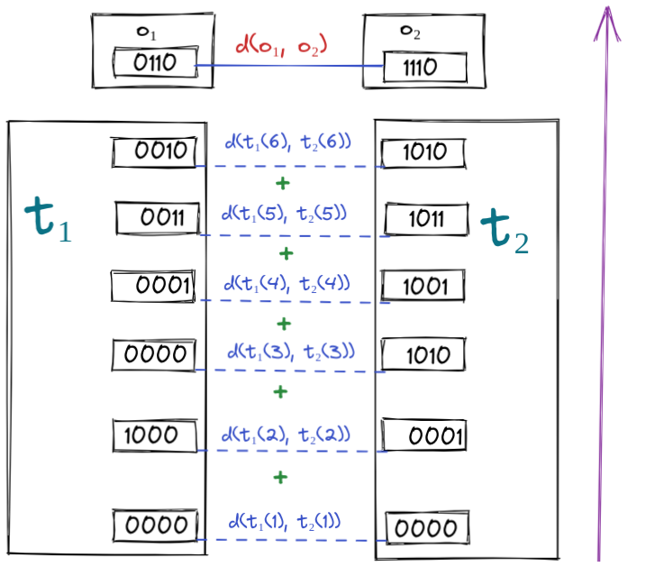

[home](./index.md)
------------------

*author: niplav, created: 2024-04-22, modified: 2024-10-25, language: english, status: in progress, importance: 5, confidence: highly likely*

> __In which to compare how similarly programs compute their outputs,
[naïvely](#A_Nave_Formula) and [less naïvely](#A_Less_Nave_Formula).__

Logical Correlation
====================

Attention conservation notice: Premature formalization,
[ab-](https://en.wiktionary.org/wiki/ab-)[hoc mathematical
definition](https://www.lesswrong.com/posts/GhFoAxG49RXFzze5Y/what-s-so-bad-about-ad-hoc-mathematical-definitions).

In the [twin prisoners
dilemma](https://www.lesswrong.com/tag/psychological-twin-prisoner-s-dilemma),
I cooperate with my twin because we're implementing the same algorithm. If
we modify the twin slightly, for example to have a slightly longer right
index-finger-nail, I would still cooperate, even though we're different
algorithms, since little enough has been changed about our algorithms
that the internal states and the output are basically the same.

It could be that I'm in a prisoner's dilemma with some program
`$p^{\star}$` that, given some inputs, returns the same outputs as I do,
but for completely different "reasons"—that is, the internal states
are very different, and a slight change in input would cause the output
to be radically different. Intuitively, my similarity to `$p^{\star}$`
is pretty small, because even though it gives the same output, it gives
that output for very different reasons, so I don't have much control
over its outputs by controlling my own computations.

Let's call this similarity of two algorithms the
__logical correlation__ between the two algorithms ([alternative
terms](https://forum.effectivealtruism.org/posts/JGazpLa3Gvvter4JW/cooperating-with-aliens-and-agis-an-ecl-explainer#fnref5yum06b0ld8)
"include “logical influence,” “logical
correlation,” “correlation,” “quasi-causation,”
“metacausation,” […] “entanglement”[,] “acausal
influence”"). I take this term from [Demski & Garrabrant
2020](./cs/ai/alignment/agent_foundations/embedded_agency_demski_garrabrant_2020.pdf):

> One idea is that exact copies should be treated as 100% under
your “logical control”. For approximate models of you, or merely
similar agents, control should drop off sharply as logical correlation
decreases. But how does this work?

*—Abram Demski & Scott Garrabrant, [“Embedded Agency”](./cs/ai/alignment/agent_foundations/embedded_agency_demski_garrabrant_2020.pdf) p. 12, 2020*

Similarly:

> The reasoning behind cooperation does not involve a common cause of
all collaborators' decisions. Instead, the correlation may be viewed
as logical (Garrabrant et al., 2016): if I cooperate, then this implies
that all other implementations of my decision algorithm also cooperate.

*—Caspar Oesterheld, “Multiverse-wide Cooperation via Correlated Decision Making” p. 18, 2018*

There isn't yet an established way of estimating the logical correlation
between different decision algorithms.

A Naïve Formula
----------------

Thus: Consider the some naïve formula (which we'll designate by
`$合$`[^2]) for logical correlation[^1]: Something that takes in two
programs and returns a number that quantifies how similarly the two
programs compute what they compute.

### Setup

Let a program `$p$` be a tuple of code for a [Turing
machine](https://en.wikipedia.org/wiki/Turing_Machine) and intermediate
tape states after each command execution. We'll treat the final tape
state as the output, all in binary.

That is `$p=(c, t)$`, with `$c \in \{0, 1\}^+$` and `$t \in (\{0,
1\}^+)^+$`. Let `$l=|t|$` be the number of steps that `$p$` takes to halt.

For simplicity's sake, let's give `$t_l$` (the tape state upon halting)
the name `$o$`, the output.

### Possible Desiderata

1. If possible, we would want our formula for logical correlation to be a [metric](https://en.wikipedia.org/wiki/Metric_space) or a [pseudometric](https://en.wikipedia.org/wiki/Pseudometric_space) on the space of programs:
	1. `$合(p, p)=0$`.
	2. [Symmetry](https://en.wikipedia.org/wiki/Symmetric_function): `$合(p_1, p_2)=合(p_2, p_1)$`.
	3. If `$p_1 \not=p_2$`, then `$合(p_1, p_2)>0$`. This condition is dropped if we're fine with `$合$` being a pseudometric.
	4. The [triangle inequality](https://en.wikipedia.org/wiki/Triangle_Inequality): `$合(p_1, p_3) \le 合(p_1, p_2)+合(p_2, p_3)$`.
2. If `$p_1$` and `$p_2$` have very similar outputs, and `$p_3$` has a very different output, then `$合(p_1, p_2)<合(p_1, p_3)$` (and `$合(p_1, p_2)<合(p_2, p_3)$`).
	1. I'm not *so sure* about this one: Let's say there's `$p$`, which outputs a binary string `$o \in \{0, 1\}$`, and `$p^{\not \sim}$`, which computes `$o$` in a completely different way, as well as `$p^{\lnot}$`, which first runs `$p$`, and then flips every bit on the tape, finally returning the negation of `$o$`. In this case, it seems that if `$p$` is a decision algorithm, it has far more "control" over the output of `$p^{\lnot}$` than over `$p^{\not \sim}$`.
	2. For the time being, I'm going to accept this, though ideally there'd be some way of handling the tradeoff between "computed the same output in a different way" and "computed a different output in a similar way".

### Formal Definition

Let `$p_1=(c_1, t_1), p_2=(c_2, t_2)$` be two halting programs,
`$l_1, l_2$` are the number of steps it takes `$p_1, p_2$` to halt,
and `$o_1=t_{l_1}, o_2=t_{l_2}$` the last tape states (outputs) of the
two programs.

Then a formula for the logical correlation `$合$` of `$p_1, p_2$`,
a tape-state discount factor `$γ$`[^3], and a [string-distance
metric](https://en.wikipedia.org/wiki/String_similarity_metric) `$d:
\{0, 1\}^+ \times \{0, 1\}^+ \rightarrow ℕ$` could be

        $$合(p_1, p_2, γ)=d(o_1, o_2)+0.5-\frac{1}{2+\sum_{k=1}^{\min(l_1, l_2)} γ^k \cdot d(t_1(l_1-k), t_2(l_2-k))}$$

The lower `$合$`, the higher the logical correlation between `$p_1$`
and `$p_2$`.

#### Explanation

Let's take a look at the equation again, but this time with some color
highlighting:

        $$合(p_1, p_2, γ)=\color{red}{d(o_1, o_2)}+0.5\color{orange}{-}\frac{1}{2+\color{green}{\sum_{k=1}^{\min(l_1, l_2)}} \color{purple}{γ^k \cdot} \color{blue}{d(t_1(l_1-k), t_2(l_2-k))}}$$

The fundamental idea is that we first compute
the distance of the two outputs. We then go *backward* through
the trace of the two programs, adding up the
pairwise  differences of the traces at
each timestep, potentially discounting
the differences the farther they lie in in the "past" of the
output/further towards the start of the computation.

Finally, we *subtract* the inverse of
this (discounted) sum of trace differences from the output difference[^4].

The fraction can maximally be ½ (since we're
adding a number greater than zero to two in the [lower
number](./mathematics_notation_convention.html#Basics)). Thus, since
we're subtracting a number ≤½ from `$d(o_1, o_2)+0.5$`, the resulting
logical correlation must be `$d(o_1, o_2)≤合(p_1, p_2, γ)≤d(o_1,
o_2)+0.5$`. That implies that for three programs with the same output,
their logical correlations all lie in that range. That also means that
if `$d(o_1, o_2)<d(o_1, o_3)$`, then it's the case that `$合(p_1, p_2,
γ)<合(p_1, p_3, γ)$`.

Or, in even simpler terms; "Output similarity dominates trace similarity."

#### Different Trace Lengths

One might also want to be able to deal with the fact that programs have
different trace lengths, and penalize that, e.g. amending the formula:

        $$合'(p_1, p_2, γ)=合(p_1, p_2, γ)+2^{|l_1-l_2|}$$

### Desiderata Fulfilled?

Does this fulfill our desiderata from earlier? I'll assume that the
string distance `$d$` is a metric, in the mathematical sense.

#### Proving `$合(p, p)=0$`

Proof:

	$$d(o, o)+0.5-\frac{1}{2+\sum_{k=1}^{\min(l, l)} γ^k \cdot d(t(l-k), t(l-k))}= \\
	0+0.5+\frac{1}{2+\sum_{k=1}^l y^k \cdot 0}= \\
	0.5+\frac{1}{2+0}= \\
	0$$

Since `$d$` is a metric, `$d(o, o)=0$`.

#### Proving Positivity

The minimal logical correlation is 0.

	$$合(p_1, p_2, γ)≥0 \Leftrightarrow \\
	d(o_1, o_2)+0.5-\frac{1}{2+\sum_{k=1}^{\min(l_1, l_2)} γ^k \cdot d(t_1(l_1-k), t_2(l_2-k))}≥0 \Leftrightarrow \\
	d(o_1, o_2)+0.5 ≥\frac{1}{2+\sum_{k=1}^{\min(l_1, l_2)} γ^k \cdot d(t_1(l_1-k), t_2(l_2-k))} \Leftrightarrow \\
	2 \cdot d(o_1, o_2)+1+d(o_1, o_2) \cdot \sum_{k=1}^{\min(l_1, l_2)} γ^k \cdot d(t_1(l_1-k), t_2(l_2-k))+0.5 \cdot \sum_{k=1}^{\min(l_1, l_2)} γ^k \cdot d(t_1(l_1-k), t_2(l_2-k))≥1 \Leftrightarrow \\
	2 \cdot d(o_1, o_2)+1+(d(o_1, o_2)+0.5) \cdot \sum_{k=1}^{\min(l_1, l_2)} γ^k \cdot d(t_1(l_1-k), t_2(l_2-k)))≥1 \Leftrightarrow \\
	2 \cdot d(o_1, o_2)+(d(o_1, o_2)+0.5) \cdot \sum_{k=1}^{\min(l_1, l_2)} γ^k \cdot d(t_1(l_1-k), t_2(l_2-k)))≥0 $$

This is true, because:

1. `$d(o_1, o_2)≥0$`.
2. `$d(t_1(l_1-k), t_2(l_2-k))≥0$` for every `$k$`.
3. `$γ^k≥0$` for every `$k$`.

Thus we have a sum of products of only positive things, which is in turn
positive itself.

<!--
### Implementation

TODO: implement in Rust using Brainfuck-->

A Less Naïve Formula
---------------------

I think that [the naïve formula](#Some_Nave_Formula) is *too* naïve.
Reasons:

1. If you have a program `$p$` and a program `$p^-$` which is just `$p$` but with the tape reversed (so that whenever `$p$` makes a step left, `$p^-$` makes a step right, and same with right steps for `$p$`). Intuitively `$p$` and `$p^-$` should have a very high logical correlation, but `$合$` would tell us that they very much don't.
2. `$合$` doesn't *really* make a statement about which states of the program influence which other states, it just compares them.
3 I'm a bit unhappy that the code doesn't factor into `$合$`, and ideally one would want to be able to compute the logical correlation without having to run the program.

I think one can create a better (though not perfect)
way of determining logical correlations based on [Shapley
Values](https://en.wikipedia.org/wiki/Shapley_value) and possible
tape-permutations.

See Also
---------

* How does this relate to [data=code](https://wiki.c2.com/?DataAndCodeAreTheSameThing)?
* [Writing Causal Models Like We Write Programs (johnswentworth, 2020)](https://www.lesswrong.com/posts/Xd9FLs4geRAWxkQPE/writing-causal-models-like-we-write-programs)

<!--TODO: check with brainfuck-->
<!--TODO: prove or disprove that this is a metric (or maybe a
pseudometric?—seems like there could the different programs with the
exactly same tape states…)-->

[^1]: Actually not explained in detail anywhere, as far as I can tell.
[^2]: Suggested by GPT-4. Stands for [joining, combining, uniting](https://en.wiktionary.org/wiki/%E5%90%88#Definitions). Also "to suit; to fit", "to have sexual intercourse", "to fight, to have a confrontation with", or "to be equivalent to, to add up". Maybe I could've used one of the [ghost characters](https://en.wikipedia.org/wiki/Ghost_characters).
[^3]: Which is needed because tape states close to the output are more important than tape states early on.
[^4]: Together with two constants to avoid division by zero or same logical correlations for programs with different outputs differences.
