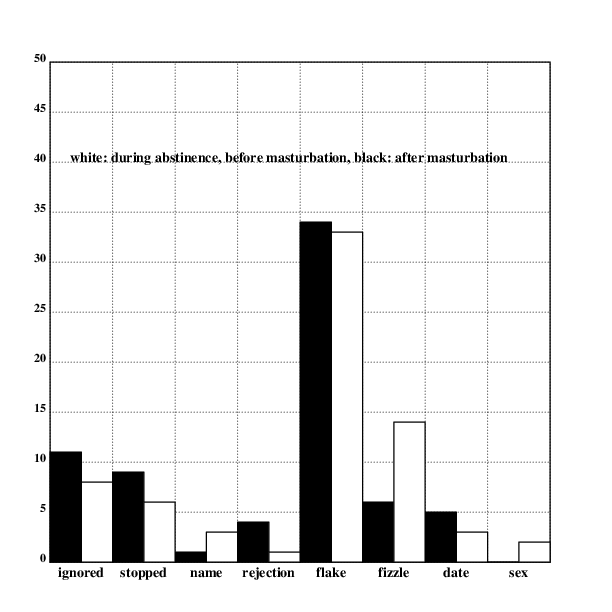
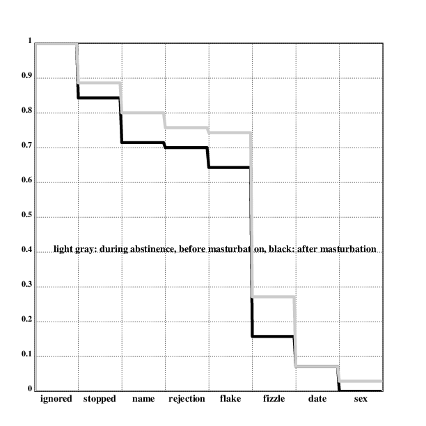

[home](./index.md)
------------------

*author: niplav, created: 2019-08-03, modified: 2024-07-21, language: english, status: draft, importance: 2, confidence: likely*

> __Members of the [NoFap community](https://en.wikipedia.org/wiki/NoFap)
[frequently claim](#Examples_for_the_Claim) that abstinence from
masturbation causally increases male attractiveness.__  
> __I present a method to test this claim (albeit imperfectly) by
approaching 50 women in the street after >90 days of abstinence
from masturbation and after a short conversation asking them for
their contact information, and 50 again after a week of daily
masturbation. The results are analyzed using a [Mann-Whitney
U-test](https://en.wikipedia.org/wiki/Mann-Whitney_U_test)
and various [descriptive statistical
methods](https://en.wikipedia.org/wiki/Descriptive_statistics); I
find that \_.__

Abstinence from Masturbation and Success from Cold Approach
===========================================================

> interesting things happen along borders—transitions—not in
the middle where everything is the same

*— [Neal Stephenson](https://en.wikipedia.org/wiki/Neal_Stephenson), [“Snow Crash”](https://en.wikipedia.org/wiki/Snow_Crash), 1992*

Consider a question of burning importance: If a man abstains from
masturbation for a long time, does other people's perception of him
change as a result, even if they don't know he doesn't abstain? *More
poignantly*, does he become more attractive to women, through some
not-yet-understood process of microexpressions, pheromones, more confident
gait &c?

To prevent the accusation of
[straw-manning](https://en.wikipedia.org/wiki/Straw_man) the views
of the NoFap community, I've collected comments that broadly make
the claim that "male abstinence from masturbation results in higher
attractiveness, even with fixed behavior". They can be found in [Appendix
C](#Appendix_C_Examples_for_the_Claim).

A broad picture emerges: NoFap advocates claim that long-term abstinence
from masturbation has noticeable effects on male attractiveness as
perceived by women, this effect emerges at around 40 days or more of
abstinence (and doesn't diminish with the time since the last masturbation
increasing further), it also has an effect on other men, though this is
not really elaborated further. The effects are noticeable.

The reasons given for this increase in attractiveness are as follows:

* [Microexpressions](https://en.wikipedia.org/wiki/Microexpression)
* [Pheromones](https://en.wikipedia.org/wiki/Pheromone)
* [Placebo effect](https://en.wikipedia.org/wiki/Placebo)
* Higher effort in searching partners

Two of these reasons are independent from the attitude of a person
towards NoFap (pheromones and microexpressions), while the others are
dependent on being a NoFap enthusiast.

Given these claims, it should be possible to at least somewhat check
the claims made by members of the NoFap community.

 “Nice Hypothesis you have there. Would be a shame if someone were to test it”")

(Taken from [Scott Alexander
(2013)](https://slatestarcodex.com/2013/10/20/the-anti-reactionary-faq/ "The Anti-Reactionary FAQ"))

Method
------

Relevant information about me: I am a.m.a.b in my twenties living in
a european country. I seem to fall into the same demographic as most
members of the NoFap community.

To test the claims by the NoFap community, I performed a small
self-experiment.

Data was collected as follows:

I abstained from masturbating and watching pornography from
2023-07-30T17:34:00 to \_, resulting in >90 days of abstinence
from masturbation (which is also the period [recommended by the
NoFap community](https://nofap.com/rebooting/): "NoFap’s gold
standard of success is our 90-day reboot.").

From \_ to \_, I went on the streets of a major european city
and approached 50 people I read as women, usually via a [Yad
stop](https://thomascrownpua.com/2023/04/21/qa-what-do-you-think-of-the-yad-stop/).
The women who were approached were chosen by how attractive I found them.

I then ran a standard daygame opener on the woman, with the goal of
asking her for her number and later taking her on a date.

In the week following the last approach, I masturbated once every day
with the aid of pornography<!--TODO: link the pornography consumed during
that time-->.

Afterwards, I repeated the procedure of approaching 50 women in the
same manner from \_ to \_.

Data that was logged included date and time of day (in
[ISO-8601](https://en.wikipedia.org/wiki/ISO_8601)), whether the approach
was after abstinence from masturbation or after the one-week period
of masturbation (1 for the part after abstinence, and 0 for the part
after masturbation), and how far the interaction went, on an 8-point
[Likert scale](https://en.wikipedia.org/wiki/Likert_Scale):

* 1 (ignored): the woman walked past and did not react
* 2 (stopped): the woman stopped, but didn't answer any question (started laughing or walking away)
* 3 (name): the woman gave her name, but then started walking away
* 4 (rejection): the woman answered that they were in a relationship/had no interest
* 5 (flake): the woman gave me her contact information, but did not reply
* 6 (fizzle): the woman replied to one or several of my messages, but didn't agree on a date
* 7 (date): the woman showed up to the date
* 8 (sex): I slept with the woman

Results were logged in a [CSV](https://en.wikipedia.org/wiki/Comma-separated_values).

### Justification for Cold Approach as a Method

Cold approach works well as a method here: It
allows me to sample my attractiveness to women from an
[i.i.d.](https://en.wikipedia.org/wiki/Independent_and_identically_distributed)
distribution, basically arbitrarily often. The women don't *know*
I am doing an experiment, and the stakes are real, so there's little
incentive for them to lie about their preferences (as they might in a
survey), and little incentive for me to change my behavior (because I
like sleeping with beautiful women).

If the effect of abstaining from masturbation is subliminal and affects
smell or micro-expressions, approaching women on the street also beats
online dating as a metric of assessing attractiveness.

Results Analysis
-----------------

The raw data is available [here](./data/masturbation_attractiveness.csv).

### Visualizing the Results

Cold approach is a conversion funnel: there are a number of different
stages an approachee goes through, and each one can fail. This way, one
can visualize how far the interaction went by making a bar graph of the
people dropping out at a certain stage (ignoring the approach, stopping
but not giving a name, giving a name but not agreeing to come on a date,
agreeing to come on a date but flaking, and showing up to a date).
Showing up to the date was considered a condition of success, but one
could imagine further steps like having sex, getting into a relationship
with the person, getting married with the person and having children with
the person, though these were deemed excessive and out of the scope of
a simple self-experiment.

The bargraph below shows how many people were lost at which stage
of the funnel, ignoring gender. The white bars show the numbers
during a period of abstinence from masturbation, after 90 days
of abstinence, the black bars show the numbers after a period of
weekly masturbation.

Code:

	.l("nplot")
	.l("./load.kg")

	cgrid(["ignored" "stopped" "name" "rejection" "flake" "fizzle" "date" "sex"];[0 50 5])

	text(20;400;"white: during abstinence, before masturbation, black: after masturbation")

	fillrgb(0;0;0)
	{bar(2*x;after.stag@x;16)}'!8
	fillrgb(1;1;1)
	{bar(1+2*x;during.stag@x;16)}'!8

	draw()

Another possible method could be to visualize cumulative survival
rates for the different stages by percentage by showing a [Kaplan-Meier
plot](https://en.wikipedia.org/wiki/Kaplan%E2%80%93Meier_estimator). The
overall graph for this would look like this:

	.l("nplot")
	.l("./load.kg")

	cgrid(["ignored" "stopped" "name" "rejection" "flake" "fizzle" "date" "sex"];[0 1 0.1])

	text(27;200;"light gray: during abstinence, before masturbation, black: after masturbation")

	setwidth(4)

	setrgb(0;0;0)
	plot({during.cumperc@(_x)-1})

	setrgb(0.8;0.8;0.8)
	plot({after.cumperc@(_x)-1})

	draw()

*Retention percentages for different stages, overall*

### Descriptive Results

Before testing the hypotheses, one can compare the results using very
simple descriptive methods. For this purpose, I used the mean and the
standard deviation to compare the different parts of the dataset.

Here the table for the different mean values and their variances in
parentheses (the botttom right cell contains the overall mean value):

|           | during        | after      |      |
| --------- | ------------- | ---------- | ---- |
| mean      | μ\_during     | μ\_after   | μ    |
| median    | mdn\_during   | mdn\_after | mdn  |
| variance  | var\_during   | var\_after | var  |

As one can see, \_.

<!--
Questions:

* mu(during)≥mu(after)?
* var(during)≥var(after)?

* mu(duringf)≥mu(afterf)?
* var(duringf)≥var(afterf)?
-->

### Testing the Hypothesis

The NoFap community claims that abstinence from masturbation increases
male physical attractiveness for women. This means that cold approach
should be more successful after a long period of abstinence from
masturbation than after a period of sustained masturbation. This
assumption generates three hypotheses:

1. H₀: `$\mu_{\text{during}} \le \mu_{\text{after}}$`
2. H₁: `$\mu_{\text{during}} = \mu_{\text{after}}$`
3. H₂: `$\mu_{\text{during}} \ge \mu_{\text{after}}$`

The result implied by the views of the NoFap community would be that
H₀ would definitely be rejected, and that it would be very likely
that H₁ would also be rejected.

Note that these hypothesis are not exclusive, and can all be accepted at
the same time. It is merely the case that if a hypothesis gets rejected,
the probability that it got rejected although it is true is lower than
a given percentage (usually and also in this case 5%).

I used a [Mann-Whitney
U-Test](https://en.wikipedia.org/wiki/Mann-Whitney_U_Test) to
test the hypotheses, under the assumption that the observations
from each group are independent of each other. (I can't use e.g. a
[t-test](https://en.wikipedia.org/wiki/Student's_T-Test) because the
data is on a [Likert scale](https://en.wikipedia.org/wiki/Likert_Scale)).

	using DataFrames, CSV, HypothesisTests

	data=CSV.read("./data/masturbation_attractiveness.csv", DataFrame)

	before=filter(row->row["after"]==0, data)
	after=filter(row->row["after"]==1, data)
	MannWhitneyUTest(before[!, "progress"], after[!, "progress"])

As one can see, \_.

Problems
--------

My experimental setup is not perfect.

### No Objective Decision Process for Approaching

One possible criticism of the above experiment could be that no
clear method of establishing of whom to approach was used. This
is a fair criticism, since attractiveness is a subjective
evaluation criterion. However, one must also consider that
subjective judgements of attractiveness correlate strongly
both within cultures as well as cross-culturally (see [Coetzee et al.
2013](./doc/psychology/attractiveness/cross_cultural_agreement_in_facial_attractiveness_preferences_coetzee_2014.pdf "Cross-Cultural Agreement in Facial Attractiveness Preferences: The Role of Ethnicity and Gender")).

Another possible method would have been to approach people completely
randomly, which would have reduced bias significantly. However, it
would also have made the result less useful, since it seems like people
who practice NoFap care about their attractiveness to a very certain
demographic (namely, conventionally attractive women from their late teens
to early thirties).

On the other hand, it might have been interesting to observe how older
people would react to cold approach.

Yet another method could be to put the decision of approaching to second
person who doesn't know about the duration since the last masturbation.
This person and the person approaching would meet twice, at least 90
days apart, and the decider would choose who would be approached by
the experimenter. For me, this didn't work, since proposing this to any
acquantainces would have been not socially acceptable.

Another possible bias in choosing whom to approach could be that
abstinence from masturbation changes the perception of attractiveness. In
fact, many members of the NoFap community claim that women who are of
average attractiveness for men who masturbate become more attractive
for men who abstain from masturbation. This could lead to the average
attractiveness of the women I approached during the period of abstinence
being lower than the attractiveness of the women after masturbation. If
the attractiveness of the approached person has an effect on their
response to cold approach, this could introduce a bias (although it
isn't clear in which way that bias would go).

### N=1 on the Approachers Side

Since I was the only person to do the approaching, the data is
highly specific to me. It could be that I have an unusualy judgment
of attractiveness, or that my body doesn't respond to abstinence from
masturbation as the bodies of other men. All fair and well, this reduces
the strength of the findings of this text to a personal observation,
though indicating the direction of a trend.

It would have been better, of course, if there were more people
approaching in this experiment. Since the topic is too weird to share
among friends & none of them would be interested in the answer / willing
to give up masturbation or sex for a little self-experiment, I was alone
with my endeavour. However, I encourage others to attempt replication
– the code is available for all, and I could also analyze data if it
was sent to me.

### Typical WEIRDness

[WEIRD](https://en.wikipedia.org/wiki/Psychology#WEIRD_bias) usually
refers to "Western, educated, industrialized, rich, democratic"—the
demographic of the average study performed with college students. In
the context of this experiment, all five of these factors apply to
the experimenter (myself), but it is much less clear how many of
these characteristics can be found in the people approached. Due
to [homophily](https://en.wikipedia.org/wiki/Homophily) <!--TODO:
is https://en.wikipedia.org/wiki/Assortative_mating better?-->, it
seems likey that they will be strong, but a priori, only western and
industrialized necessarily apply – the experiment was performed in
western europe.

### Different Settings, Clothing & Weather

A possible objection could be that the clothes I wore might have been
different in the approaching periods during & after the abstinence from
masturbation. To counter such effects, I wore the same clothes in the two
approaching periods (washing them in between, of course). If I had changed
my clothes from one day to the other, I tried changing my clothes the same
way in the second approaching period (for a similar number of approaches).

Influences from weather were harder to control. During the first
approaching session the weather was \_. During the second approaching
session the weather was \_.

### Strawman of the Views of the NoFap Community

Some people might claim that the view "masturbation increases physical
attractiveness" is a straw-man of the views of the larger NoFap
community. I believe that I have provided ample evidence in [Appendix
C](#Appendix_C_Examples_for_the_Claim) that the NoFap community contains
at least a very vocal subset of people who have this view who are not
actively opposed by the rest of the community.

### No Differentiation Between Pornography & Masturbation

The NoFap community is not entirely clear on whether the negative
effects it claims arise from pornography consumption or masturbation in
itself. The two ideas seem to be considered as basically the same thing
most of the time, although it doesn't seem necessary (one could watch
pornography without masturbating, or masturbate without pornography
(using ones imagination instead)). It might be useful to have different
experiments that examine whether abstinence from pornography specifically
influence attractiveness, or only abstinence from masturbation, but
with pornography. While it would certainly interesting to perform these
experiments, I didn't do them for several reasons:

*	I didn't have the necessary statistical knowledge to perform an
	analysis of the data that wouldn't look like p-hacking
* 	It would have taken at least three ninety-day periods with
	subsequent approaching sessions to test these hypotheses:
	Ninety days of abstinence from both masturbation & pornography,
	then approaches, then 90 days abstinence from pornography,
	but not masturbation, then approaches, then 90 days abstinence
	from masturbation, but not pornography, then approaches, then
	masturbation & pornography for 7 days, then approaches.
*	The marginal value of the validity of these hypotheses would have
	been very low, since I assigned a very low credence to the validity
	of the central claim altogether.

### Learning Effect During First 50 Half

Conclusion
----------

This experiment shows that \_. So we can conclude that \_.

Appendix A: Preregistration
---------------------------

To avoid p-hacking and other practices, the bulk of this text was written
before the actual experiment and data analysis was conducted, and posted
on the subreddit [/r/niplav](https://old.reddit.com/r/niplav), with the
[SHA256 hashsum](https://en.wikipedia.org/wiki/SHA-2) of the text as the
title. The SHA256 sum of the content was put into the title to prevent
tampering with the content of the article, because reddit titles [can't be
changed](https://old.reddit.com/wiki/faq#wiki_i_made_a_mistake_in_my_submission_title.2C_how_can_i_edit_it.3F)
by users of reddit.

The raw markdown, pre-registered version of this article can be found
[here](https://niplav.github.io/masturbation_and_attractiveness_preregistered.txt).

Its hashsum was computed as such:

	$ sha256sum masturbation_and_attractiveness_preregistered.txt

<!--TODO: add link to reddit post-->

### Hypotheses

The pre-registered hypotheses shall thus be: Let `$\mu_{\text{during}}$`
be the expected value of cold approach with women during a long
period of abstinence from masturbation as described in the section
[Method](#Method), and `$\mu_{\text{after}}$` be the expected value of cold
approach with women after a week of regular masturbation. Then there
are three different hypotheses:

1. H₀: `$\mu_{\text{during}} \le \mu_{\text{after}}$`
2. H₁: `$\mu_{\text{during}} = \mu_{\text{after}}$`
3. H₂: `$\mu_{\text{during}} \ge \mu_{\text{after}}$`

There seem to be different possible strengths of convictions on this issue:

1. I define the *Strong NoFap Stance* as predicting that H₀ and H₁ will be rejected, and only H₂ will be accepted.
2. I define the *Weak NoFap Stance* as predicting that H₀ will be rejected, and H₁ and H₂ will be accepted.
3. I define the *Neutral Stance* as predicting that all 3 hypotheses will be accepted.

As a pre-registration, I subjectively assign a probability of 60% to the
*Neutral Stance* being correct, a probability of 17% to the *Weak NoFap
Stance* being correct, a 8% probability to the *Strong NoFap Stance*,
and 15% to any other result.<!--TODO: fatebook!-->

### Reasoning

If it were true that abstinence from masturbation increased
attractiveness to the opposite sex, evolutionary pressure would have
selected men who abstain from masturbating, since they generate
a higher number of offspring. This would be true regardless
of the specific way in which abstinence from masturbation
increases fitness, be it pheromones, microexpressions or any
other reason. Indeed, one could suppose that masturbation is
reproductively beneficial, since it has apparently been selected
for by natural and/or sexual selection. "Major mechanisms that do not
contribute to fitness do not survive in evolutionary equilibrium." ([Ng
1995](./doc/biology/welfare/towards_welfare_biology_evolutionary_economics_of_animal_consciousness_and_suffering_ng_1995.pdf "Towards Welfare Biology: Evolutionary Economics of Animal Consciousness and Suffering")
p. 9).

This reasoning is imperfect, because it may very well be that masturbation
is an adaption that was useful in environments with low numbers of people,
but is not very adaptive in industrialized, anonymous and big societies
where not reproduction, but sex is the most important consideration. For
example, it could be true that masturbation keeps the sperm count high,
but has negative side-effects on attractiveness (such as dry skin).

Appendix B: Dummy Data
----------------------

In order to be able to write most of this article before collecting
data (in order to facilitate pre-registration), I needed some dummy
data to test my code and figures against. I decided to generate the
data programatically, since that would make testing and experimenting
much easier. I used the following code to generate the dummy data:

	probes::50

	dur::[0.1 0.2 0.25 0.3 0.75 0.9 0.98]
	aft::[0.1 0.2 0.25 0.3 0.75 0.9 0.98]

	d::({:[
	        x<dur@0;"2019-09-17T15:17:10+02:00,1,1":|
	        x<dur@1;"2019-09-17T15:17:10+02:00,1,2":|
	        x<dur@2;"2019-09-17T15:17:10+02:00,1,3":|
	        x<dur@3;"2019-09-17T15:17:10+02:00,1,4":|
	        x<dur@4;"2019-09-17T15:17:10+02:00,1,5":|
	        x<dur@5;"2019-09-17T15:17:10+02:00,1,6":|
	        x<dur@6;"2019-09-17T15:17:10+02:00,1,7";
	        "2019-09-17T15:17:10+02:00,1,8"]}'probes{x,.rn()}:*[]),({:[
	        x<aft@0;"2019-09-17T15:17:10+02:00,0,1":|
	        x<aft@1;"2019-09-17T15:17:10+02:00,0,2":|
	        x<aft@2;"2019-09-17T15:17:10+02:00,0,3":|
	        x<aft@3;"2019-09-17T15:17:10+02:00,0,4":|
	        x<aft@4;"2019-09-17T15:17:10+02:00,0,5":|
	        x<aft@5;"2019-09-17T15:17:10+02:00,0,6":|
	        x<aft@6;"2019-09-17T15:17:10+02:00,0,7";
	        "2019-09-17T15:17:10+02:00,0,8"]}'probes{x,.rn()}:*[])

	.p({x,"
	",y}/d)

`probes` is the number of samples generated for each scenario (50 each
for men & for women, each for during & after abstinence). `fdur`, `mdur`,
`faft` and `maft` give the probability of progressing after a certain
probability in the funnel. `d` is then filled with `probes` datapoints
for each scenario (in CSV). In the end, `d` is concatenated with newlines.

The date and time in the dummy data is, for simplicity, always the same.
Since I don't perform any analysis on it, that should be fine.

### Testing the Sensitivity

To test whether my code was correct, I first checked the hypothesis with
the dummy data with the probabilities in the code above (where abstinence
from masturbation has no effect at all):

The data can be found
[here](./data/masturbation_attractiveness_dummy_even.csv). I find that
this data fails to reject H₀:

	julia> MannWhitneyUTest(before[!, "progress"], after[!, "progress"])
	Approximate Mann-Whitney U test
	-------------------------------
	Population details:
	    parameter of interest:   Location parameter (pseudomedian)
	    value under h_0:         0
	    point estimate:          0.0

	Test summary:
	    outcome with 95% confidence: fail to reject h_0
	    two-sided p-value:           0.2680

	Details:
	    number of observations in each group: [50, 50]
	    Mann-Whitney-U statistic:             4571.5
	    rank sums:                            [9621.5, 10478.5]
	    adjustment for ties:                  868776.0
	    normal approximation (μ, σ):          (-428.5, 386.406)

I then first changed the probabilities in the dummy data generation
script slightly (reducing the probability of failure in each step by
only a few percentage points):

	dur::[0.1 0.2 0.25 0.3 0.75 0.9 0.98]
	aft::[0.15 0.3 0.35 0.4 0.8 0.93 0.99]

I then generated the dummy data:

	$ kg ./code/masturbation_and_attractiveness/gen_dummy.kg >>data/masturbation_attractiveness_dummy_better.csv

and tested the hypothesis again:

	julia> MannWhitneyUTest(before[!, "progress"], after[!, "progress"])
	Approximate Mann-Whitney U test
	-------------------------------
	Population details:
	    parameter of interest:   Location parameter (pseudomedian)
	    value under h_0:         0
	    point estimate:          0.0

	Test summary:
	    outcome with 95% confidence: reject h_0
	    two-sided p-value:           0.0184

	Details:
	    number of observations in each group: [50, 50]
	    Mann-Whitney-U statistic:             4070.5
	    rank sums:                            [9120.5, 10979.5]
	    adjustment for ties:                  585144.0
	    normal approximation (μ, σ):          (-929.5, 394.016)

As one can see, this already leads to H₀ being rejected.

The data can be found
[here](./data/masturbation_attractiveness_dummy_better.csv).

Appendix C: Examples for the Claim
-----------------------------------

The comments below were found by searching the
[/r/NoFap](https://old.reddit.com/r/NoFap/) subreddit on reddit (one
of the biggest NoFap communities on the internet) for the keywords
"attractiveness" and "attractive" and collecting comments and posts from
NoFap members that claim the practice had a positive influence on their
attractiveness. Because the comments were hand-picked (with regard to
the number upvotes), I tried including critical views or negative reports
when they arose in the comment threads to present an even-handed picture
of the views of the community.

Of course, a survey would have been more informative.

> Yesterday i was at a party and im currently on 12 days nofap. Normally
this really never happens but a girl wanted to Kiss me. I think it was
because of nofap.

*— [marijn420_gotu](https://old.reddit.com/user/marijn420_gotu), [“Nofap really makes you more attractive”](https://old.reddit.com/r/NoFap/comments/bluepi/nofap_really_makes_you_more_attractive/) on [/r/NoFap](https://old.reddit.com/r/NoFap) (27 upvotes), 2019*

Another user recounts a similar story:

> I’m minding my own business in the laundromat, keeping to myself, this
girl walks up to me and asks me if I can drop her off to her house, that
she lives 2 minutes away. I look at her and ask her what made her come up
to a complete stranger and ask such a thing, she says she doesn’t know,
we have a little laugh. I drop her off, help her unload her laundry,
and as I’m almost driving off she asks me if I need to head back,
which I did, my laundry had 10 minutes left in the wash. I realized as I
driving away that this stranger was literally inviting me in her house to
get smashed, but I was genuinely trying to her [sic], I had no ulterior
motives, and I wasn’t even that attracted to her. They literally smell
it on you. I’m also 119 days hard mode. This shit is crazy.

*— [TheMasterKey20](https://old.reddit.com/user/TheMasterKey20), [“They smell it on you.”](https://old.reddit.com/r/NoFap/comments/bzj8ra/they_smell_it_on_you/) [/r/NoFap](https://old.reddit.com/r/NoFap) (237 upvotes), 2019*

Note that the poster does not mention any specific action on his side.

A [commenter](https://old.reddit.com/user/AustinReckless)
[suspects](https://old.reddit.com/r/NoFap/comments/bzj8ra/they_smell_it_on_you/eqt5bsv/):
"Must be able to smell the pheromones." (23
upvotes). Another user [makes a similar
claim](https://old.reddit.com/r/NoFap/comments/bzj8ra/they_smell_it_on_you/eqti6xg/).

There are also strong claims on a direct relation between masturbation and attractiveness:

> I was on a 10 day streak before I took a week off from work. When
returning people were saying "I look tired" (I Fapped 5 times in the 2
days before returning to work). And the chick that I work with that is
normally all walkative and flirty with me was not so much and seemed to
act like I wasn't even there LOL. […] On a 20 day streak one time I had
one after another woman looking at me. I recall one was a receptionist at
an office building and when I went in and walked up to her coworker she
was just gazing at me almost that bite your lip look, and honestly looked
like she was getting wet. […] It's almost comical how woman treat me
when on a streak, and when off one. It's night and day different. […]
off a streak or over ejaculation several times in a day, it seems woman
look past me and don't ever look at me. I know it has something to do
with the pheromones you emit when not spilling your seed needlessly all
the time […].

*— [cee9](https://old.reddit.com/user/cee9), [“Fapping ruins your attractiveness.”](https://old.reddit.com/r/NoFap/comments/3mt0nu/fapping_ruins_your_attractiveness/) (95 upvotes), 2015*

Note that all typos and grammatical mistakes could be affixed with "[sic]"
(the comment was copy-pasted).

This user claims there is a noticeable difference between the behavior
of women in regard to abstinence from masturbation, and attributes this
difference to "pheromones".

Another user claims this ["difference in how people (both men and women)
respond"](https://old.reddit.com/r/NoFap/comments/3mt0nu/fapping_ruins_your_attractiveness/cvhvbdc/)
is visible in both genders.

Another commenter
[agrees](https://old.reddit.com/r/NoFap/comments/3mt0nu/fapping_ruins_your_attractiveness/cvhyqwb/),
but a response is critical:

> I lost my nearly 28 day streak last night. Didn't notice a difference
apart from thinking more aggressive at times and thinking average women
were hot\wanting to bang them.  
>Nobody ever approached me or started convos.  
>Will try longer this time.

*— [enrodude](https://old.reddit.com/user/enrodude), [comment](https://old.reddit.com/r/NoFap/comments/3mt0nu/fapping_ruins_your_attractiveness/cvhzmd1/) on [“Fapping ruins your attractiveness.”](https://old.reddit.com/r/NoFap/comments/3mt0nu/fapping_ruins_your_attractiveness/) on [/r/NoFap](https://old.reddit.com/r/NoFap/) (6 upvotes), 2015*

Other users try to console him.

Since the claims are quite repetitve, I will now just list them and write
down important key words from the claim (especially the time it takes for
the effect to take place, the effect itself and the given explanation).

> Sorry to all the doubters or people that it hasn't worked for. But
this is my fourth time getting to 40+ days. And EVERY DAMN TIME I get
to this point girls start hitting on me.
> Some people say it's placebo. But to that I say (even if that is the
case) well then it still works.
> Whether it's psychological or physiological is irrelevant.

*— [topdizzel](https://old.reddit.com/user/topdizzel), [“I'm sorry, but no fap just fucking works”](https://old.reddit.com/r/NoFap/comments/9treo6/im_sorry_but_no_fap_just_fucking_works/) on [/r/NoFap](https://old.reddit.com/r/NoFap) (606 upvotes), 2018*

Effect takes place after 40 days, women started hitting on him, reason:
possibly placebo.

A commenter agrees:

> I will vouch for this. I'm on 84 days (nearly 90!) And I keep getting
hit on.

*— [a_jedi_in_bed](https://old.reddit.com/user/a_jedi_in_bed), [comment](https://old.reddit.com/r/NoFap/comments/9treo6/im_sorry_but_no_fap_just_fucking_works/e8yos6k/) on [“I'm sorry, but no fap just fucking works”](https://old.reddit.com/r/NoFap/comments/9treo6/im_sorry_but_no_fap_just_fucking_works/) on [/r/NoFap](https://old.reddit.com/r/NoFap) (123 upvotes), 2018*

Effect takes place after at least 84 days, women start hitting on him.

> Haha I'd wish that'd happen to me. I've never been able to attract
women, but that's just how it is. […]

*— [meditate03](https://old.reddit.com/user/meditate03), [comment](https://old.reddit.com/r/NoFap/comments/9treo6/im_sorry_but_no_fap_just_fucking_works/e8yo7xd/) on [“I'm sorry, but no fap just fucking works”](https://old.reddit.com/r/NoFap/comments/9treo6/im_sorry_but_no_fap_just_fucking_works/) on [/r/NoFap](https://old.reddit.com/r/NoFap) (126 upvotes), 2018*

This commenter disagrees.

> I like to say they can 'smell the no fap' when really you're just being
your true self, they can see you carry yourself in high regard and that
shit is like crack for them.

*— [NZbakedbanana](https://old.reddit.com/user/NZbakedbanana), [comment](https://old.reddit.com/r/NoFap/comments/9treo6/im_sorry_but_no_fap_just_fucking_works/e8yr8p0/) on [“I'm sorry, but no fap just fucking works”](https://old.reddit.com/r/NoFap/comments/9treo6/im_sorry_but_no_fap_just_fucking_works/) on [/r/NoFap](https://old.reddit.com/r/NoFap) (126 upvotes), 2018*

This commenter attributes the higher attractiveness to higher
self-confidence.

> All men are trying to find ways to make themselves more attractive
to the females around them. It’s a constant battle to outmaneuver the
other guys around you.  
Luckily, most guys don’t know how NoFap can cause extreme levels
of attraction.  
Here’s how this works; while you were doing PMO, you were masking
your inner beauty. You were hiding your personality from all the girls
around you. Once you stop doing PMO, talking and bonding with other
people becomes much easier. Your outer look is only a reflection of your
inner thoughts.  
Girls have a sixth-sense about knowing how powerful a guy is. Power is
the thing that attracts girls the most. The more in control you are,
the more girls are going to be able to sense this. […]  
To sum up –<!--TODO: is this en dash really in the original comment?-->
NoFap is going to make you more attractive to the opposite sex […]

*— [debasish_patro0007](https://old.reddit.com/user/debasish_patro0007), [“Can NoFap Really Make You More Attractive?”](https://old.reddit.com/r/NoFap/comments/bl2ioe/can_nofap_really_make_you_more_attractive/) on [/r/NoFap](https://old.reddit.com/r/NoFap) (107 upvotes), 2019*

It seems like this redditor claims that micro-expressions are the cause
of higher attractiveness, though the "sixth sense" could refer to more
"spiritual" way of transmitting information.

A commenter specifically refers to micro-expressions:

> It doesn't make you "more attractive" in the physical sense, although it
might support that as a side effect but not directly.[…]  
> Here's the rundown on how it "makes men more attractive"; You constantly
transmit micro expressions. You are a walking transmitter whether you like
it or not. Women, they have a sharper decoder that men have, and they are
much better, subconsciously, decoding the codes you transmit.[…]  
> Fapping, essentially, other than a huge surge of dopamine that makes
you lazy and self destructive, is also a simulator for the mind that
you are getting laid. […] As long as you see naked women, hear
them do the thing, and have your peepee touched, your mind perceives it as
sex. […] So, when your mind is extremely satisfied (sex every day would be a fucking
luxury for a caveman), your mind stops "supporting" your sexuality and
the need to attract females. Your thoughts and desires become mundane,
you stop focusing on yourself, you care less about your physique and
looks, and you tend to communicate with females with a much softer
sexual aggression […]. […] when you are in a long Nofap period, your mind is being
rewired to suddenly care about your reproduction and gene survival, so
your communication becomes more aggressive, therefore attractive.
[…] your body language improves.[…]
> This works with nofap too. When you're deprived of sex, your mind will
help you make yourself attractive and will push you to desire sex.

*— [NorsemanLewis](https://old.reddit.com/user/NorsemanLewis), [comment](https://old.reddit.com/r/NoFap/comments/bl2ioe/can_nofap_really_make_you_more_attractive/emlb1zu/) on [“Can NoFap Really Make You More Attractive?”](https://old.reddit.com/r/NoFap/comments/bl2ioe/can_nofap_really_make_you_more_attractive/) on [/r/NoFap](https://old.reddit.com/r/NoFap) (145 upvotes), 2019*

They also talk about increased amounts of flirting in conversations,
higher sexual aggressiveness and higher motivation to find a partner,
which should at least partially be testable during cold approach.

They don't seem to consider the possibility that masturbation
is not a feature of modern civilisation, but rather a biological
instinct. Widespread pornography, on the other hand, is a feature of
modern civilisation.<!--TODO: sources for these claims-->

Another commenter refers to this baseless speculation as "science":

> A healthy dose of actual science on here. This post should be stickied
IMO. Everyone on here would benefit so much if they understood the
underlying mechanics of our natural biology and neuro chemistry. The
NoFap movement would never have kicked off like it did if there wasn't
actual science to back it up.

*— [cheezeebreed](https://old.reddit.com/user/cheezeebred), [comment](https://old.reddit.com/r/NoFap/comments/bl2ioe/can_nofap_really_make_you_more_attractive/emm4x5r/) on [“Can NoFap Really Make You More Attractive?”](https://old.reddit.com/r/NoFap/comments/bl2ioe/can_nofap_really_make_you_more_attractive/) on [/r/NoFap](https://old.reddit.com/r/NoFap) (4 upvotes), 2019*

A commenter claiming to be a scientist says:

> Well essentially due to the addiction. It causes lowered sensitivity
to neurotransmitters such as dopamine and serotonin this causes lowered
motivation, dry skin, depression and anxiety. As a result of quitting
porn ones sensitivity to neurotransmitters return and their neuropathways
start functioning correctly (hence no brain fog)

*— [ReAp_QS_Killzz](https://old.reddit.com/user/ReAp_QS_Killzz), [comment](https://old.reddit.com/r/NoFap/comments/bl2ioe/can_nofap_really_make_you_more_attractive/eml1sr9/) on [“Can NoFap Really Make You More Attractive?”](https://old.reddit.com/r/NoFap/comments/bl2ioe/can_nofap_really_make_you_more_attractive/) on [/r/NoFap](https://old.reddit.com/r/NoFap) (19 upvotes), 2019*

If this is true, then abstinence from masturbation should lead to increased
mental health, but except "clearer skin" there is no obvious way in
which this would increase attractiveness.

Another commenter
[claims](https://old.reddit.com/r/NoFap/comments/bl2ioe/can_nofap_really_make_you_more_attractive/emli3ml/)
that his "face has this droopy tired look" during periods of masturbation.

> Increased sexual interest from others. Many rebooters claim they
notice more signals of sexual attraction directed at them: more looks,
more smiles, more flirting. Many believe this to be a side-effect of
feeling more confident, while others theorize that rebooters simply
notice more signals than they did when they were obsessed with porn.

*— [NoFap.com](https://nofap.com/), [“Rebooting from Porn Addiction”](https://nofap.com/rebooting/), 2017*
