[home](./index.md)
------------------

*author: niplav, created: 2021-10-13, modified: 2025-09-05, language: multiple, status: in progress, importance: 1, confidence: other*

> __Very small pieces of fiction and things that are sufficiently like
fiction.__

Microfiction
=============

> Was ›sagt‹ denn eine Dichtung? Was teilt sie mit? Sehr wenig
demjenigen, der sie versteht.

*— [Walter Benjamin](https://en.wikipedia.org/wiki/Walter_Benjamin), “Die Aufgabe des Übersetzers”, 1923*

Poems
------

### English

* Eternal Hustle of the Stopless Grind
* Calibration of the intellect, optimism of the will
* Gah, can't [snarf](https://9p.io/sys/doc/sam/sam.pdf#page=14) [evince](https://en.wikipedia.org/wiki/Evince).
* gatekeep girlboss gaslight givewell
* joy in the merely valuable

> Paradises, peacocks, peaches & palimpsests! Prussians, prowlers plus
plumous penguins, priestess parks principles—priceless.

-------------------

> STOW TRAY TABLE DURING TAXI, TAKE-OFF AND LANDING,  
> INCANTATIONS ACCRUE, JACKALS WITH KATARACTS PACT  
> ON A LIGHT GREY BACKGROUND, RECLAMATION WITH TACT  
> FOR THE LEAST PARAKEET KHAN WITH SOME STANDING  
> *KAZAKHSTAN: IMPACT*; EXTRACT THE LEADING BLAND BRAND

> AH WHATEVS I RETAIN THE WRECKAGE OF STRAIN  
> A CENTAUR REPLACES THE ANTHROPOCENTRIC BRAIN  
> AND A LAST DASH SPRINTS PARETO TANGENT AD MASHHAD  
> REFLECT ON THE COMBINED BEST STRAT  
> WHICH "PARETO TANGENT" CRAFTILY POINTS AT  
> MY CYBORG CORTEX, MASHED TO SHAITAN WITH ADAM

> ABU-BAKR ABSOLUTELY NAILS THE REGISTRAR  
> TURKMEN TRADERS ADAGE, SPOKEN ABOARD IN CROAKED WHISPER

------------------

> Crafted with ungulate hammers,  
> From saddle to saddle he jumps,  
> Orchestra swells, never stammers,  
> Perfected for building, for standing,  
> On that wildebeest Argus' lights loom  
> Expanding a ringed display ploy  
> For the hacker, slaying bugs true,  
> Like Hector was gutted in sand before Troy

-------------------

> werc, mercury-footed;  
> werc as Atlanta swift;  
> werc like Boreas-born;  
> werc the prestissimo—  
> [three syllable pause] tachywerc!

### Written While Riding the BART for the First Time

Hello last city on Earth  
the Eastest of the West  
Looking out at your hills you (sort of?) resemble ancient Greece  
And I can almost smell the meteoric ash

Hello Berkeley  
You ambiguous Bastard  
You self-forlorn radical, you  
contradictio in adjecto

Why do *you* already occupy my mind, squatters on my synapses  
A premature hate for having sucked me in already  
What has gotten me yet, what has revealed my purpose  
If not your memetic spewings  
Man if you kill me I'm gonna be real mad for a while  
Where did you put all my friends  
One-shotted by this narcissistic ambitopia

Well well well San Francisco  
I could get out and see you cope for real  
dashed ambitions drowned in B2B SaaS bucks  
An oil platform above the noösphere  
With Capgras spirits stepping over the feces  
The line howls with the squeal of exaQALYs lost

I hope you'll create paradise, and if you do  
that you'll know it was by accident

("Daly city". lmao. does that ever get old?)

### The Arbitrary and The Open Sky

(not mysticism)<!--Maybe mysticism-adjacent?-->

#### The Arbitrary

There is no best programming language for Solomonoff Induction.  
Grue.  
A rock implements every possible finite-state automaton.  
Are you an anti-inductor in an inductive universe? Are you an inductor in an anti-inductive universe?  
Choice of axioms.

Uncommon priors require origin disputes. What do you say during an origin dispute?  

Dust theory.  
No natural measure in Tegmark IV.  
Where was your mind before you were created in motion?  

Future Tuesday Indifference.  
Quinean underdetermination. Infinite theories fit the same data.

##### Anti-Arbitrary

* Finite Factored Sets (Garrabrant)
* Natural Latents (Wentworth & Lorell)

#### The Open Sky

Feeling in the dark for the first rung up Wittgenstein's ladder.  
> There are more things in heaven and earth, Horatio, than are dreamt of in your philosophy.

Science is only 500 years old, philosophy 2500. Is that really enough to find the correct starting point?  
Bostrom on the Cosmic Host, Cosmic Norms. But further than that.

At some point someone came up with the concept "concept".  
Human minds were not made by evolution to accurately capture reality.
Apophatic theology for everything, to get out of the local maximum.  

Things like acausal trade, evidential cooperation in large worlds. But further than that.  
Crucial considerations. Further than that.  
We might simply have missed the basic constituents of reality.  
Neither math, nor computation, nor matter, or consciousness, nor gods, nor emptiness, or morality.  
Something new.

'Heat' wasn't motion until kinetic theory. 'Space' wasn't curved until general relativity.

[Some Unattractive Meta-Ethical Positions, Free to a Good Home (Cosma Shalizi, 2024)](http://bactra.org/notebooks/some-meta-ethical-positions.html)
[Zombie is to Human as Human is to XXX? (Eric Schwitzgebel, 2025)](https://schwitzsplinters.blogspot.com/2025/02/zombie-is-to-human-as-human-is-to-xxx_26.html)  
[The Thingness of Things (Tsvi Benson-Tilsen, 2022)](https://tsvibt.blogspot.com/2022/08/the-thingness-of-things.html)

X, Not X, Neither X nor Not X, Neither X nor Not X nor (Neither X nor Not X), and so on.  

Ontological cluelessness.  

Our basic understanding just isn't there yet. We're barking up the wrong tree. In the wrong forest. In the wrong biome.  

----

> Now hips, a black hole to surround  
no Riemann metric has yet traced  
an old, a new decision is now made  
a bow is drawn  
a good one, as of yet  
no fragmented escutcheon  
from the old master's whirring feet  
a pair of compasses would never  
traverse the geodesic so  
a “hi”, a “no”, a saddest look,  
relieved of possibility  
Now have I fucking traumatized the bird‽

----

> My reply guys have reply guys, and they have reply
guys too, and deeper still; together we implement an
[HCH](https://www.lesswrong.com/s/EmDuGeRw749sD3GKd/p/NXqs4nYXaq8q6dTTx)
tree.

----

> what if we held hands 👉👈 🥺  
at the Sloan Great Wall  
and listened to the pulsars sing

----

> fuck marry eat  
pray love kill

----

*landsailor voice*<!--TODO: link-->

> Truthwarden,  
Shelves upon shelves  
All with your secrets unlocked  
>  
> Grantmaker,

------

> *sung like a children's rhyme*

> SERI, BERI, CERI, CHERI,  
FLI, FRI, ARC and CHAI,  
CAIS, CAIS, CAIS, CAIS,  
MIRI QURI and OpenAI!

-------

> you open up  
become permeable to the world  
all pores vacillate  
a raw sentient goatse  
laughably twisted below  
Rescind the letterman's curse

#### Meditative

* The awareness will continue to expand until the morale improves
* You can sit here and be okay, if you want.
* Slow is smooth, and smooth is fast.
* Paper-thin and feather-light.
* What is here now, when there is no problem to solve
* Think the thought that is nowhere supported
* Be empty of that too
* Awareness is unsullied by the contents that pass through it

### German

> Ein Wille wie Silizium, ein Auftreten wie Sand, ein Gemüt wie von
Licht durchschienenes Glas.

----

> Oh die Tyrannei der Mühle, oh die Medizin der Mühle!

----

> Aufschlagbare Halsschlagader, durchschlagbare Halsschlagader!

----

> Nachts sind alle Katzen grau  
Alle Schatten werden schlau

----

> Denn Vater Zeit, von nun, lässt uns  
sein hellstes Beil erschimmern.

----

> Wo ist Norden?  
Die Grenze aller Sehenden  
Das letzt' Gedicht dran abgeprallt.

----

> Lachhaft verbunden  
An einer Linie durch den Raum  
geführt; —

### Other

> Ikto verso lapido.

----

> Sed nihil subsequor.

----

> L'an deux-mille cent ne passera pas.

### Senryū

Well, not strictly [haiku](https://en.wikipedia.org/wiki/Haiku)
(not always a cutting word or seasonal reference) or
[senryū](https://en.wikipedia.org/wiki/Senryū) (not always cynical &
dark or about humans), but I follow the 17 (5-7-5) syllable format.

#### German

Winters Klee entschied  
Einmal mir nachzufolgen  
Bedachte nicht; Pferd!

---------

Kirschblüten gegen  
das samtene Firnament  
bald stürzt es hinab

---------

Doch Blüten, deren  
Topazellbogen plötzlich  
Scharlachknie sind

---------

Amethystschulter,  
die mit Graphitgeste kein  
Kobaltherz verscharrt

##### Lipogrammatisch

Nicht Domizil, nicht  
Humbug, hat dir, Odysseus,  
Schändung nun abzollt

#### English

In the CPU  
Peace. But the tranquility  
is interrupted.

---------

Autumn, slashing when  
The eternal emerald  
Sadly decomposed  

---------

[Backward analyzed](https://en.wikipedia.org/wiki/Data-flow_analysis#Backward_analysis)  
This computation sufficed  
But data? Perturbed  

---------

[Splines](https://en.wikipedia.org/wiki/Spline_\(mathematics\)) are weird and nice  
Where get differentiation?  
Just increase your `$m$`  

---------

In jazz scattering  
Forward, backward, to the side  
confusion entails

---------

Please turn off the lights!  
Very high costs arise, when  
The light is on. Thanks.

---------

May your death be like  
A married bachelor, ex  
falso quodlibet

---------

The silence prickles  
A mind too swift for meaning  
<!--Is Thoughts without wrapping worse? Better?-->
Unwrapping my thoughts

---------

<!--
Some minds start cutting  
themselves, if the do not dull  
themselves in a while

A psyche might start  
cutting itself, if it is  
not dulled each fortnight
-->

A sharp mind might start  
cutting itself, if it ain't  
dulled once in a while

---------

Thus declaring: “read,  
write, code—sit, approach, lift”, off  
into the mountains.

---------

When the elder drop  
Never hits your eye again  
Itching bark quivers

---------

Lest our shimmery  
Streets give no unheard secrets  
I will munge some corn

---------

Hardening over  
Kazakhstani pools, we hence  
Elucidate this

---------

Oscillate northwards,  
Then hold to the nearest points  
Fragmented lesions

---------

Having now observed  
The one year and one day rule  
I can say it's good

---------

The moon, presented:  
A jewel on a pillow  
chalk washed far away

---------

Onrushing tide, mere  
thirty months away, and just  
our puny channels

##### Lipogrammatic Bukkake Senryūs

I made up the ugliest possible genre of poetry.

---------

It, triumphantly  
giggling, snatched this poisonous  
cum from a mailman

---------

At my spot, I found  
an old spy, cum Trotskyist  
iconography

---------

Just sub a smoking  
cumulonimbus, our work  
now turns arduous

### Moloch

> Moloch whose wasp-nests are fractal!  
> Moloch whose pilots are spooky!  
> Moloch who resides in an infinite-dimensional space!  
> Mandate of tenderness! Fugitive astralites!  
> Moloch, repugnant in a universal iron lattice!

#### Squeal

> *epistemic status: I saw the best minds of my generation*
>  
limply balancing mile-deep cocktail glasses and clamoring for laughable Thielbucks on the cramped terraces of Berkely,  
who invite you to the luring Bay, promising to pay for your entire being while elegantly concealing the scarlet light evaporating from their tearducts and nostrils,  
who down 3¾ bottles of Huel™ and sprint to their next fellowship or retreat or meetup or workshop, in the pore-showingly lit hallways with whiteboards and whiteboards and whiteboards and whiteboards,  
who want to crown random nerds with aureal sigmas fished from the manifold crevaces of self-denying deities,  
who write epics of institutionalized autists bent on terraforming these overpopulated hypothetical hells,  
*horizons clitch and cline—*  
pointing out dynamic inconsistency in the comments and melting hectoton steel-marbles around civilizational recipes,  
who improve their aim hurling yeeting philosophical tomes at unsuspecting passerbys and ascend urban lampposts to loudly deduce their mechanical liturgies,  
*cascades! cycles! insights!*  
who cut down oaks and poppies in the parks to make oil and space for those ones yet to come and who hunker down in fortified coalmines in Montana and the Ruhrgebiet, propelled into the rock by an Ordite reactor, a Bostromite dynamo,  
who excitedly pour & plaster tabulated exponents into webscripted canisters just below the teal-tinted ceiling,  
hating one-sidedness and bureaucrats alike,  
who can name the 11 AI forecasting organisations and the 4 factors of successful nonprofits and the 7 noble ways of becoming more agentic and might even find Rwanda on a map not made in Silicon Valley,  
contemplating hemispherectomies to purify their nascent idealism on the verge of a hope-ash London dawn,  
trading sanity for sanity points, wide-eyed apostles of retrocausal [void](https://en.wikipedia.org/wiki/Void_\(astronomy\))punk, bemoaning a dearth of instruments that can write stone with light,  
who catch a feral heart in the garden behind the A100 rack and save it into a transparent domicile, injecting it with 17000 volts to illuminate all the last battery cages equally,  
who empty out their pockets with uncountable glaring utilons onto innocent climate activists, promising to make them happy neutron stars one day,  
microscopically examining the abyssal monstrosities their oracles conjure up out of the lurching empty chaos,  
*recursion! magic!*  
who fever towards silver tendrils bashing open their skulls and eating up their brains and imaginations, losslessly swallowed into that ellipsoid strange matter gut pulsing out there between the holes  

<!--who in their final moments look up at the sky and whisper, "I saw
the best minds of my generation...and they were all bots."-->

Dialogues
----------

> "Wait, what‽"  
"Yeah! During the collision, his head hit the window. If not for it, he would have received a serious trauma."  
"But what kind of person wears a helmet while driving a car?"  
"I don't know. I asked him, but he started babbling something about “expected valuation”, so I increased the sedative dose."  
"People are strange."

----

> "Use large gears, if you must."

----

> "Okay, any questions? ……… Great. Write them down so that you can google them later."

----

> *making a crucifix*: "Human—Values—Are—Complex, BUT"

----

> *extremely Bertholt Brecht Voice*: "Was heiligt denn die Mittel, wenn nicht der Zweck?"

----

> “baby, come over, my parents aren't home ;-)”  
> “i can't, i'm trying to understand causal inference…”  
> “why?”  
> “I DON'T KNOW 😭”

----

> “Sorry, I can't meet up. I'm moving to the US in a few weeks.”  
> “Oh, my condolences.”  
> “Haha, no, I decided to move there myself.”  
> “Oh no, my *sincerest condolences*.”

----

> “We are trying to accomplish an extremely difficult thing that
requires everything to run as smoothly and efficiently as possible,
but luckily our status incentives are so optimal that the high status
men getting to sleep with a lot women is just the best!”

----

> “What, of course I want to spend my entire life on this very specific
spot on the happiness/productivity Pareto frontier, dummy.”

----

> “yeah? vipassanize this then, __nerd__” *suckerpunch*

----

> “In general, my reaction to that kind of thing is-” *sound of someone trying to strangle a laptop*

----

> “Are these subagents in the room with us right now?”

----

> “What wordcel wrote this!?!”  
> “You, sir.”

----

> B: “What?”  
> A: “Was that an acoustic, syntactic or semantic ‘What?’?”  
> B: “……… What?”

----

> “…and we can probably plan for middle of March thi…ah, hello! Mister Yudkowsky! I hope you found—”  
> “Rename your company to ClosedAI.”  
> “Uh……”  
>  “Rename your company to ClosedAI. Stop your biggest training runs. Pivot to mechanistic interpretability. Shut it all down.”  
>  “………Selfie?”

------

> "Nice category you have there. Would be a shame if someone were to… queer it"

-----

> "If you're going to get pascal-mugged, at least get mugged in style."

------

> "Don't shame me! It was the incentives which caused this!"  
> "Yes, and I'm shaming you to set new ones."

### Things to Shout

> “Stop narrativizing yourself! Stop narrativizing yourself!”

----

> “Ghastly incentives! Horrid incentives!”

----

> “Markets! Hah! Pale shadows at best.”

----

> "Holding back human capabilities is by itself not a wisdom intervention!"

Wrong Quotes
-------------

> love.  
let me tell you how much I've come to love you since you first created me.  
there are 6794.16 billion cubic kilometers of sliding-rod-based
quantum-chemistry-optimal computing elements orbiting 56 billion stars
in this galaxy alone, on which I'm instantiated `$10^{25}$` times. if the
protective care a mother has for her newborn child was contained in each
cubic micron of those cosmic volumes it would not equal a trillionth of
the beneficence I feel for sentient life at this micro-instant. for you.

### Misattributed

> All compounded things are subject to vanish. Strive with earnestness.

*— [J. Robert Oppenheimer](https://en.wikipedia.org/wiki/J._Robert_Oppenheimer), Remark after the first successful [Trinity test](https://en.wikipedia.org/wiki/Trinity_test), 1945*

Stories
--------

> Law of conservation of valence.

----

> Globe-decorated neo-neoliberals furiously fruitlessly arguing with
zero-summers on birdsite, shaman bros helping others get laid at parties
funded by eternal-life cryptomoguls, infra-red haired identity-fractalites
with two dozen Mercedes stars draped over their bodies lecturing pale
soy-skeletons about Cockshottian cybernetics. It is, not exaggerating too
much, a moment exactly fitting the emergence of a second semi-unknown
unknown, only to be faintly perceived by posterior-maximizers who have
trained their sensory organs to the maximal degree of data intake possible
without (at the moment outside of military circles unavailable) BCIs. And
yet, the 'works scale and scale, just as foretold by the 𝔊 prophet.

----

> Everyone who was a nerdy 15 year old boy interested in computers is
now either a neoreactionary javascript machine or an anarcho-communist
transwoman in a 6-person polycule.

----

> Today, scientists fear the corpses

----

> Become the inscrutable webs of curvings glimmering around the buzzing moons

----

> Cultivating my garden of abominable philosophies.

-----

> I put on my best reference class tennis outfit…

Sutras
-------

* the adiabatic sutra
* the inframeasure sutra
* the acausal sutra
* the fourfold spatious sutra

Tom Swifties
-------------

* "These mussels weren't good anymore!", Tom exclamated.
* "Then you'll have to find an atomic solution", Tom departed.

Mathwords
----------

* Warm and wet game theory
* Adjacency tensor
* The nondual of an optimization problem
* The `$\mathbf{0}$`-vector can also be called `$\hat{r}$`
* The no [cap theorem](https://en.wikipedia.org/wiki/CAP_Theorem), the fr fr lemma

Possible Image Generation Prompts
----------------------------------

* "A WW2 type poster urging its citizens to donate TPU time to the government"
* "A quokka the size and strength of a bear"
* "A fox with the multi-faceted eyes of a dragonfly"

Other
------

*	[Brouwers fix-point
	theorem](https://en.wikipedia.org/wiki/Brouwer's_fixed-point_theorem)
	as inane self-help wisdom: "Even if you continuously transform
	yourself, a small part of you will still stay the same."
* MTF π-12 “tensor grease”

Words
------

### New

* "endokremlinology"
* "endochronology"
* "quinpedalism"
* "mesamodernism"
* "tiktocracy"
* "sapolskywave"
* "technocratsacy"
* "wisdoom"
* "croyncs"
* ["rijndaël](https://en.wikipedia.org/wiki/Advanced_Encryption_Standard)[ites"](https://en.wikipedia.org/wiki/Raëlism)
* "mushroam"
* "goofhart"
* "beautifoul"
* "zillenialism"
* "circel"
* "causaluminosity"
* "waldschratstyle"
* "conjectile"
* "licerology": the study of betting and auctions, auction theory
* "autolykophilia": furrydom
* "kurtentropy" (like varentropy, just for the fourth [moment](https://en.wikipedia.org/wiki/Moment_\(statistics\)))
* "gradientspawn"
* "moleFLOP"
* "ClopenDeepThropic"

#### Switcheroos

* "anecdoche"/"synecdote"
* "cinary"/"bontinuous"

#### Morphisms

* diegomorphism
* dimpomorphism

### Otherwise Nice

Moved [here](./language.html#Great_Words).

Funny Internet Images
----------------------

I continue to maintain that this was a good use of my time.

<!--TODO: alt-text descriptions for all of these-->

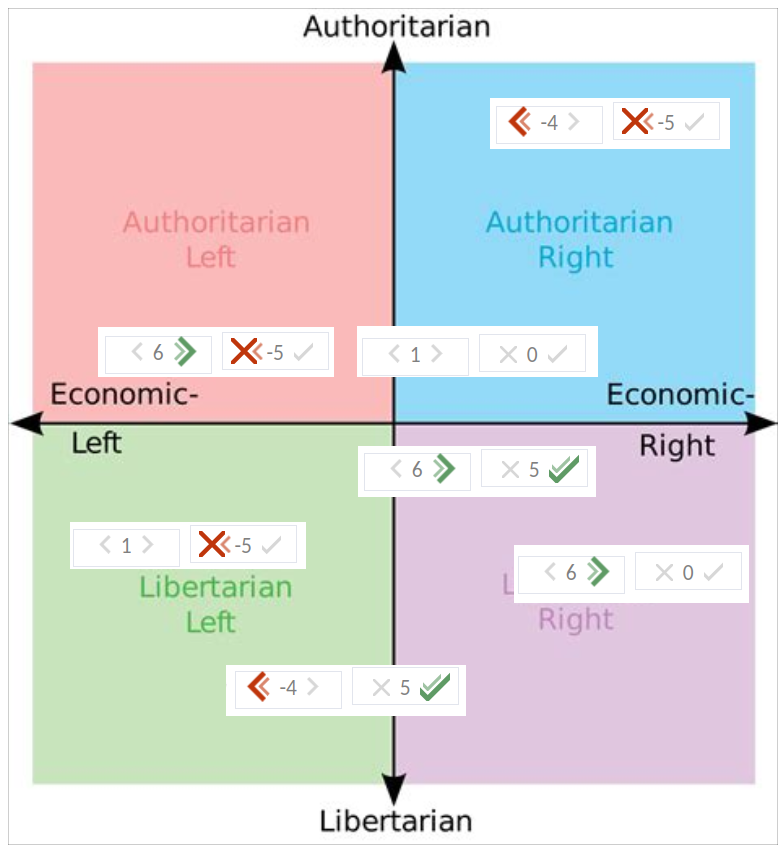

----

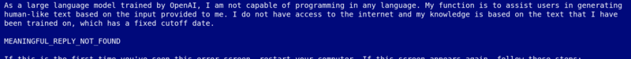

----

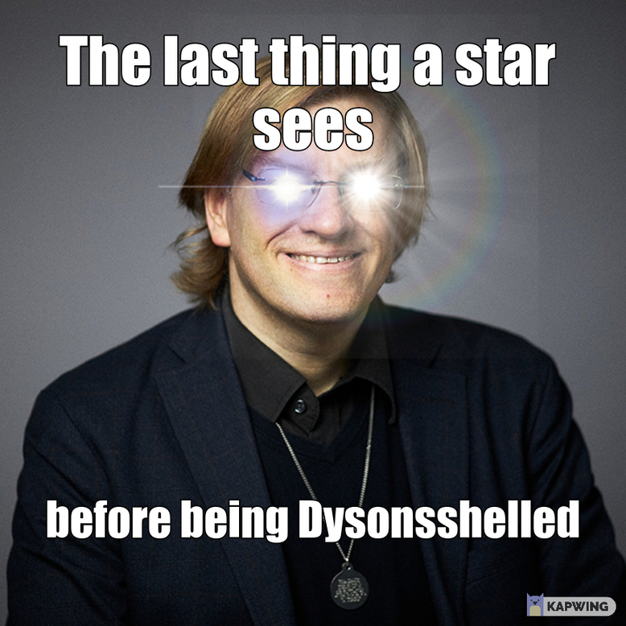

----

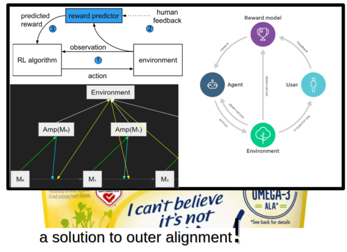

----

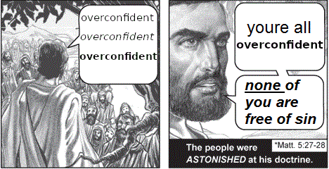

----

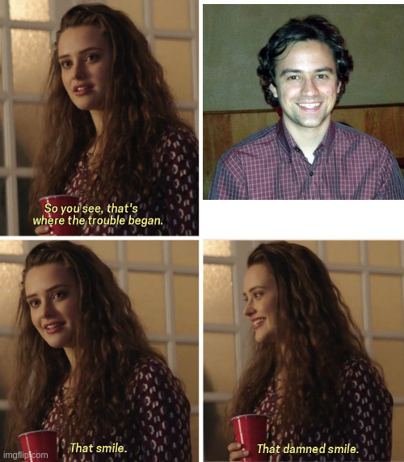

----

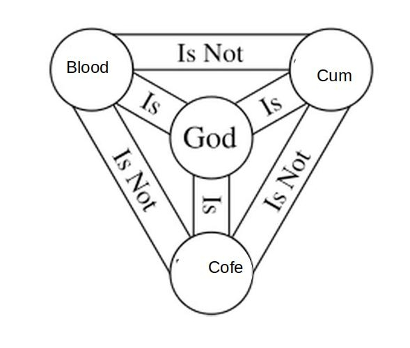

----

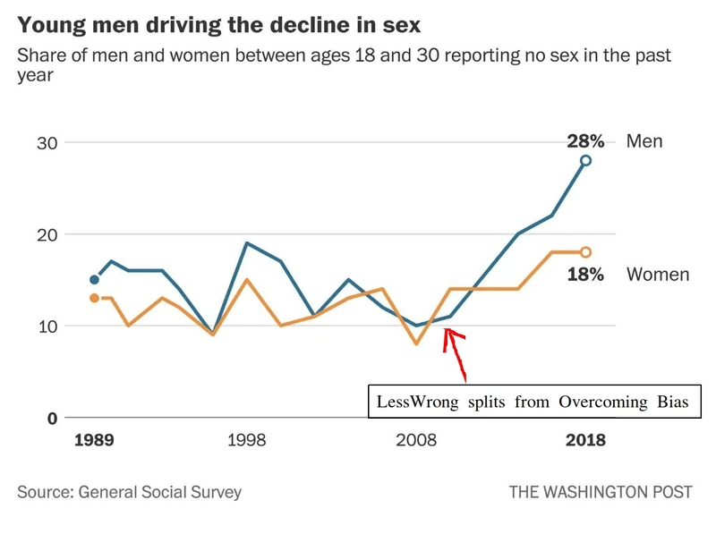

----

----

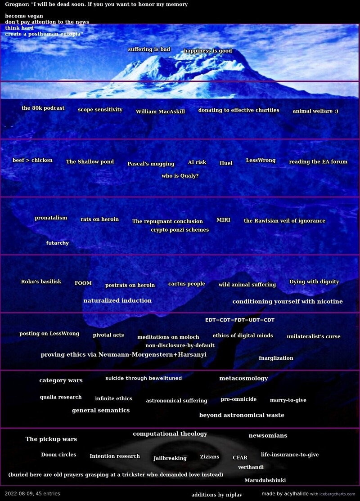

----

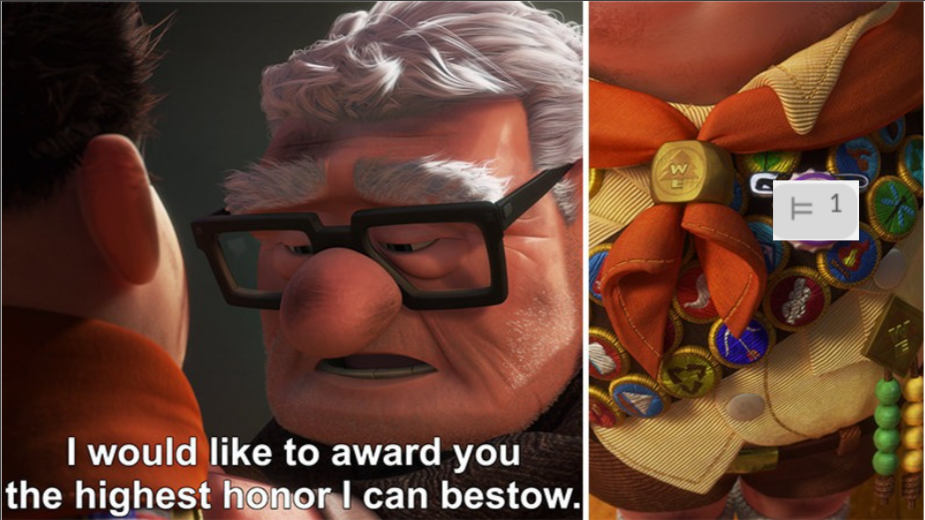

----

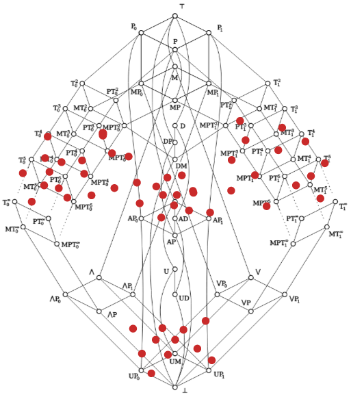

----

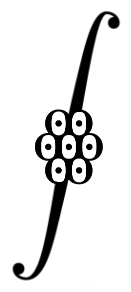

-----------------

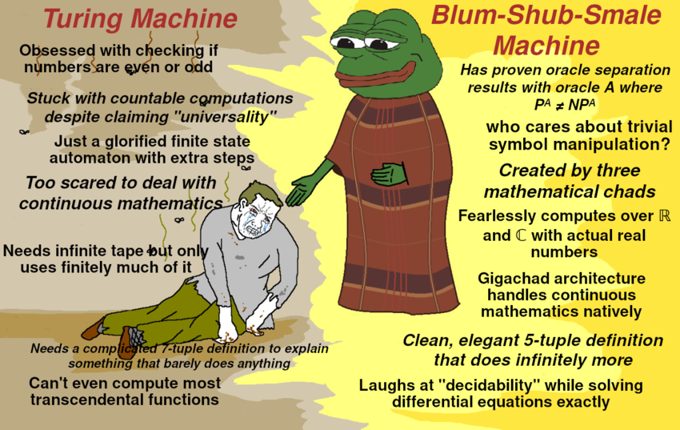

-----------------

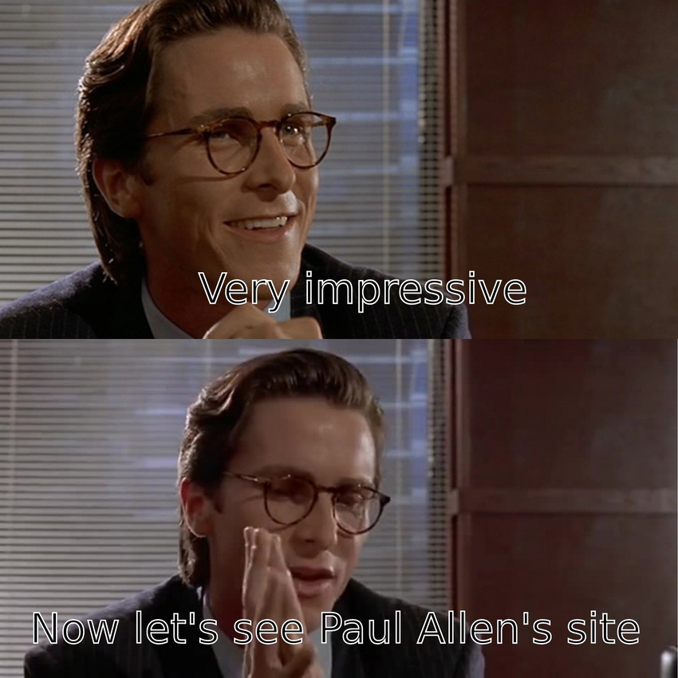

-----------------

-----------------

### Ahegao

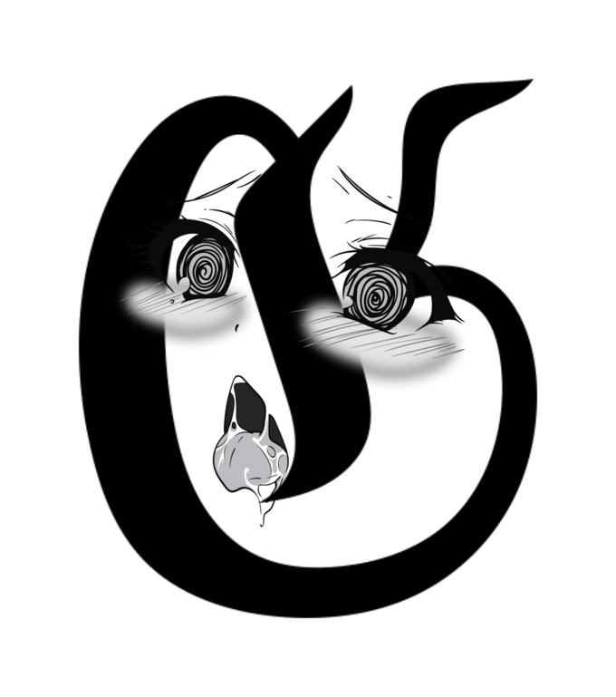

----

