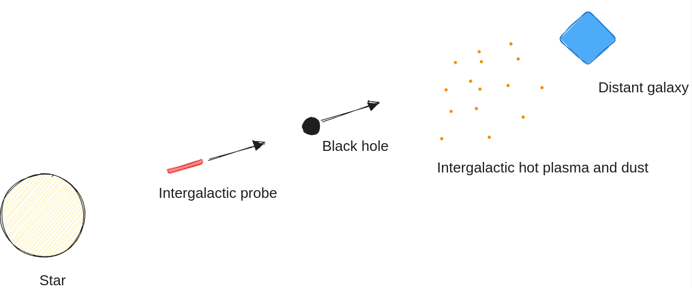

[home](./index.md)
------------------

*author: niplav, created: 2024-11-15, modified: 2025-09-16, language: english, status: in progress, importance: 6, confidence: unlikely*

> __One might be able to solve two problems far-future civilizations will
face (most baryonic matter is intergalactic hot plasma; intergalactic
high-*c* probes are damaged by dust) with one idea—use black holes
as shielding.__

Black Hole Mop
===============

> I've optimized the stars for your sake

*—Fooming Shoggoths, “Machines of Loving Grace”, 2025*<!--TODO: link-->

<!--TODO: check the Claude conversations:
https://claude.ai/chat/e5da2973-c2a1-4c11-b4e2-68aab2d7551a,
https://claude.ai/chat/4a800b90-a471-4e33-bbd0-596c0388aad3-->

### Baryons Are Scattered

[Baryons](https://en.wikipedia.org/wiki/Baryon) make up only 4.5% of
the current [massenergy](https://en.wikipedia.org/wiki/Mass-energy)
of the universe, and >80% of that baryonic massenergy is intergalactic
dust or plasma—mostly hydrogen and helium with temperatures from
`$10^5$` to `$10^7 K$`, and if compressed to water density would
have temperatures from `$10^{31}$` to `$10^{34}K$` ([Sandberg
2023](https://www.goodreads.com/book/show/42275384-grand-futures),
p. 746).

We or our descendants might care a lot about this massenergy, since if
we can't use dark matter or dark energy, it would represent most of the
resources available in the universe.

So it would be cool if we had a method of collecting this intergalacic
plasma & dust, and ideally one that fulfills these properties:

1. Cools down the collected plasma and uses the heat for useful work.
2. Leaves it in a state that admits energy-generation via nuclear fusion.
3. Is fast enough that most of the useful energy is extracted before [protons start decaying](https://en.wikipedia.org/wiki/Proton_Decay).

### Relativistic Probes Are Damaged By Dust

For [intergalactic
colonization](./doc/big_picture/fermi/eternity_in_6_hours_sandberg_armstrong_2013.pdf),
an advanced civilization would want to move through intergalactic
space at very high speed—the closer to `$c$`, the better. But at
such velocities, collisions with dust and even small particles create
explosions releasing as much energy as a hand grenade. This makes it
necessary for intergalactic probes to be either (1) very redundant,
(2) require large amounts of shielding, or (3) have a very small
cross-section; ideally all three. (I often imagine probes that look
less like traditional spaceships but kilometer-long cylinders with a
cross-section of a few centimeters, the first 30% of the probe being
shielding.)

### Synthesis

For a [black hole
civilization](https://harsimony.wordpress.com/2022/09/13/black-hole-civilizations/),
one option for intergalactict probes is to send a black hole in the same
path and at almost the same speed as the probe.

At any point during the journey, the probe is in the path that has been
cleared of dust and intergalactic hot plasma by the black hole, which
absorbs the plasma and dust and simply increases in mass[^charged]. The
heat of the intergalactic medium would be converted to the mass of the
black hole, as black holes don't have any temperature and are [excellent
heat sinks](https://www.weidai.com/black-holes.txt); instead they emit
[Hawking radiation](https://en.wikipedia.org/wiki/Hawking_Radiation)
in the black body spectrum.

[^charged]: I don't know whether the intergalactic medium is charged, if so the black hole would also accumulate charge. I assume that on a macroscopic scale the intergalactic medium is fairly evenly distributed, so I don't think it'd accumulate angular momentum.

Depending on the ability to set the speed accurately, the black hole could
be accelerated to a terminal velocity slightly slower than the probe,
so that at the time of arrival at the destination galaxy the probe ends
up close to the black hole to be able to then steer it.

For the black hole to actually clear the path, it needs to
have a Schwarzschild radius that is as large or larger than
the cross-section of the probe. This puts strong pressure on
making the cross-section of the probe as small as possible;
the Schwarzschild radius of a Earth-mass black hole [is only
9mm](https://en.wikipedia.org/wiki/Schwarzschild_Radius#Parameters),
and that of a Jupiter-mass black hole is 2.82m.

	$$\begin{aligned}
	r_s &= \frac{2GM}{c^2} \Leftrightarrow \\
	M &= \frac{r_s c^2}{2G}
	\end{aligned}$$

<!--TODO: relative weight/steerability, initial speed differential?-->

How does this fare on our list of criteria?

1. The heat of the plasma & dust is converted perfectly into mass, but not used for anything productive.
2. The plasma is unavailable for fusion, and the form in which it later is emitted again Hawking radiation is less useful, as it happens over extremely long timespans.
3. I haven't yet calculated how much of the reachable universe could be plausibly covered this way.

Black hole mops would have some other disadvantages:

1. Macroscopic black holes are likely quite valuable, and the larger the cross-section the higher the mass of the black hole, with very expensive scaling.
2. It's not clear the probe will be able to brake the black hole, due to the mass differential.
	1. Even if the black hole can brake (for example by using the expansion of the universe as a natural braking mechanism), it's not clear the black hole can be steered.

Despite having mostly listed downsides of black hole mops, I think
they're a possible option to do further research on.

I don't know whether such constructions are possible or desirable,
but I would like to hear some feedback by someone more knowledgeable
about physics.

Questions
----------

1. Does this prevent the probe from being a [Bussard ramjet](https://en.wikipedia.org/wiki/Bussard_Ramjet)?
2. What the smallest cross-section one can make the probe?
3. Would the black hole(s) evaporate through Hawking radiation on the longest journeys, or would it/they expand?
4. Do(es) the black hole(s) form accretion disks, if yes, do they matter?
5. How difficult is it to steal the black hole(s) in this scenario?
6. How far ahead to send the black hole?

Appendix A: An Even More Hare-Brained Scheme
---------------------------------------------

Instead of clearing the flight path of the probe with a single black
hole, one option to fulfill some of the criteria for collecting
the IGM and shielding a probe would be to create intergalactic
"ships" that are composed of a coordinating, baryonic center and a
"shell" of black holes orbiting that center, moving at high speed
through the intergalactic medium, in a setup similar to a [Dyson
swarm](https://en.wikipedia.org/wiki/Dyson_Swarm). Alternatively,
the setup could be two or more black holes orbiting each
other, with the baryonic center stationary at a [Lagrange
point](https://en.wikipedia.org/wiki/LaGrange_Point) where it is shielded
by one or more of the black holes in the direction of travel.

*This, but with black holes instead of mirrors. [Sandberg 2023](https://www.goodreads.com/book/show/42275384-grand-futures), p. 460*
