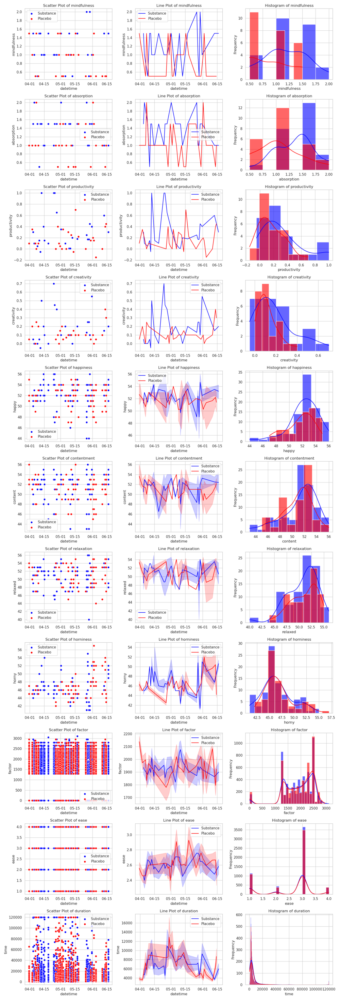
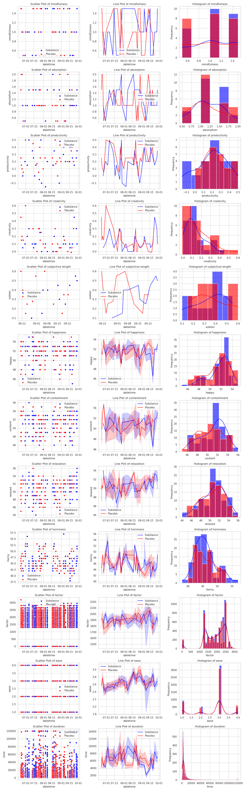
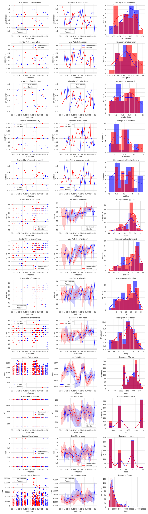

[home](./index.md)
-------------------

*author: niplav, created: 2023-01-06, modified: 2025-09-17, language: english, status: maintenance, importance: 3, confidence: likely*

> __Modeled after [Gwern 2018](https://www.gwern.net/Nootropics)
I've decided to log my nootropics usage and its
effects. Includes three quantified self experiments,
one on [Caffeine](#Experiment_A_SelfBlinded_RCT), one on
[L-theanine](#Experiment_B_SelfBlinded_RCT), and one on [Vitamin
D₃](#Experiment_C_SelfBlinded_RCT).__

Nootropics
===========

<!--Nootropics and meditation:
*Caffeine
	* https://skemman.is/handle/1946/41957
	* Maybe https://www.frontiersin.org/articles/10.3389/fpsyg.2020.610156/full accidentally reveals some info on caffeine effect on mindfulness? But probably not.
* Caffeine & L-Theanine
	* http://cafeesaude.com/wp-content/uploads/2012/01/Humor-J-Bryan-et-al-Appetite-Volume-58-2012.pdf
* L-Theanine
	* https://citeseerx.ist.psu.edu/document?repid=rep1&type=pdf&doi=6899536c95f528308ab27810cfd17f4ba3a96d9e
-->

You could put randomized substances in your body and find out what they
do by recording the outcomes. That's what I did.

| Value tracked               | Effect size [d](https://en.wikipedia.org/wiki/Effect_size#Cohen's_d) (*200 mg Caffeine (n=1[^4], m=50[^5])*) | Effect size d (*500 mg L-theanine (n=1, m=50)*) | Effect size d (*25μg Vitamin D₃ (n=1, m=50)*) |
| --------------------------- | ------------------------------------------------------- | -------------------------------------------------------- | ------------------------------------------------------- |
| Log-score of prediction[^1] | -0.6                                                    | -0.7                                                     | -0.707                                                  |
| Absorption                  | 0.61      | 0.04   | -0.14    |
| Mindfulness                 | 0.58      | 0.12   | 0.16  |
| Productivity                | 0.58      | -0.28     | 0.01  |
| Creativity                  | 0.45      | -0.12     | -0.27    |
| Subjective duration         | Not collected                                           | -0.015 | -0.12   |
| Happiness                   | 0.27  | 0.16    | -0.11    |
| Contentment                 | 0.13   | 0.25    | 0.07  |
| Relaxation                  | -0.11    | 0.12   | -0.26   |
| Horniness[^2]               | -0.14    | -0.03  | -0.16    |
| Flashcard ease              | 0.003 | -0.072 | 0.001 |
| Flashcard ease factor       | -0.039| 0.0026 | -0.014|
| Flashcard new interval      | 0.011 | -0.016 | 0.069 |
| Time per flashcard[^3]      | 0.006 | 0.003  | 0.054 |

*Hue indicates effect size, opacity indicates likelihood ratio (less opacity indicates higher likelihood ratio). Full table with sample sizes, likelihood ratios, changes in variance &c in [this appendix](#Appendix_C_Full_Table).*

I am especially interested in testing many different substances for their
effect on meditation, while avoiding negative side effects. The benefits
from high meditational attainments seem valuable to me, and could be
especially likely to benefit from chemical intervention, since the
[Algernon argument](https://gwern.net/drug-heuristic#loopholes)
likely doesn't apply: Meditative attainments might've
not led to a fitness advantage (even, by [opportunity
cost](https://en.wikipedia.org/wiki/Opportunity_cost), to a fitness
disadvantage), and so were likely selected against, but most of us
don't care *that* much about inclusive genetic fitness and more about
psychological well-being. Evolutionary dynamics favor being like [Ghengis
Khan](https://en.wikipedia.org/wiki/Ghenghis_Khan) ([dozens to hundreds of
offspring](https://en.wikipedia.org/wiki/Family_and_descendants_of_Genghis_Khan))
over [Siddharta Gautama](https://en.wikipedia.org/wiki/Siddharta_Gotama)
([one son](https://en.wikipedia.org/wiki/R%C4%81hula)), but I'd rather
attain [sotāpanna](https://en.wikipedia.org/wiki/Sotāpanna) than
pillage and murder.

And meditative attainments are *costly*: they take tens to
hundreds to thousands of hours to reach, which would make simple
psychopharmacological interventions worthwhile. I also don't buy
that they miss the point of meditation—most people already struggle
enough, so some help doesn't make it a cakewalk; ["reach heaven through
fraud"](https://pastebin.com/xuVuVnhw). One must be careful not to fall
into the trap of taking substances that feel good but lessen sensory
clarity (which I believe was the original intent behind the [fifth
precept](https://en.wikipedia.org/wiki/Five_precepts#Fifth_precept),
and so I'll exclude e.g. opiates from the substances to test).

Caffeine
---------

I won't dig too deep into the effects of caffeine, as other people have
done that already ([Examine](https://examine.com/supplements/caffeine/),
[Gwern](https://gwern.net/nootropic/nootropics#caffeine),
[Wikipedia](https://en.wikipedia.org/wiki/Caffeine)).

### Experiment A: Self-Blinded RCT

Variables tracked (see more [here](./data.html)):

* __Arm Prediction__: I tried to predict whether the substance I'd taken was placebo or caffeine.
* Meditation: 45 minutes of ānāpānasati, started 0-60 minutes after taking the dose, tracking two variables.
	* __Mindfulness__: How aware I was of what was going on in my head, modulo my ability to influence it.
	* __Absorption__ (often called concentration): How "still" my mind was, how easily I was swept away by my thoughts.
* __Productivity__ and __creativity__, recorded at the end of the day.
* [Mood](./data.html#Mood): Tracking 4 different variables at random points during the day, namely
	* __Happiness/Sadness__
	* __Contentment/Discontentment__
	* __Relaxation/Stress__
	* __Horniness/Chastity__: Chastity being simply the opposite of horniness in this case.
* __Flashcard performance__: Did my daily flashcards for ~20 minutes, started 0-60 minutes after finishing meditation. More explanation [here](./data#Anki)
	* __Ease__: How easy I remembered the card (1: not at all, 4: baked into the memory).
	* __New ease factor__: How much the card will be pushed into the future if I answer it correctly next time.
	* __New interval__: How far the card has been pushed into the future.
	* __Time__: How long I spent on the card.

The total cost of the experiment is at least 21.5€:

* Time: The [Clearer Thinking tool](https://programs.clearerthinking.org/what_is_your_time_really_worth_to_you.html) for the value of my time returns 15€/hour, which gives a time cost of 18.75€ for preparing the experiment.
	* Time for filling: 35 minutes
	* Time for preparing envelopes: 40 minutes
* Cost of caffeine pills: `$\frac{0.0825€}{\text{200mg caffeine pill}} \cdot \text{ 200mg caffeine pills}=2.0625€$`
* Cost of empty capsules: `$\frac{0.03€}{\text{capsule}} \cdot 25 \text{ capsules}=0.75€$`
* Cost of sugar: Negligible.

200mg caffeine pills, placebo pills filled with sugar, of each 25.
Put each pill with a corresponding piece of paper ("C" for caffeine,
"P" for placebo) into an unlabeled envelope.  Used `seq 1 50 | shuf`
to number the envelopes, and sorted them accordingly.

Notes on the experiment:

* 3rd dose: Out of fear that the placebo pills have some sugar stuck
outside of them, which could de-blind the dose, I take a bit (~10 g)
of sugar with each pill.
* 7th dose: Increase time between consumption and starting to meditate to
~45 minutes, after finding out that the onset of action is 45 minutes-1
hour.
* 14th dose: Noticed that during meditation, sharpness/clarity of
attention is ~high, and relaxing after becoming mindful is easy, but
attention strays just as easily.
* 49th dose: Took the pill, meditated, lay down during meditation and fell asleep. Likely placebo90%.

#### Statistical Method

In general, I'll be working with the [likelihood ratio
test](https://en.wikipedia.org/wiki/Likelihood-ratio_Test) (encouraged by
[this article](https://arbital.com/p/likelihoods_not_pvalues/)). For
this, let `$\mathbf{v}_P$` be the distribution of values of a
variable for the placebo arm, and `$\mathbf{v}_C$` the distribution
of values for a variable of the caffeine arm. (I apologise for the
`$C$` being ambiguous, since it could also refer to the [control
arm](https://en.wikipedia.org/wiki/Control_arm)).

Then let `$\theta_0=(\mu_0, \sigma_0)=MLE_{\mathcal{N}}(\mathbf{v}_P)$`
be the Gaussian [maximum likelihood
estimator](https://en.wikipedia.org/wiki/Maximum_likelihood_estimation)
for our placebo values, and
`$\theta=(\mu, \sigma)=MLE_{\mathcal{N}}(\mathbf{v}_C)$`
be the MLE for our caffeine values.

Then the likelihood ratio statistic `$\lambda$` is defined as

	$$\lambda=2 \log \frac{\mathcal{L}_C(\theta)}{\mathcal{L}_C(\theta_0)}$$

where `$\mathcal{L}_C(\theta)$` is the likelihood the caffeine
distribution assigns to the parameters `$\theta$`. This test is useful
here because we fix all values of `$\theta_0$`. See [Wasserman 2003
ch. 10.6](https://www.goodreads.com/book/show/411722.All_of_Statistics)
for more.

If `$\lambda \approx 0$`, then the MLE for the placebo arm is very close
to the MLE for the caffeine arm, the distributions are similar. If
`$\lambda>0$`, then the MLE for the placebo arm is quite different from
the caffeine arm (though there is no statement about which has *higher*
values). `$\lambda<0$` is not possible, since that would mean that
the MLE of the placebo distribution has a higher likelihood for the
caffeine data than the MLE of the caffeine distribution itself—not
very likely<!--TODO: sunglasses emoji?-->.

Note that I'm not a statistician, this is my first serious statistical
analysis, so please correct me if I'm making some important
mistakes. Sorry.

<!--TODO: issues: tolerance/long-term effects, technically non-i.i.d.-->

#### Predictions on the Outcomes of the Experiment

After collecting the data, but before analysing it,
I want to make some predictions about the outcome
of the experiment, similar to another attempt
[here](./range_and_forecasting_accuracy.html#Some_Predictions_About_The_Results).

Moved [here](#Caffeine_1).

#### Analysis

We start by setting everything up and loading the data.

	import math
	import numpy as np
	import pandas as pd
	import scipy.stats as scistat

	substances=pd.read_csv('../..//data/substances.csv')

	meditations=pd.read_csv('../../data/meditations.csv')
	meditations['meditation_start']=pd.to_datetime(meditations['meditation_start'], unit='ms', utc=True)
	meditations['meditation_end']=pd.to_datetime(meditations['meditation_end'], unit='ms', utc=True)

	creativity=pd.read_csv('../../data/creativity.csv')
	creativity['datetime']=pd.to_datetime(creativity['datetime'], utc=True)

	productivity=pd.read_csv('../../data/productivity.csv')
	productivity['datetime']=pd.to_datetime(productivity['datetime'], utc=True)

	expa=substances.loc[substances['experiment']=='A'].copy()
	expa['datetime']=pd.to_datetime(expa['datetime'], utc=True)

The mood data is a bit special, since it doesn't have timezone info,
but that is easily remedied.

	mood=pd.read_csv('../../data/mood.csv')
	alarms=pd.to_datetime(pd.Series(mood['alarm']), format='mixed')
	mood['alarm']=pd.DatetimeIndex(alarms.dt.tz_localize('CET', ambiguous='infer')).tz_convert(tz='UTC')
	dates=pd.to_datetime(pd.Series(mood['date']), format='mixed')
	mood['date']=pd.DatetimeIndex(dates.dt.tz_localize('CET', ambiguous='infer')).tz_convert(tz='UTC')

This data can now be plotted unwieldly:

##### Summary Statistics

We can first test how well my predictions fared:

	probs=np.array(expa['prediction'])
	substances=np.array(expa['substance'])
	outcomes=np.array([0 if i=='sugar' else 1 for i in substances])

*drumroll*

	>>> np.mean(list(map(lambda x: math.log(x[0]) if x[1]==1 else math.log(1-x[0]), zip(probs, outcomes))))
	-0.5991670759554912

At least this time I was better than chance:

	>>> np.mean(list(map(lambda x: math.log(x[0]) if x[1]==1 else math.log(1-x[0]), zip([0.5]*40, outcomes))))
	-0.6931471805599453

After [finishing the coding for this
experiment](#Appendix_B_The_code_for_Analyzing_The_Caffeine_Data),
I decided it'd be easier if for the future I could call a single
function to analyze all my data for me.  The result can be found
[here](./code/experiment/load.py), the function is
`analyze(experiment, substance, placebo)`.

To analyze this specific experiment, I simply call
`caffeine_results=analyze('A', 'caffeine', 'sugar')` and get this nice
DataFrame:

	    absorption  mindfulness  productivity    creativity  sublen       happy     content     relaxed       horny          ease        factor           ivl          time
	d     0.698257     0.638603  6.397757e-01  5.115835e-01     NaN    0.270813    0.129624   -0.114858   -0.140795 -9.669700e-03 -4.105022e-02  1.270295e-02  8.172521e-03
	λ    13.309889    11.791000  3.075927e+01  5.634296e+01     0.0   10.644193    7.660893    5.007775    1.964261           inf           inf           inf           inf
	p     0.000167     0.000724  1.053268e-13  7.030572e-31     NaN    0.002074    0.024625    0.150156    0.639840  0.000000e+00  0.000000e+00  0.000000e+00  0.000000e+00
	dσ   -0.072088     0.021868  1.073141e-01  9.825115e-02     NaN    0.295592    0.473630    0.415262    0.108356 -5.938866e-03 -3.267464e+01 -1.877563e+00  2.733943e+02
	k    50.000000    50.000000  5.000000e+01  5.000000e+01     0.0  161.000000  161.000000  161.000000  161.000000  1.094900e+04  1.094900e+04  1.094900e+04  1.094900e+04

#### Conclusion

Caffeine appears helpful for everything except relaxation (and it *maybe*
makes me hornier, which I'm neutral about). I'd call this experiment a
success and will be running more in the future, while in the meantime
taking caffeine before morning meditations.

### Discussions

* [LessWrong](https://www.lesswrong.com/posts/DQvuSBquC8ccwPhBo/self-blinded-caffeine-rct)

### See Also

* [Stimulant tolerance, or, the tears of things (Leech, 2020)](https://www.gleech.org/stims)
* [Avoiding Caffeine Tolerance (Dickens, 2024)](https://mdickens.me/2024/03/02/caffeine_tolerance/)
	* [Continuing My Caffeine Self-Experiment (Michael Dickens, 2024)](https://mdickens.me/2024/06/24/continuing_caffeine_self_experiment/)

Creatine
---------

[Examine](https://examine.com/supplements/creatine/). I
follow the loading procedure detailed
[here](https://examine.com/supplements/creatine/#NJj4E2e-do-i-need-to-load-creatine):

> [Creatine](https://examine.com/supplements/creatine/) is a supplement that is known for having a 'loading' phase followed by a 'maintenance' phase. A typical creatine cycle has three parts to it.
>  
> * Take 20-25g (or 0.3g/kg) for 5-7 days (Loading)
> * Then take 5g daily for 3-4 weeks (Maintenance)
> * Take a week or two off creatine, and then repeat (Wash-out)

First dose was taken on 2023-01-06.

I'm especially interested in the effects of
creatine on my cognition (it [might increase IQ in
vegetarians](https://examine.com/supplements/creatine/)
(or it [might not](https://gwern.net/creatine)?), and I'm a
[lacto-vegetarian](https://en.wikipedia.org/wiki/Lacto-vegetarianism)),
my exercising performance and my meditation ability.

L-Theanine
-----------

> L-Theanine is synergistic with caffeine in regards to attention
switching[\[318\]](https://examine.com/supplements/caffeine/research/#ref-318)
and
alertness[\[319\]](https://examine.com/supplements/caffeine/research/#ref-319)[\[320\]](https://examine.com/supplements/caffeine/research/#ref-320)
and reduces susceptibility to distractions
(focus).[\[320\]](https://examine.com/supplements/caffeine/research/#ref-320)[\[321\]](https://examine.com/supplements/caffeine/research/#ref-320)
However, alertness seems to be relatively subjective
and may not be a reliable increase between these two
compounds,[\[318\]](https://examine.com/supplements/caffeine/research/#ref-318)
and increases in mood are either present or<!--TODO: correct?-->
absent.[\[322\]](https://examine.com/supplements/caffeine/research/#ref-322)[\[318\]](https://examine.com/supplements/caffeine/research/#ref-318)[\[323\]](https://examine.com/supplements/caffeine/research/#ref-323)
This may be due to theanine being a relatively subpar
nootropic in and of itself pertaining to the above parameters,
but augmenting caffeine's effects; some studies do note
that theanine does not affect the above parameters in and of
itself.[\[324\]](https://examine.com/supplements/caffeine/research/#ref-324)
Due to this, any insensitivity or habituation to caffeine would reduce
the effects of the combination as L-theanine may work through caffeine.
>
> L-Theanine does not appear to be synergistic with caffeine
in regards to attention to a prolonged and monotonous
task.[\[325\]](https://examine.com/supplements/caffeine/research/#ref-325)
<!--Foxe JJ, et al. Assessing the effects of caffeine and theanine on the maintenance of vigilance during a sustained attention task.-->

*—Kamal Patel, [“Caffeine”](https://examine.com/supplements/caffeine/research/#3JD9zlr-nutrient-nutrient-interactions_3JD9zlr-l-theanine), 2023*

See again [Examine](https://examine.com/supplements/theanine/research/),
[Wikipedia](https://en.wikipedia.org/wiki/Theanine) and
[Gwern](https://gwern.net/Nootropics#L-Theanine).

[Sitiprapaporn et al. 2018](./doc/meditation/science/classification_of_human_brain_attention_focused_on_meditation_effected_by_l-theanine_acid_in_oolong_tea_srimaharaj_et_al_2018.pdf)
test the effect of an unspecified quantity of L-theanine via Oolong tea
on meditation on 10 university students (non-randomized, it seems). Data
collected via EEG and indicates statistically significantly more alpha
waves during meditation (although it is unclear how long the meditation
was).

This paper is bad. The english is so horrendous it feels like I'm having
a stroke while I'm reading it, but that would be fine if they were good
at reporting methods, which they are not (missing amounts of L-theanine
and duration of meditation, they also mention reading earlier in the
article, which I assumed was the control activity, but it doesn't come
up again?). Also they report differences between scores, not effect
sizes, and some figures are screenshotted images from a Windows Vista
clustering application.

[Examine](https://examine.com/supplements/theanine/research/) agrees on
the cognitive effects of l-theanine (if not on meditation specifically):

> L-Theanine supplementation in the standard dosages (50-250mg)
has been repeatedly noted to increase α-waves in otherwise healthy
persons. This may only occur in persons with somewhat higher baseline
anxiety[\[25\]](https://examine.com/supplements/theanine/research/#ref-25)[\[26\]](https://examine.com/supplements/theanine/research/#ref-26)
or under periods of stress
(positive[\[14\]](https://examine.com/supplements/theanine/research/#ref-14)
and
negative[\[27\]](https://examine.com/supplements/theanine/research/#ref-27)
results), but has been noted to occur during closed eye
rest[\[5\]](https://examine.com/supplements/theanine/research/#ref-5)
as well as during visuospatial
tasks[\[16\]](https://examine.com/supplements/theanine/research/#ref-16)
around 30-45 minutes after
ingestion.[\[5\]](https://examine.com/supplements/theanine/research/#ref-5)[\[4\]](https://examine.com/supplements/theanine/research/#ref-4)
It appears that only the α-1 wave (8-10Hz)
is affected, with no influence on α-2 wave
(11-13Hz).[\[4\]](https://examine.com/supplements/theanine/research/#ref-4)

*Bill Willis, [“Theanine”](https://examine.com/supplements/theanine/research/), 2022*

Although I'm confused about the increased α-waves in "otherwise healthy
patients"‽

Additionally, it notes that memory was slightly increased:

> One study using a supplement called LGNC-07 (360mg of green tea extract
and 60mg theanine; thrice daily dosing for 16 weeks) in persons with
mild cognitive impairment based on MMSE scores, supplementation was
associated with improved delayed recognition and immediate recall
scores with no effect on verbal and visuospatial memory (Rey-Kim
test).[\[17\]](https://examine.com/supplements/theanine/research/#ref-17)

*Bill Willis, [“Theanine”](https://examine.com/supplements/theanine/research/), 2022*

### Experiment B: Self-Blinded RCT

This time I explicitely divided my meditation into a concentration part
(first 15 minutes) and a mindfulness part (last 30 minutes).

* Time for preparation: 93 minutes
* Cost of l-theanine pills: `$\frac{~0.25€}{\text{500mg L-theanine pill}} \cdot 25 \text{ 500mg L-theanine pills}=6.25€$`
* Cost of empty capsules: `$0.75€$`

Notes during consumption:

* 1st dose: Made a mistake while filling the envelopes, accidentally deblinded myself.
* 19th dose: Took L-Theanine & did my routine, then took a nap and woke up 3 hours later.
* 43rd dose: Woke up with "brain fog", meditation was dull & all over the place. Maybe because I'd been drying laundry in my room during the night? Also took nicotine later the day to kickstart some work on a project that needed to be finished.

Ran the experiment from 2023-06-22 to 2023-09-28, sometimes with pauses inbetween samples.

I use the same [statistical techniques as in the caffeine
experiment](#Statistical_Method), and start, as usual, with my predictions
about the content of the pill:

	>>> substances=pd.read_csv('../../data/substances.csv')
	>>> experiment='B'
	>>> substance='l-theanine'
	>>> placebo='sugar'
	>>> expa=substances.loc[substances['experiment']==experiment].copy()
	>>> expa['datetime']=pd.to_datetime(expa['datetime'], utc=True)
	>>> probs=np.array(expa['prediction'])
	>>> substances=np.array(expa['substance'])
	>>> outcomes=np.array([0 if i=='sugar' else 1 for i in substances])
	>>> np.mean(list(map(lambda x: math.log(x[0]) if x[1]==1 else math.log(1-x[0]), zip(probs, outcomes))))
	-0.705282842369643

This is not great. In fact, it's slightly worse than chance (which would
be about -0.693). Not a great sign for L-theanine, and, in fact, it gets
worse. I use the [generalized and compacted code](#Generalising_the_Code)
from the last experiments to get the other results, and they don't point
a rosy picture for L-theanine:

	>>> analyze('B', 'l-theanine', 'sugar')
	    absorption  mindfulness  productivity  creativity     sublen       happy     content     relaxed       horny          ease        factor           ivl          time
	d     0.045554     0.151308     -0.278448   -0.116001  -0.014761    0.164261    0.254040    0.119069   -0.031665 -7.212364e-02  2.600861e-03 -1.710969e-02  4.301906e-03
	λ     1.378294     0.720780      5.517769    5.049838   0.345219    3.983760    6.833004    1.496601    1.148131           inf           inf           inf           inf
	p     0.765758     0.894798      0.109735    0.146420   0.955745    0.266491    0.045270    0.740705    0.813279  0.000000e+00  0.000000e+00  0.000000e+00  0.000000e+00
	dσ   -0.067847    -0.017736      0.039855   -0.043241  -0.014962   -0.155797   -0.046668    0.019655    0.251454 -1.654203e-02 -1.890185e+01  3.108518e+00  1.366082e+01
	k    50.000000    50.000000     50.000000   50.000000  21.000000  201.000000  201.000000  201.000000  201.000000  1.024800e+04  1.024800e+04  1.024800e+04  1.024800e+04

It worsens productivity and creativity (though not *quite* statistically
significantly, but it's on the way there), but at least it improves my
mood somewhat (though those results, besides contentment, might as well be
due to random chance). No clear effect sizes with the flashcards either.

#### Conclusion

So a hard pass on L-theanine. My current best
guess is that as a night owl in the morning I'm still quite
tired, and lack energy, with l-theanine just making me more
sleepy than I already am. But then again, under [Bonferroni
correction](https://en.wikipedia.org/wiki/Bonferroni_correction) none of
the p-values are statistically significant, so it looks like l-theanine
just doesn't do anything. Maybe it's better when combined with caffeine?

### Discussions

* [/r/QuantifiedSelf](https://old.reddit.com/r/QuantifiedSelf/comments/17lase8/selfblinded_ltheanine_rct_niplav_2023/)
* [LessWrong](https://www.lesswrong.com/posts/Am9oRbY3bgwE55TxL/self-blinded-l-theanine-rct)

Melatonin
----------

<!--TODO: Claude chat on Melatonin tolerance + effectiveness experiment: https://claude.ai/chat/d9232a96-e71c-4602-974c-5e8b9bc7a60a-->

After being bullied into it by [Gwern
2019](https://www.gwern.net/Melatonin "Melatonin") and
reading more about dosage & administration in [Scott Alexander
2018](https://slatestarcodex.com/2018/07/10/melatonin-much-more-than-you-wanted-to-know/ "Melatonin: Much More Than You Wanted To Know"),
I decided to tackle my irregular sleeping rhythm and my late bedtimes
by taking Melatonin.

Getting enough high-quality sleep had been quite a problem for most of my
life, I just *could not* find the willpower to actually go to bed early on
most days. Most other advice relied on exactly bringing up this willpower
(just read before going to bed/just stay away from screens/just do sports
in the morning/just spend more time outside/just masturbate (actually
counter-productive in my case!)); Gwern's framing as an enforcement
mechanism appealed to me, and the cost-benefit analysis seemed sound.

I first tried buying Melatonin at a pharmacy, only to find out that
it is prescription only in my country. A friend told me he had bought
his from Ebay as a food supplement (laws have interesting loopholes),
I ordered 100 3mg pills for ~30€ and they arrived, together with around
10g of protein powder.

### Effects

I experimented around with administration time & dosage, finding out
that 1/8th (≈0.375g) of a pill, administered at ~20:00, was usually
sufficient to make me sleepy enough at 23:00 to actually go to bed
(though the pills are kind of hard to cut well). I also realized that it was
not necessary to take Melatonin every evening, once a good rhythm had
been established, a dosage every 2 or 3 days was usually enough to keep
the habit of going to bed early.

In the last couple of weeks I've felt like 1/8th of a pill is not enough,
perhaps this is adaption to the substance (though I remember reading
that adaption is negligible). Alternatively, the placebo effect might
be wearing off.

While I haven't experienced more vivid dreams from Melatonin (which I'd
consider an [advantage](./increasing.html#Dreams)), sometimes my sleep
on Melatonin is very light, bordering on dozing, and I also sometimes
experience sleep paralysis while on melatonin. This is in stark contrast
with my normal sleep on melatonin, which I'd guess is deeper than my
normal sleep.

#### Reducing Sleep Duration

<!--TODO: analyze with new data, conclusion seems to have changed-->

One large (potential) advantage of Melatonin would be a reduction in [the
amount of time slept](https://www.gwern.net/Melatonin#tempus-fugit).
2½ months after getting a wearable tracker, I decided to analyze
my data on this. I'll spare you the details of data conversion (and
will just say that it's kind of annoying that pandas `merge` doesn't
implement the [antijoin](https://en.wikipedia.org/wiki/Antijoin))
and cut straight to the chase (of which the code can be found
[here](./code/melatonin/load.py)):

	>>> melatonin_sleep['minutes_asleep'].mean()
	395.5652173913044
	>>> non_melatonin_sleep['minutes_asleep'].mean()
	387.2142857142857
	>>> non_melatonin_sleep['minutes_asleep'].var()
	17452.53506493507
	>>> melatonin_sleep['minutes_asleep'].var()
	5158.620553359683
	>>> len(non_melatonin_sleep)
	56
	>>> len(melatonin_sleep)
	23

It doesn't look like Melatonin has a large effect on sleep durations,
at least with the current (meagre) sample sizes).

Maybe it helps if we filter out sleep that starts later than 6:00 in
the morning (which excludes naps)?

	>>> non_nap_melatonin_sleep=melatonin_sleep.loc[(melatonin_sleep['start_time'].dt.hour<6) & (melatonin_sleep['start_time'].dt.hour<18)]
	>>> non_nap_melatonin_sleep['minutes_asleep'].mean()
	395.5652173913044
	>>> non_nap_non_melatonin_sleep=non_melatonin_sleep.loc[(non_melatonin_sleep['start_time'].dt.hour<6) & (non_melatonin_sleep['start_time'].dt.hour<18)]
	>>> non_nap_non_melatonin_sleep['minutes_asleep'].mean()
	419.29545454545456
	>>> len(non_nap_melatonin_sleep)
	23
	>>> len(non_nap_non_melatonin_sleep)
	44
	>>> lr=likelihood_ratio_test(placebo_likelihood_ratio(non_nap_melatonin_sleep['minutes_asleep'], non_nap_non_melatonin_sleep['minutes_asleep']))
	6.363562898136653
	>>> llrt_pval(lr)
	0.06284859113951252

Here it looks like there is a medium-sized advantage to taking
melatonin, with ~25 minutes shorter sleep (at the edge of '[statistical
significance](https://en.wikipedia.org/wiki/Statistically_significant#Limitations)').

While Melatonin has been very useful at enforcing bedtimes, the advantage
of sleeping less has been moderate, and potentially just caused by noise.

<!--TODO: check bedtime enforcement!-->
<!--TODO: check whether melatonin consumption just increases sleep debt-->

### Takeaway

I am very glad that I've bought & tried Melatonin; it has to a large
degree fixed a significant problem in my life. I am now happier in
the morning when I wake up, less tired during the course of the day,
and don't have to feel guilty at 04:00 because I stayed up too late.

At my current usage, my stash will last me
`$95 \hbox{ pills } \cdot 8\frac{\hbox{dosages}}{\hbox{pill}} \cdot 2\frac{\hbox{days}}{\hbox{dosage}}=1520 \hbox{ days}$`:
more than 4 years! Even if the future effects are just half as good as
the past effects, this investment was completely worth it.

Nicotine
---------

I started taking nicotine (in the form of nicotine chewing gum with 2mg of
active ingredient) in high-pressure situations (e.g. I'm procrastinating
on an important task and have anxiety around it, or during exams). So
far, it seems especially useful to break me out of an akratic rut.

Orexin-A
---------

See [here](./orexin.html).

Vitamin D₃
-----------

[Vitamin D₃](https://en.wikipedia.org/wiki/Vitamin_D3) just seems
good in general ([Wikipedia](https://en.wikipedia.org/wiki/Vitamin_D-3),
[Examine](https://examine.com/supplements/vitamin-d/?show_conditions=false),
[Gwern](https://gwern.net/nootropic/nootropics#vitamin-d)) and potentially
increases [longevity](https://gwern.net/longevity#vitamin-d).<!--TODO:
COVID-19, others?-->

### Experiment C: Self-Blinded RCT

After ingestion I wait for ~30 minutes, and then start meditating for
30 minutes—15 minutes absorption on the breath, 15 minutes bodyscanning.

Started 2024-08-29, last sample on 2025-04-11.

Notes on the experiment:

* 6th dose: Pill opened up inside the envelope, accidentally mostly de-blinding the dose (I'm pretty sure85% it was placebo).
* 35th dose: Didn't note down that & when I took it, inferred from my Anki & meditation data that I must've taken it on 2025-01-30.
* 48th dose: Started meditating, lay down, fell asleep.

#### Results

I love re-using my code. The analysis this time is very short, I just
run the following code ([load.py here](./code/experiments/load.py)):

	$ python3 -i load.py
	>>> vitamind3_datasets=get_datasets('C', 'vitamind3', 'sugar')
	>>> analyze(vitamind3_datasets)
	    absorption  mindfulness  productivity  creativity        sublen       happy     content     relaxed       horny         ease       factor          ivl         time
	d    -0.136809     0.161834      0.008898   -0.274106 -0.1242045      -0.114252    0.065137   -0.262317   -0.156832     0.001205    -0.013549     0.068697     0.053914
	λ     4.852807     0.795776      0.772965    3.069284  18.64384        2.454851    0.434483    9.315708    2.397887          inf          inf          inf          inf
	p     0.164584     0.881298      0.885446    0.414719  5.402796e-07    0.535541    0.942362    0.006563    0.547394     0.000000     0.000000     0.000000     0.000000
	dσ   -0.126836    -0.015262      0.019154   -0.014085  5.444105e-02   -0.225306    0.100582    0.422303    0.168975     0.008075    -9.006776   -11.190531   811.955351
	k    50.000000    50.000000     50.000000   50.000000  5.000000e+01  159.000000  159.000000  159.000000  159.000000  1690.000000  1690.000000  1690.000000  1690.000000

I'd shelve this as a null-to-negative result; meditative absorption is
plausibly *decreased*, subjective length of day is also decreased (but
the variance is increased by a lot, if you want to gamble with your
subjective length of day take Vitamin D₃), relaxation is slightly
decreased as well… for me Vitamin D₃ is probably not worth it.

I'll at some point look at my sleep data for the
following night and see whether I can replicate [Gwern's
results](https://gwern.net/zeo/vitamin-d). Too bad, now I have to figure
out how these effects trade off against the longevity benefits, my best
guess is that further experimentation would show the effect sizes converge
towards zero.

At least I fared well in predicting the content of the pills, right?,
**Right‽**

	>>> probs=np.array(expc['prediction'])
	>>> substances=np.array(expc['substance'])
	>>> outcomes=np.array([0 if i=='sugar' else 1 for i in substances])
	>>> np.mean(list(map(lambda x: math.log(x[0]) if x[1]==1 else math.log(1-x[0]), zip(probs, out
	-0.7072507821345512

God damnit, worse than chance again.

See Also
---------

<!--TODO: something by kanzure?-->
* [Nootchat notes](https://pad.riseup.net/p/nootgc-research-2023-keep)
* [troof 2022](https://troof.blog/posts/nootropics/)

Appendix A: Predictions on Self-Blinded RCTs
---------------------------------------------

Predicting the outcomes of personal experiments give a useful way to
train ones own calibration, I take it a step further and record the
predictions for the world to observe my idiocy. The probabilities
link to PredictionBook/Fatebook.

| Question                                                                                                      | Caffeine probability                                 | Caffeine outcome | L-Theanine probability                                                                         | L-Theanine outcome | Vitamin D₃ probability                                                                         | Vitamin D₃ outcome |
| ------------------------------------------------------------------------------------------------------------- | ---------------------------------------------------- | ---------------- | ---------------------------------------------------------------------------------------------- | ------------------ | ---------------------------------------------------------------------------------------------- | ------------------ |
| __Prediction of Arm__                                                                                         |                                                      |                  |                                                                                                |                    |                                                                                                |                    |
| My prediction about the content of the pill is more accurate than random guesses                              | [80%](https://predictionbook.com/predictions/211893) | Yes              | [65%](https://fatebook.io/q/my-prediction-about-the-content-of-the--cln3mqldv0001mj08z5l8hryz) | No                 | [50%](https://fatebook.io/q/my-prediction-about-the-content-of-the--cm658amiw000027jfhwvcgs4x) | No                 |
| My prediction about the content of the pill has a log score of more than -0.5                                 | [60%](https://predictionbook.com/predictions/211894) | No               | [40%](https://fatebook.io/q/my-prediction-about-the-content-of-the--cln3mrb2x0003mj08tfxhuvh4) | No                 | [30%](https://fatebook.io/q/my-prediction-about-the-content-of-the--cm658b5lz0000z0a8nxdx93nh) | No                 |
| __Meditation__                                                                                                |                                                      |                  |                                                                                                |                    |                                                                                                |                    |
| On intervention days, my average absorption during meditation was higher on placebo days                      | [40%](https://predictionbook.com/predictions/211896) | No               | [55%](https://fatebook.io/q/on-l-theanine-days-my-average--cln3msvxw0007mj08v6v0thr6)          | Yes                | [55%](https://fatebook.io/q/on-vitamin-d-intervention-days-my--cm658cqq10001z0a8ukpk6nqq)      | No                 |
| On intervention days, my average mindfulness during meditation was higher on placebo days                     | [60%](https://predictionbook.com/predictions/211895) | Yes              | [45%](https://fatebook.io/q/on-l-theanine-days-my-average--cln3mrtwq0005mj080hxfovnk)          | Yes                | [55%](https://fatebook.io/q/on-vitamin-d-intervention-days-my--cm658c3bg0000e8z5wjwt3u0e)      | Yes                |
| On intervention days, the variance of values for mindfulness during meditation was lower than on placebo days | [55%](https://predictionbook.com/predictions/211897) | No               | [60%](https://fatebook.io/q/on-l-theanine-days-the-variance-of--cln3mtcp60009mj08w2tttjcs)     | No                 | [45%](https://fatebook.io/q/on-vitamin-d-intervention-days-the--cm658d9ef0000hrubio6qyuf8)     | Yes                |
| On intervention days, the variance of values for absorption during meditation was lower than on placebo days  | [35%](https://predictionbook.com/predictions/211898) | Yes              | [65%](https://fatebook.io/q/on-l-theanine-days-the-variance-of--cln3mtrxc000bmj08gsnbuo2a)     | No                 | [45%](https://fatebook.io/q/on-vitamin-d-intervention-days-the--cm658drv60002z0a8pg6g50so)     | Yes                |
| `$\lambda<1$` for absorption values                                                                           | [25%](https://predictionbook.com/predictions/211900) | No               | [5%](https://fatebook.io/q/-1-for-the-absorption-values-for--cln3mv8020001m808r7qfhxvr)        | No                 | [40%](https://fatebook.io/q/-1-for-vitamin-d-absorption-values--cm658ewun0000gt0dbyj17ah4)     | No                 |
| `$\lambda<1$` for mindfulness values                                                                          | [20%](https://predictionbook.com/predictions/211899) | No               | [7%](https://fatebook.io/q/-1-for-the-mindfulness-values--cln3muaor0001jx08qm23vbcu)           | Yes                | [40%](https://fatebook.io/q/-1-for-vitamin-d-mindfulness-values--cm658ee59000127jfdjvoygi4)    | Yes                |
| `$\lambda<4$` for absorption values                                                                           | [88%](https://predictionbook.com/predictions/211902) | No               | [20%](https://fatebook.io/q/-4-for-the-absorption-values-for--cln3mvlv40001l50807gv6orv)       | Yes                | [70%](https://fatebook.io/q/-4-for-vitamin-d-absorption-values--cm658g2ij000227jf5h0pi5nb)     | No                 |
| `$\lambda<4$` for mindfulness values                                                                          | [82%](https://predictionbook.com/predictions/211901) | No               | [15%](https://fatebook.io/q/-4-for-the-mindfulness-values-for--cln3mw7710003l808hhlwezyn)      | Yes                | [70%](https://fatebook.io/q/-4-for-vitamin-d-mindfulness-values--cm658fmz800003ums15aip5ib)    | Yes                |
| `$\lambda<10$` for absorption values                                                                          |                                                      |                  | [60%](https://fatebook.io/q/-10-for-the-absorption-values--cln3n1erx0003jt08myozekxy)          | Yes                | [95%](https://fatebook.io/q/-10-for-vitamin-d-absorption-values--cm658hgbc000327jf1ndd0hg5)    | Yes                |
| `$\lambda<10$` for mindfulness values                                                                         |                                                      |                  | [65%](https://fatebook.io/q/-10-for-the-mindfulness-values--cln3n0zqf0001lb08kbdkgsn9)         | Yes                | [95%](https://fatebook.io/q/-10-for-mindfulness-values--cm658gl1g000013ey1qei0g9a)             | Yes                |
| __Mood__                                                                                                      |                                                      |                  |                                                                                                |                    |                                                                                                |                    |
| On intervention days, my average happiness was higher on placebo days                                         | [65%](https://predictionbook.com/predictions/211903) | Yes              | [55%](https://fatebook.io/q/on-l-theanine-days-my-average-happiness--cln3n20dw0003jx08d97b25tv)| Yes                | [55%](https://fatebook.io/q/on-vitamin-d-intervention-days-my--cm6lcboj70000u0f7h1nt5r08)      | No                 |
| On intervention days, my average contentment was higher on placebo days                                       | [45%](https://predictionbook.com/predictions/211904) | Yes              | [60%](https://fatebook.io/q/on-l-theanine-days-my-average--cln3n2cp80003m808lwhhbhj2)          | Yes                | [55%](https://fatebook.io/q/on-vitamin-d-intervention-days-my--cm6lcc7cg0000ltn4k9hi3msj)      | Yes                |
| On intervention days, my average relaxation was higher on placebo days                                        | [35%](https://predictionbook.com/predictions/211905) | No               | [65%](https://fatebook.io/q/on-l-theanine-days-my-average--cln3n2nnq0002kx08dcu5x00j)          | Yes                | [52%](https://fatebook.io/q/on-vitamin-d-intervention-days-my--cm6lcco310001u0f7n63gx6uc)      | No                 |
| On intervention days, my average horniness was higher on placebo days                                         | [50%](https://predictionbook.com/predictions/211906) | No               | [50%](https://fatebook.io/q/on-l-theanine-days-my-average-chastity--cln3n2yqg0001jy08aeb48b0b) | No                 | [50%](https://fatebook.io/q/on-vitamin-d-intervention-days-my--cm6lcd14x0000100y47fgi42s)      | No                 |
| On intervention days, the variance of values for happiness was lower than on placebo days                     | [55%](https://predictionbook.com/predictions/211907) | No               | [60%](https://fatebook.io/q/on-l-theanine-days-the-variance-of--cln3n38tm0005jx08u2pvaneg)     | Yes                | [45%](https://fatebook.io/q/on-vitamin-d-intervention-days-the--cm6lcdnj30002u0f7dck0o28v)     | Yes                |
| On intervention days, the variance of values for contentment was lower than on placebo days                   | [30%](https://predictionbook.com/predictions/211908) | No               | [65%](https://fatebook.io/q/on-l-theanine-days-the-variance-of--cln3n3ivi0001js08poq8ex63)     | Yes                | [45%](https://fatebook.io/q/on-vitamin-d-intervention-days-the--cm6lce6bg0000d5ia0kvo26kg)     | No                 |
| On intervention days, the variance of values for relaxation was lower than on placebo days                    | [30%](https://predictionbook.com/predictions/211909) | No               | [65%](https://fatebook.io/q/on-l-theanine-days-the-variance-of--cln3n3ymm0001lf08r9am2pov)     | No                 | [45%](https://fatebook.io/q/on-vitamin-d-intervention-days-the--cm6lcemkp0001ltn431yruz3n)     | No                 |
| On intervention days, the variance of values for horniness was lower than on placebo days                     | [50%](https://predictionbook.com/predictions/211910) | No               | [50%](https://fatebook.io/q/on-l-theanine-days-the-variance-of--cln3n4an4000dmj08zgq56b5m)     | No                 | [48%](https://fatebook.io/q/-1-for-vitamin-d-happiness-values--cm6lcfr090001100yidp0fn9p)      | No                 |
| `$\lambda<1$` for happiness values                                                                            | [45%](https://predictionbook.com/predictions/211911) | No               | [8%](https://fatebook.io/q/-1-for-the-happiness-values-for--cln3n4q7u0001l908gy0xp29b)         | No                 | [10%](https://fatebook.io/q/-1-for-vitamin-d-happiness-values--cm6lcfr090001100yidp0fn9p)      | No                 |
| `$\lambda<1$` for contentment values                                                                          | [40%](https://predictionbook.com/predictions/211912) | No               | [5%](https://fatebook.io/q/-1-for-the-contentment-values-for--cln3n521t0001l90812jb10yc)       | No                 | [12%](https://fatebook.io/q/-1-for-vitamin-d-contentment-values--cm6lcg8z40000w92mylo49zuo)    | Yes                |
| `$\lambda<1$` for relaxation values                                                                           | [37%](https://predictionbook.com/predictions/211913) | No               | [5%](https://fatebook.io/q/-1-for-the-relaxation-values-for--cln3n5cbk0003l908opgeutk5)        | No                 | [15%](https://fatebook.io/q/-1-for-vitamin-d-relaxation-values--cm6lcgr8z0000e3ag1tms8efa)     | No                 |
| `$\lambda<1$` for chastity values                                                                             | [60%](https://predictionbook.com/predictions/211914) | No               | [10%](https://fatebook.io/q/-1-for-the-chastity-values-for--cln3n5mg30001l708fl3d4e79)         | No                 | [18%](https://fatebook.io/q/-1-for-vitamin-d-horniness-values--cm6lchks90002100yv0rnl0w0)      | No                 |
| `$\lambda<4$` for happiness values                                                                            | [85%](https://predictionbook.com/predictions/211915) | No               | [18%](https://fatebook.io/q/-4-for-the-happiness-values-for--cln3n5zp10001lc08lu894ypb)        | No                 | [45%](https://fatebook.io/q/-4-for-vitamin-d-happiness-values--cm6lci24h0001e3agarghkkz4)      | Yes                |
| `$\lambda<4$` for contentment values                                                                          | [90%](https://predictionbook.com/predictions/211916) | No               | [12%](https://fatebook.io/q/-4-for-the-contentment-values-for--cln3n6dbj0003lc083iipq1qz)      | No                 | [50%](https://fatebook.io/q/-4-for-vitamin-d-contentment-values--cm6lcip8r0000hvz9umx1dzw5)    | Yes                |
| `$\lambda<4$` for relaxation values                                                                           | [90%](https://predictionbook.com/predictions/211917) | No               | [12%](https://fatebook.io/q/-4-for-the-relaxation-values-for--cln3n6q7w0005lc089jtw45hd)       | Yes                | [40%](https://fatebook.io/q/-4-for-vitamin-d-relaxation-values--cm6lcj58v0000s83bn85pkzb8)     | No                 |
| `$\lambda<4$` for chastity values                                                                             | [95%](https://predictionbook.com/predictions/211918) | Yes              | [20%](https://fatebook.io/q/-4-for-the-chastity-values-for--cln3n73wr0001il08p58hm5g2)         | Yes                | [55%](https://fatebook.io/q/-4-for-vitamin-d-horniness-values--cm6lcjmgi0003u0f7vlduhsfr)      | Yes                |
| `$\lambda<10$` for happiness values                                                                           |                                                      |                  | [75%](https://fatebook.io/q/-10-for-the-happiness-values-for--cln3n7hol0005l80809dnogc9)       | Yes                | [90%](https://fatebook.io/q/-10-for-vitamin-d-contentment-values--cm6lckxaj0005u0f7o4u8deri)   | Yes                |
| `$\lambda<10$` for contentment values                                                                         |                                                      |                  | [70%](https://fatebook.io/q/-10-for-the-contentment-values-for--cln3n7qyk0007lc08i2y0wi03)     | Yes                | [95%](https://fatebook.io/q/-10-for-vitamin-d-relaxation-values--cm6lcln6i0000to3w4i0su3a2)    | Yes                |
| `$\lambda<10$` for relaxation values                                                                          |                                                      |                  | [70%](https://fatebook.io/q/-10-for-the-relaxation-values-for--cln3n87cc0001jv09t114784d)      | Yes                | [95%](https://fatebook.io/q/-10-for-vitamin-d-relaxation-values--cm6lcln6i0000to3w4i0su3a2)    | Yes                |
| `$\lambda<10$` for chastity values                                                                            |                                                      |                  | [85%](https://fatebook.io/q/-10-for-the-chastity-values-for--cln3n8hnn0003jv098so68txn)        | Yes                | [95%](https://fatebook.io/q/-10-for-vitamin-d-horniness-values--cm6lcm23i00002r2wb5q5kosn)     | Yes                |
| __Productivity and Creativity__                                                                               |                                                      |                  |                                                                                                |                    |                                                                                                |                    |
| On intervention days, my average productivity was higher on placebo days                                      | [52%](https://predictionbook.com/predictions/211991) | Yes              | [65%](https://fatebook.io/q/on-l-theanine-days-my-average--cln3n8sre0001l308jya7b69i)          | No                 | [55%](https://fatebook.io/q/on-vitamin-d-intervention-days-my--cm73qu674000213x237zwm28g)      | Yes                |
| On intervention days, my average creativity was higher on placebo days                                        | [55%](https://predictionbook.com/predictions/211992) | Yes              | [55%](https://fatebook.io/q/on-l-theanine-days-my-average--cln3n91s40003l308tatnv3si)          | No                 | [52%](https://fatebook.io/q/on-vitamin-d-intervention-days-my--cm73qum320000s2swir1coyrw)      | No                 |
| On intervention days, the variance of values for productivity was lower than on placebo days                  | [40%](https://predictionbook.com/predictions/211993) | No               | [70%](https://fatebook.io/q/on-l-theanine-days-the-variance-of--cln3n9d9d0001jo080y15xrhg)     | No                 | [40%](https://fatebook.io/q/on-vitamin-d-intervention-days-the--cm73qv28j0004g0xr3mdvqnjv)     | No                 |
| On intervention days, the variance of values for creativity was lower than on placebo days                    | [65%](https://predictionbook.com/predictions/211994) | No               | [50%](https://fatebook.io/q/on-l-theanine-days-the-variance-of--cln3n9nbc0005l308ubxz0n6x)     | Yes                | [45%](https://fatebook.io/q/on-vitamin-d-intervention-days-the--cm73qvdth000313x2tltr0nnw)     | Yes                |
| `$\lambda<1$` for productivity values                                                                         | [40%](https://predictionbook.com/predictions/211919) | No               | [7%](https://fatebook.io/q/-1-for-the-productivity-values-for--cln3na38s0001mm08la0civwq)      | No                 | [5%](https://fatebook.io/q/-1-for-vitamin-d-productivity-values--cm73qvzro0005g0xre8ny0qd3)    | Yes                |
| `$\lambda<1$` for creativity values                                                                           | [45%](https://predictionbook.com/predictions/211920) | No               | [9%](https://fatebook.io/q/-1-for-the-creativity-values-for--cln3nai420003jy08dmz160po)        | No                 | [7%](https://fatebook.io/q/-1-for-vitamin-d-creativity-values--cm73qwjbx0006g0xrd3wxj2ml)      | No                 |
| `$\lambda<4$` for productivity values                                                                         | [75%](https://predictionbook.com/predictions/211921) | No               | [20%](https://fatebook.io/q/-4-for-the-productivity-values-for--cln3nawnv0007l308g5tzi4zb)     | No                 | [20%](https://fatebook.io/q/-4-for-vitamin-d-productivity-values--cm73qww0m0000nj9ao4pl9fv6)   | Yes                |
| `$\lambda<4$` for creativity values                                                                           | [80%](https://predictionbook.com/predictions/211922) | No               | [25%](https://fatebook.io/q/-4-for-the-creativity-values-for--cln3nbams0001mn08eme6xhz2)       | No                 | [25%](https://fatebook.io/q/-4-for-vitamin-d-creativity-values--cm73qx91r000413x25mw6nn3l)     | Yes                |
| `$\lambda<10$` for productivity values                                                                        |                                                      |                  | [60%](https://fatebook.io/q/-10-for-the-productivity-values-for--cln3nbkbo0003l708mzjft66f)    | Yes                | [70%](https://fatebook.io/q/-10-for-vitamin-d-productivity-values--cm73qxj6i0004nj9a9xplimvl)  | Yes                |
| `$\lambda<10$` for creativity values                                                                          |                                                      |                  | [70%](https://fatebook.io/q/-10-for-the-creativity-values-for--cln3nbtwu0001jn08f6top2si)      | Yes                | [75%](https://fatebook.io/q/-10-for-vitamin-d-productivity-values--cm73qxj6i0004nj9a9xplimvl)  | Yes                |
| __Subjective length__                                                                                         |                                                      |                  |                                                                                                |                    |                                                                                                |                    |
| The average subjective length of intervention days was higher placebo days                                    |                                                      |                  |                                                                                                |                    | [60%](https://fatebook.io/q/the-average-subjective-length-of-vitamin--cm9hfca5f0000mjfuy3i3o15s) | No                 |
| The average variance of subjective length of intervention days was higher than placebo days                   |                                                      |                  |                                                                                                |                    | [60%](https://fatebook.io/q/the-average-variance-of-subjective--cm9hffqiu0000q1mmr2lckvnz)     | No                 |
| `$\lambda<1$` for subjective length values                                                                    |                                                      |                  |                                                                                                |                    | [4%](https://fatebook.io/q/-1-for-vitamin-d-subjective-length--cm9hfgscj0001sodoy7lw1npg)      | No                 |
| `$\lambda<4$` for subjective length values                                                                    |                                                      |                  |                                                                                                |                    | [22%](https://fatebook.io/q/-4-for-vitamin-d-subjective-length--cm9hfhrrp00022thg02nqhjz2)     | No                 |
| `$\lambda<10$` for subjective length values                                                                   |                                                      |                  |                                                                                                |                    | [75%](https://fatebook.io/q/-10-for-vitamin-d-subjective-length--cm9hfil55000113sf6o9allpo)    | No                 |

<!--TODO: add reaction speed predictions for vitamin D₃-->

I also recorded my predictions about the content of the pill on PredictionBook/Fatebook:

* Caffeine: [1](https://predictionbook.com/predictions/211311), [2](https://predictionbook.com/predictions/211312), [3](https://predictionbook.com/predictions/211313), [4](https://predictionbook.com/predictions/211314), [5](https://predictionbook.com/predictions/211857), [6](https://predictionbook.com/predictions/211858), [7](https://predictionbook.com/predictions/211859), [8](https://predictionbook.com/predictions/211860), [9](https://predictionbook.com/predictions/211861), [10](https://predictionbook.com/predictions/211862), [11](https://predictionbook.com/predictions/211863), [12](https://predictionbook.com/predictions/211864), [13](https://predictionbook.com/predictions/211865), [14](https://predictionbook.com/predictions/211866), [15](https://predictionbook.com/predictions/211867), [16](https://predictionbook.com/predictions/211868), [17](https://predictionbook.com/predictions/211869), [18](https://predictionbook.com/predictions/211870), [19](https://predictionbook.com/predictions/211871), [20](https://predictionbook.com/predictions/211872), [21](https://predictionbook.com/predictions/211873), [22](https://predictionbook.com/predictions/211874), [23](https://predictionbook.com/predictions/211875), [24](https://predictionbook.com/predictions/211876), [25](https://predictionbook.com/predictions/211877), [26](https://predictionbook.com/predictions/211878), [27](https://predictionbook.com/predictions/211879), [28](https://predictionbook.com/predictions/211880), [29](https://predictionbook.com/predictions/211967), [30](https://predictionbook.com/predictions/211968), [31](https://predictionbook.com/predictions/211969), [32](https://predictionbook.com/predictions/211970), [33](https://predictionbook.com/predictions/211971), [34](https://predictionbook.com/predictions/211972), [35](https://predictionbook.com/predictions/211973), [36](https://predictionbook.com/predictions/211974), [37](https://predictionbook.com/predictions/211975), [38](https://predictionbook.com/predictions/211976), [39](https://predictionbook.com/predictions/211881), [40](https://predictionbook.com/predictions/211882), [41](https://predictionbook.com/predictions/211883), [42](https://predictionbook.com/predictions/211884), [43](https://predictionbook.com/predictions/211885), [44](https://predictionbook.com/predictions/211886), [45](https://predictionbook.com/predictions/211887), [46](https://predictionbook.com/predictions/211888), [47](https://predictionbook.com/predictions/211889), [48](https://predictionbook.com/predictions/211890), [49](https://predictionbook.com/predictions/211891), [50](https://predictionbook.com/predictions/211892)
* L-theanine: [1](https://fatebook.io/q/b-1-was-l-theanine--cln3nlpzp0003lf0884psl2ib), [2](https://fatebook.io/q/b-2-was-l-theanine--cln3nlyxb0005lf08k0rajsdn), [3](https://fatebook.io/q/b-3-was-l-theanine--cln3nm7fe0007lf088nhg6c6c), [4](https://fatebook.io/q/b-4-was-l-theanine--cln3nmf250009lf08dxxykycc), [5](https://fatebook.io/q/b-5-was-l-theanine--cln3nmqpk000blf08qwo2g3fh), [6](https://fatebook.io/q/b-6-was-l-theanine--cln3nn1km000dlf088dneeojq), [7](https://fatebook.io/q/b-7-was-l-theanine--cln3nndil0001l6089v0s4ech), [8](https://fatebook.io/q/b-8-was-l-theanine--cln3nnotx0001l308a3d6yl3i), [9](https://fatebook.io/q/b-9-was-l-theanine--cln3nnzjk0001jg088mzwzaj9), [10](https://fatebook.io/q/b-10-was-l-theanine--cln3no8yp0005jy08nf3d6l5i), [11](https://fatebook.io/q/b-11-was-l-theanine--cln3noi4l0007jy08zy3rakyj), [12](https://fatebook.io/q/b-12-was-l-theanine--cln3nov1a0005l708x511km76), [13](https://fatebook.io/q/b-13-was-l-theanine--cln3np7ky0003mm08laa92q7k), [14](https://fatebook.io/q/b-14-was-l-theanine--cln3npguy0003l608jrpz8rl5), [15](https://fatebook.io/q/b-15-was-l-theanine--cln3npnq50005l6081tsw7nm4), [16](https://fatebook.io/q/b-16-was-l-theanine--cln3npydv0001mw089qn8n3i3), [17](https://fatebook.io/q/b-17-was-l-theanine--cln3nq5cd0009l3088vb790kx), [18](https://fatebook.io/q/b-18-was-l-theanine--cln3nqdb2000bl308j0zp8szo), [19](https://fatebook.io/q/b-19-was-l-theanine--cln3nqjwz000dl3086mhgtx0c), [20](https://fatebook.io/q/b-20-was-l-theanine--cln3nqs180009jy085s7hcb2j), [21](https://fatebook.io/q/b-21-was-l-theanine--cln3nr0n20009lc08gvz8dyqv), [22](https://fatebook.io/q/b-22-was-l-theanine--cln3nr6vl000blc08jvlqkop4), [23](https://fatebook.io/q/b-23-was-l-theanine--cln3nrdzp0001mb08hnsfx62p), [24](https://fatebook.io/q/b-24-was-l-theanine--cln3nrlwf0001lf08ze31fei4), [25](https://fatebook.io/q/b-25-was-l-theanine--cln3nrrj80003lf08oxvumyol), [26](https://fatebook.io/q/b-26-was-l-theanine--cln3nrz1e0003mb08lgpjnfcp), [27](https://fatebook.io/q/b-27-was-l-theanine--cln3ns73t0003mn0847juzfs6), [28](https://fatebook.io/q/b-28-was-l-theanine--cln3nshqo0005lf08weefbhh8), [29](https://fatebook.io/q/b-29-was-l-theanine--cln3nsob40001mm086d4h6h3x), [30](https://fatebook.io/q/b-30-was-l-theanine--cln3nsx8w0001jt08gl24gn3s), [31](https://fatebook.io/q/b-31-was-l-theanine--cln3nt98t0003mm084oan2rel), [32](https://fatebook.io/q/b-32-was-l-theanine--cln3nth3p0005mm08krm6qwlq), [33](https://fatebook.io/q/b-33-was-l-theanine--cln3ntlcu0007mm08suqrvb55), [34](https://fatebook.io/q/b-34-was-l-theanine--cln3ntqzl0009mm087nrhe6hj), [35](https://fatebook.io/q/b-35-was-l-theanine--cln3ntw12000bmm08ht8mls5l), [36](https://fatebook.io/q/b-36-was-l-theanine--cln3nuaar0001lh08cyhevs62), [37](https://fatebook.io/q/b-37-was-l-theanine--cln3nuh0j0003lh0839dl2j9b), [38](https://fatebook.io/q/b-38-was-l-theanine--cln3nupmh0001mr08kp6sd8as), [39](https://fatebook.io/q/b-39-was-l-theanine--cln3nuz1n0007l708p37hk2w3), [40](https://fatebook.io/q/b-40-was-l-theanine--cln3nvbmf000flf08y6ljte6w), [41](https://fatebook.io/q/b-41-was-l-theanine--cln3nyq7s000dlc08mogrfrxb), [42](https://fatebook.io/q/b-42-was-l-theanine--cln3nywvk0005mn0852sa7imk), [43](https://fatebook.io/q/b-43-was-l-theanine--cln3nz6ra0007lf088bfchitm), [44](https://fatebook.io/q/b-44-was-l-theanine--cln3nzh0g0003jo0808diqg88), [45](https://fatebook.io/q/b-45-was-l-theanine--cln3nzq2m0001l408ck1bh6ca), [46](https://fatebook.io/q/b-46-was-l-theanine--cln3nzzdx0005m808tp1ouvt6), [47](https://fatebook.io/q/b-47-was-l-theanine--cln3o07fx0003mr087ntixwuc), [48](https://fatebook.io/q/b-48-was-l-theanine--cln3o0hoe0001mh09gwb2hq2g), [49](https://fatebook.io/q/b-49-was-l-theanine--cln3o0sgd0001l309z03l6ire), [50](https://fatebook.io/q/b-50-was-l-theanine--cln3o0ywv0001l508g2gq1ykj).
* Vitamin D₃: [1](https://fatebook.io/q/c-1-was-vitamin-d---cm9t04i0y0000dj3u5sxjeslu), [2](https://fatebook.io/q/c-2-was-vitamin-d---cm9t05a1w00003dg1g8q37ny8), [3](https://fatebook.io/q/c-3-was-vitamin-d---cm9t05o4900013dg11ttnmwlz), [4](https://fatebook.io/q/c-4-was-vitamin-d---cm9t062lq00023dg1rrq24qi2), [5](https://fatebook.io/q/c-5-was-vitamin-d---cm9t06irc0001dj3uck0j5mj0), [6](https://fatebook.io/q/c-6-was-vitamin-d---cm9t06tru00001o5kqct3lz27), [7](https://fatebook.io/q/c-7-was-vitamin-d---cm9t079u90002dj3un38ibvlb), [8](https://fatebook.io/q/c-8-was-vitamin-d---cm9t07l0n0000abafpg3rf5pq), [9](https://fatebook.io/q/c-9-was-vitamin-d---cm9t080bb0003dj3ul52ah3ap), [10](https://fatebook.io/q/c-10-was-vitamin-d---cm9t08g780004dj3ucdww603n), [11](https://fatebook.io/q/c-11-was-vitamin-d---cm9t08tno0001abafs2srsfa8), [12](https://fatebook.io/q/c-12-was-vitamin-d---cm9wy2con0000h5suy2wnnbca), [13](https://fatebook.io/q/c-13-was-vitamin-d---cm9wy2yzc0000h64qq1nn9cds), [14](https://fatebook.io/q/c-14-was-vitamin-d---cm9wy3jro0001h64q0354gxer), [15](https://fatebook.io/q/c-15-was-vitamin-d---cm9wy3zlq0001h5suox6thrh8), [16](https://fatebook.io/q/c-16-was-vitamin-d---cm9wy4giq0002h5suth6y2gxv), [17](https://fatebook.io/q/c-17-was-vitamin-d---cm9wy4z5x0003h5suq2hudpq6), [18](https://fatebook.io/q/c-18-was-vitamin-d---cm9wy5e9n0002h64qz9we3gq4), [19](https://fatebook.io/q/c-19-was-vitamin-d---cm9wy5ufz0003h64qkc14oowh), [20](https://fatebook.io/q/c-20-was-vitamin-d---cm9wy6czu00002nxy58ipy5uz), [21](https://fatebook.io/q/c-21-was-vitamin-d---cm9wy6ri80000cse6qvzrydt6), [22](https://fatebook.io/q/c-22-was-vitamin-d---cm9wy7a6k0000yke5gymua94f), [23](https://fatebook.io/q/c-23-was-vitamin-d---cm9wy7tg30001cse6f0vs7u2h), [24](https://fatebook.io/q/c-24-was-vitamin-d---cm9wy8h6r0000gnx2cx5o1253), [25](https://fatebook.io/q/c-25-was-vitamin-d---cm9wy90yv0001yke5mca9qum2), [26](https://fatebook.io/q/c-26-was-vitamin-d---cm9wy9iay0004h5sucmu7pomv), [27](https://fatebook.io/q/c-27-was-vitamin-d---cm9wy9xun0005h5suraeyeh24), [28](https://fatebook.io/q/c-28-was-vitamin-d---cm9wyack90002yke5mro1j0j6), [29](https://fatebook.io/q/c-29-was-vitamin-d---cm9wyaroo0001gnx27d271wda), [30](https://fatebook.io/q/c-30-was-vitamin-d---cm9wyb79e0003yke5wekj6deg), [31](https://fatebook.io/q/c-31-was-vitamin-d---cm9wybpjq0006h5sugv3ergaq), [32](https://fatebook.io/q/c-32-was-vitamin-d---cm9wyc5tw0004yke5qgbnorig), [33](https://fatebook.io/q/c-33-was-vitamin-d---cm9wycm3p0005yke5woehljnc), [34](https://fatebook.io/q/c-34-was-vitamin-d---cm9wyd4260007h5su5ghrg4pt), [35](https://fatebook.io/q/c-35-was-vitamin-d---cm9wykti70000woh9pr611xlp), [36](https://fatebook.io/q/c-36-was-vitamin-d---cm9wym3qs0002gnx2kbn35ub5), [37](https://fatebook.io/q/c-37-was-vitamin-d---cm9wymjx0001emq7qat2zw01n), [38](https://fatebook.io/q/c-38-was-vitamin-d---cm9wymytv001fmq7q5fzn9id2), [39](https://fatebook.io/q/c-39-was-vitamin-d---cm9wyncmj001gmq7quk56232f), [40](https://fatebook.io/q/c-40-was-vitamin-d---cm9wynqpz0001woh9htsjnn3i), [41](https://fatebook.io/q/c-41-was-vitamin-d---cm9wyo62j0002woh9phlsyfg1), [42](https://fatebook.io/q/c-42-was-vitamin-d---cm9wyok080003woh9xp01i8xx), [43](https://fatebook.io/q/c-43-was-vitamin-d---cm9wyozo9001hmq7q3wnf4mbz), [44](https://fatebook.io/q/c-44-was-vitamin-d---cm9wypf50001imq7qks9yrm2z), [45](https://fatebook.io/q/c-45-was-vitamin-d---cm9wyptwa0004h64qipecb7ib), [46](https://fatebook.io/q/c-46-was-vitamin-d---cm9wyqb0s0005h64q3zgsel8i), [47](https://fatebook.io/q/c-47-was-vitamin-d---cm9wyqrfu0006h64qqaqiyv6y), [48](https://fatebook.io/q/c-48-was-vitamin-d---cm9wyr4f1001jmq7qqlrp764a), [49](https://fatebook.io/q/c-49-was-vitamin-d---cm9wyrks40006yke5o6ci1va1), [50](https://fatebook.io/q/c-50-was-vitamin-d---cm9wyrysk001kmq7qmsezjju8).

I continue to be *worse than chance* in my predictions on the outcomes
of my own experiments:

	>>> import math
	>>> import numpy as np
	>>> probs=np.array([0.8, 0.6, 0.6, 0.4, 0.55, 0.35, 0.2, 0.25, 0.82, 0.88, 0.65, 0.45, 0.35, 0.5, 0.55, 0.3, 0.3, 0.5, 0.45, 0.4, 0.37, 0.6, 0.85, 0.9, 0.9, 0.95, 0.52, 0.55, 0.4, 0.65, 0.4, 0.45, 0.75, 0.8])
	>>> outcomes=np.array([1, 0, 1, 1, 0, 1, 0, 0, 0, 0, 1, 1, 0, 0, 0, 0, 0, 0, 0, 0, 0, 0, 0, 0, 0, 1, 1, 1, 0, 0, 0, 0, 0, 0])
	>>> np.mean(list(map(lambda x: math.log(x[0]) if x[1]==1 else math.log(1-x[0]), zip(probs, outcomes))))
	-0.8610697622640346
	>>> np.mean(list(map(lambda x: math.log(x[0]) if x[1]==1 else math.log(1-x[0]), zip([0.5]*50, outcomes))))
	-0.6931471805599452

> Die Welt gibt dir viel falsche Zeichen,  
> dem tückischen Geist zu vergleichen,  
> Du bist, alle Zeichen verachtend,  
> zu dem ohne Zeichen gegangen.

*—Dschelāladdīn Rūmī, “Am Ende bist du entschwunden”, 1256*

Appendix B: The Code for Analyzing The Caffeine Data
-----------------------------------------------------

I realised the code for this wasn't interesting to probably anyone,
but if you want details, here it is:

###### Meditation

Merging the meditations closest (on the right) to the consumption and
selecting the individual variables of interest:

	meditations.sort_values("meditation_start", inplace=True)
	meditations_a=pd.merge_asof(expa, meditations, left_on='datetime', right_on='meditation_start', direction='forward')
	caffeine_concentration=meditations_a.loc[meditations_a['substance']=='caffeine']['concentration_rating']
	placebo_concentration=meditations_a.loc[meditations_a['substance']=='sugar']['concentration_rating']
	caffeine_mindfulness=meditations_a.loc[meditations_a['substance']=='caffeine']['mindfulness_rating']
	placebo_mindfulness=meditations_a.loc[meditations_a['substance']=='sugar']['mindfulness_rating']

So, does it help?

	>>> (caffeine_concentration.mean()-placebo_concentration.mean())/meditations['concentration_rating'].std()
	0.6119357868347828
	>>> (caffeine_mindfulness.mean()-placebo_mindfulness.mean())/meditations['mindfulness_rating'].std()
	0.575981762563846

Indeed! [Cohen's d](https://en.wikipedia.org/wiki/Effect_size#Cohen's_d)
here looks pretty good. Taking caffeine also reduces the variance of
both variables:

	>>> caffeine_concentration.std()-placebo_concentration.std()
	-0.0720877290884765
	>>> caffeine_mindfulness.std()-placebo_mindfulness.std()
	0.02186797288826836

###### Productivity and Creativity

We repeat the same procedure for the productivity and creativity data:

	prod_a=pd.merge_asof(expa, productivity, left_on='datetime', right_on='datetime', direction='forward')
	creat_a=pd.merge_asof(expa, creativity, left_on='datetime', right_on='datetime', direction='forward')
	caffeine_productivity=prod_a.loc[meditations_a['substance']=='caffeine']['productivity']
	placebo_productivity=prod_a.loc[meditations_a['substance']=='sugar']['productivity']
	caffeine_creativity=creat_a.loc[meditations_a['substance']=='caffeine']['creativity']
	placebo_creativity=creat_a.loc[meditations_a['substance']=='sugar']['creativity']

And the result is…

	>>> (caffeine_productivity.mean()-placebo_productivity.mean())/prod_a['productivity'].std()
	0.5784143673702401
	>>> (caffeine_creativity.mean()-placebo_creativity.mean())/creat_a['creativity'].std()
	0.38432393552829164

Again surprisingly good! The creativity values are small enough to be
a fluke, but the productivity values seem cool.

In this case, though, caffeine *increases* variance in the variables
(not by very much):

	>>> caffeine_productivity.std()-placebo_productivity.std()
	0.1139221931098384
	>>> caffeine_creativity.std()-placebo_creativity.std()
	0.08619686235791152

###### Mood

Some unimportant pre-processing, in which we filter
for mood recordings 0-10 hours after caffeine intake, since
[`pd.merge_asof`](https://devdocs.io/pandas~1/reference/api/pandas.merge_asof)
doesn't do cartesian product:

	mood_a=expa.join(mood, how='cross')
	mood_a=mood_a.loc[(mood_a['alarm']-mood_a['datetime']<pd.Timedelta('10h'))&(mood_a['alarm']-mood_a['datetime']>pd.Timedelta('0h'))]
	caffeine_mood=mood_a.loc[mood_a['substance']=='caffeine']
	placebo_mood=mood_a.loc[mood_a['substance']=='sugar']

And now the analysis:

	>>> caffeine_mood[['happy', 'content', 'relaxed', 'horny']].describe()
	           happy    content    relaxed      horny
	count  88.000000  88.000000  88.000000  88.000000
	mean   52.193182  51.227273  50.704545  46.568182
	std     2.396635   2.911441   3.115254   3.117601
	[…]
	>>> placebo_mood[['happy', 'content', 'relaxed', 'horny']].describe()
	           happy    content    relaxed      horny
	count  73.000000  73.000000  73.000000  73.000000
	mean   51.575342  50.876712  51.041096  47.000000
	std     2.101043   2.437811   2.699992   3.009245
	[…]

Which leads to [d](https://en.wikipedia.org/wiki/Effect_size#Cohen's_d)
of ~0.27 for happiness, ~0.13 for contentment, ~-0.11 for relaxation
and ~-0.14 for horniness.

###### Flashcards

Because Anki stores the intervals of learning flashcards (that is, ones
that have been answered incorrectly too many times), we have to adjust
the numbers to reflect that a negative second is not equal to a day.

	flashcards_a=flashcards.loc[(flashcards['id']>expa['datetime'].min()) & (flashcards['id']<expa['datetime'].max()+pd.Timedelta('10h'))]
	flashcards_a=expa.join(flashcards_a, how='cross', rsuffix='r')
	flashcards_a=flashcards_a.loc[(flashcards_a['idr']-flashcards_a['datetime']<pd.Timedelta('10h'))&(flashcards_a['idr']-flashcards_a['datetime']
	>pd.Timedelta('0h'))]
	flashcards_a.loc[flashcards_a['ivl']>0,'ivl']=-flashcards_a.loc[flashcards_a['ivl']>0,'ivl']/86400

We then again separate into placebo and caffeine:

	placebo_flashcards=flashcards_a.loc[flashcards_a['substance']==placebo]
	substance_flashcards=flashcards_a.loc[flashcards_a['substance']==substance]

##### Likelihood Ratios

We assume (at first) that the data is [distributed
normally](https://en.wikipedia.org/wiki/Normal_distribution). Then we
can define a function for the gaussian likelihood of a distribution
given some parameters:

	def normal_likelihood(data, mu, std):
		return np.product(scistat.norm.pdf(data, loc=mu, scale=std))

And now we can compute the likelihood ratio
`$\frac{\mathcal{L}{θ}}{\mathcal{L}{θ_0}}$` for the null hypothesis
`$θ_0=\text{MLE}(\mathbf{v}_P)$` for the placebo data `$\mathbf{v}_P$`,
and also the result of the likelihood ratio test:

	def placebo_likelihood(active, placebo):
		placebo_mle_lh=normal_likelihood(active, placebo.mean(), placebo.std())
		active_mle_lh=normal_likelihood(active, active.mean(), active.std())
		return active_mle_lh/placebo_mle_lh

	def likelihood_ratio_test(lr):
		return 2*np.log(lr)

And this gives us surprisingly large values:

	>>> placebo_likelihood_ratio(caffeine_concentration, placebo_concentration)
	776.6147119766716
	>>> likelihood_ratio_test(placebo_likelihood_ratio(caffeine_concentration, placebo_concentration))
	13.309888722406932
	>> placebo_likelihood_ratio(caffeine_mindfulness, placebo_mindfulness)
	363.3984201164464
	>>> likelihood_ratio_test(placebo_likelihood_ratio(caffeine_mindfulness, placebo_mindfulness))
	11.790999616893938
	>>> placebo_likelihood_ratio(caffeine_productivity, placebo_productivity)
	1884090.6347491818
	>>> likelihood_ratio_test(placebo_likelihood_ratio(caffeine_productivity, placebo_productivity))
	28.8979116811553
	>>> placebo_likelihood_ratio(caffeine_creativity, placebo_creativity)
	14009015.173307568
	>>> likelihood_ratio_test(placebo_likelihood_ratio(caffeine_creativity, placebo_creativity))
	32.910423242578126

And, if one is interested in p-values, those correspond to (with 2 degrees of freedom each):

	def llrt_pval(lmbda, df=2):
		return scistat.chi2.cdf(df, lmbda)

	>>> llrt_pval([13.309888722406932,11.790999616893938, 28.8979116811553, 32.910423242578126])
	array([1.66559304e-04, 7.23739116e-04 ,1.34836408e-12, 5.17222209e-15])

I find these results surprisingly strong, and am still kind of mystified
why. Surely caffeine isn't *that* reliable!

And, the same, for mood:

	>>> placebo_likelihood_ratio(caffeine_mood['happy'], placebo_mood['happy'])
	204.81283712162838
	>>> likelihood_ratio_test(placebo_likelihood_ratio(caffeine_mood['happy'], placebo_mood['happy']))
	10.644193144917832
	>>> placebo_likelihood_ratio(caffeine_mood['content'], placebo_mood['content'])
	46.08310645632934
	>>> likelihood_ratio_test(placebo_likelihood_ratio(caffeine_mood['content'], placebo_mood['content']))
	7.6608928570645105
	>>> placebo_likelihood_ratio(caffeine_mood['relaxed'], placebo_mood['relaxed'])
	12.229945616108525
	>>> likelihood_ratio_test(placebo_likelihood_ratio(caffeine_mood['relaxed'], placebo_mood['relaxed']))
	5.007775005855661
	>>> placebo_likelihood_ratio(caffeine_mood['horny'], placebo_mood['horny'])
	2.670139324155222
	>>> likelihood_ratio_test(placebo_likelihood_ratio(caffeine_mood['horny'], placebo_mood['horny']))
	1.9642613047646074

And the p-values of those are:

	>>> llrt_pval([10.644193144917832, 7.6608928570645105, 5.007775005855661, 1.9642613047646074])
	array([0.0020736 , 0.02462515, 0.15015613, 0.63984027])

Appendix C: Full Table
-----------------------

| Value tracked               | Effect size [d](https://en.wikipedia.org/wiki/Effect_size#Cohen's_d) ([λ](https://en.wikipedia.org/wiki/Likelihood-ratio_test#General), [p](https://en.wikipedia.org/wiki/P-Value), [σ](https://en.wikipedia.org/wiki/Standard_Deviation) change, [k](https://en.wikipedia.org/wiki/Sample_size)[^6]) | Effect size d (λ, p, σ change, k) | Effect size d (λ, p, σ change, k) |
| --------------------------- | ------------------------------------------- | ----------------------------------- | ------------------------------------ |
|                             | *200 mg Caffeine (n=1, m=50)*               |   *500 mg L-theanine (n=1, m=50)*   | *25μg Vitamin D₃ (n=1, m=50)*        |
| Log-score of prediction     | -0.6                                        | -0.7                                | -0.707                               |
| Absorption                  | 0.61 (λ≈13.3, p≈0.00017, -0.072, 50)        | 0.04 (λ≈1.38, p≈0.77, -0.07, 50)   | -0.14 (λ≈4.85, p≈0.16, -0.13, 50)             |
| Mindfulness                 | 0.58 (λ≈11.8, p≈0.0007, 0.021, 50)          | 0.12 (λ≈0.72, p≈0.89, -0.018, 50)  | 0.16 (λ≈0.80, p≈0.88, -0.015, 50)          |
| Productivity                | 0.58 (λ≈28.9, p≈1.3-12, 0.11, 50)| -0.28 (λ≈5.51, p≈0.109, 0.03, 50)     | 0.01 (λ≈0.77, p≈0.89, 0.02, 50)            |
| Creativity                  | 0.45 (λ≈51, p≈4.6-27, 0.09, 50)  | -0.12 (λ≈5.05, p≈0.14, -0.04, 50)     | -0.27 (λ≈3.07, p≈0.41, -0.01, 50)             |
| Subjective duration         | Not collected                                                                             | -0.015 (λ≈0.35, p≈0.95, -0.015, 21)| -0.12 (λ≈18.64, p≈5.4-7, 0.05, 50)|
| Happiness                   | 0.27 (λ≈10.6, p≈0.002, 0.3, 161)        | 0.16 (λ≈3.98, p≈0.27, -0.155, 201)  | -0.11 (λ≈2.45, p≈0.54, -0.23, 159)            |
| Contentment                 | 0.13 (λ≈7.66, p≈0.02, 0.47, 161)         | 0.25 (λ≈6.83, p≈0.04, -0.04, 201)   | 0.07 (λ≈0.43, p≈0.94, 0.10, 159)           |
| Relaxation                  | -0.11 (λ≈5, p≈0.15, 0.42, 161)             | 0.12 (λ≈1.5, p≈0.74, 0.02, 201)    | -0.26 (λ≈9.32, p≈0.007, 0.42, 159)           |
| Horniness                   | -0.14 (λ≈1.9, p≈0.64, 0.11, 161)           | -0.03 (λ≈1.15, p≈0.8, 0.25, 201)   | -0.16 (λ≈2.40, p≈0.55, 0.17, 159)             |
| Flashcard ease              | 0.003 (λ≈∞, p≈0, -0.009, 10949)         | -0.072 (λ≈∞, p≈0, -0.01, 10248)    | 0.001 (λ≈∞, p≈0, 0.008, 1690)              |
| Flashcard ease factor       | -0.039 (λ≈∞, p≈0, -32.7, 10949)         | 0.0026 (λ≈∞, p≈0, -18.9, 10248)    | -0.014 (λ≈∞, p≈0, -9.0, 1690)              |
| Flashcard new interval      | 0.011 (λ≈∞, p≈0, -1.88, 10949)          | -0.016 (λ≈∞, p≈0, 3.1, 10248)      | 0.069 (λ≈∞, p≈0, -11.2, 1690)              |
| Time per flashcard          | 0.006 (λ≈∞, p≈0, 273.4, 10949)          | 0.003 (λ≈∞, p≈0, 13.66, 10248)     | 0.054 (λ≈∞, p≈0, 812.0, 1690)              |

[^1]: Higher is better.
[^2]: Whether higher or lower values are better here is not clear.
[^3]: The value of higher or lower values here is not clear: Do we want to spend more time per flashcard, or are we content with fast but sloppy performance?
[^4]: The number of participants. Usually only one, me.
[^5]: The number of days during which samples were collected.
[^6]: The number of datapoints for that variable. Can be greater than the number of days since for some variables more than one a day were collected.
