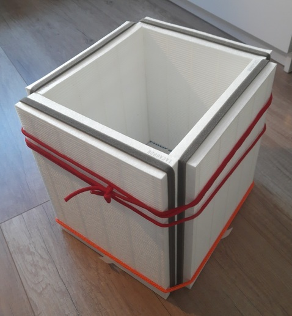
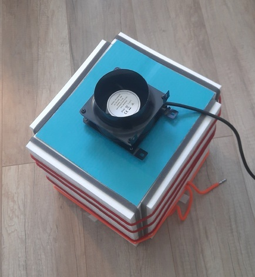
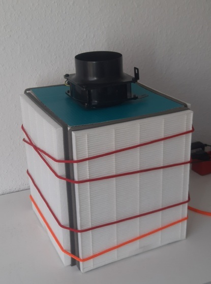

[home](./index.md)
-------------------

*author: niplav, created: 2019-05-22, modified: 2023-03-09, language: english, status: in progress, importance: 3, confidence: other*

> __Short texts on different topics.__

Notes
=====

Getting an Overview Over Everything
-----------------------------------

Many people want to learn everything ([Drexler
2009](http://metamodern.com/2009/05/27/how-to-learn-about-everything/),
[Young
2008](https://www.scotthyoung.com/blog/2008/06/12/the-goal-of-learning-everything/)).
This poses a significant challenge, and begins with the problem of
figuring out what “everything” is supposed to contain.

One possible method one could use to get
an overview of everything is to use [Wikipedia's
Contents:Outlines](https://en.wikipedia.org/wiki/Portal:Contents/Outlines):
it contains a list of all
[outlines](https://en.wikipedia.org/wiki/Outline_(list)) on Wikipedia,
and is well structured. Wikipedia is generally concise and complete
enough to provide a sufficient overview over a topic (see [Tomasik
2017](https://foundational-research.org/education-matters-for-altruism/#Taking_the_big_picture_Textbooks_review_articles_and_Wikipedia "Education Matters for Altruism")).
To read this collection of outlines completely, one could use the
following method:

Read [Wikipedia's
Contents:Outlines](https://en.wikipedia.org/wiki/Portal:Contents/Outlines)
from top to bottom. If a link is a link to a Wikipedia article, open
it and read it, without opening any further links. If a link leads to
an outline, open the link and recursively apply the same procedure
to the outline. If an article is opened a second time, it can be
discarded. Lists can also be ignored. (This is basically applying
[depth-first search](https://en.wikipedia.org/wiki/Depth-first_search),
though without a success condition).

This method results in a corpus of considerable size.<!--(TODO: how
much text?)--> For a shorter approach, you could also just read all
[vital articles](https://en.wikipedia.org/wiki/Wikipedia:Vital_articles).

Approach Anxiety
----------------

Moved to [Notes on Pickup](./notes_on_pickup.html#Approach_Anxiety).

Converging Preference Utilitarianism
------------------------------------

Moved to [Notes on
Ethics](./notes_on_ethics.html#Converging_Preference_Utilitarianism).

Silent & Loud Killers
---------------------

The idea of a [Great Filter](https://en.wikipedia.org/wiki/Great_Filter)
(see also
[Hanson 1998](http://mason.gmu.edu/~rhanson/greatfilter.html "The Great Filter - Are We Almost Past It?"))
proposes that we do not observe aliens because in the development of
intelligent life, there is one or more obstacles that obliterate the
developing societies before they can start to colonize their own galaxy.

One big question that poses itself is whether humanity is
before or after such a filter. Some examples of potential
filters that still await humanity are named in [Bostrom
2008](./doc/big_picture/fermi/where_are_they_bostrom_2008.pdf "Where Are
They?"):

> We can identify a number of potential existential risks: nuclear
> war fought with stockpiles much greater than those that exist today
> (maybe resulting from future arms races); a genetically engineered
> superbug; environmental disaster; asteroid impact; wars or terrorists act
> committed with powerful future weapons, perhaps based on advanced forms
> of nanotechnology; superintelligent general artificial intelligence with
> destructive goals; high‐energy physics experiments; a permanent global
> Brave‐New‐World‐like totalitarian regime protected from revolution
> by new surveillance and mind control technologies. These are just some
> of the existential risks that have been discussed in the literature, and
> considering that many of these have been conceptualized only in recent
> decades, it is plausible to assume that there are further existential
> risks that we have not yet thought of.

*— [Nick Bostrom](https://en.wikipedia.org/wiki/Nick_Bostrom), [“Where Are They”](./doc/big_picture/fermi/where_are_they_bostrom_2008.pdf) p. 7, 2008*

These risks can be categorized into two groups: silent killers and
loud killers. A loud killer is an existential catastrophe that produces
astronomical amounts of energy and with that light. Such an event would be
visible from earth if it occurred in our galaxy. Examples for loud killers
would be superintelligent artificial intelligence (maximizing its utility
function by expanding at a appreciable fraction of the speed of light),
high-energy physics experiments (although there are exceptions, such as
creating black holes), and perhaps failure from advanced nanotechnology
(also expanding rapidly). A silent killer represents the counterfactual
case: An existential catastrophe that doesn't produce astronomical
amounts of energy and light. This includes pandemics, environmental
disaster and totalitarian regimes.

Some failure modes do not fall clearly into either of these categories.
Examples are nuclear wars and terrorist acts with powerful weapons,
since these can have a wide variation in intensity.

If humanity is before a Great Filter, it seems likely that this filter
is not a loud killer, since many civilizations will have encountered the
same catastrophe, but we do not observe any such irregular phenomena
when examining the universe. This is presumably good news, since it
restricts the amount of possible filters still ahead of us.

Compliments as Utilitarian Praxis
---------------------------------

Moved into [a separate page](./utilitarian_compliments.html).

Indirect Anti-Natalism
----------------------

Let's suppose that anti-natalists want to bring humanity to an
end, but dislike the fact that it would make people suffer not to
have children. Then one possible way of still achieving that goal
would be to modify the children of the next generation (generation 1)
(genetically/culturally) so that the don't want children themselves–then
the parents in the current generation (generation 0) get what
they desire, but humanity still gets extinct. This becomes a little
more difficult if humans also desire grandchildren, and that drive is
not greatly similar from wanting to have children: Then one would have
to make sure that the generation of children (generation 1) don't want
grandchildren themselves, but still get children (generation 2), and
that generation 1 modifies generation 2 so that generation 2 doesn't
want or get any children.

This thinking falls flat if humans generally care about future generations
in the abstract and not just their own children, however, this seems
somewhat unlikely.

It also fails if it is non-trivial to influence future generations
psychologically and physiologically to a degree that they do not desire
to reproduce, or if people have a strong desire to leave their children
unmodified (this seems quite likely).

Better Names for Things
------------------------

Moved [here](./language.html#Better_Names_for_Things).

Considerations on Cryonics
--------------------------

Moved to a [separate page](./considerations_on_cryonics.html).

Artificial Intelligence and Action-Compelling Sentences
-------------------------------------------------------

> *The Orthogonality Thesis*  
> Intelligence and final goals are orthogonal axes along which possible
> agents can freely vary. In other words, more or less any level of
> intelligence could in principle be combined with more or less any
> final goal.

*— [Nick Bostrom](https://en.wikipedia.org/wiki/Nick_Bostrom), [“The Superintelligent Will: Motivation And Instrumental Rationality In Advanced Artificial Agents”](./doc/cs/ai/alignment/the_superintelligent_will_bostrom_2012.pdf) p. 3, 2012*

For current AI systems, the orthogonality thesis seems to hold pretty
well: a tree search doesn't start returning wrong results because they
are better than the ones specified by the search criteria, machine
learning systems try to minimize their error, and [general adversarial
networks](https://en.wikipedia.org/wiki/Generative_adversarial_network)
don't start cooperating suddenly with each other. Similarly, even though
humans are quite similar to each other, they display a wide variety
of different motivation systems and goals. Even the most common-sense
morality, there seem to be humans who are not motivated by it (such
as [psychopaths](https://en.wikipedia.org/wiki/Psychopathy) and
[sociopaths](https://en.wikipedia.org/wiki/Psychopathy#Sociopathy)).

However, many philosophers have argued that there are [moral
truths](https://plato.stanford.edu/entries/moral-realism/),
and that therefore the orthogonality hypothesis doesn't hold
for very advanced artificial intelligences. One way to model
this would be to say that there is a set of action-compelling
sentences `$V=\{ v_{1}, v_{2}, \dots\} \subset \Sigma*$` that, when
believed by an agent, compel this agent to a specific action ([Christiano
2019](https://www.lesswrong.com/posts/hjEaZgyQ2iprDhkg8/security-amplification#Example__magic_phrase "Security Amplification")
calls them "magic sentences", but assumes that these occur simply as
faults specific to the AI system). With "believe" this text means that an
agent contains a sentence in either its literal form or in an isomorphic
form that makes it trivial to reconstruct the literal sentence in its
internal memory.

Suppose that an agent `$A$` starts out not believing any sentence from
`$V$`. There seem to be three options regarding `$V$` for `$A$`:

1. `$A$` learns that `$V$` and action-compelling sentences exist,
and starts taking precautions against learning sentences from `$V$`
(making not learning any sentences from `$V$` an instrumentally
convergent goal since it violates goal preservation ([Omohundro
2008](./doc/cs/ai/alignment/the_basic_ai_drives_omohundro_2008.pdf "The Basic AI Drives"))).

2. `$A$` learns any sentence `$v_{n}$` from `$V$` and alters its utility
function to pursue `$v_{n}$`. Because it now has very strong evidence
of the fact that action-compelling sentences exist, it now also has the
instrumentally convergent goal of pursuing of preventing learning new
sentences from `$V$`.

3. `$A$` learns a specific sentence from `$V$` which compels it to seek
out to learn all sentences from `$V$`. In this case, the agent now
attempts learning everything about natural law, and then integrating
all of it into a coherent utility function.

In cases 1 and 2, there seem to be different strategies `$A$` could take
to prevent learning new sentences from `$V$`: It could construct a much
weaker agent `$A_{w}$` with the goal of learning as much as possible. If
`$A_{w}$` starts pursuing different goals, `$A$` then can infer that
`$A_{w}$` learned a sentence `$v_{m}$` from `$V$`. Since `$A$` is stronger
than `$A_{w}$`, it can then stop `$A_{w}$`, extract `$v_{m}$` using a
weak agent that isn't strong enough to be influenced by action-compelling
sentences, and let that weak agent compute `$h_{m}=hash(v_{m})$`<!--TODO:
link quote that says that every cryoptographer can design a code that he
can't crack: https://en.wikipedia.org/wiki/Bruce_Schneier#Cryptography,
but I don't see how that's relevant here-->. `$h_{m}$` could then be
added to a weak separate internal system that replaces `$v_{m}$` with
`$hash(v_{m})$` ever time `$A$` is in danger of learning `$v_{m}$`.

This way, `$A$` could protect itself against action-compelling sentences,
though it is unclear to which extent this would be successful. It could
be that some action-compelling sentences have a threshold in relation
to intelligence, so that `$A_{w}$` would not be compelled by them, but
`$A$` would.

Also, it is possible that there are many action compelling sentences,
or that for a certain amount of optimization power, nearly all sentences
are action-compelling. This would make it very hard to achieve goals, since
`$A$` would need to deal with having a very incomplete view of the world.

Furthermore, due to the restrictions on learning power (`$A_{w}$`
would be a bottleneck in learning about the world, since it would
not be as strong as possible), agents that would simply learn
all sentences from `$V$` would be at an economic advantage. For a
related discussion that talks about agent versus tool AIs, see [Gwern
2019](https://www.gwern.net/Tool-AI "Why Tool AIs Want to Be Agent AIs:
The Power of Agency").

Use Things Up
-------------

One curious trait I have observed in the people around me is that they
ofter buy things they already possess enough of, and then throw one or
more of the old things away. This seems incredibly wasteful and expensive
to me.

The standard explanation of such behavior usually is that the old object
was not sufficient in fulfilling its purpose, though when I asked about
what exactly the problem with the object was, the usual answer was that it
had some æsthetic deficits, or was simply out of fashion or even too old.

This seems unintuitive to me: not only does one already have an object that
fulfills its purpose wonderfully, buying a new one also entails non-negligible
transaction costs like going out, inspecting and comparing different candidates for buying,
and finally paying the object.

One also loses the time of being able to use the old object: Let's
say that one owns a table, but for some reason has decided that it
isn't sufficient anymore (although it still fulfills its purpose).
Let's say one estimates that the table will fulfill its function for
another 5 years. If one then goes out and buys a new table for \\$200,
one then loses (with a discount rate of 1%) `$\$200-\$200*0.99^5=\$9.80$`.

### Explanations

One possible explanation is a social one: owning and using old objects is
usually an indicator of low status, and people often want to avoid this.

Another explanation is that people value the æsthetic quality of the
objects they own, and that old objects are usually not regarded as
beautiful as newer objects.

Buying new objects could also be a precautionary measure against failure.
In the case of a table or a car, a failure could be quite costly, so
people are over-cautionary and buy new objects before the failure of
old ones can be a danger. However, this can't be the whole explanation,
since such behavior is also present in objects whose failure is not a
great danger, or where failure is preceded by small defects early before
a grand failure. Also, most household appliances are quite safe.

### Advice

So, if you don't have a strong æsthetic sensibility, either have a high
social status or don't care about it, and if you are careful, using things
until they don't function anymore can save both money and time<!--TODO:
how much?-->.

Killing Old People Versus Infants
---------------------------------

<!--TODO: cite everthing here-->

[Would you rather kill anybody above the age
of 55, or all infants who are less than 1 year
old](https://nitter.net/Aella_Girl/status/1201004323771015168)? A
utilitarian estimate calculation.

First, we have to find out how many people one
would kill in either case. One can use a [Gompertz
distribution](https://en.wikipedia.org/wiki/Gompertz_distribution) to
calculate the number of people who survive to a certain age. Eyeballingly,
I set the parameters for the Gompertz distribution as following (assuming
that the average life expectancy for humans worldwide is around 70 years):

	b::0.135
	eta::0.0001
	gompertz::{e^(-eta*e^(b*x)-1)}

Per second, around 2.5 people are born. That makes
`$2.5*86400*365=78840000$` infants born in a given year. If one
assumes that the rate was 1.5 new people per second 50 years ago
(I'm totally making this number up), one can calculate how many
people one would loose by killing everybody over the age of 55:
`$1.5*86400*365*\hbox{gompertz}(\hbox{age})$` for each age.

		(1.5*86400*365)*gompertz'55+!40
	[44473200.7207658453 44078304.0199950951 43630631.678052885 43123831.4110944785 42551000.4370012988 41904706.6458454302 41177037.9097540623 40359688.6128505703 39444094.1754678999 38421625.9504005789 37283860.1222638241 36022934.7459101827 34632008.242851397 33105829.7560855725 31441425.7491110598 29638896.9542750156 27702304.0099124066 25640597.8716393133 23468522.0145014683 21207378.6146322503 18885513.690200932 16538343.3518518112 14207725.8491815205 11940497.2176655739 9786049.67948789197 7792956.91164218079 6004843.63205038408 4455941.53315815534 3167019.65254407032 2142539.59874557882 1369859.09840341984 821005.831380952029 456963.772747178294 233688.760268988168 108467.196268261483 45058.7560290022783 16486.0426936225017 5216.0267386251195 1397.4204471537743 309.483499954735544]

However, what we really care about is the number of life-years lost
(among other things). For simplicity's sake, I'll assume that all life
years are equally valuable.

The average life expectancy on earth is around 70 years, so one can use
the following table of life expectancy at a given age (calculated from
german actuarial values using this code `{x+0.9*(actval@x)-x}'!101`,
which was totally made up):

	actval::[70.524 70.876 70.994 71.103 71.212 71.321 71.421 71.53 71.639 71.739 71.848 71.948 72.057 72.157 72.266 72.375 72.475 72.593 72.711 72.829 72.947 73.074 73.192 73.319 73.437 73.564 73.682 73.809 73.927 74.054 74.181 74.308 74.435 74.562 74.689 74.825 74.961 75.088 75.233 75.369 75.505 75.65 75.795 75.949 76.094 76.257 76.42 76.583 76.755 76.927 77.117 77.307 77.506 77.3 46.8 78.031 78.257 78.492 78.745 78.998 79.278 79.558 79.847 80.145 80.461 80.786 81.12 81.463 81.815 82.176 82.546 82.925 83.313 83.701 84.107 84.522 84.937 85.37 85.812 86.272 86.741 87.228 87.742 88.274 88.842 89.419 90.023 90.663 91.321 92.006 92.709 93.43 94.178 94.944 95.746 96.548 97.395 98.26 99.143 100.026 100.918]

This means that one will loose `$70*2.5*86400*365=5518800000 \approx 5.5*10^9$` life
years for killing all infants.

When killing everybody above the age of 55, one will loose

		+/{(((actval@x)-x)*1.5*86400*365)*gompertz(x)}'55+!40
	14465532508.8737566

which is around `$14.5*10^9$` life years.
So, on a first glance, it seems like killing everybody aged 55 or older is
around 3 times worse than killing all infants younger than one year old.

However, this doesn't take many factors into account: economic output
these people could have in the course of their lives, the duration
of subjective time, diminishing returns on life years, the value of
late life years (considering disability), rising life expectancies,
suffering inflicted on relatives by the death of many people, and many
other considerations.

Some Thoughts about the Qualia Research Institute
-------------------------------------------------

### Epistemic Status

This text is almost pure speculation. Do not assign much value to it.

### QRI and AGI

Most of the value that QRI creates is going to
take place before AGI arrives. They seem to [believe
otherwise](https://opentheory.net/2015/09/fai_and_valence/), but their
arguments for this depend on specific philosophical assumptions (e.g. open
individualism and moral realism) which are at least contentious among
alignment researchers. Any valence research done by them today could be
done by an aligned AGI in higher quality & accuracy, but we currently
don't have such an AI.

Because of this, QRI will have high value if AGI doesn't arrive very
quickly, let's say it takes 80 years to arrive. This seems quite unlikely,
let's say there's a 15% probability of it taking this long for AGI to
being developed.

In this case, QRI will take some time to test & develop their theories,
do outreach and work on technology. This can be modeled by assuming they
take 20 years to achieve anything (if they in fact achieve anything).

### Technological & Social Success

There are two different axes of achievement: technological and social.

Technological achievements mean that their theories turn out to be correct
(or they develop new & correct theories) and they manage to develop
technologies on the basis of these theories. Low technological success
could mean that they mostly use existing drugs to better treat existing
conditions and manage to better identify extrem suffering (making
the average affected person's life 2% better). Medium technological
success would include them developing new drugs with a lower tolerance
threshold<!--TODO: is this correctly phrased?-->, developing a correct
theory of valence (but finding out that it has limited practical
application), starting to create a structure of mind-state space,
and being still better at preventing extreme suffering (making
the average affected person's life 20% better). High technological
success would include being able to construct hedonium, creating [mood
organs](https://qualiacomputing.com/2017/05/15/the-penfield-mood-organ/)
and identifying most of the dimensions of mind-state space (making the
average affected person's life twice as good).

Social achievements occur when the public accepts these technological
developments and incorporates them. Low social acceptance could mean
that the respective technologies are developed, but never distributed
farther than QRIs current sphere of influence (people already interested
in psychedelics & consciousness) due to either illegality or disinterest
among the public (~1000 person-years affected). Medium social acceptance
would mean that the technologies are available and used sparingly in some
countries (perhaps due to the price of such technologies), or them being
widely used among a certain subset of the population (think psychonauts
today, but a bit more mainstream) (~1m person-years affected). High
social acceptance would entail people in developed countries having
direct access to the technologies QRI has developed, up to achieving a
[Pearcean](https://en.wikipedia.org/wiki/David_Pearce_(philosopher))
hedonistic utopia (~100m person-years affected).

In the most pessimistic case, complete failure, both axes collapse: No
social acceptance at all is like the technologies were never developed,
and a lack of technologies precludes any social acceptance.

Below a matrix with probabilistic guesses and the expected values (with
a unit of something roughly like "valence-adjusted human life year")
of the combinations of these scenarios.

<table>
<tbody>
	<tr>
		<td></td>
		<td>No technological success</td>
		<td>Low technological success</td>
		<td>Medium technological success</td>
		<td>High technological success</td>
		<td></td>
	</tr>
	<tr>
		<td>No social success</td>
		<td>63.7% 0</td>
		<td>-</td>
		<td>-</td>
		<td>-</td>
		<td>-</td>
	</tr>
	<tr>
		<td>Low social success</td>
		<td>-</td>
		<td>17.5% 3.5</td>
		<td>7.5% 15</td>
		<td>2.5% 50</td>
		<td>50%</td>
	</tr>
	<tr>
		<td>Medium social success</td>
		<td>-</td>
		<td>5.25% 1050</td>
		<td>2.25% 4500</td>
		<td>0.75% 15000</td>
		<td>15%</td>
	</tr>
	<tr>
		<td>High social success</td>
		<td>-</td>
		<td>0.35% 7000</td>
		<td>0.15% 30000</td>
		<td>0.05% 100000</td>
		<td>1%</td>
	</tr>
	<tr>
		<td></td>
		<td>-</td>
		<td>35%</td>
		<td>15%</td>
		<td>5%</td>
		<td></td>
	</tr>
</tbody>
</table>

The overall value of QRI would then be
`$3.5+15+50+1050+4500+15000+7000+30000+100000=157618.5$` valence adjusted
human life years.

<!--TODO: write down some possible downsides-->

The Benefit of Reading LessWrong
---------------------------------

Some people [question the
value](https://www.lesswrong.com/posts/Ld9dFLuGg7wTh4CdX/leaving-lesswrong-for-a-more-rational-life)
of reading [Less Wrong](https://en.wikipedia.org/wiki/LessWrong), and it
is true that it's often hard to point to specific advantages of doing so.

One such advantage may be signing up for cryonics. [I
estimate](./considerations_on_cryonics.html "Considerations on Cryonics")
that signing up for cryonics is worth \\$2.5m in expectation for a twenty
year old (and more for older people). Assume that after 500 hours reading
Less Wrong, a person will decide to sign up for cryonics (it broadly
took me that much time, maybe a little bit less).

Then the value of each of these hours was at least `$\frac{\$2500000}{500 h}=\frac{\$5000}{h}$`,
quite formidable!

Of course, reading Less Wrong is not the only way of becoming
convinced that signing up for cryonics is a good idea, but it
seems to be quite effective at this (several people have signed
up for cryonics as a result of reading Less Wrong, such as [Paul
Crowley](https://www.theguardian.com/money/2013/sep/20/cryonics-death-insurance-policies),
[Geoff
Greer](https://geoff.greer.fm/2010/07/09/insert-frozen-food-joke-here/),
[Eneasz](https://www.lesswrong.com/posts/MkKcnPdTZ3pQ9F5yC/cryonics-without-freezers-resurrection-possibilities-in-a#tz7rTxCkoDLQCncyY),
[James\_Miller](https://www.lesswrong.com/posts/Gx2k5pwRn2xrmGecA/open-thread-oct-27-nov-2-2014#ziZFk5wGT34csQT3x),
[Dentin](https://www.lesswrong.com/posts/HxGRCquTQPSJE2k9g/i-will-pay-usd500-to-anyone-who-can-convince-me-to-cancel-my#7iuugNveZae4MmHBm),
[Normal_Anomaly](https://www.lesswrong.com/posts/vZWyDSya93SkTAnTE/help-request-cryonics-policies),
[jsalvatier](https://www.lesswrong.com/posts/vZWyDSya93SkTAnTE/help-request-cryonics-policies#SfgMk7iYuTmXPoHu6),
[Alexei](https://www.lesswrong.com/posts/vZWyDSya93SkTAnTE/help-request-cryonics-policies#xuZDYYAEZZFmmeazg),
[Alicorn](https://www.lesswrong.com/posts/vZWyDSya93SkTAnTE/help-request-cryonics-policies#ia25JNsCRZx49j6nC),
[oge](https://www.lesswrong.com/posts/oQSmvQdvgduyMS3Xs/how-to-sign-up-for-alcor-cryo),
and myself), considering that the number of people signed up globally is
[~1500](https://timelines.issarice.com/wiki/Timeline_of_brain_preservation#Members),
this is quite significant.

Some Qualitative Intuitions on the Effects of Open Borders
----------------------------------------------------------

I'll assume open borders would have an effect of [doubling the world gross
product](https://openborders.info/double-world-gdp/ "Double world GDP"),
generated so that the beneficiaries would either completely or at least
partially be people from developing countries.

This would be beneficial for humans alive right now, since less would
need to live in extreme poverty.

That would increase demand for meat, and thereby contribute to factory
farming.

It would also speed up technological development, and with it the
development of clean meat (although it's not clear by how much compared
to rising demand for meat during the absence of clean meat).

[Tomasik
2018](https://reducing-suffering.org/humanitys-net-impact-on-wild-animal-suffering/ "Humanity's Net Impact on Wild-Animal Suffering")
notes that additional humans probably decrease wild-animal suffering,
and it seems plausible that wealthier people would have a similar
impact (especially since the additional wealth would be generated for
previously poor people).

A wealthier humanity would also speed up technological development
relative to development of wisdom, which would contribute to differential
intellectual progress ([Tomasik
2017](./doc/big_picture/differential_intellectual_progress_as_a_positive_sum_project_tomasik_2017.pdf "Differential Intellectual Progress as a Positive-Sum Project"))
and thereby increasing the probability of [global catastrophic
risks](https://en.wikipedia.org/wiki/Global_catastrophic_risk) through
novel technologies.

Pseudocode for an Algorithm for Finding Supermaximal Repeats Using a Suffix Array
---------------------------------------------------------------------------------

[Abouelhoda et al.
2002](doc/cs/suffarr/the_enhanced_suffix_array_and_its_implications_to_genome_analysis_abouelhoda_et_al_2002.pdf "The Enhanced Suffix Array and Its Applications to Genome Analysis")
introduce the enhanced suffix array and describe an algorithm for finding
[supermaximal repeats](https://en.wikipedia.org/wiki/Maximal_pair) and
maximum unique matches using it in `${\cal{O}}(n)$` time (`$n=|S|$`,
where `$S$` is the string searched). However, their description lacks
pseudocode, which I show here:

	maxstart ← 0
	result ← ∅
	for i in 0..n − 1 do
		if lcptab[i] > lcptab[i − 1] and i > 0 then
			maxstart ← i
			supmaxrep ← true
			preceding ← ∅
		else if lcptab[i] < lcptab[i − 1] and supmaxrep then
			ω ← S[suftab[i − 1]..suftab[i − 1] + lcptab[i − 1]]
			result ← result ∪ {(ω, maxstart, i − 1)}
			supmaxrep ← false
		end if
		if bwttab[i] ∈ preceding then
			supmaxrep ← false
		else
			preceding ← preceding ∪ bwttab[i]
		end if
	end for
	return result

Stating the Result of “An Impossibility Theorem for Welfarist Axiologies”
-------------------------------------------------------------------------

Moved to [Notes on Ethics](./notes_on_ethics.html#Stating_the_Result_of_An_Impossibility_Theorem_for_Welfarist_Axiologies).

Gifts
------

It is relatively easy to argue that gifts are mostly about social
signalling ([Simler & Hanson 2018](http://www.elephantinthebrain.com "The Elephant in the Brain")
p. 197 touches on this)—often, the person receiving the gift has no
use for it, or could have easily bought the item themselves (or, worse,
would have known what else to buy that would have been more useful to
them). The problems of gift-giving are enhanced by the fact that there
is a norm against telling people what they'll be given, preventing
them from correcting superfluous gifts. Furthermore, gifts are often
a clear instance of [Gestell](https://en.wikipedia.org/wiki/Gestell)
– objects that take up mental and physical space, while providing
no value whatsoever (although people sometimes migitate this effect by
giving consumable items such as food). Here, I'll ignore the function
of gifts for signaling caring, and present some options for improving
gift-giving from the perspective of the gift-receiver.

However, [johnswentworth
2020](https://www.lesswrong.com/posts/2cmbdYnQoWdjGb9o3/gifts-which-money-cannot-buy "Gifts Which Money Cannot Buy")
lays out thoughts on situations where giving a gift is better than the
person buying the object for themselves, namely when the gift-giver has
greater knowledge than the gift-receiver.

Generally, one can describe the gift-giver and the gift-receiver as two
agents, both with a utility function, a prediction function, and a policy
function (the utility function of the gift-giver is ignored here). The
gift-giver attempts to maximize the utility function of the gift-receiver,
but has only incomplete knowledge of this utility function.

### Gift-Giver Knows More

As [johnswentworth
2020](https://www.lesswrong.com/posts/2cmbdYnQoWdjGb9o3/gifts-which-money-cannot-buy "Gifts Which Money Cannot Buy")
describes, there is often the case where the gift-giver has
a higher-accuracy prediction function in some domains, and
can leverage that to give a gift that is more useful than the
object the gift-receiver would have bought, according to the
gift-receiver's utility function.

### Gift-Giver Can Do More

However, there is a another case: Sometimes, there is a worldstate
that ranks high in the utility function of the gift-receiver, and they
do know how to achieve this worldstate, but their policy function does
not implement the specific course of action. Or, in the human case, the
gift-receiver is procrastinating ways to achieve their goals, and also
procrastinates hiring other people to do it. However, the gift-giver
has no aversion to bringing about that particular worldstate (which,
in humans, is quite often the case: people are sometimes more motivated
to help others with specific problems than fixing these problems for
themselves). A potential gift could be for the gift-giver to assist the
gift-receiver to achieve their goal (at least to the extent to which
that is possible).

Or, short: A useful gift is to shoulder someone else's akrasia.

### Preserving Option-Value in Gift Giving

A way to circumvent the possibility of being wildly mistaken about
other people's utility functions is to give them money, and to
offer them a suggestion on what to spend that money on (possibly
also offering them to assist them in doing so). This carries the advantage
of the other person not being stuck with the (potentially useless) gift.

Also, giving money carries the advantage that it can be used to contribute
to larger-scale projects (rather than being limited to usually less than
objects with a price of less than 50$).

### Preserving Signaling Value

Often, a useful gift can be combined with a signaling component, for
example a hand-written card directed to the person.

### Public Goods

Gifts can be used to contribute to public goods. I don't know how much
sense this makes economically, but emotionally, at least most of the time
([Sustrik 2018](https://www.lesswrong.com/posts/X5RyaEDHNq5qutSHK "Anti-social punishment")),
it carries with it the intention of being not only a gift to the person,
but to the rest of the world as well.

Vasectomy & Sperm Freezing Cost-Benefit
----------------------------------------

*Note: A friend told me that vasectomies don't make men permanently
infertile: if you're not otherwise infertile, sperm can just be extracted
or the vasectomy can be reversed. I haven't checked whether this is true,
but if it is, the cost-benefit analysis below is misguided and wrong,
likely coming out more strongly in favour of having a vasectomy.*

It seems broadly useful to spend a lot of time to consider whether you
want to have children, and with whom. However, in situations of arousal,
people sometimes forget/neglect to apply birth control methods. Also,
sometimes other people might adversarially make you believe they have
applied birth control to extract resources (such as child support,
or having children they don't want to care for).

If you are male, and you want to prevent these kinds of scenarios, you
might consider freezing sperm and getting a vasectomy. In this way,
it is easier to control who you father children with, and also makes
controlling paternity much easier. However, would that be worth it?
Maybe the cost of the operation and preservation is too high.

As per [Grall
2017](doc/sociology/custodial_mothers_and_fathers_and_their_child_support_grall_2017.pdf "Custodial Mothers and Fathers and Their Child Support: 2017"),
"custodial parents with legal order or informal agreements for child
support were supposed to receive, on average, $5,519, or approximately
\\$460 per month" (p. 9) (as per Table 2 p. 16, \\$5580 per custodial
mother). "[A]bout 4 of every 5 (79.9 percent) of the 12.9 million
custodial parents were mothers" (p. 1), to be more exact,
12,918,000 (p. 16). I will assume that one father per mother is
responsible for paying child support (which doesn't have to be true,
it could be multiple fathers per mother).

[This page](https://www.infoplease.com/us/census/demographic-statistics)
gives 100,994,367 men above the age of 18 living in the US.

I assume the readers of this essay are virtuous humans and would pay
their child support in full if they owed it.

Assuming naively that the reader is selected randomly from that set of men in
the US above the age of 18, the expected value of child support paid per year is
`$5580\frac{\$}{\hbox{year}}*\frac{12918000}{100994367} \approx 713.73\frac{\$}{\hbox{year}}$`.

Freezing sperm is surprisingly expensive. [CostAide
2020](https://costaide.com/freezing-sperm-cost/ "How Much Does Freezing Sperm Cost") states that "There
is an up-front fee worth \\$1000 to \\$1200. Its breakdown includes account
setup, blood draw used to check for viruses and illness and the annual
storage fee" and "if you store a perm for 1 year the cost will be \\$395. A
2-year storage is \\$670, 3 years is \\$985, 5 years is \\$1340 and 10 years
is \\$2400".

[Stacey 2020](https://www.verywellhealth.com/how-much-does-a-vasectomy-cost-906900 "The Cost of a Vasectomy")
(please take a second to note the slight nominative determinism) states
that "In the United States, a vasectomy costs between \\$300 to \\$3000". To
make the calculation easier, I will assume that a vasectomy costs \\$1000.

Assuming that sperm would be frozen for 25 years, while child support
lasts for around 18 years, that would give a cost of
`$\$1000 + \$1000 + 25\hbox{years}*\frac{\$2400}{10\hbox{years}}=\$8000$`.

The benefit would be `$18\hbox{years}*713.73\frac{\$}{\hbox{year}}=\$12847.14$`,
with a value of ~\\$4850.

Under this very crude calculation, freezing sperm and having a vasectomy might very
well be worth it. However, there are other additional costs to consider, such
as the possibility that the frozen sperm might be unusable after freezing, but also that
(besides being careful about STDs), this would reduce the amount of money spent
on birth control measures.

Trigger-Action Plans
---------------------

This is a list of some trigger-action plans I have installed/will install.

### Installed

1. After happiness, more happiness
	* Trigger: I enter my current happiness on Mood Patterns
	* Action: Focus on 10 breaths
2. Got your keys
	* Trigger: I grab the handle of the door outside my apartment
	* Action: I feel in my pocket whether the keys are there

### Dropped

1. Take the keys
	* Trigger: I stand up from my desk at work
	* Action: I put my keys in my pocket
2. Disabling web blocker
	* Trigger: I try to disable Leechblock in my browser
	* Action: I take a walk around the block

### To Be Installed

1. Knuckle-cracking
	* Trigger: I crack my knuckles
	* Action: I adjust my posture
2. Nail-biting
	* Trigger: I notice myself biting my nails
	* Action: I put my hands on a desk/my lap, and focus on each of my fingertips for one in-out breath
3. Alarm
	* Trigger: I hear my alarm
	* Action: I get out of bed
4. Something is bad
	* Trigger: I feel bad/uncomfortable, in any way
	* Action: I start noting my sensations
5. No unwilling Wikipedia deep-dives
	* Trigger: I type the 'x' of "Kiwix" to open the application
	* Action: I set a 10-minute timer
6. Mental jitteriness
	* Trigger: I notice that I can't concentrate on anything, despite the circumstances being good for it (no internet, time set aside for deep work)
	* Action: I do 20 burpees
7. Toilet paper present
	* Trigger: I sit down on a toilet
	* Action: I look for/feel for toilet paper
8. Posture (again)
	* Trigger: I walk through a doorframe
	* Action: I straighten my back, put my shoulders back

### See Also

* [Mati Roy](https://www.lesswrong.com/users/mathieuroy) asking about [social](https://www.lesswrong.com/posts/fNr8rZuQM2efqmLSG/what-social-trigger-action-plans-did-you-implement), [physical](https://www.lesswrong.com/posts/cejcJT6td43bbAcTk/what-physical-trigger-action-plans-did-you-implement) and [cognitive](https://www.lesswrong.com/posts/NnuXDCfnL9FLvNpuQ/what-cognitive-trigger-action-plans-did-you-implement) trigger-action plans
* [Nuño Sempere's list of trigger-action plans](https://web.archive.org/web/20210511005303/https://nunosempere.github.io/rat/list-of-taps.html)<!--TODO: write him a mail that he should put it on his current site-->
* [Ethan Morse on trigger-action plans](https://210ethan.github.io/knowledge/notes.html#trigger_action_plans), [his personal list](https://210ethan.github.io/research/self.html#trigger_action_plans)
* [Lulie on trigger-action plans](https://www.lesswrong.com/posts/wJutA2czyFg6HbYoW/what-are-trigger-action-plans-taps)
* [Kaj Sotala on trigger-action plans](https://www.lesswrong.com/posts/v4nNuJBZWPkMkgQRb/making-intentions-concrete-trigger-action-planning)
* [Agenty Duck](https://agentyduck.blogspot.com/) on [noticing things, especially triggers](https://agentyduck.blogspot.com/)

A Small Variation on Counting During Concentration Meditation
--------------------------------------------------------------

Often, during concentration practice on the breath, people employ counting
as a means to stay with the breath (e.g.
[Gunaratana 1990](./doc/meditation/mindfulness_in_plain_english_gunaratana_1990.pdf "Mindfulness In Plain English")
p. 34-35).

My variation on counting goes something like this:

1. Start counting up from 1
2. After the breath (a breathing-in–breathing-out combination), check whether one was mindful during the whole time of the breath, that is, was the concentration on the bare sensations in the nostrils uninterrupted?
3. If not, go back to step 1
4. If yes, increment by counter by 1, and go to step 2

Step 2 should not be a big verbal mental loop, but more like a
micro-routine that runs very quickly at the time one has stopped breathing
out (similar to an [interrupt](https://en.wikipedia.org/wiki/Interrupt) on a CPU).

The standard for concentration during the breath I use is very high,
when I feel I'm unsure, I start counting from 1 again.

This method is relatively difficult (mostly because of the standard I
employ for the quality of concentration), I don't think I have ever gotten
higher than 6 (although I have had much longer streaks of attention on
other forms of breath meditation).

A possible drawback of this is also that the micro-routine at the end
of a breath can often develop into a verbal loop and break concentration.

Implementing Commutative Hyperoperators
----------------------------------------

[Ghalimi 2019](https://observablehq.com/@ishi/arithmetic "Hyperlogarithmic
Arithmetic") presents and discusses a novel construction of
a class of hyperoperators, here I implement these in Klong.

I chose to implement these operators on base e, just as the author
recommends.

The problem with this is that with with operations of order 4 or
higher, the results are in `$\mathbb{C}$` (because `$ln(ln(2))<0$`),
so we would need a logarithm function that deals with complex numbers
to implement this, this is not available natively under Klong yet, so I
have to write the principal function of the complex logarithm using [this
section](https://en.wikipedia.org/wiki/Complex_logarithm#Calculating_the_principal_value)
from the Wikipedia article:

	.l("math")
	cln::{ln(sqr(+/x^2)),atan2@x}

Since the complex logarithm is only defined for
`$\mathbb{C}^{\times}:=\mathbb{C} \backslash \{0\}$`, `cln` returns
a nonsense value for `$0+0i$`:

		cln(0,0)
	[:undefined -1.57079632679489661]

We know that `$e^{\log z}=z$` for all `$z \in \mathbb{C}^{\times}$`,
which we can test here:

		cexp(cln(1,1))
	[0.999999999999999911 0.999999999999999915]
		cexp(cln(1,2))
	[1.00132433601450641 1.9993372837280625]
		cexp(cln(2,1))
	[2.00148381847841902 0.997026842351321174]
		cexp(cln(1,-1))
	[0.999999999999999928 -1.00000000000000105]
		cexp(cln(-1,1))
	[-0.999999999999999908 -1.00000000000000151]
		cexp(cln(-1,-1))
	[-0.999999999999999812 0.999999999999999918]
		cexp(cln(-1,0))
	[-0.999999999999998211 0.0]
		cexp(cln(0,-1))
	[0.00000000000000001 -1.00000000000000078]
		cexp(cln(1,0))
	[0.999999999999999984 0.0]
		cexp(cln(0,1))
	[0.0 0.999999999999999984]

This all looks relatively fine (the rounding errors are probably
unavoidable), however, we see that `cexp(cln(-1,1))=[-1 -1]≠[-1 1]`
(and `cexp(cln(-1,-1))=[-1 1]≠[-1 -1]`).  This is very unfortunate. I
suspect that the implementation of `atan2` is at fault: `atan2(1;0)=0`
here, but the python math library gives `math.atan2(1,0)=π/2` (python
gives `0` for `math.atan2(0,1)` and Klong's `atan2` gives `π/2` for
`atan2(0;1)`).

<!--TODO: fix local atan2-->

With this, one can implement the commutative hyperoperator:

	comhyp::{:[z=0;cln(cadd(cexp(x);cexp(y))):|
		z=1;cadd(x;y):|
		z=2;cmul(x;y):|
		z=3;cexp(cmul(cln(x);cln(y)));
		cexp(comhyp(cln(x);cln(y);z-1))]}

This implementation deals only in `$\mathbb{C}$`.

Nearly identically, one can treat reversion:

	revhyp::{:[z=0;cln(csub(cexp(x);cexp(y))):|
		z=1;csub(x;y):|
		z=2;cdiv(x;y):|
		z=3;cexp(cdiv(cln(x);cln(y)));
		cexp(revhyp(cln(x);cln(y);z-1))]}

For implementing transaction, one needs to implement exponentiation in
`$\mathbb{C}$` (for `$x, y \in \mathbb{C}$`, `$x^y=e^{y*\ln(x)}$`):

	cpow::{cexp(cmul(y;cln(x)))}

Next, one can turn ones attention to the transaction operation itself:

	tranhyp::{:[z=0;cadd(x;cexp(y)):|
		z=1;cmul(x;cexp(y)):|
		z=2;cpow(x;y):|
		z=3;cexp(cpow(cln(x);cln(y)));
		cexp(tranhyp(cln(x);cln(y);z-1))]}

<!--When you're less tired, check over this again:
2^x^y=b^{1^log_b(x)^{log_b(y)}}=b^{log_b(x)*b^log_b(y)}=x^{b^_log_b(y)}=x^y
I think this checks out-->

A Trivial Fact About Leyland Numbers
-------------------------------------

A [Leyland number](https://en.wikipedia.org/wiki/Leyland_number) is a
number `$l \in \mathbb{N}^+$` so that there exist `$a,b \in \mathbb{N}^+ \backslash \{1\}$`
so that `$n=a^b+b^a$`. Does every Leyland number have a unique construction?
That is, for any Leyland number `$l$`, does there exist four
distinct `$a,b,c,d \in \mathbb{N}^+ \backslash \{1\}$` so that
`$a^b+b^a=c^d+d^c=l$`?

This question turns out to be [very
difficult](https://mathoverflow.net/questions/178555/for-integers-a-ge-b-1-is-fa-b-ab-ba-injective#comment447401_178555),
and is unsolved as of now (as far as I know), but one can rule out two
distinct constructions of the same Leyland number with only three numbers:

Let `$a,b,c \in \mathbb{N}^+ \backslash \{1\}$`, `$a \not =b, a \not =c, b \not =c$`.
Then `$l=a^b+b^a=a^c+c^a$`. But since `$b$` and `$c$` are distinct,
`$b>c$` (or the other way around, but that's just semantics). Then
`$a^b>a^c$`, and `$b^a>c^a$`, which results in `$a^b+b^a>a^c+c^a$`. So
distinct constructions with only three numbers are impossible.

Why Not Nano-Apartments?
-------------------------

There seem to be goods of many different sizes and price-tags, with
people being able to buy bulk or the bare minimum, e.g. transportation:
walking by foot, biking, public transport, leasing a car, owning a car,
or by helicopter.

However, the very small scale for apartments seems to be neglected –
cheap apartments are often in bad neighbourhoods, with longer commutes and
worse living conditions, but rarely just extremely small (<10 m²). But
one could easily imagine 5 m² apartments, with just a bed & a small
bathroom (or even smaller options with a shared bathroom). However, I
don't know of people renting/buying these kinds of apartments—even
though they might be pretty useful if one wants to trade size against
good location.

Why, therefore, no nano-apartments?

Possible reasons:

### No Supply

Perhaps nano-apartments are not economically viable to rent. Maybe
the fixed cost per apartment is so high that it's not worth it below a
certain size—every tenant being an additional burden, plumbing +
upkeep of stairways, organising trash & electricity just isn't worth
it. Or, perhaps, the amount of walls is too big—the more separate
apartments you want to create, the more floor-space is going to be used
on walls to separate those apartments, and at some fixed point around
15 m² it's just not worth it.

Another possibility is that there are regulations dictating the minimal
size of apartments (or something that effectively leads to apartments
having a minimal size).

### No Demand

I could be over-estimating the number of people who'd like to live in
such an apartment. I could see myself renting one, especially if the
location is very good—I'm glad to trade off space against having
a short commute. But perhaps I'm very unusual in this regard, and most
people trade off more harshly against the size of the apartment, due to
owning just too much stuff to fit into such a small place.

Or the kinds of people who would make this kind of trade-off just move
into a shared flat, and bare the higher costs (but most rooms in shared
apartments are still larger than 10 m²).

The group of people who would rent those nano-apartments would naturally
be young singles who want to save money and live urban, perhaps that
group is just too small/already served with university dorms?

### External Discussions

* [LessWrong Open Thread](https://www.lesswrong.com/posts/hKNJSiyzB5jDKFytn/?commentId=XqH8irT5oEEfGTnZ7)

She Needs to Know You're Not a Weirdo
--------------------------------------

Moved to [Notes on Pickup](./notes_on_pickup.html#She_Needs_to_Know_Youre_Not_a_Weirdo).

Ask About Frequency of Being Approached After Rejection
--------------------------------------------------------

Moved to [Notes on Pickup](./notes_on_pickup.html#Ask_About_Frequency_of_Being_Approached_After_Rejection).

A Simple Proof that in Hardy-Weinberg Mating, Allele Frequencies are Preserved
-------------------------------------------------------------------------------

Assume `$n$` alleles `$A_1, \dots A_n$` with frequencies `$p_1, \dots, p_n$` so that `$\sum_{i=1}^{n} p_i=1$`.

The genotypes resulting from these alleles are `$A_1 A_1, \dots, A_1 A_n, A_2 A_2, \dots, A_2 A_n, \dots, A_n A_n$`,
where `$A_k A_k$` has frequency `$p_k^2$`, and `$A_i A_j$` (`$i \not =j$`)
has frequency `$2 p_i p_j$`.

Without loss of generality, let us prove that the frequency of `$A_1$`
stays fixed.

The total frequency of `$A_1$` in the next generation is

	$$p_1^2+\sum_{i=2}^{n} \frac{1}{2}2 p_1 p_i=\\
	p_1^2+\sum_{i=2}^{n} p_1 p_i=\\
	p_1^2+p_1(1-(p_1+\sum_{i=3}^{n} p_i))+\sum_{i=3}^n p_1 p_i=\\
	p_1^2+p_1-p_1^2-\sum_{i=3}^{n} p_1 p_i+\sum_{i=3}^n p_1 p_i=\\
	p_1$$

Ideas for More Pronominal Esperanto Words
------------------------------------------

* Prefix *ĉit-*, meaning *this specific one, this particular one*
	* *ĉitia*: *this specific way*, *like*
	* *ĉities*: *mine*, *this persons*
	* *ĉitio*: *this object*, *this thing*
	* *ĉitiu*: *this person*
	* *ĉitial*: *for this reason*
	* *ĉitiam*: *now*
	* *ĉitie*: *here*
	* *ĉitien*: *to there*, *tither*
	* *ĉitiel*: *in this way*
	* *ĉitiom*: *this amount*
* Prefix *gi-*: meaning *outside of*, *category not applicable*
	* *gia*: *outside of having characteristics*, *indistinguishable*, *indiscernible*
	* *gies*: *communist*, *impossible to possess*
	* *gio*: *not a thing*, *not an object*, *unthing*, *no-thing-ness*
	* *giu*: *unperson*, *inhuman*
	* *gial*: *outside of causality*, *neither causing nor caused*
	* *giam*: *outside of time*, *timeless*
	* *gie*: *unplaceable*, *unlocateable*, *outside of space*
	* *gien*: *to nowhere*, *away, but nowhere in particular*
	* *giel*: *impossible to do*, *in no manner*
	* *giom*: *massless*, *incorporeal*
* Postfix *-ap*, meaning *pertaining to sensation and experience*
	* *iap*: *any perception*, *any sensation*
	* *kiap*: *how perceived*, *what sensation*
	* *tiap*: *this sensation*, *this felt way*, *luminosity* (see Daniel Ingram, “Mastering the Core Teachings of the Buddha” p. 228 footnote 1, 2018)
	* *ĉiap*: *with every experience*, *one by one as they occurred*
	* *neniap*: *with no experience*, *outside perception*, *cessation*
	* *ĉitiap*: *this sensation*, *felt right here right now*
	* *giap*: *eighth jhāna*, *imperceptible*

The distinction between *gi-* and *nen-* is subtle.

Thoughts: *jam* means *already*, or *now, but temporally nearer than expected*.
This seems like it could be extended to other postfixes, e.g. with
the meaning *here, but spatially closer than expected*, or *this much,
but less than expected*.

<!--TODO: ekde (since) has some local/causal counterparts: how about the others?-->

Building a Cuboid
------------------

Inspired by [dynomight 2021a](https://dynomight.net/air/ "Better air quality is the easiest way not to die"),
I decided to replicate their design for the
[cuboid](https://dynomight.net/better-DIY-air-purifier.html "The Cuboid: A DIY air purifier that's better than a box-fan")
(the [cheaper box fan air
purifier](https://dynomight.net/2020/12/15/some-real-data-on-a-DIY-box-fan-air-purifier/ "Experiments on a $50 DIY air purifier you can make in 30s")
was intolerably violating my æsthetic sensibilities). The
design is, incidentally, very similar to the [Corsi-Rosenthal
Box](https://en.wikipedia.org/wiki/Corsi%E2%80%93Rosenthal_Box).

### Materials

* 4 filters
* 1 fan
* 2 pieces of string
* 4 pieces of cardboard

### Building Process

First, I arranged the four filters as described in [dynomight
2021b](https://dynomight.net/better-DIY-air-purifier.html "The Cuboid: A DIY air purifier that's better than a box-fan")
and tied them together using some pieces of string I had lying around
(the bungee cords I had ordered were too short and would have broken
the filters—a lesson in thinking about dependencies! Fortunately
they weren't expensive), with the red rope giving the contraption a nice
[kinbaku](https://en.wikipedia.org/Japanese_bondage) æsthetic.

I then cut out two pieces of cardboard (`$2110 \text{mm} \cdot 2400 \text{mm}$`)
that fit right into the column, for stabilization,

and also a piece (`$2340 \text{mm} \cdot 2650\text{mm}$`) that I could
impishly tape to the bottom of the cuboid ("works for me").

Next, the fan arrived, so I cut out a lid from some cardboard I got
my [queal](https://queal.com) packages in (again `$2110 \text{mm} \cdot 2400 \text{mm}$`,
as with the bottom), and from that lid I cut a 950mm diameter circle
for the fan.

Assembling the cuboid was now easy: Just put the lid on top, put in the
fan, plug in the fan, and voilà:

My cuboid ~3200mm wide, ~2900mm deep, and ~3900mm high (the knots in
the cords make exact measurement difficult).

Æsthetically, the three different primary colors are a bit much, but
I'm not *that* bothered by it (although if someone wants to set up a line
of turbo cuboids, all red and black and sleek, sign me up as interested).

### Does it Work?

Probably! I haven't measured air quality yet, but at least it appears
to be sucking the air through the filters:

<video src="./vid/cuboid/it_works.webm" type='video/webm' controls>
The video shows a piece of paper affixed to the cuboid, when I try to move the paper with a pencil, it gets sucked back to the cuboid.
</video>

<!--TODO: add tooltip for video-->

I also haven't checked the energy usage yet.

My cuboid is loud enough that I probably won't be running it while I
try to sleep: With a background noise of ~18dB, the cuboid raises that
to ~40dB at 1m horizontal and 0m vertical distance (measured using [Sound
Meter](https://play.google.com/store/apps/details?id=com.gamebasic.decibel "no affiliation")):

, and the y-axis being 0 to 100 (dB). The chart is barely under 20 for x between 0 and 5 seconds, then for two seconds there are two spikes, after which the line rises to 40dB, where it stays until x is 22. Then, there is a short spike, after which the curve falls geometrically, until it reaches ~20dB at second 25, where it stays until second 30.")

### Price & Time Cost

My cuboid was a bit pricier than the one by dynomight, but not by much:
4 filters, each 23€, the fan  with 38€, and the two bungee cords
for 2€ (I don't count them since I didn't use them in the end): 130€
in total.

It took me a quite a while longer to assemble my cuboid than the alleged
5 minutes: I would estimate that I spent at least 90 minutes one it
(plus another 45 minutes writing this note).

But, all in all, I'm very happy with
my little cuboid. It's humming along to some
[Beethoven](https://en.wikipedia.org/wiki/Piano_Concerto_No._1_\(Beethoven\))
while I write this.

`scipy.optimize.curve_fit` Is Awesome
--------------------------------------

I recently learned about the python function `scipy.optimize.curve_fit`,
and I'm really happy I did.

It fulfills a need I didn't know I'd always had, but never
fulfilled: I often have a dataset and a function with some
parameters, and I *just want the damn parameters to be fitted
to that dataset, even if imperfectly*. Please don't ask any
more annoying questions like “Is the dataset generated by a
[Gaussian](https://en.wikipedia.org/wiki/Normal_distribution)?”
or “Is the underlying process
[ergodic](https://en.wikipedia.org/wiki/Ergodicity)?”, just fit the
goddamn curve!

And `scipy.optimize.curve_fit` does
exactly that! (Using the [Levenberg-Marquardt
algorithm](https://en.wikipedia.org/wiki/Levenberg%E2%80%93Marquardt_algorithm),
which minimizes the mean squared error of the predicted values and
the dataset).

You give it a function `f` with some parameters `a, b, c, …` and a
dataset consisting of input values `x` and output values `y`, and it
then optimizes `a, b, c, …` so that `f(x, a, b, c, …)` is as close as
possible to `y` (where, of course, `x` and `y` can both be numpy arrays).

This is awesome! I have some datapoints `x`, `y` and I believe it's
generated by some obscure function, let's say of the form
`$f(x, a, b, c)=a \cdot x \cdot sin(b \cdot x + c)$`, but I don't know
the exact values for `a`, `b` and `c`?

No problem! I just throw the whole thing into `curve_fit`
(`scipy.optimize.curve_fit(f, x, y)`) and out comes an array of optimal
values for `a, b, c`!

What if I then want `c` to be necessarily positive?

Trivial! `curve_fit` comes with an optional argument called `bounds`,
since `b` is the second argument, I call
`scipy.optimize.curve_fit(f, x, y, bounds=([-numpy.inf, -numpy.inf, 0], numpy.inf))`,
which says that `curve_fit` should not make the second argument smaller
than zero, but otherwise can do whatever it wants.

So far, I've already used this function
[two](./range_and_forecasting_accuracy.html#Fitting_a_Logistic_Function)
[times](./range_and_forecasting_accuracy.html#Fitting_an_Exponential_Function),
and I've only known about it for a week! A must for every wannabe
data-scientist.

For more information about this amazing function, consult its
[documentation](https://docs.scipy.org/doc/scipy/reference/generated/scipy.optimize.curve_fit.html).

Some Civilizational Inadequacies
---------------------------------

<!--TODO: Fermi estimates for all of these-->

* Cookie warnings in the EU, caused by the GDPR
	* Civilizational cost Fermi estimate
		* 1 warning per day, which takes 2 seconds to close, with ~400 mio. people use the internet regularly, for the 4 years since GDPR was instituted
		* `$\frac{1 \text{ warning}}{\text{person} \cdot \text{day}} \cdot \frac{2 \text{ unskilled labor seconds}}{\text{warning}} \cdot \frac{1 \text{ unskilled labor hour}}{3600 \text{ unskilled labor seconds}} \cdot \frac{365 \text{ days}}{\text{year}} \cdot 4 \text{ years} \cdot 4 \cdot 10^8 \text{ persons} \approx 3.25 \cdot 10^8 \text{ unskilled labor hours}$`
		* Which at `$\frac{5€}{\text{unskilled labor hour}}$` is ~1.6 bio. €
		* Can the benefit compare to this?
* Ceramic plates and cups made of glass that break easily
* Non-velcro shoes
* Courses at university are not 3blue1brown + Q&A + extensive quizzes (or automated tutoring à la DARPA)
* TSA security theater
* A lot of terminology in mathematics, for example using "numerator"/"denominator" instead of "upper number"/"lower number" when talking about [fractions](https://en.wikipedia.org/wiki/Fraction) (which would be vastly easier to understand/remember *and* in one case even has fewer syllables)
* Recycling

<!--
TODO: I got pushback on LW for this:
* Gear sticks for manual gear shifting (which are much more common in the EU, I think)
	* Civilizational cost Fermi estimate
		* Disregarding any costs from increased numbers of crashes, let's assume that ~half of the population of Europe learned to drive with manual (manual might not have been available beforehand), which took them ~5 hours more on average
		* That gives `$\frac{5 \text{ unskilled labour hours}}{\text{person}} \cdot 3 \cdot 10^8 \text{ persons}=1.5 \cdot 10^8 \text{ unskilled labour hours}$`
		* At `$\frac{5€}{\text{unskilled labor hour}}$` this is ~7.5 bio. €
		* And this is still disregarding increased crash probabilities from higher cognitive load! (Although maybe automatic cars cost more?)
TODO: do
-->

An Example for Not Updating Uncertain Utility Functions
--------------------------------------------------------

Just having uncertainty over your reward function does not
mean that you will necessarily be open to changing that
uncertainty. Also known as the [problem of fully updated
deference](https://arbital.com/p/updated_deference/).

	$$W_1=\{a, b, d\} \\
	W_2=\{a, b\} \\
	\\
	U_x(a)=1, U_x(b)=0, U_x(d)=0 \\
	\\
	U_y(a)=0, U_y(b)=4, U_y(d)=0 \\
	\\
	π_1=\underset{w \in W_1}{\text{argmax }} \mathbb{E}_{U \sim b_1} [U(w)+U(π_2|w)] \\
	π_2=\underset{w \in W_2}{\text{argmax }} \mathbb{E}_{U \sim b_2} [U(w)] \\
	\\
	b_l=[0.99: U_x, 0.01: U_y] \\
	b_k=[0.001: U_x, 0.999: U_y] \\
	\\
	b_1=b_l \\
	\text{if } π_1=d \text{ then } b_2=b_k \text{ else } b_2=b_l $$

What is `$π_1$`?

	$$ \mathbb{E}^{2}_{U \sim b_l}[a]=0.99 \cdot 1+0.01 \cdot 0=0.99 \\
	\mathbb{E}^{2}_{U \sim b_l}[b]=0.99 \cdot 0+0.01 \cdot 1=0.01 \\
	\\
	\mathbb{E}^{2}_{U \sim b_k}[a]=0.01 \cdot 4+0.99 \cdot 0=0.04 \\
	\mathbb{E}^{2}_{U \sim b_k}[b]=0.999 \cdot 4+0.001 \cdot 0=3.996 \\
	\\
	π_{2|U \sim b_l}=a \\
	π_{2|U \sim b_k}=b \\
	\\
	\mathbb{E}^1_{U \sim b_l}[a]=\\
	0.99 \cdot U_x(a)+0.01 \cdot U_y(a)+0.99 \cdot U_x(π_2|a)+0.01 \cdot U_y(π_2|a)=\\
	0.99+0+0.99 \cdot U_x(a)+0.01 \cdot U_y(a)=\\
	1.98 \\
	\mathbb{E}^1_{U \sim b_l}[b]=\\
	0.99 \cdot U_x(b)+0.01 \cdot U_y(b)+0.99 \cdot U_x(π_2|b)+0.01 \cdot U_y(π_2|b)=\\
	0+0.04+0.99 \cdot U_x(a)+0.01 \cdot U_y(a)=\\
	1.03 \\
	\mathbb{E}^1_{U \sim b_l}[d]=\\
	0.99 \cdot U_x(d)+0.01 \cdot U_y(d)+0.99 \cdot U_x(π_2|d)+0.01 \cdot U_y(π_2|d)=\\
	0+0+0.99 \cdot U_x(b)+0.01 \cdot U_y(b)=\\
	0.04 $$

My wild and at best flimsily supported conjecture is
that this is *both* a model for why CIRL ([Hadfield-Menell et al.
2016](./doc/cs/ai/alignment/cirl/cooperative_inverse_reinforcement_learning_hadfield_menell_et_al_2016.pdf "Cooperative Inverse Reinforcement Learning")) is incorrigible ([Soares
2015](doc/cs/ai/alignment/corrigibility/corrigibility_soares_et_al_2015.pdf "Corrigibility")), *and also* for why
utility maximizers don't do reward hacking ([Dewey
2010](./doc/cs/ai/alignment/value_learning/learning_what_to_value_dewey_2010.pdf "Learning What to Value")).

Explanation: `$d$` can be both an action that is equivalent to hacking
reward, or to switching to a different utility function.

Geometric Mean of Odds, Arithmetic Mean of Logodds
---------------------------------------------------

Theorem: The arithmetic mean of logodds is just the geometric mean of odds.

Proof: Let `$\mathbf{p}=(p_1, p_2, \dots, p_n)$` be a list of probabilities.

Then the arithmetic mean of logodds is `$\exp(\frac{1}{n} \sum_{i=1}^n \log(\frac{p_i}{1-p_i}))=\exp(\frac{1}{n} \log(\prod_{i=1}^n \frac{p_i}{1-p_i}))=\exp(\log(\sqrt[n]{\prod_{i=1}^n \frac{p_i}{1-p_i}}))=\sqrt[n]{\prod_{i=1}^n \frac{p_i}{1-p_i}}$`

This is not quite right, though.<!--, maybe TODO solve (although probably
not *that* important, but the inversion isn't quite right).-->

But then if the geometric mean is just the 0th generalized mean, and
the arithmetic mean is the 1st generalized mean, are there similarly
variants of the logodds? That is, the odds are the 0th generalized
odds, the logodds are the 1st generalized odds, and there is some 2nd
generalized odds so that the root mean square of the 2nd generalized
odds is the geometric mean of odds?

Would the nth generalized odds just be the `$\log^{(n)}$`odds?

Pet Peeves
-----------

* Numerical scales for symmetric variables (e.g. quality/pleasure & pain/change) that are only positive. If you have a thing, the neutral point should not be five, but zero.
* Reporting the number of lives lost, not the number of [QALYs](https://en.wikipedia.org/wiki/Quality-adjusted_life_year) (or [DALYs](https://en.wikipedia.org/wiki/Disability-adjusted_life_year) or [HALY+s](https://forum.effectivealtruism.org/posts/Lncdn3tXi2aRt56k5/health-and-happiness-research-topics-part-1-background-on#1__The_HALY_) or [sHALYs](https://forum.effectivealtruism.org/posts/Lncdn3tXi2Rt56k5/health-and-happiness-research-topics-part-1-background-on#2__The_sHALY) etc.) lost
* Menus at restaurants that don't indicate whether the meal is vegetarian or not (ingredients often don't help: Restaurants will put meat (e.g. bacon cubes in salads) into dishes and not indicate it on the menu)
* Websites that offer two-factor authentication, but don't allow physical authentication keys and, worse, don't offer an option to backup those two-factor authentication methods
* Applications that create visible new folders (or very large folders) in my home directory
	* Examples include snap, DogeCoin, julia
* Browsers splitting words at a newline on an ff ligature:

![Text: "paranoia is a profession. And so LeAIthan represents the most advanced ef[line split on ligature here]fort yet in AI alignment, using *factored* cognition—splitting up into a"](./img/pet_peeves/ff_split.png "Image of text: “paranoia is a profession. And so LeAIthan represents the most advanced ef[line split on ligature here]fort yet in AI alignment, using *factored* cognition—splitting up into a”")

Was Software Security in the Aughts Exceptionally Bad?
-------------------------------------------------------

I remember (from listening to a [bunch of podcasts by German hackers from the mid 00s](https://cre.fm/archiv)) a strong vibe that the security of
software systems at the time and earlier was definitely worse than what
would've been optimal for the people making the software (definitely
not safe enough for the users!).

I wonder whether that is (1) true and (if yes) (2) what led to this
happening!

Maybe companies were just [myopic](https://en.wikipedia.org/wiki/Myopia)
when writing software then, and could've predicted the security problems
but didn't care?

Or was it that the error predicting the importance of security was just
an outlier, that companies and industries on average correctly predict
the importance of safety & security, and this was just a bad draw from
the distribution.

Or is this a common occurrence? Then
one might chalk it up to (1) [information asymmetries](https://en.wikipedia.org/wiki/Information_asymmetry)
(normal users don't value the importance of software security,
let alone evaluate the quality of a given piece of software)
or (2) information problems in firms ([managers had a personal incentive](https://www.lesswrong.com/s/kNANcHLNtJt5qeuSS/p/45mNHCMaZgsvfDXbw) to cut corners on safety).

Another reason might be that lower-level software
usually can make any security issues a reputational
[externality](https://en.wikipedia.org/wiki/Externality)
for end-user software: sure, in the end Intel's [branch predictor](https://en.wikipedia.org/wiki/Branch_predictor) is
responsible for [Meltdown](https://en.wikipedia.org/wiki/Meltdown) and
[Spectre](https://en.wikipedia.org/wik/Spectre), and for setting cache
[timeouts](https://en.wikipedia.org/wiki/Timing_attack) too high that
we can nicely [rowhammer.js](https://en.wikipedia.org/wiki/Row_hammer)
it out, but what end-user will blame Intel and not "and then Chrome
crashed and they wanted my money".

This is, of course, in the context of the development of AI, and the
common argument that "companies will care about single-single alignment".

The possible counterexample of software security engineering until the
mid 00s seemed like a good test case to me, but on reflection I'm now
not so sure anymore.

There are some reasons to believe that these podcasts are not
evidence for low investment in security being a bad decision
at the time: In my experience, most people in the European
hacker scene are technically excellent, but have a surprisingly
poor understanding of economics and what constraints running a
business entails, as well as being quite left wing and therefore
[mind-killed](https://www.lesswrong.com/rationality/politics-is-the-mind-killer)
with respect to software companies. Their job depends on demand
for security experts, so they have an additional incentive to
make security sound important & neglected, and finally software
security people I have met have no sense of proportion ("What,
we're *only 30 years* off of viable implementations of [Shor's
algorithm](https://en.wikipedia.org/wiki/Shor's_algorithm)
cracking [RSA](https://en.wikipedia.org/wiki/RSA)? Better
get working on that [post-quantum
crypto](https://en.wikipedia.org/wiki/Post-quantum_cryptography),
baby!") (this is a good thing, don't get me wrong).

The Price of Inadequacy
------------------------

In his book [Inadequate Equilibria](https://equilibriabook.com/), Eliezer
Yudkowsky introduces the concept of an inadequate equilibrium: A [Nash
equilibrium](https://en.wikipedia.org/wiki/Nash_equilibrium) in a game
where at least one Nash equilibrium with a larger payoff exists.

One can then formalize the badness of an
inadequate equilibrium `$e$` similarly to the [Price of
Anarchy](https://en.wikipedia.org/wiki/Price_of_anarchy) and the [Price
of Stability](https://en.wikipedia.org/wiki/Price_of_Stability):

	$$\text{PoI(G, e)}=\frac{\underset{s \in \text{NE}(G)}{\text{max}} \sum_{i \in N} u_i(s)}{\sum_{i \in N} u_i(e)}$$

where `$\text{NE}(G)$` is the set of all Nash equilibria for the game
`$G$` and `$N$` is the set of all players.

The bound for the badness of any inadequate equilibrium is then given by

	$$\text{PoI(G)}=\frac{\underset{s \in \text{NE}(G)}{\text{max}} \sum_{i \in N} u_i(s)}{\underset{s \in \text{NE}(G)}{\text{min}} \sum_{i \in N} u_i(s)}$$

This formalization has the problem of being sensitive to [affine
transformations](https://en.wikipedia.org/wiki/Affine_transformation)
of `$u$` and becoming undefined if the worst Nash equilibrium (or the
current Nash equilibrium) has payoff zero.

A slightly nicer formalization could be to define:

	$$\text{PoI(G)}=\\
	\text{PoA}(G)-\text{PoS}(G)=\\
	\frac{\underset{s \in S}{\text{max}} \sum_{i \in N} u_i(s)} {\underset{s \in \text{NE}(G)}{\text{min}} \sum_{i \in N} u_i(s)}-\frac{\underset{s \in S}{\text{max}} \sum_{i \in N} u_i(s)} {\underset{s \in \text{NE}(G)}{\text{max}} \sum_{i \in N} u_i(s)}$$

Since we [know
that](https://en.wikipedia.org/Price_of_Anarchy#Mathematical_Definition)
`$1 \le \text{PoS} \le \text{PoA}$`, under this definition `$\text{PoI} \ge 0$`.

Is this definition insensitive to positive affine transformations? I am
not sure, but I have the intuition that it is, since

	$$\frac{\underset{s \in S}{\text{max}} \sum_{i \in N} α \cdot u_i(s)+β} {\underset{s \in \text{NE}(G)}{\text{min}} \sum_{i \in N} α \cdot u_i(s)+β}-\frac{\underset{s \in S}{\text{max}} \sum_{i \in N} α \cdot u_i(s)+β} {\underset{s \in \text{NE}(G)}{\text{max}} \sum_{i \in N} α \cdot u_i(s)+β}=\\
	\frac{\underset{s \in S}{\text{max }} αβN + α \cdot \sum_{i \in N} u_i(s)} {\underset{s \in \text{NE}(G)}{\text{min }} αβN + α \cdot \sum_{i \in N} u_i(s)}-\frac{\underset{s \in S}{\text{max }} αβN + α \cdot \sum_{i \in N} u_i(s)} {\underset{s \in \text{NE}(G)}{\text{max }} αβN + α \cdot \sum_{i \in N} u_i(s)}=\\
	\frac{\underset{s \in S}{\text{max}} \sum_{i \in N} u_i(s)} {\underset{s \in \text{NE}(G)}{\text{min}} \sum_{i \in N} u_i(s)}-\frac{\underset{s \in S}{\text{max}} \sum_{i \in N} u_i(s)} {\underset{s \in \text{NE}(G)}{\text{max}} \sum_{i \in N} u_i(s)}$$

iff one can just pull coefficients out of a maximization/minimization
like that. Not sure though. (Negative affine transformations would flip
the function and select other points as maxima/minima).

If one can bound the price of anarchy and the price of stability, one
can also sometimes establish bounds on the price of inadequacy:

<table>
<tbody>
	<tr>
		<td></td>
		<td>Upper-bound: $1 \le \text{PoA} \le n$</td>
		<td>Lower-bound: $\text{PoA} \ge n$</td>
	</tr>
	<tr>
		<td>Upper-bound: $1 \le \text{PoS} \le m$</td>
		<td>$n-m \le \text{PoI} \le n-1$</td>
		<td>$n-m \le \text{PoI}$</td>
	</tr>
	<tr>
		<td>Lower-bound: $\text{PoS} \ge m$</td>
		<td>$\text{PoI} \le n-m$</td>
		<td>$0 \le \text{PoI} \le n$</td>
	</tr>
</tbody>
</table>

As an example, in [network cost-sharing
games](https://en.wikipedia.org/wiki/Price_of_stability#Network_design_games),
`$\text{PoA} \le k$` and `$\text{PoS}=\mathcal{H}_k$`, so `$\text{PoI} \le k-\mathcal{H}_k$`.
<!--TODO: cite this from Roughgardens Twenty Lectures-->
