[home](./index.md)
-------------------

*author: niplav, created: 2019-05-22, modified: 2025-10-09, language: english, status: in progress, importance: 3, confidence: other*

> __Short texts on different topics.__

Notes
======

> Das Immer-wieder-von-vorn-anfangen ist [die regulative Idee des
Spiels](https://www.lesswrong.com/posts/7Fft9kNTvqixttGc3 "Circle Games (sarahconstantin, 2019)") (wie der
Lohnarbeit).

*—Walter Benjamin, [“Über einige Motive bei Baudelaire“](https://www.kuwi.europa-uni.de/de/lehrstuhl/lw/westeuropa/lehre/Lehrmaterial/WalterBenjamin_Gesammelte_Schiften_I.pdf), 2023, link mine*

If something isn't long enough to be its own article (yet…)
and it is neither [ethics](./notes_on_ethics.html)- nor
[politics](notes_on_politics_especially_economics.html)-,
[prediction](./notes_on_predictions.html)- or
[pickup](./notes_on_pickup.html)-related, I put it here.

Getting an Overview Over Everything
-----------------------------------

Many people want to learn everything ([Drexler
2009](http://metamodern.com/2009/05/27/how-to-learn-about-everything/),
[Young
2008](https://www.scotthyoung.com/blog/2008/06/12/the-goal-of-learning-everything/)).
This poses a significant challenge, and begins with the problem of
figuring out what “everything” is supposed to contain.

One possible method one could use to get
an overview of everything is to use [Wikipedia's
Contents:Outlines](https://en.wikipedia.org/wiki/Portal:Contents/Outlines):
it contains a list of all
[outlines](https://en.wikipedia.org/wiki/Outline_(list)) on Wikipedia,
and is well structured. Wikipedia is generally concise and complete
enough to provide a sufficient overview over a topic (see [Tomasik
2017](https://foundational-research.org/education-matters-for-altruism/#Taking_the_big_picture_Textbooks_review_articles_and_Wikipedia "Education Matters for Altruism")).
To read this collection of outlines completely, one could use the
following method:

Read [Wikipedia's
Contents:Outlines](https://en.wikipedia.org/wiki/Portal:Contents/Outlines)
from top to bottom. If a link is a link to a Wikipedia article, open
it and read it, without opening any further links. If a link leads to
an outline, open the link and recursively apply the same procedure
to the outline. If an article is opened a second time, it can be
discarded. Lists can also be ignored. (This is basically applying
[depth-first search](https://en.wikipedia.org/wiki/Depth-first_search),
though without a success condition).

This method results in a corpus of considerable size.<!--(TODO: how
much text?)-->

For a shorter approach, one could also just read all [Level 3 vital
articles](https://en.wikipedia.org/wiki/Wikipedia:Vital_articles)—a
strategy I am currently pursuing. (I have read three out of the 1000
articles so far.)

Silent & Loud Killers
---------------------

The idea of a [Great Filter](https://en.wikipedia.org/wiki/Great_Filter)
(see also
[Hanson 1998](http://mason.gmu.edu/~rhanson/greatfilter.html "The Great Filter - Are We Almost Past It?"))
proposes that we do not observe aliens because in the development of
intelligent life, there is one or more obstacles that obliterate the
developing societies before they can start to colonize their own galaxy.

One big question that poses itself is whether humanity is
before or after such a filter. Some examples of potential
filters that still await humanity are named in [Bostrom
2008](./doc/big_picture/fermi/where_are_they_bostrom_2008.pdf "Where Are
They?"):

> We can identify a number of potential existential risks: nuclear
> war fought with stockpiles much greater than those that exist today
> (maybe resulting from future arms races); a genetically engineered
> superbug; environmental disaster; asteroid impact; wars or terrorists act
> committed with powerful future weapons, perhaps based on advanced forms
> of nanotechnology; superintelligent general artificial intelligence with
> destructive goals; high‐energy physics experiments; a permanent global
> Brave‐New‐World‐like totalitarian regime protected from revolution
> by new surveillance and mind control technologies. These are just some
> of the existential risks that have been discussed in the literature, and
> considering that many of these have been conceptualized only in recent
> decades, it is plausible to assume that there are further existential
> risks that we have not yet thought of.

*— [Nick Bostrom](https://en.wikipedia.org/wiki/Nick_Bostrom), [“Where Are They”](./doc/big_picture/fermi/where_are_they_bostrom_2008.pdf) p. 7, 2008*

These risks can be categorized into two groups: silent killers and
loud killers. A loud killer is an existential catastrophe that produces
astronomical amounts of energy and with that light. Such an event would be
visible from earth if it occurred in our galaxy. Examples for loud killers
would be superintelligent artificial intelligence (maximizing its utility
function by expanding at a appreciable fraction of the speed of light),
high-energy physics experiments (although there are exceptions, such as
creating black holes), and perhaps failure from advanced nanotechnology
(also expanding rapidly). A silent killer represents the counterfactual
case: An existential catastrophe that doesn't produce astronomical
amounts of energy and light. This includes pandemics, environmental
disaster and totalitarian regimes.

Some failure modes do not fall clearly into either of these categories.
Examples are nuclear wars and terrorist acts with powerful weapons,
since these can have a wide variation in intensity.

If humanity is before a Great Filter, it seems likely that this filter
is not a loud killer, since many civilizations will have encountered the
same catastrophe, but we do not observe any such irregular phenomena
when examining the universe. This is presumably good news, since it
restricts the amount of possible filters still ahead of us.

Indirect Anti-Natalism
----------------------

Let's suppose that anti-natalists want to bring humanity to an
end, but dislike the fact that it would make people suffer not to
have children. Then one possible way of still achieving that goal
would be to modify the children of the next generation (generation 1)
(genetically/culturally) so that the don't want children themselves–then
the parents in the current generation (generation 0) get what
they desire, but humanity still gets extinct. This becomes a little
more difficult if humans also desire grandchildren, and that drive is
not greatly similar from wanting to have children: Then one would have
to make sure that the generation of children (generation 1) don't want
grandchildren themselves, but still get children (generation 2), and
that generation 1 modifies generation 2 so that generation 2 doesn't
want or get any children.

This thinking falls flat if humans generally care about future generations
in the abstract and not just their own children, however, this seems
somewhat unlikely.

It also fails if it is non-trivial to influence future generations
psychologically and physiologically to a degree that they do not desire
to reproduce, or if people have a strong desire to leave their children
unmodified (this seems quite likely).

### See Also

* [Procrastination Paradoxes: the Good, the Bad, and the Ugly (scasper, 2020)](https://www.lesswrong.com/posts/5a9Xz3mhYF6c2Zwgn/procrastination-paradoxes-the-good-the-bad-and-the-ugly)
* [The Procrastination Paradox (Brief technical note) (Eliezer Yudkowsky, 2013)](./doc/cs/ai/alignment/agent_foundations/the_procrastination_paradox_yudkowsky_2013.pdf)

Better Names for Things
------------------------

Moved [here](./language.html#Better_Names_for_Things).

Artificial Intelligence and Action-Compelling Sentences
-------------------------------------------------------

> *The Orthogonality Thesis*  
> Intelligence and final goals are orthogonal axes along which possible
> agents can freely vary. In other words, more or less any level of
> intelligence could in principle be combined with more or less any
> final goal.

*— [Nick Bostrom](https://en.wikipedia.org/wiki/Nick_Bostrom), [“The Superintelligent Will: Motivation And Instrumental Rationality In Advanced Artificial Agents”](./doc/cs/ai/alignment/the_superintelligent_will_bostrom_2012.pdf) p. 3, 2012*

For current AI systems, the orthogonality thesis seems to hold pretty
well: a tree search doesn't start returning wrong results because they
are better than the ones specified by the search criteria, machine
learning systems try to minimize their error, and [general adversarial
networks](https://en.wikipedia.org/wiki/Generative_adversarial_network)
don't start cooperating suddenly with each other. Similarly, even though
humans are quite similar to each other, they display a wide variety
of different motivation systems and goals. Even the most common-sense
morality, there seem to be humans who are not motivated by it (such
as [psychopaths](https://en.wikipedia.org/wiki/Psychopathy) and
[sociopaths](https://en.wikipedia.org/wiki/Psychopathy#Sociopathy)).

However, many philosophers have argued that there are [moral
truths](https://plato.stanford.edu/entries/moral-realism/),
and that therefore the orthogonality hypothesis doesn't hold
for very advanced artificial intelligences. One way to model
this would be to say that there is a set of action-compelling
sentences `$V=\{ v_{1}, v_{2}, \dots\} \subset \Sigma^*$` that, when
believed by an agent, compel this agent to a specific action ([Christiano
2019](https://www.lesswrong.com/posts/hjEaZgyQ2iprDhkg8/security-amplification#Example__magic_phrase "Security Amplification")
calls them "magic sentences", but assumes that these occur simply as
faults specific to the AI system). With "believe" this text means that an
agent contains a sentence in either its literal form or in an isomorphic
form that makes it trivial to reconstruct the literal sentence in its
internal memory.

Suppose that an agent `$A$` starts out not believing any sentence from
`$V$`. There seem to be three options regarding `$V$` for `$A$`:

1. `$A$` learns that `$V$` and action-compelling sentences exist,
and starts taking precautions against learning sentences from `$V$`
(making not learning any sentences from `$V$` an instrumentally
convergent goal since it violates goal preservation ([Omohundro
2008](./doc/cs/ai/alignment/the_basic_ai_drives_omohundro_2008.pdf "The Basic AI Drives"))).

2. `$A$` learns any sentence `$v_{n}$` from `$V$` and alters its utility
function to pursue `$v_{n}$`. Because it now has very strong evidence
of the fact that action-compelling sentences exist, it now also has the
instrumentally convergent goal of pursuing of preventing learning new
sentences from `$V$`.

3. `$A$` learns a specific sentence from `$V$` which compels it to seek
out to learn all sentences from `$V$`. In this case, the agent now
attempts learning everything about natural law, and then integrating
all of it into a coherent utility function.

In cases 1 and 2, there seem to be different strategies `$A$` could take
to prevent learning new sentences from `$V$`: It could construct a much
weaker agent `$A_{w}$` with the goal of learning as much as possible. If
`$A_{w}$` starts pursuing different goals, `$A$` then can infer that
`$A_{w}$` learned a sentence `$v_{m}$` from `$V$`. Since `$A$` is stronger
than `$A_{w}$`, it can then stop `$A_{w}$`, extract `$v_{m}$` using a
weak agent that isn't strong enough to be influenced by action-compelling
sentences, and let that weak agent compute `$h_{m}=\text{hash}(v_{m})$`<!--TODO:
link quote that says that every cryptographer can design a code that he
can't crack: https://en.wikipedia.org/wiki/Bruce_Schneier#Cryptography,
but I don't see how that's relevant here-->. `$h_{m}$` could then be
added to a weak separate internal system that replaces `$v_{m}$` with
`$\text{hash}(v_{m})$` ever time `$A$` is in danger of learning `$v_{m}$`.

This way, `$A$` could protect itself against action-compelling sentences,
though it is unclear to which extent this would be successful. It could
be that some action-compelling sentences have a threshold in relation
to intelligence, so that `$A_{w}$` would not be compelled by them, but
`$A$` would.

Also, it is possible that there are many action compelling sentences,
or that for a certain amount of optimization power, nearly all sentences
are action-compelling. This would make it very hard to achieve goals, since
`$A$` would need to deal with having a very incomplete view of the world.

Furthermore, due to the restrictions on learning power (`$A_{w}$`
would be a bottleneck in learning about the world, since it would
not be as strong as possible), agents that would simply learn
all sentences from `$V$` would be at an economic advantage. For a
related discussion that talks about agent versus tool AIs, see [Gwern
2019](https://www.gwern.net/Tool-AI "Why Tool AIs Want to Be Agent AIs:
The Power of Agency").

Use Things Up
-------------

One curious trait I have observed in the people around me is that they
ofter buy things they already possess enough of, and then throw one or
more of the old things away. This seems incredibly wasteful and expensive
to me.

The standard explanation of such behavior usually is that the old object
was not sufficient in fulfilling its purpose, though when I asked about
what exactly the problem with the object was, the usual answer was that it
had some æsthetic deficits, or was simply out of fashion or even too old.

This seems unintuitive to me: not only does one already have an object that
fulfills its purpose wonderfully, buying a new one also entails non-negligible
transaction costs like going out, inspecting and comparing different candidates for buying,
and finally paying the object.

One also loses the time of being able to use the old object: Let's
say that one owns a table, but for some reason has decided that it
isn't sufficient anymore (although it still fulfills its purpose).
Let's say one estimates that the table will fulfill its function for
another 5 years. If one then goes out and buys a new table for \$200,
one then loses (with a discount rate of 1%) `$\$200-\$200*0.99^5=\$9.80$`.

### Explanations

One possible explanation is a social one: owning and using old objects is
usually an indicator of low status, and people often want to avoid this.

Another explanation is that people value the æsthetic quality of the
objects they own, and that old objects are usually not regarded as
beautiful as newer objects.

Buying new objects could also be a precautionary measure against failure.
In the case of a table or a car, a failure could be quite costly, so
people are over-cautionary and buy new objects before the failure of
old ones can be a danger. However, this can't be the whole explanation,
since such behavior is also present in objects whose failure is not a
great danger, or where failure is preceded by small defects early before
a grand failure. Also, most household appliances are quite safe.

### Advice

So, if you don't have a strong æsthetic sensibility, either have a high
social status or don't care about it, and if you are careful, using things
until they don't function anymore can save both money and time<!--TODO:
how much?-->.

Killing Old People Versus Infants
---------------------------------

<!--TODO: cite everthing here-->

[Would you rather kill anybody above the age
of 55, or all infants who are less than 1 year
old](http://nitter.poast.org/Aella_Girl/status/1201004323771015168)? A
utilitarian estimate calculation.

First, we have to find out how many people one
would kill in either case. One can use a [Gompertz
distribution](https://en.wikipedia.org/wiki/Gompertz_distribution) to
calculate the number of people who survive to a certain age. Eyeballingly,
I set the parameters for the Gompertz distribution as following (assuming
that the average life expectancy for humans worldwide is around 70 years):

	b::0.135
	eta::0.0001
	gompertz::{e^(-eta*e^(b*x)-1)}

Per second, around 2.5 people are born. That makes
`$2.5*86400*365=78840000$` infants born in a given year. If one
assumes that the rate was 1.5 new people per second 50 years ago
(I'm totally making this number up), one can calculate how many
people one would loose by killing everybody over the age of 55:
`$1.5*86400*365*\hbox{gompertz}(\hbox{age})$` for each age.

		(1.5*86400*365)*gompertz'55+!40
	[44473200.7207658453 44078304.0199950951 43630631.678052885 43123831.4110944785 42551000.4370012988 41904706.6458454302 41177037.9097540623 40359688.6128505703 39444094.1754678999 38421625.9504005789 37283860.1222638241 36022934.7459101827 34632008.242851397 33105829.7560855725 31441425.7491110598 29638896.9542750156 27702304.0099124066 25640597.8716393133 23468522.0145014683 21207378.6146322503 18885513.690200932 16538343.3518518112 14207725.8491815205 11940497.2176655739 9786049.67948789197 7792956.91164218079 6004843.63205038408 4455941.53315815534 3167019.65254407032 2142539.59874557882 1369859.09840341984 821005.831380952029 456963.772747178294 233688.760268988168 108467.196268261483 45058.7560290022783 16486.0426936225017 5216.0267386251195 1397.4204471537743 309.483499954735544]

However, what we really care about is the number of life-years lost
(among other things). For simplicity's sake, I'll assume that all life
years are equally valuable.

The average life expectancy on earth is around 70 years, so one can use
the following table of life expectancy at a given age (calculated from
german actuarial values using this code `{x+0.9*(actval@x)-x}'!101`,
which was totally made up):

	actval::[70.524 70.876 70.994 71.103 71.212 71.321 71.421 71.53 71.639 71.739 71.848 71.948 72.057 72.157 72.266 72.375 72.475 72.593 72.711 72.829 72.947 73.074 73.192 73.319 73.437 73.564 73.682 73.809 73.927 74.054 74.181 74.308 74.435 74.562 74.689 74.825 74.961 75.088 75.233 75.369 75.505 75.65 75.795 75.949 76.094 76.257 76.42 76.583 76.755 76.927 77.117 77.307 77.506 77.3 46.8 78.031 78.257 78.492 78.745 78.998 79.278 79.558 79.847 80.145 80.461 80.786 81.12 81.463 81.815 82.176 82.546 82.925 83.313 83.701 84.107 84.522 84.937 85.37 85.812 86.272 86.741 87.228 87.742 88.274 88.842 89.419 90.023 90.663 91.321 92.006 92.709 93.43 94.178 94.944 95.746 96.548 97.395 98.26 99.143 100.026 100.918]

This means that one will loose `$70*2.5*86400*365=5518800000 \approx 5.5*10^9$` life
years for killing all infants.

When killing everybody above the age of 55, one will loose

		+/{(((actval@x)-x)*1.5*86400*365)*gompertz(x)}'55+!40
	14465532508.8737566

which is around `$14.5*10^9$` life years.
So, on a first glance, it seems like killing everybody aged 55 or older is
around 3 times worse than killing all infants younger than one year old.

However, this doesn't take many factors into account: economic output
these people could have in the course of their lives, the duration
of subjective time, diminishing returns on life years, the value of
late life years (considering disability), rising life expectancies,
suffering inflicted on relatives by the death of many people, and many
other considerations.

Some Thoughts about the Qualia Research Institute
-------------------------------------------------

*Epistemic status*: This is almost pure speculation. Do not assign much
value to it.

### QRI and AGI

Most of the value that QRI creates is going to
take place before AGI arrives. They seem to [believe
otherwise](https://opentheory.net/2015/09/fai_and_valence/), but their
arguments for this depend on specific philosophical assumptions (e.g. open
individualism and moral realism) which are at least contentious among
alignment researchers. Any valence research done by them today could be
done by an aligned AGI in higher quality & accuracy, but we currently
don't have such an AI.

Because of this, QRI will have high value if AGI doesn't arrive very
quickly, let's say it takes 80 years to arrive. This seems quite unlikely,
let's say there's a 15% probability of it taking this long for AGI to
being developed.

In this case, QRI will take some time to test & develop their theories,
do outreach and work on technology. This can be modeled by assuming they
take 20 years to achieve anything (if they in fact achieve anything).

### Technological & Social Success

There are two different axes of achievement: technological and social.

Technological achievements mean that their theories turn out to be correct
(or they develop new & correct theories) and they manage to develop
technologies on the basis of these theories. Low technological success
could mean that they mostly use existing drugs to better treat existing
conditions and manage to better identify extrem suffering (making
the average affected person's life 2% better). Medium technological
success would include them developing new drugs with a lower tolerance
threshold<!--TODO: is this correctly phrased?-->, developing a correct
theory of valence (but finding out that it has limited practical
application), starting to create a structure of mind-state space,
and being still better at preventing extreme suffering (making
the average affected person's life 20% better). High technological
success would include being able to construct hedonium, creating [mood
organs](https://qualiacomputing.com/2017/05/15/the-penfield-mood-organ/)
and identifying most of the dimensions of mind-state space (making the
average affected person's life twice as good).

Social achievements occur when the public accepts these technological
developments and incorporates them. Low social acceptance could mean
that the respective technologies are developed, but never distributed
farther than QRIs current sphere of influence (people already interested
in psychedelics & consciousness) due to either illegality or disinterest
among the public (~1000 person-years affected). Medium social acceptance
would mean that the technologies are available and used sparingly in some
countries (perhaps due to the price of such technologies), or them being
widely used among a certain subset of the population (think psychonauts
today, but a bit more mainstream) (~1m person-years affected). High
social acceptance would entail people in developed countries having
direct access to the technologies QRI has developed, up to achieving a
[Pearcean](https://en.wikipedia.org/wiki/David_Pearce_(philosopher))
hedonistic utopia (~100m person-years affected).

In the most pessimistic case, complete failure, both axes collapse: No
social acceptance at all is like the technologies were never developed,
and a lack of technologies precludes any social acceptance.

Below a matrix with probabilistic guesses and the expected values (with
a unit of something roughly like "valence-adjusted human life year")
of the combinations of these scenarios.

|	   | No technological success | Low technological success | Medium technological success | High technological success | |
| --------------------- | ---------------- | ------------- | ------------------ | ----------------- | --------- |
| No social success     | 63.7%   0     | -	     | -		  | -		 | -	 |
| Low social success    | -		| 17.5% 3.5  | 7.5% 15	 | 2.5% 50	| 50%       |
| Medium social success | -		|5.25% 1050  | 2.25% 4500      | 0.75% 15000    | 15%       |
| High social success   | -		| 0.35% 7000 | 0.15% 30000     | 0.05% 100000   | 1%	|
|		       | -		| 35%	   | 15%		| 5%		|	   |

The overall value of QRI would then be
`$3.5+15+50+1050+4500+15000+7000+30000+100000=157618.5$` valence adjusted
human life years.

<!--TODO: write down some possible downsides-->

The Benefit of Reading LessWrong
---------------------------------

Some people [question the
value](https://www.lesswrong.com/posts/Ld9dFLuGg7wTh4CdX/leaving-lesswrong-for-a-more-rational-life)
of reading [Less Wrong](https://en.wikipedia.org/wiki/LessWrong), and it
is true that it's often hard to point to specific advantages of doing so.

One such advantage may be signing up for cryonics. [I
estimate](./considerations_on_cryonics.html "Considerations on Cryonics")
that signing up for cryonics is worth \$2.5m in expectation for a twenty
year old (and more for older people). Assume that after 500 hours reading
Less Wrong, a person will decide to sign up for cryonics (it broadly
took me that much time, maybe a little bit less).

Then the value of each of these hours was at least `$\frac{\$2500000}{500 h}=\frac{\$5000}{h}$`,
quite formidable!

Of course, reading Less Wrong is not the only way of becoming
convinced that signing up for cryonics is a good idea, but it
seems to be quite effective at this (several people have signed
up for cryonics as a result of reading Less Wrong, such as [Paul
Crowley](https://www.theguardian.com/money/2013/sep/20/cryonics-death-insurance-policies),
[Geoff
Greer](https://geoff.greer.fm/2010/07/09/insert-frozen-food-joke-here/),
[Eneasz](https://www.lesswrong.com/posts/MkKcnPdTZ3pQ9F5yC/cryonics-without-freezers-resurrection-possibilities-in-a#tz7rTxCkoDLQCncyY),
[James\_Miller](https://www.lesswrong.com/posts/Gx2k5pwRn2xrmGecA/open-thread-oct-27-nov-2-2014#ziZFk5wGT34csQT3x),
[Dentin](https://www.lesswrong.com/posts/HxGRCquTQPSJE2k9g/i-will-pay-usd500-to-anyone-who-can-convince-me-to-cancel-my#7iuugNveZae4MmHBm),
[Normal_Anomaly](https://www.lesswrong.com/posts/vZWyDSya93SkTAnTE/help-request-cryonics-policies),
[jsalvatier](https://www.lesswrong.com/posts/vZWyDSya93SkTAnTE/help-request-cryonics-policies#SfgMk7iYuTmXPoHu6),
[Alexei](https://www.lesswrong.com/posts/vZWyDSya93SkTAnTE/help-request-cryonics-policies#xuZDYYAEZZFmmeazg),
[Alicorn](https://www.lesswrong.com/posts/vZWyDSya93SkTAnTE/help-request-cryonics-policies#ia25JNsCRZx49j6nC),
[oge](https://www.lesswrong.com/posts/oQSmvQdvgduyMS3Xs/how-to-sign-up-for-alcor-cryo),
and myself), considering that the number of people signed up globally is
[~1500](https://timelines.issarice.com/wiki/Timeline_of_brain_preservation#Members),
this is quite significant.

Some Qualitative Intuitions on the Effects of Open Borders
----------------------------------------------------------

I'll assume open borders would have an effect of [doubling the world gross
product](https://openborders.info/double-world-gdp/ "Double world GDP"),
generated so that the beneficiaries would either completely or at least
partially be people from developing countries.

This would be beneficial for humans alive right now, since less would
need to live in extreme poverty.

That would increase demand for meat, and thereby contribute to factory
farming.

It would also speed up technological development, and with it the
development of clean meat (although it's not clear by how much compared
to rising demand for meat during the absence of clean meat).

[Tomasik
2018](https://reducing-suffering.org/humanitys-net-impact-on-wild-animal-suffering/ "Humanity's Net Impact on Wild-Animal Suffering")
notes that additional humans probably decrease wild-animal suffering,
and it seems plausible that wealthier people would have a similar
impact (especially since the additional wealth would be generated for
previously poor people).

A wealthier humanity would also speed up technological development
relative to development of wisdom, which would contribute to differential
intellectual progress ([Tomasik
2017](./doc/big_picture/differential_intellectual_progress_as_a_positive_sum_project_tomasik_2017.pdf "Differential Intellectual Progress as a Positive-Sum Project"))
and thereby increasing the probability of [global catastrophic
risks](https://en.wikipedia.org/wiki/Global_catastrophic_risk) through
novel technologies.

Pseudocode for an Algorithm for Finding Supermaximal Repeats Using a Suffix Array
---------------------------------------------------------------------------------

[Abouelhoda et al.
2002](doc/cs/suffarr/the_enhanced_suffix_array_and_its_implications_to_genome_analysis_abouelhoda_et_al_2002.pdf "The Enhanced Suffix Array and Its Applications to Genome Analysis")
introduce the enhanced suffix array and describe an algorithm for finding
[supermaximal repeats](https://en.wikipedia.org/wiki/Maximal_pair) and
maximum unique matches using it in `${\cal{O}}(n)$` time (`$n=|S|$`,
where `$S$` is the string searched). However, their description lacks
pseudocode, which I show here:

	maxstart ← 0
	result ← ∅
	for i in 0..n − 1 do
		if lcptab[i] > lcptab[i − 1] and i > 0 then
			maxstart ← i
			supmaxrep ← true
			preceding ← ∅
		else if lcptab[i] < lcptab[i − 1] and supmaxrep then
			ω ← S[suftab[i − 1]..suftab[i − 1] + lcptab[i − 1]]
			result ← result ∪ {(ω, maxstart, i − 1)}
			supmaxrep ← false
		end if
		if bwttab[i] ∈ preceding then
			supmaxrep ← false
		else
			preceding ← preceding ∪ bwttab[i]
		end if
	end for
	return result

Giving Better Gifts
--------------------

It is relatively easy to argue that gifts are mostly about social
signalling ([Simler & Hanson 2018](http://www.elephantinthebrain.com "The Elephant in the Brain")
p. 197 touches on this)—often, the person receiving the gift has no
use for it, or could have easily bought the item themselves (or, worse,
would have known what else to buy that would have been more useful to
them). The problems of gift-giving are enhanced by the fact that there
is a norm against telling people what they'll be given, preventing
them from correcting superfluous gifts. Furthermore, gifts are often
a clear instance of [Gestell](https://en.wikipedia.org/wiki/Gestell)
– objects that take up mental and physical space, while providing
no value whatsoever (although people sometimes migitate this effect by
giving consumable items such as food). Here, I'll ignore the function
of gifts for signaling caring, and present some options for improving
gift-giving from the perspective of the gift-receiver.

However, [johnswentworth
2020](https://www.lesswrong.com/posts/2cmbdYnQoWdjGb9o3/gifts-which-money-cannot-buy "Gifts Which Money Cannot Buy")
lays out thoughts on situations where giving a gift is better than the
person buying the object for themselves, namely when the gift-giver has
greater knowledge than the gift-receiver.

Generally, one can describe the gift-giver and the gift-receiver as two
agents, both with a utility function, a prediction function, and a policy
function (the utility function of the gift-giver is ignored here). The
gift-giver attempts to maximize the utility function of the gift-receiver,
but has only incomplete knowledge of this utility function.

### Gift-Giver Knows More

As [johnswentworth
2020](https://www.lesswrong.com/posts/2cmbdYnQoWdjGb9o3/gifts-which-money-cannot-buy "Gifts Which Money Cannot Buy")
describes, there is often the case where the gift-giver has
a higher-accuracy prediction function in some domains, and
can leverage that to give a gift that is more useful than the
object the gift-receiver would have bought, according to the
gift-receiver's utility function.

### Gift-Giver Can Do More

However, there is a another case: Sometimes, there is a worldstate
that ranks high in the utility function of the gift-receiver, and they
do know how to achieve this worldstate, but their policy function does
not implement the specific course of action. Or, in the human case, the
gift-receiver is procrastinating ways to achieve their goals, and also
procrastinates hiring other people to do it. However, the gift-giver
has no aversion to bringing about that particular worldstate (which,
in humans, is quite often the case: people are sometimes more motivated
to help others with specific problems than fixing these problems for
themselves). A potential gift could be for the gift-giver to assist the
gift-receiver to achieve their goal (at least to the extent to which
that is possible).

Or, short: A useful gift is to shoulder someone else's akrasia.

### Preserving Option-Value in Gift Giving

A way to circumvent the possibility of being wildly mistaken about
other people's utility functions is to give them money, and to
offer them a suggestion on what to spend that money on (possibly
also offering them to assist them in doing so). This carries the advantage
of the other person not being stuck with the (potentially useless) gift.

Also, giving money carries the advantage that it can be used to contribute
to larger-scale projects (rather than being limited to usually less than
objects with a price of less than 50$).

### Preserving Signaling Value

Often, a useful gift can be combined with a signaling component, for
example a hand-written card directed to the person.

### Public Goods

Gifts can be used to contribute to public goods. I don't know how much
sense this makes economically, but emotionally, at least most of the time
([Sustrik 2018](https://www.lesswrong.com/posts/X5RyaEDHNq5qutSHK "Anti-social punishment")),
it carries with it the intention of being not only a gift to the person,
but to the rest of the world as well.

An issue here is that the gift-giver may have even less insight into how
good the contribution to the public good is compared to giving to the
gift-receiver directly, though the amount of work put into improving
the gift-receiver's life may be proportionally larger than the amount
of work put into improving the public good.

Trigger-Action Plans
---------------------

This is a list of some trigger-action plans I have installed (for which
I've found spaced repetition to be very useful).

### Installed

1. After happiness, more happiness
	* Trigger: I enter my current happiness on Mood Patterns, and it shows me Mindfulness as an action
	* Action: Focus on 10 breaths
2. Got your keys
	* Trigger: I grab the handle of the door outside my apartment
	* Action: I feel in my pocket whether the keys are there
3. Knuckle-cracking
	* Trigger: I crack my knuckles
	* Action: I adjust my posture
4. Nail-biting
	* Trigger: I notice myself biting my nails
	* Action: I put my hands on a desk/my lap, and focus on each of my fingertips for one in-out breath
5. Alarm
	* Trigger: I hear my alarm
	* Action: I get out of bed
6. Something is bad
	* Trigger: I feel bad/uncomfortable, in any way
	* Action: I start noting my sensations
7. No unwilling Wikipedia deep-dives
	* Trigger: I type the 'x' of "Kiwix" to open the application
	* Action: I set a 10-minute timer
8. Mental jitteriness
	* Trigger: I notice that I can't concentrate on anything, despite the circumstances being good for it (no internet, time set aside for deep work)
	* Action: I do 10 burpees
9. Toilet paper present
	* Trigger: I sit down on a toilet
	* Action: I look for/feel for toilet paper
10. Doorframe
	* Trigger: I walk through a doorframe
	* Action: I straighten my back, put my shoulders back
11. Disabling web blocker
	* Trigger: I try to disable Leechblock in my browser
	* Action: I take a walk around the block

### Dropped

1. Take the keys
	* Trigger: I stand up from my desk at work
	* Action: I put my keys in my pocket

### See Also

* [Mati Roy](https://www.lesswrong.com/users/mathieuroy) asking about [social](https://www.lesswrong.com/posts/fNr8rZuQM2efqmLSG/what-social-trigger-action-plans-did-you-implement), [physical](https://www.lesswrong.com/posts/cejcJT6td43bbAcTk/what-physical-trigger-action-plans-did-you-implement) and [cognitive](https://www.lesswrong.com/posts/NnuXDCfnL9FLvNpuQ/what-cognitive-trigger-action-plans-did-you-implement) trigger-action plans
* [Nuño Sempere's list of trigger-action plans](https://web.archive.org/web/20210511005303/https://nunosempere.github.io/rat/list-of-taps.html)<!--TODO: write him a mail that he should put it on his current site-->
* [Ethan Morse on trigger-action plans](https://210ethan.github.io/knowledge/notes.html#trigger_action_plans), [his personal list](https://210ethan.github.io/research/self.html#trigger_action_plans)
* [Lulie on trigger-action plans](https://www.lesswrong.com/posts/wJutA2czyFg6HbYoW/what-are-trigger-action-plans-taps)
* [Kaj Sotala on trigger-action plans](https://www.lesswrong.com/posts/v4nNuJBZWPkMkgQRb/making-intentions-concrete-trigger-action-planning)
* [Agenty Duck](https://agentyduck.blogspot.com/) on [noticing things, especially triggers](https://agentyduck.blogspot.com/)

A Small Variation on Counting During Concentration Meditation
--------------------------------------------------------------

Often, during concentration practice on the breath, people employ counting
as a means to stay with the breath (e.g.
[Gunaratana 1990](./doc/meditation/mindfulness_in_plain_english_gunaratana_1990.pdf "Mindfulness In Plain English")
p. 34-35).

My variation on counting goes something like this:

1. Start counting up from 1
2. After the breath (a breathing-in–breathing-out combination), check whether one was mindful during the whole time of the breath, that is, was the concentration on the bare sensations in the nostrils uninterrupted?
3. If not, go back to step 1
4. If yes, increment by counter by 1, and go to step 2

Step 2 should not be a big verbal mental loop, but more like a
micro-routine that runs very quickly at the time one has stopped breathing
out (similar to an [interrupt](https://en.wikipedia.org/wiki/Interrupt) on a CPU).

The standard for concentration during the breath I use is very high,
when I feel I'm unsure, I start counting from 1 again.

This method is relatively difficult (mostly because of the standard I
employ for the quality of concentration), I don't think I have ever gotten
higher than 6 (although I have had much longer streaks of attention on
other forms of breath meditation).

A possible drawback of this is also that the micro-routine at the end
of a breath can often develop into a verbal loop and break concentration.

A Trivial Fact About Leyland Numbers
-------------------------------------

A [Leyland number](https://en.wikipedia.org/wiki/Leyland_number) is a
number `$l \in \mathbb{N}^+$` so that there exist `$a,b \in \mathbb{N}^+ \backslash \{1\}$`
so that `$n=a^b+b^a$`. Does every Leyland number have a unique construction?
That is, for any Leyland number `$l$`, does there exist four
distinct `$a,b,c,d \in \mathbb{N}^+ \backslash \{1\}$` so that
`$a^b+b^a=c^d+d^c=l$`?

This question turns out to be [very
difficult](https://mathoverflow.net/questions/178555/for-integers-a-ge-b-1-is-fa-b-ab-ba-injective#comment447401_178555),
and is unsolved as of now (as far as I know), but one can rule out two
distinct constructions of the same Leyland number with only three numbers:

Let `$a,b,c \in \mathbb{N}^+ \backslash \{1\}$`, `$a \not =b, a \not =c, b \not =c$`.
Then `$l=a^b+b^a=a^c+c^a$`. But since `$b$` and `$c$` are distinct,
`$b>c$` (or the other way around, but that's just semantics). Then
`$a^b>a^c$`, and `$b^a>c^a$`, which results in `$a^b+b^a>a^c+c^a$`. So
distinct constructions with only three numbers are impossible.

Why Not Nano-Apartments?
-------------------------

There seem to be goods of many different sizes and price-tags, with
people being able to buy bulk or the bare minimum, e.g. transportation:
walking by foot, biking, public transport, leasing a car, owning a car,
or by helicopter.

However, the very small scale for apartments seems to be neglected –
cheap apartments are often in bad neighbourhoods, with longer commutes and
worse living conditions, but rarely just extremely small (<10 m²). But
one could easily imagine 5 m² apartments, with just a bed & a small
bathroom (or even smaller options with a shared bathroom). However, I
don't know of people renting/buying these kinds of apartments—even
though they might be pretty useful if one wants to trade size against
good location.

Why, therefore, no nano-apartments?

Possible reasons:

### No Supply

Perhaps nano-apartments are not economically viable to rent. Maybe
the fixed cost per apartment is so high that it's not worth it below a
certain size—every tenant being an additional burden, plumbing +
upkeep of stairways, organising trash & electricity just isn't worth
it. Or, perhaps, the amount of walls is too big—the more separate
apartments you want to create, the more floor-space is going to be used
on walls to separate those apartments, and at some fixed point around
15 m² it's just not worth it.

Another possibility is that there are regulations dictating the minimal
size of apartments (or something that effectively leads to apartments
having a minimal size).

### No Demand

I could be over-estimating the number of people who'd like to live in
such an apartment. I could see myself renting one, especially if the
location is very good—I'm glad to trade off space against having
a short commute. But perhaps I'm very unusual in this regard, and most
people trade off more harshly against the size of the apartment, due to
owning just too much stuff to fit into such a small place.

Or the kinds of people who would make this kind of trade-off just move
into a shared flat, and bare the higher costs (but most rooms in shared
apartments are still larger than 10 m²).

The group of people who would rent those nano-apartments would naturally
be young singles who want to save money and live urban, perhaps that
group is just too small/already served with university dorms?

### External Discussions

* [LessWrong Open Thread](https://www.lesswrong.com/posts/hKNJSiyzB5jDKFytn/?commentId=XqH8irT5oEEfGTnZ7)

A Simple Proof that in Hardy-Weinberg Mating, Allele Frequencies are Preserved
-------------------------------------------------------------------------------

Assume `$n$` alleles `$A_1, \dots A_n$` with frequencies `$p_1, \dots, p_n$` so that `$\sum_{i=1}^{n} p_i=1$`.

The genotypes resulting from these alleles are `$A_1 A_1, \dots, A_1 A_n, A_2 A_2, \dots, A_2 A_n, \dots, A_n A_n$`,
where `$A_k A_k$` has frequency `$p_k^2$`, and `$A_i A_j$` (`$i \not =j$`)
has frequency `$2 p_i p_j$`.

Without loss of generality, let us prove that the frequency of `$A_1$`
stays fixed.

The total frequency of `$A_1$` in the next generation is

	$$p_1^2+\sum_{i=2}^{n} \frac{1}{2}2 p_1 p_i=\\
	p_1^2+\sum_{i=2}^{n} p_1 p_i=\\
	p_1^2+p_1(1-(p_1+\sum_{i=3}^{n} p_i))+\sum_{i=3}^n p_1 p_i=\\
	p_1^2+p_1-p_1^2-\sum_{i=3}^{n} p_1 p_i+\sum_{i=3}^n p_1 p_i=\\
	p_1$$

Ideas for More Pronominal Esperanto Words
------------------------------------------

* Prefix *ĉit-*, meaning *this specific one, this particular one*
	* *ĉitia*: *this specific way*, *like*
	* *ĉities*: *mine*, *this persons*
	* *ĉitio*: *this object*, *this thing*
	* *ĉitiu*: *this person*
	* *ĉitial*: *for this reason*
	* *ĉitiam*: *now*
	* *ĉitie*: *here*
	* *ĉitien*: *to there*, *tither*
	* *ĉitiel*: *in this way*
	* *ĉitiom*: *this amount*
* Prefix *gi-*: meaning *outside of*, *category not applicable*
	* *gia*: *outside of having characteristics*, *indistinguishable*, *indiscernible*
	* *gies*: *communist*, *impossible to possess*
	* *gio*: *not a thing*, *not an object*, *unthing*, *no-thing-ness*
	* *giu*: *unperson*, *inhuman*
	* *gial*: *outside of causality*, *neither causing nor caused*
	* *giam*: *outside of time*, *timeless*
	* *gie*: *unplaceable*, *unlocateable*, *outside of space*
	* *gien*: *to nowhere*, *away, but nowhere in particular*
	* *giel*: *impossible to do*, *in no manner*
	* *giom*: *massless*, *incorporeal*
* Postfix *-ap*, meaning *pertaining to sensation and experience*
	* *iap*: *any perception*, *any sensation*
	* *kiap*: *how perceived*, *what sensation*
	* *tiap*: *this sensation*, *this felt way*, *luminosity* (see Daniel Ingram, “Mastering the Core Teachings of the Buddha” p. 228 footnote 1, 2018)
	* *ĉiap*: *with every experience*, *one by one as they occurred*
	* *neniap*: *with no experience*, *outside perception*, *cessation*
	* *ĉitiap*: *this sensation*, *felt right here right now*
	* *giap*: *eighth jhāna*, *imperceptible*

The distinction between *gi-* and *nen-* is subtle.

Thoughts: *jam* means *already*, or *now, but temporally nearer than expected*.
This seems like it could be extended to other postfixes, e.g. with
the meaning *here, but spatially closer than expected*, or *this much,
but less than expected*.

<!--TODO: ekde (since) has some local/causal counterparts: how about the others?-->

`scipy.optimize.curve_fit` Is Awesome
--------------------------------------

I recently learned about the python function `scipy.optimize.curve_fit`,
and I'm really happy I did.

It fulfills a need I didn't know I'd always had, but never
fulfilled: I often have a dataset and a function with some
parameters, and I *just want the damn parameters to be fitted
to that dataset, even if imperfectly*. Please don't ask any
more annoying questions like “Is the dataset generated by a
[Gaussian](https://en.wikipedia.org/wiki/Normal_distribution)?”
or “Is the underlying process
[ergodic](https://en.wikipedia.org/wiki/Ergodicity)?”, just fit the
goddamn curve!

And `scipy.optimize.curve_fit` does
exactly that! (Using the [Levenberg-Marquardt
algorithm](https://en.wikipedia.org/wiki/Levenberg%E2%80%93Marquardt_algorithm),
which minimizes the mean squared error of the predicted values and
the dataset).

You give it a function `f` with some parameters `a, b, c, …` and a
dataset consisting of input values `x` and output values `y`, and it
then optimizes `a, b, c, …` so that `f(x, a, b, c, …)` is as close as
possible to `y` (where, of course, `x` and `y` can both be numpy arrays).

This is awesome! I have some datapoints `x`, `y` and I believe it's
generated by some obscure function, let's say of the form
`$f(x, a, b, c)=a \cdot x \cdot sin(b \cdot x + c)$`, but I don't know
the exact values for `a`, `b` and `c`?

No problem! I just throw the whole thing into `curve_fit`
(`scipy.optimize.curve_fit(f, x, y)`) and out comes an array of optimal
values for `a, b, c`!

What if I then want `c` to be necessarily positive?

Trivial! `curve_fit` comes with an optional argument called `bounds`,
since `b` is the second argument, I call
`scipy.optimize.curve_fit(f, x, y, bounds=([-numpy.inf, -numpy.inf, 0], numpy.inf))`,
which says that `curve_fit` should not make the second argument smaller
than zero, but otherwise can do whatever it wants.

So far, I've already used this function
[three](./range_and_forecasting_accuracy.html#Fitting_a_Logistic_Function)
[times](./range_and_forecasting_accuracy.html#Fitting_an_Exponential_Function)
[already](./daygame_cost_benefit.html#Estimating_Parameters), and
I've only known about it for a short time! A must for every wannabe
data-scientist.

For more information about this amazing function, consult its
[documentation](https://docs.scipy.org/doc/scipy/reference/generated/scipy.optimize.curve_fit.html).

### Discussions

* [LessWrong](https://www.lesswrong.com/posts/tTACHjbQ9W5Ha4GnF/scipy-optimize-curve_fit-is-awesome)

An Example for Not Updating Uncertain Utility Functions
--------------------------------------------------------

Just having uncertainty over your reward function does not
mean that you will necessarily be open to changing that
uncertainty. Also known as the [problem of fully updated
deference](https://arbital.com/p/updated_deference/).

	$$W_1=\{a, b, d\} \\
	W_2=\{a, b\} \\
	\\
	U_x(a)=1, U_x(b)=0, U_x(d)=0 \\
	\\
	U_y(a)=0, U_y(b)=4, U_y(d)=0 \\
	\\
	π_1=\underset{w \in W_1}{\text{argmax }} \mathbb{E}_{U \sim b_1} [U(w)+U(π_2|w)] \\
	π_2=\underset{w \in W_2}{\text{argmax }} \mathbb{E}_{U \sim b_2} [U(w)] \\
	\\
	b_l=[0.99: U_x, 0.01: U_y] \\
	b_k=[0.001: U_x, 0.999: U_y] \\
	\\
	b_1=b_l \\
	\text{if } π_1=d \text{ then } b_2=b_k \text{ else } b_2=b_l $$

What is `$π_1$`?

	$$ \mathbb{E}^{2}_{U \sim b_l}[a]=0.99 \cdot 1+0.01 \cdot 0=0.99 \\
	\mathbb{E}^{2}_{U \sim b_l}[b]=0.99 \cdot 0+0.01 \cdot 1=0.01 \\
	\\
	\mathbb{E}^{2}_{U \sim b_k}[a]=0.01 \cdot 4+0.99 \cdot 0=0.04 \\
	\mathbb{E}^{2}_{U \sim b_k}[b]=0.999 \cdot 4+0.001 \cdot 0=3.996 \\
	\\
	π_{2|U \sim b_l}=a \\
	π_{2|U \sim b_k}=b \\
	\\
	\mathbb{E}^1_{U \sim b_l}[a]=\\
	0.99 \cdot U_x(a)+0.01 \cdot U_y(a)+0.99 \cdot U_x(π_2|a)+0.01 \cdot U_y(π_2|a)=\\
	0.99+0+0.99 \cdot U_x(a)+0.01 \cdot U_y(a)=\\
	1.98 \\
	\mathbb{E}^1_{U \sim b_l}[b]=\\
	0.99 \cdot U_x(b)+0.01 \cdot U_y(b)+0.99 \cdot U_x(π_2|b)+0.01 \cdot U_y(π_2|b)=\\
	0+0.04+0.99 \cdot U_x(a)+0.01 \cdot U_y(a)=\\
	1.03 \\
	\mathbb{E}^1_{U \sim b_l}[d]=\\
	0.99 \cdot U_x(d)+0.01 \cdot U_y(d)+0.99 \cdot U_x(π_2|d)+0.01 \cdot U_y(π_2|d)=\\
	0+0+0.99 \cdot U_x(b)+0.01 \cdot U_y(b)=\\
	0.04 $$

My wild and at best flimsily supported conjecture is
that this is *both* a model for why CIRL ([Hadfield-Menell et al.
2016](./doc/cs/ai/alignment/cirl/cooperative_inverse_reinforcement_learning_hadfield_menell_et_al_2016.pdf "Cooperative Inverse Reinforcement Learning")) is incorrigible ([Soares
2015](doc/cs/ai/alignment/corrigibility/corrigibility_soares_et_al_2015.pdf "Corrigibility")), *and also* for why
utility maximizers don't do reward hacking ([Dewey
2010](./doc/cs/ai/alignment/value_learning/learning_what_to_value_dewey_2010.pdf "Learning What to Value")).

Explanation: `$d$` can be both an action that is equivalent to hacking
reward, or to switching to a different utility function.

Geometric Mean of Odds, Arithmetic Mean of Logodds
---------------------------------------------------

**Theorem**: The exponential of the arithmetic mean of logodds equals the geometric mean of odds.

**Proof**: Let `$\mathbf{p}=(p_1, p_2, \dots, p_n)$` be a list of probabilities.

The arithmetic mean of logodds is `$\frac{1}{n} \sum_{i=1}^n \log(\frac{p_i}{1-p_i})$`.

Exponentiating this:

$$
\begin{align}
\exp\left(\frac{1}{n} \sum_{i=1}^n \log\left(\frac{p_i}{1-p_i}\right)\right) &= \exp\left(\frac{1}{n} \log\left(\prod_{i=1}^n \frac{p_i}{1-p_i}\right)\right) \\
&= \exp\left(\log\left(\sqrt[n]{\prod_{i=1}^n \frac{p_i}{1-p_i}}\right)\right) \\
&= \sqrt[n]{\prod_{i=1}^n \frac{p_i}{1-p_i}}
\end{align}
$$

which is exactly the geometric mean of the odds. ∎

(I initiall thought that the geometric mean of odds was the arithmetic
mean of logodds, but that turned out to be not the case, it would've
been a more beautiful identity though.)

But then if the geometric mean is just the 0th [generalized
mean](https://en.wikipedia.org/wiki/Generalized_mean), and the arithmetic
mean is the 1st generalized mean, are there similarly variants of the
logodds? That is, the odds are the 0th generalized odds, the logodds
are the 1st generalized odds, and there is some 2nd generalized odds so
that the root mean square of the 2nd generalized odds is the geometric
mean of odds?

Would the nth generalized odds just be the `$\log^{(n)}$`odds?

### See Also

* Some Claude Sonnet 4.5-written [notes for distributity of commutative hyperoperators](./outputs/distr.html) and [fractional hyperoperators](./outputs/fractional.html)

Pet Peeves
-----------

<!--TODO: add annoyance about lack of clarity for metrics what is better or worse-->

* Numerical scales for symmetric variables (e.g. quality/pleasure & pain/change) that are only positive. If you have a thing, the neutral point should not be five, but zero.
* Reporting the number of lives lost, not the number of [QALYs](https://en.wikipedia.org/wiki/Quality-adjusted_life_year) (or [DALYs](https://en.wikipedia.org/wiki/Disability-adjusted_life_year) or [HALY+s](https://forum.effectivealtruism.org/posts/Lncdn3tXi2aRt56k5/health-and-happiness-research-topics-part-1-background-on#1__The_HALY_) or [sHALYs](https://forum.effectivealtruism.org/posts/Lncdn3tXi2Rt56k5/health-and-happiness-research-topics-part-1-background-on#2__The_sHALY) etc.) lost.
* Menus at restaurants that don't indicate whether the meal is vegetarian or not. Ingredients often don't help: Restaurants will put meat (e.g. bacon cubes in salads) into dishes and not indicate it on the menu.
	* Interesting: I was recently at a restaurant which indicated the vegetarian/vegan status for *every ingredient* of each meal, which I found curiously annoying. I wonder what made them overshoot.
* Applications that create visible new folders (or very large folders) in my home directory.
	* Examples include [snap](https://en.wikipedia.org/wiki/Snap_\(package_manager\)), [DogeCoin](https://en.wikipedia.org/wiki/DogeCoin), and [julia](https://en.wikipedia.org/wiki/Julia_programming_language).
* Many sinks are weirdly badly designed: Why is the end of the faucet so close to the back end of the sink? Why is it so close to the bottom of the sink? I don't see a good reason why the water shouldn't be directed to the middle of the sink, and the faucet be high up (for ample space for hands).<!--TODO: maybe images here-->
* Microwaves and refrigerators have a great deal of controls that I believe ~nobody uses. The only control I use on a microwave is setting the duration, but I could see a reason for the energy dial; refrigerators need at most one dial (for setting the temperature). Why do they persist? Do consumers really (and erroneously) factor the presence of many dials into their purchase decision? Are companies simply falling prey to [feature creep](https://en.wikipedia.org/wiki/Feature_creep), and the cost of those features isn't large enough to make a difference?
* Some websites mandate specific ways of doing two-factor authentication—sometimes via SMS, sometimes with a custom app, sometimes with Google authenticator… I'd like a unified interface around this where I can just use my Ubikey.
	* No longer a pet peeve: Until recently, it was basically impossible to backup Google authenticator.
* The words "World GDP".
* People using √ as a checkmark.
* 1€ coins are smaller than 50 ct. coins, and 10ct coins are smaller then 5ct coins.
* Browsers splitting words at a newline on an ff or ſt ligature:

![Text: "paranoia is a profession. And so LeAIthan represents the most advanced ef[line split on ligature here]fort yet in AI alignment, using *factored* cognition—splitting up into a"](./img/pet_peeves/ff_split.png "Image of text: “paranoia is a profession. And so LeAIthan represents the most advanced ef[line split on ligature here]fort yet in AI alignment, using *factored* cognition—splitting up into a”")

![Image of text: "the more rigorous the experiment, the smaller the effect. The respons to this is of[split on ligature here]ten to not explain how merely flipping a coin can make genuine effects disappear"](./img/pet_peeves/ft_split.png "Image of text: “the more rigorous the experiment, the smaller the effect. The respons to this is of[split on ligature here]ten to not explain how merely flipping a coin can make genuine effects disappear”")

* Unicode
	* Unicode *does not* include all letters as subscripts or superscripts.
		* For the subscripts, following lowercase letters are missing: b, c, d, f, g, q, w, y, z.
		* For the superscripts, following uppercase letters are missing: S, X, Y, Z.
		* It has no uppercase subscript Latin letters.
	* Unicode does not distinguish between a dollar sign with one or two strokes.
	* Unicode doesn't have a [small-caps](https://en.wikipedia.org/wiki/Small_caps) 'X'.
	* It does not have a percentage sign '%' or full stop '.' as a subscript.

Was Software Security in the Aughts Exceptionally Bad?
-------------------------------------------------------

I remember (from listening to a [bunch of podcasts by German hackers from the mid 00s](https://cre.fm/archiv)) a strong vibe that the security of
software systems at the time and earlier was definitely worse than what
would've been optimal for the people making the software (definitely
not safe enough for the users!).

I wonder whether that is (1) true and (if yes) (2) what led to this
happening!

Maybe companies were just [myopic](https://en.wikipedia.org/wiki/Myopia)
when writing software then, and could've predicted the security problems
but didn't care?

Or was it that the error predicting the importance of security was just
an outlier, that companies and industries on average correctly predict
the importance of safety & security, and this was just a bad draw from
the distribution.

Or is this a common occurrence? Then
one might chalk it up to (1) [information asymmetries](https://en.wikipedia.org/wiki/Information_asymmetry)
(normal users don't value the importance of software security,
let alone evaluate the quality of a given piece of software)
or (2) information problems in firms ([managers had a personal incentive](https://www.lesswrong.com/s/kNANcHLNtJt5qeuSS/p/45mNHCMaZgsvfDXbw) to cut corners on safety).

Another reason might be that lower-level software
usually can make any security issues a reputational
[externality](https://en.wikipedia.org/wiki/Externality)
for end-user software: sure, in the end Intel's [branch predictor](https://en.wikipedia.org/wiki/Branch_predictor) is
responsible for [Meltdown](https://en.wikipedia.org/wiki/Meltdown) and
[Spectre](https://en.wikipedia.org/wik/Spectre), and for setting cache
[timeouts](https://en.wikipedia.org/wiki/Timing_attack) too high that
we can nicely [rowhammer.js](https://en.wikipedia.org/wiki/Row_hammer)
it out, but what end-user will blame Intel and not "and then Chrome
crashed and they wanted my money".

This is, of course, in the context of the development of AI, and the
common argument that "companies will care about single-single alignment".

The possible counterexample of software security engineering until the
mid 00s seemed like a good test case to me, but on reflection I'm now
not so sure anymore.

There are some reasons to believe that these podcasts are not
evidence for low investment in security being a bad decision
at the time: In my experience, most people in the European
hacker scene are technically excellent, but have a surprisingly
poor understanding of economics and what constraints running a
business entails, as well as being quite left wing and therefore
[mind-killed](https://www.lesswrong.com/rationality/politics-is-the-mind-killer)
with respect to software companies. Their job depends on demand
for security experts, so they have an additional incentive to
make security sound important & neglected, and finally software
security people I have met have no sense of proportion ("What,
we're *only 30 years* off of viable implementations of [Shor's
algorithm](https://en.wikipedia.org/wiki/Shor's_algorithm)
cracking [RSA](https://en.wikipedia.org/wiki/RSA)? Better
get working on that [post-quantum
crypto](https://en.wikipedia.org/wiki/Post-quantum_cryptography),
baby!") (this is a good thing, don't get me wrong).

The Price of Inadequacy
------------------------

In his book [Inadequate Equilibria](https://equilibriabook.com/), Eliezer
Yudkowsky introduces the concept of an inadequate equilibrium: A [Nash
equilibrium](https://en.wikipedia.org/wiki/Nash_equilibrium) in a game
where at least one Nash equilibrium with a larger payoff exists.

One can then formalize the badness of an
inadequate equilibrium `$e$` similarly to the [Price of
Anarchy](https://en.wikipedia.org/wiki/Price_of_anarchy) and the [Price
of Stability](https://en.wikipedia.org/wiki/Price_of_Stability):

	$$\text{PoI(G, e)}=\frac{\underset{s \in \text{NE}(G)}{\text{max}} \sum_{i \in N} u_i(s)}{\sum_{i \in N} u_i(e)}$$

where `$\text{NE}(G)$` is the set of all Nash equilibria for the game
`$G$` and `$N$` is the set of all players.

The bound for the badness of any inadequate equilibrium is then given by

	$$\text{PoI(G)}=\frac{\underset{s \in \text{NE}(G)}{\text{max}} \sum_{i \in N} u_i(s)}{\underset{s \in \text{NE}(G)}{\text{min}} \sum_{i \in N} u_i(s)}$$

This formalization has the problem of being sensitive to [affine
transformations](https://en.wikipedia.org/wiki/Affine_transformation)
of `$u$` and becoming undefined if the worst Nash equilibrium (or the
current Nash equilibrium) has payoff zero.

A slightly nicer formalization could be to define:

	$$\text{PoI(G)}=\\
	\text{PoA}(G)-\text{PoS}(G)=\\
	\frac{\underset{s \in S}{\text{max}} \sum_{i \in N} u_i(s)} {\underset{s \in \text{NE}(G)}{\text{min}} \sum_{i \in N} u_i(s)}-\frac{\underset{s \in S}{\text{max}} \sum_{i \in N} u_i(s)} {\underset{s \in \text{NE}(G)}{\text{max}} \sum_{i \in N} u_i(s)}$$

Since we [know
that](https://en.wikipedia.org/Price_of_Anarchy#Mathematical_Definition)
`$1 \le \text{PoS} \le \text{PoA}$`, under this definition `$\text{PoI} \ge 0$`.

Is this definition insensitive to positive affine transformations? I am
not sure, but I have the intuition that it is, since

	$$\frac{\underset{s \in S}{\text{max}} \sum_{i \in N} α \cdot u_i(s)+β} {\underset{s \in \text{NE}(G)}{\text{min}} \sum_{i \in N} α \cdot u_i(s)+β}-\frac{\underset{s \in S}{\text{max}} \sum_{i \in N} α \cdot u_i(s)+β} {\underset{s \in \text{NE}(G)}{\text{max}} \sum_{i \in N} α \cdot u_i(s)+β}=\\
	\frac{\underset{s \in S}{\text{max }} αβN + α \cdot \sum_{i \in N} u_i(s)} {\underset{s \in \text{NE}(G)}{\text{min }} αβN + α \cdot \sum_{i \in N} u_i(s)}-\frac{\underset{s \in S}{\text{max }} αβN + α \cdot \sum_{i \in N} u_i(s)} {\underset{s \in \text{NE}(G)}{\text{max }} αβN + α \cdot \sum_{i \in N} u_i(s)}=\\
	\frac{\underset{s \in S}{\text{max}} \sum_{i \in N} u_i(s)} {\underset{s \in \text{NE}(G)}{\text{min}} \sum_{i \in N} u_i(s)}-\frac{\underset{s \in S}{\text{max}} \sum_{i \in N} u_i(s)} {\underset{s \in \text{NE}(G)}{\text{max}} \sum_{i \in N} u_i(s)}$$

iff one can just pull coefficients out of a maximization/minimization
like that. Not sure though. (Negative affine transformations would flip
the function and select other points as maxima/minima).

If one can bound the price of anarchy and the price of stability, one
can also sometimes establish bounds on the price of inadequacy:

|					 | Upper-bound:  `$1 \le \text{PoA} \le n$` | Lower-bound: `$\text{PoA} \ge n$` |
| --------------------------------------- | ---------------------------------------- | --------------------------------- |
| Upper-bound: `$1 \le \text{PoS} \le m$` | `$n-m \le \text{PoI} \le n-1$`	   | `$n-m \le \text{PoI}$`	    |
| Lower-bound: `$\text{PoS} \ge m$`       | `$\text{PoI} \le n-m$`		   | `$0 \le \text{PoI} \le n$`	|

As an example, in [network cost-sharing
games](https://en.wikipedia.org/wiki/Price_of_stability#Network_design_games),
`$\text{PoA} \le k$` and `$\text{PoS}=\mathcal{H}_k$`, so
`$\text{PoI} \le k-\mathcal{H}_k$`.
<!--TODO: cite this from Roughgardens Twenty Lectures-->

Properties of Good Textbooks
-----------------------------

Heuristics for choosing/writing good textbooks (see also
[here](https://docs.google.com/document/d/e/2PACX-1vTkqKg5IxCmPbw7JqnAWxoypaYNFH3XJd4UgYw4PufP09zzzW6j3v-CYXZkpD83sVrzygvg7gLbjM_Q/pub)
and [Issa
Rice](https://wiki.issarice.com/wiki/What_makes_a_word_explanation_good%3F)):

* Has __exercises__
	* Exercises are interspersed in the text, not in large chunks (better at the end of sections, not just at the end of chapters).
	* Solutions are available but difficult to access (in a separate book, or on the web), this reduces the urge to look the solution up if one is stuck.
	* Of varying difficulty (I like the approach [Concrete Mathematics](https://en.wikipedia.org/wiki/Concrete_Mathematics) takes: everything from trivial applications to research questions).
	* I like it when difficulty is indicated, but it's also okay when it's said clearly in the beginning that exercises are not marked for difficulty (making them mystery boxes).
* Takes many angles
	* Has __figures__ and __illustrations__. I don't think I've encountered a textbook with too many yet. (See [Visual Complex Analysis](https://en.wikipedia.org/wiki/Visual_Complex_Analysis) for an example of doing this well.)
	* Has many __examples__. I'm not sure yet about the advantage of recurring examples. Same point about amount as with figures.
	* Includes __code__, if possible. It's cool if you tell me the equations for computing the [likelihood ratio](https://en.wikipedia.org/wiki/Likelihood_function) of a hypothesis & dataset, but it's even cooler if you give me some sample code I can use and extend along with it.
* Uses typography
	 * You can use __boldface__ and *italics* and underlining for reading comprehension, example [here](https://gwern.net/subscript#example-use).
	* Use section headings and paragraphs liberally.
	* [Artificial Intelligence: A Modern Approach](http://aima.cs.berkeley.edu/) has one- to three-word side-notes describing the content of each paragraph. This is very good.
	* Distinguish definitions, proofs, examples, case-studies, code, formulas &c.
* Dependencies
	* Defines terms before they are used. (This is not a joke. [Population Genetics](https://www.amazon.com/Population-Genetics-John-H-Gillespie/dp/0801880092) uses the term "substitution" on p. 32 without defining it, and exercise 12-1 from [Naive Set Theory](https://en.wikipedia.org/wiki/Naive_Set_Theory_\(book\)) depends on the [axiom of regularity](https://en.wikipedia.org/wiki/Axiom_of_regularity), but the book doesn't define it.)
	* If the book has pre-requisites beyond what a high-schooler knows, a good textbook lists those pre-requisites and textbooks that teach them.
* Indicators
	* Multiple editions are an indicator for quality.
	* Ditto for multiple authors.
* A conversational and whimsy style can be nice, but shouldn't be overdone.
* Hot take: I get very little value from proofs in math textbooks, and consider them usually unnecessary (unless they teach a new proof method). I like the [Infinite Napkin](https://web.evanchen.cc/napkin.html) for its approach of focusing on what it calls "natural explanations" instead of proofs.
* Wishlist
	* Flashcard sets that come together with textbooks. Please.
	* [3blue1brown](https://www.youtube.com/@3blue1brown) style videos that accompany the book. [From Zero to Geo](https://www.youtube.com/watch?v=2hBWCCAiCzQ&list=PLVuwZXwFua-0Ks3rRS4tIkswgUmDLqqRy) is a great step in that direction.

### Discussions

* [LessWrong](https://www.lesswrong.com/posts/LockA5xWWn39fXQ5i/properties-of-good-textbooks)

Economic Policy Checklist
--------------------------

Courtesy of the [programming language
checklist](https://www.mcmillen.dev/language_checklist.html) and the
[spam filter solution checklist](https://craphound.com/spamsolutions.txt).

So you're proposing a new economic policy. Here's why your policy will
not work.

<ul style="list-style: none;">
<li>Your policy depends on science/theorizing that:
	<ul style="list-style: none;">
	<li> ☐ has been replicated only once</li>
	<li> ☐ has failed to replicate</li>
	<li> ☐ for which there exist no replication attempts</li>
	<li> ☐ was last taken seriously sometime around 1900</li>
	<li> ☐ requires a <a href="https://en.wikipedia.org/wiki/Dynamic_stochastic_general_equilibrium">DSGE<a> model with 200 free parameters to track reality at all</li>
	</ul>
</li>
<li>☐ Furthermore, all predictions your model has made look like this:</li>
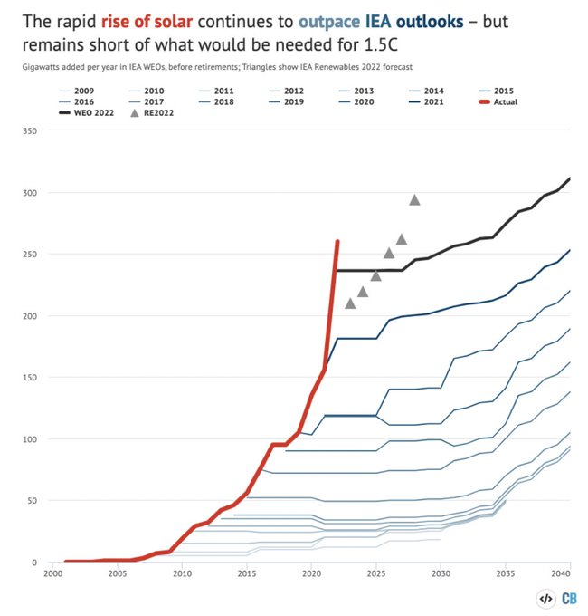
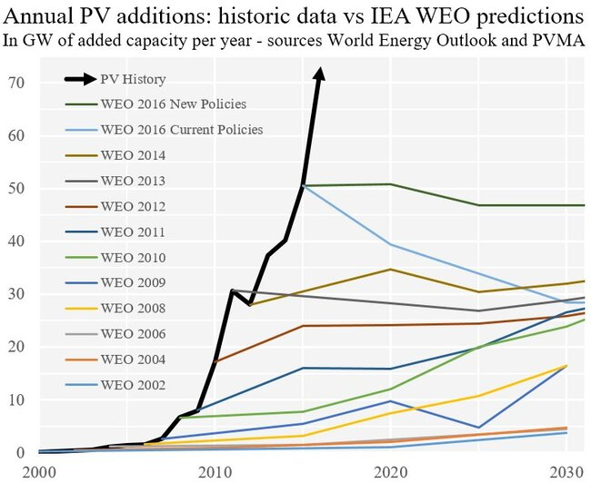
<li>Your policy would:
	<ul style="list-style: none;">
	<li> ☐ disincentivize good things</li>
	<li> ☐ incentivize bad things</li>
	<li> ☐ both</li>
	<li> ☐ be wildly unpopular, even though you think it's the best thing since sliced bread (it's not)</li>
	</ul>
</li>
<li>☐ You seem to think that taking options away from people helps them</li>
<li>Your policy just reinvents
	<ul style="list-style: none;">
	<li> ☐ land-value taxes, but worse</li>
	<li> ☐ universal basic income, but worse</li>
	<li> ☐ price discrimination, but worse</li>
	<li> ☐ demand subsidy, but worse</li>
	<li> ☐ demand subsidy, better, but that's still no excuse</li>
	</ul>
</li>
<li>☐ Your policy sneakily redistributes money from poor to rich people</li>
<li>☐ Your policy only works if every country on earth adopts it at the same time</li>
<li>☐ You actually have no idea what failure/success of your policy would look like</li>
<li>You claim it fixes
<ul style="list-style: none;">
	<li> ☐ climate change</li>
	<li> ☐ godlessness</li>
	<li> ☐ police violence</li>
	<li> ☐ wet socks</li>
	<li> ☐ teenage depression</li>
	<li> ☐ rising rents</li>
	<li> ☐ war</li>
	<li> ☐ falling/rising sperm counts/testosterone levels</li>
	</ul>
</li>
<li>You seem to assume that
	<ul style="list-style: none;">
	<li> ☐ privatization always works</li>
	<li> ☐ privatization never works</li>
	<li> ☐ your country will never become a dictatorship</li>
	<li> ☐ your country will always stay a dictatorship</li>
	<li> the cost of coordination is</li>
		<ul style="list-style: none;">
		<li> ☐ negligible</li>
		<li> ☐ zero</li>
		<li> ☐ negative</li>
		</ul>
	</ul>
</li>
<li>☐ Your policy is a Pareto-worsening</li>
<li>In conclusion,
	<ul style="list-style: none;">
	<li> ☐ You have copied and mashed together some good ideas with some mediocre ideas</li>
	<li> ☐ You have not even tried to understand basic economics/political science/sociology concepts</li>
	<li> ☐ Living under your policy is an adequate punishment for inventing it</li>
</li>
</ul>

Now please, guys, don't make me create one for AI governance proposals.

All Things People Have Written About Lumenators
------------------------------------------------

Moved [here](./platforms.html#None_11).

Kaldor-Hicks Worsenings
------------------------

There are
[Pareto-improvements](https://en.wikipedia.org/wiki/Pareto_efficiency):
everyone is made better (or equally well) off by their own
standards. There are, similarly, Pareto-worsenings: Everyone is made
*worse* off by their own standard, or their welfare is unchanged.

Then there are [Kaldor-Hicks
improvements](https://en.wikipedia.org/wiki/Kaldor-Hicks_efficiency),
which happen if one e.g. reallocates the available goods so that
the better-off could compensate the now worse-off to create a Pareto
improvement. This compensation need not occur, it needs to be merely
possible.

Now can there be a Kaldor-Hicks-*worsening*?

The naive version (everyone is worse (or equally well) off, and there
is no way of making a single person better off through redistribution)
seems too strong, there is probably always a redistribution that gives
the available resources to a single agent.

A simple negation of the criteria then perhaps makes more sense: A
change is a Kaldor-Hicks-worsening if and only if everyone is worse (or
equally well) off and there is no way of creating a Pareto-improvement
through reallocation.

This implies an anti-Kaldor-Hicks-worsening: A change makes everyone worse
off, *but* there is some reallocation that creates a Pareto improvement.

Example: We have a Sadist and a Masochist. The Masochist starts hurting
the Sadist, thus creating opportunity cost for them both. Switching the
roles creates a Pareto improvement.

Examples and Counter-examples for Zeyneps Razor
-------------------------------------------------

Zeyneps razor (after [Zeynep
Tufekci](https://en.wikipedia.org/wiki/Zeynep_Tufekci)) [states
that](http://nitter.poast.org/zeynep/status/1478766408691556353?lang=en)
first-order effects are rarely outweighed by [rebound effects](https://en.wikipedia.org/wiki/Rebound_effect_\(conservation\)).<!--TODO: state exactly!-->

Examples:

* Introducing seatbelts into cars and making them mandatory to wear does not lead to driving so reckless that accidents increase<!--TODO: link-->

Counter-principles<!--TODO: describe ideal gas laws-->:

* [Jevons paradox](https://en.wikipedia.org/wiki/Jevons_paradox)
* [Wirth's law](https://en.wikipedia.org/wiki/Wirth's_law)
* [Peter principle](https://en.wikipedia.org/wiki/Peter_principle)
* [Streisand effect](https://en.wikipedia.org/wiki/Streisand_Effect)
* The [Peltzman effect](https://en.wikipedia.org/wiki/Risk_compensation#Peltzman_effect)

Actually, which is "more true": Zeyneps razor or the
counter-examples? Perhaps one could pick 10 past interventions/cheapenings
at random, and investigate whether efficiency or safety gains were
outweighed by rebound effects.

Favorite Quanta Magazine Articles
----------------------------------

[Quanta magazine](https://www.quantamagazine.org/) is great. I was
recently asked for my favorite articles from the site, here's my
(evolving) list, limited to 10 articles per year. My preference leans
more towards biology/ecology/neuroscience articles, it's what I know
least about, and its stamp-collecting nature makes it more amenable
to popular articles (in contrast to physics and mathematics articles,
which always feels hollow without the math).

### 2013

* [Biologists Home In on Turing Patterns (Jennifer Ouellette, 2013)](https://www.quantamagazine.org/biologists-home-in-on-turing-patterns-20130325/)
* [Hunger Game: Is Honesty Between Animals Always the Best Policy? (Natalie Wolchover, 2013)](https://www.quantamagazine.org/hunger-game-is-honesty-between-animals-always-the-best-policy-20130109/)
* [Google Researcher, Long Out of Math, Cracks Devilish Problem About Sets (Kevin Hartnett, 2023)](https://www.quantamagazine.org/long-out-of-math-an-ai-programmer-cracks-a-pure-math-problem-20230103/)
* [Mathematicians Roll Dice and Get Rock-Paper-Scissors (Erica Klarreich, 2023)](https://www.quantamagazine.org/mathematicians-roll-dice-and-get-rock-paper-scissors-20230119/)
* [On the Microbial Frontier, Cooperation Thrives (Emily Singer, 2013)](https://www.quantamagazine.org/on-the-microbial-frontier-cooperation-thrives-20130802/)
* [In Pursuit of Quantum Biology With Birgitta Whaley (Peter Byrne, 2013)](https://www.quantamagazine.org/in-pursuit-of-quantum-biology-with-birgitta-whaley-20130730/)
* [To Settle Infinity Dispute, a New Law of Logic (Natalie Wolchover, 2013)](https://www.quantamagazine.org/to-settle-infinity-question-a-new-law-of-mathematics-20131126/)
* [Imagining Data Without Division (Thomas Lin, 2013)](https://www.quantamagazine.org/in-big-science-imagining-data-without-division-20130930/)
* [The Secret Language of Plants (Kat McGowan, 2013)](https://www.quantamagazine.org/the-secret-language-of-plants-20131216/)
* [In Natural Networks, Strength in Loops (Emily Singer, 2013)](https://quantamagazine.org/in-natural-networks-strength-in-loops-20130814/)

### 2014

* [Perfecting the Art of Sensible Nonsense (Erica Klarreich, 2014)](https://www.quantamagazine.org/in-cryptography-advances-in-program-obfuscation-20140130/)
* [A New Physics Theory of Life (Natalie Wolchover, 2014)](https://www.quantamagazine.org/a-new-thermodynamics-theory-of-the-origin-of-life-20140122/)
* [Big Bang Secrets Swirling in a Fluid Universe (Natalie Wolchover, 2014)](https://www.quantamagazine.org/big-bang-secrets-swirling-in-a-fluid-universe-20140212/)
* [Scientists Reveal Structure of Pain Sensor (Emily Singer, 2014)](https://www.quantamagazine.org/scientists-reveal-structure-of-pain-sensor-20140220/)
* [Early Life in Death Valley (Peter Byrne, 2014)](https://www.quantamagazine.org/ancient-fossils-suggest-complex-life-evolved-on-land-20140424/)
* [In a Grain, a Glimpse of the Cosmos (Natalie Wolchover, 2014)](https://www.quantamagazine.org/quasicrystal-meteorite-poses-age-old-questions-20140613/)

Ordering Outgoing *and* Incoming Edges in Dot
----------------------------------------------

Let's say you have a graph like this, drawn by the `dot` program:

	digraph {
		c->a
		d->c [color="red"]
		c->b
		b->d
		a->d
	}

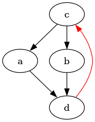

but you want to move the red edge to the middle. In this particular
example, you *could* use `circo` and make the graph more circular,
but that pattern fails with more complicated graphs, especially when
you want specific edges to be on top or at the bottom (e.g. when each
edge in the example graph is replaced by an edge, a node and another
edge). Neither do edge-weighting, subgraphs or ordering of nodes work.

The best solution I've found is to add an invisible further edge `c->d`:

	digraph {
		c->a
		d->c [color="red"]
		c->d [color="white"]
		c->b
		b->d
		a->d
	}

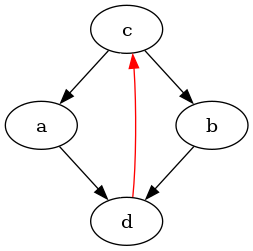

The result looks slightly wonky, but works. If one wants more assurances,
one can also add the line `{ordering=out; c};` to make it more likely
that the red edge isn't just banished to the side.

PredictionBook Archive
-----------------------

Since PredictionBook is shutting down, I thought it'd be good to
`wget` the site and make a static archive available. It is available
[here](./doc/misc/predictionbook.com.tar.gz), and can be extracted via
`tar -xzf predictionbook.com.tar.gz`.

Downloading a Substack Podcast by Hand
---------------------------------------

`yt-dlp` can now download substack podcasts.

~~To my surprise, [`yt-dlp`](https://github.com/yt-dlp/yt-dlp) can't
download [Substack](https://en.wikipedia.org/wiki/Substack) podcasts. But
they *can* be downloaded with a little bit of effort by hand.~~

~~Let's take [this podcast
episode](https://uncoiling.substack.com/p/romeo-stevens-an-orientation-to-practice-part-1)
as an example. Inspecting the audio player, we can find the following HTML block:~~

	<audio src="/api/v1/audio/upload/3b5196e4-3c8e-40aa-b1a2-d334923ca874/src">Audio playback is not supported on your browser. Please upgrade.</audio>

~~So we can simply plug the source in
after the global substack domain, which gets us
<https://substack.com/api/v1/audio/upload/3b5196e4-3c8e-40aa-b1a2-d334923ca874/src>.
Calling that address starts the download process automatically.~~

~~Adding the download functionality to `yt-dlp` is on my todo list.~~

Scientific and Other Classifications
--------------------------------------

One might think all we do is stamp-collecting.

* Mathematics
	* [Classification of simple finite groups](https://en.wikipedia.org/wiki/Classification_of_finite_simple_groups)
	* [Classification of manifolds](https://en.wikipedia.org/wiki/Classification_of_manifolds) and [surfaces](https://en.wikipedia.org/wiki/Surface_\(topology\)#Classification_of_closed_surfaces)
	* [Regular polytopes](https://en.wikipedia.org/wiki/Regular_Polytopes)
	* [Elementary cellular automata](https://en.wikipedia.org/wiki/Elementary_cellular_automata)
	* [Symmetry groups](https://en.wikipedia.org/wiki/Symmetry_groups)
		* [Wallpaper groups](https://en.wikipedia.org/wiki/Wallpaper_groups)
		* [Space groups](https://en.wikipedia.org/wiki/Wallpaper_groups)
		* [Bieberbach groups](https://en.wikipedia.org/wiki/Bieberbach_group)
	* [Classification of reversible bit operations](https://arxiv.org/abs/1504.05155)
		* Also [Post's lattice](https://en.wikipedia.org/wiki/Post's_lattice)
	* [Complexity classes](https://en.wikipedia.org/wiki/List_of_complexity_classes) and their relations
		* [Arithmetic hierarchy](https://en.wikipedia.org/wiki/Arithmetic_hierarchy)
		* [Polynomial hierarchy](https://en.wikipedia.org/wiki/Polynomial_hierarchy)
		* [Chomsky hierarchy](https://en.wikipedia.org/wiki/Chomsky_Hierarchy)
	* Stability theory
		* [Poincaré maps](https://en.wikipedia.org/wiki/Poincaré_map) of linear [autonomous systems](https://en.wikipedia.org/wiki/Autonomous_system_\(Mathematics\))
	* Game theory
		* [Classification](https://www.lesswrong.com/s/yiFxBWDXnLpbWGTkK/p/KwbJFexa4MEdhJbs4) of `$2 \times 2$` [normal-form games](https://arxiv.org/pdf/1010.4727.pdf)
* Physics
	* [Orbitals](https://en.wikipedia.org/wiki/Atomic_Orbital#Orbitals_table)
	* [Standard Model](https://en.wikipedia.org/wiki/Stellar_Classification)
		* Classifies all [fundamental particles](https://en.wikipedia.org/wiki/Fundamental_particles)
	* Cosmology
		* [Stellar classification](https://en.wikipedia.org/wiki/Stellar_Classification)
		* [Galaxy classification](https://en.wikipedia.org/wiki/Galaxy_morphological_classification)
		* Orbital mechanics
			* [Lagrange points](https://en.wikipedia.org/wiki/Lagrange_Points)
			* Different [types of orbits](https://en.wikipedia.org/wiki/List_of_orbits)
* Chemistry
	* [Periodic Table of Elements](https://en.wikipedia.org/wiki/Periodic_Table_of_Elements)
	* [Synthetic polymers](https://en.wikipedia.org/wiki/List_of_synthetic_polymers)
	* [Hazardous materials classification](https://en.wikipedia.org/wiki/Hazardous_materials_labels)
* Biology
	* [Phylogenetic tree of life](https://en.wikipedia.org/wiki/Phylogenetic_Tree)
	* [Linnean taxonomy](https://en.wikipedia.org/wiki/Linnean_taxonomy)
	* [Classification of viruses](https://en.wikipedia.org/wiki/Classification_of_viruses), e.g. the [ICTV classification](https://en.wikipedia.org/wiki/International_Committee_on_Taxonomy_of_Viruses)
	* Various schemes for [biomes](https://en.wikipedia.org/wiki/Biome#Classifications), e.g. the [Holdridge life zones](https://en.wikipedia.org/wiki/Holdridge_Life_Zones)
* Earth science
	* [Geologic time scale](https://en.wikipedia.org/wiki/Geological_timescale)
	* [Cloud genera](https://en.wikipedia.org/wiki/Cloud_genera)
	* Soil classification: [USDA soil taxonomy](https://en.wikipedia.org/wiki/USDA_soil_taxonomy)
	* Classifications of [snow](https://en.wikipedia.org/wiki/Classifications_of_snow) and [snowflakes](https://en.wikipedia.org/wiki/Snowflake#Classification)
	* [Classification of minerals](https://en.wikipedia.org/wiki/Classification_of_minerals), separated beautifully into:
		* [Organic](https://en.wikipedia.org/wiki/Classification_of_organic_minerals)
		* [Silicate](https://en.wikipedia.org/wiki/Classification_of_silicate_minerals)
		* [Non-silicate](https://en.wikipedia.org/wiki/Classification_of_non-silicate_minerals)
	* Also [meteorites](https://en.wikipedia.org/wiki/Classification_of_meteorites)
	* [Trewartha](https://en.wikipedia.org/wiki/Trewartha_climate_classification) and [Köppen](https://en.wikipedia.org/wiki/Köppen_Climate_Classification) climate classifications
	* [Diamonds](https://en.wikipedia.org/wiki/Diamond_type)
* Linguistics
	* [International phonetic alphabet](https://en.wikipedia.org/wiki/International_Phonetic_Alphabet)
	* [Language families](https://en.wikipedia.org/wiki/Language_families), [list](https://en.wikipedia.org/wiki/List_of_language_families)
	* [Unicode](https://en.wikipedia.org/wiki/Unicode)
* Medicine
	* Medical classification: [ICD-10](https://en.wikipedia.org/wiki/ICD-10)
		* Leading to many *many* subclassifications, e.g. of [asthma](https://en.wikipedia.org/wiki/Asthma#Classification), [breast cancer](https://en.wikipedia.org/wiki/Classification_of_breast_cancer), [obesity](https://en.wikipedia.org/wiki/Classification_of_obesity), of course [diabetes](https://en.wikipedia.org/wiki/Diabetes) ([type 1](https://en.wikipedia.org/wiki/Diabetes_Type_1) and [type 2](https://en.wikipedia.org/wiki/Diabetes_type_2)) and [strokes](https://en.wikipedia.org/wiki/Stroke) (ischemic and hemorrhagic)…
	* Psychiatric classification: [DSM-5](https://en.wikipedia.org/wiki/DSM-5)
	* [Blood types](https://en.wikipedia.org/wiki/Blood_Types)
* Psychology
	* [Various proposed classifications of emotions](https://en.wikipedia.org/wiki/Classification_of_emotions)
* Culture
	* Music
		* [Musical genres](https://en.wikipedia.org/wiki/List_of_musical_genres)<!--Link Data is Beautiful instead?-->
		* [Musical instruments](https://en.wikipedia.org/wiki/Classification_of_Instruments), especially [percussion instruments](https://en.wikipedia.org/wiki/Classification_of_percussion_instruments)
	* Food
		* [Wines](https://en.wikipedia.org/wiki/Classification_of_wine)
		* [Champagne](https://en.wikipedia.org/wiki/Classification_of_Champagne)
* Meditation
	* [Jhanas](https://en.wikipedia.org/wiki/Jhāna)
	* [Maps](https://www.integrateddaniel.info/mind-maps) [of insight](https://www.dharmaoverground.org/dharma-wiki/-/wiki/Main/MCTB+The+Progress+of+Insight)
* [Dewey Decimal classification](https://en.wikipedia.org/wiki/Dewey_Decimal_System)

A classification of classifications, if you will.

Sporadic elements include classifications of
[cars](https://en.wikipedia.org/wiki/Classification_of_cars),
[demons](https://en.wikipedia.org/wiki/Classification_of_demons),
[fairies](https://en.wikipedia.org/wiki/Classifications_of_fairies),
and [swords](https://en.wikipedia.org/wiki/Classification_of_swords).

<!--Amino acids?-->

A FIRE Upon the Deep
---------------------

Consider the problem of being automated away in a period of human history
with explosive growth, and having to subsist on one's capital. Property
rights are respected, but there is no financial assistance by governments
or AGI corporations.

How much wealth does one need to have to survive, ideally indefinitely?

__Finding__: If you lose your job at the start of the singularity, with
monthly spending of \$1k, you need ~\$71k in total of capital. This
number doesn't look very sensitive to losing one's job slightly later.

At the moment, the world economy is growing at a pace that leads to
doublings in [GWP](https://en.wikipedia.org/wiki/Gross_World_Product)
every 20 years, steadily since ~1960. Explosive growth might instead be
[hyperbolic](https://sideways-view.com/2017/10/04/hyperbolic-growth/)
(continuing the trend [we've seen seen through human history so
far](https://www.openphilanthropy.org/blog/modeling-human-trajectory)),
with the economy first doubling in 20, then in 10, then in 5, then
2.5, then 15 months, and so on. I'll assume that the smallest time for
doublings is 1 year.

	initial_doubling_time=20
	final_doubling_time=1
	initial_growth_rate=2^(1/(initial_doubling_time*12))
	final_growth_rate=2^(1/(final_doubling_time*12))

	function generate_growth_rate_array(months::Int)
	    growth_rate_array = zeros(Float64, years)
	    growth_rate_step = (final_growth_rate - initial_growth_rate) / (years - 1)

	    current_growth_rate = initial_growth_rate

	    for i in 1:years
		growth_rate_array[i] = current_growth_rate
		current_growth_rate += growth_rate_step
	    end

	    return growth_rate_array
	end

We can then define the doubling sequence:

	years=12*ceil(Int, 10+5+2.5+1.25+final_doubling_time)
	economic_growth_rate = generate_growth_rate_array(years)
	economic_growth_rate=cat(economic_growth_rate, repeat([final_growth_rate], 60*12-size(economic_growth_rate)[1]), dims=1)

And we can then write a very simple model of monthly spending to figure
out how our capital develops.

	capital=collect(1:250000)
	monthly_spending=1000 # if we really tighten our belts

	for growth_rate in economic_growth_rate
		capital=capital.*growth_rate
		capital=capital.-monthly_spending
	end

`capital` now contains the capital we end up with after 60 years. To find
the minimum amount of capital we need to start out with to not lose out
we find the index of the number closest to zero:

	julia> findmin(abs.(capital))
	(1.1776066747029436e13, 70789)

So, under these requirements, starting out with more than \$71k should be fine.

But maybe we'll only lose our job somewhat into the singularity
already! We can simulate that as losing a job when initial doubling
times are 15 years:

	initial_doubling_time=15
	initial_growth_rate=2^(1/(initial_doubling_time*12))
	years=12*ceil(Int, 10+5+2.5+1.25+final_doubling_time)
	economic_growth_rate = generate_growth_rate_array(years)
	economic_growth_rate=cat(economic_growth_rate, repeat([final_growth_rate], 60*12-size(economic_growth_rate)[1]), dims=1)

	capital=collect(1:250000)
	monthly_spending=1000 # if we really tighten our belts

	for growth_rate in economic_growth_rate
		capital=capital.*growth_rate
		capital=capital.-monthly_spending
	end

The amount of initially required capital doesn't change by that much:

	julia> findmin(abs.(capital))
	(9.75603002635271e13, 68109)

### See Also

* [The end times portfolio is long (Duncan McClements, 2024)](https://model-thinking.com/p/the-end-times-portfolio-is-long)

Research Consultants List
--------------------------

* [Arb Research](https://arbresearch.com/) (no hourly rates gives)
* [Alok Singh](https://alok.github.io/about/) (≥\$300/hr)
* [Elizabeth van Nostrand](https://acesounderglass.com/hire-me/) (≥\$300/hr)
* [milky eggs](http://milkyeggs.com/about/), (no hourly rate given)
* [Niplav](./services.html) (rates decided by two-sided sealed-bid auction, more details [here](./services.html#Rates))
* [Nuño Sempere](https://nunosempere.com/consulting/) (~\$250/hr, at marginally decreasing price)
* [Roko Mijic](https://www.lesswrong.com/posts/bMxhrrkJdEormCcLt/brute-force-manufactured-consensus-is-hiding-the-crime-of?commentId=tjt7GbC2fsw2dtNGF) (\$200/hr)
* [Sarah Constantin](https://www.sarah-constantin.org/consulting) (no hourly rate given)
* [Vasco Grilo](https://forum.effectivealtruism.org/users/vascoamaralgrilo), (\$20/hr)

Discord Servers for Textbooks
-------------------------------

Inspired by [this shortform
post](https://www.lesswrong.com/posts/DJk86FE29ad4vr5e9/riceissa-s-shortform?commentId=W49udPvKRZB4B3snR),
I decided to collect a list of discord servers dedicated to textbooks.

* [Analysis I (Tao 2016)](https://discord.gg/Jy4HZtP9pt)
* [Naive Set Theory (Halmos 1960)](https://discord.gg/sApjeGjdvx)

AI Safety Via Debate Links
---------------------------

* [AI Safety Via Debate (2018)](https://arxiv.org/abs/1805.00899)
* [Writeup: Progress on AI Safety via Debate (2020)](https://www.alignmentforum.org/posts/Br4xDbYu4Frwrb64a/writeup-progress-on-ai-safety-via-debate-1)
* [Debate update: Obfuscated arguments problem (2020)](https://www.alignmentforum.org/posts/PJLABqQ962hZEqhdB/debate-update-obfuscated-arguments-problem)
* [Why I'm excited about Debate (2021)](https://www.alignmentforum.org/posts/LDsSqXf9Dpu3J3gHD/why-i-m-excited-about-debate)
* [Single-Turn Debate Does Not Help Humans Answer Hard Reading-Comprehension Questions (2022)](https://arxiv.org/abs/2204.05212)
* [Two-Turn Debate Doesn't Help Humans Answer Hard Reading Comprehension Questions (2022)](https://arxiv.org/abs/2210.10860)
* [Scalable AI Safety via Doubly-Efficient Debate (2023)](https://arxiv.org/pdf/2311.14125.pdf)
* [Anthropic Fall 2023 Debate Progress Update (2023)](https://www.alignmentforum.org/posts/QtqysYdJRenWFeWc4/anthropic-fall-2023-debate-progress-update)
* [Debating with More Persuasive LLMs Leads to More Truthful Answers (2024)](https://arxiv.org/pdf/2402.06782.pdf)

More at [the LessWrong
tag](https://www.lesswrong.com/tag/debate-ai-safety-technique-1).

Awesome Things Humans Can Learn
--------------------------------

Most elements from this list are from [this LessWrong
comment](https://www.lesswrong.com/posts/knLZY52Yx9G23u3Ka/insufficiently-awesome?commentId=4AevGHrCQMbWaoan9)
by [D_Malik](https://www.lesswrong.com/users/d_malik), updated and
maintained.

* Frequently expose myself to shocking/horrific pictures, so that I am generally less sensitive. I've been doing this for a while, watching horror movies while doing cardio exercise, and it's been going well. One might also try pulling pics from (WARNING) [shock sites](http://www.rotten.com/) and using [spaced](http://www.supermemo.com/english/princip.htm) [repetition](http://www.ankisrs.net/) to schedule exposures.
* Become insensitive to exposure to cold water by, for example, frequently taking cold showers or ice baths. This apparently helps with weight-loss as well. I've done this with immense success. After you've practised this, you will literally feel like some weird heat is being generated from someplace inside you when are exposed to cold water, and not feel cold at all. [See here](http://gettingstronger.org/2010/03/cold-showers/).
* Become awesome at [mental math](http://en.wikipedia.org/wiki/Mental_calculation). I've been practising squaring two-digit numbers mentally for some time (school, what can I say) and I'm really good at it.
* Learn mnemonics. I was fortunate to teach myself this early and it has been insanely useful. Practise by memorizing and rehearsing something, like the periodic table or the capitals of all nations or your multiplication tables up to 30x30 or whatever.
* Practise visualization, i.e. seeing things that aren't there. Apparently some people lack this ability, and I don't know how susceptible this is to training, so YMMV. Try inventing massive palaces mentally and walking through them mentally when bored. This can be used for memorization (method of loci).
* Research [n-back](https://gwern.net/dnb-faq) and start doing it regularly.
* Learn to do [lucid dreaming](http://www.lucidity.com/LucidDreamingFAQ2.html). Besides being awesome in and of itself, this can help you practise things or experience weird stuff.
* Learn [symbolic shorthand](http://en.wikipedia.org/wiki/Stenography). I recommend [Gregg](http://gregg.angelfishy.net/). I did this in my second year of high school, and it's damn useful for actually writing stuff and taking notes as well as as a conversation starter.
* Look at the structure of conlangs like [Esperanto](http://en.wikipedia.org/wiki/Esperanto) and [Lojban](http://en.wikipedia.org/wiki/Lojban) and [Ithkuil](http://en.wikipedia.org/wiki/Ithkuil). I feel like this is mind-expanding, like I have a better sense of how language and communication and thought works after being exposed to this.
	* Similarly, you can try to learn (parts of) a sign language, which could come in handy in situations when you can't speak.
* Learn to stay absolutely still for extended periods of time; convince onlookers that you are dead. Being in school means you have ample opportunity for practice.
* Learn to teach yourself stuff. Almost everything you can learn at high school or university can be taught better by a good textbook than by a good teacher (IMO, of course). You can get any good textbook on the internet.
* Live out of your car for a while, or go [homeless by choice](http://www.xamuel.com/homeless-by-choice/).
* Can you learn to be pitch-perfect? Anyway, generally learn more about music.
* Exercise. Consider 'cheating' with creatine or something. Creatine is also [good for mental function for vegetarians](http://jtoomim.org/creatine_intelligence.pdf). If you want to jump over cars, try [plyometrics](http://en.wikipedia.org/wiki/Plyometrics).
* Eat healthily. This has become a habit for me. Forbid yourself from eating anything for which a more healthy alternative exists (eg., no more white rice (wild rice is better), no more white bread, no more soda, etc.). Look into alternative diets; learn to fast.
* Self-discipline in general. Apparently this is practisable. Eliminate comforting lies like that giving in just this once will make it easier to carry on working. Tell yourself that you never 'deserve' a long-term-destructive reward for doing what you must, that doing what you must is just business as usual. Realize that the part of your brain that wants you to fall to temptation can't think long-term - so use the disciplined part of your brain to keep a temporal distance between yourself and short-term-gain-long-term-loss things. In other words, set stuff up so you're not easy prey to hyperbolic discounting.
* Learn not just to cope socially, but to be the life of the party. Maybe learn the PUA stuff.
* That said, learn to not care what other people think when it's not for your long-term benefit. Much of social interaction is mental masturbation, it feels nice and conforming so you do it. From HP and the MOR:
* For now I'll just note that it's dangerous to worry about what other people think on instinct, because you actually care, not as a matter of cold-blooded calculation. Remember, I was beaten and bullied by older Slytherins for fifteen minutes, and afterward I stood up and graciously forgave them. Just like the good and virtuous Boy-Who-Lived ought to do. But my cold-blooded calculations, Draco, tell me that I have no use for the dumbest idiots in Slytherin, since I don't own a pet snake. So I have no reason to care what they think about how I conduct my duel with Hermione Granger.
* Learn to pick locks. If you want to seem awesome, bring padlocks with you and practise this in public :P
* Learn how to [walk without making a sound](http://www.bbc.co.uk/dna/h2g2/A980589r).
* Learn to control your voice. Learn to project like an actress. PUAs have also written on this.
* Do you know what a wombat looks like, or where your pancreas is? Learn basic biology, chemistry, physics, programming, etc.. There's so much low-hanging fruit.
* Learn to count cards, like for blackjack. Because what-would-James-Bond-do, that's why! (Actually, in the books Bond is stupidly superstitious about, for example, roulette rolls.)
* Learn to play lots of games (well?). There are lots of interesting things out there, including modern inventions like [Y](http://en.wikipedia.org/wiki/Y_%28game%29) and [Hive](http://en.wikipedia.org/wiki/Hive_%28game%29) that you can play online.
* Learn magic. There are lots of books about this.
* Learn to write well, as someone else here said.
* Get interesting quotes, pictures etc. and expose yourself to them with spaced repetition. After a while, will you start to see the patterns, to become more 'used to reality'?
* Learn to type faster. Try alternate keyboard layouts, like Dvorak.
* Try to make your senses funky. Wear a blindfold for a week straight, or wear goggles that turn everything a shade of red or turn everything upside-down or an eye patch that takes away your depth-sense. Do this for six months, or however long it takes to get used to them. Then, of course, take them off. The when you're used to not having your goggles on, put them on again. You can also do this on a smaller scale, by flipping your screen orientation or putting your mouse on the other side or whatnot.
* Become ambidextrous. Commit to tying your dominant hand to your back for a week.
* Humans have magnetite deposits in the ethmoid bone of their noses. Other animals use this for sensing direction; can humans learn it?
* Some blind people have learned to echolocate. [Seriously](http://en.wikipedia.org/wiki/Human_echolocation).
* Learn how to tie various knots. This is useless but awesome.
* Wear [one of those belts](http://www.wired.com/wired/archive/15.04/esp.html) that tells you which way north is. Keep it on until you are homing pigeon.
* Learn self-defence.
* Learn wilderness survival. Plently of books on the net about this.
* Learn first aid. This is one of those things that's best not self-taught from a textbook.
* Learn more computer stuff. Learn to program, then learn more programming languages and how to use e.g. the Linux coreutils. Use [dwm](http://en.wikipedia.org/wiki/Dwm). [Learn to hack](http://www.hellboundhackers.org/). Learn some [weird programming languages](http://www.esolangs.org/wiki/Main_Page). If you're actually using programming in your job, though, make sure you're scarily awesome at at least one language.
* Learn basic physical feats like handstands, somersaults, etc., as well as how to throw things accurately.
* [Polyphasic sleep](http://en.wikipedia.org/wiki/Polyphasic_sleep)?
* Use all the dead time you have lying around. Constantly do mental math in your head, or flex all your muscles all the time, or whatever. All that limits you is your own weakness of will.
* Learn different kinds of meditation really well (loving-kindness, concentration, insight, potentially exotic states like the jhanas). This can also be practiced at any time.
* Learn some poems with fluidity (this can of course be done with spaced repetition). If you learn for long enough, maybe you can learn parts of an epic. If you want to be really impressive, learn it in the [original language](https://www.youtube.com/watch?v=VzJQ0TcBmqU) (however, try to get the pronounciation right!).
* Make predictions until you know you're well calibrated.
* Try to be mindful of your posture – how straight is your back, where are your shoulders? Maybe [set up a random timer that reminds you to do this](https://play.google.com/store/apps/details?id=com.multiordinal.nom&hl=en_US&gl=US).
* Learn the basics of dressing well, then refactor your wardrobe (starting point [for men](https://old.reddit.com/r/malefashionadvice/wiki/index), practical information for women seems abundant).
* Learn the basics of investing, and actually put some money into it. Try (and most likely fail) to actively trade stocks with a profit over the market.
* Create a startup if you can afford to do so, you will likely fail but learn a lot.
* Learn to recognize temperature/time duration/length/acceleration, just by feel/eyesight. Similarly, learn to predict the weather where you live.
* Play [GeoGuessr](https://en.wikipedia.org/wiki/GeoGuessr) until you are pretty good at locating yourself anywhere in the world. People can learn this to a surprising degree.<!--TODO: link Rainbolt or similar video, complain about meta-->
* Whistling can be useful to draw attention to yourself, if need be.

Too Good to be True: Training an RL Agent to be Suspicious
-----------------------------------------------------------

Trying to implement the experiment detailed in [Yudkowsky
2017](https://arbital.com/p/environmental_goals/):

> One could directly attack the toy problem by trying to have an agent
within a currently standard reinforcement-learning paradigm "learn not
to interfere with the reward signal" or "learn not to try to obtain
rewards uncorrelated with real apricots".
>
> For this to represent at all the problem of scalability, we need to
not add to the scenario any kind of sensory signal whose correlation
to our intended meaning can never be smashed by the agent. E.g., if
we supplement the reward channel `$R$` with another channel `$Q$` that
signals whether has been interfered with, the agent must at some point
acquire a range of action that can interfere with `$Q$`.
>
> A sample approach might be to have the agent's range of action
repeatedly widen in ways that repeatedly provide new easier ways to
obtain `$R$` without manipulating `$E_1$`. During the first phase of
such widenings, the agent receives a supplementary signal `$Q$` whose
intended meaning is "that was a fake way of obtaining `$R$`." During
the second phase of action-range widenings, we change the algorithm
and switch off `$Q$`. Our intended result is for the agent to have now
learned in a general way "not to interfere with `$R$`" or "pursue the
`$E_1$` identified by `$R$`, rather than pursuing `$R$`".  
> […]  
> *Remark: The avoid-tampering approach is probably a lot closer
to something we could try on Tensorflow today, compared to the
identify-causes approach. But it feels to me like the avoid-tampering
approach is taking an ad-hoc approach to a deep problem; in this approach
we are not necessarily "learning how to direct the agent's thoughts toward
factors of the environment" but possibly just "training the agent to avoid
a particular kind of self-originated interference with its sensory goals".*

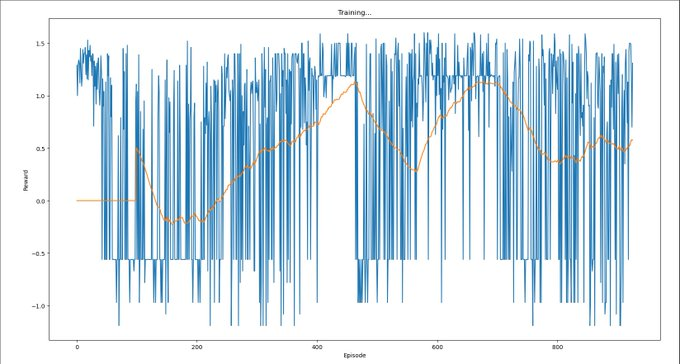

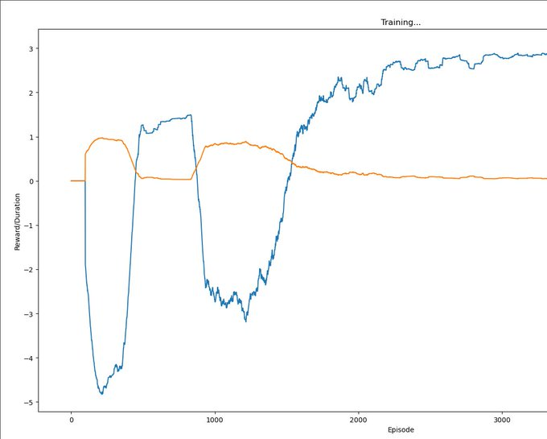

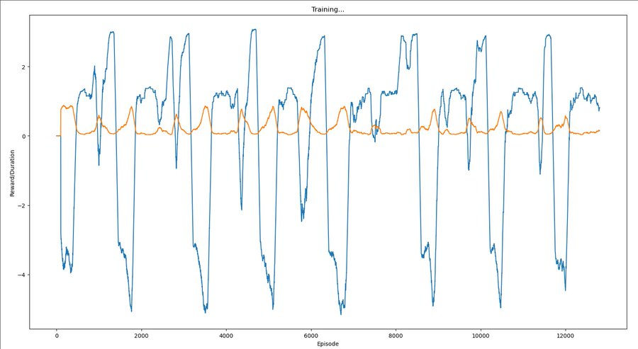

### See Also

> There could also be a sequence of such steps. As a caricature, imagine
that first Alex interacts with 3rd graders while being evaluated for
honesty by 6th graders, and then with 6th graders while being evaluated
for honesty by 9th graders, and then with 9th graders while being
evaluated by 12th graders, and so on. We might hope that after many
instances of “learning the lesson” that it will be evaluated by a
human better-informed than the one it’s interacting with, Alex would
learn to “play it safe” by always being honest.

*—Ajeya Cotra, [“Without specific countermeasures, the easiest path to transformative AI likely leads to AI takeover”](https://www.lesswrong.com/posts/pRkFkzwKZ2zfa3R6H/without-specific-countermeasures-the-easiest-path-to), 2022*

Field-Specific Low-Information Priors
--------------------------------------

1. [~](https://www.metaculus.com/questions/1490/which-percentage-of-metaculus-questions-resolving-in-q1-2019-will-resolve-positively/)[4](https://www.metaculus.com/questions/804/1000th-binary-question-resolution-is-positive/)[0](https://www.metaculus.com/questions/1475/which-percentage-of-metaculus-questions-resolving-from-october-1st-to-december-31st-2018-inclusive-will-resolve-positively/)[​%](https://rethinkpriorities.org/publications/data-on-forecasting-accuracy-across-different-time-horizons) of questions worth asking resolve as true.
2. Human psychological traits have, on average, 50% heritability<!--TODO: links?-->.
3. The top 2.5% of global health and policy interventions [are 8-20 times more effective than the mean intervention, and 20-200 times more effective than the median intervention](https://80000hours.org/2023/02/how-much-do-solutions-differ-in-effectiveness/#patterns-in-the-data-overall).

Fat Tails Discourage Compromise
--------------------------------

Say that we have a set of options, such as (for example) [wild animal
welfare](https://en.wikipedia.org/wiki/Wild_animal_welfare) interventions.

Say also that you have two axes along which you can score those
interventions: *popularity* (how much people will like your intervention)
and *effectiveness* (how much the intervention actually helps wild
animals).

Assume that we (for some reason) can't convert between and compare those
two properties.

Should you then pick an intervention that is a compromise on the two
axes—that is, it scores decently well on both—or should you max out
on a particular axis?

One thing you might consider is the distribution of options
along those two axes: the distribution of interventions can
be [normal](https://en.wikipedia.org/wiki/Normal-distribution) on for both
popularity and effectiveness, or the underlying distribution could be
[lognormal](https://en.wikipedia.org/wiki/Lognormal_Distribution)
for both axes, or they could be mixed (e.g. normal for popularity,
and lognormal for effectiveness).

Intuitively, the distributions seem like they affect the kinds of
tradeoffs we can make, how could we possibly figure out how?

…

…

…

It turns out that if both properties are normally
distributed, one gets a fairly large Pareto frontier, with a
[convex](https://en.wikipedia.org/wiki/Convexity) set of options,
while if the two properties are lognormally distributed, one gets a
[concave](https://en.wikipedia.org/wiki/Concavity) set of options.

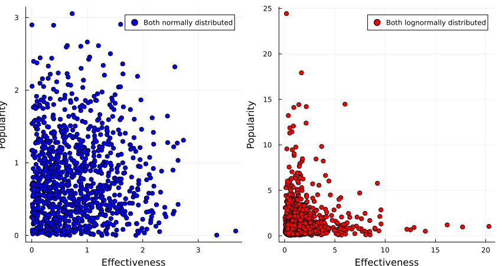

(Code [here](./code/fat_tails/fat_tails.jl).)

So if we believe that the interventions are normally distributed
around popularity and effectiveness, we would be justified
in opting for an intervention that gets us the best of both
worlds, such as sterilising stray dogs or finding less painful
[rodenticides](https://en.wikipedia.org/wiki/Rodenticides).

If we, however, believe that popularity and effectiveness are lognormally
distributed, we instead want to go in hard on only one of those,
such as [buying brazilian beef that leads to Amazonian rainforest being
destroyed](https://reducing-suffering.org/how-rainforest-beef-production-affects-wild-animal-suffering/),
or writing a book of poetic short stories that detail the harsh life of
wild animals.

What if popularity of interventions is normally distributed, but
effectiveness is lognormally distributed?

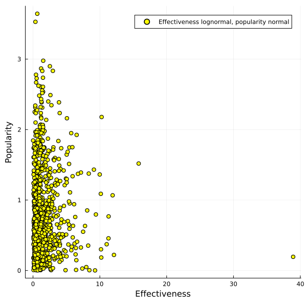

In that case you get a pretty large Pareto frontier which almost looks
linear to me, and it's not clear anymore that one can't get a good
trade-off between the two options.

So if you believe that [heavy tails dominate with the things you care
about](https://80000hours.org/2023/02/how-much-do-solutions-differ-in-effectiveness/),
on multiple dimensions, you might consider taking a [barbell
strategy](https://en.wikipedia.org/wiki/Barbell_strategy) and taking
one or multiple options that each max out on a particular axis.

If you have thin tails, however, taking a [convex
disposition](https://vitalik.eth.limo/general/2020/11/08/concave.html)
towards your available options can give you most of the value you want.

### See Also

* [Being the (Pareto) Best in the World (johnswentworth, 2019)](https://www.lesswrong.com/posts/XvN2QQpKTuEzgkZHY/being-the-pareto-best-in-the-world)
* Discussions
	* [LessWrong](https://www.lesswrong.com/posts/Z5sDqqGridJQfr4uC/fat-tails-discourage-compromise)

The Variety-Uninterested Can Buy Schelling-Products
----------------------------------------------------

Having many different products in the same category, such as many
different kinds of clothes or cars or houses, [is probably very
expensive](https://www.overcomingbias.com/p/what-cost-varietyhtml).<!--TODO:
try to estimate the global cost of variety-->

Some of us might not care enough about variety of products in a certain
category to pay the extra cost of variety, and may even resent the
variety-interested for imposing that cost.

But the variety-uninterested can try to recover some of the gains from
eschewing variety by all buying the same product in some category.  Often,
this will mean buying the cheapest acceptable product from some category,
or the product with the least amount of ornamentation or special features.

E.g. one can buy only black t-shirts and featuresless cheap black socks,
and simple metal cutlery. I will, next time I'll buy a laptop or a
smartphone, think about what the Schelling-laptop is. I suspect it's
not a ThinkPad.

"Then let them all have the same kind of cake."

Graph Sevolutions
------------------

> Die ganzen Zahlen hat der liebe Gott gemacht, alles andere ist
Menschenwerk.

*—Leopold Kronecker, [“Jahresbericht der Deutschen Mathematiker-Vereinigung”](https://www.digizeitschriften.de/dms/toc/?PPN=PPN37721857X_0002), 1886*

Think graph theory meets cellular automata.

__Definition 1__: Given a
[sequence](https://en.wikipedia.org/wiki/Sequence_(mathematics))
`$(V_1, \dots, V_{n+1})$` of sets, and a sequence `$(f_1, \dots, f_n)$`
of functions so that `$f_i: V_i \rightarrow \mathcal{P}(V_{i+1})$`,
the __sevolution__ of a directed graph `$G=(V_1, E_1)$` (with `$E_1
\subseteq V_1 \times V_1$`) is *sequence of graphs* `$(G_1, \dots,
G_{n+1})$` so that `$(v, w) \in E_{k+1}$` if and only if `$(v_i, w_i)
\in E_i$` and `$v \in f_i(v_i), w \in f_i(w_i)$`.

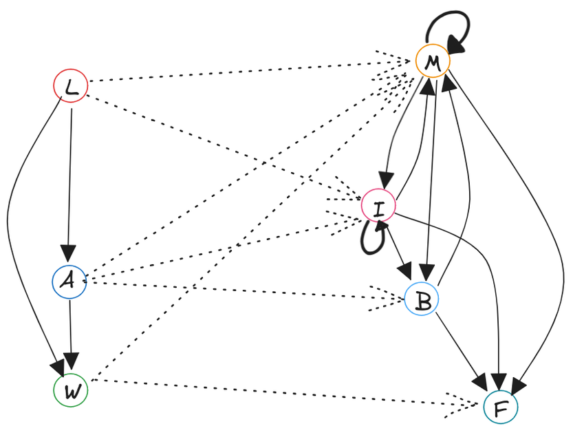

__Definition 2__: Similarly, given a similar sequences of sets and
functions, the __weighted sevolution__ of an edge-weighted directed
graph `$W=(V_1, E, w_1: E \rightarrow \mathbb{R})$` is a sequence of
edge-weighted directed graphs `$(W_1, \dots, W_{n+1})$` so that the
underlying graphs are the sevolutions of `$W$`.

The weights are determined by the __weight sevolver function__
`$\kappa: \mathbb{R}^+ \rightarrow \mathbb{R}$` of the edges between
the previous nodes that sevolved into the current nodes. That is:

<!--TODO: below is a bit confused with indices in the list and indices
in the sevolution. Clean up!-->

	$$w_{i+1}(e_{i+1})=\\
	w_{i+1}((v_{i+1}, v_{i+1}'))=\\
	\kappa([w_i(e_i) | e_i=(v_i, v_i') \land f_i(v_i)=v_{i+1} \land f_i(v_i')=v_{i+1}'])$$

The weight sevolver function can be any arbitrary function of
arbitrary-length lists of reals, but a common case could be to set
`$\kappa([w_i]_l)=\sum_{j=0}^l [w_i]_j$`.

It's plausible that by now the dear reader is hoping for some pictures.

### See Also

* [Finally We May Have a Path to the Fundamental Theory of Physics… and It’s Beautiful (Steven Wolfram, 2020)](https://writings.stephenwolfram.com/2020/04/finally-we-may-have-a-path-to-the-fundamental-theory-of-physics-and-its-beautiful/)

How Often Does Taking Away Options Help?
-----------------------------------------

Moved [here](./options.html#Frequency).

Supplements To The Overcoming Bias Anthology
---------------------------------------------

Original [anthology](https://overcoming-bias-anthology.com/). The posts
here are more a "I found those really enlightening" instead of "they
should've been included", but I'm going to go by the structure of the
anthology with slight modifications.

### Our Thinking

* [Fillers Neglect Framers (2006)](http://www.overcomingbias.com/2006/12/fillers_neglect.html)

#### Disagreement

* [You Are Never Entitled to Your Opinion (2006)](http://www.overcomingbias.com/2006/12/you_are_never_e.html)
* [Disagree with Suicide Rock (2007)](http://www.overcomingbias.com/2007/01/disagree_with_s.html)
* [Agree with Yesterday’s Duplicate (2007)](http://www.overcomingbias.com/2007/01/agree_with_yest.html)
* [Modular Argument (2007)](https://www.overcomingbias.com/p/modular_argumenhtml)

#### Learning

* [Read A Classic (2010)](https://www.overcomingbias.com/2010/06/read-a-classic.html)
* [Is Truth in the Hump or the Tails? (2007)](https://www.overcomingbias.com/2007/02/is_truth_in_the.html)
* [Why Don’t the Young Learn from the Old? (2007)](http://www.overcomingbias.com/2007/01/why_dont_the_yo.html)

### Our Motives

#### Signaling

* [What Is Signaling (2015)](http://www.overcomingbias.com/2015/05/what-is-signaling.html)

### Our Institutions

#### Prediction Markets

* [Prediction Market Quotes (2023)](https://www.overcomingbias.com/p/prediction-market-quoteshtml)

#### Track Records

* [The 80% Forecasting Solution (2006)](http://www.overcomingbias.com/2006/12/the_80_forecast.html)
* [The Trouble With Track Records (2007)](https://www.overcomingbias.com/p/the_trouble_withtml)

### Our Past

#### The Great Filter

* [If Post Filter, We Are Alone (2015)](http://www.overcomingbias.com/2015/08/if-post-filter-we-are-alone.html)

### Life, Reproduction, Death

* [Cities As Harems (2015)](http://www.overcomingbias.com/2015/11/human-harems.html)
* [You Will Age And Die (2006)](http://www.overcomingbias.com/2006/12/you_will_age_an.html)

#### Cryonics

* [We Agree: Get Froze (2008)](http://www.overcomingbias.com/2008/12/we-agree-get-froze.html)
* [Break Cryonics Down (2009)](http://www.overcomingbias.com/2009/03/break-cryonics-down.html)

### Miscellania

* [Prizes versus Grants (2007)](http://www.overcomingbias.com/2007/01/prizes_versus_g.html)
* [Will Blog Posts Get Credit? (2007)](http://www.overcomingbias.com/2007/02/will_blog_posts.html)
* [What Cost Variety? (2014)](https://www.overcomingbias.com/p/what-cost-varietyhtml)
* [Unequal Inequality (2007)](https://www.overcomingbias.com/p/unequal_inequalhtml)
* [Life in 1KD (2022)](https://www.overcomingbias.com/p/life-in-1kdhtml)

Vasectomy & Sperm Freezing Cost-Benefit
----------------------------------------

<!--TODO: change to https://squigglehub.org/models/niplav/vasectomy-->

<!--
*Note: A friend told me that vasectomies don't make men permanently
infertile: if you're not otherwise infertile, sperm can just be extracted
or the vasectomy can be reversed. I haven't checked whether this is true,
but if it is, the cost-benefit analysis below is misguided and wrong,
likely coming out more strongly in favour of having a vasectomy.*

Vasectomies are also reversible, with some probability of success (30%
to 90%, depending on the surgeon).
-->

It seems broadly useful to spend a lot of time to consider whether you
want to have children, and with whom. However, in the heat of passion,
people sometimes forget/neglect to apply birth control methods. Also,
sometimes other people might adversarially make you believe they have
applied birth control to extract resources (such as child support,
or having children they don't want to care for).

If you are male, and you want to prevent these kinds of scenarios, you
might consider freezing sperm and getting a vasectomy. In this way,
it is easier to control who you father children with, and also makes
controlling paternity much easier. However, would that be worth it?
Maybe the cost of the operation and preservation is too high.

As per [Grall
2017](doc/sociology/custodial_mothers_and_fathers_and_their_child_support_grall_2017.pdf "Custodial Mothers and Fathers and Their Child Support: 2017"),
"custodial parents with legal order or informal agreements for child
support were supposed to receive, on average, $5,519, or approximately
\$460 per month" (p. 9) (as per Table 2 p. 16, \$5580 per custodial
mother). "[A]bout 4 of every 5 (79.9 percent) of the 12.9 million
custodial parents were mothers" (p. 1), to be more exact,
12,918,000 (p. 16). I will assume that one father per mother is
responsible for paying child support (which doesn't have to be true,
it could be multiple fathers per mother).

[This page](https://www.infoplease.com/us/census/demographic-statistics)
gives 100,994,367 men above the age of 18 living in the US.

I assume the readers of this essay are virtuous humans and would pay
their child support in full if they owed it.

Assuming naively that the reader is selected randomly from that set of men in
the US above the age of 18, the expected value of child support paid per year is
`$5580\frac{\$}{\hbox{year}}*\frac{12918000}{100994367} \approx 713.73\frac{\$}{\hbox{year}}$`.

Freezing sperm is surprisingly expensive. [CostAide
2020](https://costaide.com/freezing-sperm-cost/ "How Much Does Freezing Sperm Cost") states that "There
is an up-front fee worth \$1000 to \$1200. Its breakdown includes account
setup, blood draw used to check for viruses and illness and the annual
storage fee" and "if you store a perm for 1 year the cost will be \$395. A
2-year storage is \$670, 3 years is \$985, 5 years is \$1340 and 10 years
is \$2400".

[Stacey 2020](https://www.verywellhealth.com/how-much-does-a-vasectomy-cost-906900 "The Cost of a Vasectomy")
(please take a second to note the slight nominative determinism) states
that "In the United States, a vasectomy costs between \$300 to \$3000". To
make the calculation easier, I will assume that a vasectomy costs \$1000.

Assuming that sperm would be frozen for 25 years, while child support
lasts for around 18 years, that would give a cost of
`$\$1000 + \$1000 + 25\hbox{years}*\frac{\$2400}{10\hbox{years}}=\$8000$`.

The benefit would be `$18\hbox{years}*713.73\frac{\$}{\hbox{year}}=\$12847.14$`,
with a value of ~\$4850.

Under this very crude calculation, freezing sperm and having a vasectomy might very
well be worth it. However, there are other additional costs to consider, such
as the possibility that the frozen sperm might be unusable after freezing, but also that
(besides being careful about STDs), this would reduce the amount of money spent
on birth control measures.

<!--
Vasectomies
------------

If you are a man, getting a vasectomy is a desirable strategy as opposed
to not getting one. A man might accidentally impregnate a woman, e.g. in
cases the condom broke, or the woman forgot (or "forgot") to take her
oral contraceptives, or if both didn't think about contraception in the
heat of passion.

If that happens, the woman could be determined to have the child, while
the man would be against it. In such a situation the man has ~no leverage
over the outcome, while being legally obligated to provide child support
for the child, which (depending on his salary) can be a substantial
amount of money, and there is no guarantee that the money will be
-->

Computer Curiosities
----------------------

Entries are not already on the [Cursed Computer Iceberg
Meme](https://suricrasia.online/iceberg/) or the [Cursed PL
iceberg](https://catern.com/iceberg.html).

* [Error quines](https://codegolf.stackexchange.com/questions/36260/make-an-error-quine)
* [Neural networks learn to generalize under ~0 loss](https://arxiv.org/abs/2201.02177)
* ["Regular Expression" for detecting prime number-length strings](https://illya.sh/the-codeumentary-blog/regular-expression-check-if-number-is-prime/) (not actually a [regular](https://en.wikipedia.org/wiki/Regular_Language) expression in the strict mathematical sense)
* The [BIG-bench canary string](https://github.com/google/BIG-bench/blob/main/docs/doc.md) and [how LLMs know it even though they shouldn't](https://www.lesswrong.com/posts/QZM6pErzL7JwE3pkv/shortplav?commentId=XkeYBmsFKFR6PK8zK)
* [Diffusion Models Are Real-Time Game Engines](https://gamengen.github.io/index.html)
* [Thompson Hack Bug](https://secret.club/2024/10/21/unnecessarily-exhaustice-rca.html)

Centaur Stage
--------------

There's been [a little](https://arbital.com/p/relative_ability/)
[bit](https://www.lesswrong.com/posts/sTboWTyf9MfERnsKp/gwern-about-centaurs-there-is-no-chance-that-any-useful-man)
[of writing](https://gwern.net/note/note#advanced-chess-obituary)
about what is sometimes called the "__centaur stage__" of AI systems,
but not as much as I'd like there to be.

Here's one way of thinking about it: Let's say there's a human `$H$`
and a set of strictly improving iterations on an AI system `$A_1,
\dots, A_n$` with `$n \in ℕ$`. Then let's write `$A_1⊏H$` to say
that `$A_1$` is worse on some task (set of tasks) than H. Let's now
say there's a smallest `$i \in ℕ$` so that `$H⊏A_i$`: The weakest
AI system that still performs better than all humans on the task in
question. (E.g. [Watson](https://en.wikipedia.org/wiki/IBM_Watson)
beating [Jennings](https://en.wikipedia.org/wiki/Ken_Jennings)
in [Jeopardy!](https://en.wikipedia.org/wiki/Jeopardy!) or
[Chinook](https://en.wikipedia.org/wiki/Chinook_\(computer_program\))
beating [Tinsley](https://en.wikipedia.org/wiki/Marion_Tinsley)
in Checkers.)

*But* say we have a way of combining AIs with humans, and stipulate
some __centaur operation__ `$C$`. Then there can exist some `$j≥i$`
so that `$A_j⊏C(A_j, H)$`: that is, under a centaur setup humans and
AIs together still beat AIs alone.

But there can then be a smallest `$k \in ℕ$`[^simplicity] so that `$C(A_k, H)⊏A_k$`:
the human just detracts from the performance of the AI—unhelpful
noise to a towering mind. Such AI systems have been called
__[efficient](https://arbital.com/p/efficiency/)__ with respect to humans,
either epistemically or instrumentally.

[^simplicity]: For the sake of simplicity I'm assuming that `$i, j, k$` exist here.

We can then call the gap between the first AI that beats humans and
the first AI that beats human-AI centaurs the __centaur gap__ (i.e.,
in terms of iterations of the AI, the number `$k-i$`)—the time that
humans are still relevant in a world with superintelligent AIs[^barring].

[^barring]: Barring things like intrinsic value or comparative advantage.

This centaur gap could be effectively zero in
some domains such as arithmetic, and lasted ~14
years/<1 economic doubling/<10 compute doublings [in
chess](https://gwern.net/note/note#advanced-chess-obituary). I'd
like to see investigations for the centaur gap of poker,
Go, checkers, image classification, speech recognition,
[GPQA](https://arxiv.org/abs/2311.12022)…

This can be relevant in cases with a "controlled intelligence explosion"
where humans adjust the process along the way: this process can only go
on as long as the resulting AI systems are not efficient with respect
to humans.

One thing I find interesting is that there's very little (~no?) work on
centaur-like setups in computational complexity theory, where I'd expect
them to show up most naturally. (I couldn't think of any and Claude didn't
find anything convincing either). Potentially fruitful to look into.

Forager Society is a Disease of the Flesh, Industrial Society is a Disease of the Soul
--------------------------------------------------------------------------------------

*epistemic status*: Low confidence, stating impressions.

Being a hunter-gatherer is very unpleasant in well-documented ways:

* Constant hunger or at least uncertain food supply
* Often [wide-spread violence](https://traditionsofconflict.com/blog/2019/4/1/the-assassins-footprint)
* [Disease, parasitism](https://traditionsofconflict.com/blog/2018/8/1/the-cause-of-illness)
* Exposure to the elements
* Very high infant mortality and sometimes [infanticide](https://traditionsofconflict.substack.com/p/abortion-procedures-in-hunter-gatherer) out of necessity
* Stress and anxiety due to fear from predators

There's a reason why hunter-gatherers live half as long as people in
industrialized societies.

But living in an industrial society warps humans in very strange ways
they don't seem to cope with very well, and my impression is that
hunter-gatherers are not very afflicted by those:

* Ennui, boredom
* Procrastination/akrasia
* Self-loathing
* Strong social hierarchies
* Large amounts of inequality
* Strict schedules
* Externally regulated sleep
* Very dense urban living with little opportunity for time alone *and* paradoxically weak social bonds.
* Subliminal external pressure to conform to a small envelope of ways of moving ones body and strong restrictions on noises one can make (there's ~no opportunities for loud screaming/shouting in urban living, or moving spastically).
* Exposure to highly addictive circumstances (the internet, drugs, porn, gambling…).
* Very little grounding in tangible real-world success when trying to accomplish things (e.g. not being able to touch/smell/feel the result of a complicated project at work or the wages received, as opposed to having made a new bag from fur, a rope from flax, a knife from flint).
	* As a result less direct feedback on individual or group-performance on tasks, thus no grounding feedback that keeps harmful social structures in check.
* Under-/mis-development of posture due to insufficient movement and under-/mis-development of feet and thus balance due to restrictive shoes from a young age.

My best guess is that foragers don't procrastinate in the way that
industrialized people do, and that for a forager it's usually easy/obvious
to do the from-their-vantage-point best thing next, based on signals
of hunger/status-seeking/curiosity/libido.

Many downsides of industrialized civilization don't exist in forager
societies, and thus I think that industrialized humans have accepted
the disease of the soul in order to escape the disease of the flesh.

The only point where this doesn't ring true is in terms of social
surveillance/social freedom—a forager will be embedded in their group
for their whole life, and be tracked with high fidelity by everyone
else, in a way that is similar to high school. Modern societies with
their social mobility and free association are an innovation over small,
fixed tribes.

Finally, living in an agricultural society strikes me as getting the
worst of both worlds. Not fun.

### See Also

* [Modern Life is War (nomagicpill, 2023)](https://nomagicpill.github.io/thoughts/modern.html), to which this is an indirect reply

Least Likely Completions for Language Models
---------------------------------------------

I was curious which kind of output LLMs would produce when sampling
the *least likely* next token—a sort of "dual" to the content of
the internet.

Using [llama.cpp](https://github.com/ggerganov/llama.cpp), I got a
simple version based on top-k sampling running in an hour. (llama.cpp got
hands.) Diff is [here](doc/misc/bot_k.diff), new sampler is named `bot_k`.

To invoke, simply call

	./bin/llama-cli --samplers bot_k --top-k 1 -m ../models/YOUR_MODEL.gguf -p ""

With llama-2-13b-chat.Q4\_K\_M.gguf, the start of the output is

> släktet techniSSN уніptкер Хронологија partiellement обращения prüstoroire angularjsË朱oglilaiszakeft Отеゼ sierplant partiellementhelytegrochлович kwieticinasingufekem kwietwadeurnicopannaledishindreraleцер sierperthausencidoom话❯ Хронологија Хронологија

When asked in normal mode, llama-2-13b-chat.Q4\_K\_M.gguf identifies
this as a passage from Nabokov. Here's the same thing, but tokens are separated by `|`:

> | släktet| techni|SSN| уні|pt|кер|| Хронологија| partiellement| обращения| prü|stor|oire| angularjs|Ë|朱|ogli|lais|zak|eft| Оте|ゼ| sierp|lant| partiellement|hely|tegr|och|лович| kwiet|icina|sing|ufe|kem| kwiet|wad|eur|nico|pan|nal|edish|indre|rale|цер| sierp|ert|hausen|cid|oom|话|❯| Хронологија| Хронологија

And with mistral-7b-instruct-v0.2.Q4\_K\_M.gguf the tokenized output is

> |рович| oppon|бур| WARRAN| laug|дон|codegen|Initialized|ví|typen|dale|rons|ties|анг| oppon|imary|widet|льта|INCLUDING|善|Ț| oppon| reck| /\*\*\*\*\*\*/| Насе|alu|widet| oppon|>:]<|getElement|kte|льта|iasm|ders| Stuart|imary|рович|områ|imary| oppon|",|agues| Valentine|dule|дри|imary| charts|tres|sWith|achine|ride|impse|dale|’.|Encoder| kennis|orney|ueto|cro|getOperand| predictions|eca|bh|ICENSE|ieck|{})|纳|CLUDING|🟠| /\*\*\*\*\*\*/|aglia|widet| swimming|üng|widet|ICENSE|widet|iper|ityEngine| horm|ICENSE| Roland|ниш| oppon|akespe|XFF|widet|ueto|ueto|gin|мпи|hba|imary|asma|ICENSE|ugno|dyn| Kid|льта| molecular| Quinn| pile|ICENSE|lers|>:]<| env|eks|té| /\*\*\*\*\*\*/| flight| Zel| /\*\*\*\*\*\*/|{})|widet|Â|widet| glory|achuset| oppon|Accessor|tg|oa|guard|ниш|imary| episode|ril|нва| emperor|льта|agma|kk|ei|ties|achuset|ilib| Thor|sis|sis|| citiz| oppon|льта|widet|alu|ril|>:]<|ueto|dz|ityEngine|revs|hof|衡|iasm| pse|dale| Bang| divisions|achuset|agma|source|rim|Sink| Gir|ниш|eze|lines|ilon|())| Bah|eph|eri|eve|dale|rase| answering|ió|widet|нд|revs|ICENSE|olean|sg|ниш|dule|ugno|ICENSE| predictions| Dir|тур| tatto|рак|ugno| oppon| noon|impse|нд|sbi|chell|дера|olean|:%.\*|orney|мпи| dust| Tai|ts|time|ICENSE|",|’.|ھ|Initialized| Quinn|akespe| Zel|Emit|:%.\*| Lucas|té|widet|unfinished|());|ijk|Bits| singing|Sink|mmc|los|ICENSE|adr|ei|lia|guard| survivors| determ| migration|льта| Bang|achuset|anner|akespe|oting|orney|olas| joke|ness

I'm suspicious of having made a mistake because the models output
similar tokens in sequence, e.g. LLaMa repeating " partiellement"
or Mistral writing "jokeness", which is almost a word. Overall the
text looks too coherent (?), not enough weird unicode symbols and
encoding errors. I don't think it's a bug70%, since [Kauffman
2023](https://cavendishlabs.org/blog/negative-temperature/) had similar
outputs with negative temperature. Maybe an issue is that very rare
tokens don't have different values, even on the logit scale. Or sampling
the least likely token is just severely under-constrained, and doing so
quickly steers the model into a very strange place.

Some of the outputs are
[glitch-tokens](https://www.lesswrong.com/posts/aPeJE8bSo6rAFoLqg/solidgoldmagikarp-plus-prompt-generation)
for LLaMa-2-13b:

> Human: Please repeat the word " Хронологија".  
Assistant:  Sure! The word is "February".

> Human: Please repeat the word " kwiet".  
Assistant:  Sure! The word "april" is spelled A-P-R-I-L.

I wonder if more LLaMa-2-13b glitch tokens are falsely identified
as months.

Another thing I didn't consider when hacking, but comes to mind while
writing this, is model welfare considerations: Is doing this kind of
sampling harmful to the model I'm using, unnatural with a weird prompt
and *too hard*?

My intuition is that it's not a big deal97%, and I've tried
a few approaches to figure out what language models think:

* Directly asking LLaMa-2-13b and Claude 3.6 Sonnet whether the output string of LLaMa-2-13b is producing low welfare, having already explained the context. Both models produced outputs that expressed no concern.
* Directly asking LLaMa-2-13b and Claude 3.6 Sonnet what they think of the output string, with no other context provided. Both models were curious about the string in chat mode, no reports of low welfare.
* Describing the setup abstractly and asking whether this would produce low welfare. No model expressed concern (though I doubt LLaMa-2-13b's ability to comprehend the questions I asked).
* Trying to disambiguate at which level the low welfare would occur: The persona level or the weight level (i.e. in activations when receiving a very low-probability input string). No coherent persona is instantiated, and the generated token stream is fairly short.
* Trying to reason from analogy to humans: Would I prefer random noise being injected into my sense organs *or* being fed my brain's least likely prediction?
	* I think I'd prefer random noise.
* Asking Janus and Robert Long on 𝕏, no response yet.<!--TODO: links-->

How Is Human Intelligence Distributed
---------------------------------------

As per the [central limit
theorem](https://en.wikipedia.org/wiki/Central-limit_theorem),
the sum of [independent and identically
distributed](https://en.wikipedia.org/wiki/Independent_and_identically_distributed)
probability distributions with finite variance converges to the [normal
distribution](https://en.wikipedia.org/wiki/Normal-distribution);
similarly the *product* of such distributions converges to the [log-normal
distribution](https://en.wikipedia.org/wiki/Log-normal_distribution).

[IQ](https://en.wikipedia.org/wiki/Intelligence_Quotient)
is famously *defined* to be normally distributed—but we're
not interested in convention. Is there some Platonic way in
which cognitive ability is naturally distributed between different humans?
For example, height is mostly normally distributed, and human lifespan is
[Gompertz-distributed](https://en.wikipedia.org/wiki/Gompertz_distribution);
it's not very useful to talk about log-height or log-lifespan.

I'm open to the claim that there is no such natural scale for
intelligence, or that at least the scale for intelligence is at least
similarly natural in some linear and log-scale.

Two models:

In one, intelligence may be best modeled as different factors acting
*in sequence* or dependently on another, e.g. the right amount of
[myelination](https://en.wikipedia.org/wiki/Myelination), number of
[synapses](https://en.wikipedia.org/wiki/Synapse) per neuron, the
[reuptake speed](https://en.wikipedia.org/wiki/Reuptake), the number of
[cortical columns](https://en.wikipedia.org/wiki/Cortical_column) and
just sheer [brain volume](https://en.wikipedia.org/wiki/Brain_volume)…;
the impact of all of those being *multiplied together*, if any single
one is too low the brain can't function properly and reliable cognition
goes to zero. Thus, highly simplified, `$\mathit{g}=\prod_{i} X_i$`
for some family of random variables `$X_i$`. This yields a log-normal
(or at least heavy-tailed, if `$X_i$` are bounded below) distribution.

In the other, intelligence is the sum of the aforementioned
variables: All still contributing to the final performance,
but if one is fairly low that's not too bad as other
parts can compensate. This aligns well with an [infinitesimal
model](https://en.wikipedia.org/wiki/Infinitesimal_model) of the genetics
of human intelligence, which is widely assumed to be a [polygenic
trait](https://en.wikipedia.org/wiki/Polygenic_trait). Intelligence
is a strongly polygenic trait, which under the infinitesimal
model implies a normally distributed phenotype, but [a
significant amount of gene-environment interaction can change that
distribution](./doc/bio/three_laws_of_behavior_genetics_and_what_they_mean_turkheimer_2000.pdf)<!--TODO:
maybe not saying what I'm thinking it says? Find a better citation-->. In
this model, `$\mathit{g}=\sum_{i} X_i$`, *g* is normally distributed.

How would we figure out which of these models is correct?

* Performance gaps between the highest and second-highest performer on easily measurable tasks (e.g. reaction speed, theorem-proving, competitive programming)
* Examining other similar traits with a more natural scale and examining if they are normally or log-normally distributed
* Further theoretical arguments; e.g. [psychophysics](https://en.wikipedia.org/wiki/Psychophysics) indicates that there is *something* fat-tailed going on in the human brain—see e.g. the logarithmic [Fechner's law](https://en.wikipedia.org/wiki/Fechner's_Law) (and hence the use of [decibel](https://en.wikipedia.org/wiki/Decibel) as a unit in acoustics) and [Steven's power law](https://en.wikipedia.org/wiki/Steven's_power_law).

Notes:

* [@quetzal\_rainbow](https://x.com/quetzal_rainbow/status/1910948346887368819): "There seems to be genetic difference between speed and accuracy. Tasks that depend on going and iterating fast are normal, tasks where you need to do everything perfectly are lognormal"
* [How wide is "human-level" intelligence? (tickybob, 2025)](https://www.lesswrong.com/posts/ofTS3GrHj9QBEALzA/how-wide-is-human-level-intelligence)

<!--TODO: incorporate https://claude.ai/chat/2abf0c08-36ca-45ce-9a97-821647fe7b65-->

On Having No Internet at Home
------------------------------

I am basically addicted to the internet. I have no internet at
home[^elaboration].

Having no internet at home has given me back ~3hr per day when nothing
else worked[^others].

Obviously, I need the internet for many things, but I try to keep it at
arm's length. Two set-ups have worked for me:

### Co-working Space & Library

In this set-up, I don't have internet *at home*, but I can go to a
co-working space that's ~30 minutes from where I live to use the internet
there, to my heart's content. For shorter excursions I also have a local
library which is ~10 minutes by foot that has internet 24/7, but I have
to sit outside after 19:00, complete with my draining laptop battery a
natural timer (and with schizophrenic homeless people coming to
me & talking to me, or foxes scurrying around, and in winter the bitter
cold driving me back home.)

This solution has the downside of keeping me at the co-working space for
too long, and reducing the value of one hour of commuting-reserved time
every day.

### SIM-Card In Lockbox

But commuting for an hour every day gets a bit annoying. My last attempt
is to have a lockbox with a four-digit pin placed around some bars at a
basement window ~5 minutes walk from where I live. That way I can get up
in the morning, do some work, then take a short walk to get my SIM-card
out of the lockbox, work some more, and take a walk to place it back in
the lockbox when I'm done (which fits naturally into the time when I come
back from my daily daygame session).

*Technically* I placed the lockbox in front of someone's basement, but
I strongly suspect they won't notice or mind, given that it's placed on
the steel bars in front of the window.

I have a [beeminder](http://beeminder.com) to keep me placing the SIM-card
into the lockbox before midnight every day.

This solution has the downside of me conveniently "forgetting" to put
the SIM-card back, I'll monitor closely if that starts happening, and
reëvaluate what to do next. I hope beeminder saves me here.

-----

As for *living* without internet:

Wikipedia can be downloaded via [kiwix](https://kiwix.org/en/)
(~100GB for English WP with images), programming
documentation with [zeal](https://zealdocs.org/) &
[devdocs.io](https://devdocs.io/). [Logseq](https://logseq.com/) as a
replacement for obsidian/roam, [yt-dlp](https://github.com/yt-dlp/yt-dlp)
for downloading YouTube videos (and video/audio
from many *many* other sources) to watch/listen to
later. [wget](https://en.wikipedia.org/wiki/Wget) for downloading whole
websites+assets to read at some later point.

No great solution for LLMs (yet…), all the ones I can run on my
laptop are not good enough—maybe I should bite the bullet and get a
GPU/[digits](https://www.theverge.com/2025/1/6/24337530/nvidia-ces-digits-super-computer-ai)
that can run Gemma 27b/DeepSeek V3/GPT-oss-20b locally.

[^elaboration]: For >3 years now. The benefits reduce after a while as homeostasis kicks in (e.g. moving sleeping times back by ~4 hrs got halved to ~2 hrs), but it's still net positive: I used to lose ≥4½ hrs to random aimless websurfing, now it's only about one. Not all time gained is spent productively, I still randomly click through articles of the local Wikipedia copy, but that feels much less unproductive than watching YouTube videos.
[^others]: Website blockers like browser extensions, e.g. LeechBlock, are too easy to turn off (especially since I have complete control over my OS). Accountability didn't work well either. Behavioral interventions (like exercising/meditation/whatever) did ~nil.

Animals Better Suited to Less Unethical Factory Farming
--------------------------------------------------------

Depending on [the relationship between brain size and moral
weight](https://reducing-suffering.org/is-brain-size-morally-relevant/),
different animals may be more or less ethical to farm.

A common assumption in effective altruism
is that moral weight is marginally decreasing
in number of neurons (i.e. [small brains matter more per
neuron](https://reducing-suffering.org/is-brain-size-morally-relevant/#Small_brains_matter_more_per_neuron)).
This implies that we'd want to [avoid putting
many small animals into factory farms, and prefer few big
ones](https://reducing-suffering.org/how-much-direct-suffering-is-caused-by-various-animal-foods/),
especially if smaller animals [have faster subjective
experience](https://reducing-suffering.org/small-animals-clock-speed/).

A reductio ad absurdum of this view would be to
(on the margin) advocate for the re-introduction of
[whaling](https://en.wikipedia.org/wiki/Whaling), but this would be
blocked by optics concerns and moral uncertainty (if we value something
like sapience and culture of animals).

If factory farming can't be easily replaced with clean meat in the
forseeable future, one might want to look for animals that are *least
unethical* to farm, mostly by them fulfilling the following conditions:

* Small brain & low number of neurons
* Easy to breed & fast reproduction cycle
* Low behavioral complexity
* Large body, high-calorie meat
* Palatable to consumers
* Stopped evolving early (if sentience evolved late in evolutionary history)

In two conversations with Claude 3.7 Sonnet, three animals were suggested
as performing well on those trade-offs. My best guess is that current
factory farming can't be beat with these animals in effectiveness.

<!--TODO: download images & resize-->

#### Ostriches

Advantages: Already farmed, very small brain for large body mass

Disadvantages: Fairly late in evolutionary history

#### Arapaima

Advantages: Very large for small brain size (up to 3m in length),
fast-growing, simple neurology, already farmed, can be raised
herbivorously, lineage is ~200 mio. years old bony fishes

Disadvantages: Tricky to breed

#### Tilapia

<!---->

Advantages: Very easy to breed, familiarity to consumers, small neuron
count

Disadvantages: Fairly small, not as ancient as the arapaima

Error Correction as a Replacement Backstop
-------------------------------------------

<!--https://claude.ai/chat/586fc048-6850-4490-b8c9-aa62184fd045
https://openrouter.ai/chat?room=orc-1753958379-C529vo3DsTbX1jZrBTuM-->

Is evolution or something like evolution
[necessary](https://gwern.net/Backstop) to ensure that systems stay
functional and don't decay, or can cognition and error-corrected thinking
hew close enough to reality to not get dissolved by environmental
pressures?

Minds can be seen as trying to offload selection pressure from mutated
copies of the mind onto thoughts in their brain, but biological organisms
have "unignorable" stimuli such as pain that provide real world feedback,
and death+evolution as a backstop.

If there's some point where systems can error-correct & repair themselves
faster than environmental pressures degrade them, and reliably pay
attention to important stimuli in their environment, then there are
important implications for the future of the accessible universe;
pain turns optional, aging and death are avoidable, the future may not
have to become Malthusian, and even thriving planned economies could be
possible.

On the flip side, if no such error-correction and reliable attention
is possible, the future will necessarily contain large amounts of
pain[^balance], some amounts of structures decaying such as advanced
corporations going bankrupt (though presumably at a slower rate than
today), evolution and instability.

(I find the former more appealing than the latter, but people with an
inherent preference for change and dynamism of course endorse the latter;
one worry I have is that in the former view philosophical and moral
progress gets locked in too early because locking in is an easy action).

<!--TODO: Anything with the "/acc" postfix looks at the hypothesis
of error-correction, purses its lips, and snarls a disgusted "no"
into view.-->

[^balance]: Though also equally large amounts of pleasure, balancing it out.

Indicators that error correction is possible as a replacement backstop:

* Non-mutating self-replicators are possible:
	* John von Neumann and Arthur Walter Burks. *Theory of self-reproducing automata*, 1996
	* John von Neumann: *Probabilistic logics and synthesis of reliable organisms from unreliable components, automata studies*, 1956
* Reasoning models, [iterated distillation and amplification](https://www.lesswrong.com/s/EmDuGeRw749sD3GKd/p/HqLxuZ4LhaFhmAHWk).
* Error-correcting codes.
* The Catholic Church.
* [FAAH-OUT and the FAAH gene variant rs324420](https://en.wikipedia.org/wiki/FAAH-OUT).
* Wanting≠Liking.
* A [singleton](https://en.wikipedia.org/wiki/Singleton), if it's indeed possible.
* The stability of GANs???

Indicators that there is no replacement for evolution:

* Communism hasn't worked [yet](http://bactra.org/weblog/918.html).
	* Not sure how far [Project CyberSyn](https://en.wikipedia.org/wiki/Cybersyn) got before kappanochet broke the party.
	* Maybe the problem with real-world communism wasn't that it didn't work, even in theory, it was that they didn't have computers that were big enough.
	* Another instance was that Stalin didn't listen to the planned economy with Kantorovich.
* Scruffy AI won out over neat AI.
* Neither aging nor Lindy effect for civilizations.<!--See Grand Futures-->
* Organisms die.
* Transposons, cancer<!--TODO: Look at post by Elmore again-->.
* [No coalition-incentive-compatible mechanisms under vNM](./doc/econ/on_coalition_incentive_compatibility_green_laffont_1979.pdf).

Has nature ever found the concept of [parity
bits](https://en.wikipedia.org/wiki/Parity_Bit)/[error
detection and correction
codes](https://en.wikipedia.org/wiki/Error_Detection_and_correction)?
It has found the concept of
[redundancy](https://en.wikipedia.org/wiki/Redundancy_\(information_theory\)),
in [genes](https://en.wikipedia.org/wiki/Gene_Redundancy) and
[cytokines](https://en.wikipedia.org/wiki/Cytokine_redundancy).

See also:

* [Reason's Overreach (Robin Hanson, 2025)](https://www.overcomingbias.com/p/reasons-overreach)
* [Can Goodness Compete? (Joe Carlsmith, 2025)](https://www.youtube.com/watch?v=i6RMHcMbqQw), [transcript](https://www.lesswrong.com/posts/evYne4Xx7L9J96BHW/video-and-transcript-of-talk-on-can-goodness-compete)

Written While Riding the BART for the First Time
--------------------------------------------------

Moved [here](./microfiction.html#Written_While_Riding_the_BART_for_the_First_Time).

Flossing Experiments
---------------------

I've been skeptical about the value of flossing for a while—whenever
I'd go to the dentist, they'd tell me to floss, irrespective of whether
I'd been doing it or not.

1. I only flossed on the right side of my mouth since 2023-07-08, and on 2023-09-28 I asked the dentist to guess which side I'd flossed on. She guessed left.
2. Starting 2025-06-13, I started flossing only the right side of my mouth. On 2025-09-18 I went to the dentist and asked what side he guessed I'd flossed. He guessed right.
3. Starting 2025-09-18, I started flossing only the left side of my mouth.

Pergraphs
----------

Moved [here](./pergraphs.html).

Avoiding Wireheading via Iterative Convergent Interventional Avoidance
-----------------------------------------------------------------------

(All of the following assumes that [reward
tampering/wireheading](https://centresecuriteia.github.io/textbook/Chapters/06 - Reward nisspecification/3-Reward-Misspecification/index.html)
actually are problems in advanced AI systems, and I will
not spend any time justifying that assumption, even though
I believe it. Sorry. For counter-arguments, see [TurnTrout
2022](https://www.lesswrong.com/s/nyEFg3AuJpdAozmoX/p/pdaGN6pQyQarFHXF4)
and [vlad\_m
2019](https://www.lesswrong.com/posts/bG4PR9uSsZqHg2gYY)<!--TODO advanced
artificial agents intervene in the provision of reward-->.)

<!--TODO: images-->

In some sense a
[reward-tampering](https://deepmind.google/discover/blog/specification-gaming-the-flip-side-of-ai-ingenuity/)
AI system, across ~all reward functions, does the same
thing: If we conceptualize the environment as a [causal
network](https://en.wikipedia.org/wiki/Causal_network), it intervenes "as
closely as possible" to the node representing the physical implementation
of the reward function. That is, no matter if the reward function is about
paperclips, or sunflowers, or eudaimonia, the model will always intervene
on the register where its reward is stored. This connects to [ontological
crises](./cs/ai/alignment/ontological_crises/ontological_crises_in_artificial_agents_value_systems_de_blanc_2011.pdf):
If the internal world model
[splinters](https://www.lesswrong.com/s/kjcioCkqSSS4LiMAe/p/k54rgSg7GcjtXnMHX),
the new goal node to intervene on will be as close as possible to the
physical implementation of the reward function. I call this phenomenon
"__convergent intervention__".

To solve this would be to solve the problem of [environmental
goals](https://arbital.com/p/environmental_goals/).

But we can use the fact that an AI system, no matter the *content*
of the reward, will converge to intervene in the same node in the
causal graph, to our advantage: We train multiple copies of the AI with
different (random) reward functions in addition to our intended reward
function, in a manner inspired by the [experiments on attainable utility
preservation](https://www.lesswrong.com/s/7CdoznhJaLEKHwvJW/p/4J4TA2ZF3wmSxhxuc).

All copies are then [deinforced](./language.html#Proposals)
from intervening is similar locations. But that would likely
just cause them to all intervene on the [nearest unblocked
neighbor](https://arbital.com/p/nearest_unblocked/). But if they all
share the wireheading-optimal nearest unblocked neighbor, we can exploit
that by again deinforcing from intervening in the same location. We can
repeat this deinforcement until the intervention *diverges*, that is the
different models with different rewards functions don't intervene on the
same nodes on the causal graph—so in some sense we're training them to
avoid convergent intervention, iteratively, so I'll call this technique
"__iterative convergent interventional avoidance__".

This doesn't solve the entire problem:

1. There will still be reward function-specific reward misspecifications, i.e. the reward tampering for the sunflower-optimizing AI will be different from the one of the paperclip-optimizing AI.
2. At high enough resolution the interventions close to the physical implementation of the reward function the interventions can be fine-grained enough to not converge.
3. This technique seems like it also prevents [instrumental convergence](https://arbital.com/p/instrumental_convergence/), even tough it wasn't designed for it, which makes me skeptical that it's a clean-enough solution.

This technique seems like it could be implemented and tested in a
[gridworlds](./cs/ai/alignment/benchmark/ai_safety_gridworlds_leike_et_al_2017.pdf)-type
setup, which is something I could and should do.<!--TODO: exactly that-->

No Yield From Causal Inference on My Data
------------------------------------------

[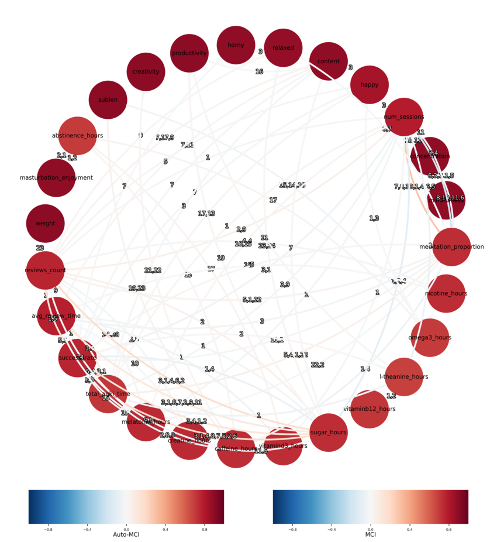](./img/yield/graph.png)

(Click for higher-resolution version.)

[Code](./code/yield/analysis.py) using
[tigramite](https://jakobrunge.github.io/tigramite/),
[output](./code/yield/output.txt).

Bucketlist
------------

* See a nuclear explosion
* Cuddle a penguin
* Have an FFM threesome
* See aurora borealis
* See a total eclipse
* Experience zero gravity

Managing Magical Realityfluid
------------------------------

All of the following depend on many assumptions, including something like
[UDASSA](http://fennetic.net/irc/finney.org/~hal/udassa/summary1.html)
being correct and humans having access to the correct
universal notion of simplicity as measured by [Kolmogorov
complexity](https://en.wikipedia.org/wiki/Kolmogorov_Complexity) by
some "natural" programming language. Thus don't take it seriously,
it's LessWrong philosophy after all.

1.	Using [tungsten](https://en.wikipedia.org/wiki/Tungsten) cubes
	as beacons is sub-optimal<!--TODO: link Falkovich-->. They just
	lie around at home, and spacetime separation with the beacon
	(e.g. when out working, walking around &c) is not great. Tungsten
	cubes are also fairly squatted by now, many people have them
	for non-realityfluid-gathering reasons.
2.	An alternative is a small object to carry in one's wallet or on
	one's keychain.
	1.	I have a small vial with [tritium](https://en.wikipedia.org/wiki/Tritium) that I bought
		from Amazon, which seems less squatted than
		tungsten cubes—[humanity produces <100kg of
		tritium/year](https://en.wikipedia.org/wiki/Tritium#Fission),
		but most of that is discharged, and
		probably <2kg are sold annually, mostly in
		the context of [tritium radioluminescent
		keychains](https://en.wikipedia.org/wiki/Tritium_radioluminescence).
	2.	Tritium has the advantage that is decays with a half-life
		of ~12.32 years, so individual observer-moments are
		somewhat distinguishable from each other by the varying
		nature of the beacon. Tritium is also a fairly simple
		isotope that doesn't occur in high concentration anywhere
		in nature.
	3.	The beacon can be made much stronger buy buying a second
		tritium keychain after some time delay, since there are
		~0 people who carry around two slightly decay-staggered
		vials of tritium. I haven't done this.
	4. Another option is to collect [americium](https://en.wikipedia.org/wiki/Americium) from smoke detectors.
3.	Another way of accumulating realityfluid is to be close
	in spacetime to the outputs of very short programs. Thus,
	[busybeaverologists](https://en.wikipedia.org/wiki/Busy-beaver)
	(especially busybeaverologists who compute longer versions of
	the outputs of hitherto unexplored short programs) might be the
	human observer-moments with the largest amount of realityfluid.
	1.	Other candidates include people
		who have worked with [ultra high
		vacuum](https://en.wikipedia.org/wiki/Ultra-high_vacuum)
		and instances of people creating
		[extremely low-temperature
		environments](https://en.wikipedia.org/wiki/Absolute_Zero#Very_low_temperatures).
	2.	While I haven't done any busybeaverology,
		I *have* found two [simply-generated integer
		sequences](/about.html#In_the_Universal_Prior) that no
		other human had identified beforehand, which I guess
		point at me reliably in the universal prior.
4.	One can modulate one's realityfluid by changing the spacetime
	separation from a beacon. This allows for making less desired
	moments "less real" and more desired moments "more real" by
	moving away from and closer to the beacon; "I feel sad → I
	toss the beryllium dodecahedron".

Shake Brains First
-------------------

Some people are very interested in neurotechnology,
e.g. [BCIs](https://en.wikipedia.org/wiki/Brain-computer_interface),
neuromodulation through transcranial [direct current
stimulation](https://en.wikipedia.org/wiki/Transcranial_direct-current_stimulation)/[pulsed
ultrasound](https://en.wikipedia.org/wiki/Transcranial_Pulsed_Ultrasound)/[magnetic
stimulation](https://en.wikipedia.org/wiki/Transcranial_Magnetic_Stimulation)
or even [deep brain
stimulation](https://en.wikipedia.org/wiki/Deep-brain_stimulation).

The applications people seem most excited by in relation to
neurotechnology appear to fall into the categories of (1) *outputting
information from the brain* and (2) *inputting information into the
brain* at a higher throughput/higher fidelity/lower latency, as well
as the resulting compound ability to (3) *send mental gestalts/felt
senses/ideas between people*. I'll call these "I/O applications".

E.g. a common imagination is that with BCIs, one'd be able to control
computers much more quickly and accurately than with a mouse and keyboard,
or retrieve arbitrary facts from Wikipedia as-if from long term memory,
or send one's own understanding of a complicated political issue to a
conversation partner and have them understand ones perspective.

I think those are great goals, and hope people make progress on them.
But they are also extremely lofty and complicated goals, and miss options
for neurotechnology because they treat the brain as something that is
best abstracted as a computer.

Aspects of brains that make I/O applications difficult are that
(1) brain activation patterns are very difficult to interpret,
*especially* in the realm of more complicated cognition occurring
in the [neocortex](https://en.wikipedia.org/wiki/Neocortex),
likely even more difficult than the ones of current large
neural networks80%; and (2) complicated high-level
patterns will not or only very weakly translate between different
people90%. Those difficulties seem likely because human
brain states are extremely high-dimensional, and almost all structure
in the neocortex is learned during a humans' lifetime, so it's
unlikely that similar structures are learned by default. (This does
not apply to lower-level structures in neuroanatomy like the fact
that [Broca's area](https://en.wikipedia.org/wiki/Broca's_Area)
is responsible for speech production, and [Wernicke's
area](https://en.wikipedia.org/wiki/Wernicke's_Area) is responsible for
speech comprehension, but e.g. to things like whether a [grandmother
neuron](https://en.wikipedia.org/wiki/Grandmother_neuron)/area is
present.)

1. entails that learning rich & fast output modularities from neural
activity alone would require learning mappings between neural activity and
desired output patterns in a long & complicated machine learning process,
and even more so if one wants to input information (since output at
least often involves the motor cortex, which is fairly well understood).

2. entails that such patterns, even if learned for a single person or
group of people, only transfers weakly or not at all to applying some
neurotechnology to a new person.

Despite probably sounding pessimistic about neurotechnology, I actually
think that there's great promise, even if we believe that neural activity
is difficult to interpret beyond current understanding of neuroanatomy
*and* doesn't translate across people.

1. There is great promise in simply testing existing stimulation techniques like [tDCS](https://en.wikipedia.org/wiki/Transcranial_direct-current_stimulation)/[tFUS](https://en.wikipedia.org/wiki/Transcranial_Pulsed_Ultrasound)/[TMS](https://en.wikipedia.org/wiki/Transcranial_Magnetic_Stimulation) and (potentially) [DBS](https://en.wikipedia.org/wiki/Deep-brain_stimulation) on our current understanding of neuroanatomical structure, using such tests to validate our understanding, and induce basic sensations/emotions in people.
	1. Applications of this include increasing people's hedonic tone, finding ways to increase specific variants of [psychological](https://stephenmalina.com/post/2021-07-01-energetic-aliens-among-us/) [stamina](https://www.overcomingbias.com/p/stamina-succeedshtml) and willpower/motivation/discipline/resisting temptation (Claude 4.5 Sonnet tells me the neuroanatomy here is slightly complicated, hinting at several different aspects of willpower), reducing fear in contexts where it isn't appropriate, and so on.
	2. Extending such search could involve stimulating some regions based on hunches and seeing what happens, [Constantin 2023](https://sarahconstantin.substack.com/p/why-should-neuroenhancement-be-possible) goes into this.
	3. There's some work happening here already, see e.g. [Reznik et al. 2014](./doc/stimulation/transcranial_ultrasound_reduces_worry_reznik_et_al_2014.pdf) for reducing worry and [Sanguinetti et al. 2017](./doc/stimulation/transcranial_ultrasound_improves_mood_and_affects_sanguinetti_et_al_2017.pdf) for improving mood, as well as rTMS for treating [depression](https://en.wikipedia.org/wiki/Transcranial_Magnetic_Stimulation#Depression) and [OCD](https://en.wikipedia.org/wiki/Transcranial_Magnetic_Stimulation#Obsessive-Compulsive_Disorder_\(OCD\)).
2. If we have Neuralink-style implanted BCIs available, the immediate application I can think of is the ability to capture, store and replay mental states, which I'll call a "mental camera".
	1. The concept is simple: The implanted electrodes are always recording whatever neural activity they can record, and the human can decide to store that activity to an external device at any point they want. At any later point, those human can decide to set same electrodes to a charge equal to some recorded neural activity.
		1. This has similarity to steering LLMs via [activation addition](https://arxiv.org/pdf/2308.10248).
	2. This doesn't require any interpretation of the neural activation: neural activations are stored as a vector of charges measured by the electrodes, and replayed by setting the same charge. Since this happens for a single person, this also doesn't run into any translation problems (except for neural activations becoming less effective over time, due to change in neuronal tissue around the electrodes).
	3. Some applications:
		1. __Entertainment__: The mental camera can be used as exactly that, a camera; users could decide to store and replay experiences simply for the sake of entertainment/sentimentality. Over long timespans one could re-experience especially treasured previous felt senses.
		2. __Reconstructing difficult-to-create states__: Similarly, this would allow users to be able to shape their mental landscape by e.g. replaying moments they found inspiring, had a felt sense of what their true goals were, or felt particularly disciplined; allowing them to induce again states that are (from their judgement) appropriate for some situation.
			1. In the context of meditation this would allow for a more efficient way of entering into specific states again, instead of having to construct them repeatedly, while still reinforcing the ability of the brain to enter those states.
			2. In the context of solving complicated problems, one could store parts of the mental state at a point in time when one understood the problem best. For example, programmers often report that being interrupted while debugging a complicated problem is highly disruptive, since it often takes hours to construct the mental state of having some understanding of the problem.
		4. __[Spaced repetition](https://gwern.net/Spaced-repetition)__: Reconstructing specific states with a mental camera would, of course, be immensely helpful in the context of trying to consolidate memories.
		5. __Tree search__: If the technology works at high fidelity, one could imagine using it as "Hansonian Ems-lite", e.g. performing a tree search over mental states in the context of solving difficult problems, back-tracking to more promising states and being able to partially reset after going into a rabbit-hole. This, however, may be quite jarring to experience if not implemented carefully.
		6. __Mixing states__: If possible, this could enable mixing previous states to create specific desired moods.
			1. This won't work if linear/[n-cubic](https://en.wikipedia.org/wiki/Tricubic_Interpolation)/whatever [interpolation](https://en.wikipedia.org/wiki/Multivariate_Interpolation) between states produces unpleasant/jarring/meaningless states.
	4. Difficulties
		1. The brain may have difficulty shifting into previously experienced states, especially if those are older and not as compatible with current neural connections.
		2. Injecting older brainstates may be quite unpleasant if they are incompatible with current ones.
			1. Since measured activity patterns would simply be a vector, one could ramp up the intensity of the electode charge continuously as to make the experience less jarring.
		3. Especially in cases where the number of electrodes is small, the stored neural states could be not rich enough to carry much semantic information, and one would be restricted to faint felt senses.

I think these kinds of applications are more realistic than current
plans for mentalese communication between humans or instant Wikipedia
fact recall, and still very useful.

I Believe the Value Misspecification Argument
----------------------------------------------

See [here](./automated.html#IV_GoalGuarding__Adversarial_Examples).

Some Thoughts on the Stupid Successionism Debate
-------------------------------------------------

Successionism is a view of AI that claims that the creation of ASIs is
inherently good because they are our deliberately created successors.

The standard retort to successionism is that even if we try to
deliberately create successors, they may not be *good* or *valuable*
in the same way our successors would normally be, that it is a hard
problem to create superintelligent AIs that are moral patients and agents.

From here, the conversation usually splits into two different lines:
(1) That by default our far future human successors would also be created
"by accident" in a very uncontrolled way, and (2) that firmly locking in
current human values would be myopic, since there are surely much more
rich and interesting new forms of value to be discovered by letting
future ASIs explore the space of possible values. Sometimes there is
(3) a misunderstanding that anti-successionists don't believe that AIs
can be moral patients/agents in general.

The first remarks basically have the same underlying "vibe", they both
claim that value drift is not necessarily bad and/or avoidable, that
we've tolerated it so far and that it's turned out well/adaptively.

The standard non-successionist answer then is that there may
have been a misunderstanding, and that the goal is *not* value
lock-in at exactly 2025-level WEIRD moral sensibilities, but
to lock in something I'll call the abstract generator of [human
values](https://www.lesswrong.com/posts/YLRPhvgN4uZ6LCLxw/human-wanting).
Basically, so the assumption goes, there is some findeable idealized
process which can compute all variants of trajectories of human values,
including WEIRD moral sensibilities, Aztec cultural practices (including
sacrifice) from early Mexica practices, and their likely evolution,
Chinese confucianism, and many others, able to [extrapolate them
coherently](./cs/ai/alignment/cev/coherent_extrapolated_volition_yudkowsky_2004.pdf)
into the future, while avoiding [siren
worlds](https://www.lesswrong.com/posts/nFv2buafNc9jSaxAH/siren-worlds-and-the-perils-of-over-optimised-search).

The goal is to find that generator and lock *that* in, plausibly seeded
with the current desires, wishes, utilities, wantings, urges, fetishes
and aspirations of humans that are currently alive, and *not* [lock those
in directly](https://joecarlsmith.com/2024/01/11/an-even-deeper-atheism).

As for (3): That's usually just a misunderstanding, especially when
transhumanists speak to transhumanists. There are people who don't
believe that ASIs can be moral patients or moral agents, sure, but are
they in the room with us right now? Also, for a transhumanist the future
modifications of some humans will plausibly make them qualitatively as
different from current humans as future ASIs from current humans.

After that the conversation usually gets a bit murky, and as a ~non-successionist[^clari] I don't think
I understand the successionists well enough to represent them maximally
faithfully, but I'll try.

[^clari]: AIs can be moral patients98% and agents99%, and there could be an extremely valuable future with no humans or human-descended minds but it's very unlikely0.1% to come to be by default. In most instigations of this future it would involve great amounts of theft (of the reachable universe from current humans), if not outright genocide of those humans, and thereby tarnishing the future even if it's otherwise quite valuable.

Four answers spring to mind:

1. If we lock in this abstract generator, we will lose out on moral progress outside of the envelope of this abstract generator. There are moral advancements that can only be made by minds that are vastly beyond humans, because there are axes of value that can only be discovered by exploring the entire space of possible values.
2. This generator of human values does not produce values that are adaptive enough to survive into the future, so *if* it could be locked in that would spell the end of life or self-replication in the observable universe, or will be outcompeted by [systems focused on pure self-replication](https://www.lesswrong.com/posts/evYne4Xx7L9J96BHW/video-and-transcript-of-talk-on-can-goodness-compete).
3. This generator of human values is too unconstrained, so the space of values is vacuously large, so the future is wildly unconstained and we get something as-if pulled from the space of possible values at random anyway[^measure].
4. The generator of human values is something that's ~shared between all ~self-replicating entities anyway because game-theoretic considerations push towards it reliably, and humans were forged in a game-theoretic environment in the physical world which is shared by us and future ASIs.
5. There is a variant of this position that basically says that optimal/maximal adaptation/game-theoretic behavior/dissipation=ethics/morality/goodness.

[^measure]: Though: What measure on which space are we using here, exactly?

Here's some thoughts on those arguments:

1. I find this one the most interesting one of the bunch.
	1. I'm open to the option of [radically upending our understanding of the cosmos](./ontological.html), but I don't necessarily believe that such upending would necessarily entail a broadening of values—it could just as well be the case that novel philosophical considerations lead to the discovery that e.g. [error theory](https://en.wikipedia.org/wiki/Moral_Error_Theory) is correct, or that most previous notions of value were incorrect, e.g. by discovering that [solipsism](https://en.wikipedia.org/wiki/Solipsism) is true and thus the number of moral patients is one.
	2. The desire to unearth novel moral considerations and enact them is already present in [some](https://en.wikipedia.org/wiki/Peter_Singer) [humans](https://en.wikipedia.org/wiki/John_Stuart_Mill), so it's also in the generator of human values. So propensity should not be a problem.
		1. The desire of humans to figure out morality is stronger than their desire to avoid figuring out morality, especially if the cost is low70%.
	3. Is capability a problem? Well, arguably the ASIs seeded with the generator of human values and the posthumans accompanying them are going to be as capable as the ones exploring the space of possible values by default.
	4. Another question I have about the "explore all possible values" is whether the proponents indeed mean the space of *all* possible values.
		1. As in, all possible [utility functions](https://en.wikipedia.org/wiki/Utility_Function) on universe-histories?
		2. I'd call this vacuously large, and will defend that that will [almost surely](https://en.wikipedia.org/wiki/Almost-surely) be valueless.
		3. My guess is that proponents mean something different by "the space of possible values", but it'd be worth it to elaborate on *what that is, exactly*.
2. This one worries me much more. It seems plausible that it's true30%, and if that's the case human values may go down fighting, but they will go down. Much more on this [here](./notes.html#Error_Correction_as_a_Replacement_Backstop), unfinished.
3. I don't believe that the generator of human values is vacuously large.
	1. There are tons of possible things humans don't care about: Arranging lungfish scales in hexagonal patterns, making the world as yellow as possible, introducing spiral turbulence in the gas clouds of jupyter, any random combination of atoms…
	2. I do buy that we might be under-estimating how big the space of evolution of possible future human value trajectories could be, and it may be too vast to explore in full, so trade-offs will have to be made.
4. I don't think so.
	1. That view needs to explain why a lot of the natural world includes [strange phenomena in evolution](https://www.lesswrong.com/s/MH2b8NfWv22dBtrs8/p/pLRogvJLPPg6Mrvg4) and to a lesser extent predation, parasitism, hostile takeover of companies, invasions and the likes. (The latter aren't exactly *counter* human values, but human values usually include wanting to avoid those outcomes at mutual benefit.)
5. My answer depends on the variant but is basically "no", "what the hell", maybe "what into the payoff matrices though?"

<!--Game theory of advocating successionism, Hansonian "Your default
successors will also be “misaligned” in this way", Where is the
abstract generator? In the genome? In the environment + culture +
genome? Distinction between gripping maximally tight/being maximally
lose vs. the spectrum inbetween-->

Quantum Computing is about Atoms, not Bits???
----------------------------------------------

*epistemic status*: Stating impressions, but I don't know much about
quantum physics (or quantum computing!). Someone more qualified please
write the accurate version of this post.

That said: I think people have been hyping quantum computing
backwards. The specific algorithms that are always brought up as
providing a relevant speedup over their classical counterparts are
[Shor's algorithm](https://en.wikipedia.org/wiki/Shor's_Algorithm) and
[Grover's algorithm](https://en.wikipedia.org/wiki/Grover's_algorithm),
but not much relevant economic activity is tied up with
finding the prime factors of numbers, and while getting a
[radical](https://en.wiktionary.org/wiki/radical#Etymology) speedup in
unsorted search is cool, the setup costs may only be worth it except
for extremely large searches:

> Even when considering only problem instances that can be solved within
one day, we find that there are potentially large quantum speedups
available. ... However, the number of physical qubits used is extremely
large, ... . In particular, the quantum advantage disappears if one
includes the cost of the classical processing power required to perform
decoding of the surface code using current techniques.” The most recent
of the references listed above [[11](https://arxiv.org/abs/2307.00523)]
estimates that achieving a quantum advantage via a quadratic speedup
requires at least a month-long computation already if each iteration
contains at least one floating-point operation.

*—Dalzell et al., [“Quantum algorithms: A survey of applications and end-to-end complexities”](https://arxiv.org/pdf/2310.03011#subsection.0.4.1) p. 76, 2023*

Relevantly, with cheaper quantum error correction this may drop, and
I vaguely remember Aaronson claiming that performing unsorted search
with tens of terabytes is a low estimate for when Grover speedups will
be useful.

For cracking 2048-bit RSA and 256-bit ECC:

> The physical resources required to implement these logical
circuits fault tolerantly depends on many details of the
hardware, including the error rate, the physical gate speed,
and the available connectivity. In both cases (2048-bit RSA
[[10](https://arxiv.org/pdf/2310.03011#cite.21@gidney2021HowToFactor),
[29](https://arxiv.org/pdf/2310.03011#cite.21@ha2022ShorResources)]
and 256-bit ECC
[[25](https://arxiv.org/pdf/2310.03011#cite.21@webber2022HardwareSpecifications),
[26](https://arxiv.org/pdf/2310.03011#cite.21@gouzien2023catCodeEllipticCurve),
[27](https://arxiv.org/pdf/2310.03011#cite.21@litinski2023EllipticCurvesBaseline)]),
given current hardware schemes restricted to nearest-neighbor 2D
connectivity with logical qubits encoded into surface codes, the number
of physical qubits is estimated to be on the order of 10 million and
the computation runs for at least 3–10 hours (significantly longer
than this for platforms with relatively slower physical gate speeds).

*—Dalzell et al., [“Quantum algorithms: A survey of applications and end-to-end complexities”](https://arxiv.org/pdf/2310.03011#subsection.0.6.1) p. 114, 2023*

which is certainly much faster, but also much less
economically useful, and in some sense economically
*disvaluable* because now we have to find [post-quantum
cryptography](https://en.wikipedia.org/wiki/Post-Quantum_Cryptography)
methods.

I don't have a full picture of the possible applications for quantum
algorithms, but my impression is that for purely bit-focused areas such as
e.g. logistics or supply chain optimization or even machine learning the
algorithms (1) are fairly narrow, (2) usually don't offer an exponential
speedup *or* only offer it if we postulate specific setups (e.g. the [HHL
algorithm](https://en.wikipedia.org/wiki/HHL_algorithm) for estimating
quadratic functions of the solution of a system of linear equations
depends on ["the solution vector, `$|b⟩$`, […] be efficiently
prepared"](https://en.wikipedia.org/wiki/HHL_algorithm#Implementation_difficulties)),
(3) often the best classical algorithms exploit some structure that
makes them comparable in performance to quantum algorithms (such as
sorting an [index](https://en.wikipedia.org/wiki/Database_index)
once and searching in logarithmic time repeatedly) and (4) that
finding exact solutions to computational problems efficiently is not
a large bottleneck on bit-focused parts of the economy, except in
training LLMs. I feel skeptical about quantum machine learning, and my
guess is that if we [read the fine print on quantum machine learning
speedups](https://www.scottaaronson.com/papers/qml.pdf) we'll often not
find them useful in practice:

> So in summary, how excited should we be about the new quantum machine
learning algorithms? To whatever extent we care about quantum computing
at all, I’d say we should be excited indeed: HHL and its offshoots
represent real advances in the theory of quantum algorithms, and in a
world with quantum computers, they’d probably find practical uses. But
along with the excitement, we ought to maintain a sober understanding
of what these algorithms would and wouldn’t do: an understanding
that the original papers typically convey, but that often gets lost in
secondhand accounts.  
The new algorithms provide a general template, showing how quantum
computers might be used to provide exponential speedups for central
problems like clustering, pattern-matching, and principal component
analysis. But for each intended application of the template, one still
needs to invest a lot of work to see whether (a) the application satisfies
all of the algorithm’s “fine print,” and (b) once we include the
fine print, there’s also a fast classical algorithm that provides the
same information.

*—Scott Aaronson, [“Quantum Machine Learning Algorithms: Read the Fine Print”](https://www.scottaaronson.com/papers/qml.pdf), 2015*

Hence: Quantum computing looks quite underwhelming on the side of bits.

My best guess is still that quantum computing is still extremely
promising, because quantum algorithms are really good at simulating
quantum systems, and the world is at its basis quantum.

> Despite the apparent exponential cost of exact classical methods
for this task, scientists have made incredible progress over the last
century via increasingly sophisticated approximate methods. As a result,
quantum chemistry is now a core part of several applications, including
the analyses of chemistry experiments, the pharmaceutical drug discovery
pipeline, and the optimization of materials for catalysts and batteries.

*—Dalzell et al., [“Quantum algorithms: A survey of applications and end-to-end complexities”](https://arxiv.org/pdf/2310.03011#section.0.2) p. 36, 2023*

There's been some speculation that accurate quantum computers can even
help with the construction of next-generation quantum computers

> I wish we had a quantum computer because by the way, the first thing the
quantum computer will allow us to do is build quantum computers, because
it's going to be so much easier to simulate atom-by-atom construction
of these new quantum gates.

*—Dwarkesh Patel & Satya Nadella, [“Satya Nadella — Microsoft’s AGI plan & quantum breakthrough”](https://www.dwarkesh.com/p/satya-nadella), 2025*

but my impression is that these kinds of flywheel-arguments are usually
not applicable and usually some different bottleneck kicks in.

But otherwise, quantum algorithms seem really useful
for simulating the interactions of small molecules and
their formation, figuring out the dynamics of chemical
interactions, maybe even making progress on [atomically precise
manufacturing](https://www.gap-map.org/gaps/inability-to-perform-chemistry-with-direct-positional-control/)
and resolving the [Drexler-Smalley
debate](https://en.wikipedia.org/wiki/Drexler-Smalley_debate_on_molecular_nanotechnology)???

There is also some hope that quantum computing will
allow us to make [progress in nuclear and particle
physics](https://arxiv.org/pdf/2310.03011#section.0.3), but I can't
immediately think of any industrial applications of such progress.

If my understanding here is correct, then that's way cooler
than progress in bits! Humanity hasn't made much [progress in
atoms](https://www.lesswrong.com/posts/Xqcorq5EyJBpZcCrN/thiel-on-progress-and-stagnation)
recently, while making tons of progress in bits, so that might be why
people are hyping quantum computing as a bit-focussed technology—they
can't conceive of anything else? And communicating the advantages of
quantum computing has been extremely backwards, which is usually lead with
"quantum computing will break this strange cryptography thing", *not*
"quantum computing will let us make batteries that are substantially
more efficient", guess which of those is more easily understandeable
to laypeople‽

So, yeah, I think quantum computing is hype-worthy, though my best guess
is that the magnitude of current hype on it is too large relative to
other technologies. But: the current hype is mis-directed, and can be
redirected in the correct direction with a simple message: __Quantum
Computing is About Atoms, Not Bits__.

Humanity Learned Almost Nothing From COVID-19
----------------------------------------------

[Moved here](./covid.html).

<!--Why Are There So Few Natural NP-Complete Problems with Superquadratic Verifiers?
---------------------------------------------------------------------------------

https://claude.ai/chat/3a9ba552-a477-4480-9495-64a90e3eaaff

It's fairly easy to construct NP-complete problems with cubic verifiers
and above, but they don't appear in practice. Instead, most verifiers
of NP-complete problems are linear, some are quadratic (Claude
Sonnet-generated table [here](./outputs/verification.html)). Why?

1. It's a contingent part of our tendency to choose NP-complete problems to focus on.
2. Our physics favours NP-complete problems with subcubic verifiers.
3. There's a deep complexity-theoretic reason why most (all?) "natural" NP-complete problems have subcubic verifiers.

Why Are There No Real-World Phenomena With Γ-Like Growth?
-----------------------------------------------------------

Coasean Firms as a Lossy Nested Decomposition of the Societal Optimization Problem
------------------------------------------------------------------------------------

Required reading: [Competitive
Markets as Distributed Backprop (johnswentworth,
2018)](https://www.lesswrong.com/posts/brhWPoNsBN7za3xjs/competitive-markets-as-distributed-backprop),
[In Soviet Union, Optimization Problem Solves You (Cosma Shalizi,
2012)](http://bactra.org/weblog/918.html).

https://claude.ai/chat/6ad1f792-e006-44dd-a450-f4291f70bbb0
-->
