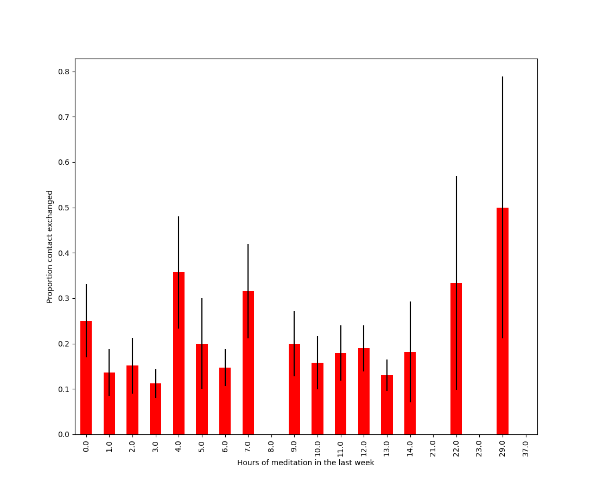
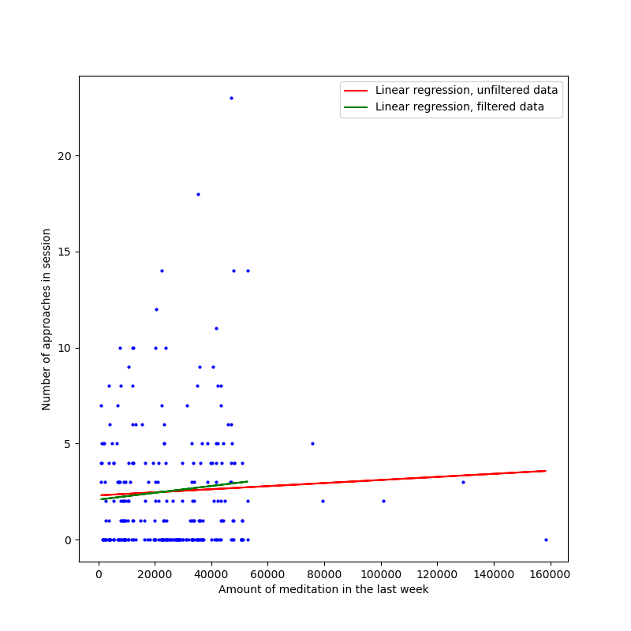

[home](./index.md)
------------------

*author: niplav, created: 2022-03-12, modified: 2025-03-07, language: english, status: in progress, importance: 2, confidence: other*

> __Short texts on pickup, mostly daygame.__

Notes on Pickup
================

I noticed that a lot of my [notes](./notes.html) were about
[pick-up](https://en.wikipedia.org/wiki/Pick-up_artist), especially
daygame, so I decided to collect them here, in a separate file.

Approach Anxiety
----------------

> An die Rippen pocht das Männerherz,  
Vorüber an hohlen Totengesichtern  
Niederjagt die Front der Major,  
Halt!  
Und Regimenter fesselt das starre Kommando.
>
> Lautlos steht die Front.

*— [Friedrich Schiller](https://en.wikipedia.org/wiki/Friedrich_Schiller), “Die Schlacht”, 1805*

I had very big problems when trying to overcome approach anxiety. (I have
heard that I was not alone in this.) Since this seems to be a common
problem, it may be worth it to share a method that was successful for
me to become more comfortable with it. To make progress on that front,
I set a goal for several weeks in advance, similar to this:

* 1st week: Ask 1 guy a day for his number
* 2nd week: Ask 2 guys for their numbers
* 3rd week: Ask 3 guys for their numbers
* 4th week: Ask 3 guys and 1 woman for their numbers
* 5th week: Ask 2 guys and 1 woman for their numbers
* 6th week: Ask 1 guy and 2 women for their numbers
* 7th week: Ask 3 women for their numbers

If I failed in a week, I precommitted to donating a certain amount like
5€ to an effective charity.

In contrast to the other methods used and advertised by people who cold
approach, this worked quite well. After the first 4 weeks, I took 1 week
off, but went back to approaching the week after.

This, of course, only can work if one is able to ask men for their
numbers. For a reason that eludes me, this is easier for me than
approaching women, though the gap is shrinking with exposure.

Ask About Frequency of Being Approached After Rejection
--------------------------------------------------------

After having been rejected by a woman during a daygame approach, I usually
ask her “How often does this kind of thing happen to you? Like, once a
month, or once a week?”, unless the woman seems to be in a great hurry.
The woman usually gives an answer (albeit often not a very quantitative
one), and if it is quantitative enough, I note it into my spreadsheet
after the approach (I am, at heart, still a gigantic nerd).

This is useful for two reasons.

It gives me a good feeling for which parts of the city I'm in are the
target of many daygamers, and which are undergamed. That way, I can find
out which areas are neglected and target those.  That has two advantages:
egoistically, it gives me better results (also, there are fewer blow-outs
and abrasive rejections), as women being approached frequently makes
it lose the magic for them, altruistically, it puts less competitve
pressure other daygamers (competition is weaker) and the good looking
women in the areas (they don't get approached quite as frequently).

It also gives me an idea which kinds of women are targeted by other
daygamers, and find out whether I have a type of woman I like that is
more niche. Also, I'm generally interested in whether better looking
women are approached more frequently (tentative answer, eye-balling my
spreadsheet: yes).

There is of course a lot of noise in that data: Some very good looking
women I have asked about this after rejection have told me that they
get approached once a year or less (but, otoh, some women are apparently
approached *every day*). I'm not sure I can chalk that discrepancy up to
randomness+location+movement patterns (if a woman doesn't cross the city
center that often, she'll naturally get approached less).

That said, it's not a very precise question, and is likely interpreted
in many different ways, so I don't put that much weight on the responses.

Note that this makes sense only *after* the woman has rejected
you. If you ask during the approach, you are doing two questionable
things: (1) asking questions and (2) focusing on your competition,
instead of the woman in front of you. See [Heiman et al. 1995 ch.
13](https://www.goodreads.com/book/show/34968.The_New_Strategic_Selling "The New Strategic Selling")
why this is generally a bad idea. This is
also the strongest argument for why you shouldn't ask about approach
frequency: In case you see the woman at some later point, she might have
changed her mind, and asking her about approach frequency burns parts
of that bridge.

She Needs to Know You're Not a Weirdo
--------------------------------------

> The number of normies out there is much vaster than the Internet
realizes. If you are reading this you are probably not a normie. You
are an alienated weirdo and need help to cultivate being normal enough
to f\*\*k hot chicks while not losing your weird edge.

*— [TheRedQuest](https://theredquest.wordpress.com/), [“Compassion and Empathy for Chicks”](https://theredquest.wordpress.com/2021/06/21/compassion-and-empathy-for-chicks/index.html), 2021*

A couple of days ago, I did an approach on a standing woman that was
(apparently) waiting for someone.  In the beginning she was giving mostly
1-word or 2-word answers, but warmed up over time. Even after rejecting
me (I believe that she was waiting for her boyfriend), she asked me a
couple of questions.

After the approach, I got thinking about why this happened. Maybe she was
just relieved that I was relaxed about being rejected. Maybe. But I also
believe that upon getting approached, a women' prior on you being a weirdo
is pretty high. Especially if you're a beginner at daygame and your body
language is undecided and low status, the odds that you're a bad kind
of weird (mentally ill/undersocialized/very unrelaxed about rejection)
are probably pretty high.  It's your job to demonstrate that this is
not the case, and that you're more normal than the situation might convey.

On the other hand, I'm not sure how this interacts with women that get
approached a lot—do they have a lower prior on bad weirdness from
guys who approach? This probably interacts with how common daygame is
in the environment.

On a related note, women are probably right in being very suspicious of
guys who approach them. Out of the 5 wings I've done daygame with, only 2
were reasonably well-adjusted people to the extent that I would consider
inviting them to a party I host (and I'm a pretty weird person myself).

I wonder whether there is a
[policy-level](https://www.lesswrong.com/s/uLEjM2ij5y3CXXW6c/p/vKbAWFZRDBhyD6K6A "Gears Level & Policy Level (Abram Demski, 2017)")
consideration of trying to be more normal during approaches as a beginner,
and then with becoming more advanced you slowly edge towards being
less normal (talking more & more openly about sex, being more direct)
(if you're very uncool, becoming more normal makes you cooler, but this
stops paying off at some point). On the other hand, this is probably
swamped by object-level strategies.

Reductionism on Approach Difficulties
--------------------------------------

> In 1922, anthropologist Ivor Evans described multiple
reasons for head-hunting among various societies in Borneo,
[writing](https://archive.org/details/amongprimitivepe00evanuoft) that;
>
> > The reasons for head-hunting among Bornean tribes in general seem
to have been threefold: firstly, the practice was not without religious
significance; secondly, it was considered a sport and the heads regarded
as trophies; and thirdly, among some tribes no youth was considered fit
to rank as a man until he had obtained a head, the women taunting those
who had been unsuccessful as cowards. (Evans, 186<!--TODO: typo here-->)
>
> A similar pattern was identified among societies on the island
of Kiwai in New Guinea in 1903 by missionary James Chalmers, who
[wrote](https://www.jstor.org/stable/2842999) that,
“When heads are brought home, the muscle behind the ear is given in
sago to lads to eat that they may be strong…The skull is secured,
and the more skulls, the greater the honour. No young man could marry,
as no woman would have him, without skulls.”
>
> In his volume on Head-hunters (1901), ethnologist Alfred Haddon wrote
that, “There can be little doubt that one of the chief incentives to
procure heads was to please the women.” In these societies, capturing
the heads of enemies is associated with masculine virility, and a young
man must seize the skulls of outsiders to be considered a viable partner
for a young woman.

*— [William Buckner](https://traditionsofconflict.com/blog/2018/4/19/head-in-hands-notes-on-the-extraction-and-display-of-human-heads), [“Head in Hands: Notes on the Extraction and Display of Human Heads”](https://traditionsofconflict.com/blog/2018/4/19/head-in-hands-notes-on-the-extraction-and-display-of-human-heads), 2018*

When trying to cold-approach women, nearly all men find that they manifest
a psychological block about going up to a woman and talking her first. The
most common variant is *approach anxiety*, which manifests itself as,
well, anxiety: a sinking feeling in the stomach, hectic movements,
undecisiveness and frustration. But another common variant is *approach
fatigue*, in which you have a flat vibe and no motivation to do any
approaches (“I *could* talk to her, but why bother?”).

Approach difficulties seem to have a variety of different causes. While
the best method is to go out, become more and more frustrated, and then
force yourself to approach (you can also work with your emotional state,
as described in [Krauser 2014](https://www.goodreads.com/book/show/31021519-daygame-mastery)
p. 64). There are different axes which can be intervened on independently:

1. Cognitive Approach Difficulties: Do you believe that approaching is a good idea?
	* If no:
		* try it, you will probably have some positive experiences
			* unless you have very high expectations
		* re-cast own identity as evil/mischievous
2. Biological Approach Difficulties: Do you have an embodied need to interact with women? Does you body want to get closer?
	* If no: try to increase sex drive
		* lifting
		* stopping porn consumption
		* stopping masturbation
		* experimentally, you could take testosterone, but I haven't tried this and don't think I will
3. Social Approach Difficulties: Are you in a social flow? Can you get into it?
	* If no:
		* do warm-ups:
			* compliments
			* regular everyday smalltalk
			* doing weird stuff
				* laying on the pavement
				* climbing on trees
				* doing push-ups
		* get a wing
		* get more social in general
4. Attraction Approach Difficulties: Are you actually attracted to the women you see?
	* If no: try to lower standards, for example by not masturbating or watching porn
5. Emotional Approach Difficulties: How nervous/lethargic are you before an approach?
	* Factors
		* walk more slowly
		* be relentlessly positive about everything you see

If the first four aspects are reduced, the last one should be easier to
tackle as well.

Instead of Recognizing and Dismantling Shit Tests, You Could Just Vibe Over Them
----------------------------------------------------------------------------------

I am *very bad* at recognizing shit tests. Usually, the evening on the
day after a date, I am reading something or meditating, and then sit
bolt-upright and think "Oh damn! __That was a shit test__!".

However, my experience after some of my recent dates
has been the following: I'm eating, or [assembling an air
filter](./notes.html#Building_a_Cuboid), and an epiphany hits me:
"Shit! *That was a shit test*, and __this is how I deflected it
automatically!__"

Now, I'm not going to give you the great secret at deflecting shit
tests per se (why would you listen to a person with [2 lays out of ~360
approaches](./data/daygame_approaches.csv) anyway?), but I still have
an opinion on this: Shit tests do exist, but trying to spot them and
consciously counteract them is perhaps misguided (I have even heard of
guys trying to memorize responses to shit tests, baffling).

<!--TODO: expand on these, and links for many of the terms-->

My reasons for this as roughly as follows:

* Consciously detecting shit tests takes a lot of mental energy (at least it would for me, which is the main reason I don't do it)
* It makes you focus more on her, not on the situation/relation, making you either invest too much or be too unrelaxed
* There are many other, and imho better, things to do with your emotional energy:
	* maintaining a positive vibe (especially on your side)
		* this one is key: if you have a good vibe (and perhaps have already approached girls before your date), and some experience in approaching, the chance that you'll respond to a shit tests with a counter-tease or the right answer automatically is much higher
	* escalation
	* spiking
	* fractionation
	* eye contact
	* vacuuming

Now, I'm not preaching the [wu wei](https://en.wikipedia.org/wiki/Wu_wei)
of game, or telling you that you should just become an effortless natural
overnight, but the conversation on shit tests feels confused to me,
and focusing on a misguided aspect of the interactions (judging from
a lot of online advice, I suspect, but have very little evidence for,
that many responses to perceived shit tests tend to be too adversarial).
I think that there are many other better parts of game to focus on.

But perhaps I haven't dated girls that are hot enough to throw strong
shit tests at me yet.

Leaving My Phone At Home
-------------------------

When I go out to approach women on the street (and, more recently, also
in shops) my prime goal is to actually do the approaches. I have found
that when I take my phone with me, the ubiquity of public WiFi where I
live paired with my slight internet addiction make me spend time browsing
the internet on my phone instead.

This is a classic example of an avoidance weasel: the hard thing is the
approach, so every possible slight distraction is amplified in strength
(I've had a wing going to approach in a bookshop, just to find him there
20 minutes later reading—not the right time, mate).

Instead of using my phone to collect numbers, I bring a small
notebook I also log my approaches and the time in, similar to [The Red
Quest](https://theredquest.wordpress.com/2019/02/18/low-cut-top-girl-opening-off-an-ioi-on-the-way-to-the-gym-fr/index.html):

> We chat a bit about a perfect party and I tell her I have a date with
the gym. We talk about the gym for a minute. I get out my notebook and
tell her to put her name and number in it.  
> She’s surprised by the notebook thing, so we talk about that a bit,
and I tell her about leaving my phone at home as that is a better way
to experience the world (also something true… the younger the chick,
the less they get this idea, except for Ms. Slav… the higher IQ, more
self-aware chicks often understand this and have a love-hate relationship
with their smartphones).

*—[The Red Quest](https://theredquest.wordpress.com), [““Low-cut top girl,” opening off an IOI on the way to the gym [FR]”](https://theredquest.wordpress.com/2019/02/18/low-cut-top-girl-opening-off-an-ioi-on-the-way-to-the-gym-fr/index.html), 2019*

This has some advantages and some disadvantages:

* Advantages:
	* It has far less potential for being a time waster (although I *have* found good use when being overcome by [the poetic muse](./microfiction.html#Poems))
	* It's slightly out of the ordinary, so perhaps makes the approach more memorable and stand out
	* Women sometimes remark on it (mostly positively, as far as I can tell), and I have used it for a bit of teasing ("you can still write, right?")
* Disadvantages:
	* Perhaps too weird, a cold approach on the street is already out-of-the-ordinary enough.
		* I've been told on a date that this (together with me not having any internet at home) brought her on the brink of flaking on me. Not having internet at home seems to have been a bigger problem, though.
	* You have to pay extra attention to whether the woman sees the contact information others have written there as well (this is not just hypothetical: I might`$_{25\%}$` have lost a lead through this).
	* There is no option to coordinate for a delayed instant date.
	* You can't make sure whether she has given you the right contact information (and this is perhaps even incentivized).
	* I can't record myself during approaches, though this could be solved through a dedicated recorder.

Overall, for me the effects of removing one weasel strongly outweigh
the downsides, but your mileage may vary.

Using Multi-Armed Bandits to Select Daygame Locations
------------------------------------------------------

Moved [here](./bandit.html).

Eyesight as a Neglected Factor in Daygame
------------------------------------------

While out with a wing on a recent daygame session (as one does), I
stupidly lamented the fact that my eyesight had gotten worse again and
my contact lenses weren't up to the task—he also has bad eyesight and
isn't doing anything during sessions to improve it.

This is pretty relevant in daygame: You want to be approaching women
you actually find attractive, and be able to pick up on quite subtle
indicators of interest from far away—for both of these things good eyesight
is very relevant.

If I have to go off proxies for facial attractiveness from far away,
I sometimes miss, and the result is that I approach a woman and after
stopping her decide that I don't actually like her (often because she's
older than I thought). A waste of time, and I often exit the set with
a compliment on her style, which is sometimes taken with gratitude and
sometimes taken with faint indignation. Those approaches don't move me
closer to my goal (sleeping with hot women) and often do take mental
effort to overcome approach anxiety, so I'd rather not do them.

So, on top of everything else, having good eyesight is a relevant factor
in daygame, and it's worth investing some money into correcting this.

(I've since made an appointment to get new contact lenses. My wing hasn't
undertaken any steps to fix his eyesight; oh well.)

Meditation Improves Vibe, Which Improves Everything Else
---------------------------------------------------------

I'd started approaching again in early July 2024 after a
1½ year-pause, but the old enemy (approach anxiety) had
been taking its toll on me, basically preventing me from
approaching at all. Then, later this summer, I went on a 10-day
[Goenka](https://en.wikipedia.org/wiki/S.N.Goenka#Meditation_Centres)
[meditation
retreat](https://en.wikipedia.org/wiki/Meditation_retreat#Meditation).
Those are always great; this time was the first where I went and did
daygame immediately afterwards.

The difference was noticeable and strong: In the week after the retreat,
I made ~15 approaches, and it'd've been more if I hadn't been under
some family obligations. My eye contact was good, my vibe carefree and
responsive, I noticed how the chicks I approached became calmer just by
talking with me for 10 seconds. I felt relaxation and calm pouring out
of me, and was just *happy*, it was great. The momentum from those 15
approaches also brought me on my current approaching streak, which is
going excellent by my lights.

Granted, a 10-day Goenka retreat is a heavy dose, but the
meditation (maybe combined with abstinence from masturbation,
which is also standard on those retreats) *definitely* made
a difference to my momentum. More work than psychedelics, but
[safer](./reports.html#Possible_Erectile_Dysfunction_from_an_LSD_Trip),
and possibly deeper.

It seems worth noting that I [didn't see a
difference](#Vascular_Tension_and_Attractiveness) in the success of my
approaches (in terms of objective results like bringing a chick out on
a date, or fucking her), so take all of this with a grain of salt.

The Red Quest: An Anthology
----------------------------

[The Red Quest](https://theredquest.substack.com/)'s many short
and memorable blogposts. For basic game content, read [Beginner
Daygame](https://www.goodreads.com/en/book/show/36009850-beginner-daygame)
and [Daygame
Nitro](https://www.goodreads.com/book/show/166195305-daygame-nitro),
but Red Quest's writing has style and some interesting tidbits you don't
get elsewhere. Here's some of his best posts.

### Practical Pickup

* [Basics like asking the girl out and escalation (2019)](https://theredquest.wordpress.com/2019/11/14/basics-like-asking-the-girl-out-and-escalation/)
* [Embrace the awkward (2017)](https://theredquest.wordpress.com/2017/05/22/embrace-the-awkward/)
* [Texting guide (2018)](https://theredquest.wordpress.com/2018/06/08/texting-guide/)
* [What I do when she sends nudes (2018)](https://theredquest.wordpress.com/2018/02/23/what-i-do-when-she-sends-nudes/)
* [If she is a women’s rights activist, sexual assault educator, or similar, RUN (2017)](https://theredquest.wordpress.com/2017/05/30/if-she-is-a-womens-rights-activist-sexual-assault-educator-or-similar-run.html)
* [The more game I’ve needed the worse the relationship has been (2017)](https://theredquest.wordpress.com/2017/09/19/the-more-game-ive-needed-the-worse-the-relationship-has-been/)
* [The holidays are coming up: shit tests, comfort tests, and gifts \[intermediate and above\] (2017)](https://theredquest.wordpress.com/2017/12/07/the-holidays-are-coming-up-shit-tests-comfort-tests-and-gifts/)
* [Catch and release women who want families (2018)](https://theredquest.wordpress.com/2018/01/12/catch-and-release-women-who-want-families/)
* [The best books for learning game (2017)](https://theredquest.wordpress.com/2017/12/02/the-best-books-for-learning-game/)

#### Randomness and Noise

* [What flaking looks like, from a woman’s perspective (2018)](https://theredquest.wordpress.com/2018/12/13/what-flaking-looks-like-from-a-womans-perspective/)
* [There is a very large amount of randomness (noise) in pickup and game (2018)](https://theredquest.wordpress.com/2018/12/19/there-is-a-very-large-amount-of-randomness-in-pickup-and-game/)

#### Sex Clubs and Non-Monogamy

* [Sex clubs, swingers, and game (2017)](https://theredquest.wordpress.com/2017/09/24/sex-clubs-swingers-and-game/)
* [Sex parties and sex clubs could be the next level of game (2018)](https://theredquest.wordpress.com/2018/01/21/sex-parties-and-sex-clubs-could-be-the-next-level-of-game/)
* [Non-monogamy is NOT for everyone (2018)](https://theredquest.wordpress.com/2018/10/01/non-monogamy-is-not-for-everyone/)
* [Jealousy and non-monogamy (2018)](https://theredquest.wordpress.com/2018/09/18/jealousy-and-non-monogamy/)

### Attractiveness

* [Don’t waste much time on video games (2017)](https://theredquest.wordpress.com/2017/05/23/dont-waste-much-time-on-video-games.html)

#### Fashion

* [Fashion and clothes for players (2019)](https://theredquest.wordpress.com/2019/02/25/fashion-and-clothes-for-players/)
* [Addendum to the fashion post: figure out your weaknesses (2019)](https://theredquest.wordpress.com/2019/02/27/addendum-to-the-fashion-post-figure-out-your-weaknesses/)
* [“Clothes That Attract Women” (don’t exist in and of themselves) (2017)](https://theredquest.wordpress.com/2017/05/05/clothes-that-attract-women-dont-exist-in-and-of-themselves/)
* [Men, game, and social media strategies (2017)](https://theredquest.wordpress.com/2017/07/09/men-game-and-social-media-strategies/)

#### Fitness

* [Most guys are weak. Be different: “Today’s men are not nearly as strong as their dads were, researchers say” (2017)](https://theredquest.wordpress.com/2017/05/21/most-guys-are-weak-be-different-or-todays-men-are-not-nearly-as-strong-as-their-dads-were-researchers-say.html)
* [“Sex, Steroids, And Arnold: The Story Of The Gym That Shaped America” (2018)](https://theredquest.wordpress.com/2018/08/24/sex-steroids-and-arnold-the-story-of-the-gym-that-shaped-america/)

#### Fucking

> I like experimenting. Many chicks have told me that, when they’ve
tried to bring toys into the bedroom in the past, their guys have been
threatened. Not me. I see man as the tool-using animal.

*—[TheRedQuest](https://theredquest.wordpress.com), [“Ms. Slav is back, and, also, use a vibrator during sex”](https://theredquest.wordpress.com/2018/08/25/ms-slav-is-back/), 2018*

* [Tell your girl to use a vibrator during sex, and other bedroom tips and sex skills for guys (2019)](https://theredquest.wordpress.com/2019/03/13/tell-your-girl-to-use-a-vibrator-during-sex-and-other-bedroom-tips/)

#### Food

* [Zero sugar will change your body and life (2017)](https://theredquest.wordpress.com/2017/06/15/zero-sugar-will-change-your-body-and-life/)

#### Photography and Sex Tapes

* [Anyone doing any online dating needs to learn basic photography skills (2017)](https://theredquest.wordpress.com/2017/04/29/anyone-doing-any-online-dating-needs-to-learn-basic-photography-skills/)

### Competition

* [Most guys don’t care much about getting laid, I hypothesize (2021)](https://theredquest.wordpress.com/2021/06/30/most-guys-dont-care-much-about-getting-laid-i-hypothesize/)
* [A lot of guys are pussies, but that means opportunity for the few who aren’t (2022)](https://theredquest.wordpress.com/2022/02/23/a-lot-of-guys-are-pussies-but-that-means-opportunity-for-the-few-who-arent/)
* [Be aggressive and do better than most guys: “When Women Pursue Sex, Even Men Don’t Get It” (2017)](https://theredquest.wordpress.com/2017/05/12/be-aggressive-and-do-better-than-most-guys-when-women-pursue-sex-even-men-dont-get-it/)
* [The need for basic game skills is still high (2017)](https://theredquest.wordpress.com/2017/08/18/the-need-for-basic-game-skills-is-still-high/)
 Psychology and Social Skills
* [Women don’t make emotional contracts (2018)](https://theredquest.wordpress.com/2018/02/26/women-dont-make-emotional-contracts/)
* [Chicks find it hard to get someone attractive yet interesting (2021)](https://theredquest.wordpress.com/2019/03/01/chicks-find-it-hard-to-get-someone-attractive-yet-interesting/)

### Player's Psychology

* [Be kind from a position of strength, not a position of weakness (2017)](https://theredquest.wordpress.com/2017/05/12/be-kind-from-a-position-of-strength-not-a-position-of-weakness/)
* [You only see the tip of the spear (2019)](https://theredquest.wordpress.com/2019/02/07/you-only-see-the-tip-of-the-spear/)
* [There is no easy way: there is only the hard way (2018)](https://theredquest.wordpress.com/2018/10/17/there-is-no-easy-way-there-is-only-the-hard-way/)
* [Be extreme (2019)](https://theredquest.wordpress.com/2019/03/29/be-extreme/)
* [The game challenge: doing what’s unnatural (2018)](https://theredquest.wordpress.com/2018/05/19/the-game-challenge-doing-whats-unnatural/)
* [Chicks find it hard to get someone attractive yet interesting (TheRedQuest, 2019)](https://theredquest.wordpress.com/2019/03/01/chicks-find-it-hard-to-get-someone-attractive-yet-interesting/)

#### Writing

* [You are part of “The Revolt of The Public and the Crisis of Authority in the New Millennium” (2019)](https://theredquest.wordpress.com/2019/01/10/you-are-part-of-the-revolt-of-the-public-and-the-crisis-of-authority-in-the-new-millennium/)

#### Emptiness

(Careful with these, especially as an early or intermediate player—they probably don't apply to you, and might damage your vibe.)

* [The deep psychology that keeps men in the game (2017)](https://theredquest.wordpress.com/2017/12/17/the-deep-psychology-that-keeps-men-in-the-game/)
* [The post about there not being much left for me to say, while encouraging other guys to carry on (2023)](https://theredquest.substack.com/p/the-post-about-there-not-being-much-left-for-me-to-say-while-encouraging-other-guys-to-carry-on)
* [Ramblings about a change in perspective towards game and life (2017)](https://theredquest.wordpress.com/2017/08/16/ramblings-about-a-change-in-perspective-towards-game-and-life/)
* [“Where PUAs go to die” (2017)](https://theredquest.wordpress.com/2017/10/09/where-puas-go-to-die/)

#### Darkness

Often the comments on these posts are very interesting, especially the
ones by [Nash](http://www.daysofgame.com/).

* [Veering into the dark zone of female psychology (2019)](https://theredquest.wordpress.com/2019/01/21/veering-into-the-dark-zone-of-female-psychology/)

### Society

* [What do we spend our excess money on? Sex. (2018)](https://theredquest.wordpress.com/2018/08/31/what-do-we-spend-our-excess-money-on-sex/)
* [My pet theory: people get discontent with what they have (2017)](https://theredquest.substack.com/p/my-pet-theory-people-get-discontent-with-what-they-have)
* [When girls shift from pure party mode to preferring guys with resources (2021)](https://theredquest.wordpress.com/2019/03/24/when-girls-shift-from-pure-party-mode-to-preferring-guys-with-resources/)

### Stories

* [Jeremy with the Burns (2018)](https://theredquest.wordpress.com/2018/11/08/jeremy-with-the-burns/)
* [Interesting Wednesday night. Happy New Year! (2019)](https://theredquest.wordpress.com/2019/01/01/interesting-wednesday-night-happy-new-year/)

#### Marriage and Divorce

* [Don’t marry unless you’re ready to pay (2017)](https://theredquest.wordpress.com/2017/07/05/dont-get-married-unless-youre-ready-to-pay/)
* [“Why so many women cheat on their husbands” (2017)](https://theredquest.wordpress.com/2017/09/21/why-so-many-women-cheat-on-their-husbands/)
* [Why a guy should never marry, as described by women (2017)](https://theredquest.wordpress.com/2017/10/26/why-you-should-never-marry-as-described-by-women/)
* [Skin in the game, marriage, The Red Pill (2018)](https://theredquest.wordpress.com/2018/03/30/skin-in-the-game-marriage-the-red-pill/)
* [“Why Happy Couples Cheat” from Esther Perel (2017)](https://theredquest.wordpress.com/2017/05/08/why-happy-couples-cheat-from-esther-perel/)

Vascular Tension and Attractiveness
------------------------------------

Men like to create theories on what they should do in order to become
attractive to women. One of those theories is that [muscular tension is
*unattractive*](https://chrislakin.blog/p/what-if-muscle-tension-is-sometimes):
It indicates that a man is hiding his intentions, trying to evade from
hostile telepaths (because he believes that, if his intentions were known,
he'd be shunned).<!--TODO: link to the hostile telepaths stuff-->

I think I can look into a related hypothesis, namely whether *meditation*
increases success from cold approaching women. The hypothesis is that
meditation decreases muscular tension, thus indicating that the approacher
doesn't have anything to hide, especially not his desire.

Given my [meditation data](./data.html#Meditation) (~2.7k meditation
sessions) and my [daygame approach data](./data.html#Daygame) (~650
approaches), I can select the meditations that occurred in the week
before an approach

        merged=pd.merge(meditations, approaches, how='cross')
        merged['diff']=merged['Datetime']-merged['meditation_end']
        merged=merged.loc[(merged['diff']<=pd.Timedelta(timeframe, 'd')) & (merged['diff']>=pd.Timedelta(0, 's'))]

sum up the amount of meditation done in that week

        summed=merged[['Approach', 'meditation_duration']].groupby('Approach').sum()

and round the amount of meditation done to the nearest hour, calculating
whether the approach resulted in me getting some kind of contact
information from the woman:

        both=pd.merge(approaches, summed, on='Approach')
        both['Rounded']=(both['meditation_duration']/(rounder)).round()
        both['Contactind']=both['Contact'].notna()

The result is then a dataframe indexed by the number of hours meditated,
with the expected number of times of getting a contact information,
plus the sample size:

        result=both[['Rounded', 'Contactind']].groupby('Rounded').agg(['mean', 'size'])

(Throw in some
[beta-distributed](https://en.wikipedia.org/wiki/Beta-distribution)
error bars, [code here](./code/vascular/analysis.py).)

Plotting the results:

The resulting DataFrame is:

        >>> result
                Contactind            std
                      mean size
        Rounded
        0.0       0.250000   28  0.080408
        1.0       0.136364   44  0.051157
        2.0       0.151515   33  0.061491
        3.0       0.112245   98  0.031726
        4.0       0.357143   14  0.123718
        5.0       0.200000   15  0.100000
        6.0       0.146667   75  0.040581
        7.0       0.315789   19  0.103939
        8.0       0.000000    8  0.000000
        9.0       0.200000   30  0.071842
        10.0      0.157895   38  0.058389
        11.0      0.179487   39  0.060678
        12.0      0.189655   58  0.051038
        13.0      0.130435   92  0.034923
        14.0      0.181818   11  0.111340
        21.0      0.000000    1  0.000000
        22.0      0.333333    3  0.235702
        23.0      0.000000    3  0.000000
        29.0      0.500000    2  0.288675
        37.0      0.000000    3  0.000000

I'll basically ignore anything north of 14 hours, because the sample
sizes are just too damn small. If I do that, then I don't immediately
*see* any clear pattern. It's not like meditating a bunch (~2h/day)
causes more women to give me their contact information, and if anything
the opposite seems to be the case.

Let's see what the [linear
regression](https://en.wikipedia.org/wiki/Linear_Regression) has to say:

	>>> slope, intercept, r, p, stderr=sps.linregress(both['meditation_duration'], both['Contactind'])
	>>> slope
	-6.349359906142442e-08
	>>> intercept
	0.16460352073438347
	>>> p
	0.9359174508450456
	>>> r
	-0.003251381879711259

Yep, just like I thought, the result could've just as well come from
random data. (Don't be fooled into thinking the slope is meaningfully
negative: Such a small p-value means it might just flip to positive at
the next datapoint).

<!--TODO: plot-->

### Number of Approaches

Does this the amount of meditation at least positively related to the
number of approaches I make? The intuitive reason for this would be
that anxiety prevents me from making approaches, and meditation reduces
anxiety.

We can simply re-use a bunch of code already written, as well as the
code from [here](./masturbation.html#Amount_of_Approaches); cross-merge, filter, aggregate, merge again:

	meditations=get_meditations()
	sessions=get_sessions()

	merged=pd.merge(meditations, sessions, how='cross')
	merged['diff']=merged['Return']-merged['meditation_end']
	merged=merged.loc[(merged['diff']<=pd.Timedelta(timeframe, 'd')) & (merged['diff']>=pd.Timedelta(0, 's'))]

	summed=merged[['Return', 'meditation_duration']].groupby('Return').sum()
	both=pd.merge(sessions, summed, on='Return')

And now, for the linear regression, as tradition demands:

	>>> slope, intercept, r, p, stderr=sps.linregress(both['meditation_duration'], both['Amount'])
	>>> slope
	np.float64(8.026186021852865e-06)
	>>> intercept
	np.float64(2.2975050356609614)
	>>> r
	np.float64(0.04649655949037112)
	>>> p
	np.float64(0.46878566789472265)

So, not quite a reliable p-value. But if one takes a look at the data,
there's a very clear limit of ~60000 seconds of meditation in the last
week (where everything above is meditation retreats). We can filter those
and re-run the linear regression:

	>>> filtered=both.loc[both['meditation_duration']<60000]
	>>> f_slope, f_intercept, f_r, f_p, f_stderr=sps.linregress(filtered['meditation_duration'], filtered['Amount'])
	>>> f_slope
	np.float64(1.7760415057361838e-05)
	>>> f_intercept
	np.float64(2.0773006401851606)
	>>> f_r
	np.float64(0.07875583484980017)
	>>> f_p
	np.float64(0.22413760495537624)

Seems a bunch more reliable than the data including retreats! We can
plot both:

Skip Connections
-----------------

Daygame can be viewed as a funnel process with (in extreme simplification)
three stages: (1) Approaching, (2) texting and (3) dating (for simplicity
ignoring same-day-(de)-lays, instant dating &c). I've always found
texting to be my least favorite stage, and I was happy when a wing of
mine recently suggested a method for avoiding texting: If an approach
is going well and she seems attracted, one can just ask the woman for
a date at a later point in time directly, avoiding ~all of the texting.

This is distinct from an *instant date*: An instant date happens
during the approach. In what I'll call a **skip connection** one asks
the woman during the approach to meet up at some later point in time,
potentially several days later, confirming a place and time. E.g.,
I might meet a woman on Thursday evening, and arrange a date with her
during the approach for Saturday afternoon, meeting at the same spot
as I approached her.

There are several variants of this that I haven't all tested yet:

1. Organizing a date and giving her my contact information, telling her to contact me if things don't work out. I've done this four times (plus one time that doesn't count, detailed further below):
	1. First time she took my instagram, but was fairly non-committal about agreeing to a date when I proposed a location and time. She'd followed me on instagram but hadn't accepted my request to follow back. I showed up at the location & time I'd proposed and she didn't appear, as I expected.
	2. Second & third time I proposed a time & place, got confirmation, gave my number, didn't hear back until we met at the agreed-upon time and place and went on a date.
	3. ~~Fourth time outcome is still pending, we agreed on a place & time and I gave her my number. Pretty positive she's going to show up75%.~~ She showed up after messaging me that she'd be ten minutes late, the date was lovely :-)
	4. From four more times I tried this, the girl was noncommittal twice and didn't show up, and twice took my number and then cancelled over text.
2. Organizing a date and not exchanging any contact information. Risky move, haven't tried it yet. My intuition tells me that this will lead to more flaking.
3. Organizing a date and taking contact information anyway. I haven't tried this yet, my intuition is that it might be weaker compared to just giving contact information because it shows a lack of trust/dependence on an outcome.
	1. One advantage here is that one has optionality around the date: If something comes up, e.g. illness, work obligations, family visit &c one can still cancel. In the two other variants there is *no option* of moving any of the date plans.

I didn't have any experience where I got stood up not expecting it. I
fully expect that to change once I try this trick more often.

There are some tricks to pulling this off:

1. So far I've mostly proposed meeting very close to the location of the approach, in two cases literally *at* the location of the approach. More complicated locations are harder to communicate verbally.
2. If you can't figure out a mutually acceptable time, default to taking the number. In one approach I made the mistake of not being able to find a time and *giving* her my number, of course haven't heard back even though she was into me (strong indicator of interest before approach).
3. So far I've given her my number *after* agreeing on a date, and tell her if she changes her mind or if something obstructs her then she should message me.
	1. My best guess is that giving the number *before* agreeing on a date would be vastly worse.
4. As always, calibration. If she declines the date request, be courteous. If she says that she's in a hurry, or gives some other excuse, ask for the number instead, and let her reject you if need be. All in good spirits.

In my four field trials, I've found this to work *incredibly* well,
with women loving the concept of directly agreeing on a date. My
guess is that women also actually hate the texting stage and the
uncertainty/disembodiment that comes with it—there's one fewer decision
to be made. Organising a date and time for a date is a bit of a dry and
joyless procedure, so doing it playfully in person makes it much more
appealing than over the already uninteresting medium of text.

I also think that the bias for inaction & desire to not disappoint
come into play here: Actively canceling the date requires effort, as
opposed to during texting, where the default action is always to just
stop responding. *But* not showing up is a faux-pas, so she comes out.
Plus, it's something new for the woman: A guy comes up, *starts flirting*,
__asks for a date__, and *__doesn't even try to take the number__*?

One problem with this approach is that it might yield too many false
positives: Women agreeing even if they're only mildly attracted, but
out of social momentum. I'll keep an eye out for that, notably my second
date from this method was pretty lackluster and uninspiring.

I think that skip connections are a genuine advancement over the standard
London daygame model, and I'm not sure why I've never heard of a similar
idea elsewhere. I'll update this text if I discover a hidden downside,
but for the time being I'm *incredibly* stoked by this as an advancement;
it feels like I've unlocked a new aspect of daygame on par with instant
dates.

I'd be curious if this works as well for others as it does for me,
since in my case it might be confounded by various factors.

Waiting Outside a Shop Is Rarely Worth It
------------------------------------------

Often, I see a woman and find her attractive, and prepare to approach,
but I've hesitated for too long and she disappears into a shop. In such
a situation, three opportunities present themselves:

1. Follow her into the shop and approach her in there
2. Leave and approach other women
3. Wait outside the shop until she comes back out

If your approach anxiety can stomach it and you think you can make
such an approach smoothly, option 1 is the best one, because, why
not approach? She's still right there, she hasn't disappeared into a
black hole.

But experience tells me that following a girl into a shop for an approach
is a level of not having approach anxiety I have only glimpsed in subtle
parts, and thus the second best heuristic is to simply fuck off and start
approaching other women. The opportunity cost of waiting outside is too
high, and it hurts vibe by feeling like a loiterer, plus it violates
the three-second rule.

The worst option, then, is to wait outside. Part of me wants to defend
it here (and, indeed, one of my lays came from me waiting outside of
a shop and approaching her as she came out again), but the time she
may spend inside is basically unbounded, and the impact on vibe is too
negative. I'll try to avoid lurking outside a store for a woman as long
as possible, *especially* when out daygaming with a wing.

Public Transport Has Bad Vibes
-------------------------------

In similar theme to the previous note, I also try to avoid taking
public transport during a daygame session like the plague, and instead
strongly prefer walking everywhere. The reason is that public transport
usually has bad vibes, reduces internal momentum, requires more though
(thus potentially kicking oneself out of a zen-like state), and public
transport *delays* make this all worse.

I can see myself plausibly taking public transport during a session if
my vibe & state are great and I need to get somewhere qiuckly, but in
practice my experience recommends against it.

Doing Cold Approach Every Day Is Pretty Powerful
-------------------------------------------------

The most important variable in daygame is volume. Volume is created
from momentum.

If you want to increase your momentum, it's pretty important that you
minimize the number of interruption days with relation to daygame, and
simply going out to daygame *every day* is a good method to minimize
such interruptions. I went out every day for about 1½ months at the
beginning of 2025, and it did wonders to my willingness to approach,
the strength of my approaches, and my fire for daygame[^abstinence].

Approaching every day was very powerful, but it was taking a lot of
energy: I'd come home from a session, lie down, and fall asleep at 20:00,
which usually never happens to me. I guess this was also caused by the
abstinence from masturbation I was following at the time.

Curiously, the about 150 approaches (maybe more? I still have to
digitalize my notes) at the time didn't translate into a lay, but I had
several very fun dates, and a few hilariously horrible ones. The absence
of lays may have been due to a worsened vibe coming from abstinece,
but may have also been a product of me being in the r/K wilderness.

The daygame textbooks I've read usually recommend going out three to four
times a week, for a few hours each. (E.g. Beginner Daygame by Torero &
Krauser suggests "three weekdays of ten approaches at a time" or "one
weekend session of twenty approaches"). I now think that the time allotted
here is too little for the amount of approaches recommended and that
going out every day for at least an hour is superlinearly more effective.

> In the beginning, doing it once a week for a couple of hours isn’t
enough.  I’d go out pretty much every day for three to four hours,
desensitising myself to it and having the minimum aim of getting one set
of contact details. On weekends I’d spend a whole day on the streets,
meaning that my vibe reached a crucial tipping point and I could use
momentum to push my comfort zones.

*—Tom Torero, “Daygame” p. 53, 2014*

> By the end of the Summer I was on fire – the best my daygame had ever
been. Just by going out every day for over a year, there was zero anxiety
and a lot of calibration to all sorts of scenarios.

*—Tom Torero, “Daygame” p. 333, 2014*

[^abstinence]: At the time I was also [abstaining from masturbation](./masturbation.html#Amount_of_Approaches), which I believe greatly contributed to the number of approaches I did, though it probably hurt my vibe a bunch, making me more antsy and anxious.

If You Want To Fuck Hot Chicks, You Have To Approach Them
----------------------------------------------------------

The two most beautiful words in the English language are "skill issue"[^alt].

[^alt]: Closely followed by "goth latina".

The muscles you don't train don't grow.

Iron laws.

[Play in hard
mode](https://thezvi.wordpress.com/2017/08/26/play-in-hard-mode/).

Reality yields, but it yields subtly.

Tell the truth.

Look her in the eye, and no higher — summon all the courage you require…

<!--
On Hot Days A Liter of Orange Juice At The Start of a Session
--------------------------------------------------------------
-->
