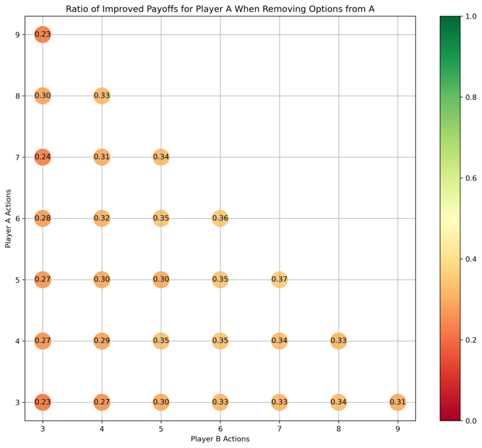
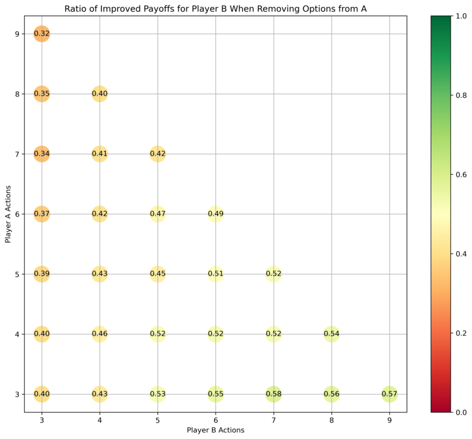

[home](./index.md)
------------------

*author: niplav, created: 2024-09-20, modified: 2024-09-20, language: english, status: draft, importance: 5, confidence: certain*

> __In small normal-form games, taking away an option from a player
improves the payoff of that player usually <⅓ of the time, but improves
the payoffs for the other player ½ of the time. The numbers depend on
the size of the game; plotted [here](#Plots).__

How Often Does Taking Away Options Help?
=========================================

There's
[been](https://www.lesswrong.com/posts/6dSitnwYPg8i8NHn3/burch-s-law)
[some](https://www.overcomingbias.com/p/rational_agent_html)
[discussion](http://www.overcomingbias.com/2006/11/asymmetric_pate.html)
[about](https://musingsandroughdrafts.wordpress.com/2022/03/29/paternalism-is-about-outrage/)
[the origins](https://www.overcomingbias.com/p/paternalism_is_html)
[of](https://www.lesswrong.com/posts/wg5YpAofgbEg587d2/don-t-take-bad-options-away-from-people)
[paternalism](https://www.overcomingbias.com/p/heres_my_openinhtml).

I believe that there's another possible justification for paternalism:
Intervening in situations between different actors to bring about
Pareto-improved games.

Let's take the [game of
chicken](https://en.wikipedia.org/wiki/Chicken_\(game\)) between Abdullah
and Benjamin. If a paternalist Petra *favors* Abdullah, and Petra has
access to Abdullah's car before the game, Petra can remove the steering
wheel to make Abdullah's commitment for them — taking an option
away. This improves Abdullah's situation by forcing Benjamin to swerve
first, and guaranteeing Abdullah's victory (after all, it's a [strictly
dominant strategy](https://en.wikipedia.org/wiki/Dominant_Strategy)
for Benjamin to swerve).

In a less artificial context, one could see [minimum wage
laws](https://en.wikipedia.org/wiki/Minimum_wage_law) as an example of
this. Disregarding potential effects from increased unemployment, having
higher minimum wage removes the temptation of workers to accept lower
wages. [Braess' paradox](https://en.wikipedia.org/wiki/Braess_Paradox)
is another case where taking options away from people helps.

Frequency
----------

We can figure this out by running a [Monte-Carlo
simulation](https://en.wikipedia.org/wiki/Monte-Carlo_simulation).

First, start by generating random [normal form
games](https://en.wikipedia.org/wiki/Normal-form_game)
with payoffs in `$[0,1]$`. Then, compute the [Nash
equilibria](https://en.wikipedia.org/wiki/Nash_Equilibrium) for both players
via [vertex
enumeration](https://en.wikipedia.org/wiki/Vertex_enumeration_problem)
of the [best response](https://en.wikipedia.org/wiki/Best_response)
[polytope](https://en.wikipedia.org/wiki/Polytope) (using
[nashpy](https://www.theoj.org/joss-papers/joss.00904/10.21105.joss.00904.pdf))—the
[Lemke-Howson
algorithm](https://en.wikipedia.org/wiki/Lemke-Howson_algorithm) was
giving me duplicate results. Compute the payoffs for both Abdullah and Benjamin.

Then, *remove* one option from Abdullah (which translates to deleting a
row from the [payoff matrix](https://en.wikipedia.org/wiki/Payoff_Matrix)).

Calculate the Nash equilibria and payoffs again.

We assume that all Nash equilibria are equally likely, so for each player
we take the mean payoff across Nash equilibria.

For a player, taking away one of Abdullah's options is considered an
*improvement* iff the mean payoff in the original game is stricly lower
than the mean payoff in the game with one option removed. Thus, one can
improve the game for Abdullah by taking away one of his options, and
one can improve the game for Benjamin by taking away one of Abdullah's
options, or both.

Plots
------

*For games originally of size `$n \times m$`, how often is it the case that taking an option away from Abdullah improves the payoffs for Abdullah?*

*For games originally of size `$n \times m$`, how often is it the case that taking an option away from Abdullah improves the payoffs for Benjamin?*

Interpretation
---------------

Abdullah is *most* helped by taking an option away from him when both
he and Benjamin have a lot of options to choose from, e.g. in the case
where both have six options. If Abdullah has many options and Benjamin has
few, then taking an option away from Abdullah usually doesn't help him.

Benjamin is much more likely to be in an improved position if one takes
away an option from Abdullah, especially if Benjamin had many options
available already—which suggests that in political situations, powerful
players are incentivized to advocate for paternalism over weaker players.

Postscript
-----------

One can imagine a paternalist government as a [mechanism
designer](https://en.wikipedia.org/wiki/Mechanism_Design) with a
bulldozer, then.

Code [here](./code/options/options.py), largely written by [Claude 3.5
Sonnet](https://www.anthropic.com/news/claude-3-5-sonnet).
