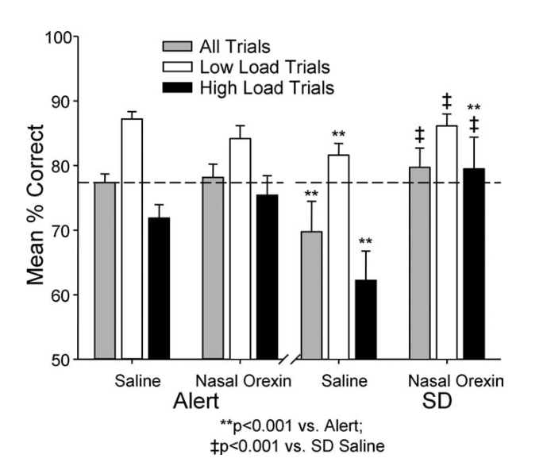

[home](./index.md)
------------------

*author: niplav, created: 2025-04-03, modified: 2025-04-08, language: english, status: notes, importance: 9, confidence: log*

> __.__

Orexin And Sleep Deprivation
==============================

Protocol
---------

The rough idea is to have a self-blinded randomized trial with
[blocking](https://en.wikipedia.org/wiki/Blocking_\(statistics\)), where
each block is a period of four days alternating between administration
and recovery days.

### Requirements

* Two undistinguishable [spray bottles](https://en.wikipedia.org/wiki/Spray_Bottle)
* Two identical opaque containers for fitting the bottles
* Two pieces of paper, one marked with 'O', one marked with 'P', folded so that the text is not visible
* Saline solution
* Orexin powder for a sufficient dose<!--TODO: ask Claude/read papers to figure out sufficient dose and dissolution!-->

### Checklist

* Store Orexin powder in the freezer
* Before a block:
	* Dissolve Orexin powder in the saline solution in *one* spray bottle, so that it contains an adequate amount (administration results in ~1μg/kg of bodymass)
	* Put saline solution in the other bottle
	* Put the Orexin-filled spray bottle in one container, together with the 'O' piece of paper
	* Put the saline solution spray bottle in the other container, together with the 'P' piece of paper
	* Shuffle the containers until you don't remember which is which, put them in the fridge
* During the block:
	* Day 1:
		* Sleep only 5-6 hours
		* Pick a container at random, take out only the bottle, administer nasal spray
		* Mark the container so that you know that you took it on day one of the block
		* Wait 20 minutes
		* Run [a bunch of measurements](#Measurements)
		* In the evening (~16:00): Collect the measurements again
	* Day 2:
		* Sleep a normal amount
	* Day 3:
		* Sleep only 5-6 hours
		* Pick the other container, take out only the bottle, administer nasal spray
		* Mark the container so that you know that you took it on day three of the block
		* Wait 20 minutes
		* Run [a bunch of measurements](#Measurements)
		* In the evening (~16:00): Collect the measurements again
	* Day 4:
		* Sleep a normal amount
		* Look into the containers, write down whether you took placebo/orexin on days one and three

It doesn't matter when a block starts, it can be any day of the week,
and one can take a couple of days off from the experiment when something
(e.g. a holiday) comes in the way.

#### Measurements

We'd like to keep the measurements manageable and scalable: There is a
core of measurements performed in each block, but if I feel like I have
slack I might decide to do more extensive measurements for one block.

If done per block, this will not impact the quality of the data, but
please don't decide within a block to switch the detail of measurements.

Measurements were selected according to how much they
degrade with sleep deprivation, informed by [this auto-generated
report](./doc/orexin/impact_of_sleep_deprivation_on_psychological_metrics_elicit_2025.pdf)
using [Elicit](https://elicit.org/).

Most of the datapoints will be collected with an application using
pygame<!--TODO: link-->.

* Active measurements
	* Reaction speed via the [psychomotor vigilance task](https://en.wikipedia.org/wiki/Psychomotor_vigilance_task): ≥10 datapoints/day, collected via the tool
	* Attention via the [digit symbol substitution test](https://en.wikipedia.org/wiki/Digit_symbol_substitution_test): 1 datapoint/day, collected via the tool
	* Digit span: ≥10 datapoints/day, collected via the tool
	* [Stanford Sleepiness Scale](https://en.wikipedia.org/wiki/Stanford_Sleepiness_Scale)
	* Subjective well-being: ≥4 datapoints/day, collected via MoodPatterns
	* Time perception accuracy, collected via the tool
* Passive measurements
	* Whatever is collected by the fitbit

### Complications & Explanation

Ideally, we wouldn't have to re-fill the nasal spray bottles after
every block, instead marking the bottle in an easily blindable way
(e.g. a small dot on the bottom) for being able to figure out which
bottle contains what.

Unfortunately, Claude informs me that Orexin has a half-life of ~2 weeks
when stored at fridge temperatures in a liquid solution, and is best
stored long-term in powder-form in the freezer—hence the plan to be careful
and mix it back for each block.

The blocks reduce unexplained variability. The pause days make sure that
(1) one doesn't suffer from excessive sleep deprivation, and (2) to check
if there is any "catch-up sleep" that needs to happen even after taking
Orexin. Investigating tolerance effects would be interesting, but I just
don't think we have enough statistical power to get there, and it's more
useful to focus on one-off effectiveness instead[^1]. Tolerance effects
can be examined later.

Power Calculation
------------------

*epistemic status*: Doing a [power
analysis](https://en.wikipedia.org/wiki/Power_calculation#Power_analysis)
for the first time. Checked by Claude.

Let's say we will use a
[two-sample](https://en.wikipedia.org/wiki/Two-sample_hypothesis_testing)
[t-test](https://en.wikipedia.org/wiki/Student's_t-test). We can use
[statsmodels](https://www.statsmodels.org/) to do the heavy lifting; we
want to detect a medium effect size (0.5) with a bog-standard significance
level of 0.05 and a power of 0.75:

	import statsmodels.stats.power
	>>> statsmodels.stats.power.tt_ind_solve_power(effect_size=0.5, alpha=0.05, power=0.75, alternative='two-sided')
	56.49860618876443

This means that we'll have to collect ~60 Orexin samples to detect a
medium effect size; splitting it over two people means that each takes
Orexin ~30 times and Placebo 30 times, with blocks of a length of four
days that gives us 240 days in total (though half of those don't actually
entail any work in terms of data collection).

Literature
-----------

*SD stands for "sleep deprivation"*

Experimental Protocol
----------------------

### Batch 1

* Prepared from 2025-09-07T23:10 until 2025-09-08T00:10:00
* Stored 6 samples in the vials in the freezer, 1 in the vials in the fridge, and 1 sample in the syringe+atomizer in the fridge.

#### Sample 1

* Sunday 2025-09-08: Taking 0.45mg melatonin before going to sleep at 2025-09-08T01:00, setting alarm for 2025-09-08T06:00
* Monday:
	* Contractions in the face
	* Feel alert but scattered, dull
* Tuesday 2025-09-09: Taking 0.45mg melatonin before going to sleep at 2025-09-10T00:10, setting alarm for 2025-09-10T05:35
* Wednesday:
	* Feel surprisingly refreshed after the dose
	* Administering was a pain, 2.5ml is too much
	* 62% sure this was the Orexin-A

[^1]: Even demonstrating one-off effectiveness would be cool: It's often the case that people have short-term sleep deprivation, and would like to ameliorate the effects.
