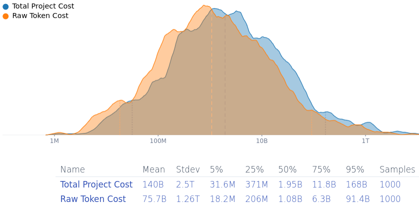

[home](./index.md)
------------------

*author: niplav, created: 2025-02-20, modified: 2025-02-27, language: english, status: finished, importance: 5, confidence: log*

> __Trying to make the internet secure from takeover by advanced
AI systems by removing exploits from open-source software
[would cost at least](#Who_Pays) ~\$31 mio./~\$1.9 bio./~\$168
bio. (5th/50th/95th percentile estimate), mean estimate ~\$140 bio. But
hardware or software/hardware hybrid vulnerabilities [are harder to
fix](#Hybrid_and_Hardware_Vulnerabilities), and [open-source maintainers
would be overworked](#Maintainer_Overload).__

Patching ~All Security-Relevant Open-Source Software?
======================================================

Preventative measures discussed for averting an AI takeover
attempt include hardenening the software infrastructure of
the world against attacks. The plan is to use lab-internal
(specialized?) software engineering AI systems to submit patches to
fix all findable security vulnerabilities in open-source software
(think a vastly expanded and automated version of [Project
Zero](https://en.wikipedia.org/wiki/Project_Zero), and likely
to partner with companies developing internet-critical software
(in the likes of [Cisco](https://en.wikipedia.org/wiki/Cisco) &
[Huawei](https://en.wikipedia.org/wiki/Huawei)<!--TODO: find others
maybe?-->).

I think that that plan is net-positive. I also think that it has some
pretty glaring open problems (in ascending order of exigency): (1)
Maintainer overload and response times, (2) hybrid hardware/software
vulnerabilities, and (3) cost as a public good (also known as  "who's
gonna pay for it?").

### Maintainer Overload

If transformative AI is developed soon, most open source projects
(especially old ones relevant to internet infrastructure) are going to be
maintained by humans with human response times. That will significantly
increase the time for relevant security patches to be reviewed and merged
into existing codebases, especially if at the time attackers will submit
AI-generated or co-developed subtle exploits using AI systems six to nine
months behind the leading capabilities, keeping maintainers especially
vigilant.

### Hybrid and Hardware Vulnerabilities

My impression is that vulnerabilities are moving from
software-only vulnerabilities towards very low-level
microcode or software/hardware hybrid vulnerabilities
(e.g. [Hertzbleed](https://en.wikipedia.org/wiki/Hertzbleed),
[Spectre](https://en.wikipedia.org/wiki/Spectre_\(vulnerability\)),
[Meltdown](https://en.wikipedia.org/wiki/Meltdown_\(security_vulnerability\)),
[Rowhammer](https://en.wikipedia.org/wiki/Rowhammer),
[Microarchitectural Data
Sampling](https://en.wikipedia.org/wiki/Microarchitectural_Data_Sampling),
…), for which software fixes, *if they exist*, have pretty bad
performance penalties. GPU-level vulnerabilities get less attention, but
they absolutely exist, e.g. [LeftoverLocals](https://leftoverlocals.com/)
and [JellyFish](https://github.com/nwork/jellyfish). My best
guess is that cutting-edge GPUs are much less secure than CPUs,
since they've received less attention from researchers and their
documentation is less easily accessible. (They probably have less
cruft from bad design choices in early computer history.) Hence:
Software-only vulnerabilities are easy to fix, software/hardware
hybrid ones are more painful to fix, hardware vulnerabilities escape
quick fixes (in the extreme demanding recall like the [Pentium FDIV
bug](https://en.wikipedia.org/wiki/Pentium_FDIV_bug)). And
don't get me started on the
[vulnerabilities](https://en.wikipedia.org/wiki/Cognitive_Bias)
[lurking in](https://en.wikipedia.org/wiki/Cults) [human
psychology](https://www.lesswrong.com/posts/aHaqgTNnFzD7NGLMx/reason-as-memetic-immune-disorder),
which are basically impossible to fix on short time-scales…

### Who Pays?

Finding vulnerabilities in all the relevant security
infrastructure of the internet and fixing them might be
*expensive*. 1 mio. input tokens for [Gemini 2.0 Flash
cost](https://cloud.google.com/vertex-ai/generative-ai/pricing)
\$0.15, and \$0.60 for output tokens—but a model able
to find & find fixes to security vulnerabilities is going
to be more expensive. An AI-generated me-adjusted [Squiggle
model](https://squigglehub.org/models/niplav/automated_internet_hardening)
estimates that __it'd cost (median estimate) ~\$1.9
bio. to fix most vulnerabilities in open-source software (90%
[confidence-interval](https://en.wikipedia.org/wiki/Confidence_Interval):
~\$31 mio. to ~\$168 bio., mean estimated cost is… *gulp*… ~\$140
bio.)__.

(I think the analysis under-estimates the cost because it doesn't consider
setting up the project, paying human supervisors and reviewers, costs
for testing infrastructure & compute, finding complicated vulnerabilities
that arise from the interaction of different programs…).

It was notable when Google [paid \$600k for open-source
fuzzing](https://www.securityweek.com/google-shells-out-600000-for-oss-fuzz-project-integrations/),
so >~\$1.9 bio. is going to be…
hefty. The discussion on this has been pretty [far
mode](https://en.wikipedia.org/wiki/Construal_level_theory) and "surely
[somebody](https://www.overcomingbias.com/p/abstractly-ideal-concretely-selfishhtml)
is going to do that when it's “so easy”", but there
have been fewer remarks about the expense and who'll
carry the burden. For comparison, the 6-year budget for [Horizon
Europe](https://commission.europa.eu/funding-tenders/find-funding/eu-funding-programmes/horizon-europe_en)
(which funds, as a tiny part of its portfolio, open source projects like
[PeerTube](https://en.wikipedia.org/wiki/Peertube) and the [Eclipse
Foundation](https://en.wikipedia.org/wiki/Eclipse_Foundation))
[is 93.5 bio.
€](https://commission.europa.eu/strategy-and-policy/eu-budget/performance-and-reporting/programme-performance-statements/horizon-e
urope-performance_en),
and the EU [Next Generation
Internet](https://ngi.eu/) programme has spent [250 mio.
€](https://eur-lex.europa.eu/EN/legal-content/glossary/next-generation-internet.html)
(2018-2020)+[62 mio.
€](https://sciencebusiness.net/news/next-generation-internet-showcase-goes-live)
(2021-2022)+[27 mio.
€](https://edri.org/our-work/european-commission-cuts-funding-support-for-free-software-projects/)
(2023-2025)=~337 mio. € on funding open-source software.

Another consideration is that this project would need to be finished
*quickly*—potentially less than a year as open weights models catch
up and frontier models become more dangerous. So humanity will not be
able to wait until the frontier models become cheaper so that it'll be
less expensive—as soon as automated vulnerability finding becomes,
both attackers and defenders will be in a race to exploit them.

So, *a proposal*: Whenever someone claims that LLMs will d/acc us out of
AI takeover by fixing our infrastructure, they will also have to specify
who will pay the costs of setting up this project and running it.

See Also
---------

* Discussions
	* [Effective Altruism Forum](https://forum.effectivealtruism.org/posts/sh4zDoyQiwnAGCRd6/patching-all-security-relevant-open-source-software)
