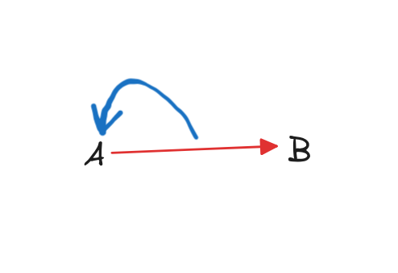
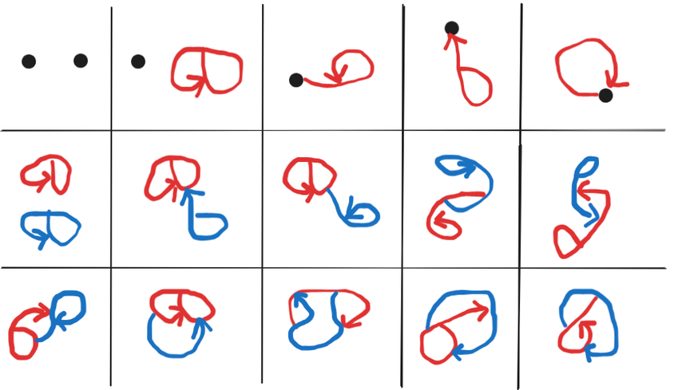

[home](./index.md)
-------------------

*author: niplav, created: 2025-07-10, modified: 2025-07-23, language: english, status: in progress, importance: 3, confidence: likely*

> __.__

Pergraphs
==========

I am afflicted by a strange curse, which condemns me to be creative
enough to find new mathematical structures, but too dumb to prove anything
interesting about them.

Inspired by [(A -> B) -> A (Scott Garrabrant,
2018)](https://www.lesswrong.com/posts/qhsELHzAHFebRJE59/a-greater-than-b-greater-than-a):

On a meditation retreat in 2022 I was remembering that post and just
doodled the above image in my notebook, together with some other graphs
where edges could go between edges. I'll call those "pergraphs"; they
haven't (to my knowledge) been explored yet.

Intuitively, a __pergraph__ is a mathematical structure made from nodes
and edges, where each edge needs to have a source and a sink. The source
and the sink can be any node or edge, including itself.

Given a finite set of vertices `$V$` and a finite set of peredges `$P$`
(where a peredge is simply a label), a __pergraph__ is the tuple `$(V,
E \subseteq P \times (V \cup P) \times (V \cup P))$` with the __closure
constraint__ that `$\forall (p, s, t) ∈ E: s ∈ P \Rightarrow ∃(s,
s', t') ∈ E \land t ∈ P \Rightarrow ∃(t, s'', t'') ∈ E$`.

Up to isomorphism for renamings of vertices and peredges.

Sequence of pergraphs with `$n=|V|+|P|$` constituents, starting at n=0:

<!--TODO: this sequence is for multi-pergraphs! Compute also for non-multi-pergraphs-->

1, 2, 15, 180, 3638, …

This sequence is not yet in the OEIS.

* For zero constituents there's only the empty pergraph `$(\emptyset, \emptyset)$`.
* For one constituent there's two pergraphs, the single node `$(\{v_1, \emptyset\})$` and the self-directed edge `$(\emptyset, \{(e_1, e_1, e_1)\})$`.
* For two constituents there's these:

Code for computing the first terms of the sequence
[here](./code/pergraphs/simple.py), generated by Claude Sonnet 4,
which I can also thank for talking through all the cases for n=2.

As a variant one could ditch the nodes entirely, and replace them
self-directed edges. I think that one has different combinatorial
behavior.

### Axes Along Which to Categorize Different Graph Concepts

{directed, undirected} edges×{allows, disallows} [multi-edges](https://en.wikipedia.org/wiki/Multigraph)×{allows, disallows} [loops](https://en.wikipedia.org/wiki/Loop_\(graph_theory\))×{allows, disallows} [hyperedges](https://en.wikipedia.org/wiki/Hypergraph)×{allows, disallows} edges between edges×{allows, disallows} edges from/to themselves×{allows, disallows} edges between arbitrary sets of vertices.

### Prior Art

Pergraphs are distinct from
[hypergraphs](https://en.wikipedia.org/wiki/Hypergraph), as they
don't allow for an edge between more than two nodes; they are *not*
[multigraphs](https://en.wikipedia.org/wiki/Multigraph), because they
allow for edges from/to edges (similar to multigraphs, they allow
for multiple edges between the same two nodes); they are distinct from
[higraphs](https://en.wikipedia.org/wiki/Higraph), as they don't allow for
edges to originate from collections of multiple nodes; they are different
from [Petri nets](https://en.wikipedia.org/wiki/Petri-Net), because they
don't have movable tokens; they are not the same as metagraphs, because
they again allow for edges between (nested) collections of nodes. They
are probably different from categories, because they're more specific
than categories and don't require composition, but I don't know enough
category theory to confirm that.

The closest I've found to this concept is in this
unsourced section on the [Wikipedia article on
hypergraphs](https://en.wikipedia.org/wiki/Hypergraph#Further_generalizations):

> Alternately, edges can be allowed to point at other edges, irrespective
of the requirement that the edges be ordered as directed, acyclic
graphs. This allows graphs with edge-loops, which need not contain
vertices at all. For example, consider the generalized hypergraph
consisting of two edges `$e_{1}$` and `$e_{2}$`, and zero vertices,
so that `$e_{1}=\{e_{2}\}$` and `$e_{2}=\{e_{1}\}$`. As this loop is
infinitely recursive, sets that are the edges violate the [axiom of
foundation](https://en.wikipedia.org/wiki/Axiom_of_Foundation). In
foundation](https://en.wikipedia.org/wiki/Axiom_of_Foundation). In
particular, there is no transitive closure of set membership
for such hypergraphs. Although such structures may seem strange
at first, they can be readily understood by noting that the
equivalent generalization of their Levi graph is no longer
[bipartite](https://en.wikipedia.org/wiki/Bipartite),
but is rather just some general [directed
graph](https://en.wikipedia.org/wiki/Directed_Graph).

> The generalized incidence matrix for such hypergraphs is, by
definition, a square matrix, of a rank equal to the total number
of vertices plus edges. Thus, for the above example, the [incidence
matrix](https://en.wikipedia.org/wiki/Incidence_matrix) is simply
>
> 

        $$\begin{pmatrix}
        0 & 1 \cr
        1 & 0 \cr
        \end{pmatrix}$$

The concept appears under-developed, and slightly different from what
I'm pointing at.

(Many thanks to Claude 4 Sonnet for several long conversations which
fleshed out the concept.)
