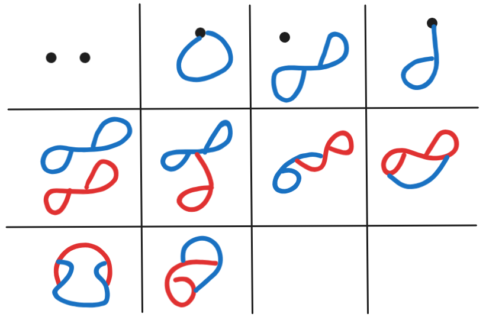

[home](./index.md)
-------------------

*author: niplav, created: 2025-07-10, modified: 2025-09-24, language: english, status: in progress, importance: 3, confidence: likely*

> __`$P→(V∪P)^2$`, the rest is commentary.__

Pergraphs
==========

<!--TODO: incorporate
https://claude.ai/chat/43f2f7d1-278e-496f-8ad7-64688bd56a2d
https://claude.ai/chat/6000475e-3a30-4a83-a9ed-db9d788c7c07
https://claude.ai/chat/6f8ac1b8-7447-45aa-b524-855d9c1487e5
https://claude.ai/chat/f7290015-4f76-4de6-be6e-d18edff28e4a
https://claude.ai/chat/4243d662-c0c4-497a-88c1-20f47ca13933
https://claude.ai/public/artifacts/5c90ecc4-1f1d-4160-9092-a70b6af6b517
https://claude.ai/public/artifacts/c6cb03fa-94ff-42f0-8733-9d5b37ae1624
https://claude.ai/public/artifacts/bb3d3f29-937c-4b79-ac98-f36f2209e030
https://claude.ai/public/artifacts/ef9a1339-2211-4cc1-971c-b99fe877d900
https://claude.ai/public/artifacts/e0f648c6-520c-4c42-a393-21b05ea0ce4a-->

I am afflicted by a strange curse, which condemns me to be creative
enough to find new mathematical structures, but too dumb to prove anything
interesting about them.

On a meditation retreat in 2022 I remembered [a post by Scott
Garrabrant](https://www.lesswrong.com/posts/qhsELHzAHFebRJE59/a-greater-than-b-greater-than-a)
and doodled the above image in my notebook, together with some other
drawings of networks where edges can have edges as sources and sinks.

Formalizing
------------

Recently, I got thinking about those kinds of graphs again, [researched
a bit](#Prior_Art) and think I've discovered they've not been looked at
in detail yet. I'll call those kinds of graphs or networks "pergraphs".

In this post I'll go a double track where I'll first and foremost draw
pretty pictures to give the reader a visual sense of what they should be
thinking about, and also provide Lean 4 code for definitions, theorems
and proofs, as a barbell strategy in terms of rigour.

### Basic Definitions

__Intuition 1__: Intuitively, a __pergraph__ is a finite mathematical
structure consisting of nodes and edges (which I'll also equivalently call
__"peredges"__), where each edge needs to have a source and a sink. The
source and the sink of an edge can be any node or edge, including itself.

 Two nodes, connected by two edges, both edges have the same direction. (2) Two nodes, connected by an edge. There's a second edge which has the first edge as a source and loops back into itself. Three edges, arranged in a circle, so that each edge has as its source one of the different edges, and as its sink the third edge.")

__Definition 1__ ([Lean](#Definition_1)): Given:

1. A finite set of vertices `$V$` and
2. A finite set of __peredges__ `$P$` (where a peredge is simply a label),

A __pergraph__ is the tuple `$(V, P, e: P \rightarrow (V \cup P) \times
(V \cup P))$`, where `$e$` is a function that assigns each __peredge__
a source and a sink.

__Remark 1__: A pergraph is more specifically a __*directed
multi-*pergraph__, since peredges are *directed*, and two peredges can
have the same source and the same sink. We will use the term "pergraph"
for directed multi-pergraphs, and specify deviations from such.

__Theorem 1__ ([Proof](#Proof_1)): Every
[quiver](https://en.wikipedia.org/wiki/Quiver_\(mathematics\)) is also
a pergraph, that is the pergraphs contain the quivers as a subset.

__Intuition 1__: Take any quiver `$Q=(V, E, s: E→V, t: E→V)$`. We can
then construct a pergraph by assigning the `$V$` to the vertex pernodes,
`$E$` to the peredges, and constructing `$e$` by declaring `$e(p)=(s(p),
t(p))$` for `$p \in P$`. Congrats! You've now constructed a pergraph
from your quiver.

__Remark 2__: Since every directed graph is a quiver, all directed graphs
are also pergraphs.

__Definition 2__ ([Lean](#Definition_2)): A __uni-pergraph__ is a pergraph
with the additional constraint that no two peredges have the same source
*and* the same sink, mathematically
`$\lnot \exists p_1, p_2 \in P: p_1 \not=p_2 \land e(p_1)=e(p_2)$`.

__Definition 3__ ([Lean](#Definition_3)): An __undirected pergraph__ is
a a pergraph with undirected peredges, i.e. a pergraph where `$e$` has the
type signature `$P \rightarrow {V \cup P \choose 2}$`.

### Some Pergraph Concepts

__Definition 4__ ([Lean](#Definition_4)): The __source__ of a peredge is
the vertex or peredge it comes from, the __sink__ of a peredge is the thing
it points to.

__Definition 5__ ([Lean](#Definition_5)): A __ratking__ is a pergraph
without vertices.

Source cycles, sink cycles, pseudo-vertex cycles, source-semi-ratkings,
sink-semi-ratkings, rhizomes/rhizomatic ratkings, the rhizomatic
lattice…

Pergraph isomorphism, sub-pergraph detection, pergraph rewrite rules
(ratking collapse, flip equivalence (flipping peredges results in the
same pergraph)).

Euler cycles and Hamilton cycles, decomposing into rhizomes, enforcing
some kind of hierarchy/partial hierarchy?

Bijection with the directed graphs? Needs to blow up the directed graphs.

### Counting

Unlabeled pergraphs are counted up to isomorphism for renamings of
vertices and peredges.

One can count equence of pergraphs with `$n=|V|+|P|$` constituents,
starting at n=0:

1, 2, 15, 180, 3638, …

This sequence is not yet in the OEIS.

* For zero constituents there's only the empty pergraph `$(\emptyset, \emptyset, \emptyset)$`.
* For one constituent there's two pergraphs, the single node `$(\{v_1, \emptyset, \emptyset\})$` and the self-directed peredge `$(\emptyset, \{e_1\}, \{(e_1, e_1, e_1)\})$`.
* For two constituents there's these:

Code for computing the first terms of the sequence
[here](./code/pergraphs/simple.py).

The sequence that that counts the number of unlabeled undirected
pergraphs, up to isomorphism, starting at n=0:

1, 2, 10, …

Here's the *undirected* pergraphs with two components:

As a variant one could ditch the nodes entirely, and replace them
self-sourced and self-sinked peredges. I think that one has different
combinatorial behavior.

<!--TODO: Compute maybe also for non-multi-pergraphs?-->

### Questions

1. When does reversing the peredges of a pergraph result in an isomorphic pergraph?
2. Is there some canonical injection into directed graphs?
3. How computationally expensive is isomorphism-checking?
	1. Sub-pergraph detection?
4. In general, what graph theory concepts could be ported over?
	1. Planarity? Strongly/weakly connected components?
5. Has really nobody looked at these before?
	1. What's the closest most specific but more general mathematical object that includes pergraphs as a special case?
6. What could these possibly be useful for?

Situating Pergraphs
--------------------

Pergraphs are *a generalization* of directed graphs (i.e. every directed
graph is a pergraph), but I don't know what known mathematical structure
they're a special case of. Claude Opus 4.1 suggests it might be a special
case of [2-categories](https://en.wikipedia.org/wiki/2-category), but
I don't think that's true85%.

### Axes Along Which to Categorize Different Graph Concepts

{directed, undirected} edges×{allows, disallows} [multi-edges](https://en.wikipedia.org/wiki/Multigraph)×{allows, disallows} [loops](https://en.wikipedia.org/wiki/Loop_\(graph_theory\))×{allows, disallows} [hyperedges](https://en.wikipedia.org/wiki/Hypergraph)×{allows, disallows} edges between other edges×{allows, disallows} edges from/to themselves×{allows, disallows} edges between arbitrary sets of vertices.

### Prior Art

Pergraphs are distinct from
[hypergraphs](https://en.wikipedia.org/wiki/Hypergraph), as they
don't allow for an edge between more than two nodes; they are *not*
[multigraphs](https://en.wikipedia.org/wiki/Multigraph), because
pergraphs allow for edges from/to edges (similar to multigraphs,
they allow for multiple edges between the same two nodes); they are
distinct from [higraphs](https://en.wikipedia.org/wiki/Higraph),
as they don't allow for nested vertices; they are different
from [Petri nets](https://en.wikipedia.org/wiki/Petri-Net),
because they don't have movable tokens; they are not the same as
metagraphs, because they again allow for edges between (nested)
collections of nodes. They are probably different from categories and
[n-categories](https://en.wikipedia.org/wiki/Higher_category_theory),
because they don't require composition and don't enforce any kind of
hierarchy, but I don't know enough category theory to confirm that.

The closest I've found to this concept is in this
unsourced section on the [Wikipedia article on
hypergraphs](https://en.wikipedia.org/wiki/Hypergraph#Further_generalizations):

> Alternately, edges can be allowed to point at other edges, irrespective
of the requirement that the edges be ordered as directed, acyclic
graphs. This allows graphs with edge-loops, which need not contain
vertices at all. For example, consider the generalized hypergraph
consisting of two edges `$e_{1}$` and `$e_{2}$`, and zero vertices,
so that `$e_{1}=\{e_{2}\}$` and `$e_{2}=\{e_{1}\}$`. As this loop is
infinitely recursive, sets that are the edges violate the [axiom of
foundation](https://en.wikipedia.org/wiki/Axiom_of_Foundation). In
particular, there is no transitive closure of set membership
for such hypergraphs. Although such structures may seem strange
at first, they can be readily understood by noting that the
equivalent generalization of their Levi graph is no longer
[bipartite](https://en.wikipedia.org/wiki/Bipartite),
but is rather just some general [directed
graph](https://en.wikipedia.org/wiki/Directed_Graph).

> The generalized incidence matrix for such hypergraphs is, by
definition, a square matrix, of a rank equal to the total number
of vertices plus edges. Thus, for the above example, the [incidence
matrix](https://en.wikipedia.org/wiki/Incidence_matrix) is simply
>
> 

        $$\begin{pmatrix}
        0 & 1 \cr
        1 & 0 \cr
        \end{pmatrix}$$

The concept appears under-developed, and slightly different from what
I'm pointing at.

Acknowledgements
-----------------

Many thanks to Claude 4 Sonnet and Claude 4 Opus for several long
conversations which fleshed out the concept, talked through the pergraphs
with `$n=2$`, help with learning Lean, and help with writing the Rust
code for the enumeration.

See Also
---------

* [Graphs are cool (Gavin Leech, 2020)](https://www.gleech.org/graphs)
* [Incomplete Open Cubes Revisited (Rob Weychert, 2018)](https://cubes-revisited.art/about/)
* [Rhizom (Gilles Deleuze/Félix Guattari, 1976)](http://www.lungomare.org/wp-content/uploads/2016/04/Deleuze-Guattari-Rhizom_dt.pdf)

Appendix A: Lean Definitions and Proofs
----------------------------------------

I provide [Lean 4](https://en.wikipedia.org/wiki/Lean_\(proof_assistant\))
definitions and proofs for pergraphs, related structures, and the theorems
in this text.

### Definition 1

	inductive PerNode (V E : Type) : Type
	  | vertex : V → PerNode V E
	  | edge : E → PerNode V E

	structure Pergraph (V E : Type) where
	  e : E → PerNode V E × PerNode V E

### Proof 1

	def Quiver.toPergraph {V : Type} [Quiver V] : Pergraph V (Σ (a b : V), a ⟶ b) where
	  e := fun ⟨a, b, _⟩ => (PerNode.vertex a, PerNode.vertex b)

<!--TODO: does this prove injectivity?-->

### Definition 2

	def UniPergraph (V E : Type) : Type :=
	  { p : Pergraph V E // Function.Injective p.e }

### Definition 3

	structure UndirectedPergraph (V E : Type) where
	  e : E → Sym2 (PerNode V E)

### Definition 4

	def source (G : Pergraph V E) (edge : E) : PerNode V E :=
	  (G.e edge).1

	def sink (G : Pergraph V E) (edge : E) : PerNode V E :=
	  (G.e edge).2

### Definition 5

	def is_ratking (G : Pergraph V E) (edges : Set E) : Prop :=
	  ∀ e ∈ edges, source G e ∈ (PerNode.edge '' edges) ∧
	               sink G e ∈ (PerNode.edge '' edges)
