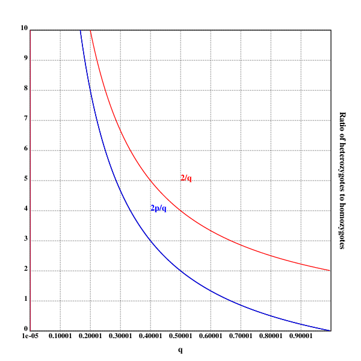
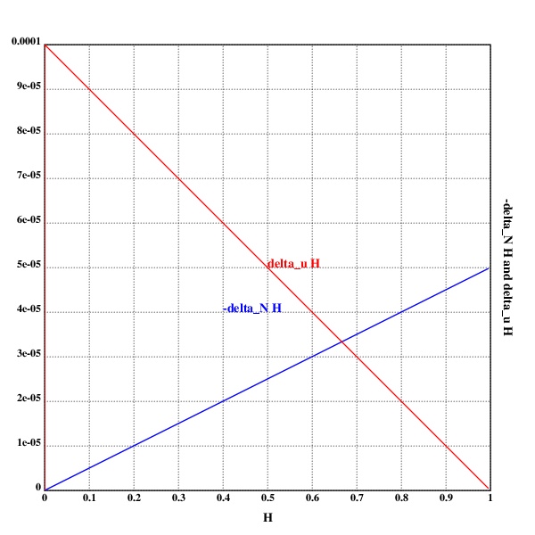

[home](./index.md)
-------------------

*author: niplav, created: 2022-01-25, modified: 2022-02-02, language: english, status: in progress, importance: 2, confidence: likely*

> __Some solutions to exercises in the book “Population Genetics” by
[John H. Gillespie](https://en.wikipedia.org/wiki/John_H._Gillespie). I
did not simply copy out the solutions at the end of each chapter, and
sometimes didn't even check the solutions against my own. Therefore,
these might be faulty.__

Solutions to “Population Genetics”
===================================

Chapter 1
---------

### Problem 1.1

For three it would be `$A_1A_1A_1, A_1A_1A_2, A_1A_2A_2, A_1A_2A_3, A_2A_2A_2, A_2A_2A_3, A_3A_3A_3$`,
with 7 different genotypes.

For four it would be 32 different genotypes:

`$A_1 A_1 A_1 A_1, A_1 A_1 A_1 A_2, A_1 A_1 A_1 A_3, A_1 A_1 A_1 A_4, A_1 A_1 A_2 A_2, A_1 A_1 A_2 A_3, A_1 A_1 A_2 A_4, A_1 A_1 A_3 A_3, A_1 A_1 A_3 A_4, A_1 A_1 A_4 A_4, A_1 A_2 A_2 A_2, A_1 A_2 A_2 A_3, A_1 A_2 A_2 A_4, A_1 A_2 A_3 A_4, A_1 A_2 A_4 A_4, A_1 A_3 A_4 A_4, A_1 A_4 A_4 A_4, A_2 A_2 A_2 A_2, A_2 A_2 A_2 A_3, A_2 A_2 A_2 A_4, A_2 A_2 A_3 A_3, A_2 A_2 A_3 A_4, A_2 A_2 A_4 A_4, A_2 A_3 A_3 A_3, A_2 A_3 A_3 A_4, A_2 A_3 A_4 A_4, A_2 A_4 A_4 A_4, A_3 A_3 A_3 A_3, A_3 A_3 A_3 A_4, A_3 A_3 A_4 A_4, A_3 A_4 A_4 A_4, A_4 A_4 A_4 A_4$`

<!--TODO: what closed form formula describes the above counting
partition?-->

So apparently, per solution, this is wrong, because I assumed that `$n$`
different alleles resulted in a `$n$`ploid organism, which isn't the case.

For three alleles it would be `$A_1 A_1, A_1 A_2, A_1 A_3, A_2 A_2, A_2 A_3, A_3 A_3$`,
which is 6 different genotypes.

For four different alleles it would be 10 different genotypes:

`$A_1 A_1,A_1 A_2,A_1 A_3,A_1 A_4,A_2 A_2,A_2 A_3,A_2 A_4,A_3 A_3,A_3 A_4,A_4 A_4$`

The general formula is `$\frac{n (n+1)}{2}$` different genotypes,
because it's just the upper half of the square again.

### Problem 1.2

* For I: `$0.0151+\frac{1}{2}0.0452+\frac{1}{2}0.0964=0.0859$`
* For S: `$0.4247+\frac{1}{2}0.3343+\frac{1}{2}0.0964=0.64005$`
* For F: `$0.0843+\frac{1}{2}0.3343+\frac{1}{2}0.0452=0.27405$`

Checking, these three do sum to 1: `$0.0859+0.64005+0.27405=1$`.

### Problem 1.5

	setrgb(0;0;0)
	grid([0.00001 1 0.1];[0 10 1])
	xtitle("q")
	ytitle("Ratio of heterozygotes to homozygotes")

	plot({(2*(1-x))%x})

	setrgb(0;0;1)
	plot({(2*(1-x))%x})
	text(200;200;"2p/q")

	setrgb(1;0;0)
	plot({2%x})
	text(250;250;"2/q")

	draw()

Chapter 2
----------

### Problem 2.7

That would be `$3*3000$` for one step (3 possible changes for every
nucleotides).

For two mutational steps, it would be `$3^2*{3000 \choose 2}$` (3 possible
changes per chosen nucleotide, and two different nucleotides chosen from
the whole allele).

For `$n$` mutational steps, it would be `$3^n*{3000 \choose n}$`.

### Problem 2.9

(The actual code doesn't contain the unicode symbols since either Klong
or Postscript can't deal with them. Sad.)

	p2.9::.oc("p2.9.eps")
	.tc(p2.9)

	setrgb(0;0;0)
	grid([0 1 0.1];[0 0.0001 0.00001])

	xtitle("𝓗")
	ytitle("-Δ_N𝓗 and Δᵤ𝓗")

	N::10^4
	u::5*10^-5

	setrgb(0;0;1)
	plot({(1%2*N)*x})
	text(200;200;"-Δ_N𝓗")

	setrgb(1;0;0)
	plot({2*u*1-x})
	text(250;250;"Δᵤ𝓗")

	draw()

	.fl()
	.cc(p2.9)

Does the same thing fall out of the math?

Let's see:

	$$-Δ_N \mathcal{H}=Δ_u \mathcal{H} \Leftrightarrow \\
	\frac{1}{2N} \mathcal{H}=2u(1-\mathcal{H}) \Leftrightarrow \\
	\mathcal{H}=4uN-4uN \mathcal{H} \Leftrightarrow \\
	\mathcal{H}+4uN \mathcal{H}=4uN \Leftrightarrow \\
	\mathcal{H}=\frac{4uN}{1+4uN} \Leftrightarrow \\
	\mathcal{H}=0.\overline{6} $$

At least the intersection does.
