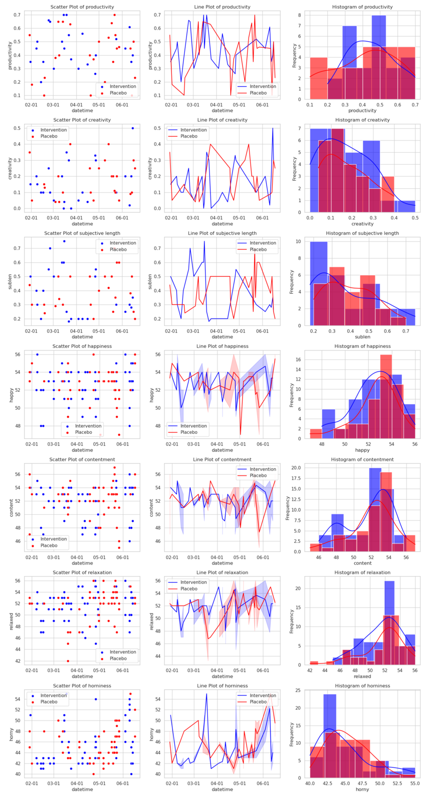
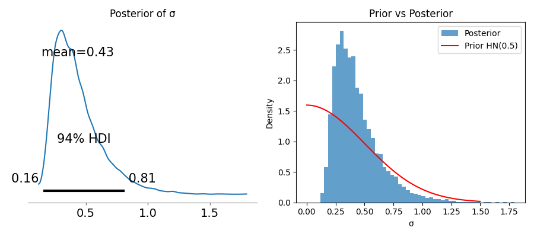

[home](./index.md)
------------------

*author: niplav, created: 2023-01-04, modified: 2025-06-20, language: english, status: in progress, importance: 7, confidence: certain*

> __There are too many possible quantified self experiments to run. Do
hobbyist prediction platforms[^1] make priorisation easier? I test
this by setting up [multiple markets](#Markets), in order to run two
experiments (the best one, and a random one), mostly for the effects
of various [nootropics](https://en.wikipedia.org/wiki/Nootropics)
on absorption in meditation. The first experiment
(testing the Pomodoro method) results in a [log
score](https://en.wikipedia.org/wiki/Proper_scoring_rule#Logarithmic_score)
of [-0.326](#Scoring_the_Market) for the market, the second experiment
(testing Vitamin D₃) results in a log score of -0.333<!--TODO:- link-->
— pretty good.__

<!--TODO: use victorian subtitle somewhere https://claude.ai/chat/d7c72475-e84e-458f-867b-7a26d04598b2-->

Using Prediction Platforms to Select Quantified Self Experiments
=================================================================

[dynomight 2022](https://dynomight.net/prediction-market-causation/#7)
has a very cool proposal:

> Oh, and by the way are you THE NSF or DARPA or THE NIH or A BILLIONAIRE
WHO WANTS TO SPEND LOTS OF MONEY AND BRAG ABOUT HOW YOU ADVANCED THE
STATE OF HUMAN KNOWLEDGE MORE THAN ALL THOSE OTHER LAME BILLIONAIRES
WHO WOULDN’T KNOW A HIGH ROI IF IT HIT THEM IN THE FACE? Well how
about this:

> 1. Gather proposals for a hundred RCTs that would each be really expensive but also really awesome. (E.g. you could investigate `SALT → MORTALITY` or `ALCOHOL → MORTALITY` or `UBI → HUMAN FLOURISHING`.)
> 2. Fund highly liquid markets to predict the outcome of each of these RCTs, conditional on them being funded.
> 	* If you have hangups about prison, you might want to chat with the [CFTC](https://en.wikipedia.org/wiki/Commodity_Futures_Trading_Commission) before doing this.
> 3. Randomly pick 5% of the proposed projects, fund them as written, and pay off the investors who correctly predicted what would happen.
> 4. Take the other 95% of the proposed projects, give the investors their money back, and use the SWEET PREDICTIVE KNOWLEDGE to pick another 10% of the RCTs to fund for STAGGERING SCIENTIFIC PROGRESS and MAXIMAL STATUS ENHANCEMENT.

*—[dynomight](https://dynomight.net/prediction-market-causation/), [“Prediction market does not imply causation”](https://dynomight.net/prediction-market-causation/), 2022*

Well, I'm neither a billionaire nor the NSF or DARPA, but I
*have* run [two](./nootropics.html#Experiment_B_SelfBlinded_RCT)
[shitty](./nootropics.html#Experiment_A_SelfBlinded_RCT) self-blinded
RCTs on myself already, and I'm certainly not afraid of the
[CFTC](https://en.wikipedia.org/wiki/Commodity_Futures_Trading_Commission).
And indeed I don't have a shortage of ideas on things I
[could](./todo.html#Quantified_Self) run RCTs on, but the time is scarce
(I try to collect m=50 samples in each RCT, which (with buffer-days off)
is usually more than 2 months of data collection).

So I'll do what [@saulmunn](http://nitter.poast.org/saulmunn/) pointed [out
to me](http://nitter.poast.org/saulmunn/status/1671923161695240192)
is a possibility: I'm going to do [futarchy (on)
myself](https://www.lesswrong.com/posts/qZXy8kGkNFyqCfHEJ/you-can-do-futarchy-yourself)
by setting up a set of markets of Manifold Markets with respect to the
outcomes of some pre-specified self-blinded RCTs, waiting until the prices
on them equilibriate, and then running two of those RCTs (the "best" one,
by my standards, and a random one) and using the results as resolutions,
while resolving the others as ambiguous.

### Timeline

If the markets receive enough liquidity, I'll start the first experiment
early in 2024, and the second one sometime in 2024 (depending on the
exact experiment), hopefully finishing both before 2025.

Markets
--------

Some experiments can be self-blinded, especially ones that involve
substances, others can not because they require me to engage in an
activity or receive some sensory input, so I distinguish the two, and
will slightly prioritise the experiments that can be blinded.

In all experiments, I will be using the statistical method
detailed [here](./nootropics.html#Statistical_Method), code for it
[here](./code/experiments/load.py), unless someone points out that I'm
doing my statistics wrong.

I will be scoring the markets based on the variables specified in the
prediction market title, but I'll of course be collecting [a lot of
other data](./data.html) during that time that will also be analyzed.

### Table of Current Market Status

| Experiment                                                                                                                                       | Number of Traders | Trading Volume | Expected Effect Size<!--TODO: explain and/or change calculation?--> | Resolved Effect Size |
| ------------------------------------------------------------------------------------------------------------------------------------------------ | ----------------- | -------------- | -------------------- | ----------------------- |
| [__L-Theanine + Caffeine__ vs. __Sugar__ → *Meditative Absorption*](https://manifold.markets/NiplavYushtun/by-how-much-does-caffeine-ltheanine)  | 14                | M̶515           | __0.306__            |                         |
| [__Nicotine__ vs. __Normal chewing gum__ → *Meditative Absorption*](https://manifold.markets/NiplavYushtun/by-how-much-does-nicotine-improve-m)  | 7                 | M̶342           | __0.437__            |                         |
| [__Modafinil__ vs. __Sugar__ → *Meditative Absorption*](https://manifold.markets/NiplavYushtun/by-how-much-does-modafinil-improve)               | 11                | M̶668           | __0.337__            |                         |
| [__Vitamin D__ vs. __Sugar__ → *Meditative Absorption*](https://manifold.markets/NiplavYushtun/by-how-much-does-vitamin-d-improve)               | 11                | M̶675           | __0.169__            | [__-0.14__](./nootropics.html#Results) |
| [__Vitamin B12__ vs. __Sugar__ → *Meditative Absorption*](https://manifold.markets/NiplavYushtun/by-how-much-does-vitamin-b12-improv)            | 7                 | M̶303           | __0.182__            |                         |
| [__LSD Microdosing__ vs. __Water__ → *Meditative Absorption*](https://manifold.markets/NiplavYushtun/by-how-much-does-microdosed-lsd-imp)        | 6                 | M̶174           | __0.286__            |                         |
| [__CBD Oil__ vs. __Similar-Tasting Oil__ → *Meditative Absorption*](https://manifold.markets/NiplavYushtun/by-how-much-does-cbd-improve-medita)  | 9                 | M̶210           | __0.227__            |                         |
| [__L-Phenylalanine__ vs. __Sugar__ → *Meditative Absorption*](https://manifold.markets/NiplavYushtun/by-how-much-does-lphenylalanine-imp)        | 7                 | M̶269           | __0.302__            |                         |
| [__Bupropion__ vs. __Sugar__ → *Happiness*](https://manifold.markets/NiplavYushtun/by-how-much-does-bupropion-improve)                           | 8                 | M̶303           | __0.337__            |                         |
| [__THC Oil__ vs. __Similar-Tasting Oil__ → *Meditative Absorption*](https://manifold.markets/NiplavYushtun/by-how-much-does-thc-oil-improve-me)  | 10                | M̶230           | __0.344__            |                         |
| [__Intermittent Fasting__ vs. __Normal Diet__ → *Happiness*](https://manifold.markets/NiplavYushtun/by-how-much-does-intermittent-fasti)         | 13                | M̶228           | __0.348__            |                         |
| [__Pomodoro Method__ vs. __Nothing__ → *Productivity*](https://manifold.markets/NiplavYushtun/by-how-much-does-the-pomodoro-metho)               | 9                 | M̶300           | __0.397__            | [__0.26__](#Pomodoros)  |
| [__Bright Light__ vs. __Normal Light__ → *Happiness*](https://manifold.markets/NiplavYushtun/by-how-much-does-very-bright-light)                 | 9                 | M̶104           | __0.473__            |                         |
| [__Meditation__ vs. __No Meditation__ → *Sleep duration*](https://manifold.markets/NiplavYushtun/by-how-much-does-2-hours-of-meditat)            | 13                | M̶380           | __0.241__            |                         |

### Self-Blinded Experiments

In general, by *meditative absorption* I mean
the concentration/tranquility (in Buddhist terms
[samatha](https://en.wikipedia.org/wiki/Samatha-vipassana)) during
a ≥30 minute meditation session in the morning, ~45 minutes
after waking up and taking the substance (less if the substance
starts working immediately). I will be doing at least 15 minutes of
[anapanasati](https://en.wikipedia.org/wiki/Anapanasati) during that
meditation session, but might start (or end) with another practice).

Past meditation data can be found [here](./data/meditations.csv).

1. [__L-Theanine + Caffeine__ vs. __Sugar__ → *Meditative Absorption*](https://manifold.markets/NiplavYushtun/by-how-much-does-caffeine-ltheanine): 50 samples in the morning after waking up, 25 intervention with 500mg l-theanine & 200mg caffeine and 25 placebo (sugar pills). Expected duration of trial: ~2½ months (one sample every day, but with possible pauses).
	1. Expected effect size: `0.06*1+0.14*0.8+0.26*0.4+0.3*0.1+0.2*0=0.306`
2. [__Nicotine__ vs. __Normal chewing gum__ → *Meditative Absorption*](https://manifold.markets/NiplavYushtun/by-how-much-does-nicotine-improve-m): 40 samples, with [blocking](https://en.wikipedia.org/wiki/Blocking_\(statistics\)) after waking up, 20 intervention with 2mg nicotine, 20 placebo (similar-looking square chewing gum). Expected duration of trial: ~4½ months (two samples/week, to avoid getting addicted to nicotine).
	1. Expected effect size: `0.1*1+0.25*0.8+0.28*0.4+0.25*0.1+0.11*0=0.437`
3. [__Modafinil__ vs. __Sugar__ → *Meditative Absorption*](https://manifold.markets/NiplavYushtun/by-how-much-does-modafinil-improve): 40 samples, again with [blocking](https://en.wikipedia.org/wiki/Blocking_\(statistics\)) directly after waking up, 20 intervention with 100mg modafinil and 20 placebo (sugar pills). Expected duration of trial: Also ~4½ months with two samples per week, as to prevent becoming dependent on modafinil.
	1. Expected effect size: `0.03*1+0.2*0.8+0.29*0.4+0.31*0.1+0.18*0=0.337`
4. [__Vitamin D__ vs. __Sugar__ → *Meditative Absorption*](https://manifold.markets/NiplavYushtun/by-how-much-does-vitamin-d-improve): 50 samples, taken after waking up, 25 intervention (25μg Vitamin D₃) and 25 placebo (sugar pills). Expected duration of trial: ~2½ months (taken ~every day, with possible pauses).
	1. Expected effect size: `0.04*1+0.06*0.8+0.1*0.4+0.41*0.1+0.38*0=0.169`
5. [__Vitamin B12__ vs. __Sugar__ → *Meditative Absorption*](https://manifold.markets/NiplavYushtun/by-how-much-does-vitamin-b12-improv): 50 samples, taken after waking up, 25 intervention (500μg Vitamin B12 + 200μg [folate](https://en.wikipedia.org/wiki/Folate)) and 25 placebo (sugar pills). Expected duration of trial: 2½ months (short interruptions included).
	1. Expected effect size: `0.03*1+0.09*0.8+0.1*0.4+0.4*0.1+0.38*0=0.182`
6. [__LSD Microdosing__ vs. __Water__ → *Meditative Absorption*](https://manifold.markets/NiplavYushtun/by-how-much-does-microdosed-lsd-imp): 50 samples in the morning, 25 intervention (10μg LSD), and 25 placebo (distilled water). Expected duration of trial is ~4 months (4 samples per week, with some time left as a buffer).
	1. Expected effect size: `0.06*1+0.14*0.8+0.21*0.4+0.3*0.1+0.29*0=0.286`
7. [__CBD Oil__ vs. __Similar-Tasting Oil__ → *Meditative Absorption*](https://manifold.markets/NiplavYushtun/by-how-much-does-cbd-improve-medita): 50 samples in the morning, 25 intervention (240mg CBD in oil, orally), and 25 placebo (whatever oil I can find that is closest in taste to the CBD oil). Expected duration of the trial: ~2½ months (taken ~every day, with possible pauses).
	1. Expected effect size: `0.04*1+0.1*0.8+0.18*0.4+0.35*0.1+0.35*0=0.227`
8. [__L-Phenylalanine__ vs. __Sugar__ → *Meditative Absorption*](https://manifold.markets/NiplavYushtun/by-how-much-does-lphenylalanine-imp): 50 samples, taken directly after waking up, 25 intervention (750mg L-Phenylalanine), and 25 placebo (sugar pills). Duration of trial: 2½ months (one sample a day).
	1. Expected effect size: `0.06*1+0.16*0.8+0.2*0.4+0.34*0.1+0.23*0=0.302`
9. [__Bupropion__ vs. __Sugar__ → *Happiness*](https://manifold.markets/NiplavYushtun/by-how-much-does-bupropion-improve): 50 samples taken after waking up, 25 intervention (150mg [Bupropion](https://en.wikipedia.org/wiki/Bupropion)), and 25 placebo (sugar pills). Duration is typical 2½ months again.
	1. Expected effect size: `0.05*1+0.19*0.8+0.27*0.4+0.27*0.1+0.22*0=0.337`
10. [__THC Oil__ vs. __Similar-Tasting Oil__ → *Meditative Absorption*](https://manifold.markets/NiplavYushtun/by-how-much-does-thc-oil-improve-me): 50 samples in the morning, 25 intervention (4mg THC in oil, orally), and 25 placebo (whatever oil I can find that is closest in taste to the THC oil). Expected duration of the trial: ~2½ months (taken ~every day, with possible pauses).
	1. Expected effect size: `0.07*1+0.18*0.8+0.27*0.4+0.22*0.1+0.26*0=0.344`

### Non-Blinded Experiments

Some experiments can't be blinded, but they can still be randomized. I
will focus on experiments that can be blinded, but don't want to exclude
the wider space of interventions.

1. [__Intermittent Fasting__ vs. __Normal Diet__ → *Happiness*](https://manifold.markets/NiplavYushtun/by-how-much-does-intermittent-fasti): 50 samples, 25 intervention (eating only between 18:00 and midnight), 25 non-intervention (normal diet, which is usually 2 meals a day, spaced ~10 hours apart), chosen randomly via `echo -e "fast\ndon't fast" | shuf | tail -1`. Expected duration of the trial: ~2 months.
	1. Expected effect size: `0.03*1+0.18*0.8+0.36*0.4+0.3*0.1+0.13*0=0.348`
2. [__Pomodoro Method__ vs. __Nothing__ → *Productivity*](https://manifold.markets/NiplavYushtun/by-how-much-does-the-pomodoro-metho): 50 samples, 25 intervention (I try to follow the [Pomodoro method](https://en.wikipedia.org/wiki/Pomodoro_technique) as best as I can, probably by installing a [TAP](https://www.lesswrong.com/posts/wJutA2czyFg6HbYoW/what-are-trigger-action-plans-taps) of some sort), 25 non-intervention (I just try to do work as normally), chosen randomly via `echo -e "pomodoro\nno pomodoro" | shuf | tail -1`. Expected duration of trial: 2 months.
	1. Expected effect size: `0.07*1+0.19*0.8+0.39*0.4+0.29*0.1+0.06*0=0.397`
1. [__Bright Light__ vs. __Normal Light__ → *Happiness*](https://manifold.markets/NiplavYushtun/by-how-much-does-very-bright-light): 50 samples, 25 intervention (turning on my [lumenator](https://arbital.com/p/lumenators/) of ~30k lumen in the morning), 25 non-intervention (turning on my normal desk lamp of ~1k lumen), selected via `echo -e "lamp\nno lamp" | shuf | tail -1`. Expected duration of trial: 4 months, as I often don't spend all my day at home.
	1. Expected effect size: `0.11*1+0.29*0.8+0.27*0.4+0.23*0.1+0.1*0=0.473`
4. [__Meditation__ vs. __No Meditation__ → *Sleep duration*](https://manifold.markets/NiplavYushtun/by-how-much-does-2-hours-of-meditat): 50 samples, 25 intervention (2 consecutive days of ≥2h/day of meditation), 25 non-intervention (no meditation), selected via `echo -e "meditation\nno meditation" | shuf | tail -1`. Expected duration of trial: 5 months, as I might not always find a 2-day interval in which I'm sure I can meditative 2h/day.
	1. Expected effect size: `0.04*1+0.08*0.8+0.21*0.4+0.53*0.1+0.15*0=0.241`

#### Further Ideas

I have a couple more ideas on possible experiments that I could
run, and will put them up as I acquire more mana. I might also
just farm highly-rated but rarely-investigated methods from [troof
2022](https://troof.blog/posts/nootropics/) and experiences reported
[here](https://www.lesswrong.com/posts/BRwuYDsHr748jGJCz/what-helped-me-kale-blood-cpap-x-tiamine-methylphenidate).

Blindeable:

1. __Semaglutide__ vs. __Sugar__ → *Productivity* (tracking conscientiousness)
2. __Melatonin__ vs. __Sugar__ → *Sleep duration*
3. [__Orexin-A__](https://en.wikipedia.org/wiki/Orexin-A) vs. __Sugar__ → *Cognitive performance after sleep deprivation*
4. __Neuropeptide S__ vs. __Sugar__ → *Cognitive performance after sleep deprivation*
5. __Sodium Oxybate__ vs. __Sugar__ → *Cognitive performance after sleep deprivation*
6. [__Galantamine__](https://en.wikipedia.org/wiki/Galantamine) vs. __Sugar__ → *Number of dreams*

Not blindeable:

7. [__Binaural Beats__](https://en.wikipedia.org/wiki/Binaural_beats) vs. __Silence__ → *Meditative Absorption*
8. [__Brown Noise__](https://en.wikipedia.org/wiki/Brown_Noise) vs. __Silence__ → *Meditative Absorption*
9. __Brown Noise__ vs. __Music__ → *Productivity*
10. __Silence__ vs. __Music__ → *Productivity*
11. __Time Since Last Masturbation__ → *Productivity*
12. __Starting Work Standing__ vs. __Starting Work Sitting__ → *Productivity*

Pleas
------

This little exercise may need __your__ participation! I have three pleas
to you, dear reader:

1. __Please predict on the markets!__ If people predict on the markets, I *both* get more information about the value of the different experiments, and I also get mana back. It would be cool to know whether hobbyist prediction markets *can* be used for choosing experiments, and the worst result would be a "well, we can't really tell because liquidity on the markets was too small".
2. __Maybe send me mana for me to create more markets or subsidise existing ones.__ I'd love to subsidise my markets on Manifold a whole bunch, but don't have enough mana for that at the moment. [clippy](https://manifold.markets/anonymous) and [Tetraspace](https://manifold.markets/Tetraspace) both already send me mana, which I greatly appreciate. With more mana, I could also put up more markets, and thereby explore a larger space of possible experiments. However, maybe the value of another market isn't so high, so this one is way less urgent.<!--TODO: acknowledge other mana gifters-->
3. __Give me ideas for more experiments to run.__ If you have an idea you're enthusiastic about and which you've always wanted to have tested, but you're kind of lazy about actually doing it, I might be able to jump in. Most interesting to me are experiments that are:
	1. *Affordable*: Expensive substances, high-end devices etc. are too prohibitive (unless you want to buy the thing for me to perform the experiment).
	2. *Safe*: Sorry, I'm not going to take methamphetamine, even though it might make me much more productive.
	3. *Measurable*: The variable the intervention is supposed to affect should be measurable in at least *one* of the ways [I currently collect data](./data.html), or at least easily measurable. In particular cognitive performance is hard to get a grip on: [IQ test](https://en.wikipedia.org/wiki/Iq_test) can't be repeated very often, but maybe there's a game that measures cognitive performance reliably, or could I use [dual n-back](https://gwern.net/dnb-faq)?
	4. *Fast*: I can't do 50 samples of an intervention where one sample takes 2 weeks to take effect. Daily is best, but for *really good* options I might be willing to tolerate 2 samples a week.

Other than that, I also welcome all critiques at any level of detail of
this undertaking.

Further Ideas
--------------

If I could create more markets, I might be able to put up markets on
different variables I measure during the day. That way, I could select
interventions that dominate others across multiple dimensions.

If there were prediction platforms that supported them,
combinatorial prediction markets or [latent-variable prediction
markets](https://www.lesswrong.com/posts/ufW5LvcwDuL6qjdBT/latent-variables-for-prediction-markets-motivation-technical)
could be incredibly cool, but we don't live in that world (yet).

Results
--------

On 2024-01-25, I decided to select the experiment.
`seq 1 14 | shuf | tail -1` output `12`, which corresponds
to the experiment [Pomodoro Method vs. Nothing →
*Productivity*](https://manifold.markets/NiplavYushtun/by-how-much-does-the-pomodoro-metho).

The market with the highest expected
effect size is [Bright Light vs. Normal Light →
*Happiness*](https://manifold.markets/NiplavYushtun/by-how-much-does-very-bright-light),
so those are the two experiments I am going to run.

I am a bit weary of selecting these two markets: The Bright Light market
has the lowest trading volume of all markets, at only M̶104, and both
these markets are not blindeable.

But a commitment I have made, so a commitment I have to follow through
with.

### Pomodoros

| Value tracked        | Effect size d (λ, p, σ change, k) |
| -------------------- | --------------------------------- |
| Productivity         | 0.26 (λ≈5.41, p≈0.117, -0.04, 54) |
| Creativity           | -0.13 (λ≈0.51, p≈0.93, 0.01, 54)  |
| Subjective length    | -0.14 (λ≈4.1, p≈0.256, 0.04, 54)  |
| Happiness            | -0.07 (λ≈0.32, p≈0.96, 0.01, 111) |
| Contentment          | -0.13 (λ≈1.08, p≈0.83, 0.05, 111) |
| Relaxation           | -0.04 (λ≈1.23, p≈0.8, -0.25, 111) |
| Horniness            | -0.14 (λ≈7.76, p≈0.02, 0.74, 111) |

I ran the experiment from 2024-01-29 to 2024-06-17,
using [spt](https://github.com/pickfire/spt) with [this
script](./data/pomscript), managed by [this script](./data/pomanage).

The data on whether a particular day was a pomodoro-method day was saved
in [this file](./data/ispomodoro.csv), and the data on the pomodoros
was saved in [this file](./data/pomodoros.csv).

The code for loading and transforming the pomodoro data isn't
particularly interesting, if you're curious you can find it in [this
file](./code/experiments/load.py).

	datasets=get_datasets_pom()

Let's proceed to the analysis, then (using the same methodology as for my
[nootropics experiments](.//nootropics.html#Statistical_Method):

	res=analyze(datasets)

And the results are:

	>>> res
	    productivity  creativity     sublen       happy     content     relaxed       horny
	d       0.257836   -0.130323  -0.140056   -0.073699   -0.132798   -0.038319   -0.144040
	λ       5.413354    0.508335   4.058103    0.318865    1.078502    1.232905    7.756272
	p       0.117179    0.930744   0.256304    0.959552    0.827240    0.795999    0.022903
	dσ     -0.044201    0.006098   0.037463    0.007177    0.047723   -0.252365    0.744675
	k      54.000000   54.000000  54.000000  111.000000  111.000000  111.000000  111.000000

I didn't meditate or do flashcards during that time.

So the pomodoro method somewhat increases productivity (at the edge of
statistical significance), and *maybe* decreases subjective length of
the day a bit. It also decreases horniness a little bit, which I find
pretty funny[^2].

### Vitamin D₃

The [Vitamin D₃
experiment](./nootropics.html#Experiment_C_SelfBlinded_RCT) finished
successfully with full data collection, with an effect size of ≈-0.137
of Vitamin D₃ on absorption (more at the link).

### Scoring the Market

I can now score the market:

	import numpy as np

	def logscore(o,p):
            return np.mean(o*np.log(p)+(np.ones_like(o)-o)*np.log(np.ones_like(p)-p))

	p=np.array([0.06, 0.29, 0.39, 0.19, 0.07])
	o=np.array([0, 0, 1, 0, 0])
	logscore(o, p)
	-0.3258531953347593

	p=np.array([0.39, 0.41, 0.08, 0.06, 0.05])
	o=np.array([1, 0, 0, 0, 0])
	logscore(o, p)
	-0.3331583177971012

Honestly: The market did pretty well.

0.864 Bits of Evidence for Futarchy
------------------------------------

So, [I put up some prediction markets on the results of quantified
self RCTs](./platforms.html#Table_of_Current_Market_Status). I [ran
one of the experiments](./platforms.html#Pomodoros), and [scored one
market](./platforms.html#Scoring_the_Market) on the results.

How much should the performance of the market change our opinion about
the viability of using prediction platforms to predict RCTs, and thus be
plausibly useful in selecting experiments to run and actions to perform?

Output of the script:

	=== MCMC Bayesian Analysis ===
	Data: [0.326 0.333]
	Model: distances ~ HalfNormal(σ)

	Initializing NUTS using jitter+adapt_diag...
	Multiprocess sampling (4 chains in 2 jobs)
	NUTS: [sigma]

	  Progress                                   Draws   Divergences   Step size   Grad evals   Sampling Speed    Elapsed   Remaining
	 ─────────────────────────────────────────────────────────────────────────────────────────────────────────────────────────────────
	  ━━━━━━━━━━━━━━━━━━━━━━━━━━━━━━━━━━━━━━━━   3000    0             1.12        7            1112.32 draws/s   0:00:02   0:00:00
	  ━━━━━━━━━━━━━━━━━━━━━━━━━━━━━━━━━━━━━━━━   3000    0             0.75        7            1127.34 draws/s   0:00:02   0:00:00
	  ━━━━━━━━━━━━━━━━━━━━━━━━━━━━━━━━━━━━━━━━   3000    0             0.54        3            556.78 draws/s    0:00:05   0:00:00
	  ━━━━━━━━━━━━━━━━━━━━━━━━━━━━━━━━━━━━━━━━   3000    0             0.78        3            560.21 draws/s    0:00:05   0:00:00

	Sampling 4 chains for 1_000 tune and 2_000 draw iterations (4_000 + 8_000 draws total) took 5 seconds.
	Posterior summary:
	        mean     sd  hdi_3%  hdi_97%  mcse_mean  mcse_sd  ess_bulk  ess_tail  r_hat
	sigma  0.435  0.195   0.151    0.795      0.004    0.004    2593.0    2976.0    1.0

	Posterior mean σ: 0.435

	vs Null σ = 0.7:
	  Log likelihood (adaptive): 0.639
	  Log likelihood (null): 0.040
	  Evidence: 0.86 bits
	  Bayes factor: 1.8:1 in favor of adaptive

	=== Final Summary ===
	Posterior mean σ: 0.435
	95% credible interval: [0.153, 0.833]

	Strongest evidence: 0.864 bits
	(vs null hypothesis σ = 0.7)

<!--TODO: resize image-->

Acknowledgements
-----------------

Many thanks to [clippy](https://manifold.markets/anonymous)
([twitter](http://nitter.poast.org/12leavesleft)) for M̶500,
and [Tetraspace](https://manifold.markets/Tetraspace)
([twitter](http://nitter.poast.org/TetraspaceWest)) for M̶1000, which I
used to subsidize the markets. Also many thanks to the manifold admin
[Genzy](https://manifold.markets/Gen) for subsidizing each market
with M̶450.

Your funding of the sciences is greatly appreciated.

My gratitude also goes out to all the traders on the markets. You help
me prioritize, you help us gain knowledge.

See Also
---------

* [Replication Markets](https://replicationmarkets.com/), [Prediction markets for Science](http://www.citationfuture.com/index.html), and [Social Science Prediction Platform](https://socialscienceprediction.org/)
* [What I learned gathering thousands of nootropic ratings (troof, 2022)](https://troof.blog/posts/nootropics/)<!--TODO: read-->
* [[Part 1] Amplifying generalist research via forecasting – Models of impact and challenges (jacobjacob/ozziegooen/Elizabeth/NunoSempere/bgold, 2019)](https://www.lesswrong.com/posts/cLtdcxu9E4noRSons/part-1-amplifying-generalist-research-via-forecasting-models)
* [[Part 2] Amplifying generalist research via forecasting – results from a preliminary exploration (jacobjacob/ozziegooen/Elizabeth/NunoSempere/bgold, 2019)](https://www.lesswrong.com/posts/FeE9nR7RPZrLtsYzD)
* Discussions
	* [/r/slatestarcodex](https://old.reddit.com/r/slatestarcodex/comments/18a4ojx/using_prediction_platforms_to_select_quantified/)
	* LessWrong
		* [Initial post](https://www.lesswrong.com/posts/2qQyKpXzbPov2Fmdr/please-bet-on-my-quantified-self-decision-markets)
		* [On interim results](https://www.lesswrong.com/posts/ipNaYojbg2kSMLCoE/0-202-bits-of-evidence-in-favor-of-futarchy)
		* [On the Pomodoro experiment results](https://www.lesswrong.com/posts/E4FPkFF4pJ3S4Ncis/pomodoro-method-randomized-self-experiment)

Appendix A: Explanations for the Experiments I Chose
-----------------------------------------------------

Over time, I'll put some explanations on why these specific experiments
interest me. Not yet fully, though.

### L-Theanine + Caffeine vs. Sugar → *Meditative Absorption*

My [l-theanine experiment](./nootropics.html#LTheanine) gave disappointing
results, but people have (rightfully) pointed out<!--TODO: where?-->
that l-theanine is best taken together with caffeine: one gets energy
*and* relaxation at the same time.

This points at a broader possibility: Why not set up
markets for all possible combinations of nootropics? But
alas, this runs into problems with [combinatorial
explosion](https://en.wikipedia.org/wiki/Combinatorial_explosion).

### Nicotine vs. Normal chewing gum → *Meditative Absorption*

* [Gwern 2016](https://www.gwern.net/Nicotine)

### Modafinil vs. Sugar → *Meditative Absorption*

* [Gwern 2018](https://www.gwern.net/Modafinil)

### Vitamin D vs. Sugar → *Meditative Absorption*

Vitamin D seems just
[generally](https://gwern.net/nootropic/nootropics#vitamin-d)
[great](https://gwern.net/longevity#vitamin-d), so it's not *super*
far out to suspect that supplementing it after waking up could have
positive effects on wakefulness.

### Vitamin B12 vs. Sugar → *Meditative Absorption*

### LSD Microdosing vs. Water → *Meditative Absorption*

Inspired by [Gwern 2019](https://www.gwern.net/LSD-microdosing).

### CBD Oil vs. Similar-Tasting Oil → *Meditative Absorption* and THC Oil vs. Similar-Tasting Oil → *Meditative Absorption*

My brother, in conversation, brought up that smoking weed is incredibly
relaxing to him, and told me he imagines that this is what he thinks
deep meditative states feel like. That intrigues me enough to consider
it as intervention towards absorption, if not mindfulness (albeit one
that has the danger of creating subtly dull states of mind).

### L-Phenylalanine vs. Sugar → *Meditative Absorption*

* [Diet Coke probably isn't a cognitive performance enhancer (dynomight, 2022)](https://dynomight.net/diet-coke-nootropic/)
* [Contra Dynomight contra me, but also kinda contra me and in support of Dynomight, on Diet Coke (Aaron Bergman, 2022)](https://www.aaronbergman.net/p/contra-dynomight-contra-me-but-also)

### Bupropion vs. Sugar → *Happiness*

* [My positive experience taking the antidepressant Wellbutrin/Bupropion, & why maybe you should try it too (Robert Wiblin, 2019)](https://docs.google.com/document/d/1niiV8I4cgk_xZ1Blou15ImPmqXU4eb_li9eRVp5NgYo/)

### Intermittent Fasting vs. Normal Diet → *Happiness*

### Pomodoro Method vs. Nothing → *Productivity*

> The Pomodoro technique also uses the concept of rhythm, breaking up
the day into twenty-five-minute segments of work and five minutes of
a break. Interestingly, though, I found no academic study that tested
the technique.

*—Gloria Mark, “Attention Span” p. 66, 2023*

It'd be cool if I were the first person to *actually test* this widespread
technique.

See also:

* [Akrasia Tactics Review](https://www.lesswrong.com/posts/rRmisKb45dN7DK4BW/akrasia-tactics-review), [2](https://www.lesswrong.com/posts/tAjXnuJajm3GRKT79/akrasia-tactics-review-2-the-akrasia-strikes-back), [3](https://www.lesswrong.com/posts/SXLiEiYz4b6mLWfrQ/akrasia-tactics-review-3-the-return-of-the-akrasia)

### Bright Light vs. Normal Light → *Happiness*

* [My simple hack for increased alertness and improved cognitive functioning: very bright light (chaosmage, 2013)](https://www.lesswrong.com/posts/Ag7oQifJQM5AnMCrR/my-simple-hack-for-increased-alertness-and-improved)
* [YOU NEED MORE LUMENS (David Chapman, 2015)](https://meaningness.com/sad-light-lumens)
* [How to build your own Lumenator (Eliezer Yudkowsky, 2016)](https://arbital.com/p/lumenators/)
* [MORE LUX: light bars for SAD (David Chapman, 2019)](https://meaningness.com/sad-light-led-lux)
* [Your room can be as bright as the outdoors (Ben Kuhn, 2019)](https://www.benkuhn.net/lux/)
* [How to Build a Lumenator (Raemon 2018)](https://www.lesswrong.com/posts/hC2NFsuf5anuGadFm/how-to-build-a-lumenator)
* [Someone should probably start a bright home lighting company (lincolnquirk, 2019)](http://www.lincolnquirk.com/2019/11/26/lumenator.html)
* [Why indoor lighting is hard to get right and how to fix it (Richard Korzekwa, 2020)](https://www.lesswrong.com/posts/7izSBpNJSEXSAbaFh/why-indoor-lighting-is-hard-to-get-right-and-how-to-fix-it)
* [A new option for building lumenators (Alex Altair, 2021)](https://www.lesswrong.com/posts/ZAMA4y6SbtFCTjjY4/a-new-option-for-building-lumenators)
* [How to Lumenate (UK Edition) (chanamessinger, 2022)](https://www.lesswrong.com/posts/xSfn84q3vdotALHuB/how-to-lumenate-uk-edition)
* [Guide to rationalist interior decorating (mingyuan 2023)](https://www.lesswrong.com/posts/HJNtrNHf688FoHsHM/guide-to-rationalist-interior-decorating#Lumenators)
* [Shortform on cheap lumenator (Angelinahli 2023)](https://www.lesswrong.com/posts/R6ByTTv9dpnjNA45C/angelinahli-s-shortform?commentId=hBPd4HGxRLGzkEGsj)
* [YOU NEED MORE LUX (David Chapman, 2023)](https://meaningness.com/sad-light-led-lux)
* [Seriously bright light vs. winter blahs (David Chapman, 2023)](https://meaningness.com/sad-light-lumens)

### Meditation vs. No Meditation → *Sleep duration*

* [O'Hara et al. 2010](./meditation/science/meditation_acutely_improves_psychomotor_vigilance_and_may_decrease_sleep_need_kaul_et_al_2010.pdf)

[^1]: I find it odd to call any platform on which people functionally give probabilities, but without staking real money, "prediction markets". Neither [Metaculus](https://www.metaculus.com/) not [Manifold Markets](https://manifold.markets/) [are prediction markets](https://metaculus.medium.com/why-i-reject-the-comparison-of-metaculus-to-prediction-markets-4175553bcbb8), but [PredictIt](https://www.predictit.org/) and [Kalshi](https://kalshi.com/) are.
[^2]: p<0.05, after all. (Don't pay any attention to the [Bonferroni correction](https://en.wikipedia.org/wiki/Bonferroni_correction) lurking over there, it's not important.)
