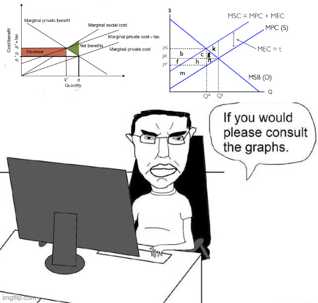

[home](./index.md)
-------------------

*author: niplav, created: 2026-01-04, modified: 2026-08-31, language: english, status: maintenance, importance: 3, confidence: unlikely*

> __.__

A "Help Me" Tax For Positional Goods
=====================================

[Positional goods](https://en.wikipedia.org/wiki/Positional_good)
work like this: You're a [*pater
familias*](https://en.wikipedia.org/wiki/Pater-familias) in ancient
Rome. You and Titus both have a large mansion each, with Titus' being
slightly but still noticeably larger. But you *really* care about having
the *biggest* mansions, specifically, so you go and buy an even bigger
mansion to replace (or augment) your old one. But Titus has an ace up
his sleeve: He can just go and buy an even bigger mansion to out do you
again. See where this is going?

In this way, the behavior around positional goods is a lot like an arms
race, where in the end no party has benefitted but lots of resources
have been burnt.

Additionally, the government would really like to tax
positional goods to the degree that they're positional: Due
to the arms race dynamic they have *negative* [dead-weight
loss](https://en.wikipedia.org/wiki/Dead-weight_loss),
since they fix a market
failure. [Progressive](https://en.wikipedia.org/wiki/Progressive_tax)
[consumption taxes](https://en.wikipedia.org/wiki/Consumption_Tax) try to
solve this by taxing consumption by high earners more—the assumption
is that at higher spending the positionality of goods money is being
spent on increases. I think this makes sense: If everyone is ultra-rich,
positional goods are a potentially infinite dump of resources.

But the relation is not perfect (e.g. teenagers competing over sneakers),
and I have another idea how to figure out which goods to tax as positional
goods.

### A Proposal

We divide goods up into categories like "jewelry", "housing", "cars"
&c. Whenever a person purchases a good, they can tick a box that says
"Help me! In buying this good I'm locked in a competition around
positional goods!". The fact that this box was or was not ticked for
this purchase is sent to the capital-G Government.

Then, for each category, The Bureaucrat in The Government calculates
the proportion of purchases that this box was ticked. Let's call
this proportion `$p$`. If we want a maximum tax rate for position
goods `$k$`, for example `$k=50\%$`, then we apply some [quadratic
voting](https://en.wikipedia.org/wiki/Quadratic_voting) magic and set
the tax rate to `$k \cdot p^2$`.

Example: If 30% of people tick the box when they buy a mansion (and
`$k=50\%$`), then we set the tax rate to 4.5%, not 15% — negligible
for most people. But if 70% of people tick the box, we get a tax rate
of 24.5%, which is appreciable but not extreme. Having a quadratic tax
instead of a linear one ensures that small groups can't control the tax
as easily, and it reduces noise from outliers, one needs broad consensus.

### Why Should This Work?

Well, let's be unrealistic and assume people ① know what positional
goods are, ② are usually aware when they're in a positional goods race,
and ③ want to get out of that race, but still have their positional
desires.

In the case of a positional good (the aforementioned mansion), they'll
then reason: "I'm about to spend a ton of money on this mansion, but
I know Titus will then *also* spend a ton of money on the next one. If
only this money didn't go to waste, and we could spend less! But hang on:
I can impose a tax on *both of us* so that someone saves us from this
arms race! And while Titus is stupid, he's probably realized this by
now. He might also check the box, but that doesn't matter, I can impose
the cost on both of us."

In the case of a non-positional good, the reasoning goes like this: "I'm
about to buy this loaf of bread. I don't care about how much bread other
people buy, and how much I buy also won't affect their decisions. I'd
like to pay less tax on bread, and I don't mind if other people also
pay less tax on bread. Why should I tick this box?"

So we have three benefits:

1. Money spent on positional goods goes to The Government which will then hopefully do something better with it. (Terms and conditions apply. Government may spend the tax in a different arms race.)
2. If the demand for mansions is [*elastic*](https://en.wikipedia.org/wiki/Elasticity_\(economics\)), that is, people will buy fewer mansions if the price increases, the Help Me tax will actually *decrease* the consumption of positional goods.
3. People have a way to bootstrap themselves out of the arms race they're stuck in, similar to how one can charge for a way to make commitments. Even if the goal isn't revenue per se, this tax marginally helps people *escape an arms race*, so this tax would be a success even if revenue is low.

Unclear?

([source](https://www.sciencedirect.com/topics/economics-econometrics-and-finance/pigouvian-tax), [source](https://pressbooks.bccampus.ca/uvicecon103/chapter/5-2-correcting-externalities/))

### Difficulties

But I guess in practice this proposal is still not very feasible:

1. The proposal smells a bit like "let's just do a *tiny* bit more [central planning](https://en.wikipedia.org/wiki/Central_planning), why not?"
	1. Who decides which categories goods get divided into, and how? I don't see a simple and obvious way to do this. There may be smart ways of choosing adaptive partitions that min-max the positionality of the goods in that category while keeping the category large, but those are likely conceptually and computationally tricky and I don't trust governments to do them well.
	2. This requires that every purchase in the tracked categories is sent to the government, which might create too much overhead to be worth it.
	3. It also requires active ticking (or not) of boxes, so it's likely only applicable for large purchases.
2. This proposal probably requires a level of economic literacy that's quite difficult to achieve.
	1. People need to understand hat positional goods are and what this tax does, maybe even how it works.
	2. If people *don't* understand it there may be standard taxation issues like certain parts of the population always being in favor of taxing every good, and other parts of the population wanting to tax none of the goods.
	3. The proposal also requires a ton of self-awareness about being in a race for positional goods.
3. In the limit, Religious Group could mobilize to buy Scripture-Forbidden-Good and always tick the box that imposes higher taxes on everyone. The quadratic equation for the tax impedes this but if Religious Group is motivated enough they could still impose a tax on others.

I think this is a neat idea, and Claude 4.5 Sonnet[^1] claimed that
nobody has proposed this before.

A pilot project could track this for obvious categories (luxury goods
like watches for >10k€, yachts, the aforementioned mansions), then
expand to obviously non-positional categories (food, books) and check
if it's working as intended.

Is this a known concept I've missed? Are there any other issues with
the proposal? Is there a pilot of exactly this idea being run in an
administrative division in Estonia?

[^1]: Thanks for the brainstorming :-)
