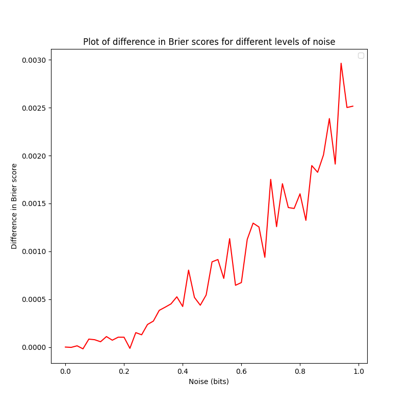
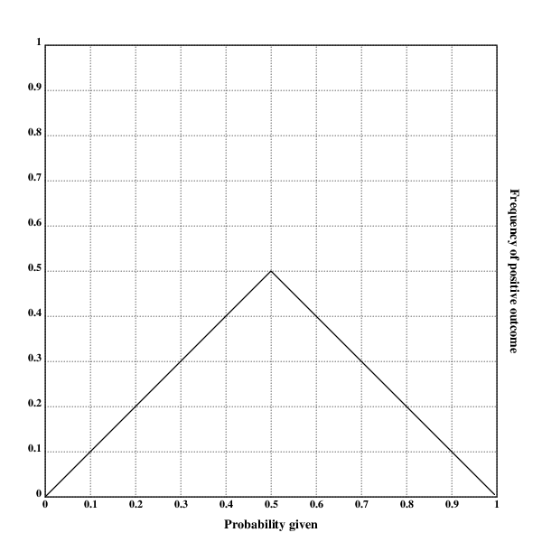

[home](./index.md)
-------------------

*author: niplav, created: 2022-02-04, modified: 2023-06-12, language: english, status: notes, importance: 4, confidence: likely*

> __I discuss proposals for a function that estimates how much predictive
information additional degrees of precision in forecasts add and at which
point additional precision is just noise, and investigate these proposals
with empirical forecasting data. I furthermore describe desirable criteria
such functions ought to fulfill.__

<!--https://nitter.net/tenthkrige/status/1412457737380839432-->
<!--https://stanford.edu/~knutson/nfc/mellers15.pdf-->
<!--https://dataverse.harvard.edu/dataset.xhtml?persistentId=doi:10.7910/DVN/D9FAZL-->

Precision of Sets of Forecasts
=================================

*epistemic status: likely not just reinventing the wheel, but the whole bicycle*

Say we have a set of resolved forecasts and can display them on a
calibration plot.

We can grade the forecasts according to some proper scoring rule,
e.g. the [Brier score](https://en.wikipedia.org/wiki/Brier_score)
or the [logarithmic scoring
rule](https://en.wikipedia.org/wiki/Scoring_rule#Logarithmic_scoring_rule).

But we can also ask the question: how fine-grained are the predictions of
our forecaster? I.e., at which level of precision can we assume that
the additional information is just noise?

### Overprecise Omar

Take, for example, a hypothetical forecaster Omar who always gives
their forecasts with 5 decimal digits of precision, such as forecasting a
"24.566% probability of North Korea testing an ICBM in the year 2022",
even though if we look at their calibration plot (of sufficiently many
forecasts), we see that they are pretty much random in any given interval
of length 0.1 (i.e., their forecast with 15% and a forecast of 5% can
be expected to resolve to the same outcome with equal probability). This
means that 4 of the 5 decimal digits of precision are likely just noise!

Omar would be behaving absurdly; misleading their audience into
believing they had spent much more time on their forecasts than they
actually had (or, more likely, into correctly leading the audience into
believing that there was something epistemically sketchy going on).

I believe something similar is going on when people encounter
others putting probabilities on claims: It appears like an attempt
at claiming undue quantitativeness (quantitativity?) in their
reasoning, and at making the listener fall prey to [precision
bias](https://en.wikipedia.org/wiki/Precision_bias),
as well as an implicit claim at scientific
rigour. However, not all precision in prediction is [false
precision](https://en.wikipedia.org/wiki/False_precision): At some
point, if remove digits of precision, the forecasts will become worse
in expectation.

But how might we confront our forecaster Omar from above? How might we
estimate the level of degrees of precision after which their forecasts
gave no more additional information?

Definitions
------------

Ideally we'd want to find a number that tells us, for a given set of
prediction, the precision that those predictions display: Any additional
digits added to the probability beyond this precision would just be noise.

Let us call this number the precision `$ᚠ$` of a set of forecasts.

Let `$\mathbf{D}=((f_1, o_1), \dots, (f_n, o_n)) \in ((0,1),\{0,1\})^n$`
be a dataset of `$n$` forecasts `$f_i$` and resolutions `$o_i$`.

Then `$ᚠ$` is simply a function that takes in such a dataset of
forecasts and produces a real number `$ᚠ: ((0;1),\{0,1\})^n \rightarrow
\mathbb{R}$`, so for example `$ᚠ(D)=0.8$` for the forecasts and outcomes
`$D$` of some forecaster, or team of forecasters.

### Bits, Not Probabilities, for Precision

It is natural to assume that `$ᚠ$` returns a *probability*: after
all, the input dataset has probabilities, and when talking about
[Omar's](#Overprecise_Omar) calibration plot<!--TODO: link--> I was
explicitely calling out the loss of accuracy in probability intervals
shorter than 0.1.

Furthermore, Tetlock et al.<!--TODO: read & link their precision paper-->
also talk about precision in terms of probabilities, we are all used to
probabilities, probabilities are friends.

But this doesn't stand up to scrutiny: If we accept this, assuming
we use probability buckets of size 5%, then 99.99999% and 96% are as
similar to each other as 51% and 54.99999%. But the readers familiar
with the formulation of probability in log-odds form<!--TODO: link-->
surely balk at this equivalence: 99.99999% is a beast of a probability,
an invocation only uttered in situations of extreme certainty, while 96%,
51% and 54.99999% (modulo false precision) are everyday probabilities,
plebeian even.

However, in terms of *precision*, 54.99999% stands out like a sore
thumb: while 99.99999% is supremely confident, it is not *overprecise*,
since rounding up to 100% would be foolish<!--TODO: link 0 and 1 are
not probabilities-->; but with 54.99999%, there is no good reason we
can't just round to 55%.

So precision should be calculated in log-odds space, where one moves in
bits instead of probabilities. Since we want to make a statement how
much we can move the probabilities around until the proper scoring
rule<!--TODO: link--> we apply starts giving worse results, it is
only natural to express the precision in bits as well. (Which can't be
converted linearly into probabilities: moving from 50% to 75% is one
bit, but similarly moving from ~99.954% to ~99.977% is also a change
of one bit).<!--TODO: check whether example is actually correct-->

Algorithms!
------------

The assumption of expressing precision in bits naturally leads to an
algorithm:

1. Transform the dataset of forecasts `$D$` into log-odds.
2. Apply some noise `$ⴟ(θ)$` for some parameters `$θ$` to those forecasts.
3. Transform those the forecasts back to probabilities.
4. Check whether this noising has changed the score for the forecasts.
5. If 4. hasn't determined the precision at which forecasts in `$D$` receive worse scores, change `$θ$` and go back to step 1.
6. Else convert `$ⴟ(θ)$` into an estimate of precision and return it.

This has some free parameters (Which noise function `$ⴟ(θ)$`
*exactly* does one use? How does one change `$θ$` at the end of each
iteration?) and is potentially quite resource intensive (potentially
requiring many samples to find the correct `$θ$`).

Uniform noise (in both directions) is easiest to interpret: The "width"
of the noise is then the precision that is being investigated.

<!--TODO: image of uniform noise at various points on the log-odds
curve-->

So one can first define some helper functions

	import csv
	import statistics
	import numpy as np

	def mse(o,p):
		return np.mean(np.abs(o-p)**2)

	def logit(p):
		return np.log(p/(1-p))

	def logistic(p):
		return 1/(1+np.exp(-p))

and then a simple function that

	def perturbed_score_difference(forecasts, perturbation=1, samples=1000):
		o=forecasts[0]
		p=forecasts[1]
		score=mse(o,p)
		pert_scores=[]
		for i in range(0,samples):
			perturbed=logistic(logit(p)+np.random.default_rng().uniform(-perturbation/2,perturbation/2,len(p)))
			pert_scores.append(mse(o,perturbed))
		return np.mean(pert_scores)-score

One could then simply sample the precisions and estimate the elbow
point<!--TODO: link--> with a threshold value (why doesn't `range`
allow floating point values as parameters?):

	def score_differences(forecasts, samples=100, low=0, high=100, div=100):
		return np.array([[s/div, perturbed_score_difference(d1, perturbation=s/div, samples=samples)] for s in range(low,high)]).T

We can now define a toy dataset to visualize the differences in Brier
score of the perturbed data and the unperturbed data:

	d1=np.array([[1,0.8],[0,0.4],[0,0.65],[1,0.99]]).T
	oc=d1[0]
	pr=d1[1]

	d2=np.array([[1,0.8],[0,0.4],[0,0.65],[1,0.9]]).T
	oc2=d1[0]
	pr2=d1[1]

	d3=np.array([[0,0.8],[1,0.4],[1,0.65],[0,0.9]]).T
	oc3=d1[0]
	pr3=d1[1]

Then we can set

	differences1=score_differences(d1, samples=5000, low=0, high=50, div=50)
	differences2=score_differences(d1, samples=5000, low=0, high=50, div=50)
	differences3=score_differences(d1, samples=5000, low=0, high=50, div=50) 

and plot the result:

<!--TODO: plot description-->

One can now eyeball this plot and try to determine the point where the
difference in Brier score starts diverging from 0, which I would put at
around 0.25 bits.

Appendix A: Conditions for a Precision Evaluation Function
------------------------------------------------------------

Use precision `$ᚠ$` and noise `$ⴟ$`.

1. If `$n=0$`, `$s(\emptyset, \mathcal{F})$` is undefined.
2. If `$n=1$`, `$s(\mathbf{D}, \mathcal{F})=0$`: We are generally suspicious of any single forecast.
	1. More generally, if `$\mathbf{D}$` contains an `$f_i$` so that there is no other prediction with a probability within `$[f_i-\frac{\mathcal{F}}{2}; f_i+\frac{\mathcal{F}}{2}]$`, then `$s(\mathbf{D}, \mathcal{F})=0$`. Yes, even if the set of forecasts is "dense" and non-random in other places.
3. If `$n=2$`, then it should hold for an `$ε>0$` (but close to 0): `$s(((ε, 0), (1-ε, 1)), 1)=1$`, and `$s(((ε, 0), (1-ε, 1)), 0.5)=0$`.
	1. More generally, if we have only zeros in the left half and ones in the right half, with `$n \rightarrow \infty$`, and a sufficiently small `$\frac{1}{n}>ε>0$`, it should hold that `$s(((ε,0),(2ε,0), \dots, (\lfloor \frac{n}{2} \rfloor ε, 0), (\lceil \frac{n}{2} \rceil ε, 1), \dots, (nε, 1)), \mathcal{F})$` is `$1$` for `$\mathcal{F}=1$` and `$0$` for `$\mathcal{F} \le 0.5$`.
4. For a sufficiently large `$n \rightarrow \infty$`, and a sufficiently small `$\frac{1}{n}>ε>0$`, and `$r(p)$` being 1 with probability `$p$` and 0 with probability `$1-p$`, it should hold that `$s(((ε,r(ε)),(2ε,r(2ε)), \dots, (\lfloor \frac{n}{2} \rfloor ε, r(\lfloor \frac{n}{2} \rfloor ε)), (\lceil \frac{n}{2} \rceil ε, r(\lceil \frac{n}{2} \rceil ε)), \dots, (nε, r(nε))), \mathcal{F})=1$` for any `$\mathcal{F}$`: If we have lots of datapoints, all perfectly calibrated, the score is nearly 0 at all precisions.
5. In expectation, if we sample every `$o_i$` uniformly from `$\{0, 1\}$` with replacement, `$s(\mathbf{D}, \mathcal{F})=0$`.
6. With `$\mathcal{F}_1<\mathcal{F}_2$`, `$s(\mathbf{D}, \mathcal{F}_1) \le s(\mathbf{D}, \mathcal{F}_2)$` (smaller precision shouldn't lead to a greater score, since if you're uncalibrated at a precision of 10%, you're not going to be suddenly calibrated at a precision of 5%)
	1. We can't just do this by multiplying the result with the precision, since that would violate condition 4

But what should be done about a calibration plot that looks like this?

There are two ways of arguing what, morally, the precision of the
forecasts is:

* The argument *for* having a score of `$~1$` for every precision (assuming a large `$n$`) is that inferring the correct way to make forecasts from this calibration plot is trivial: With forecasts of probability `$f_i>0.5$`, re-assign a probability `$f_i:=1-f_i$`.
* The argument *against* giving a score of `$~1$` is that extending this rule would mean that at every kind of correction on the plot is valid, but there is no clear cutoff point that prevents us from applying this to individual predictions ("If you predict 99% instead of 43%, and 1% instead of 13%, and 1% instead of 23%, and […], then you achieve perfect resolution and calibration.")

Appendix B: Further Idea Sketches for Algorithms
-------------------------------------------------

* Algorithms for quantifying the precision of calibration plots
	* Input: A list of `n` forecasts and their resolutions
	* First idea:
		* For i=2, n
			* Segment the forecasts into i different segments, ordered by probability
			* Calculate average outcome
			* For two adjacent segments, calculate the slope for those values
			* Append the mean of all slopes of adjacent segments to the array `output`
		* Return `output`
	* Second idea:
		* For i=2, n
			* Segment the forecasts into i different segments, ordered by probability
			* Re-scale each segment to give probabilities from 0 to 1
			* Use a proper scoring rule? Idk I haven't thought this through
	* Third idea:
		* Something like the first idea, but with a sliding window
	* Fourth idea:
		* Average linear regression of all subsequences with length`$\ge \mathcal{F}$`
* Start with perfect predictor, the level of noise at which its Brier score is equal to the dataset
* Additional ideas:
	* Multiply score with the average number of datapoints inside the given precision
