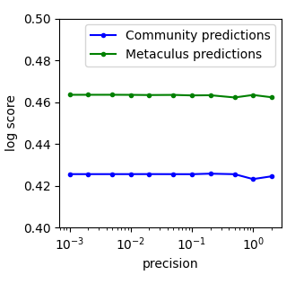
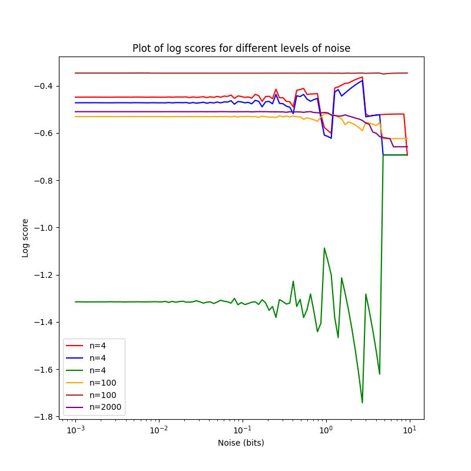
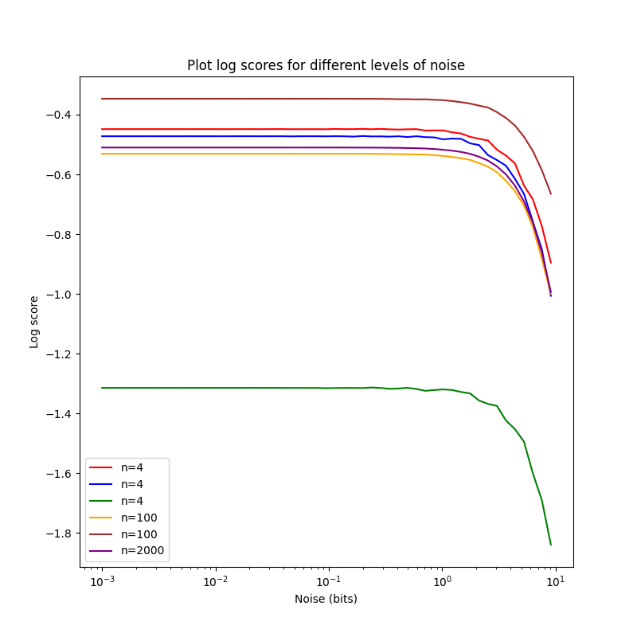
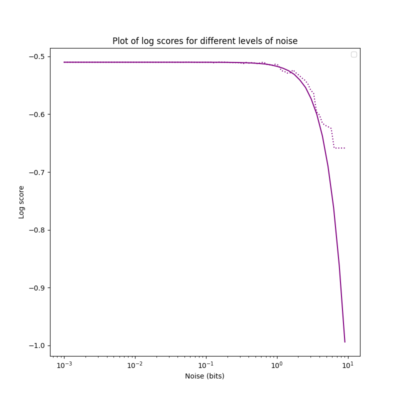

[home](./index.md)
-------------------

*author: niplav, created: 2022-02-04, modified: 2023-06-12, language: english, status: notes, importance: 4, confidence: likely*

> __I discuss proposals for a method that estimates how much predictive
information additional degrees of precision in forecasts add and at which
point additional precision is just noise, and investigate these proposals
with empirical forecasting data. I furthermore describe desirable criteria
such functions ought to fulfill. I conclude that methods based on rounding
probabilities are hot flaming garbage, methods based on rounding odds
or log-odds are regular garbage, and methods based on applying noise to
probabilities are ok but slow.__

<!--https://nitter.net/tenthkrige/status/1412457737380839432-->
<!--https://stanford.edu/~knutson/nfc/mellers15.pdf-->
<!--https://dataverse.harvard.edu/dataset.xhtml?persistentId=doi:10.7910/DVN/D9FAZL-->

Precision of Sets of Forecasts
=================================

#### Epistemic Status

Likely not just reinventing the wheel, but the whole bicycle.

------------

Say we have a set of resolved forecasts and can display them on a
calibration plot.

We can grade the forecasts according to some proper scoring rule,
e.g. the [Brier score](https://en.wikipedia.org/wiki/Brier_score)
or the [logarithmic scoring
rule](https://en.wikipedia.org/wiki/Scoring_rule#Logarithmic_scoring_rule),
perhaps broken up by calibration and resolution<!--TODO: links and/or
citation-->.

But we can also ask the question: how fine-grained are the predictions of
our forecaster? I.e., at which level of precision can we assume that
the additional information is just noise?

### Overprecise Omar

Take, for example, a hypothetical forecaster Omar who always gives
their forecasts with 5 decimal digits of precision, such as forecasting
a "24.566% probability of North Korea testing an ICBM in the year
2022"<!--TODO: link Metaculus-->, even though if we look at their
calibration plot (of sufficiently many forecasts), we see that they
are pretty much random in any given interval of length 0.1 (i.e.,
their forecast with 15% and a forecast of 5% can be expected to
resolve to the same outcome with equal probability). This means that
4 of the 5 decimal digits of precision are likely just noise!

Omar would be behaving absurdly; misleading their audience into believing
they had spent much more time on their forecasts than they actually had
(or, more likely, into correctly leading the audience into believing
that there was something epistemically sketchy going on). It is certainly
useful to use [probability resilience, and not imprecision, to communicate
uncertainty](https://forum.effectivealtruism.org/s/dg852CXinRkieekxZ/p/m65R6pAAvd99BNEZL),
but not but there is an adequate & finite limit to precision.

I believe something similar is going on when people encounter
others putting probabilities on claims: It appears like an
attempt at claiming undue quantitativeness (quantitativity?) in
their reasoning, and at making the listener fall prey to
[precision bias](https://en.wikipedia.org/wiki/Precision_bias),
as well as an implicit claim at scientific rigour. However,
not *all* precision in judgmental forecasting is [false
precision](https://en.wikipedia.org/wiki/False_precision): At some
point, if remove digits of precision, the forecasts will become worse
in expectation.

But how might we confront our forecaster Omar from above? How might we
estimate the level of degrees of precision after which their forecasts
gave no more additional information?

Definitions
------------

Ideally we'd want to find a number that tells us, for a given set of
(resolved) forecasts, the precision that those predictions display:
Any additional digits added to the probability beyond this precision
would just be noise.

Let us call this number the precision `$ᚠ$` of a set of forecasts.

Let `$\mathbf{D}=((f_1, o_1), \dots, (f_n, o_n)) \in ((0,1),\{0,1\})^n$`
be a dataset of `$n$` forecasts `$f_i$` and resolutions `$o_i$`.

Then `$ᚠ$` is simply a function that takes in such a dataset of
forecasts and produces a real number `$ᚠ: ((0;1),\{0,1\})^n \rightarrow \mathbb{R}$`,
so for example `$ᚠ(D)=0.2$` for the forecasts and outcomes `$D$`
of some forecaster, or team of forecasters.

### Bits, Not Probabilities, for Precision

It is natural to assume that `$ᚠ$` is a *probability*:
after all, the input dataset has probabilities, and
when talking about [Omar's](#Overprecise_Omar) [calibration
plot](https://en.wikipedia.org/wiki/Probabilistic_classification#Probability_calibration)
I was explicitely calling out the loss of accuracy in probability
intervals shorter than 0.1.

Furthermore, Tetlock et al. 2018<!--TODO: read & link their precision
paper--> also talk about precision in terms of probabilities, we are
all used to probabilities, probabilities are *friends*.

But this doesn't stand up to scrutiny: If we accept this,
assuming we use probability buckets of size 5%, then 99.99999%
and 96% are as similar to each other as 51% and 54.99999%. But the
readers familiar with the formulation of probability in [log-odds
form](https://en.wikipedia.org/wiki/Logit) will surely balk at this
equivalence: 99.99999% is a beast of a probability, an invocation only
uttered in situations of extreme certainty, while 96%, 51% and 54.99999%
(modulo false precision) are everyday probabilities, plebeian even.

However, in terms of *precision*, 54.99999% stands out
like a sore thumb: while 99.99999% is supremely confident,
it is not *overprecise*, since rounding up to 100% [would be
foolish](https://www.lesswrong.com/posts/QGkYCwyC7wTDyt3yT/0-and-1-are-not-probabilities);
but with 54.99999%, there is no good reason we can't just round to 55%.

So precision should be calculated in log-odds space, where one moves in
bits instead of probabilities. Since we want to make a statement how
much we can move the probabilities around until the [proper scoring
rule](https://en.wikipedia.org/wiki/Scoring_rule) we apply starts
giving worse results, it is only natural to express the precision in
bits as well. (Which can't be converted linearly into probabilities:
moving from 50% to 75% is one bit, but similarly moving from ~99.954%
to ~99.977% is also a change of one bit).<!--TODO: check whether example
is actually correct-->

Algorithms!
------------

The assumption of expressing precision in bits naturally leads to two
different algorithms.

These algorithms follow a common pattern:

0. Input: a dataset `$D$` of forecasts and resolutions.
1. Set a perturbation parameter `$σ$` to a minimum value.
2. Repeat:
	1. Potentially do *something* with the probabilities
	2. Perturb the probabilities, using `$σ$` as a parameter for the perturbation function `$ఐ: ((0,1),\{0,1\})^n \times ℝ \rightarrow ((0,1),\{0,1\})^n$` so that `$D'=ఐ(D, σ)$`.
	3. Potentially reverse the things done in step 1.
	4. Calculate the score of `$D'$`.
	5. If the perturbed score is significantly worse than the unperturbed score, then `$σ$` is the correct level of precision, stop.
	6. Else increase `$σ$`.

### Log-Odds Rounding

A technique [explored
by](https://twitter.com/tenthkrige/status/1412457737380839432)
[@tenthkrige](https://twitter.com/tenthkrige/) explores rounding in
odds-form: The probabilities are converted into odds-form and there
rounded to the nearest multiple of the perturbation parameter `$σ$`.

Here, the precision of the community predictions *looks like* it
is somewhere between 0.5 and 1, and the precision of the Metaculus
prediction is around 0.25 and 0.5, but it's hard to tell without access
to the measurements.

Log-odds rounding is pretty similar to odds-rounding.

#### Implementation

Once a probability `$p$` has been converted into log-odds
form `$l_p$`, then rounding with a perturbation `$σ$` is
[simply](https://en.wikipedia.org/wiki/Rounding#Rounding_to_a_specified_multiple)
`$l'_p=σ \cdot \text{round}(σ \cdot l_p)$`.

Scoring the forecasts using the logarithmic scoring rule, one can then
write this in a couple of lines of python code:

	def logodds_rounded_score(forecasts, perturbation=1):
		p=forecasts[1]
		lo=logit(p)
		rounded_lo=perturbation*np.round(lo/perturbation)
		rounded_probs=logistic(rounded_lo)
		return np.mean(logscore(forecasts[0], rounded_probs))

Full code for all algorithms is [here](./code/precision/algorithms.py).

#### Testing with Toy Data

One can then check whether everything is working nicely by applying the
method to a couple of small (n=4,4,4,100,100,2000) toy datasets.

The smallest three datasets, all of n=4, are `d1` (red in the chart),
`d2` (blue in the chart) and `d3` (green in the chart).

They are

	d1=np.array([[1,0.8],[0,0.4],[0,0.65],[1,0.99]]).T
	d2=np.array([[1,0.8],[0,0.4],[0,0.65],[1,0.9]]).T
	d3=np.array([[0,0.8],[1,0.4],[1,0.65],[0,0.9]]).T

One notices that `d2` is just a slightly less resolute & precise `d1`,
and `d3` is pretty bad.

#### Problems

Now this is not… great, and certainly quite different from the data
by tenthkrige. I'm pretty sure this isn't a bug in my implementation or
due to the switch from odds to log-odds, but a deeper problem with the
method of rounding for perturbation.

There are two forces that make these charts so weird:

1. If you decrease precision by rounding, you can actually make a
probability *better* by moving it closer to 0%/100%. If you have one
forecast with probability `$p=0.75$` and the outcome `$o=1$`. Without
rounding, this has a log-score of ~-0.29. Setting `$σ=0.3$` and rounding
in log-odds space and transforming back gives `$p_r \approx 0.77$`, with
an improved log-score of ~-0.26. When one sees the weird zig-zag pattern
for log-score, I believe that *this* is the reason. This is likely
only an issue in smaller datasets: In larger ones, these individual
random improving/worsening effects cancel each other out, and one can
see the underlying trend of worsening (as is already visible with the
purple plot for n=2000, and to a lesser extent brown & orange). Still,
I count this as a major problem with rounding-based methods.

2. Rounding very strongly rounds everything to 50%, so with strong
enough rounding *every* dataset has the same score. This has some
counter-intuitive implications: If you are worse than chance, perturbing
your probabilities more and more leads you reliably to a better score
(in the case of the log score, `$\log(0.5) \approx -0.69$`). One can also
see this in the plot above: All but one datasets end up with approximately
the same log score. This isn't an property that *kills* rounding, since
we in theory only care about the point where the perturbed score starts
diverging from the unperturbed score, but it is still undesirable.

#### Advantages

That said, the method has one big advantage: It is quite fast, running
~instantaneously for even big datasets on my laptop.

### Noise in Log-Odds Space

But one can also examine a different paradigm: applying noise to
the predictions. In our [framework](#Algorithms), this is concretely
operationalized by repeatedly (`$s$` times) projecting the probabilities
into log-odds space, applying some noise with width `$σ$` to them,
and then calculating the resulting probabilities and scoring them,
finally taking the mean of the scores.

There are some free parameters here, especially around the exact type
of noise to use (normal? beta? uniform?), as well as the number `$s$`
of samples.

I have decided to use uniform noise, but for no special mathematical
reason, and adjust the number of samples by the size of the dataset
(with small datasets `$n \approx 1000$`, less with bigger datasets).

	def noised_score(forecasts, perturbation=1, samples=100):
		o=forecasts[0]
		p=forecasts[1]
		pert_scores=[]
		for i in range(0,samples):
			noised=logistic(logit(p)+np.random.default_rng(seed=time.monotonic_ns()).uniform(-perturbation/2,perturbation/2,len(p)))
			pert_scores.append(logscore(o,noised))
		return np.mean(pert_scores)

This gives a *much* nicer looking plot, with `$n=500$` samples:

The plots are falling ~monotonously, with a worse score for increasing
noise, as expected. The score for `d2` drops more quickly than the one
for `d1`, maybe because `d2` is less precise than `d1`? I'm not sure.

#### Advantages and Problems

Noising log-odds has a bunch of advantages: As we increase the
perturbation, the score falls ~monotonically (which I conjecture to
always be true in the limit of infinitely many samples), and doesn't
converge to a specific value as rounding-based methods do.

This can be seen when comparing increasing perturbation with the
`$n=2000$` dataset:

The disadvantage lies in the runtime: Taking many samples makes the
method slow, but a small number of samples is too noisy to reliably
detect when the the quality of forecasts starts dropping off. I think
this is less of a problem with bigger datasets, but in the worst case
I'd have to do a bunch of numpy-magic to optimize this further (or
rewrite the code in a faster programming language, with a prototype in C
[here](./code/precision/precision.c)).

### Finding Divergence

If the unperturbed dataset `$D$` has a score `$r=S(D)$`, then we also need
to find a value for `$σ$` with `$D'=ఐ(D, σ)$` so that `$r'=S(D')\not
\approx r$`, perhaps even `$r'<r$` (in the case of scoring rules where
lower scores are worse) or even that for all positive `$δ \in ℝ$`
and `$D''=ఐ(D, σ+δ)$` it holds that `$r''=S(D'')<r'$`. That is,
as we increase the perturbation more and more, the score becomes worse
and worse.

The easiest way to do this is to iterate through values for `$σ$`,
and once the difference between `$r$` and `$r'$` is too big, return the
corresponding `$σ$`. This method has disadvantages (the least-noteworthy
difference between `$r$` and `$r'$` is probably an arbitrary constant,
simply iterating requires a bunch of compute and only finds an upper
bound on a `$σ$` which is "too much"), but shines by virtue of being
bog-simple and easy to implement. A more sophisticated method can use
binary search to zero in on a `$σ$` that *just* crosses the threshold.

	def lo_find_precision(forecasts, samples=100, low=10e-4, high=10, change=1.05, mindiff=0.01, mode='round'):
		clean_score=pert_score=np.mean(logscore(forecasts[0], forecasts[1]))
		p=low
		while np.abs(clean_score-pert_score)<mindiff and p<high:
			if mode=='round':
				pert_score=logodds_rounded_score(forecasts, perturbation=p)
			elif mode=='noise':
				pert_score=noised_score(forecasts, perturbation=p, samples=samples)
			p=p*change
		return p

Unfortunately, this method doesn't really give reliable results for small sample sizes:

	>>> lo_find_precision(d1, change=1.05, mode='noise', samples=500)
	1.2406168179333095
	>>> lo_find_precision(d1, change=1.05, mode='noise', samples=500)
	1.1815398266031518
	>>> lo_find_precision(d1, change=1.05, mode='noise', samples=500)
	1.1815398266031518
	>>> lo_find_precision(d1, change=1.05, mode='noise', samples=500)
	1.0716914527012713
	>>> lo_find_precision(d1, change=1.05, mode='noise', samples=500)
	1.2406168179333095
	>>> lo_find_precision(d1, change=1.05, mode='noise', samples=500)
	1.125276025336335

But this *does* tell us that `$ᚠ(d1)\approx 1.15$` bits.

The code can be changed to be faster, using [binary
search](https://en.wikipedia.org/wiki/Binary_search) (rewriting the code
to be [noisy binary search](https://en.wikipedia.org/wiki/Binary_search),
since the comparisons of scores are not reliable, might be a cool
project<!--TODO-->):

<!--TODO-->

A more sophisticated technique could try to estimate the  [elbow
point](https://en.wikipedia.org/wiki/Knee_of_a_curve) of the declining
curve of scores, but as far as I know there is no reliable method for
doing so, nor is there a mathematical framework for this.

Usage
------

Given the precision of some forecaster or forecasting platform, one can
much easier perform sensitivity analysis (especially after correcting
for miscalibration).

Appendix A: Conditions for a Precision Evaluation Function
------------------------------------------------------------

Use precision `$ᚠ$` and noise `$ⴟ$`.

1. If `$n=0$`, `$s(\emptyset, \mathcal{F})$` is undefined.
2. If `$n=1$`, `$s(\mathbf{D}, \mathcal{F})=0$`: We are generally suspicious of any single forecast.
	1. More generally, if `$\mathbf{D}$` contains an `$f_i$` so that there is no other prediction with a probability within `$[f_i-\frac{\mathcal{F}}{2}; f_i+\frac{\mathcal{F}}{2}]$`, then `$s(\mathbf{D}, \mathcal{F})=0$`. Yes, even if the set of forecasts is "dense" and non-random in other places.
3. If `$n=2$`, then it should hold for an `$ε>0$` (but close to 0): `$s(((ε, 0), (1-ε, 1)), 1)=1$`, and `$s(((ε, 0), (1-ε, 1)), 0.5)=0$`.
	1. More generally, if we have only zeros in the left half and ones in the right half, with `$n \rightarrow \infty$`, and a sufficiently small `$\frac{1}{n}>ε>0$`, it should hold that `$s(((ε,0),(2ε,0), \dots, (\lfloor \frac{n}{2} \rfloor ε, 0), (\lceil \frac{n}{2} \rceil ε, 1), \dots, (nε, 1)), \mathcal{F})$` is `$1$` for `$\mathcal{F}=1$` and `$0$` for `$\mathcal{F} \le 0.5$`.
4. For a sufficiently large `$n \rightarrow \infty$`, and a sufficiently small `$\frac{1}{n}>ε>0$`, and `$r(p)$` being 1 with probability `$p$` and 0 with probability `$1-p$`, it should hold that `$s(((ε,r(ε)),(2ε,r(2ε)), \dots, (\lfloor \frac{n}{2} \rfloor ε, r(\lfloor \frac{n}{2} \rfloor ε)), (\lceil \frac{n}{2} \rceil ε, r(\lceil \frac{n}{2} \rceil ε)), \dots, (nε, r(nε))), \mathcal{F})=1$` for any `$\mathcal{F}$`: If we have lots of datapoints, all perfectly calibrated, the score is nearly 0 at all precisions.
5. In expectation, if we sample every `$o_i$` uniformly from `$\{0, 1\}$` with replacement, `$s(\mathbf{D}, \mathcal{F})=0$`.
6. With `$\mathcal{F}_1<\mathcal{F}_2$`, `$s(\mathbf{D}, \mathcal{F}_1) \le s(\mathbf{D}, \mathcal{F}_2)$` (smaller precision shouldn't lead to a greater score, since if you're uncalibrated at a precision of 10%, you're not going to be suddenly calibrated at a precision of 5%)
	1. We can't just do this by multiplying the result with the precision, since that would violate condition 4

But what should be done about a calibration plot that looks like this?

There are two ways of arguing what, morally, the precision of the
forecasts is:

* The argument *for* having a score of `$~1$` for every precision (assuming a large `$n$`) is that inferring the correct way to make forecasts from this calibration plot is trivial: With forecasts of probability `$f_i>0.5$`, re-assign a probability `$f_i:=1-f_i$`.
* The argument *against* giving a score of `$~1$` is that extending this rule would mean that at every kind of correction on the plot is valid, but there is no clear cutoff point that prevents us from applying this to individual predictions ("If you predict 99% instead of 43%, and 1% instead of 13%, and 1% instead of 23%, and […], then you achieve perfect resolution and calibration.")

Appendix B: Further Idea Sketches for Algorithms
-------------------------------------------------

* Algorithms for quantifying the precision of calibration plots
	* Input: A list of `n` forecasts and their resolutions
	* First idea:
		* For i=2, n
			* Segment the forecasts into i different segments, ordered by probability
			* Calculate average outcome
			* For two adjacent segments, calculate the slope for those values
			* Append the mean of all slopes of adjacent segments to the array `output`
		* Return `output`
	* Second idea:
		* For i=2, n
			* Segment the forecasts into i different segments, ordered by probability
			* Re-scale each segment to give probabilities from 0 to 1
			* Use a proper scoring rule? Idk I haven't thought this through
	* Third idea:
		* Something like the first idea, but with a sliding window
	* Fourth idea:
		* Average linear regression of all subsequences with length`$\ge \mathcal{F}$`
* Start with perfect predictor, the level of noise at which its Brier score is equal to the dataset
* Additional ideas:
	* Multiply score with the average number of datapoints inside the given precision
