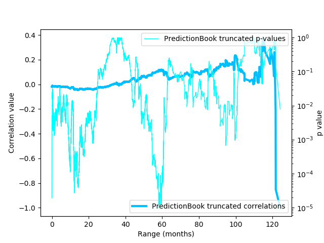

[home](./index.md)
-------------------

*author: niplav, created: 2020-03-24, modified: 2022-04-01, language: english, status: maintenance, importance: 6, confidence: possible*

> __This text looks at the accuracy of forecasts in
relation to the time between forecast and resolution, and
asks three questions: First; is the accuracy higher [between
forecasts](#Judging-Between-Forecasts); Second; is the accuracy higher
[between questions](#Judging-Between-Questions); Third; is the accuracy
higher [within questions](#Judging-Within-Questions)? These questions are
analyzed using data from [PredictionBook](https://predictionbook.com/)
and [Metaculus](https://www.metaculus.com/questions/), the answers turn
out to be yes, no and yes for Metaculus data; and no, no and yes for
PredictionBook data. Possible reasons are discussed.__

<!--TODO: fix instances of \* \*-->
<!--TODO: fix predictionbook & metaculus capitalization-->

Range and Forecasting Accuracy
===============================

> Above all, don’t ask what to believe—ask what to anticipate. Every
question of belief should flow from a question of anticipation, and that
question of anticipation should be the center of the inquiry. Every guess
of belief should begin by flowing to a specific guess of anticipation,
and should continue to pay rent in future anticipations. If a belief
turns deadbeat, evict it.

*— [Eliezer Yudkowsky](https://en.wikipedia.org/wiki/Eliezer_Yudkowsky), [“Making Beliefs Pay Rent (in Anticipated Experiences)“](https://www.lesswrong.com/posts/a7n8GdKiAZRX86T5A/making-beliefs-pay-rent-in-anticipated-experiences), 2007*

[Probabilistic
forecasting](https://en.wikipedia.org/wiki/Probabilistic_forecasting)<!--TODO:
re-pivot to "judgemental forecasting"?-->
that aggregates both [qualitative and quantitative
methods](https://en.wikipedia.org/wiki/Forecasting#Qualitative_vs._quantitative_methods)
is a comparatively simple idea. Basically, one needs to have only very
few tools at one's disposal to being ready to start forecasting:

<!--TODO: give more weight to the fact that it is humans doing this-->

* View of belief as probabilistic (perhaps with some bayesian epistemology)
* Track records (grading results of forecasts using for example brier scores or log scores)
* Probability theory (a concept of probabilities, and maybe some simple probability distributions)

Since the 1980s, forecasting has slowly but surely matured from "X is
going to happen because divine revelation told me so" to "my probability
distribution on the outcome of this random variable is an X distribution
with the following parameters", or alternatively "I assign a probability
of X% to this event".

However, since this kind of forecasting is relatively recent, information
about the accuracy of long-range forecasting is basically non-existent:

> 1. Long-range forecasts are often stated
> too imprecisely to be judged for accuracy.
> [More](https://www.openphilanthropy.org/blog/how-feasible-long-range-forecasting#Imprecisely_stated_forecasts)
> 2. Even if a forecast is stated precisely, it might be difficult to
> find the information needed to check the forecast for accuracy.
> [More](https://www.openphilanthropy.org/blog/how-feasible-long-range-forecasting#Practically_uncheckable_forecasts)
> 3. Degrees of confidence for long-range
> forecasts are rarely quantified.
> [More](https://www.openphilanthropy.org/blog/how-feasible-long-range-forecasting#Non-quantified_degrees_of_confidence)
> 4. In most cases, no comparison to a “baseline method”
> or “null model” is possible, which makes it difficult
> to assess how easy or difficult the original forecasts were.
> [More](https://www.openphilanthropy.org/blog/how-feasible-long-range-forecasting#No_comparison_to_a_baseline_method_or_null_model_is_feasible)
> 5. Incentives for forecaster accuracy are usually unclear or weak.
> [More](https://www.openphilanthropy.org/blog/how-feasible-long-range-forecasting#Unclear_or_weak_incentives_for_accuracy)
> 6. Very few studies have been designed so as to allow confident
> inference about which factors contributed to forecasting accuracy.
> [More](https://www.openphilanthropy.org/blog/how-feasible-long-range-forecasting#Weak_strategy_for_causal_identification)
> 7. It’s difficult to know how comparable past forecasting exercises
> are to the forecasting we do for grantmaking purposes, e.g. because the
> forecasts we make are of a different type, and because the forecasting
> training and methods we use are different.
> [More](https://www.openphilanthropy.org/blog/how-feasible-long-range-forecasting#Unclear_relevance_to_our_own_long-range_forecasting)

*— [Luke Muehlhauser](http://lukemuehlhauser.com), [“How Feasible Is Long-range Forecasting?”](https://www.openphilanthropy.org/blog/how-feasible-long-range-forecasting), 2019*

<!--TODO: put in info where Metaculus and PredictionBook fit into this-->

In this text, I will try to look at the accuracy of short-term and
mid-term forecasting, which may shine some light on the relation between
the range of forecasts and their accuracy in general.

The *range* of a forecast is defined as the length of the timespan
between the forecast and the resolution of the forecast (i.e.,
when we know the outcome of the forecast). Keeping with [Muehlhauser
2019](https://www.openphilanthropy.org/blog/how-feasible-long-range-forecasting "How Feasible Is Long-range Forecasting?"),
I define short-term forecasts as forecasts with a range of less than
a year, mid-range forecasts as forecasts with a range between 1 and 10
years, and long-term forecasts as forecasts with a range of more than 10
years (this distinction is not central to the following analysis, though).

Fortunately, for short- and mid-range forecasts, two easily accessible
sources of forecasts and their resolutions are available online: The two
forecasting websites [PredictionBook](https://predictionbook.com) and
[Metaculus](https://www.metaculus.com), frequented mostly by hobbyists.

I am not aware of large-scale datasets with resolved long-range forecasts.

To find out about the range of forecasts, I download, parse & analyse
forecasting data from these sites using Python, and then analyze the
data using [Klong](http://t3x.org/klong/index.html).

<!--
Make a point here that making forecasts is one of the best existing
practical method of rationality verification & exercises:
https://www.lesswrong.com/s/pvim9PZJ6qHRTMqD3/p/5K7CMa6dEL7TN7sae

Not necessary, move elsewhere.
-->

<!--
Distinction between {probabilistic,non-probabilistic}
{model-based,judgmental} forecasting
-->

Results
--------

Using two datasets with both ~45k predictions, having ranges between
1 day and 10 years (thereby containing forcasts with short and medium
range) I investigate the relation between the accuracy of predictions
and their range (that is, the time between the prediction being made
and the result of the prediction being known).

I find that the data indicates three facts:

1.	For predictions made on any question, the predictions made a long
	time before their resolution are generally more accurate than
	predictions made a shorter time before their resolution. This
	can be partially, but not completely explained by fact *3.*
	1. The results for PredictionBook and Metaculus disagree here
	2.	The correlations (0.02 for Metaculus, -0.02 for
		PredictionBook) and slopes of the linear regressions
		are close to 0
2.	Questions with a longer range (that is, time between the question
	being written and the question being resolved) generally receive
	predictions with a higher accuracy than questions with a shorter
	range.
	1.	Again, the correlation coefficients (-0.01 for Metaculus,
		and -0.05 for PredictionBook) and the slopes of the linear
	regressions are close to 0
3.	Predictions made on the same question closer to resolution time
	are generally more accurate than predictions that are made long
	before resolution time.

These results suggest what to expect with questions with even greater
range: That later predictions (closer to resolution time) on them will
generally be more accurate, and that the kinds of questions with a very
high range might engender predictions with an even higher accuracy than
questions with short and medium ranges.

However, there are plausible reasons to expect the trend from *2*.
to reverse: The questions asked with very high range are not very
different from questions with medium range, and have a lot less
information available to make useful predictions on them; [butterfly
effects](https://en.wikipedia.org/wiki/Butterfly_effect) start kicking
in in systems that are relatively slow moving on human timescales (thus
easier to predict on medium timescales), but nearly completely random at
the scale of decades and/or centuries; the questions asked about longer
timescales are of a different kind and much less predictable.

<!--TODO: in 1/2/5/10 years, will the linear regression coefficients for
these datasets still be positive/negative?-->

I hope to update this analysis in the future, when data from predictions
with higher ranges has become available, and to check whether the findings
in this analysis continue to be correct.

Metaculus and PredictionBook
----------------------------

[PredictionBook](https://predictionbook.com) and
[Metaculus](https://www.metaculus.com) are both forecasting websites
for hobbyists.  They are not prediction markets, but rather function
on the base of merit and track records: although you don't win money
by being right, you can still boast about it (it is an open question
whether other people will be impressed). Besides that, these sites make
it easier to train ones calibration on real-world questions and become
less wrong in the process.

However, both sites differ in their approach to writing questions
and judging and scoring forecasts. PredictionBook is much older than
Metaculus: the former was first released in 2008, the latter started in 2015.
It is also much less formal than Metaculus: it doesn't require
stringent resolution criteria, making possible for everybody to judge
a question (unrelated to whether the person has even made a prediction
on the question themselves!), while Metaculus requires a short text
explaining the context and resolution criteria for a question, with
the questions being resolved by moderators or admins. This leads to
Metaculus having fewer questions than PredictionBook, but each question
having more predictions on it. Of the two, Metaculus is much more
featureful: It supports not only binary questions, but also range
questions with probability distributions, comment threads, closed
questions (questions that haven't yet been resolved, but that can't
be predicted on), three different kinds of scores (the
[Brier score](https://en.wikipedia.org/wiki/Brier_score),
and a [logarithmic scoring
rule](https://en.wikipedia.org/wiki/Scoring_rule#Logarithmic_scoring_rule)
for discrete and continuous forecasts each), as well as the Metaculus
prediction, a weighted aggregation of the forecasts of the best
forecasters on the site.

Another significant difference between these two websites is the amount of
data they publish: PredictionBook shows every single forecast made, while
on Metaculus one can only see the community forecast (a the time-weighted
median of the forecasts made on the question). This is relevant for this
analysis: The two approaches must be analysed separately.

Getting the Data
----------------

First of all, the data for both platforms needs to be made available in
a reasonable format. This works nicer for Metaculus, and is a bit more
difficult to achieve for PredictionBook.

The resulting data from Metaculus is [here](./data/met.csv), for
PredictionBook it's available [here](./data/pb.csv).

### For Metaculus

The Metaculus data is relatively easy to obtain:
The forecasts are available on a JSON API at
`https://www.metaculus.com/api2/questions/?page=`. Fortunately,
[gimpf](https://github.com/gimpf/) has already published [a collection of
scripts](https://github.com/gimpf/metaculus-question-stats) for fetching &
analysing Metaculus data. I reused their script `fetch` to download the
raw JSON. I then converted the distinct page objects in the generated
file to a list of questions:

	$ cd /usr/local/src
	$ git clone https://github.com/gimpf/metaculus-question-stats
	$ cd metaculus-question-stats
	$ ./fetch
	$ z site
	$ jq -s '[.]|flatten' </usr/local/src/metaculus/data-questions-raw.json >data/metaculus.json

I then wrote a python script to convert the JSON data to CSV in the form
`id,questionrange,result,probability,range`, while also filtering out
yet unresolved questions and range questions. Here, `id` is a unique
numerical ID per question, which will come in handy later, `questionrange`
is the duration between the time for creating and resolving the question,
`result` is the result of the question (either 0 or 1), `probability`
is the probability given by the predictor `$]0;1[$`, and `range` is the
duration between the forecast and the resolution.

The script is not terribly interesting: It just reads in the JSON data,
parses and traverses it, printing the CSV in the process.

Code:

	#!/usr/bin/env python3

	import json
	import time

	from time import mktime

	f=open("../../data/metaculus.json")
	jsondata=json.load(f)

	for page in jsondata:
		for question in page["results"]:
			if question["possibilities"]["type"]=="binary" and (question["resolution"]==1 or question["resolution"]==0):
				try:
					restime=time.strptime(question["resolve_time"],"%Y-%m-%dT%H:%M:%S.%fZ")
				except:
					restime=time.strptime(question["resolve_time"],"%Y-%m-%dT%H:%M:%SZ")
				try:
					createtime=time.strptime(question["created_time"],"%Y-%m-%dT%H:%M:%S.%fZ")
				except:
					createtime=time.strptime(question["created_time"],"%Y-%m-%dT%H:%M:%SZ")
				for pred in question["prediction_timeseries"]:
					timediff=mktime(restime)-pred["t"]
					qtimediff=mktime(restime)-mktime(createtime)
					print("{},{},{},{},{}".format(question["id"], qtimediff, question["resolution"], pred["community_prediction"], timediff))

The resulting CSV file contains nearly 50k predictions.

### For PredictionBook

As far as I know, PredictionBook doesn't publish its data
over an API. However, all individual predictions are visible
on the web, which means I had to parse the HTML itself using
[BeautifulSoup](https://en.wikipedia.org/wiki/Beautiful_Soup_(HTML_parser)).

This time the code is more complex, but just slightly so: It starts at
the [first page](https://predictionbook.com/predictions/page/1)
of predictions, and loops down to the [last
one](https://predictionbook.com/predictions/page/326), every time iterating
through the questions on that page.

It then loops through the predictions on each question and parses out
the date for the prediction and the credence.

Every question on PredictionBook has two dates related to its
resolution: the 'known on' date, for which the resolution was originally
planned, and by which the result should be known, and the 'judged on'
date, on which the resolution was actually made. I take the second date
to avoid predictions with negative differences between prediction and
resolution time.

<!--
Also, the 'known on' date has the CSS class `date created_at`, which
doesn't seem right.
TODO: submit pull request to fix this.
-->

The output of this script is in the same format as the one for Metaculus
data: `id,questionrange,result,probability,range` (although here
`probability` can also be 0 and 1, which Metaculus doesn't allow).

Code:

	#!/usr/bin/env python2

	import urllib2
	import sys
	import time

	from bs4 import BeautifulSoup
	from time import mktime

	def showforecasts(linkp, res):
		urlp="https://predictionbook.com{}".format(linkp)
		reqp=urllib2.Request(urlp, headers={"User-Agent" : "Firefox"})
		try:
			conp=urllib2.urlopen(reqp, timeout=10)
		except (urllib2.HTTPError, urllib2.URLError) as e:
			return
		datap=conp.read()
		soupp=BeautifulSoup(datap, "html.parser")

		timedata=soupp.find(lambda tag:tag.name=="p" and "Created by" in tag.text)
		resolved=timedata.find("span", class_="judgement").find("span", class_="date created_at").get("title")
		restime=time.strptime(resolved,"%Y-%m-%d %H:%M:%S UTC")
		created=timedata.find("span", class_="date").get("title")
		createtime=time.strptime(created,"%Y-%m-%d %H:%M:%S UTC")

		responses=soupp.find_all("li", class_="response")
		for r in responses:
			forecasts=r.find_all("span", class_="confidence")
			if forecasts!=[]:
				est=float(r.find_all("span", class_="confidence")[0].text.strip("%"))/100
			else:
				continue
			estimated=r.find("span", class_="date").get("title")
			esttime=time.strptime(estimated,"%Y-%m-%d %H:%M:%S UTC")
			print("{},{},{},{},{}".format(linkp.replace("/predictions/", ""), mktime(restime)-mktime(createtime), res, est, mktime(restime)-mktime(esttime)))

	for page in range(1,400):
		url="https://predictionbook.com/predictions/page/{}".format(page)
		req=urllib2.Request(url, headers={"User-Agent" : "Firefox"})
		try:
			con=urllib2.urlopen(req)
		except (urllib2.HTTPError, urllib2.URLError) as e:
			continue
		data=con.read()
		soup=BeautifulSoup(data, "html.parser")
		predright=soup.find_all("li", {"class": "prediction right"})
		predwrong=soup.find_all("li", {"class": "prediction wrong"})
		for pred in predright:
			linkp=pred.span.a.get("href")
			showforecasts(linkp, "1.0")
		for pred in predwrong:
			linkp=pred.span.a.get("href")
			showforecasts(linkp, "0.0")

Surprisingly, both platforms had almost the same amount of individual
predictions on binary resolved questions: ~48k for Metaculus, and ~44k
for PredictionBook.

Three Different Analyses: An Illustrative Example
-------------------------------------------------

In this text, I analyze the relation between accuracy and range in
forecasting, considering three different aspects:

* Between forecasts
* Between questions
* Within questions

What exactly does this mean?

Let's say there are two people: Bessie and Heloïse. They are trying
to make predictions about the weather about different time horizons
(it is currently midnight):

1. Will it rain tomorrow? (resolution: no/0), which has a range of 1 day
2. Will the average temperature in a week be higher than 20°C? (resolution: no/0), which has a range of 7 days

Let's say that they make the following predictions:

* Bessie: 0.3 for 1, 0.95 for 2
* Heloïse: 0.1 for 1, 0.6 for 2

Let's also say that they make their predictions in alphabetical order
of their names, eight hours after another (Bessie at 00:00 and Heloïse at
10:00).

The following chart shows that, in this scenario, later predictions on the
same question are more accurate, and also that predictions on questions
with a shorter range are more accurate (for simplicity's sake, I don't
use a [proper scoring rule](https://en.wikipedia.org/wiki/Scoring_rule)
here to judge the accuracy of forecasts, but simply the probability
assigned to the correct outcome (here the vertical distance of the
probability to the outcome)).

, and also predictions on the question with the shorter range are more accurate.")

### Judging Between Forecasts

Evaluating the relation between forecasts would be as following: Each
forecast, its resolution and its timespan are independently analyzed.

We have four predictions:

1. One with a range of 14 hours, a probability of 0.1 (Heloïse's prediction on 1), and a resolution of 0
2. One with a range of 24 hours, a probability of 0.3, (Bessie's prediction on 1) and a resolution of 0
3. One with a range of `$24h/d*7d-10h=158h$`, a probability of 0.6 (Heloïse's prediction on 2), and a resolution 0
4. One with a range of `$24h/d*7d=168h$`, a probability of 0.95 (Bessie's prediction on 2), and a resolution 0

The Brier scores for ranges are then 0.01 for 14h, 0.09 for 24h, 0.36
for 158h, and 0.9025 for 168h. Here, higher range between forecasts is
correlated with worse performance.

In the chart above, the relation of range and accuracy between forecasts
would be the black linear regression.

### Judging Between Questions

Judging the performance between questions now means looking at the
forecasts made on each question and evaluating the performance
of forecasts on that question.

Question 1 has a range of 24h, and question 2 has a range of 168h.
The Brier score for predictions on question 1 is 0.05, and the Brier
score for predictions on question 2 is 0.63125. In this case, a higher
range seems to be worse for performance on questions (Brier scores are
lower/better for question 1).

In the chart above, the relation between range and accuracy between
questions would be the mauve line (which here turns out to be nearly
identical to the relation between range and accuracy between forecasts).

### Judging Within Questions

Within questions one examines each question separately.

On question 1, the forecast with the higher range has a Brier score of
0.09, and the forecast with the lower range has a brier score of 0.01. So
for question 1, higher range is correlated with worse performance.

For question 2, it is similar, the forecast with the higher range (168h)
has a score of 0.9025, while the forecast with the lower range (158h)
has a score of 0.36. Here also higher range is correlated with worse
performance.

One can now try to aggregate the findings from the two questions and
could tentatively conclude that generally range within questions is
correlated negatively with accuracy of forecasts.

In the chart above, the relation between range and accuracy within
questions would be the cyan and mustard linear regressions.

----------------

These were of course only illustrative examples, but I hope that now
the different approaches in this text are clearer than before.

Accuracy Between Forecasts
--------------------------

The first approach I took was to simply take the probability and result
for each forecast, and calculate the Brier score for that one probability.
I then calculated the correlation and the linear regression between that
Brier score and the range of the forecast.

### Analysis

Now that the two datasets are available, they can be properly analyzed.

First, the raw data is loaded from the two CSV files, removing the first
line (the names of the variables, for other languages such as R). Then
the ID is converted to integer, and the rest of the fields are converted
to floats (the range is a float for some Metaculus questions, and while
the result can only take on 0 or 1, using float there makes it easier
to calculate the brier score later). After that, negative ranges are
removed from the dataset, and ranges are converted from seconds to days,
making them slightly easier to plot:

	import csv
	import numpy as np
	import scipy.stats as sps

	daysec=24*60*60

	def getpreds(s):
		pfile=open(s)
		predreader=csv.reader(pfile)
		preds=[]
		for entry in predreader:
			if entry[0][0]=="#":
				continue
			else:
				preds.append([int(entry[0]), float(entry[1])/daysec, float(entry[2]), float(entry[3]), float(entry[4])/daysec])
		preds=list(filter(lambda x: x[4]>=0, preds))
		return np.array(preds).T

	pb=getpreds("../../data/pb.csv")
	met=getpreds("../../data/met.csv")

#### Why Some Negative Ranges?

This code filters out forecast ranges smaller than 0, which is necessary
because the data contains some forecasts with negative ranges. These
stem from two different sources:

In the Metaculus data, these are forecasts on questions that have resolved
retroactively. These occur in the scenario where forecasters predict on a
question where the resolution time is not clear, and the resolution occurs
before the question closes. To prevent an unfair advantage of people who
predicted while the resolution was unfolding (and therefore predicting on
an event that had happened in the past), the resolution date is set some
timespan before the resolving event (e.g. a day). However, the predictions
after the retroactive resolution are still included in the data.

Examples:

* [Will Iran execute or be targeted in a national military attack between 6 June 2019 and 5 October 2019?](https://www.metaculus.com/questions/2926/will-iran-execute-or-be-targeted-in-a-national-military-attack-between-6-june-2019-and-5-october-2019/)
* [Will EA Global San Francisco be cancelled or rescheduled due to COVID-19?](https://www.metaculus.com/questions/3756/will-ea-global-san-francisco-be-cancelled-or-rescheduled-due-to-covid-19/)

For PredictionBook, users can still predict after any resolution. The
script fetches the first resolution, making some predictions retroactive.
I could instead retrieve the result of the last resolution, but I don't
think it would be worth the effort, or improve the quality of the data
very much.

Examples:

* [Total deaths due to coronavirus in the Netherlands will go over >5000 by the end of April.](https://predictionbook.com/predictions/198593)
* [Matt will be happy he will no longer be able to be instantly Rick rolled](https://predictionbook.com/predictions/155)

<!--TODO: try this, and report back-->

---

In the next step, I extract the individual variables from the data
and give them names (handling the various indices is tiresome after
a while). `ress` stands for results, `fcs` for forecasts, and `rngs`
for ranges:

	pbress=pb[2]
	pbfcs=pb[3]
	pbrngs=pb[4]

	metress=met[2]
	metfcs=met[3]
	metrngs=met[4]

The [Brier Score](https://en.wikipedia.org/wiki/Brier_score) is a
scoring rule for binary forecasts. It takes into account both the
calibration and resolution of forecasts by calculating the [mean squared
error](https://en.wikipedia.org/wiki/Mean_squared_error) of forecasts
(`$f_{t}$`) and outcomes (`$o_{t}$`):

	$$BS=\frac{1}{N}\sum_{t=1}^{N}(f_{t}-o_{t})^{2}$$

<!--TODO: isn't there some function that implements the mean squared
error in numpy‽-->

The Brier score is quite easy to implement:

	def brier(x, y):
		return np.mean((x-y)* *2)

The first thing we can now do is to compare the forecasts from the
two websites, and it turns out that Metaculus forecasts are slightly
*less* good than PredictionBook forecasts:

	>>> brier(metfcs, metress)
	0.17085016230074224
	>>> brier(pbfcs, pbress)
	0.16073690328405374

But this comparison is not telling us much, since the
questions on the two websites and the strictness for
resolving questions are radically different, as explained
[here](./range_and_forecasting_accuracy.html#Limitations).

Now, one can calculate the Brier score for each of the forecasts and
outcomes, with the mean being unnecessary, because we want to examine
the score of each forecast individually:

	pbbriers=(pbfcs-pbress)**2
	metbriers=(metfcs-metress)**2

### Results

First, one can check how high the range of these two datasets really is.
The PredictionBook forecasts with the highest range span 3730 days
(more than 10 years), for Metaculus it's 1387 days (nearly 4 years):

	>>> np.max(metrngs)
	1387.018779324351
	>>> np.max(pbrngs)
	3730.0094560185184

One can now look at the correlation between range and Brier score first
for Metaculus, and then for PredictionBook:

	>>> np.corrcoef(metbriers, metrngs)
	array([[1.        , 0.02165924],
		[0.02165924, 1.        ]])
	>>> np.corrcoef(pbbriers, pbrngs)
	array([[ 1.        , -0.02030743],
		[-0.02030743,  1.        ]])

For Metaculus, the results are not very surprising: The positive
correlation tells us that the higher the range of a forecast, the lower
the accuracy (or, poetically, at Metaculus the fogs of time grow thicker
the farther you want to look into the future).

However, for PredictionBook, the opposite is true (on this dataset):
Forecasts with higher ranges give more accurate predictions, at least
on average.

However, these correlations are quite weak, 0.02 could just be random
noise. I would have to use a significance test to discern whether they
are statistically significant.

Now, one can also perform a linear regression to gauge what the relation
of range and accuracy of a forecast is:

	>>> sps.linregress(metrngs, metbriers)
	LinregressResult(slope=1.4921976403559925e-05, intercept=0.16753867328019442, rvalue=0.021659238937630332, pvalue=1.89939817752528e-06, stderr=3.1319561138899387e-06)
	>>> sps.linregress(pbrngs, pbbriers)
	LinregressResult(slope=-8.921762030379796e-06, intercept=0.16351703198845793, rvalue=-0.020307433721919746, pvalue=1.913246393632673e-05, stderr=2.0868414512480246e-06)

We can see that the `rvalue` is just the correlation, and that the
`pvalue` is pretty good (<0.00001 and <.0001 for Metaculus and
PredictionBook, respectively).

These are not particularly surprising. The inferred brier score at range
0 (the forecast directly before resolution) is ~0.16, which seems a bit
pessimistic, but other than that, growth with higher ranges for Metaculus
data and lower accuracy for higher ranges for PredictionBook data match
the correlation. The steepness of the regression is quite low because
the ranges are in days.

Visualizing the accuracies of the forecasts with a
[scatterplot](https://en.wikipedia.org/wiki/Scatter_plot) and [linear
regressions](https://en.wikipedia.org/wiki/Linear_regression) shows a
very similar picture (red dots are for Metaculus forecasts, blue dots
are for PredictionBook forecasts):

	fig=plt.figure(figsize=(8,8))
	plt.xlabel("Range (days)")
	plt.ylabel("Accuracy (Brier score)")

	plt.plot(metrngs, metbriers, '.', color='red', markersize=1)
	plt.plot(pbrngs, pbbriers, '.', color='blue', markersize=1)

	plt.savefig("allscatter.png")

")

*Scatterplot with linear regression for Metaculus & PredictionBook forecasts by range (in days)*

The high amounts of noise are probably due to the low number of
predictions for single days (or, in the case of weeks and months, for
years/months with a high range, as not enough questions with this range
have resolved yet).

### Why Assume Accuracy will Increase?

I believe that the finding for the PredictionBook data is quite
surprising.

A priori, one would believe that beliefs about the near future are
generally more accurate than beliefs about the far future: We can predict
the weather in 2 minutes far better than the weather in 6 months, we can
say much more about the position of a rock in an hour than in 100 years,
more about the popularity of a political party in 2 months as opposed
to 10 years. Even in reasonably chaotic systems, one should expect to
become more and more accurate the closer one comes to the expected time.

One example for this is a roulette wheel (the resolution being the number
of the slot the ball eventually rolls into): I am able to give a much
narrower probability distribution on values 100ms before the ball falls
into the slot than 1s before, and 5s before resolution my prediction is
going to be very uniform. Information, like nearly everything else, has
diminishing value, and posteriors eventually converge towards the truth.

However, there is an interesting effect that takes place with systems
that eventually reach equilibrium. Take, for example, a [double
pendulum](https://en.wikipedia.org/wiki/Double_pendulum) in an environment
with gravity: If I am at the start of the swinging of the double pendulum,
I can predict the state in 100ms better than in 1s (because it becomes
more chaotic over time), but I am also better able to predict the state
in 1h (or how long it takes to reach equilibrium) than in 1s (because
it reaches equilibrium in hanging straight down).

(I got this observation from “The World as
Holocaust” by Stanisław Lem, though it is obvious [in
hindsight](https://www.lesswrong.com/s/zpCiuR4T343j9WkcK/p/WnheMGAka4fL99eae "Hindsight Devalues Science")).

<!--TODO: Also, what are some probability theory & information theory
theorems for this?-->

### Possible Explanations

So, what is the reason for this rather weird finding? Several possible
reasons come to mind.

#### Range and Biased Questions

The most obvious solution is that the analysis above is absolute bogus and
completely meaningless: It compares [questions about global catastrophic
risks](https://www.metaculus.com/questions/2568/ragnar%25C3%25B6k-question-series-results-so-far/)
to [questions about the extinction of banana
brands](https://www.metaculus.com/questions/1558/the-rise-and-fall-of-the-banana-will-the-current-main-export-cultivar-the-cavendish-be-replaced-by-2035/),
very different kinds of questions with very different kinds of forecasts.

<!--TODO: replace these with PredictionBook questions that are that
different, since the weird result is for PredictionBook, not Metaculus-->

Here, one would assume that the longer-term questions asked are generally
easier to predict, and that the effect goes away when one compares
predictions among very similary questions (or, better, within questions).

Generally, the long-term questions we prefer asking seem to be more
menable to forecasting than short-term questions: development of
population sizes, the climate, especially the movement of interstellar
bodies is much more thoroughly modelled than the development of markets,
elections and the weather. This is of course only a weak trend, but
one that could influence the questions (as will be investigated in
[this section](#Accuracy-Between-Questions)).

##### Simpson's Paradox

[Simpson's Paradox](https://en.wikipedia.org/wiki/Simpson%27s_paradox)
is the phenomenon that while two features are correlated in a dataset,
it can be true that the features are negatively correlated for some
distinct subsets of the dataset.

It is best explained visually:

It might be the case that this analysis has come up against an instance
of Simpson's paradox: The accuracy of forecasts is negatively correlated
with range within the same question, but the accuracy of forecasts is
positively correlated with range across questions (because the kinds
of questions with longer time horizons generally allow more accurate
forecasts). Unfortunately, whether Simpson's paradox applies or not can
not always be easily judged from the scatterplot of datapoints.

#### Low Sample Sizes With High Ranges

Another question one might ask is: How big are the sample sizes at the
tails when the range is high?

This is important: low sample sizes increase noise dramatically, and
make findings much less reliable.

To get a rough overview over the sample sizes, on can look at the number
of samples for each bucket. The sample sizes were calculated such that
at position `i` in the array `{pb,met}ss` was the sample size for week `i`:

	metss=np.bincount(np.sort(np.floor(metrngs/30)).astype(int))
	pbss=np.bincount(np.sort(np.floor(pbrngs/30)).astype(int))

I generated charts for the sample sizes in days:

	fig=plt.figure(figsize=(8,8), clear=True)
	plt.xlabel("Range (months)")
	plt.ylabel("Number of datapoints)")

	plt.plot(metss, '-', color='red')
	plt.plot(pbss, '-', color='blue')

	plt.savefig("ss_plot.png")

, sorted and graphed.")

*Sample sizes for predictions with a range (in months), sorted and graphed.*

The red graphs stands for Metaculus sample sizes, the blue graph stands
for PredictionBook sample sizes.

As one can see, the sample sizes have a drastical skew towards recent
predictions, not surprising for relatively young platforms (although 10
years for PredictionBook is sizable by internet standards, it's not that
much compared to the expected range of some predictions on the platform,
which might go into the thousands of years).

This can be seen in the data as well: The median range of metaculus and
PredictionBook predictions is only a couple of months, and less than 25%
of questions have a range of more than one year:

	>>> np.quantile(metrngs/365, 0.25)
	0.0938035443856715
	>>> np.quantile(metrngs/365, 0.5)
	0.3411479925867841
	>>> np.quantile(metrngs/365, 0.75)
	0.9173088057010588
	>>> np.quantile(pbrngs/365, 0.25)
	0.04357030060882801
	>>> np.quantile(pbrngs/365, 0.5)
	0.3080797501268392
	>>> np.quantile(pbrngs/365, 0.75)
	0.9775999492643329

##### Statistical Significance of Truncated Datasets

One could also be interested in how the statistical significance of the
linear regression and correlation develops when we remove the forecasts
with short ranges. This can be implemented quite easily by creating a
function `val_shrinking_dataset` which first sorts the pre-computed
Brier scores by range, and then calculates p-values and correlation
coefficients, afterwards removing the earliest prediction from the dataset (I
have no idea whether this is statistically acceptable, but it seemed like
a reasonable thing to do, lest there's some problem here with p-hacking).
The values are concatenated into arrays, which are then returned.

	def val_shrinking_dataset(briers, ranges):
	        sortind=np.argsort(ranges)
	        chronbriers=briers[sortind]
	        chronranges=ranges[sortind]/30
	        dropranges=[]
	        pvalues=[]
	        rvalues=[]
	        for i in range(0, len(ranges)-2):
	                _, _, rval, pval, _=sps.linregress(chronranges, chronbriers)
	                pvalues.append(pval)
	                rvalues.append(rval)
	                dropranges.append(chronranges[0])
	                chronranges=chronranges[1::]
	                chronbriers=chronbriers[1::]
	        return np.vstack([pvalues, rvalues, dropranges])

	metpvals=val_shrinking_dataset(metbriers, metrngs)
	pbpvals=val_shrinking_dataset(pbbriers, pbrngs)

The resulting data can be plotted (correlation cofficients on the left
y-axis, p-values on the (logarithmic) right y-axis). Here, the datapoint
at range `x` would be the correlation coefficient and its p-value for
all Brier scores *after* `x` (sorry for the legend in the upper right
corner, I couldn't figure out how to move it to the right middle-bottom).

	fig=plt.figure(figsize=(10,10), clear=True)

	_, ax1 = plt.subplots()

	ax1.set_xlabel("Range (months)")
	ax1.set_ylabel("Correlation value")
	ax1.plot(metpvals[2], metpvals[1], '-', linewidth=3, color='#ff4500', label="Metaculus truncated correlations")
	ax1.plot(pbpvals[2], pbpvals[1], '-', linewidth=3, color='#00bfff', label="PredictionBook truncated correlations")
	ax1.legend(loc='lower right')

	ax2=ax1.twinx()
	ax2.set_ylabel("p value")
	ax2.semilogy(metpvals[2], metpvals[0], '-', color='#ffa500', linewidth=1, label="Metaculus truncated p-values")
	ax2.semilogy(pbpvals[2], pbpvals[0], '-', color='cyan', linewidth=1, label="PredictionBook truncated p-values")
	ax2.legend(loc='upper right')

	plt.savefig("pvals_ss_plot.png")

![Plot with four lines. Two are correlation coefficients, of Metaculus truncated correlations and PredictionBook truncated correlations. The Metaculus correlations are close to zero in the first ~15 months, then dip into negative correlations (around -0.2) until month ~35, then rise to positive correlations (around 0.15) until month 40, and then start oscillating wildly (shortly afterwards the data for Metaculus correlations ends). The PredictionBook correlations also start around 0, then rise slowly to ~0.05 at 60 months, at which point they start oscillating around 0 with larger and larger amplitudes until month 120. The p-values for Metaculus start out around 10⁻⁶, then jump around between 10⁻⁵ to 10⁻² in the first 15 months, and then dip down in the range of 10⁻²⁵ to 10⁻³⁵, and then recover back to 10⁻⁵ to 10⁻² until the end of the Metaculus dataset. The PredictionBook p-values start out at around 10⁻⁵, where they stay until 25 months, then rise to 10⁻¹ to 10⁻² until month 40, then drop down back to 10⁻⁵ until month 65, and then finally rise back up to 10⁻² to 10⁻³ month where they stay until the dataset ends.](./img/range_and_forecasting_accuracy/pvals_plot.png "Plot with four lines. Two are correlation coefficients, of Metaculus truncated correlations and PredictionBook truncated correlations. The Metaculus correlations are close to zero in the first ~15 months, then dip into negative correlations (around -0.2) until month ~35, then rise to positive correlations (around 0.15) until month 40, and then start oscillating wildly (shortly afterwards the data for Metaculus correlations ends). The PredictionBook correlations also start around 0, then rise slowly to ~0.05 at 60 months, at which point they start oscillating around 0 with larger and larger amplitudes until month 120. The p-values for Metaculus start out around 10⁻⁶, then jump around between 10⁻⁵ to 10⁻² in the first 15 months, and then dip down in the range of 10⁻²⁵ to 10⁻³⁵, and then recover back to 10⁻⁵ to 10⁻² until the end of the Metaculus dataset. The PredictionBook p-values start out at around 10⁻⁵, where they stay until 25 months, then rise to 10⁻¹ to 10⁻² until month 40, then drop down back to 10⁻⁵ until month 65, and then finally rise back up to 10⁻² to 10⁻³ month where they stay until the dataset ends.")

And the same chart, just without the Metaculus data to make it easier
to read (*allegedly*):

These graphs are quite interesting in several regards. First, we can see
that the correlation coefficients don't have a clear development as one
removes forecasts with low ranges from the dataset: for Metaculus the
correlation first goes down, then up again. (This might be an artifact
of having very little data for long ranges in the Metaculus dataset,
though). PredictionBook data is a bit more consistent: the correlation
between range and accuracy rises the more early datapoints we remove
(again with the coefficient flailing around in the end because it just
doesn't have enough data).

But truly odd is the p-value here: The dip in the correlation coefficient
for Metaculus data is judged to be *extremely unlikely* to have occurred
randomly, down to `$10^{-35}$`, so that it makes the chart nearly unreadable
even on a log-scale.

I am…not quite sure what to make of this. Intuitively, I would expect
the correlation between range and accuracy to start out strong with the
whole dataset, and then become weaker, noisier and more likely to be
random the more values I remove from the start of the dataset. Perhaps
the short-range Metaculus forecasts just introduce a bunch of noise,
because people scramble to get a last prediction in? But that doesn't
explain why the correlation is then negative with an extremely low
p-value with predictions with a range of less than 18 months removed.

The changes in Metaculus correlations might coincide with new years,
perhaps?

For PredictionBook, there is a more straight-forward story to tell,
namely that short-range predictions seem to just introduce noise,
and the longer the range, the stronger the correlation (although the
relation to p-values doesn't look strong in any way, I wonder whether
there is a way to test that).

----

I hope that the dataset becomes richer the older these platforms become.

Because in the linear regression all datapoints are weighted equally,
it could very well be that a tiny bit of noise at the tails dominates
the entire regression.

Accuracy Between Questions
--------------------------

Another way to determine at the relation between forecasting accuracy
and range is to look at the range of questions and not of individual
forecasts.

In this case, this means taking the forecasts on all questions with
a given range and calculating the brier score on these forecasts.

### Determining the Range of a Question

The range of a question is determined by taking the time difference
between the opening time (the time when the first prediction on the
question could have been made) and the resolution time. One could imagine
other metrics to determine the range of a question: the mean range
for forecasts of that question, the median range for forecasts on that
question, time differences between writing/opening and closing/resolution
times of the question, and probably many more.

Here, the range of a question was set to the time difference between opening
time and resolution time. The reasons for this were threefold:

First, I had no clear idea about the time when people were making
forecasts on questions. Are most of the forecasts made just after
opening, or just before closing? Or is the distribution uniform on the
time between opening and closing? And are these distributions different
on long-range as opposed to short-range questions? Also, I was unsure
whether taking the mean time for forecasts would just be the same as
comparing forecasts directly. So taking the median or the mean of the
forecasts made was less preferable.

Second, what I cared about here was the uncertainty of questions at time
of writing, not at time of prediction. This is much better tracked by
opening time than by proxy on the forecasts.

Third, there was the question of data availability. Both Metaculus and
PredictionBook publish opening/resolution times, but PredictionBook has
no clear distinction between closing and resolution time (there is,
however, a distinction between effective resolution time and planned
resolution time ("When was the question resolved?" vs. "When should the
question have been resolved?")).

### Analysis

First, the dataset grouped by forecasts had to be grouped by the question
ID, in both cases a positive integer. The resulting datastructure should
have the structure

<!--HERE-->

	[[id open-resolve-timediff [outcomes] [forecasts] [forecast-resolve-timediffs]]*]`

where the splat just indicates the inner list can be repeated. This
is achieved by first finding the grouping of forecasts by question ID,
then concatenating the ID, the question range, the list of outcomes,
the list of forecasts and the list of forecast ranges:

	metquestions::{(*x@0),(*x@1),2_x}'+'(+metdata)@=*metdata
	pbquestions::{(*x@0),(*x@1),2_x}'+'(+pbdata)@=*pbdata

Strictly speaking, the outcomes could be a single element, since for
every question there is only one well-defined outcome, but this makes
it easier to later compute the brier score.
Showcase:

		metquestions@10
	[474 497590.0 [0.0 0.0 0.0 0.0 0.0 0.0 0.0 0.0 0.0 0.0 0.0 0.0] [0.79 0.8 0.99 0.8 0.8 0.65 0.65 0.8 0.8 0.81 0.81 0.7] [249575.65223908424 249548.86438822746 245775.7940876484 242420.23024630547 230434.71577501297 230276.97260832787 230111.41609930992 229967.06126213074 216594.73318576813 207687.5192539692 177898.677213192 151590.6441845894]]
		brier@(metquestions@10)@[2 3]
	0.62095

One can now also see how many questions there are in the two datasets
(with the relatively unsurprising result that PredictionBook has much
more resolved questions):

		#metquestions
	557
		#pbquestions
	13356

The next step involves computing the Brier score for the forecasts on
each question:

	metqbrier::{(x@1),brier(x@2;x@3)}'metquestions
	pbqbrier::{(x@1),brier(x@2;x@3)}'pbquestions

`metqbrier` is a list that contains sublists, one for each question,
the sublist containing the range for the question and the brier score
for all predictions on the question (`pbqbrier` has the same structure).

### Results

Again I use linear regressions, correlation coefficients and scatter
plots to inadequately analyze the data.

For accuracy between questions, the results were pretty surprising:

		cor@+metqbrier
	-0.00994020489696282446
		cor@+pbqbrier
	-0.051808239905807497
		lreg(metqbrier)
	[-0.00000519915360827071107 0.175130112661923861
		lreg(pbqbrier)
	[-0.0000215387935715280697 0.195254764708843238]

For Metaculus, the slope off the linear regression is approximately
`$-5*10^{-6}$`, compared that with `$1*10^{-5}$` for the slope for the
linear regression between forecasts—the slope is less steep, but
also negative. For PredictionBook, the slope of the linear regression
is `$-2*10^{-5}$`, compared with `$-8*10^{-6}$` for the data between
forecasts, which is slightly steeper.

In both cases, there was a small negative correlation between the brier
score and the range (to be precise, the larger the range, the lower
the brier score/the higher the accuracy). For the Metaculus data, this
effect was not as pronounced as for the PredictionBook data, though both
correlations were quite weak. The two linear regressions also showed the
same effect (lower accuracy at shorter ranges/higher accuracy at higher
ranges), but again the slope of the linear regression was not very steep.

And now: linear regressions and scatterplots!

The following are scatterplots with range on the X-axis and accuracy
(calculated using the Brier score) on the Y-axis. Again, red dots/lines
are for Metaculus data, and blue dots/lines are for PredictionBook data.

*Scatterplot with linear regression for Metaculus & PredictionBook question accuracy by range*

The general trend seems to be: questions with a higher range tend to
receive forecasts that have a higher accuracy than questions with a
lower range. In itself, this is already a fascinating finding, and might
explain some of the effect seen with accuracy between forecasts in the
[previous section](#Accuracy-Between-Forecasts)). On the other hand,
the data is still very noisy, the correlations found are quite weak,
and the slopes of the linear regressions are are very near 0.<!--TODO:
test statistical significance of these!-->

All in all, it's plausible that the relation of range and accuracy between
questions explains a large part of the the weird relation for accuracy and
range between forecasts, but I don't know enough statistics to tease these
out exactly. My intuition tells me that the effect on accuracy between
questions is too small to explain the whole anomaly between forecasts.

<!--
### Why Longer Range Questions More Accurate?

The big question now is: Why do forecasts on predictions on questions
with a higher range generally receive better Brier scores?

TODO: write something about bias here
-->

Accuracy Within Questions
-------------------------

If there exists any bias in regard to what kinds of questions get asked in
relation to their range, how can we correct for this bias?

One approach could be to compare very similar questions, such as only
questions about artificial intelligence, the cost & speed of gene
sequencing or autonomous cars, and examine the relation of range and
accuracy within these categories. This might eliminate bias resulting
from questions in different kinds of domains being easier or harder
to forecast.

Here, I take a simpler approach. I examine the relation of range and accuracy
within questions; are forecasts made on the same question later generally
more accurate than forecasts made on a question earlier?

### Analysis

In order to do this, one can compute the Brier score for each prediction,
and then perform one linear regression/compute the correlation per
question to discern whether the relation is positive or not.

With `metquestions` and `pbquestions`, we already have the necessary
data available to perform the analysis.

We can create a list of the form `[[[brier_scores][ranges]]*]`:

	wmetqbrier::{(,x@4),,((x@2)-x@3)^2}'metquestions
	wpbqbrier::{(,x@4),,((x@2)-x@3)^2}'pbquestions

Since `lreg` can't deal with datasets of size 1, we have to filter those
out of `wpbqbrier` (they don't make much sense in our analysis either):

	wpbqbrier::flr({1<#*x};wpbqbrier)

One can play around and calculate the correlation between range and
accuracy for every question:

		{cor@x}'4#wmetqbrier
	[0.763628932400678817 0.46136759691608953 -0.139435096904356686 -0.882370278576558711]
		{cor@x}'4#wpbqbrier
	[-1.0 1.0 -1.0 -1.0]

The perfect negative correlation comes from the fact that the first
questions in the dataset have only two predictions, which all by chance
anti-correlate with the range. This is not the case for all
questions:

		#'*'4#wpbqbrier
	[2 2 2 2]
		4#|{cor@x}'wpbqbrier
	[0.89254316971805467 1.0 0.950010315421882544 0.801892491489916431]

However, we won't be using that information here.

For the linear regression, one needs to convert the data for each question
from a two lists of values into x/y pairs:

	wmetqbrier::+'wmetqbrier
	wpbqbrier::+'wpbqbrier

One can then compute the linear regression on the datasets for each question:

		4#lreg'wmetqbrier
	[[0.0000000011767800408891019 0.00710923979466614] [0.000000000617896058360111251 -0.00048849375750407371] [-0.00000000341699728537160739 0.174909387397966508] [-0.0000000862529408862358451 2.97369568231620124]]
		4#lreg'wpbqbrier
	kg: error: plus: type error: [:undefined :undefined]

The result for `wpbqbrier` is unexpected. The culprit turns out to be a
question on which the same prediction has been made, twice, at the
exact same second, which confuses the linear regression algorithm:

		wpbqbrier@[1381]
	[[[35029.0 0.09] [35029.0 0.09]]]

One can find that there are several such datapoints:

		flr({((*x)~x@1)&2=#x};wpbqbrier)
	[[[35029.0 0.09] [35029.0 0.09]] [[21824.0 0.0625] [21824.0 0.0625]] [[21804.0 0.0025] [21804.0 0.0025]] [[31684.0 0.04] [31684.0 0.04]] [[31793.0 0.25] [31793.0 0.25]] [[31717109.0 0.2025] [31717109.0 0.2025]] [[31717385.0 0.16] [31717385.0 0.16]] [[31717456.0 0.0225] [31717456.0 0.0225]] [[31717127.0 0.2025] [31717127.0 0.2025]] [[31717353.0 0.0225] [31717353.0 0.0225]] [[31717361.0 0.25] [31717361.0 0.25]]]

However, they can be filtered out pretty easily:

		wpbqbrier::flr({(~(*x)~x@1)|2<#x};wpbqbrier)
		#wpbqbrier
	7596

### Result

We can now visualise the linear regression for each question by setting
it to zero outside the range of the oldest and newest chunks:

	sketch::{q::x;
		setrgb(.rn();.rn();.rn());
		pltr::{:[(x>**q)|x<**|q;0;lr(x;lreg(q))]};
		plot(pltr)}
	daywmetqbrier::{+{(,x%daysec),,y}@+x}'wmetqbrier
	sketch'daywmetqbrier

*Linear regressions for the accuracy of questions by range (only Metaculus data).*

The vertical bars are artifacts stemming from the fact that Klong
attempts to makes the discontinuous function continuous, connecting 0
and the linear regression.

Although the plot is kind of cool to look at, I'm not really sure what
it can tell us. My *guess* would be that it somewhat shows a trend
with higher ranges responding to higher Brier scores (and therefore
lower accuracy).

We can test whether this suspicion is acually correct by calculating
the average offset and the average ascension—if the ascension is
positive, our suspicion is confirmed. We have to weight questions by how
many predictions they have received, otherwise the result is skewed by
questions with very few predictions. This is done by computing the linear
regression for range/accuracy for each question, multiplying it by the
number of predictions on that question, adding up the linear regressions,
and then dividing the result by the total number of predictions in
the dataset:

		awmetqlr::(+/{(#x)*lreg(x)}'wmetqbrier)%(+/#'wmetqbrier)
	[0.00304807889635842984 0.0388493550172142907]
		awpbqlr::(+/{(#x)*lreg(x)}'wpbqbrier)%(+/#'wpbqbrier)
	[1.3731897568232792 -98.5907264853066552]

The PredictionBook data—how do I put this—simply makes no sense.
I am pretty confident that this code *is* correct, but I think that
the questions with very few prdictions are producing incorrect results,
especially when the predictions are very close to each other. So let's
arbitrarily exclude questions with less than six predictions (actually
an arbitrary choice I did not iterate over to get a “desired” result):

		wpbqbrier::flr({5<#x};wpbqbrier)
		#wpbqbrier
	2191
		awpbqlr::(+/{(#x)*lreg(x)}'wpbqbrier)%(+/#'wpbqbrier)
	[0.00374070031232435941 -0.0112363430365067794]

This looks much better (except the fact that, at time of resolution,
this linear regression predicts that the Brier score will be negative,
which is impossible).

So it is true that accuracy within question *generally* is higher
with lower range for Metaculus data, and similar for PredictionBook
data. Everything else would have been surprising.

*Mean of linear regressions on accuracy within questions (red is Metaculus data, blue is PredictionBook data).*

This chart, however, shows that the result is not as clean as one might
hope: both linear regressions are very steep, predicting Brier scores
of \>1 for ranges of more than a years, which is clearly nonsensical.

This probably results from the probabilities being treated linearly,
while handling them in logspace would be much more appropriate.

### Sample Sizes

One might, again, be interested in the sample sizes. How many predictions
to questions receive?

As we know, the Metaculus dataset contains predictions on 557 questions,
the PredictionBook dataset 13356, but there are way fewer questions with
more than 1 unique prediction in the PredictionBook dataset:

		#metquestions
	557
		#pbquestions
	13356
		#wmetqbrier
	557
		#wpbqbrier
	7596

Let's first create sorted lists containing the numbers of forecasts on
each question:

	metlens::#'wmetqbrier
	metlens::metlens@<metlens
	pblens::#'wpbqbrier
	pblens::pblens@<pblens

One can now look at some central values for those datasets: the maximum,
mimimum, mean, median, and mode:

		&/metlens
	2
		|/metlens
	101
		mu(metlens)
	86.8348294434470377
		M(metlens)
	101
		mo(metlens)
	[101]
		&/pblens
	2
		|/pblens
	99
		mu(pblens)
	5.07253817798841496
		M(pblens)
	3.0
		mo(pblens)
	[2]

This is—surprising, to say the least. Metaculus makes creating
new questions much harder, and more strongly encourages users to
predict on existing questions, with an elaborate tagging system for
questions. PredictionBook on the other hand simplifies the questions
creation process, leaving out moderation, complex resolution criteria
etc. Still, I'm surprised—there must be at least *one* PredictionBook
question popular enough for 100 forecasts! But apparently not.

#### Interlude: It's Under 102

One result here is, to say the least, confusing—where did
all those 101s come from in the Metaculus data‽ Surely,
there are questions with more than 101 forecasts (which
I __know__, [this question about 2016 being the warmest year on
record](https://www.metaculus.com/questions/126/will-2016-be-the-warmest-year-on-record/)
has 765 forecasts)!

I initially suspected a bug in my code, but to my surprise, after further
investigation, it turns out that the Metaculus API returns timeseries
with elements removed so that the length was always 101.

I can think of two reasons to do this:

* Metaculus wants to prevent other entities from using the predictions to create stronger forecasting algorithms that could rival the Metaculus algorithm
* It was programmed in as a hard limit when Metaculus wasn't as big as it is now, and never changed

I mailed the support address on the site, asking for a full timeseries
on resolved binary questions.

After the support address had not responded to my inquiry, I contacted
one of the admins of the site on the Discord, but was informed that
updating the API would be too difficult to do (which is understandable,
the Metaculus developers do not exist to cater to my whims, and are doing
a phenomenal job). So, unfortunately I'll have postpone a more complete
analysis to later.

Limitations
-----------

This analysis is still quite lacking in several aspects and could be
significantly improved.

### Metaculus Dataset is Only Community Timeseries

The Metaculus dataset and the PredictionBook dataset are quite different:
For PredictionBook, the full dataset of all predictions is available,
while the Metaculus API only offers data of the weighted average of the
community as a timeseries (with ≤101 datapoints). Due to this limitation,
the PredictionBook results and the Metaculus results can't be easily compared.

This is the reason why I reported the results for the Metaculus dataset
and the PredictionBook dataset separately, so that future work can
work either with aggregated timeseries data or with full datasets of
individual forecasts.

### PredictionBook Forecasts can be Resolved by Anyone

PredictionBook, unlike Metaculus, makes no attempts to generate a shared
notion of ground-truth: Any user can resolve any question as they like,
with the question-writer having the final verdict. This would make it
quite easy to manipulate the dataset.

In contrast, Metaculus has a set of admins and moderators that share a
notion of how the questions relate to events in the world, which keeps
questions and resolutions consistent with each other.

<!--
### Linear Regression is Not Predictive

Use logspace instead? And logscore instead of brier score?
Or just a logistic regression?
-->

Acknowledgements
----------------

I am grateful to Nuño Sempere for pointing out a fatal flaw in my
previous version of this analysis, which caused me to rewrite it nearly
completely.

Miscellaneous
-------------

The code for image generation can be found
[here](./code/range_and_forecasting_accuracy/draw_all.kg),
the complete code for analyzing the data can be found
[here](./code/range_and_forecasting_accuracy/load.kg).

Discussions
-----------

* [LessWrong](https://www.lesswrong.com/posts/MquvZCGWyYinsN49c/range-and-forecasting-accuracy)
