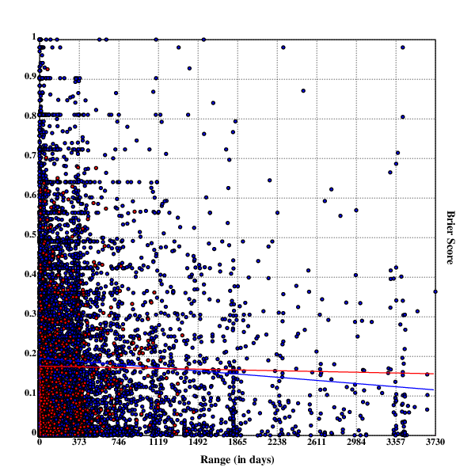

[home](./index.md)
-------------------

*author: niplav, created: 2020-03-24, modified: 2021-01-18, language: english, status: finished, importance: 6, confidence: possible*

# This post contains information that is misleading. While the calculations and description of the approach contain no mistakes in themselves, the approach is misguided. Only reference the results if you have understood the approach. This will be fixed.

> __This text looks at the accuracy of forecasts in relation
> to the time between forecast and resolution, and asks three
> questions: First; is the accuracy higher between forecasts;
> Second; is the accuracy higher between questions; Third; is the
> accuracy higher within questions? These questions are analyzed
> using data from [PredictionBook](https://predictionbook.com/) and
> [Metaculus](https://www.metaculus.com/questions/), the answers turn
> out to be no, no and yes. Possible reasons are discussed.__

Range and Forecasting Accuracy
===============================

> Above all, don’t ask what to believe—ask what to anticipate. Every
question of belief should flow from a question of anticipation, and that
question of anticipation should be the center of the inquiry. Every guess
of belief should begin by flowing to a specific guess of anticipation,
and should continue to pay rent in future anticipations. If a belief
turns deadbeat, evict it.

*– [Eliezer Yudkowsky](https://en.wikipedia.org/wiki/Eliezer_Yudkowsky), [“Making Beliefs Pay Rent (in Anticipated Experiences)“](https://www.lesswrong.com/posts/a7n8GdKiAZRX86T5A/making-beliefs-pay-rent-in-anticipated-experiences), 2007*

<!--Maybe do the same thing with range
predictions? Metric could be one described in
/usr/local/doc/unread/calibration_scoring_rules_for_practical_prediction_training_greenberg_2018.pdf-->
<!--Add paragraph on the difference in quality between the two datasets,
Metaculus better-->
<!--Also look at this guy:
https://en.wikipedia.org/wiki/J._Scott_Armstrong#Forecasting
-->
<!--https://en.wikipedia.org/wiki/Simpson's_paradox-->
<!--http://foresightr.com/2016/05/06/a-brief-history-of-forecasting-->
<!--Seems like a similar work:
https://onlinelibrary.wiley.com/doi/abs/10.1111/risa.12127-->

[Probabilistic forecasting](https://en.wikipedia.org/wiki/Probabilistic_forecasting)
that aggregates both [qualitative and quantitative
methods](https://en.wikipedia.org/wiki/Forecasting#Qualitative_vs._quantitative_methods)
is a comparatively simple idea. Basically, one needs to have only very few tools at one's
disposal to being ready to start forecasting:

* View of belief as probabilistic (perhaps with some bayesian epistemology)
* Track records (grading results of forecasts using for example brier scores or log scores)
* Probability theory (a concept of probabilities, and maybe some simple probability distributions)

Since the 1980s, forecasting has slowly but surely matured from "X is
going to happen because my intuition/divine revelation told me so" to
"my probability distribution on the outcome of this random variable
is an X distribution with the following parameters", or alternatively
"I assign a probability of X% to this event".

However, since this kind of forecasting is relatively recent, information
about the accuracy of long-range forecasting is basically non-existent:

> 1. Long-range forecasts are often stated
> too imprecisely to be judged for accuracy.
> [More](https://www.openphilanthropy.org/blog/how-feasible-long-range-forecasting#Imprecisely_stated_forecasts)
> 2. Even if a forecast is stated precisely, it might be difficult to
> find the information needed to check the forecast for accuracy.
> [More](https://www.openphilanthropy.org/blog/how-feasible-long-range-forecasting#Practically_uncheckable_forecasts)
> 3. Degrees of confidence for long-range
> forecasts are rarely quantified.
> [More](https://www.openphilanthropy.org/blog/how-feasible-long-range-forecasting#Non-quantified_degrees_of_confidence)
> 4. In most cases, no comparison to a “baseline method”
> or “null model” is possible, which makes it difficult
> to assess how easy or difficult the original forecasts were.
> [More](https://www.openphilanthropy.org/blog/how-feasible-long-range-forecasting#No_comparison_to_a_baseline_method_or_null_model_is_feasible)
> 5. Incentives for forecaster accuracy are usually unclear or weak.
> [More](https://www.openphilanthropy.org/blog/how-feasible-long-range-forecasting#Unclear_or_weak_incentives_for_accuracy)
> 6. Very few studies have been designed so as to allow confident
> inference about which factors contributed to forecasting accuracy.
> [More](https://www.openphilanthropy.org/blog/how-feasible-long-range-forecasting#Weak_strategy_for_causal_identification)
> 7. It’s difficult to know how comparable past forecasting exercises
> are to the forecasting we do for grantmaking purposes, e.g. because the
> forecasts we make are of a different type, and because the forecasting
> training and methods we use are different.
> [More](https://www.openphilanthropy.org/blog/how-feasible-long-range-forecasting#Unclear_relevance_to_our_own_long-range_forecasting)

*– [Luke Muehlhauser](http://lukemuehlhauser.com), [“How Feasible Is Long-range Forecasting?”](https://www.openphilanthropy.org/blog/how-feasible-long-range-forecasting), 2019*

<!--TODO: put in info where Metaculus and PredictionBook fit into this-->

In this text, I will try to look at the accuracy of short-term and
mid-term forecasting, which may shine some light on the relation between
the range of forecasts and their accuracy in general. The range of a
forecast is defined as the length of the timespan between the forecast
and the resolution of the forecast. Keeping with
[Muehlhauser 2019](https://www.openphilanthropy.org/blog/how-feasible-long-range-forecasting "How Feasible Is Long-range Forecasting?"),
I will define short-term forecasts as forecasts with a range of less than
a year, mid-range forecasts as forecasts with a range between 1 and 10
years, and long-term forecasts as forecasts with a range of more than 10
years (this distinction is not central to the following analysis, though).

Fortunately, for short- and mid-range forecasts, two easily accessible
sources of forecasts and their resolutions are available online: The
two forecasting websites [PredictionBook](https://predictionbook.com)
and [Metaculus](https://www.metaculus.com).

To find out about the range of forecasts, I download, parse & analyse
forecasting data from these sites using Python, and then analyze the
data using [Klong](http://t3x.org/klong/index.html).

<!--
Make a point here that making forecasts is one of the best existing
practical method of rationality verification & exercises:
https://www.lesswrong.com/s/pvim9PZJ6qHRTMqD3/p/5K7CMa6dEL7TN7sae
-->

<!--
Distinction between {probabilistic,non-probabilistic}
{model-based,intuition-based} forecasting
-->

Metaculus and PredictionBook
----------------------------

[PredictionBook](https://predictionbook.com) and
[Metaculus](https://www.metaculus.com) are both forecasting focussed
sites, though not prediction markets, but rather function on the base
of merit and track records: although you don't win money by being right,
you can still boast about it (it is an open question whether other people
will be impressed). Besides that, these sites make it easier to train ones
calibration on real-world questions and become less wrong in the process.

However, both sites differ in their approach to writing questions
and judging and scoring forecasts. PredictionBook is much older than
Metaculus: the former was first released in 2008, the latter started in 2015.
It is also much less formal than Metaculus: it doesn't require
stringent resolution criteria, making possible for everybody to judge
a question (unrelated to whether the person has even made a prediction
on the question themselves!), while Metaculus requires a short text
explaining the context and resolution criteria for a question, with
the questions being resolved by moderators or admins. This leads to
Metaculus having less questions than PredictionBook, but each question
having more predictions on it. Of the two, Metaculus is much more
featureful: It supports not only binary questions, but also range
questions with probability distributions, comment threads, closed
questions (questions that haven't yet been resolved, but that can't
be predicted on), three different kinds of scores (the
[Brier score](https://en.wikipedia.org/wiki/Brier_score),
and a [logarithmic scoring
rule](https://en.wikipedia.org/wiki/Scoring_rule#Logarithmic_scoring_rule)
for discrete and continuous forecasts each), as well as the Metaculus
prediction, a weighted aggregation of the forecasts of the best
forecasters on the site.

Another significant difference between these two websites is the amount of
data they publish: PredictionBook shows every single forecast made, while
on Metaculus one can only see the community forecast (a the time-weighted
median of the forecasts made on the question). This is relevant for this
analysis: The two approaches must be analysed separately.

Getting the Data
----------------

First of all, the data for both platforms needs to be made available in
a reasonable format. This works nicer for Metaculus, and is a bit more
difficult to achieve for PredictionBook.

The resulting data from Metaculus is [here](./data/met.csv), for
PredictionBook it's [here](./data/pb.csv).

### For Metaculus

The Metaculus data is relatively easy to obtain:
The forecasts are available on a JSON API at
`https://www.metaculus.com/api2/questions/?page=`. Fortunately,
[gimpf](https://github.com/gimpf/) has already published [a collection of
scripts](https://github.com/gimpf/metaculus-question-stats) for fetching &
analysing Metaculus data. I reused their script `fetch` to download the
raw JSON. I then converted the distinct page objects in the generated
file to a list of questions:

	$ cd /usr/local/src
	$ git clone https://github.com/gimpf/metaculus-question-stats
	$ cd metaculus-question-stats
	$ ./fetch
	$ z site
	$ jq -s '[.]|flatten' </usr/local/src/metaculus/data-questions-raw.json >data/metaculus.json

The resulting data is available [here](./data/metaculus.json).

I then wrote a python script to convert the JSON data to CSV in the form
`id,questionrange,result,probability,range`, while also filtering out
yet unresolved questions and range questions. Here, `id` is a unique
numerical ID per question, which will come in handy later, `questionrange`
is the duration between the time for creating and resolving the question,
`result` is the result of the question (either 0 or 1), `probability`
is the probability given by the predictor `$]0;1[$`, and `range` is the
duration between the forecast and the resolution.

The script is not terribly interesting: It just reads in the JSON data,
parses and traverses it, printing the CSV in the process.

Code:

	#!/usr/bin/env python3

	import json
	import time

	from time import mktime

	f=open("../../data/metaculus.json")
	jsondata=json.load(f)

	for page in jsondata:
		for question in page["results"]:
			if question["possibilities"]["type"]=="binary" and (question["resolution"]==1 or question["resolution"]==0):
				try:
					restime=time.strptime(question["resolve_time"],"%Y-%m-%dT%H:%M:%S.%fZ")
				except:
					restime=time.strptime(question["resolve_time"],"%Y-%m-%dT%H:%M:%SZ")
				try:
					createtime=time.strptime(question["created_time"],"%Y-%m-%dT%H:%M:%S.%fZ")
				except:
					createtime=time.strptime(question["created_time"],"%Y-%m-%dT%H:%M:%SZ")
				for pred in question["prediction_timeseries"]:
					timediff=mktime(restime)-pred["t"]
					qtimediff=mktime(restime)-mktime(createtime)
					print("{},{},{},{},{}".format(question["id"], qtimediff, question["resolution"], pred["community_prediction"], timediff))

The resulting CSV file contains over 40k predictions.

### For PredictionBook

As far as I know, PredictionBook doesn't publish its data
over an API. However, all individual predictions are visible
on the web, which means I had to parse the HTML itself using
[BeautifulSoup](https://en.wikipedia.org/wiki/Beautiful_Soup_(HTML_parser)).

This time the code is more complex, but just slightly so: It starts at
the [first page](https://predictionbook.com/predictions/page/1)
of predictions, and loops down to the [last
one](https://predictionbook.com/predictions/page/326), every time iterating
through the questions on that page.

It then loops through the predictions on each question and parses out
the date for the prediction and the credence.

Every question on PredictionBook has two dates related to its
resolution: the 'known on' date, for which the resolution was originally
planned, and by which the result should be known, and the 'judged on'
date, on which the resolution was actually made. I take the second date
to avoid predictions with negative differences between prediction and
resolution time.

<!--
Also, the 'known on' date has the CSS class `date created_at`, which
doesn't seem right.
TODO: submit pull request to fix this.
-->

The output of this script is in the same format as the one for Metaculus
data: `id,questionrange,result,probability,range` (although here
`probability` can also be 0 and 1, which Metaculus doesn't allow).

Code:

	#!/usr/bin/env python2

	import urllib2
	import sys
	import time

	from bs4 import BeautifulSoup
	from time import mktime

	def showforecasts(linkp, res):
		urlp="https://predictionbook.com{}".format(linkp)
		reqp=urllib2.Request(urlp, headers={"User-Agent" : "Firefox"})
		try:
			conp=urllib2.urlopen(reqp, timeout=10)
		except (urllib2.HTTPError, urllib2.URLError) as e:
			return
		datap=conp.read()
		soupp=BeautifulSoup(datap, "html.parser")

		timedata=soupp.find(lambda tag:tag.name=="p" and "Created by" in tag.text)
		resolved=timedata.find("span", class_="judgement").find("span", class_="date created_at").get("title")
		restime=time.strptime(resolved,"%Y-%m-%d %H:%M:%S UTC")
		created=timedata.find("span", class_="date").get("title")
		createtime=time.strptime(created,"%Y-%m-%d %H:%M:%S UTC")

		responses=soupp.find_all("li", class_="response")
		for r in responses:
			forecasts=r.find_all("span", class_="confidence")
			if forecasts!=[]:
				est=float(r.find_all("span", class_="confidence")[0].text.strip("%"))/100
			else:
				continue
			estimated=r.find("span", class_="date").get("title")
			esttime=time.strptime(estimated,"%Y-%m-%d %H:%M:%S UTC")
			print("{},{},{},{},{}".format(linkp.replace("/predictions/", ""), mktime(restime)-mktime(createtime), res, est, mktime(restime)-mktime(esttime)))

	for page in range(1,400):
		url="https://predictionbook.com/predictions/page/{}".format(page)
		req=urllib2.Request(url, headers={"User-Agent" : "Firefox"})
		try:
			con=urllib2.urlopen(req)
		except (urllib2.HTTPError, urllib2.URLError) as e:
			continue
		data=con.read()
		soup=BeautifulSoup(data, "html.parser")
		predright=soup.find_all("li", {"class": "prediction right"})
		predwrong=soup.find_all("li", {"class": "prediction wrong"})
		for pred in predright:
			linkp=pred.span.a.get("href")
			showforecasts(linkp, "1.0")
		for pred in predwrong:
			linkp=pred.span.a.get("href")
			showforecasts(linkp, "0.0")

Surprisingly, both platforms had almost the same amount of individual
predictions on binary resolved questions: ~48k for Metaculus, and ~44k
for PredictionBook.

Three Different Analyses: An Illustrative Example
-------------------------------------------------

In this text, I analyze the relation between accuracy and range in
forecasting, considering three different aspects:

* Between forecasts
* Between questions
* Within questions

What exactly does this mean?

Let's say there are two people: Bessie and Heloïse. They are trying
to make predictions about the weather about different time horizons
(it is currently end of August):

1. Will it rain tomorrow? (resolution: no/0)
2. Will the average temperature in August in 1 year be higher than 20°C? (resolution: no/0)

Let's say that they make the following predictions:

* Bessie: 0.3 for 1, 0.85 for 2
* Heloïse: 0.1 for 1, 0.6 for 2

Let's also say that they make their predictions in alphabetical order
of their names, one hour after another (Bessie at 00:00 and Heloïse at
01:00).

### Judging Between Forecasts

Evaluating the relation between forecasts would be as following: Each
forecast, its resolution and its timespan are independently analyzed.

We have four predictions:

1. One with a range of 23 hours, a probability of 0.1 (Heloïse's prediction on 1), and a resolution of 0
2. One with a range of 24 hours, a probability of 0.3, (Bessie's prediction on 1) and a resolution of 0
3. One with a range of `$24h/d*365d-1h=8759h$` (it's not a leap year), a probability of 0.6 (Heloïse's prediction on 2), and a resolution 0
4. One with a range of `$24h/d*365d=8760h$`, a probability of 0.85 (Bessie's prediction on 2), and a resolution 0

The Brier scores for ranges are then 0.01 for 23h, 0.09 for 24h, 0.36
for 8759h, and 0.7225 for 8760h. Here, higher range between forecasts is
correlated with worse performance.

### Judging Between Questions

Judging the performance between questions now means looking at the
forecasts made on each question and evaluating the performance
of forecasts on that question.

Question 1 has a range of 24h, and question 2 has a range of 8760h.
The Brier score for predictions on question 1 is 0.05, and the Brier
score for predictions on question 2 is 0.54125. In this case, a higher
range seems to be worse for performance on questions (Brier scores are
lower/better for question 1).

### Judging Within Questions

Within questions one examines each question separately.

On question 1, the forecast with the higher range has a Brier score of
0.09, and the forecast with the lower range has a brier score of 0.01. So
for question 1, higher range is correlated with worse performance.

For question 2, it is similar, the forecast with the higher range (8760h)
has a score of 0.7225, while the forecast with the lower range (8759h)
has a score of 0.36. Here also higher range is correlated with worse
performance.

One can now try to aggregate the findings from the two questions and
could tentatively conclude that generally range within questions is
correlated negatively with accuracy of forecasts.

----------------

These were of course only illustrative examples, but I hope that now
the different approaches in this text are clearer than before.

Accuracy Between Forecasts
--------------------------

The first approach I took was to simply take the probability and result
for each forecast, and calculate the Brier score for that one probability.
I then calculated the correlation and the linear regression between that
Brier score and the range of the forecast.

### Analysis

Now that the two datasets are available, they can be properly analyzed.

First, the raw data is loaded from the two CSV files, removing the
first line (the names of the variables, for other languages such as
R). Then the ID is converted to integer, and the rest of the fields are
converted to floats (the range is a float for some Metaculus questions,
and while the result can only take on 0 or 1, using float there makes
it easier to calculate the brier score using `mse.set`). After that,
negative ranges are removed from the dataset.

	.fc(.ic("../../data/pb.csv"));pbraw::csv.load()
	.fc(.ic("../../data/met.csv"));metraw::csv.load()

	pbdata::+flr({0<*|x};{(1:$*x),1.0:$'1_x}'1_pbraw)
	metdata::+flr({0<*|x};{(1:$*x),1.0:$'1_x}'1_metraw)

#### Why Some Negative Ranges?

This code filters out forecast ranges smaller than 0, which is necessary
because the data contains some forecasts with negative ranges. These
stem from two different sources:

In the Metaculus data, these are forecasts on questions that have resolved
retroactively. These occur in the scenario where forecasters predict on a
question where the resolution time is not clear, and the resolution occurs
before the question closes. To prevent an unfair advantage of people who
predicted while the resolution was unfolding (and therefore predicting on
an event that had happened in the past), the resolution date is set some
timespan before the resolving event (e.g. a day). However, the predictions
after the retroactive resolution are still included in the data.

Examples:

* [Will Iran execute or be targeted in a national military attack between 6 June 2019 and 5 October 2019?](https://www.metaculus.com/questions/2926/will-iran-execute-or-be-targeted-in-a-national-military-attack-between-6-june-2019-and-5-october-2019/)
* [Will EA Global San Francisco be cancelled or rescheduled due to COVID-19?](https://www.metaculus.com/questions/3756/will-ea-global-san-francisco-be-cancelled-or-rescheduled-due-to-covid-19/)

For PredictionBook, users can still predict after any resolution. The
script fetches the first resolution, making some predictions retroactive.
I could instead retrieve the result of the last resolution, but I'm not
sure it would be worth the effort, or improve the result very much.

Examples:

* [Total deaths due to coronavirus in the Netherlands will go over >5000 by the end of April.](https://predictionbook.com/predictions/198593)
* [Matt will be happy he will no longer be able to be instantly Rick rolled](https://predictionbook.com/predictions/155)

<!--TODO: try this, and report back-->

---

In the next step, I extracted the individual variables from the data
and gave them names (handling the various indices was tiresome after
a while). `ress` stands for results, `fcs` for forecasts, and `rngs`
for ranges:

	metress::metdata@2
	metfcs::metdata@3
	metrngs::metdata@4

	pbress::pbdata@2
	pbfcs::pbdata@3
	pbrngs::pbdata@4

The [Brier Score](https://en.wikipedia.org/wiki/Brier_score) is
a scoring rule for binary forecasts. It takes into account both
calibration and resolution by basically being the [mean squared
error](https://en.wikipedia.org/wiki/Mean_squared_error) of forecast
(`$f_{t}$`) and outcome (`$o_{t}$`):

	$$BS=\frac{1}{N}\sum_{t=1}^{N}(f_{t}-o_{t})^{2}$$

In Klong, it's easy to implement (and also available through
the function `mse.set`):

	brier::{mu((x-y)^2)}

Now, one can calculate the brier score for each of the forecasts and
outcomes, with the mean being unnecessary, because there is only one
datapoint for each application:

	metbriers::(metress-metfcs)^2
	pbbriers::(pbress-pbfcs)^2

### Results

First, one can check how high the range of these two datasets really is.
The PredictionBook forecasts with the highest range span 3730 days
(more than 10 years), for Metaculus it's 1387 days (nearly 4 years):

		(|/metrngs)%(24*60*60)
	1387.01877932435104
		(|/pbrngs)%(24*60*60)
	3730.00945601851852

One can now look at the correlation between range and Brier score first
for Metaculus, and then for PredictionBook:

		cor(metbriers;metrngs)
	0.0216592389375953837
		cor(pbbriers;pbrngs)
	-0.0202455558749736788

For Metaculus, the results are not very surprising: The positive
correlation tells us that the higher the range of a forecast, the lower
the accuracy (or, poetically, at Metaculus the fogs of time grow thicker
the farther you want to look into the future).

However, for PredictionBook, the opposite is true (on this dataset):
Forecasts with higher ranges give more accurate predictions, at least
on average.

However, these correlations are quite weak, 0.02 could just be random
noise. I would have to use a significance test to discern whether they
are statistically significant.

Now, one can also perform a linear regression to gauge what the relation
of range and accuracy of a forecast is. For this, I first create an x/y
set with the brier score of a forecast being in the y axis and the range
in the x axis:

	mettab::+(,metrngs),,metbriers
	pbtab::+(,pbrngs),,pbbriers

Now, a linear regression is easy:

		lreg(mettab)
	[0.000000000172708060226394773 0.167538673280194372]
		lreg(pbtab)
	[-0.000000000102929939681891687 0.16348453886964792]

These are not particularly surprising. The inferred brier score at range
0 (the forecast directly before resolution) is ~0.16, which seems a bit
pessimistic, but other than that, growth with higher ranges for metaculus
data and lower accuracy for higher ranges for predictionbook data match
the correlation. The steepness of the regression is quite low because
the ranges are in seconds.

Visualizing the forecasts with
[scatterplots](https://en.wikipedia.org/wiki/Scatter_plot) and [linear
regressions](https://en.wikipedia.org/wiki/Linear_regression) shows a
very similar picture (red dots are for Metaculus forecasts, blue dots
are for PredictionBook forecasts):

")

*Scatterplot with linear regression for Metaculus & PredictionBook forecasts by range (in days)*

The high amounts of noise are probably due to the low number of
predictions for single days (or, in the case of weeks and months, for
years/months with a high range, as not enough questions with this range
have resolved yet).

### Why Assume Accuracy will Increase?

I believe that the finding of PredictionBook is quite surprising.

A priori, one would believe that beliefs about the near future are
generally more accurate than beliefs about the far future: We can predict
the weather in 2 minutes far better than the weather in 6 months, we can
say much more about the position of a rock in an hour than in 100 years,
more about the popularity of a political party in 2 months as opposed
to 10 years. Even in reasonably chaotic systems, one should expect to
become more and more accurate the closer one comes to the expected time.

Take, for example, a [double
pendulum](https://en.wikipedia.org/wiki/Double_pendulum): I am totally
able to predict its position & velocity 100ms before resolution time,
but 1s before and it's already getting more difficult. Information,
like nearly everything else, has diminishing value, posteriors converge
continuously towards truth.

<!--TODO: Also, what are some probability theory & information theory
theorems for this?-->

### Possible Explanations

So, what is the reason for this rather weird finding? Several possible
reasons come to mind.

#### Range and Biased Questions

The most obvious solution is that the analysis above is absolute bogus and
completely meaningless: It compares [questions about global catastrophic
risks](https://www.metaculus.com/questions/2568/ragnar%25C3%25B6k-question-series-results-so-far/)
to [questions about the extinction of banana
brands](https://www.metaculus.com/questions/1558/the-rise-and-fall-of-the-banana-will-the-current-main-export-cultivar-the-cavendish-be-replaced-by-2035/),
very different kinds of questions with very different kinds of forecasts.

<!--TODO: replace these with PredictionBook questions that are that
different, since the weird result is for PredictionBook, not Metaculus-->

Here, one would assume that the longer-term questions asked are generally
easier to predict, and that the effect goes away when one compares
predictions among very similary questions (or, better, within questions).

Generally, the long-term questions we prefer asking seem to be more
menable to forecasting than short-term questions: development of
population sizes, the climate, especially the movement of interstellar
bodies is much more thoroughly modelled than the development of markets,
elections and the weather. This is of course only a weak trend, but
one that could influence the questions (as will be investigated in
[this section](#Accuracy-Between-Questions)).

##### Simpson's Paradox

[Simpson's Paradox](https://en.wikipedia.org/wiki/Simpson%27s_paradox)
is the phenomenon that while two features are correlated in a dataset,
it can be true that the features are negatively correlated for some
distinct subsets of the dataset.

It is best explained visually:

It might be the case that this analysis has come up against an instance
of Simpson's paradox: The accuracy of forecasts is negatively correlated
with range within the same question, but the accuracy of forecasts is
positively correlated with range across questions (because the kinds
of questions with longer time horizons generally allow more accurate
forecasts). Unfortunately, whether Simpson's paradox applies or not can
not always be easily judged from the scatterplot of datapoints.

#### Low Sample Sizes With High Ranges

Another question one might ask is: How big are the sample sizes at the
tails when the range is high?

This is important: low sample sizes increase noise dramatically, and
make findings much less reliable.

<!--TODO: find a way to test the statistical significance here, sometime later-->

To get a rough overview over the sample sizes, on can look at the number
of samples for each bucket. The sample sizes were calculated such that
at position i in the array `{pb,met}ss` was the sample size for week i:

	metss::_metrngs%60*60*24*7
	metss::metss@<metss
	pbss::_pbrngs%60*60*24*7
	pbss::pbss@<pbss

	maxval::|/pbss,metss
	maxlen::|/(#'=metss),#'=pbss

	pbss::{#pbss?x}'1+!maxval
	metss::{#metss?x}'1+!maxval

I generated charts for the sample sizes in
[weeks](./img/range_and_forecasting_accuracy/ss_plot.png):

	ssplot::.oc("ss_plot.eps")
	.tc(ssplot)

	setrgb(0;0;0)
	grid([0],maxlen,(maxlen:%20);[0],maxval,(maxval:%20))
	xtitle("Range (in weeks)")
	ytitle("Number of predictions")

	setrgb(0;0;1)
	segplot(metss)
	setrgb(1;0;0)
	segplot(pbss)

	draw()
	.fl()
	.cc(ssplot)

, sorted and graphed.")

*Sample sizes for predictions with a range (in weeks), sorted and graphed.*

The red graphs stands for Metaculus sample sizes, the blue graph stands
for PredictionBook sample sizes.

As one can see, the sample sizes have a drastical skew towards recent
predictions, not surprising for relatively young platforms (although 10
years for PredictionBook is sizable by internet standards, it's not that
much compared to the expected range of some predictions on the platform,
which might go into the thousands of years).

This can be seen in the data as well: The median range of metaculus and
predictionbook predictions is only a couple of months, and less than 25%
of questions have a range of more than one year:

	Q(0.25;metrngs%60*60*24*365)
		0.0937919114852302448
	Q(0.5;metrngs%60*60*24*365)
		0.34114799258678412
	Q(0.75;metrngs%60*60*24*365)
		0.917333030834854515
	Q(0.25;pbrngs%60*60*24*365)
		0.0435826674277016743
	Q(0.5;pbrngs%60*60*24*365)
		0.308100377346524606
	Q(0.75;pbrngs%60*60*24*365)
		0.977603754439370878

I hope that the dataset becomes richer the older these platforms become.

Because in the linear regression all datapoints are weighted equally,
it could very well be that a tiny bit of noise at the tails dominates
the entire regression.

Accuracy Between Questions
--------------------------

Another way to determine at the relation between forecasting accuracy
and range is to look at the range of questions and not of individual
forecasts.

In this case, this means taking the forecasts on all questions with
a given range and calculating the brier score on these forecasts.

### Determining the Range of a Question

The range of a question is determined by taking the time difference
between the opening time (the time when the first prediction on the
question could have been made) and the resolution time. One could imagine
other metrics to determine the range of a question: the mean range
for forecasts of that question, the median range for forecasts on that
question, time differences between writing/opening and closing/resolution
times of the question, and probably many more.

Here, the range of a question was set to the time difference between opening
time and resolution time. The reasons for this were threefold:

First, I had no clear idea about the time when people were making
forecasts on questions. Are most of the forecasts made just after
opening, or just before closing? Or is the distribution uniform on the
time between opening and closing? And are these distributions different
on long-range as opposed to short-range questions? Also, I was unsure
whether taking the mean time for forecasts would just be the same as
comparing forecasts directly. So taking the median or the mean of the
forecasts made was less preferable.

Second, what I cared about here was the uncertainty of questions at time
of writing, not at time of prediction. This is much better tracked by
opening time than by proxy on the forecasts.

Third, there was the question of data availability. Both Metaculus and
PredictionBook publish opening/resolution times, but PredictionBook has
no clear distinction between closing and resolution time (there is,
however, a distinction between effective resolution time and planned
resolution time ("When was the question resolved?" vs. "When should the
question have been resolved?")).

### Analysis

First, the dataset grouped by forecasts had to be grouped by the question
ID, in both cases a positive integer. The resulting datastructure should
have the structure

	[[id open-resolve-timediff [outcomes] [forecasts] [forecast-resolve-timediffs]]*]`

where the splat just indicates the inner list can be repeated. This
is achieved by first finding the grouping of forecasts by question ID,
then concatenating the ID, the question range, the list of outcomes,
the list of forecasts and the list of forecast ranges:

	metquestions::{(*x@0),(*x@1),2_x}'+'(+metdata)@=*metdata
	pbquestions::{(*x@0),(*x@1),2_x}'+'(+pbdata)@=*pbdata

Strictly speaking, the outcomes could be a single element, since for
every question there is only one well-defined outcome, but this makes
it easier to later compute the brier score.
Showcase:

		metquestions@10
	[474 497590.0 [0.0 0.0 0.0 0.0 0.0 0.0 0.0 0.0 0.0 0.0 0.0 0.0] [0.79 0.8 0.99 0.8 0.8 0.65 0.65 0.8 0.8 0.81 0.81 0.7] [249575.65223908424 249548.86438822746 245775.7940876484 242420.23024630547 230434.71577501297 230276.97260832787 230111.41609930992 229967.06126213074 216594.73318576813 207687.5192539692 177898.677213192 151590.6441845894]]
		brier@(metquestions@10)@[2 3]
	0.62095

One can now also see how many questions there are in the two datasets
(with the relatively unsurprising result that PredictionBook has much
more resolved questions):

		#metquestions
	557
		#pbquestions
	13356

The next step involves computing the Brier score for the forecasts on
each question:

	metqbrier::{(x@1),brier(x@2;x@3)}'metquestions
	pbqbrier::{(x@1),brier(x@2;x@3)}'pbquestions

`metqbrier` is a list that contains sublists, one for each question,
the sublist containing the range for the question and the brier score
for all predictions on the question (`pbqbrier` has the same structure).

### Results

Again I use linear regressions, correlation coefficients and scatter
plots to inadequately analyze the data.

For accuracy between questions, the results were pretty surprising:

		cor@+metqbrier
	-0.00994020489696282446
		cor@+pbqbrier
	-0.051808239905807497
		lreg(metqbrier)
	[-0.0000000000601753889846147087 0.175130112661923862]
		lreg(pbqbrier)
	[-0.000000000249291592263056412 0.195254764708843302]

For Metaculus, the slope off the linear regression is approximately
`$-6*10^{-11}$`, compared that with `$1*10^{-10}$` for the slope for the
linear regression between forecasts – the slope is less steep, but
also negative. For PredictionBook, the slope of the linear regression
is `$-2*10^{-10}$`, compared with `$-1*10^{-10}$` for the data between
forecasts, which is slightly steeper.

In both cases, there was a negative correlation between the brier score
and the range (to be precise, the higher the range, the lower the brier
score & the higher the accuracy). For the Metaculus data, this effect was
not as pronounced as for the PredictionBook data, though both correlations
were quite weak. The two linear regressions also showed the same effect
(lower accuracy at shorter ranges/higher accuracy at higher ranges),
but again the slope of the linear regression was not very steep.

And now: linear regressions and scatterplots!

The following are scatterplots with range on the X-axis and accuracy
(calculated using the Brier score) on the Y-axis. Again, red dots/lines
are for Metaculus data, and blue dots/lines are for PredictionBook data.

*Scatterplot with linear regression for Metaculus & PredictionBook question accuracy by range*

The general trend seems to be: questions with a higher range tend to
receive forecasts that have a higher accuracy than questions with a
lower range. In itself, this is already a fascinating finding, and might
explain some of the effect seen with accuracy between forecasts in the
[previous section](#Accuracy-Between-Forecasts)). On the other hand,
the data is still very noisy, the correlations found are quite weak,
and the slopes of the linear regressions are are very near 0.<!--TODO:
test statistical significance of these!-->

All in all, it's plausible that the relation of range and accuracy between
questions explains a large part of the the weird relation for accuracy and
range between forecasts, but I don't know enough statistics to tease these
out exactly. My intuition tells me that the effect on accuracy between
questions is too small to explain the whole anomaly between forecasts.

<!--
### Why Longer Range Questions More Accurate?

The big question now is: Why do forecasts on predictions on questions
with a higher range generally receive better Brier scores?

TODO: write something about bias here
-->

Accuracy Within Questions
-------------------------

If there exists any bias in regard to what kinds of questions get asked in
relation to their range, how can we correct for this bias?

One approach could be to compare very similar questions, such as only
questions about artificial intelligence, the cost & speed of gene
sequencing or autonomous cars, and examine the relation of range and
accuracy within these categories. This might eliminate bias resulting
from questions in different kinds of domains being easier or harder
to forecast.

Here, I take a simpler approach. I examine the relation of range and accuracy
within questions; are forecasts made on the same question later generally
more accurate than forecasts made on a question earlier?

### Analysis

<!--HERE-->

In order to do this, it seems like questions with higher numbers of
forecasts on them are are more likely to give clearer results than
questions with only a dozen or so forecasts. The Metaculus dataset
contains predictions on 557 questions, the PredictionBook dataset 13356:

		#metquestions
	557
		#pbquestions
	13356

I filtered out questions with `<100` predictions on them, resulting
in 323 questions from the Metaculus dataset and 0 (!) questions from
PredictionBook:

		wmetq::flr({100<#x@2};metquestions)
		wpbq::flr({100<#x@2};pbquestions)
		#wmetq
	323
		#wpbq
	0

This is not wholly surprising: Metaculus makes creating new questions
much harder, and more strongly encourages users to predict on existing
questions, with an elaborate tagging system for questions. PredictionBook
on the other hand simplifies the questions creation process, leaving
out moderation, complex resolution criteria etc. Still, I'm surprised
– there must be at least *one* PredictionBook question popular enough
for 100 forecasts! But apparently not.

So, what is the highest number of predictions a PredictionBook question
has gotten?

		pbl::{#x@2}'pbquestions
		pbl::pbl@<pbl
		|/pbl
	99

You got to be kidding me.

Anyway, within the usable questions with `>100` predictions, the
predictions of each question are first sorted by range (here time between
forecast and resolution) and then separated into chunks containing 50
predictions each, so that the resulting structure of `cwmetq` looks like this:

	[
		[
			[[result_array] [50_earliest_predictions] [ranges]]
			[[result_array] [50_next_predictions] [ranges]]
			…
		]
		…
	]

The code works by iterating the function `sac` over every question,
first sorting the values by range and then cutting the predictions into
chunks of size 50.

	chl::50
	sac::{t::+2_x;+'(chl*1+!(#t):%chl):_t}
	chsmetq::sac'wmetq

#### Interlude: It's Under 102

When I first ran this code, I then also wanted to check how many chunks
each question had:

		#'chsmetq
	[3 3 3 3 3 3 … 3 3 ]

The result was, to say the least, confusing – where did all those 3s
come from‽ Surely, there are questions with more than 150 forecasts
(which I knew, [this question about 2016 being the warmest year on
record](https://www.metaculus.com/questions/126/will-2016-be-the-warmest-year-on-record/)
has 765 forecasts)!

		10#{#x@3}'metquestions
	[101 101 94 60 101 61 101 101 101 68]
		|/{#x@3}'metquestions
	101

I initially suspected a bug in my code, but to my surprise, after further
investigation, it turned out that the Metaculus API returns timeseries
with elements removed so that the length was always 101.

I can think of two reasons to do this:

* Metaculus wants to prevent other entities from using the predictions to create stronger forecasting algorithms that could rival the Metaculus algorithm
* It was programmed in as a hard limit when Metaculus wasn't as big as it is now, and never changed

I mailed the support address on the site, asking for a full timeseries
on resolved binary questions.

After the support address had not responded to my inquiry, I contacted
one of the admins of the site on the Discord, but was informed that
updating the API would be too difficult to do (which is understandable,
the Metaculus developers do not exist to cater to my whims, and are doing
a phenomenal job). So, unfortunately I'll have postpone a more complete
analysis to later.

-------

Now for each chunk of size 50 we can compute the brier score and the mean
of the range, and subsequently convert the ranges from seconds to days:

	pchsmetq::{+mu(*|x),brier@2#x}'x}'chsmetq
	pchsmetq::{{((_*x):%(3600*24)),1_x}'x}'pchsmetq

The dataset then has elements like this:

		2#pchsmetq
	[[[294 0.036422] [72 0.015188] [1 0.0016]]
	[[57 0.002532] [35 0.001462] [28 0.0004]]]

Each element contains the mean range of a chunk in days and the accuracy
of the forecasts on that question within that chunk.

### Results

We can now compute the linear regression for the chunks in each question:

		2#lreg'pchsmetq
	[[0.00011329877152681667 0.0038764502832194274] [0.0000675414847161572049 -0.00123699272197962153]]

We can also visualise the linear regression for each question by setting
it to zero outside the range of the oldest and newest chunks:

	sketch::{q::x;
	setrgb(.rn();.rn();.rn());
	pltr::{:[(x>**q)|x<**|q;0;lr(x;lreg(q))]};
	plot(pltr)}
	sketch'pchsmetq

*Linear regressions for the accuracy of questions by range in chunks of size 50.*

The vertical bars are artifacts stemming from the fact that Klong
attempts to makes the discontinuous function continuous, connecting 0
and the linear regression.

Although the plot is kind of cool to look at, I'm not really sure what
it can tell us. My *guess* would be that it somewhat shows a trend
with higher ranges responding to higher Brier scores (and therefore
lower accuracy).

We can test whether this suspicion is acually correct by calculating the
average offset and the average ascension – if the ascension is positive,
our suspicion is confirmed.

		mu'+lreg'pchsmetq
	[0.00198030517003624986 0.0105472685809891273]

So it is true that accuracy within question *generally* is higher with
lower range. Everything else would have been surprising.

*Mean of linear regressions on accuracy within questions.*

<!--
Limitations
-----------

### Metaculus Dataset is Only Community Timeseries

Oh boy.
TODO:
Two different kinds of datasets
-->

Conclusion
----------

Using two datasets with both ~45k predictions, having ranges between 1 day
and 10 years (thereby containing forcasts with short and medium range)
I have investigated the relation between the accuracy of predictions
and their range (that is, the time between the prediction being made
and the result of the prediction being known).

I have found that the data indicates three facts:

1.	For predictions made on any question, the predictions made a long
	time before their resolution are generally more accurate than
	predictions made a shorter time before their resolution. This
	can be partially, but not completely explained by fact 2.
2.	Questions with a longer range (that is, time between the question
	being written and the question being resolved) generally receive
	predictions with a higher accuracy than questions with a shorter
	range.
3.	Predictions made on the same question earlier are generally less
	accurate than predictions that are made later.

These results vary strongly between Metaculus and PredictionBook, with
observations 1. and 2. much weaker or non-existent in PredictionBook data
(observation 3. only holds for Metaculus, because there are no questions
on PredictionBook with enough forecasts to run the analysis).

These results suggest what to expect with questions with even greater
range: That later predictions on them will generally be more accurate,
and that the kinds of questions asked with a very high range might have
engender prediction with an even accuracy than questions with short and
medium ranges.

However, there are plausible reasons to expect the trend from 1. and 2.
to reverse: The questions asked with very high range are not very
different from questions with medium range, and have a lot less
information available to make useful predictions on them; [butterfly
effects](https://en.wikipedia.org/wiki/Butterfly_effect) start kicking
in in systems that are relatively slow moving on human timescales (thus
easier to predict on medium timescales), but nearly completely random at
the scale of decades and/or centuries; the questions asked about longer
timescales are of a different kind and much less predictable.

<!--TODO: in 1/2/5/10 years, will the linear regression coefficients for
these datasets still be positive/negative?-->

I hope to update this analysis in the future, when data from predictions
with higher ranges has become available, and to check whether the findings
in this analysis continue to be correct.

Acknowledgements
----------------

I am grateful to Nuño Sempere for pointing out a fatal flaw in my
previous version of this analysis, which caused me to rewrite it nearly
completely.

Miscellaneous
-------------

The code for image generation can be found
[here](./code/range_and_forecasting_accuracy/draw_all.kg),
the complete code for analyzing the data can be found
[here](./code/range_and_forecasting_accuracy/load.kg).

Discussions
-----------

* [LessWrong](https://www.lesswrong.com/posts/MquvZCGWyYinsN49c/range-and-forecasting-accuracy)
