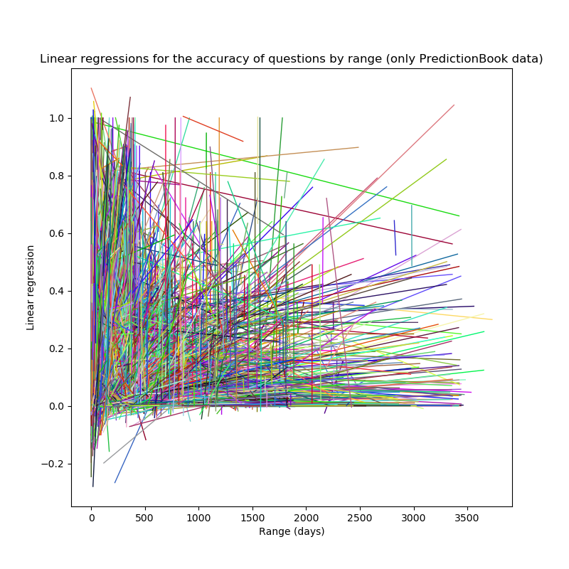
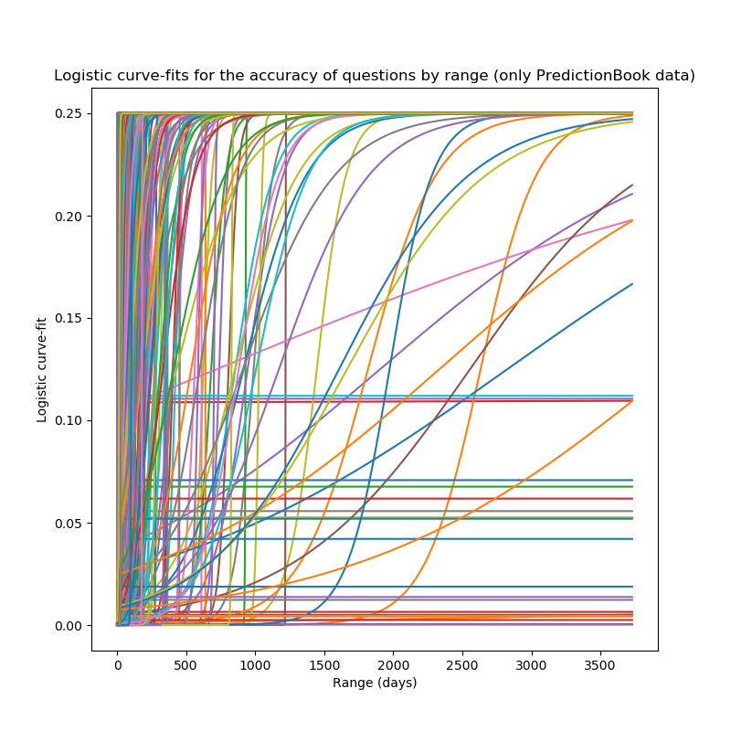

[home](./index.md)
-------------------

*author: niplav, created: 2020-03-24, modified: 2022-10-23, language: english, status: maintenance, importance: 6, confidence: possible*

> __This text looks at the accuracy of forecasts in
relation to the time between forecast and resolution, and
asks three questions: First; is the accuracy higher [between
forecasts](#Judging-Between-Forecasts); Second; is the accuracy higher
[between questions](#Judging-Between-Questions); Third; is the accuracy
higher [within questions](#Judging-Within-Questions)? These questions are
analyzed using data from [PredictionBook](https://predictionbook.com/)
and [Metaculus](https://www.metaculus.com/questions/), the answers turn
out to be yes, unclear and yes for Metaculus data; and no, no and yes
for PredictionBook data. Possible reasons are discussed. I also try to
find out how far humans can look into the future, leading to various
different results.__

Range and Forecasting Accuracy
===============================

> Above all, don’t ask what to believe—ask what to anticipate. Every
question of belief should flow from a question of anticipation, and that
question of anticipation should be the center of the inquiry. Every guess
of belief should begin by flowing to a specific guess of anticipation,
and should continue to pay rent in future anticipations. If a belief
turns deadbeat, evict it.

*— [Eliezer Yudkowsky](https://en.wikipedia.org/wiki/Eliezer_Yudkowsky), [“Making Beliefs Pay Rent (in Anticipated Experiences)“](https://www.lesswrong.com/posts/a7n8GdKiAZRX86T5A/making-beliefs-pay-rent-in-anticipated-experiences), 2007*

[Judgmental
forecasting](https://en.wikipedia.org/wiki/Forecasting#Judgmental_methods)
in which humans aggregate both [qualitative and quantitative
methods](https://en.wikipedia.org/wiki/Forecasting#Qualitative_vs._quantitative_methods)
to make predictions, and become better at doing so, is a comparatively
simple idea. Basically, one needs to have only very few tools at one's
disposal to being ready to start forecasting:

<!--TODO: give more weight to the fact that it is humans doing this-->

* View of belief as probabilistic (perhaps with some bayesian epistemology)
* Track records (grading results of forecasts using for example brier scores or log scores)
* Probability theory (a concept of probabilities, and maybe some simple probability distributions)

Since the 1980s, forecasting has slowly but surely matured from "X is
going to happen because divine revelation told me so" to "my probability
distribution on the outcome of this random variable is an X distribution
with the following parameters", or alternatively "I assign a probability
of X% to this event".

However, since this kind of forecasting is relatively recent, information
about the accuracy of long-range forecasting is basically non-existent:

> 1. Long-range forecasts are often stated
> too imprecisely to be judged for accuracy.
> [More](https://www.openphilanthropy.org/blog/how-feasible-long-range-forecasting#Imprecisely_stated_forecasts)
> 2. Even if a forecast is stated precisely, it might be difficult to
> find the information needed to check the forecast for accuracy.
> [More](https://www.openphilanthropy.org/blog/how-feasible-long-range-forecasting#Practically_uncheckable_forecasts)
> 3. Degrees of confidence for long-range
> forecasts are rarely quantified.
> [More](https://www.openphilanthropy.org/blog/how-feasible-long-range-forecasting#Non-quantified_degrees_of_confidence)
> 4. In most cases, no comparison to a “baseline method”
> or “null model” is possible, which makes it difficult
> to assess how easy or difficult the original forecasts were.
> [More](https://www.openphilanthropy.org/blog/how-feasible-long-range-forecasting#No_comparison_to_a_baseline_method_or_null_model_is_feasible)
> 5. Incentives for forecaster accuracy are usually unclear or weak.
> [More](https://www.openphilanthropy.org/blog/how-feasible-long-range-forecasting#Unclear_or_weak_incentives_for_accuracy)
> 6. Very few studies have been designed so as to allow confident
> inference about which factors contributed to forecasting accuracy.
> [More](https://www.openphilanthropy.org/blog/how-feasible-long-range-forecasting#Weak_strategy_for_causal_identification)
> 7. It’s difficult to know how comparable past forecasting exercises
> are to the forecasting we do for grantmaking purposes, e.g. because the
> forecasts we make are of a different type, and because the forecasting
> training and methods we use are different.
> [More](https://www.openphilanthropy.org/blog/how-feasible-long-range-forecasting#Unclear_relevance_to_our_own_long-range_forecasting)

*— [Luke Muehlhauser](http://lukemuehlhauser.com), [“How Feasible Is Long-range Forecasting?”](https://www.openphilanthropy.org/blog/how-feasible-long-range-forecasting), 2019*

<!--TODO: put in info where Metaculus and PredictionBook fit into this-->

In this text, I will try to look at the accuracy of short-term and
mid-term forecasting, which may shine some light on the relation between
the range of forecasts and their accuracy in general.

### Definitions

The __range__ of a forecast is defined as the length of the timespan
between the forecast and the resolution of the forecast (i.e.,
when we know the outcome of the forecast). Keeping with [Muehlhauser
2019](https://www.openphilanthropy.org/blog/how-feasible-long-range-forecasting "How Feasible Is Long-range Forecasting?"),
I define short-term forecasts as forecasts with a range of less than
a year, mid-range forecasts as forecasts with a range between 1 and 10
years, and long-term forecasts as forecasts with a range of more than 10
years (this distinction is not central to the following analysis, though).

The __horizon__ of a set of forecasts is the range at which these
forecasts are as good as chance, i.e. as random guessing. Similarly,
one can speak of the horizon of a forecaster (the range at which the
forecaster could just as well guess the predictions) and of a forecasting
platform.

-----

Fortunately, for short- and mid-range forecasts, two easily accessible
sources of forecasts and their resolutions are available online: The two
forecasting websites [PredictionBook](https://predictionbook.com) and
[Metaculus](https://www.metaculus.com), frequented mostly by hobbyists.

I am not aware of large-scale datasets with resolved long-range forecasts.

To find out about the range of forecasts, I download, parse & analyse
forecasting data from these sites, and then analyze the data with [Python
3](https://en.wikipedia.org/wiki/Python_\(programming_language\)), using
[NumPy](https://numpy.org/), [SciPy](https://scipy.org/scipylib/) and
[Matplotlib](https://matplotlib.org/).

<!--
Make a point here that making forecasts is one of the best existing
practical method of rationality verification & exercises:
https://www.lesswrong.com/s/pvim9PZJ6qHRTMqD3/p/5K7CMa6dEL7TN7sae

Not necessary, move elsewhere.
-->

<!--
Distinction between {probabilistic,non-probabilistic}
{model-based,judgmental} forecasting
-->

Related Work
-------------

Results
--------

Using two datasets with both ~45k predictions, having ranges between
1 day and 10 years (thereby containing forcasts with short and medium
range) I investigate the relation between the accuracy of predictions
and their range (that is, the time between the prediction being made
and the result of the prediction being known).

I find that the data indicates the following conclusions (if any
of the terms don't make sense, perhaps reading the [illustrative
example](#Three-Different-Analyses-An-Illustrative-Example) can help):

1.	Comparing __all forecasts on all questions__, irrespective of the
	question ([more](#Accuracy-Between-Forecasts)):
	1.	Predictions made *a long time before their resolution*
		are generally *less accurate* than predictions made
		*a shorter time before their resolution* ([more](#Results_1)).
		1. The results for PredictionBook and Metaculus disagree here. This can be partially,
			but not completely, explained by the
			fact that questions with a longer
			range receive more accurate forecasts
			([more](#This-Partially-Explains-the-Result-Between-Forecasts)).
		2.	The correlations (0.02 for Metaculus, -0.02 for
			PredictionBook) and
			[slopes](https://en.wikipedia.org/wiki/Slope)
			of the [linear
			regressions](https://en.wikipedia.org/wiki/Linear_regression)
			are close to 0.
	2.	The timespan into the future at which our forecasts
		become *approximately random* (the
		*[horizon](#The-Horizon)*) is *not easily estimated
		from the data* ([more](#This-Is-Cool)).
		1.	Fitting a logistic function
			([more](##Fitting-a-Logistic-Function)), the
			expected horizon is ~3.6 years for Metaculus
			and ~18 years for PredictionBook
		2.	Fitting an exponential function
			([more](#Fitting-an-Exponential-Function)),
			the expected horizon is ~75 days for Metaculus,
			and ~0.5 days for PredictionBook
2. Aggregating __the forecasts on each question, and then comparing the
	questions__ to one another ([more](#Accuracy-Between-Questions)):
	1.	Questions with a longer range (that is, *time between the question
		being written and the question being resolved*) generally receive
		predictions with a higher accuracy than questions with a shorter
		range ([more](#Results_2)).
		1.	Again, the correlation coefficients (-0.01 for
			Metaculus (though p>0.8), and -0.05 for
			PredictionBook) and the slopes of the linear
			regressions are close to 0.
	2.	The [horizon](#The-Horizon) is *only a few days* in this
		scenario ([more](#NonLinear-CurveFitting_1)), which [might
		make sense](#Why-Longer-Range-Questions-More-Accurate).
3.	Comparing __only predictions on the same question__, for all
	questions ([more](#Accuracy-Within-Questions)):
	1.	Predictions made *on the same question closer to
		resolution time* are generally *more accurate* than
		predictions that are made *long before resolution time*
		([more](#Aggregating-Linear-Regressions)).
	2.	The distribution of horizons is
		*long-tailed*, perhaps distributed logarithmically
		([more](#Logistic-Forecast-Horizons-for-Questions) and
		[more](#Exponential-Forecast-Horizons-for-Questions))
		1. Most expected horizons are very short (<10 days)
		2.	For logistic curve-fits, the mean horizon over
			questions is improbably high (10²³ days)
			([more](#Logistic-Forecast-Horizons-for-Questions)).
		3.	For exponential curve-fits, the mean
			horizon over questions is ~4.5 years for
			Metaculus and ~120 years for PredictionBook
			([more](#Exponential-Forecast-Horizons-for-Questions)).

<table>
<tbody>
	<tr>
		<td></td>
		<td>Logistic fit horizon (PredictionBook)</td>
		<td>Logistic fit horizon (Metaculus)</td>
		<td>Exponential fit horizon (PredictionBook)</td>
		<td>Exponential fit horizon (Metaculus)</td>
	</tr>
	<tr>
		<td>Between Forecasts</td>
		<td>18 years</td>
		<td>3.6 years</td>
		<td>75 days</td>
		<td>1 day</td>
	</tr>
	<tr>
		<td>Between Questions</td>
		<td>4.5 days</td>
		<td>1 day</td>
		<td>9 days</td>
		<td><1 day</td>
	</tr>
	<tr>
		<td>Within Questions mean</td>
		<td>1.08·10²¹ years</td>
		<td>5.28·10²⁰ years</td>
		<td>4.42 years</td>
		<td>123.4 years</td>
	</tr>
</tbody>
</table>

These results suggest what to expect with questions with even greater
range: That later predictions (closer to resolution time) on them will
generally be more accurate, and that the kinds of questions with a very
high range might engender predictions with an even higher accuracy than
questions with short and medium ranges.

However, there are plausible reasons to expect the trend from *2*.
to reverse: The questions asked with very high range are not very
different from questions with medium range, and have a lot less
information available to make useful predictions on them; [butterfly
effects](https://en.wikipedia.org/wiki/Butterfly_effect) start kicking
in in systems that are relatively slow moving on human timescales (thus
easier to predict on medium timescales), but nearly completely random at
the scale of decades and/or centuries; the questions asked about longer
timescales are of a different kind and much less predictable.

Furthermore, estimating the length of forecast horizons has returned
ambiguous results, and more research in that area is needed. It appears
plausible that horizon lengths follow a logarithmic distribution, and
over all forecasts assume values of at most several decades.

<!--TODO: in 1/2/5/10 years, will the linear regression coefficients for
these datasets still be positive/negative?-->

I hope to update this analysis in the future, when data from predictions
with higher ranges has become available, and to check whether the findings
in this analysis continue to be correct.

Three Different Analyses: An Illustrative Example
-------------------------------------------------

In this text, I analyze the relation between accuracy and range in
forecasting, considering three different aspects:

* Between forecasts
* Between questions
* Within questions

What exactly does this mean?

Let's say there are two people: Bessie and Heloïse. They are trying
to make predictions about the weather about different time horizons
(it is currently midnight):

1. Will it rain tomorrow? (resolution: no/0), which has a range of 1 day
2. Will the average temperature in a week be higher than 20°C? (resolution: no/0), which has a range of 7 days

Let's say that they make the following predictions:

* Bessie: 0.3 for 1, 0.95 for 2
* Heloïse: 0.1 for 1, 0.6 for 2

Let's also say that they make their predictions in alphabetical order
of their names, eight hours after another (Bessie at 00:00 and Heloïse at
10:00).

The following chart shows that, in this scenario, later predictions on the
same question are more accurate, and also that predictions on questions
with a shorter range are more accurate (for simplicity's sake, I don't
use a [proper scoring rule](https://en.wikipedia.org/wiki/Scoring_rule)
here to judge the accuracy of forecasts, but simply the probability
assigned to the correct outcome (here the vertical distance of the
probability to the outcome)).

, and also predictions on the question with the shorter range are more accurate.")

### Judging Between Forecasts

Evaluating the relation between forecasts would be as following: Each
forecast, its resolution and its timespan are independently analyzed.

We have four predictions:

1. One with a range of 14 hours, a probability of 0.1 (Heloïse's prediction on 1), and a resolution of 0
2. One with a range of 24 hours, a probability of 0.3, (Bessie's prediction on 1) and a resolution of 0
3. One with a range of `$24h/d \cdot 7d-10h=158h$`, a probability of 0.6 (Heloïse's prediction on 2), and a resolution 0
4. One with a range of `$24h/d \cdot 7d=168h$`, a probability of 0.95 (Bessie's prediction on 2), and a resolution 0

The Brier scores for ranges are then 0.01 for 14h, 0.09 for 24h, 0.36
for 158h, and 0.9025 for 168h. Here, higher range between forecasts is
correlated with worse performance.

In the chart above, the relation of range and accuracy between forecasts
would be the black linear regression.

### Judging Between Questions

Judging the performance between questions now means looking at the
forecasts made on each question and evaluating the performance
of forecasts on that question.

Question 1 has a range of 24h, and question 2 has a range of 168h.
The Brier score for predictions on question 1 is 0.05, and the Brier
score for predictions on question 2 is 0.63125. In this case, a higher
range seems to be worse for performance on questions (Brier scores are
lower/better for question 1).

In the chart above, the relation between range and accuracy between
questions would be the mauve line (which here turns out to be nearly
identical to the relation between range and accuracy between forecasts).

### Judging Within Questions

Within questions one examines each question separately.

On question 1, the forecast with the higher range has a Brier score of
0.09, and the forecast with the lower range has a brier score of 0.01. So
for question 1, higher range is correlated with worse performance.

For question 2, it is similar, the forecast with the higher range (168h)
has a score of 0.9025, while the forecast with the lower range (158h)
has a score of 0.36. Here also higher range is correlated with worse
performance.

One can now try to aggregate the findings from the two questions and
could tentatively conclude that generally range within questions is
correlated negatively with accuracy of forecasts.

In the chart above, the relation between range and accuracy within
questions would be the cyan and mustard linear regressions.

----------------

These were of course only illustrative examples, but I hope that now
the different approaches in this text are clearer than before.

If you're busy, you can stop reading here (or re-read [the results
section](#Results)). This is a natural place to stop reading, everything
below is certainly very interesting, but not central to understanding.

Metaculus and PredictionBook
----------------------------

[PredictionBook](https://predictionbook.com) and
[Metaculus](https://www.metaculus.com) are both forecasting websites
for hobbyists.  They are not prediction markets, but rather function
on the base of merit and track records: although you don't win money
by being right, you can still boast about it (it is an open question
whether other people will be impressed). Besides that, these sites make
it easier to train ones calibration on real-world questions and become
less wrong in the process.

However, both sites differ in their approach to writing questions
and judging and scoring forecasts. PredictionBook is much older than
Metaculus: the former was first released in 2008, the latter started in 2015.
It is also much less formal than Metaculus: it doesn't require
stringent resolution criteria, making possible for everybody to judge
a question (unrelated to whether the person has even made a prediction
on the question themselves!), while Metaculus requires a short text
explaining the context and resolution criteria for a question, with
the questions being resolved by moderators or admins. This leads to
Metaculus having fewer questions than PredictionBook, but each question
having more predictions on it. Of the two, Metaculus is much more
featureful: It supports not only binary questions, but also range
questions with probability distributions, comment threads, closed
questions (questions that haven't yet been resolved, but that can't
be predicted on), three different kinds of scores (the
[Brier score](https://en.wikipedia.org/wiki/Brier_score),
and a [logarithmic scoring
rule](https://en.wikipedia.org/wiki/Scoring_rule#Logarithmic_scoring_rule)
for discrete and continuous forecasts each), as well as the Metaculus
prediction, a weighted aggregation of the forecasts of the best
forecasters on the site.

Another significant difference between these two websites is the amount of
data they publish: PredictionBook shows every single forecast made, while
on Metaculus one can only see the community forecast (a the time-weighted
median of the forecasts made on the question). This is relevant for this
analysis: The two approaches must be analysed separately.

Getting the Data
----------------

First of all, the data for both platforms needs to be made available in
a reasonable format. This works nicer for Metaculus, and is a bit more
difficult to achieve for PredictionBook.

The resulting data from Metaculus is [here](./data/met.csv), for
PredictionBook it's available [here](./data/pb.csv).

### For Metaculus

The Metaculus data is relatively easy to obtain:
The forecasts are available on a JSON API at
`https://www.metaculus.com/api2/questions/?page=`. Fortunately,
[gimpf](https://github.com/gimpf/) has already published [a collection of
scripts](https://github.com/gimpf/Metaculus-question-stats) for fetching &
analysing Metaculus data. I reused their script `fetch` to download the
raw JSON. I then converted the distinct page objects in the generated
file to a list of questions:

	$ cd /usr/local/src
	$ git clone https://github.com/gimpf/Metaculus-question-stats
	$ cd Metaculus-question-stats
	$ ./fetch
	$ z site
	$ jq -s '[.]|flatten' </usr/local/src/Metaculus/data-questions-raw.json >data/metaculus.json

I then wrote a python script to convert the JSON data to CSV in the form
`id,questionrange,result,probability,range`, while also filtering out
yet unresolved questions and range questions. Here, `id` is a unique
numerical ID per question, which will come in handy later, `questionrange`
is the duration between the time for creating and resolving the question,
`result` is the result of the question (either 0 or 1), `probability`
is the probability given by the predictor `$]0;1[$`, and `range` is the
duration between the forecast and the resolution.

The script is not terribly interesting: It just reads in the JSON data,
parses and traverses it, printing the CSV in the process.

Code:

	#!/usr/bin/env python3

	import json
	import time

	from time import mktime

	f=open("../../data/metaculus.json")
	jsondata=json.load(f)

	for page in jsondata:
		for question in page["results"]:
			if question["possibilities"]["type"]=="binary" and (question["resolution"]==1 or question["resolution"]==0):
				try:
					restime=time.strptime(question["resolve_time"],"%Y-%m-%dT%H:%M:%S.%fZ")
				except:
					restime=time.strptime(question["resolve_time"],"%Y-%m-%dT%H:%M:%SZ")
				try:
					createtime=time.strptime(question["created_time"],"%Y-%m-%dT%H:%M:%S.%fZ")
				except:
					createtime=time.strptime(question["created_time"],"%Y-%m-%dT%H:%M:%SZ")
				for pred in question["prediction_timeseries"]:
					timediff=mktime(restime)-pred["t"]
					qtimediff=mktime(restime)-mktime(createtime)
					print("{},{},{},{},{}".format(question["id"], qtimediff, question["resolution"], pred["community_prediction"], timediff))

The resulting CSV file contains nearly 50k predictions.

### For PredictionBook

PredictionBook publishes its data over an
[API](https://github.com/bellroy/predictionbook/blob/master/API.md),
which I will use in the future to get hold of the data.

Not knowing this when I initially wrote the code, I regressed
to barbaric behavior: I knew that all individual predictions are
visible on the web, which means I had to parse the HTML itself using
[BeautifulSoup](https://en.wikipedia.org/wiki/Beautiful_Soup_(HTML_parser)).

This time the code is more complex, but just slightly so: It starts at
the [first page](https://predictionbook.com/predictions/page/1)
of predictions, and loops down to the [last
one](https://predictionbook.com/predictions/page/326), every time iterating
through the questions on that page.

It then loops through the predictions on each question and parses out
the date for the prediction and the credence.

Every question on PredictionBook has two dates related to its
resolution: the 'known on' date, for which the resolution was originally
planned, and by which the result should be known, and the 'judged on'
date, on which the resolution was actually made. I take the second date
to avoid predictions with negative differences between prediction and
resolution time.

<!--
Also, the 'known on' date has the CSS class `date created_at`, which
doesn't seem right.
TODO: submit pull request to fix this.
-->

The output of this script is in the same format as the one for Metaculus
data: `id,questionrange,result,probability,range` (although here
`probability` can also be 0 and 1, which Metaculus doesn't allow).

Code:

	#!/usr/bin/env python2

	import urllib2
	import sys
	import time

	from bs4 import BeautifulSoup
	from time import mktime

	def showforecasts(linkp, res):
		urlp="https://predictionbook.com{}".format(linkp)
		reqp=urllib2.Request(urlp, headers={"User-Agent" : "Firefox"})
		try:
			conp=urllib2.urlopen(reqp, timeout=10)
		except (urllib2.HTTPError, urllib2.URLError) as e:
			return
		datap=conp.read()
		soupp=BeautifulSoup(datap, "html.parser")

		timedata=soupp.find(lambda tag:tag.name=="p" and "Created by" in tag.text)
		resolved=timedata.find("span", class_="judgement").find("span", class_="date created_at").get("title")
		restime=time.strptime(resolved,"%Y-%m-%d %H:%M:%S UTC")
		created=timedata.find("span", class_="date").get("title")
		createtime=time.strptime(created,"%Y-%m-%d %H:%M:%S UTC")

		responses=soupp.find_all("li", class_="response")
		for r in responses:
			forecasts=r.find_all("span", class_="confidence")
			if forecasts!=[]:
				est=float(r.find_all("span", class_="confidence")[0].text.strip("%"))/100
			else:
				continue
			estimated=r.find("span", class_="date").get("title")
			esttime=time.strptime(estimated,"%Y-%m-%d %H:%M:%S UTC")
			print("{},{},{},{},{}".format(linkp.replace("/predictions/", ""), mktime(restime)-mktime(createtime), res, est, mktime(restime)-mktime(esttime)))

	for page in range(1,400):
		url="https://predictionbook.com/predictions/page/{}".format(page)
		req=urllib2.Request(url, headers={"User-Agent" : "Firefox"})
		try:
			con=urllib2.urlopen(req)
		except (urllib2.HTTPError, urllib2.URLError) as e:
			continue
		data=con.read()
		soup=BeautifulSoup(data, "html.parser")
		predright=soup.find_all("li", {"class": "prediction right"})
		predwrong=soup.find_all("li", {"class": "prediction wrong"})
		for pred in predright:
			linkp=pred.span.a.get("href")
			showforecasts(linkp, "1.0")
		for pred in predwrong:
			linkp=pred.span.a.get("href")
			showforecasts(linkp, "0.0")

Surprisingly, both platforms had almost the same amount of individual
predictions on binary resolved questions: ~48k for Metaculus, and ~44k
for PredictionBook.

Accuracy Between Forecasts
--------------------------

The first approach I took was to simply take the probability and result
for each forecast, and calculate the Brier score for that one probability.
I then calculated the [correlation](https://en.wikipedia.org/wiki/correlation_and_dependence) and the linear regression between that
Brier score and the range of the forecast.

### Analysis

Now that the two datasets are available, they can be properly analyzed.

First, the raw data is loaded from the two CSV files, removing the first
line (the names of the variables, for other languages such as R). Then
the ID is converted to integer, and the rest of the fields are converted
to floats (the range is a float for some Metaculus questions, and while
the result can only take on 0 or 1, using float there makes it easier
to calculate the brier score later). After that, npegative ranges are
removed from the dataset, and ranges are converted from seconds to days,
making them slightly easier to plot:

	import csv
	import numpy as np
	import scipy.stats as sps
	import scipy.optimize as spo

	daysec=24*60*60

	def getpreds(s):
		pfile=open(s)
		predreader=csv.reader(pfile)
		preds=[]
		for entry in predreader:
			if entry[0][0]=="#":
				continue
			else:
				preds.append([int(entry[0]), float(entry[1])/daysec, float(entry[2]), float(entry[3]), float(entry[4])/daysec])
		preds=list(filter(lambda x: x[4]>0, preds))
		return np.array(preds).T

	pb=getpreds("../../data/pb.csv")
	met=getpreds("../../data/met.csv")

#### Why Some Negative Ranges?

This code filters out forecast ranges smaller than 0, which is necessary
because the data contains some forecasts with negative ranges. These
stem from two different sources:

In the Metaculus data, these are forecasts on questions that have resolved
retroactively. These occur in the scenario where forecasters predict on a
question where the resolution time is not clear, and the resolution occurs
before the question closes. To prevent an unfair advantage of people who
predicted while the resolution was unfolding (and therefore predicting on
an event that had happened in the past), the resolution date is set some
timespan before the resolving event (e.g. a day). However, the predictions
after the retroactive resolution are still included in the data.

Examples:

* [Will Iran execute or be targeted in a national military attack between 6 June 2019 and 5 October 2019?](https://www.metaculus.com/questions/2926/will-iran-execute-or-be-targeted-in-a-national-military-attack-between-6-june-2019-and-5-october-2019/)
* [Will EA Global San Francisco be cancelled or rescheduled due to COVID-19?](https://www.metaculus.com/questions/3756/will-ea-global-san-francisco-be-cancelled-or-rescheduled-due-to-covid-19/)

For PredictionBook, users can still predict after any resolution. The
script fetches the first resolution, making some predictions retroactive.
I could instead retrieve the result of the last resolution, but I don't
think it would be worth the effort, or improve the quality of the data
very much.

Examples:

* [Total deaths due to coronavirus in the Netherlands will go over >5000 by the end of April.](https://predictionbook.com/predictions/198593)
* [Matt will be happy he will no longer be able to be instantly Rick rolled](https://predictionbook.com/predictions/155)

<!--TODO: try this, and report back-->

---

In the next step, I extract the individual variables from the data
and give them names (handling the various indices is tiresome after
a while). `ress` stands for results, `fcs` for forecasts, and `rngs`
for ranges:

	pbress=pb[2]
	pbfcs=pb[3]
	pbrngs=pb[4]

	metress=met[2]
	metfcs=met[3]
	metrngs=met[4]

The [Brier Score](https://en.wikipedia.org/wiki/Brier_score) is a
scoring rule for binary forecasts. It takes into account both the
calibration and resolution of forecasts by calculating the [mean squared
error](https://en.wikipedia.org/wiki/Mean_squared_error) of forecasts
(`$f_{t}$`) and outcomes (`$o_{t}$`):

	$$BS=\frac{1}{N}\sum_{t=1}^{N}(f_{t}-o_{t})^{2}$$

<!--TODO: isn't there some function that implements the mean squared
error in numpy‽-->

The Brier score is quite easy to implement:

	def brier(x, y):
		return np.mean((x-y)**2)

The first thing we can now do is to compare the forecasts from the
two websites, and it turns out that Metaculus forecasts are slightly
*less* good than PredictionBook forecasts:

	>>> brier(metfcs, metress)
	0.17085016230074224
	>>> brier(pbfcs, pbress)
	0.16073690328405374

But this comparison is not telling us much, since the
questions on the two websites and the strictness for
resolving questions are radically different, as explained
[here](./range_and_forecasting_accuracy.html#Limitations).

Now, one can calculate the Brier score for each of the forecasts and
outcomes, with the mean being unnecessary, because we want to examine
the score of each forecast individually:

	pbbriers=(pbfcs-pbress)**2
	metbriers=(metfcs-metress)**2

### Results

First, one can check how high the range of these two datasets really is.
The PredictionBook forecasts with the highest range span 3730 days
(more than 10 years), for Metaculus it's 1387 days (nearly 4 years):

	>>> np.max(metrngs)
	1387.018779324351
	>>> np.max(pbrngs)
	3730.0094560185184

One can now look at the correlation between range and Brier score first
for Metaculus, and then for PredictionBook:

	>>> np.corrcoef(metbriers, metrngs)
	array([[1.        , 0.02165924],
		[0.02165924, 1.        ]])
	>>> np.corrcoef(pbbriers, pbrngs)
	array([[ 1.        , -0.02030743],
		[-0.02030743,  1.        ]])

For Metaculus, the results are not very surprising: The positive
correlation tells us that the higher the range of a forecast, the lower
the accuracy (or, poetically, at Metaculus the fogs of time grow thicker
the farther you want to look into the future).

However, for PredictionBook, the opposite is true (on this dataset):
Forecasts with higher ranges give more accurate predictions, at least
on average.

However, these correlations are quite weak, 0.02 could just be random
noise. I would have to use a significance test to discern whether they
are statistically significant.

Now, one can also perform a linear regression to gauge what the relation
of range and accuracy of a forecast is:

	>>> sps.linregress(metrngs, metbriers)
	LinregressResult(slope=1.4921976403559925e-05, intercept=0.16753867328019442, rvalue=0.021659238937630332, pvalue=1.89939817752528e-06, stderr=3.1319561138899387e-06)
	>>> sps.linregress(pbrngs, pbbriers)
	LinregressResult(slope=-8.921762030379796e-06, intercept=0.16351703198845793, rvalue=-0.020307433721919746, pvalue=1.913246393632673e-05, stderr=2.0868414512480246e-06)

We can see that the `rvalue` is just the correlation, and that the
`pvalue` is pretty good (<0.00001 and <.0001 for Metaculus and
PredictionBook, respectively).

These are not particularly surprising. The inferred brier score at range
0 (the forecast directly before resolution) is ~0.16, which seems a bit
pessimistic, but other than that, growth with higher ranges for Metaculus
data and lower accuracy for higher ranges for PredictionBook data match
the correlation. The steepness of the regression is quite low because
the ranges are in days.

Visualizing the accuracies of the forecasts with a
[scatterplot](https://en.wikipedia.org/wiki/Scatter_plot) and [linear
regressions](https://en.wikipedia.org/wiki/Linear_regression) shows a
very similar picture (red dots are for Metaculus forecasts, blue dots
are for PredictionBook forecasts):

	fig=plt.figure(figsize=(8,8))
	plt.xlabel("Range (days)")
	plt.ylabel("Accuracy (Brier score)")

	plt.plot(metrngs, metbriers, '.', color='red', markersize=1)
	plt.plot(pbrngs, pbbriers, '.', color='blue', markersize=1)

	plt.savefig("allscatter.png")

")

The high amounts of noise are probably due to the low number of
predictions for single days (or, in the case of weeks and months, for
years/months with a high range, as not enough questions with this range
have resolved yet).

#### Non-Linear Curve-Fitting

<!--TODO: MSE of the fits-->

Using a linear regression on the Brier score here, however, carries
with it a deep issue: Unless the slope is 0, the linear regression will
be below 0 or above 1 for some positive range—so one can't use it to
predict forecaster performance on questions with very long ranges.

(There is also the additional issue that in non-0-slope regressions,
the linear regression might tell us that forecasters would perform *worse
than chance* at some point in the future, that is, give an expected Brier
score `>0.25`, which is not what I expect to happen, unless reality is
actively preventing us from making accurate long-term predictions).

Instead, I want to use functions that for positive values of `x` don't
produce out-of-bounds errors (they at least return valid Brier scores).

I furthermore make some additional assumptions/desiderata about the the function
`$r$` to fit to the data:

1. For `$x \ge 0$`, it returns values in `$[0, 0.25]$`
2. For `$x=0$`, it returns `$0$` (at the time of resolution, we can predict the outcome perfectly, because we already know it)
	1. It'd be technically elegant if for `$r(x)=0$` for `$x \le 0$` (since we can perfectly predict things from the past (although there's a philosophical discussion to be had here about how much we can actually know things from the past, and maybe it's even symmetric with the future)), but it's not super important
3. `$r$` is [monotonic](https://en.wikipedia.org/wiki/Monotonic_function) for `$x \ge 0$`, that is `$x_1>x_2 \Rightarrow r(x_1) \ge r(x_2)$`
	1. This is the one I'd be most willing to drop, since there might be [weird non-monotonic effects](#Why-Assume-Accuracy-will-Increase) in ability to predict.

##### Fitting a Logistic Function

The logistic function seems like an optimal candidate here: it fulfills
at least desideratum 1 (if shrunk) and 3, and with some fiddling may
even satisfy 2.

<!--TODO: link Armstrong https://www.lesswrong.com/posts/6tErqpd2tDcpiBrX9/why-sigmoids-are-so-hard-to-predict on the problem of fitting sigmoids here!-->

Because this is very different from a [logistic
regression](https://en.wikipedia.org/wiki/Logistic_regression) (scaled
values above the maximum (with a maximum of 0.25, some of the observed
Brier scores are greater), continuous values to predict), I curve-fit
explicitely using `scipy.optimize.curve_fit` (why did I only learn about
this function from scrolling through the scipy documentation‽ This
[is awesome](./notes.html#scipyoptimizecurvefit_Is_Awesome)!) with
two parameters.

(Why not do a linear regression on the log-transformed data? Because the
corresponding transformation ends up with with 0 inside a logarithm for
PredictionBook data: The inverse logistic is `$\log(\frac{1}{p}-1)$`,
and some PredictionBook Brier scores are 1).

So we instead use the following formula, which is just a squashed
logistic function that the maximum is at 0.25:

	def shrunk_logistic(x, slope, intercept):
		return 0.25*1/(1+np.exp(slope*x+intercept))

We can now fit a curve with those parameters to the data, limiting
the slope to negative values and the intercept to positive values
(we want the function to be *monotonically rising*, and we want the
[y-intercept](https://en.wikipedia.org/wiki/y-intercept) to be below
0.125, that is we want the "middle" of the logistic function to be to the
right of 0, even if we can't guarantee that the function will be ~0 for
`x=0`).

	>>> pblogifit=spo.curve_fit(shrunk_logistic, pbrngs, pbbriers, bounds=([-np.inf, 0], [0, np.inf]))
	(array([-4.78706654e-04,  1.40345975e-20]), array([[ 1.69607043e-09, -4.52668529e-07],
		[-4.52668529e-07,  4.22860649e-04]]))
	>>> metlogifit=spo.curve_fit(shrunk_logistic, metrngs, metbriers, bounds=([-np.inf, 0], [0, np.inf]))
	(array([-2.37260045e-03,  3.97380474e-19]), array([[ 7.35951274e-09, -1.08226199e-06],
		[-1.08226199e-06,  3.59766672e-04]]))

The result can be plotted:

	fig=plt.figure(figsize=(8,8))

	plt.title("Scatterplot with logistic-ish regression for Metaculus & PredictionBook forecasts by range (in days)")
	plt.xlabel("Range (days)")
	plt.ylabel("Accuracy (Brier score)")

	fullrng=np.array(range(0, round(max(pbrngs))+1))

	plt.plot(metrngs, metbriers, '.', color='red', markersize=1)
	plt.plot(fullrng, shrunk_logistic(fullrng, metlogifit[0][0], metlogifit[0][1]), 'red', label='Metaculus shrunk logistic-ish regression', linewidth=2)
	plt.plot(pbrngs, pbbriers, '.', color='blue', markersize=1)
	plt.plot(fullrng, shrunk_logistic(fullrng, pblogifit[0][0], pblogifit[0][1]), 'blue', label='PredictionBook shrunk logistic-ish regression', linewidth=2)

	plt.legend()

	plt.savefig("allscatter_logi.png")

. Both plots start at 0.125, and approach 0.25, but the Metaculus plot does so far quicker (=0.25 at ~1500 days), while the PredictionBook regression hasn't reached 0.25 by day ~4000")

I wonder whether the reason the Metaculus fit reaches the Metaculus
data so much faster is because the Metaculus data ends earlier? (Also,
yes, that is the logistic function and not a linear function for the
PredictionBook data, it's a really moderate slope).

Also, both plots start out with `$r(0)=0.125$`: not restricting the
intercept to positive values returns negative intercepts (meaning that
at 0, the value is of the logistic function is even higher than (in this
case) 0.125):

	>>> pblogifit=spo.curve_fit(shrunk_logistic, pbrngs, pbbriers, bounds=([-np.inf, -np.inf], [0, np.inf]))
	(array([-1.12830197e-14, -5.87766698e-01]), array([[ 1.32206792e-09, -4.11999218e-07],
		[-4.11999218e-07,  4.67829989e-04]]))
	>>> shrunk_logistic(0, -1.12830197e-1, -5.87766698e-01)
	0.16071313965158385
	>>> metlogifit=spo.curve_fit(shrunk_logistic, metrngs, metbriers, bounds=([-np.inf, -np.inf], [0, np.inf]))
	(array([-3.05026968e-04, -7.03162493e-01]), array([[ 3.73762741e-09, -7.74711069e-07],
		[-7.74711069e-07,  3.76596526e-04]]))
	>>> shrunk_logistic(0, -3.05026968e-04, -7.03162493e-01)
	0.1672221410619337

Here, the slopes are much steeper than in the more restricted case above.

##### Fitting an Exponential Function

<!--TODO: a is actually unnecessary, cut it out-->

Another function we could fit to the data might be of the form
`$\frac{b^x -1}{-4}$`, with some `$b \in (0, 1)$` (the function is
decaying exponentially, but flipped so that it approaches 0, and then
we scale it so that it always converges toward 0.25).

We can guarantee this function to fulfill all three desiderata:

	$$\frac{b^0 - 1}{-4}=\\
	=\frac{0}{-4}=0$$

and

	$$ \underset{x \rightarrow \infty}{\text{lim}} \frac{b^x - 1}{-4}=\\
	\frac{-1}{-4}=\\
	0.25$$

and (for `$ε \ge 0$`)

	$$ \frac{b^x - 1}{-4} \le \frac{b^{x+ε} - 1}{-4} \Leftrightarrow (\text{signflip because multiplication with }-4) \\
	b^x - 1 \ge b^{x+ε} - 1 \Leftrightarrow \\
	b^x \ge b^{x+ε} $$

which is the case.

In python, this is simply

	def shift_exp(x, b):
		return ((b**x)-1)/(-4)

We can now fit that kind of curve to the data:

	>>> pbexpfit=spo.curve_fit(shift_exp, pbrngs, pbbriers, bounds=([0], [1]))
	(array([1.22550795e-22]), array([[3.83266961e-18]]))
	>>> metexpfit=spo.curve_fit(shift_exp, metrngs, metbriers, bounds=([0], [1]))
	(array([0.95788506]), array([[6.50321645e-07]]))

. The PredictionBook exponential-ish plot looks more like a step-function, reaching 0.25 instantaneously, while the Metaculus data takes ~100 days to reach 0.25 (which is also quite quick).")

As one can see, fitting this kind of curve suggests that
the predictions become equivalent to random guesses almost
immediately for PredictionBook, and for ranges >100 days for
Metaculus. Perhaps there are some problems with [floating-point
arithmetic](https://en.wikipedia.org/wiki/floating-point_arithmetic)
at play here: the best fit *would* be at something like
`$10^{-78}$`, but `curve_fit` doesn't know how to [count that
low](https://acesounderglass.com/2021/10/20/i-dont-know-how-to-count-that-low/ "I Don’t Know How To Count That Low (Elizabeth, 2021)")?

##### This Is Cool

I believe that these findings are pretty cool: They give some
sense of how long the range of forecasts needs to be for them to be
approximately random.

We can do this by finding out at what point our function first
predicts Brier scores sufficiently close to 0.25, let's take 0.24 as an
arbitrary cutoff (which would be, on average, assigning a probability of
`$1-\sqrt{0.24} \approx 0.51$` to events that take place).

###### The Horizon

Let's call this number the __horizon__: beyond it, our forecasts
become random, we can neither steer nor see, the fogs of time have
grown too thick. From our perspective, only chaos reigns there, and
every decision-theoretic ship that sails it is never to return with
valuable information.

It is [sometimes
invoked](#Appendix-C-Quotes-About-the-Horizon-of-Forecasts)
by people when they want to talk about the inherent unknowability of
the future, always without evidence of any *actual number*.

------

Then, for the squashed logistic function, we have to find the `$x$` so that

	$$0.24=0.25 \cdot \frac{1}{1+\exp(s \cdot x + i)} \Leftrightarrow \\
	\frac{1}{0.96}-1=\exp(s \cdot x +i) \Leftrightarrow \\
	\frac{\ln(\frac{1}{0.96}-1)-i}{s}=x$$

Then, the logistic-ish forecasting horizon gives

	>>> (np.log((1/0.96)-1)-metlogifit[0][1])/metlogifit[0][0]
	1339.4812558296296
	>>> (np.log((1/0.96)-1)-pblogifit[0][1])/pblogifit[0][0]
	6638.833618277785

which is ~3.6 years for Metaculus, and ~18 years for PredictionBook.

With the exponential fit, we know that

	$$0.24=\frac{b^x -1}{-4} \Leftrightarrow \\
	-0.96=b^x -1 \Leftrightarrow \\
	-0.96+1=b^x \Leftrightarrow \\
	\log_b(0.04)=x$$

That gives

	>>> np.log(0.04)/np.log(metexpfit[0][0])
	74.80978286870999
	>>> np.log(0.04)/np.log(pbexpfit[0][0])
	0.06282811825117969

less than a day for the PredictionBook predictive horizon, and ~75 days
for the Metaculus predictive horizon.

Of course, don't believe these numbers too much: The difference in dataset
range is probably causing a lot of the difference in fit, the exponential
fit is way more pessimistic, and I haven't performed any [statistical
tests](https://en.wikipedia.org/wiki/Statistical_hypothesis_testing)
to determine how to much believe these particular numbers.

But I'm really excited about testing these conclusions with growing
datasets as forecasting platforms exist longer.

<!--TODO: do exactly that-->

Overall, I like the logistic fit *much* better than the exponential
one: in practice, we know that forecasters don't give quasi-random
predictions for questions that are further out than 100 days (or, as
the PredictionBook fit suggests, that forecasting is impossible!).

But one can also take a look at the quality of the fit to the data:
What is the mean squared error of the predicted and the actual Brier
score for the observed data?

	>>> np.mean((shrunk_logistic(pbrngs, pblogifit[0][0], pblogifit[0][1])-pbbriers)**2)
	0.05057901068476697
	>>> np.mean((shrunk_logistic(metrngs, metlogifit[0][0], metlogifit[0][1])-metbriers)**2)
	0.031372382650708616
	>>> np.mean((shift_exp(pbrngs, pbexpfit[0][0])-pbbriers)**2)
	0.058142052832572635
	>>> np.mean((shift_exp(metrngs, metexpfit[0][0])-metbriers)**2)
	0.0352617381522454

The fits agree (very slightly) with me here: in both cases the logistic
fit has a marginally smaller mean squared error in predicting the
Brier score.

### Why Assume Accuracy will Increase?

I believe that the finding for the PredictionBook data is quite
surprising.

A priori, one would believe that beliefs about the near future
are generally more accurate than beliefs about the far future: We
can predict the weather in 2 minutes far better than the weather
in 6 months, we can say much more about the position of a rock in
an hour than in 100 years, more about the popularity of a political
party in 2 months as opposed to 10 years. Even in reasonably [chaotic
systems](https://en.wikipedia.org/wiki/Chaos_theory), one should expect to
become more and more accurate the closer one comes to the expected time.

One example for this is a roulette wheel (the resolution being the number
of the slot the ball eventually rolls into): I am able to give a much
narrower probability distribution on values 100ms before the ball falls
into the slot than 1s before, and 5s before resolution my prediction is
going to be very uniform. Information, like nearly everything else, has
diminishing value, and posteriors eventually converge towards the truth.

However, there is an interesting effect that takes place with systems
that eventually reach equilibrium. Take, for example, a [double
pendulum](https://en.wikipedia.org/wiki/Double_pendulum) in an environment
with gravity: If I am at the start of the swinging of the double pendulum,
I can predict the state in 100ms better than in 1s (because it becomes
more chaotic over time), but I am also better able to predict the state
in 1h (or how long it takes to reach equilibrium) than in 1s (because
it reaches equilibrium in hanging straight down).

(I got this observation from “The World as
Holocaust” by Stanisław Lem, though it is obvious [in
hindsight](https://www.lesswrong.com/s/zpCiuR4T343j9WkcK/p/WnheMGAka4fL99eae "Hindsight Devalues Science")).

<!--TODO: Also, what are some probability theory & information theory
theorems for this?-->

### Possible Explanations

So, what is the reason for this rather weird finding? Several possible
reasons come to mind.

#### Range and Biased Questions

The most obvious solution is that the analysis above is absolute bogus and
completely meaningless: It compares [questions about global catastrophic
risks](https://www.metaculus.com/questions/2568/ragnar%25C3%25B6k-question-series-results-so-far/)
to [questions about the extinction of banana
brands](https://www.metaculus.com/questions/1558/the-rise-and-fall-of-the-banana-will-the-current-main-export-cultivar-the-cavendish-be-replaced-by-2035/),
very different kinds of questions with very different kinds of forecasts.

<!--TODO: replace these with PredictionBook questions that are that
different, since the weird result is for PredictionBook, not Metaculus-->

Here, one would assume that the longer-term questions asked are generally
easier to predict, and that the effect goes away when one compares
predictions among very similary questions (or, better, within questions).

Generally, the long-term questions we prefer asking seem to be more
menable to forecasting than short-term questions: development of
population sizes, the climate, especially the movement of interstellar
bodies is much more thoroughly modelled than the development of markets,
elections and the weather. This is of course only a weak trend, but
one that could influence the questions (as will be investigated in
[this section](#Accuracy-Between-Questions)).

##### Simpson's Paradox

[Simpson's Paradox](https://en.wikipedia.org/wiki/Simpson%27s_paradox)
is the phenomenon that while two features are correlated in a dataset,
it can be true that the features are negatively correlated for some
distinct subsets of the dataset.

It is best explained visually:

It might be the case that this analysis for PredictionBook data has come
up against an instance of Simpson's paradox: The accuracy of forecasts
is negatively correlated with range within the same question, but the
accuracy of forecasts is positively correlated with range across questions
(because the kinds of questions with longer time horizons generally allow
more accurate forecasts). Unfortunately, whether Simpson's paradox applies
or not can not always be easily judged from the scatterplot of datapoints.

However, [below](#Results_2) I check the correlation of range and
forecast accuracy between questions, and find that they are negatively
correlated, and furthermore find that they are *positively* [related
within questions](#Aggregating-Linear-Regressions), which strongly
indicates that the effect probably comes from questions with a long
range receiving more accurate predictions (in the PredictionBook dataset).

<!--TODO: scatterplot for forecasts for Predictionbook, different forecasts have different colors-->

#### Low Sample Sizes With High Ranges

Another question one might ask is: How big are the sample sizes at the
tails when the range is high?

This is important: low sample sizes increase noise dramatically, and
make findings much less reliable.

To get a rough overview over the sample sizes, on can look at the number
of samples for each bucket. The sample sizes were calculated such that
at position `i` in the array `{pb,met}ss` was the sample size for week `i`:

	metss=np.bincount(np.sort(np.floor(metrngs/30)).astype(int))
	pbss=np.bincount(np.sort(np.floor(pbrngs/30)).astype(int))

I generated charts for the sample sizes in days:

	fig=plt.figure(figsize=(8,8), clear=True)
	plt.xlabel("Range (months)")
	plt.ylabel("Number of datapoints)")

	plt.plot(metss, '-', color='red')
	plt.plot(pbss, '-', color='blue')

	plt.savefig("ss_plot.png")

, sorted and graphed.")

The red graphs stands for Metaculus sample sizes, the blue graph stands
for PredictionBook sample sizes.

As one can see, the sample sizes have a drastical skew towards recent
predictions, not surprising for relatively young platforms (although 10
years for PredictionBook is sizable by internet standards, it's not that
much compared to the expected range of some predictions on the platform,
which might go into the thousands of years).

This can be seen in the data as well: The median range of Metaculus and
PredictionBook predictions is only a couple of months, and less than 25%
of questions have a range of more than one year:

	>>> np.quantile(metrngs/365, 0.25)
	0.0938035443856715
	>>> np.quantile(metrngs/365, 0.5)
	0.3411479925867841
	>>> np.quantile(metrngs/365, 0.75)
	0.9173088057010588
	>>> np.quantile(pbrngs/365, 0.25)
	0.04357030060882801
	>>> np.quantile(pbrngs/365, 0.5)
	0.3080797501268392
	>>> np.quantile(pbrngs/365, 0.75)
	0.9775999492643329

##### Statistical Significance of Truncated Datasets

Moved to [Appendix B](#Appendix_B_Statistical_Significance_of_Truncated_Datasets).

----

I hope that the dataset becomes richer the older these platforms become.

Because in the linear regression all datapoints are weighted equally,
it could very well be that a tiny bit of noise at the tails dominates
the entire regression.

Accuracy Between Questions
--------------------------

Another way to determine at the relation between forecasting accuracy
and range is to look at the range of questions and not of individual
forecasts.

In this case, this means taking the forecasts on all questions with
a given range and calculating the brier score on these forecasts.

### Determining the Range of a Question

The range of a question is determined by taking the time difference
between the opening time (the time when the first prediction on the
question could have been made) and the resolution time. One could imagine
other metrics to determine the range of a question: the mean range
for forecasts of that question, the median range for forecasts on that
question, time differences between writing/opening and closing/resolution
times of the question, and probably many more.

Here, the range of a question was set to the time difference between opening
time and resolution time. The reasons for this were threefold:

First, I had no clear idea about the time when people were making
forecasts on questions. Are most of the forecasts made just after
opening, or just before closing? Or is the distribution uniform on the
time between opening and closing? And are these distributions different
on long-range as opposed to short-range questions? Also, I was unsure
whether taking the mean time for forecasts would just be the same as
comparing forecasts directly. So taking the median or the mean of the
forecasts made was less preferable.

Second, what I cared about here was the uncertainty of questions at time
of writing, not at time of prediction. This is much better tracked by
opening time than by proxy on the forecasts.

Third, there was the question of data availability. Both Metaculus and
PredictionBook publish opening/resolution times, but PredictionBook has
no clear distinction between closing and resolution time (there is,
however, a distinction between effective resolution time and planned
resolution time ("When was the question resolved?" vs. "When should the
question have been resolved?")).

### Analysis

First, the dataset grouped by forecasts had to be grouped by the question
ID, in both cases a positive integer. The resulting datastructure should
have the structure

	[[id, open-resolve-timediff, [outcomes], [forecasts], [forecast-resolve-timediffs]]*]

where the splat just indicates the inner list can be repeated. This
is achieved by first finding the grouping of forecasts by question ID,
then concatenating the ID, the question range, the list of outcomes,
the list of forecasts and the list of forecast ranges:

	def group(d):
		a=[]
		for e in np.unique(d[0]):
			indices=np.where(d[0]==e)
			a.append([e, d[1][indices[0][0]], d[2][indices], d[3][indices], d[4][indices]])
		return a

	metquestions=group(met)
	pbquestions=group(pb)

Strictly speaking, the outcomes could be a single element, since for
every question there is only one well-defined outcome, but this makes
it easier to later compute the brier score.

Showcase:

	>>> metquestions[10]
	[13.0, 119.99914351851852, array([0., 0., 0., 0., 0., 0., 0., 0., 0., 0., 0., 0., 0., 0., 0., 0., 0.]), array([0.2 , 0.4 , 0.2 , 0.3 , 0.15, 0.3 , 0.4 , 0.4 , 0.4 , 0.4 , 0.45,
		  0.4 , 0.44, 0.4 , 0.44, 0.4 , 0.38]), array([119.94258413, 118.91094545, 118.71650504, 115.99830505,
		  113.03583134,  89.66780818,  87.76008922,  87.12385685,
		  85.12093715,  85.08304395,  83.7246415 ,  83.19617587,
		  82.69982874,  73.11635207,  71.99461814,  71.21645502,
		  64.07551593])]
	>>> brier(metquestions[10][3],metquestions[10][2])
	0.13509411764705884

One can now also see how many questions there are in the two datasets
(with the relatively unsurprising result that PredictionBook has much
more resolved questions):

	>>> len(metquestions)
	557
	>>> len(pbquestions)
	13356

The next step involves computing the Brier score for the forecasts on
each question:

	>>> metqbrier=np.array([[i[1], brier(i[3], i[2])] for i in metquestions])
	>>> pbqbrier=np.array([[i[1], brier(i[3], i[2])] for i in pbquestions])

`metqbrier` is a list that contains sublists, one for each question,
the sublist containing the range for the question and the brier score
for all predictions on the question (`pbqbrier` has the same structure).

### Results

Again I use linear regressions, correlation coefficients and scatter
plots to inadequately analyze the data.

For accuracy between questions, the results were pretty surprising:

	>>> np.corrcoef(metqbrier.T)
	array([[ 1.       , -0.0099402],
		[-0.0099402,  1.       ]])
	>>> np.corrcoef(pbqbrier.T)
	array([[ 1.        , -0.05180824],
		[-0.05180824,  1.        ]])
	>>> sps.linregress(metqbrier.T[0], metqbrier.T[1])
	LinregressResult(slope=-5.199153608270726e-06, intercept=0.1751301126619239, rvalue=-0.009940204896962441, pvalue=0.8149259597777081, stderr=2.2200837795403376e-05)
	>>> sps.linregress(pbqbrier.T[0], pbqbrier.T[1])
	LinregressResult(slope=-2.1538793571528e-05, intercept=0.1952547647088438, rvalue=-0.05180823990580795, pvalue=2.0875245782500886e-09, stderr=3.5928014948058268e-06)

For Metaculus, the slope off the linear regression is approximately
`$-5 \cdot 10^{-6}$`, compared that with `$1 \cdot 10^{-5}$` for the
slope for the linear regression between forecasts—the slope is less
steep, but also negative. For PredictionBook, the slope of the linear
regression is `$-2 \cdot 10^{-5}$`, compared with `$-8 \cdot 10^{-6}$`
for the data between forecasts, which is slightly steeper.

However, look at the p-value for the Metaculus correlation/linear
regression! 0.8! So that number is basically worthless.

In both cases, there is a small negative correlation between the brier
score and the range (to be precise, the larger the range, the lower
the brier score/the higher the accuracy). For the Metaculus data, this
effect is not as pronounced as for the PredictionBook data, though both
correlations are quite weak. The two linear regressions also show the
same effect (lower accuracy at shorter ranges/higher accuracy at higher
ranges), but again the slope of the linear regression is not very steep.

And now: linear regressions and scatterplots!

The following are scatterplots with range on the X-axis and accuracy
(calculated using the Brier score) on the Y-axis. Again, red dots/lines
are for Metaculus data (twice as big as PredictionBook data points,
to make them visible in the sea of blue), and blue dots/lines are for
PredictionBook data.

	fig=plt.figure(figsize=(8,8))
	plt.xlabel("Range (days)")
	plt.ylabel("Accuracy (Brier score)")

	plt.plot(pbqbrier.T[0], pbqbrier.T[1], '.', color='blue', markersize=1)
	plt.plot(pbqbrier.T[0], pbqintercept+pbqslope*pbqbrier.T[0], 'blue', label='PredictionBook linear regression', linewidth=1)
	plt.plot(metqbrier.T[0], metqbrier.T[1], '.', color='red', markersize=2)
	plt.plot(pbqbrier.T[0], mqintercept+mqslope*pbqbrier.T[0], 'red', label='Metaculus linear regression', linewidth=1)

	plt.legend()

	plt.savefig("allq.png")

The general trend seems to be: questions with a higher range tend to
receive forecasts that have a higher accuracy than questions with a
lower range. In itself, this is already a fascinating finding, and might
explain some of the effect seen with accuracy between forecasts in the
[previous section](#Accuracy-Between-Forecasts)). On the other hand,
the data is still very noisy, the correlations found are quite weak,
and the slopes of the linear regressions are are very near 0.

All in all, it's plausible that the relation of range and accuracy between
questions explains a large part of the the weird relation for accuracy and
range between forecasts, but I don't know enough statistics to tease these
out exactly. My intuition tells me that the effect on accuracy between
questions is too small to explain the whole anomaly between forecasts.

#### Non-Linear Curve-Fitting

Again, one can fit the nonlinear exponential/logistic function defined
[above](#NonLinear-CurveFitting) to the data between questions.

	>>> pblogifit_betweenq=spo.curve_fit(shrunk_logistic, pbqbrier.T[0], pbqbrier.T[1], bounds=([-np.inf, 0], [0, np.inf]))
	(array([-2.70329933e+00,  5.32716622e-52]), array([[ 0.16764075, -0.01981014],
		[-0.01981014,  0.00898443]]))
	>>> metlogifit_betweenq=spo.curve_fit(shrunk_logistic, metqbrier.T[0], metqbrier.T[1], bounds=([-np.inf, 0], [0, np.inf]))
	(array([-7.92206883, 33.48197   ]), array([[ 199420.41507448, -811407.37948018],
		[-811407.37948018, 3301492.9741521 ]]))
	>>> pbexpfit_betweenq=spo.curve_fit(shift_exp, pbqbrier.T[0], pbqbrier.T[1], bounds=([-np.inf, 0], [0, 1]))
	(array([4.77613047e-20]), array([[5.82829061e-18]]))
	>>> metexpfit_betweenq=spo.curve_fit(shift_exp, metqbrier.T[0], metqbrier.T[1], bounds=([-np.inf, 0], [0, 1]))
	(array([0.70814538]), array([[0.01386776]]))

But these numbers don't tell us much by themselves, do they become
clearer when plotted?

	fig=plt.figure(figsize=(8,8))

	plt.title("Scatterplot with logistic-ish regression for Metaculus & PredictionBook forecasts by range")
	plt.xlabel("Range (days)")
	plt.ylabel("Accuracy (Brier score)")

	fullrng=np.array(range(0, round(max(pbrngs))+1))

	plt.plot(pbqbrier.T[0], pbqbrier.T[1], '.', color='blue', markersize=1)
	plt.plot(metqbrier.T[0], metqbrier.T[1], '.', color='red', markersize=2)
	plt.plot(fullrng, shrunk_logistic(fullrng, metlogifit_betweenq[0][0], metlogifit_betweenq[0][1]), 'red', label='Metaculus shrunk logistic-ish regression', linewidth=2)
	plt.plot(fullrng, shrunk_logistic(fullrng, pblogifit_betweenq[0][0], pblogifit_betweenq[0][1]), 'blue', label='PredictionBook shrunk logistic-ish regression', linewidth=2)

	plt.legend()

	plt.savefig("allq_logi.png")

	fig=plt.figure(figsize=(8,8))

Not—quite?

(The Metaculus regression is not visibile because it lies *just* under
the PredictionBook regression, the short red line in the logistic plot
is the Metaculus regression that starts at 0, while the PredictionBook
regression starts at 0.125).

Basically, the regressions here conclude that the best is that
predictions on questions with any time horizons longer than a couple of
days are indistinguishable from randomness, given the assumptions made
[here](#NonLinear-CurveFitting).

This *actually makes sense*: We observe that the correlation between
range and accuracy is positive, so the best curve that fits the data
under the assumption of falling accuracy with higher range will conclude
that we're immediately in a domain with uniform randomness.

The predictive horizons here are

	>>> (np.log(1/(0.96)-1)-metlogifit_betweenq[0][1])/metlogifit_betweenq[0][0]
	4.627582089426849
	>>> (np.log(1/(0.96)-1)-pblogifit_betweenq[0][1])/pblogifit_betweenq[0][0]
	1.1756203958314926

~4.5 days for Metaculus, and around a day for PredictionBook with logistic
functions, and

	>>> np.log(0.04)/np.log(metexpfit_betweenq[0][0])
	9.327212826230811
	>>> np.log(0.04)/np.log(pbexpfit_betweenq[0][0])
	0.07235368359483728

similarly short timespans for the exponential fit.

And, comparing the quality (mean squared error) of the nonlinear fits to
one another reveals that the two methods are remarkably similar at fitting
the data (which is not surprising, since they look nearly identical):

	>>> np.mean((shrunk_logistic(pbqbrier.T[0], pblogifit_betweenq[0][0], pblogifit_betweenq[0][1])-pbqbrier.T[1])**2)
	0.04466653583438647
	>>> np.mean((shrunk_logistic(metqbrier.T[0], metlogifit_betweenq[0][0], metlogifit_betweenq[0][1])-metqbrier.T[1])**2)
	0.029639024718816995
	>>> np.mean((shift_exp(pbqbrier.T[0], pbexpfit_betweenq[0][0])-pbqbrier.T[1])**2)
	0.0466620438028492
	>>> np.mean((shift_exp(metqbrier.T[0], metexpfit_betweenq[0][0])-metqbrier.T[1])**2)
	0.029795384871374987

#### Why Longer Range Questions More Accurate?

The big question now is: Why do forecasts on predictions on questions
with a higher range generally receive better Brier scores?

First, it's important to consider the p-value for the correlation with
the Metaculus data. It's 80% likely we would have had the same result,
given that the correlation was 0: not solid foundation to base further
understanding on. But we got the same result with the PredictionBook data,
with a very decent p-value, so what is going on?

The explanation falls back to the considerations in [the section on
range and biased questions](#Range-and-Biased-Questions): the long-range
questions we might be asking could be "easier" to predict, at least in
the medium term, than the short-range questions.

How could one test this? Metaculus contains categories for questions,
and one might want to examine whether the negative trend between
question range and accuracy of predictions on that question still hold
when questions in the same category are examined (although one might run
into problems with the dataset size here—even the 557 questions in the
dataset aren't enough to provide a decent p-value). Unfortunately, no
such categorization system exists for PredictionBook, one *might* try to
analyze the titles of the questions, but it doesn't seem worth the effort.

<!--TODO: maybe implement the analysis described above?-->

#### This Partially Explains the Result Between Forecasts

For PredictionBook data, this explains why range and forecast
accuracy were negatively correlated between forecasts:
the negative correlation between range and accuracy between
questions [confounds](https://en.wikipedia.org/wiki/Confounding) the
relationship. We can test whether this is true by looking at the relation
of range and accuracy within questions, where two forecasts at the same
time are in some sense "equally difficult".

Accuracy Within Questions
-------------------------

If there exists any bias in regard to what kinds of questions get asked in
relation to their range, how can we correct for this bias?

One approach could be to compare very similar questions, such as only
questions about artificial intelligence, the cost & speed of gene
sequencing or autonomous cars, and examine the relation of range and
accuracy within these categories. This might eliminate bias resulting
from questions in different kinds of domains being easier or harder
to forecast.

Here, I take a simpler approach. I examine the relation of range and accuracy
within questions; are forecasts made on the same question later generally
more accurate than forecasts made on a question earlier?

### Analysis

<!--TODO: how about excluding regressions that have a p-value below a
certain cutoff-value?-->

In order to do this, one can compute the Brier score for each prediction,
and then perform one linear regression/compute the correlation per
question to discern whether the relation is positive or not.

With `metquestions` and `pbquestions`, we already have the necessary
data available to perform the analysis.

We can create a list of the form `[[[brier_scores],[ranges]]*]`:

	wmetqbrier=[[i[4], (i[3]-i[2])**2] for i in metquestions]
	wpbqbrier=[[i[4], (i[3]-i[2])**2] for i in pbquestions]

Since `lreg` can't deal with datasets of size 1, we have to filter
those out of the dataset (the Metaculus dataset doesn't contain these,
but I want to prepare for a possible future dataset where it does),
and they don't make much sense in our analysis anyway:

	wmetqbrier=list(filter(lambda x: len(x[0])>1, wmetqbrier))
	wpbqbrier=list(filter(lambda x: len(x[0])>1, wpbqbrier))

One can play around and calculate the correlation between range and
accuracy for some questions:

	>>> list(map(np.corrcoef, wmetqbrier[:4]))
	[array([[1.        , 0.53853205],
		[0.53853205, 1.        ]]),
	  array[[1.       , 0.6569835],
		[0.6569835, 1.       ]]),
	  array([[1.        , 0.05048498],
		[0.05048498, 1.        ]]),
	  array([[1.        , 0.28412936],
		[0.28412936, 1.        ]])]
	>>> list(map(np.corrcoef, wpbqbrier[:4]))
	[array([[1.        , 0.52609801],
		[0.52609801, 1.        ]]),
	  array([[1.        , 0.89254317],
		[0.89254317, 1.        ]]),
	  array([[ 1.        , -0.39887059],
		[-0.39887059,  1.        ]]),
	  array([[ 1., -1.],
		[-1.,  1.]])]

The perfect negative correlation come from the fact that some of the
questions in the dataset have only two predictions, which all by chance
anti-correlate with the range. This is not the case for all questions,
as one can see.

<!--TODO: examine the correlations here, & define metqcorrs!-->

For the linear regression, one can simply map `sps.linregress` over
the lists:

	>>> wmetqregs=list(map(lambda x: sps.linregress(x[0], x[1]), wmetqbrier))
	>>> wpbqregs=list(map(lambda x: sps.linregress(x[0], x[1]), wpbqbrier))
	/usr/local/lib/python3.8/dist-packages/scipy/stats/_stats_mstats_common.py:130: RuntimeWarning: invalid value encountered in double_scalars
	slope = r_num / ssxm

The result for `wpbqbrier` is unexpected. The culprits turn out to be
a set of questions on which the same prediction has been made, twice,
at the exact same second, which confuses the linear regression algorithm:

	>>> list(filter(lambda x: x[0][0]==x[0][1] and len(x[0]==2) and x[1][0]==x[1][1] and len(x[1])==2, wpbqbrier))
	[[array([367.09616898, 367.09616898]), array([0.2025, 0.2025])], [array([367.09637731, 367.09637731]), array([0.2025, 0.2025])], [array([367.09899306, 367.09899306]), array([0.0225, 0.0225])], [array([367.09908565, 367.09908565]), array([0.25, 0.25])], [array([367.09936343, 367.09936343]), array([0.16, 0.16])], [array([367.10018519, 367.10018519]), array([0.0225, 0.0225])], [array([0.25236111, 0.25236111]), array([0.0025, 0.0025])], [array([0.36797454, 0.36797454]), array([0.25, 0.25])], [array([0.25259259, 0.25259259]), array([0.0625, 0.0625])], [array([0.36671296, 0.36671296]), array([0.04, 0.04])], [array([0.40542824, 0.40542824]), array([0.09, 0.09])]]

However, they can be filtered out pretty easily, and we recompute `wpbqregs`:

	>>> wpbqbrier=list(filter(lambda x: not (x[0][0]==x[0][1] and len(x[0]==2) and x[1][0]==x[1][1] and len(x[1])==2), wpbqbrier))
	>>> len(wpbqbrier)
	7596
	>>> wpbqregs=list(map(lambda x: sps.linregress(x[0], x[1]), wpbqbrier))

### Results

Again, the results are split in three parts: linear regression,
logistic curve-fit and exponential curve-fit.

#### Linear Regression

We can now visualise the linear regression for each question by setting
plotting all linear regressions with random colors (the horizontal length
of the linear regression indicates the time between the first prediction
and the last prediction on the question: a question that was opened three
years ago, closed two years ago, and resolves now appears on the X-axis
between 730 and 1095):

	fig=plt.figure(figsize=(8,8))
	plt.xlabel("Range (days)")
	plt.ylabel("Linear regression")

	for i in range(0, len(wmetqregs)):
	        r=wmetqregs[i]
	        rngs=wmetqbrier[i][0]
	        slope, intercept, _, _, _=r
	        cl=hex(random.sample(range(0, 256*256*256), 1)[0]) #random rgb code
	        #left padding with zeros, can't be bothered to read the formatting docs right now
	        cl='#'+('0'*(6-len(cl[2:])))+cl[2:]
	        plt.plot(rngs, intercept+slope*rngs, color=cl, linewidth=1)

	plt.savefig("permetquestion.png")

Basically the same code for image generation is used also for the
PredictionBook data:

Although the plots are kind of cool to look at, I'm not really sure what
they can tell us. My *guess* would be that it somewhat shows a trend
with higher ranges responding to higher Brier scores (and therefore
lower accuracy).

##### Aggregating Linear Regressions

We can test whether this suspicion is acually correct by calculating
the average offset and the average ascension—if the ascension
is positive, our suspicion is confirmed. We have to weight
questions by how many predictions they have received, otherwise
the result is skewed by questions with very few predictions (if
you're trying to find out whether, in basketball, making more [free
throws](https://en.wikipedia.org/wiki/Free_throw) makes you better at it,
you'd also want to more strongly weight data from players with a larger
number of shots).

This is done by computing the linear regression for range/accuracy for
each question (we did that with `w{met,pb}qregs`), multiplying it by the
number of predictions on that question, adding up the linear regressions,
and then dividing the result by the total number of predictions in the
dataset (`clean_{met,pb}forecasts`):

	>>> clean_metforecasts=np.sum([len(wmetqbrier[i][0]) for i in range(0, len(wmetqbrier))])
	>>> awmetqslope=np.sum([len(wmetqbrier[i][0])*wmetqregs[i][0] for i in range(0, len(wmetqregs))])/clean_metforecasts
	0.003048078896358434
	>>> awmetqintercept=np.sum([len(wmetqbrier[i][0])*wmetqregs[i][1] for i in range(0, len(wmetqregs))])/clean_metforecasts
	0.0388493550172143
	>>> clean_pbforecasts=np.sum([len(wpbqbrier[i][0]) for i in range(0, len(wpbqbrier))])
	>>> awpbqslope=np.sum([len(wpbqbrier[i][0])*wpbqregs[i][0] for i in range(0, len(wpbqregs))])/clean_pbforecasts
	1.3731897568280482
	>>> awpbqintercept=np.sum([len(wpbqbrier[i][0])*wpbqregs[i][1] for i in range(0, len(wpbqregs))])/clean_pbforecasts
	-98.59072648628822

The PredictionBook data—how do I put this—simply makes no sense.
I am pretty confident that this code *is* correct, but I think that
the questions with very few prdictions are producing incorrect results,
especially when the predictions are very close to each other. So let's
arbitrarily exclude questions with less than ten predictions (actually
an arbitrary choice I did not iterate over to get a "desired" result):

	>>> fwpbqbrier=list(filter(lambda x: len(x[0])>=10, wpbqbrier))
	>>> len(fwpbqbrier)
	849
	>>> # Recomputing linear regressions
	>>> clean_fpbforecasts=np.sum([len(fwpbqbrier[i][0]) for i in range(0, len(fwpbqbrier))])
	12865
	>>> fwpbqregs=list(map(lambda x: sps.linregress(x[0], x[1]), fwpbqbrier))
	>>> fawpbqslope=np.sum([len(fwpbqbrier[i][0])*fwpbqregs[i][0] for i in range(0, len(fwpbqregs))])/clean_fpbforecasts
	0.0024623252612491924
	>>> fawpbqintercept=np.sum([len(fwpbqbrier[i][0])*fwpbqregs[i][1] for i in range(0, len(fwpbqregs))])/clean_fpbforecasts
	0.00030707364984746446

This looks much better.

So it is true that accuracy within question *generally* is higher
with lower range for Metaculus data, and similar for PredictionBook
data. Everything else would have been surprising.

	fig=plt.figure(figsize=(8,8))

	plt.title("Mean of linear regressions on accuracy within questions (red is Metaculus data, blue is PredictionBook data)")
	plt.xlabel("Range (days)")
	plt.ylabel("Accuracy (Brier score)")

	plt.plot(pbrngs, awmetqintercept+awmetqslope*pbrngs, 'red', label='Metaculus aggregate linear regression', linewidth=1)
	plt.plot(pbrngs, fawpbqintercept+fawpbqslope*pbrngs, 'blue', label='PredictionBook aggregate linear regression', linewidth=1)

	plt.legend()

	plt.savefig("withintotal.png")

This chart, however, shows that the result is not as clean as one might
hope: both linear regressions are very steep, predicting Brier scores
of \>1 for ranges of more than a year, which is clearly nonsensical.

This probably results from the probabilities being treated linearly,
while handling them in logspace would be much more appropriate.

#### Logistic Curve-Fit

One can now similarly fit the logistic curve to the data within every
question, yielding a list of parameters for the logistic function.

Doing this naively via a list comprehension fails:

	>>> within_logi_fits=list(map(lambda x: spo.curve_fit(shrunk_logistic, x[0], x[1], bounds=([-np.inf, 0], [0, np.inf])), wmetqbrier))
	Traceback (most recent call last):
	  File "<stdin>", line 1, in <module>
	  File "<stdin>", line 1, in <lambda>
	  File "/usr/local/lib/python3.8/dist-packages/scipy/optimize/minpack.py", line 799, in curve_fit
	    raise RuntimeError("Optimal parameters not found: " + res.message)
	RuntimeError: Optimal parameters not found: The maximum number of function evaluations is exceeded.

To both find the culprit and then ignore it, we have to write the code iteratively:

	within_logi_fits_met=[]

	for e in wmetqbrier:
	        try:
	                within_logi_fits_met.append(spo.curve_fit(shrunk_logistic, e[0], e[1], bounds=([-np.inf, 0], [0, np.inf])))
	        except RuntimeError:
			within_logi_fits_met.append([])
	                print(e)
	                continue

The resonsible data for the question looks completely innocuous:

	[array([20.11263452, 19.95414332, 19.86404009, 19.80523882, 19.68123836,
	19.30289307, 19.08148786, 18.67971381, 17.57324535, 16.17246518,
	14.64708341]), array([0.49  , 0.5184, 0.49  , 0.4225, 0.3481, 0.4225, 0.3481, 0.3481,
	0.16  , 0.3481, 0.16  ])]

I decide to just ignore any instances that give errors, and calculate
`within_logi_fits_pb` the same way as above, just with `fwpbqbrier`. This
removes data from 1 question from the Metaculus dataset, and from 10
questions from the PredictionBook dataset:

	>>> len(list(filter(lambda x: len(x)==0, within_logi_fits_met)))
	1
	>>> len(list(filter(lambda x: len(x)==0, within_logi_fits_pb)))
	10

These can now be plotted, as the linear regressions were above:

	fig=plt.figure(figsize=(8,8))

	plt.title("Logistic curve-fits for the accuracy of questions by range (only Metaculus data)")
	plt.xlabel("Range (days)")
	plt.ylabel("Logistic curve-fit")

	for i in range(0, len(within_logi_fits_met)):
	        r=within_logi_fits_met[i]
	        if len(r)==0:
	                continue
	        rngs=wmetqbrier[i][0]
	        slope, intercept=r[0][0], r[0][1]
	        cl=hex(random.sample(range(0, 256*256*256), 1)[0]) #random rgb code
	        #left padding with zeros, can't be bothered to read the formatting docs right now
	        cl='#'+('0'*(6-len(cl[2:])))+cl[2:]
	        plt.plot(fullrng_met, shrunk_logistic(fullrng_met, slope, intercept))

	plt.savefig("permetquestion_logi.png")

Again, basically the same code, but for PredictionBook data, gives us
these plots:

These charts look like what I would have expected:

1. On many questions, the predictions might be more accurate with longer ranges, which results in sigmoids which go to 0.25 almost immediately.
2. On some questions, the slope is *very slight*, resulting in the lines parallel to the x-axis. This happens when there is basically no relation between range and accuracy.
3. A few questions were posed long ago, but also have more accurate predictions at higher ranges, and therefore their plot is approximately a [step function](https://en.wikipedia.org/wiki/Step_function) around the time when they were posed.
4. And, finally, some questions have more accurate predictions at lower ranges, resulting in the functions that *actually look like sigmoids*.

I'm unsure about the best way to aggregate these different sigmoids
into one, as I did with the linear regressions above.

##### Logistic Forecast Horizons for Questions

> for there is in a god's face more of marvel than prediction can tell,
and when that face is vaster than a great temple and seen looking down at
sunset in the cryptic silences of that upper world from whose dark lava it
was divinely hewn of old, the marvel is so strong that none may escape it.

*— [Howard Phillips Lovecraft](https://en.wikipedia.org/wiki/H._P._Lovecraft), [“The Dream-Quest of Unknown Kadath”](http://www.hplovecraft.com/writings/texts/fiction/dq.aspx), 1943*

We now can calculate the forecast horizon defined in [this
section](#This-Is-Cool) for every question, and then calculate some
summary statistics of the forecast horizons on all questions in the
two datasets.

First, we have to compute the horizons discovered by the fit (ignoring
the invalid fits represented by `[]`):

	>>> within_logi_fits_met_filt=list(filter(lambda x: len(x)>0, within_logi_fits_met))
	>>> within_logi_fits_pb_filt=list(filter(lambda x: len(x)>0, within_logi_fits_pb))
	>>> met_logi_horizons=[(np.log((1/0.96)-1)-f[0][1])/f[0][0] for f in within_logi_fits_met_filt]
	>>> pb_logi_horizons=[(np.log((1/0.96)-1)-f[0][1])/f[0][0] for f in within_logi_fits_pb_filt]

So, what horizons do we have?

<table>
<tbody>
	<tr>
		<td></td>
		<td>Mean</td>
		<td>Median</td>
		<td>Mode</td>
		<td>Variance</td>
		<td>Maximum</td>
		<td>Minimum</td>
	</tr>
	<tr>
		<td>Metaculus</td>
		<td>1.93e+23</td>
		<td>4.18</td>
		<td>4.18</td>
		<td>1.42e+49</td>
		<td>8.79e+25</td>
		<td>0.0043</td>
	</tr>
	<tr>
		<td>PredictionBook</td>
		<td>3.93e+23</td>
		<td>4.18</td>
		<td>4.18</td>
		<td>1.11e+50</td>
		<td>3.04e+26</td>
		<td>0.000137</td>
	</tr>
</tbody>
</table>

This shouldn't be *that* surprising: some of the logistic fits were
basically flat, and some were basically vertical, so it is to be
expected that we have lots of outliers present. What is interesting is
that the median & mode in both datasets are the same number, ~4.17. This
is probably due to many questions having a slope of -1 and an intercept
1<!--TODO: when do they?-->, leading to the same logistic fit.

We can plot a histogram of the horizons for questions (with the horizon
length being logarithmic, base 10):

	plt.savefig("perpbquestion_logi.png")

	fig=plt.figure(figsize=(8,8))

	plt.title("Horizons for logistic curve-fits within questions")
	plt.xlabel("Horizon length")
	plt.ylabel("Number of questions")

	plt.hist([np.log10(met_logi_horizons), np.log10(pb_logi_horizons)], bins=20, color=('red', 'blue'))

	plt.savefig("logi_horizons.png")

. The number of questions with a specific horizon reaches ~0 at ~10⁵, with a few outliers in the negative (~10⁻⁴) and positive (10²⁵) direction.")

From this we can glean that:

1. Most questions supposedly have really short horizon lengths (becoming impossible to predict basically immediately): `len(list(filter(lambda x: x>1 and x<10, met_logi_horizons)))/len(met_logi_horizons)≅68.9%`
2. Most others have decent horizon lengths (a few hundred to a few thousand days): `len(list(filter(lambda x: x>=10 and x<10000, met_logi_horizons)))/len(met_logi_horizons)≈22.8%`
3. A few are strong outliers (mostly in the direction of *very* long horizons): `len(list(filter(lambda x: x<=1 or x>=10000, met_logi_horizons)))/len(met_logi_horizons)≈8.27%`

#### Exponential Curve-Fit

We can now perform a very similar analysis, just using exponential fits.
Here, for some reason, we don't run into problems with inscrutable errors:

	within_exp_fits_met=[spo.curve_fit(shift_exp, e[0], e[1], bounds=([0], [1])) for e in wmetqbrier]
	within_exp_fits_pb=[spo.curve_fit(shift_exp, e[0], e[1], bounds=([0], [1])) for e in fwpbqbrier]

This [family of curves](https://en.wikipedia.org/wiki/Family_of_curves) can now be plotted (first the exponential functions fitted to questions from the Metaculus data, and then to questions from the PredictionBook data):

	fig=plt.figure(figsize=(8,8))

	plt.title("Exponential curve-fits for the accuracy of questions by range (only Metaculus data)")
	plt.xlabel("Range (days)")
	plt.ylabel("Exponential curve-fit")

	for i in range(0, len(within_exp_fits_met)):
	        r=within_exp_fits_met[i]
	        if len(r)==0:
	                continue
	        rngs=wmetqbrier[i][0]
	        coeff=r[0][0]
	        cl=hex(random.sample(range(0, 256*256*256), 1)[0]) #random rgb code
	        #left padding with zeros, can't be bothered to read the formatting docs right now
	        cl='#'+('0'*(6-len(cl[2:])))+cl[2:]
	        plt.plot(fullrng_met, shift_exp(fullrng_met, coeff))

	plt.savefig("permetquestion_exp.png")

. Two empty regions (“rivers”) are also visible.")

. Way more graphs of functions that in the Metaculus data. Basically ~0 “rivers”.")

I personally believe that these plots
are kind of gorgeous. Interesting are the two
["rivers"](https://en.wikipedia.org/wiki/River_\(typography\)) in
the Metaculus plots: they indicate that there are some horizons for which
there are ~0 questions with that horizon. But this is possibly just due
to a small sample-size & randomness, as they don't really occur in the
PredictionBook data.

Otherwise, these plots look as expected: Most exponential fits go to
randomness very quickly (i.e. from an expected Brier score of 0 to a
Brier score of 0.25 in a short range), and some show longer horizons.

Again, I don't quite know how to aggregate these, but I can calculate
the expected horizons for the questions.

##### Exponential Forecast Horizons for Questions

Calculating the horizons is as easy as before:

	met_exp_horizons=[np.log(0.04)/np.log(f[0][0]) for f in within_exp_fits_met]
	pb_exp_horizons=[np.log(0.04)/np.log(f[0][0]) for f in within_exp_fits_pb]

And the summary statistics (in days):

<table>
<tbody>
	<tr>
		<td></td>
		<td>Mean</td>
		<td>Median</td>
		<td>Mode</td>
		<td>Variance</td>
		<td>Maximum</td>
		<td>Minimum</td>
	</tr>
	<tr>
		<td>Metaculus</td>
		<td>1613.62</td>
		<td>4.64</td>
		<td>4.64</td>
		<td>478494147</td>
		<td>497370.21</td>
		<td>0.064</td>
	</tr>
	<tr>
		<td>PredictionBook</td>
		<td>45041.92</td>
		<td>4.64</td>
		<td>4.64</td>
		<td>8.29e+11</td>
		<td>5.31e+7</td>
		<td>0.064</td>
	</tr>
</tbody>
</table>

The mean here is ~4.42 years for Metaculus data, and 123.4 years for
PredictionBook data.

We can see that the expected horizons aren't as large (at least ~15 orders
of magnitude smaller), but again we observe that both the median *and*
the mode take on the same value of 4.64.

So we decide to plot a histogram of the expected horizons for the
questions, scaled logarithmically:

	fig=plt.figure(figsize=(8,8))

	plt.title("Horizons for expstic curve-fits within questions")
	plt.xlabel("Horizon length (days, log₁₀)")
	plt.ylabel("Number of questions")

	plt.hist([np.log10(met_exp_horizons), np.log10(pb_exp_horizons)], bins=20, color=('red', 'blue'))

	plt.savefig("exp_horizons.png")

 questions. Then several bins, all with ~40 questions, to ~10⁴, then declining to ~15 questions per bin. Below 10, no strongly discernible pattern, again with ~20 questions per bin. Metaculus data quite similar: ~350 questions on the 10 bin, then a “hill” pattern that peaks at 10² and then declines to <10 questions per bin at 10⁴. ~20 questions per bin for horizons <10.")

I wonder if the regularity I perceive (the nice declining "hill"-like
patterns for horizons >10) is a spurious artifact, a result of the
specific method of analysis, or actually inherent in the data. If not,
it indicates that PredictionBook contains more resolved questions with
longer expected horizons (checks out: questions with longer ranges
can be expected to have longer horizons, and PredictionBook has more &
older resolved questions than Metaculus).

Also, again, most questions have ranges ~10 (probably the 4.64 value
from above), which is likely due to them becoming more accurate at higher
ranges (discussed [here](#Why-Assume-Accuracy-will-Increase)).

### Sample Sizes

One might, again, be interested in the sample sizes. How many predictions
to questions receive?

As we know, the Metaculus dataset contains predictions on 557 questions,
the PredictionBook dataset 13356, but there are way fewer questions with
more than 1 unique prediction in the PredictionBook dataset:

	>>> len(metquestions)
	557
	>>> len(pbquestions)
	13356
	>>> len(wmetqbrier)
	557
	>>> len(wpbqbrier)
	7596

<!--TODO: histograms!-->

Let's first create sorted lists containing the numbers of forecasts on
each question:

	pblens=np.sort([len(x[0]) for x in wpbqbrier])
	metlens=np.sort([len(x[0]) for x in wmetqbrier])

One can now look at some central values for those datasets: the maximum,
mimimum, mean, median, and mode:

	>>> import statistics
	>>> np.min(metlens)
	2
	>>> np.max(metlens)
	101
	>>> np.mean(metlens)
	86.83482944344703
	>>> np.median(metlens)
	101.0
	>>> statistics.mode(metlens)
	101
	>>> np.min(pblens)
	2
	>>> np.max(pblens)
	99
	>>> np.mean(pblens)
	5.072538177988415
	>>> np.median(pblens)
	3.0
	>>> statistics.mode(pblens)
	2

This is—surprising, to say the least. Metaculus makes creating
new questions much harder, and more strongly encourages users to
predict on existing questions, with an elaborate tagging system for
questions. PredictionBook on the other hand simplifies the questions
creation process, leaving out moderation, complex resolution criteria
etc. Still, I'm surprised—there must be at least *one* PredictionBook
question popular enough for 100 forecasts! But apparently not.

#### Interlude: It's Under 102

One result here is, to say the least, confusing—where did
all those 101s come from in the Metaculus data‽ Surely,
there are questions with more than 101 forecasts (which
I __know__, [this question about 2016 being the warmest year on
record](https://www.metaculus.com/questions/126/will-2016-be-the-warmest-year-on-record/)
has 765 forecasts)!

")

I initially suspected a bug in my code, but to my surprise, after further
investigation, it turns out that the Metaculus API returns timeseries
with elements removed so that the length was always 101.

I can think of two reasons to do this:

* Metaculus wants to prevent other entities from using the predictions to create stronger forecasting algorithms that could rival the Metaculus algorithm
* It was programmed in as a hard limit when Metaculus wasn't as big as it is now, and never changed

I mailed the support address on the site, asking for a full timeseries
on resolved binary questions.

After the support address had not responded to my inquiry, I contacted
one of the admins of the site on the Discord, but was informed that
updating the API would be too difficult to do (which is understandable,
the Metaculus developers do not exist to cater to my whims, and are doing
a phenomenal job).

More than a year later, I got hold off the private Metaculus data via
my job, luckily the Metaculus admins also allowed me to use it for my
private investigations.

I subsequently [tried to replicate my previous
findings](./range_and_forecasting_accuracy.html#Appendix_A_Replicating_Metaculus_Findings_With_Full_Data)
with the private data, finding that the findings [mostly replicate, or are slightly different](#Replication_Inbound).

Limitations
-----------

This analysis is still quite lacking in several aspects and could be
significantly improved.

### Metaculus Dataset is Only Community Timeseries

The Metaculus dataset and the PredictionBook dataset are quite different:
For PredictionBook, the full dataset of all predictions is available,
while the Metaculus API only offers data of the weighted average of the
community as a timeseries (with ≤101 datapoints). Due to this limitation,
the PredictionBook results and the Metaculus results can't be easily compared.

This is the reason why I reported the results for the Metaculus dataset
and the PredictionBook dataset separately, so that future work can
work either with aggregated timeseries data or with full datasets of
individual forecasts.

### PredictionBook Forecasts can be Resolved by Anyone

PredictionBook, unlike Metaculus, makes no attempts to generate a shared
notion of [ground truth](https://en.wikipedia.org/wiki/Ground_truth):
Any user can resolve any question as they like, with the question-writer
having the final verdict. This would make it quite easy to manipulate
the dataset.

In contrast, Metaculus has a set of admins and moderators that share a
notion of how the questions relate to events in the world, which keeps
questions and resolutions consistent with each other.

Acknowledgements
----------------

I am grateful to Nuño Sempere for pointing out a fatal flaw in my
previous version of this analysis, which caused me to rewrite it nearly
completely.

Im am incredibly indebted to the Long-Term Future Fund, who
gave me enough money for this project that I could justify to my
parents that I wasn't wasting my time, and to pay my [cryonics
membership](./considerations_on_cryonics.html) for the year on top
of that.

Miscellaneous
-------------

The code for image generation can be found
[here](./code/range_and_forecasting_accuracy/draw_all.py),
the complete code for analyzing the data can be found
[here](./code/range_and_forecasting_accuracy/load.py).

The code for previous versions was written in
[Klong](http://t3x.org/klong/index.html), but abandoned for reasons
concerning performance & replicability. The previous code for analysis
can be found [here](./code/range_and_forecasting_accuracy/load.kg),
the previous code for image generation can be found
[here](./code/range_and_forecasting_accuracy/draw_all.kg) (in some
ways the previous code was much nicer, especially when calculating
`metquestions`).

Discussions
-----------

* [LessWrong](https://www.lesswrong.com/posts/MquvZCGWyYinsN49c/range-and-forecasting-accuracy)

Appendix A: Replicating Metaculus Findings With Full Data
-----------------------------------------------------------

After receiving the private data from the Metaculus admins, I decided to
check whether my previous findings would still bear out with the full
dataset, or whether equally shrinking the data on questions with many
forecasts and fewer forecasts had introduced significant amounts of bias.

### Some Predictions About The Results

This also gave me an excellent opportunity to test my own calibration
on the findings: Would I be correct about which findings would
and wouldn't hold up to scrutiny with nicer datasets? I used
[PredictionBook](https://predictionbook.com/) to record my predictions
about the results before running the code on the data (relying on
the reader's trust that I hadn't just run the code beforehand and
predicted with the benefit of hindsight). The private dataset was
much bigger and more up-to-date than the compressed one from the
[API](https://www.metaculus.com/api2/questions/) I had used.

(Yo bro, I heard you like forecasts, so I made forecasts about my
forecasting research…)

* [Accuracy Between Forecasts](#Accuracy-Between-Forecasts)
	* [Standard Results](#Results_1)
		* "[Will the Brier score on all resolved Metaculus binary forecasts be greater than or equal to 0.17085?](https://predictionbook.com/predictions/209328)"`$_{10\%}$` (Yes, with the Brier score being ≈0.171305)
		* "[Will the correlation between range and Brier score be non-negative for all resolved Metaculus binary forecasts?](https://predictionbook.com/predictions/209329)"`$_{45\%}$` (Yes. The correlation is ≈0.0831)
		* "[Will the correlation between range and Brier score be greater than or equal to 0.02166 for all resolved Metaculus binary forecasts?](https://predictionbook.com/predictions/209330)"`$_{40\%}$` (Yes. Same value as above.)
		* "[Will the slope for the linear regression between range and Brier score be non-negative for all resolved Metaculus binary forecasts?](https://predictionbook.com/predictions/209331)"`$_{45\%}$` (Yes, with the actual value being ≈6.814357e-5)
		* "[Will the slope for the linear regression between range and Brier score be greater than or equal to 1.4922e-5 for all resolved Metaculus binary forecasts?](https://predictionbook.com/predictions/209332)"`$_{40\%}$` (Yes, same value as above.)
		* "[Will the intercept for the linear regression between range and Brier score be non-negative for all resolved Metaculus binary forecasts?](https://predictionbook.com/predictions/209333)"`$_{95\%}$` (Yes, actual value is ≈0.156991.)
		* "[Will the intercept for the linear regression between range and Brier score be greater than or equal to 0.1675 for all resolved Metaculus binary forecasts?](https://predictionbook.com/predictions/209334)"`$_{20\%}$` (No, same value as above.)
		* "[Will the p-value for the linear regression between range and Brier score be greater than or equal to 1.8994e-6 for all resolved Metaculus binary forecasts?](https://predictionbook.com/predictions/209335)"`$_{35\%}$` (No, actual value scipy gives is 0.0 (?))
	* [Computing Horizons](#NonLinear-CurveFitting)
		* [Fitting a Logistic Function](#Fitting-a-Logistic-Functbion)
			* "[Will the slope for the logistic-ish fit between range and Brier score be greater than or equal to -1.08226e-6 for all resolved Metaculus binary forecasts?](https://predictionbook.com/predictions/209342)"`$_{40\%}$` (No. Real answer is ≈-4.98313e-3.)
			* "[Will the intercept for the logistic-ish fit between range and Brier score be greater than or equal to 3.5976667e-4 for all resolved Metaculus binary forecasts?](https://predictionbook.com/predictions/209343)"`$_{20\%}$` (No. Real value is ≈5.50015e-18.)
		* [Fitting an Exponential Function](#Fitting-an-Exponential-Function)
			* "[Will the parameter b for the exponential-ish fit between range and Brier score be greater than or equal to 0.9579 for all resolved Metaculus binary forecasts?](https://predictionbook.com/predictions/209344)"`$_{55\%}$` (Yes. Actual value is ≈0.971513.)
			* "[Will the parameter b for the exponential-ish fit between range and Brier score be greater than or equal to 0.5 for all resolved Metaculus binary forecasts?](https://predictionbook.com/predictions/209345)"`$_{80\%}$` (Yes. Actual value same as above.)
		* [Horizons](#This-Is-Cool)
			* "[Will the horizon for the logistic-ish fit between range and Brier score be greater than or equal to 1340 days for all resolved Metaculus binary forecasts?](https://predictionbook.com/predictions/209346)"`$_{60\%}$` (No. Actual value is ≈637.7 days.)
			* "[Will the horizon for the exponential-ish fit between range and Brier score be greater than or equal to 75 days for all resolved Metaculus binary forecasts?](https://predictionbook.com/predictions/209347)"`$_{55\%}$` (Yes. Actual value is ≈111.4 days.)
			* "[Will the mean squared error of the predicted to the actual Brier score for the forecasts be better on logistic fit than the exponential fit, for all resolved Metaculus binary forecasts?](https://predictionbook.com/predictions/209348)"`$_{55\%}$` (Yes. The [MSE](https://en.wikipedia.org/wiki/Mean_squared_error) is ≈0.052517 for exponential fit, ≈0.050224 for logistic fit. Makes logistic better, and resolves this positively.)
* [Accuracy Between Questions](#Accuracy-Between-Questions)
	* [Standard Results](#Results_2)
		* "[Will the correlation between range and Brier score be non-negative for all resolved Metaculus binary questions?](https://predictionbook.com/predictions/209349)"`$_{45\%}$` (Yes. The correlation is ≈0.017356.)
		* "[Will the correlation between range and Brier score be greater than or equal to -0.00994 for all resolved Metaculus binary questions?](https://predictionbook.com/predictions/209350)"`$_{48\%}$` (Yes. Same value as above.)
		* "[Will the slope for the linear regression between range and Brier score be non-negative for all resolved Metaculus binary questions?](https://predictionbook.com/predictions/209351)"`$_{45\%}$` (Yes, the slope for the linear regression is ≈1.17605e-10.)
		* "[Will the slope for the linear regression between range and Brier score be greater than or equal to -5.19915e-6 for all resolved Metaculus binary questions?](https://predictionbook.com/predictions/209352)"`$_{48\%}$` (Yes, same value as above.)
		* "[Will the intercept for the linear regression between range and Brier score be non-negative for all resolved Metaculus binary questions?](https://predictionbook.com/predictions/209353)"`$_{98\%}$` (Yes, the actual value is ≈0.178096.)
		* "[Will the intercept for the linear regression between range and Brier score be greater than or equal to 0.17513 for all resolved Metaculus binary questions?](https://predictionbook.com/predictions/209354)"`$_{40\%}$` (Yes, same value as above.)
		* "[Will the p-value for the linear regression between range and Brier score be greater than or equal to 0.81493 for all resolved Metaculus binary questions?](https://predictionbook.com/predictions/209355)"`$_{10\%}$` (No, actual p-value is ≈0.0.5999 (still very big!))
	* [Computing Horizons](#NonLinear-CurveFitting_1)
		* "[Will the slope for the logistic-ish fit between range and Brier score be greater than or equal to -7.9206883 for all resolved Metaculus binary questions?](https://predictionbook.com/predictions/209356)"`$_{38\%}$` (Yes. Actual value is (apparently) -1.)
		* "[Will the intercept for the logistic-ish fit between range and Brier score be greater than or equal to 33.48197 for all resolved Metaculus binary questions?](https://predictionbook.com/predictions/209357)"`$_{50\%}$` (No. Actual value is (allegedly) 1.)
		* "[Will the parameter b for the exponential-ish fit between range and Brier score be greater than or equal to 4.77613e-20 for all resolved Metaculus binary questions?](https://predictionbook.com/predictions/209358)"`$_{55\%}$` (Yes. Actual value is 0.5 (which still confuses me).)
		* "[Will the parameter b for the exponential-ish fit between range and Brier score be greater than or equal to 0.5 for all resolved Metaculus binary questions?](https://predictionbook.com/predictions/209359)"`$_{99\%}$` (Yes, *barely*, with the same value as above.)
		* "[Will the horizon for the logistic-ish fit between range and Brier score be greater than or equal to 4.5 days for all resolved Metaculus binary questions?](https://predictionbook.com/predictions/209360)"`$_{55\%}$` (No, the actual value being ≈4.1781.)
		* "[Will the horizon for the exponential-ish fit between range and Brier score be greater than or equal to 9 days for all resolved Metaculus binary questions?](https://predictionbook.com/predictions/209361)"`$_{45\%}$` (No, the actual value being ≈4.6439.)
		* "[Will the mean squared error of the predicted to the actual Brier score for the questions be better on logistic fit than the exponential fit, for all resolved Metaculus binary questions?](https://predictionbook.com/predictions/209362)"`$_{60\%}$` (No, their mean squared errors are *equally good* at predicting the data (≈0.02445 in both cases).)
* [Accuracy Within Questions](#Accuracy-Within-Questions)
	* [Standard Results](#Results_3)
		* "[Will the slope of the aggregated linear regressions on resolved Metaculus binary questions with ≥10 predictions be greater or equal to zero?](https://predictionbook.com/predictions/209368)"`$_{85\%}$` (Yes. Actual value is ≈0.00272)
		* "[Will the slope of the aggregated linear regressions on resolved Metaculus binary questions with ≥10 predictions be greater or equal to 0.00305?](https://predictionbook.com/predictions/209369)"`$_{83\%}$` (No. Same value as above.)
		* "[Will the intercept of the aggregated linear regressions on resolved Metaculus binary questions with ≥10 predictions be greater or equal to zero?](https://predictionbook.com/predictions/209370)"`$_{52\%}$` (Yes. Actual value is ≈0.06956.)
		* "[Will the intercept of the aggregated linear regressions on resolved Metaculus binary questions with ≥10 predictions be greater or equal to 0.0388?](https://predictionbook.com/predictions/209371)"`$_{50\%}$` (Yes. Actual value same as above.)
	* Computing Horizons
		* [Logistic-ish Horizons](#Logistic-Forecast-Horizons-for-Questions)
			* "[Will the median forecast horizon of the logistic regressions on resolved Metaculus binary questions with ≥10 predictions be greater or equal to 4.18 days?](https://predictionbook.com/predictions/209372)"`$_{52\%}$` (No. Actual value is ≈4.178.)
			* "[Will the mean forecast horizon of the logistic regressions on resolved Metaculus binary questions with ≥10 predictions be greater or equal to 1.93e+23 days?](https://predictionbook.com/predictions/209373)"`$_{45\%}$` (No. Actual value is ≈5.1999e+20 days.)
			* "[Will the modal forecast horizon of the logistic regressions on resolved Metaculus binary questions with ≥10 predictions be greater or equal to 4.18 days?](https://predictionbook.com/predictions/209374)"`$_{55\%}$` (No. Actual value is ≈4.178 (this is what happens when you round numbers in your forecasting questions!).)
			* "[Will the variance of the forecast horizon of the logistic regressions on resolved Metaculus binary questions with ≥10 predictions be greater or equal to 1.42e+49?](https://predictionbook.com/predictions/209375)"`$_{55\%}$` (No. Actual value is ≈2.231076e+20 days.)
		* [Exponential-ish Horizons](#Exponential-Forecast-Horizons-for-Questions)
			* "[Will the median forecast horizon of the exponential-ish regressions on resolved Metaculus binary questions with ≥10 predictions be greater or equal to 4.64 days?](https://predictionbook.com/predictions/209376)"`$_{48\%}$` (Answer: Yes. Actual answer is ≈4.6439.)
			* "[Will the mean forecast horizon of the exponential-ish regressions on resolved Metaculus binary questions with ≥10 predictions be greater or equal to 1613.62 days?](https://predictionbook.com/predictions/209377)"`$_{60\%}$` (No. Actual answer is ≈256.0893 days.)
			* "[Will the modal forecast horizon of the exponential-ish regressions on resolved Metaculus binary questions with ≥10 predictions be greater or equal to 4.64 days?](https://predictionbook.com/predictions/209378)"`$_{55\%}$` (Yes. Actual answer is ≈4.64386 days.)
			* "[Will the variance of the forecast horizon of the exponential-ish regressions on resolved Metaculus binary questions with ≥10 predictions be greater or equal to 478494147?](https://predictionbook.com/predictions/209379)"`$_{55\%}$` (No. Actual answer is ≈1503031.6 days.)

So, how well did I predict the outcome of my own research? I'll use the
log score for a change:

	probs=[0.1, 0.45, 0.4, 0.45, 0.4, 0.95, 0.2, 0.35, 0.4, 0.2, 0.55, 0.8, 0.6, 0.55, 0.55, 0.45, 0.48, 0.45, 0.98, 0.4, 0.1, 0.38, 0.5, 0.55, 0.99, 0.55, 0.45, 0.6, 0.85, 0.83, 0.52, 0.5, 0.52, 0.45, 0.55, 0.55, 0.48, 0.6, 0.55, 0.55]
	outcs=[1, 1, 1, 1, 1, 1, 0, 0, 0, 0, 1, 1, 0, 1, 1, 1, 1, 1, 1, 1, 1, 0, 1, 0, 1, 1, 0, 0, 1, 0, 1, 1, 0, 0, 0, 0, 1, 0, 1, 0]
	>>> np.mean(list(map(lambda x: math.log(x[0]) if x[1]==1 else math.log(1-x[0]), zip(probs, outcs))))
	-0.7255765152440997

Would a uniformly random guesser have beaten me?

	>>> np.mean(list(map(lambda x: math.log(x[0]) if x[1]==1 else math.log(1-x[0]), zip([0.5]*40, outcs))))
	-0.6931471805599453

Apparently yes. So either making predictions about the replication of
your own research is hard, or I'm just bad at it. Yours to decide.

### Analysis & Results

I use [iqisa](./iqisa.html) and the private Metaculus data to reproduce
the analysis.

	$ python3
	>>> import metaculus
	>>> import numpy as np
	>>> import pandas as pd
	>>> import scipy.stats as sps
	>>> import scipy.optimize as spo
	>>> daysec=24*60*60
	>>> m=metaculus.load_private_binary('../prediction_data/metaculus/private.json')
	>>> pmetbriers=(m['probability']-pd.to_numeric(m['outcome']))**2
	>>> pmetrngs=m['resolve_time']-(pd.to_datetime(m['timestamp'], utc=True))
	>>> pmetrngs=pmetrngs.values.astype(np.int64) / (10 ** 9 * daysec)

Again we filter out forecasts with negative ranges:

	>>> m=m.loc[pmetrngs>0]
	>>> pmetbriers=pmetbriers[pmetrngs>0]
	>>> pmetrngs=pmetrngs[pmetrngs>0]

And can see that the Brier score isn't much different from the squashed
data (even though there are many more forecasts:

	>>> np.mean(pmetbriers)
	0.1713050461310057
	>>> len(pmetbriers)
	228872

#### Analysis Between Forecasts

	>>> np.corrcoef(pmetbriers, pmetrngs)
	array([[1.        , 0.08314111],
		[0.08314111, 1.        ]])
	>>> sps.linregress(pmetrngs, pmetbriers)
	LinregressResult(slope=6.814357486306815e-05, intercept=0.15699128148663716, rvalue=0.08314111171996655, pvalue=0.0, stderr=1.7072944201034568e-06, intercept_stderr=0.000589651206310534)

And now onto the horizons between forecasts:

	>>> def shrunk_logistic(x, slope, intercept):
	...     return 0.25*1/(1+np.exp(slope*x+intercept))
	...
	>>> pmetlogifit=spo.curve_fit(shrunk_logistic, pmetrngs, pmetbriers, bounds=([-np.inf, 0], [0, np.inf]))
	(array([-4.98313302e-03,  5.50014913e-18]), array([[ 9.12453976e-09, -8.09152901e-07],
		[-8.09152901e-07,  1.53512973e-04]]))

The exponential fit is less stocky:

	>>> def shift_exp(x, b):
	...     return ((b**x)-1)/(-4)
	>>> pmetexpfit=spo.curve_fit(shift_exp, pmetrngs, pmetbriers, bounds=([0], [1]))
	(array([0.97151306]), array([[7.70042249e-08]]))

And now onto the horizons:

	>>> (np.log((1/0.96)-1)-pmetlogifit[0][1])/pmetlogifit[0][0]
	637.762190036701
	>>> np.log(0.04)/np.log(pmetexpfit[0][0])
	111.37758594236286

The horizon for the logistic fit is ~2 years, the one for the exponential
fit is less than half a year.

The [mean squared
errors](https://en.wikipedia.org/wiki/Mean_squared_error) of the two
methods are

	>>> np.mean((shrunk_logistic(pmetrngs, pmetlogifit[0][0], pmetlogifit[0][1])-pmetbriers)**2)
	0.05022431479118167
	>>> np.mean((shift_exp(pmetrngs, pmetexpfit[0][0])-pmetbriers)**2)
	0.052517437982678494

As one can see, the logistic fit *barely* beats the exponential fit.

#### Analysis Between Questions

First we have to rewrite the code that groups the forecasts by question.

	pmetquestions=[]

	for e in np.unique(m['question_id']):
		indices=np.where(m['question_id']==e)[0]
		subdata=m.loc[m['question_id']==e]
		questionrange=list(subdata['days_open'])[0].total_seconds()
		outcomes=np.array(pd.to_numeric(subdata['outcome']))
		probabilities=np.array(subdata['probability'])
		franges=pmetrngs[indices]
		pmetquestions.append([e, questionrange, outcomes, probabilities, franges])

We now have slightly more questions (nearly twice as many!):

	>>> len(pmetquestions)
	916

We define the Brier score again, and then already calculate the Brier scores for the questions:

	>>> def brier(x, y):
	...	return np.mean((x-y)**2)
	>>> pmetqbrier=np.array([[i[1], brier(i[3], i[2])] for i in pmetquestions])

And now we're ready to calcuate the results:

	>>> np.corrcoef(pmetqbrier.T)
	array([[1.       , 0.0173564],
		[0.0173564, 1.       ]])
	>>> sps.linregress(pmetqbrier.T[0], pmetqbrier.T[1])
	LinregressResult(slope=1.1760476061621512e-10, intercept=0.17809615527756018, rvalue=0.01735639826497777, pvalue=0.5998458799770909, stderr=2.240922169316534e-10, intercept_stderr=0.0057047415146507935)

And now we can again look at the non-linear curve-fits:

	>>> pmetlogifit_betweenq=spo.curve_fit(shrunk_logistic, pmetqbrier.T[0], pmetqbrier.T[1], bounds=([-np.inf, 0], [0, np.inf]))
	(array([-1.,  1.]), array([[0., 0.],
		[0., 0.]]))
	>>> pmetexpfit_betweenq=spo.curve_fit(shift_exp, pmetqbrier.T[0], pmetqbrier.T[1], bounds=([0], [1]))
	(array([0.5]), array([[0.]]))

The exponential fit gives quite odd results—maybe a bug (another one‽)?

But in the meantime, here's the (resulting) predictive horizons:

	>>> (np.log(1/(0.96)-1)-pmetlogifit_betweenq[0][1])/pmetlogifit_betweenq[0][0]
	4.1780538303479435
	>>> np.log(0.04)/np.log(pmetexpfit_betweenq[0][0])
	4.643856189774724

And the MSE for both methods (where something *really odd* happens):
The two methods have the *same* MSE for fitting the data.

	>>> np.mean((shrunk_logistic(pmetqbrier.T[0], pmetlogifit_betweenq[0][0], pmetlogifit_betweenq[0][1])-pmetqbrier.T[1])**2)
	0.024506121283245946
	>>> np.mean((shift_exp(pmetqbrier.T[0], pmetexpfit_betweenq[0][0])-pmetqbrier.T[1])**2)
	0.024506121283245946

I have no idea why this should be the case. Nice thing that I wrote
the resolution criterion for the question comparing MSE unambigiously
(though I still loose Brier points on this one :-/).

### Analysis Within Questions

First, one can again calculate the Brier scores for each forecast on
each question.

	>>> pwmetqbrier=[[i[4], (i[3]-i[2])**2] for i in pmetquestions]
	>>> pwmetqbrier=list(filter(lambda x: len(x[0])>1, pwmetqbrier))

And now one can compute the correlations and linear regressions:

	>>> pmetqcorrs=np.array(list(map(lambda x: np.corrcoef(x)[0][1], pwmetqbrier)))
	>>> np.mean(pmetqcorrs)
	0.18631554785062648
	>>> pwmetqregs=list(map(lambda x: sps.linregress(x[0], x[1]), pwmetqbrier))
	>>> clean_pmetforecasts=np.sum([len(pwmetqbrier[i][0]) for i in range(0, len(pwmetqbrier))])
	>>> pawmetqslope=np.sum([len(pwmetqbrier[i][0])*pwmetqregs[i][0] for i in range(0, len(pwmetqregs))])/clean_pmetforecasts
	0.0027204188974885805
	>>> pawmetqintercept=np.sum([len(pwmetqbrier[i][0])*pwmetqregs[i][1] for i in range(0, len(pwmetqregs))])/clean_pmetforecasts
	0.06956244334109736

<!--TODO: examine the correlations here!-->

The number of forecasts on each question shouldn't be a problem here:

	>>> np.sort(list(map(lambda x: len(x[0]), pwmetqbrier)))
	array([   2,    7,   11,   12,   12,   13,   16,   17,   17,   20,   24,
	25,   26,   27,   28,   28,   29,   30,   30,   31,   31,   32,
	32,   33,   34,   34,   36,   36,   37,   38,   39,   39,   39,
	40,   40,   41,   42,   42,   43,   44,   44,   44,   44,   45,
	[...]
	900,  901,  912,  924,  946, 1001, 1007, 1032, 1035, 1075, 1083,
	1178, 1191, 1201, 1271, 1319, 1346, 1405, 1472, 1706, 1978, 2290,
	3144, 6483, 6543])

Now one can calculate the logistic-ish fits on the private metaculus data:

	within_logi_fits_pmet=[]
	for e in pwmetqbrier:
		try:
			within_logi_fits_pmet.append(spo.curve_fit(shrunk_logistic, e[0], e[1], bounds=([-np.inf, 0], [0, np.inf])))
		except RuntimeError:
			within_logi_fits_pmet.append([])
			print(e)
			continue

Again there are datapoints for which the logistic fit fails (two of them:
`len(list(filter(lambda x: len(x)==0, within_logi_fits_pmet)))==2`).

Now, onto the logistic horizons:

	>>> within_logi_fits_pmet_filt=list(filter(lambda x: len(x)>0, within_logi_fits_pmet))
	>>> pmet_logi_horizons=[(np.log((1/0.96)-1)-f[0][1])/f[0][0] for f in within_logi_fits_pmet_filt]
	>>> np.mean(pmet_logi_horizons)
	5.1599872031050446e+20
	>>> np.median(pmet_logi_horizons)
	4.1780538303479435
	>>> import statistics
	>>> statistics.mode(pmet_logi_horizons)
	4.1780538303479435
	>>> np.var(pmet_logi_horizons)
	2.310750917165898e+44
	>>> np.max(pmet_logi_horizons)
	4.597770789879067e+23
	>>> np.min(pmet_logi_horizons)
	0.0039049963844999995

And onto the exponential-ish horizons:

	>>> within_exp_fits_pmet=[spo.curve_fit(shift_exp, e[0], e[1], bounds=([0], [1])) for e in pwmetqbrier]
	>>> pmet_exp_horizons=[np.log(0.04)/np.log(f[0][0]) for f in within_exp_fits_pmet]
	>>> np.mean(pmet_exp_horizons)
	256.0893331713647
	>>> np.median(pmet_exp_horizons)
	4.643856189774724
	>>> statistics.mode(pmet_exp_horizons)
	4.643856189774724
	>>> np.var(pmet_exp_horizons)
	1503031.5933197956
	>>> np.max(pmet_exp_horizons)
	27452.431682813913
	>>> np.min(pmet_exp_horizons)
	0.07308535616222363

### Replication Inbound?

And that concludes the replication attempt. Does it replicate the
original findings?

* Between forecasts
	* The positive correlation between range and accuracy stays the same ✓
	*  The linear regression is similar too (very small positive slope, intercept at ~0.16). ✓
	* The logistic-ish fit gives values within ~2 orders of magnitude for the slope & intercept, and both have the right sign. ✓
	* The exponential-ish fit, though, gives a *much* different value close to 1, while the original was one close to zero. ✗
	* The logistic-ish horizon is ~half as long as the one with the restricted data. ~
	* The exponential-ish horizon is ~60 times shorter than in the original finding. ✗
	* The logistic-ish fit is better than the exponential-ish fit, again. ✓
* Between questions
	* The correlation between range and accuracy flips sign, but stays very small. ✗
	* The slope of the linear regression also flips sign, but the intercept is remarkably similar. ~
	* The p-value is still abysmal. ✓
	* The sign of the logistic-ish fit is the same for both parameters, though the original parameters were more extreme. ~
	* The exponential-ish fit has a slightly smaller parameter, which discounts even more aggresively. ~
	* The logistic-ish predictive horizon is sightly smaller, but in the same ballpark. ✓
	* The exponential-ish horizon is ~half as long. ~
	* The mean squared errors of both methods are again remarkably close. ✓
* Within questions
	* Slope for linear regressions is surprising close, intercept off by a factor of ~2. Still ok. ✓
	* Mean logistic-ish horizon is ~3 orders of magnitude away from original estimate, median & mode are the same (?), variance is smaller (~5 orders of magnitude), maximum & minimum are kind of close. Estimating the slope of a [sigmoid](https://en.wikipedia.org/wiki/Sigmoid_function) is difficut. ~
	* Mean exponential-ish horizon is factor ~7 smaller than original estimate, median & mode again are the same, variance smaller, maximum smaller and minimum slightly larger. ~

Appendix B: Statistical Significance of Truncated Datasets
-----------------------------------------------------------

One could also be interested in how the statistical significance of the
linear regression and correlation develops when we remove the forecasts
with short ranges. This can be implemented quite easily by creating a
function `val_shrinking_dataset` which first sorts the pre-computed
Brier scores by range, and then calculates [p-values](https://en.wikipedia.org/wiki/p-value) and correlation
coefficients, afterwards removing the earliest prediction from the dataset (I
have no idea whether this is statistically acceptable, but it seemed like
a reasonable thing to do, lest there's some problem here with p-hacking).
The values are concatenated into arrays, which are then returned.

	def val_shrinking_dataset(briers, ranges):
		sortind=np.argsort(ranges)
	        chronbriers=briers[sortind]
	        chronranges=ranges[sortind]/30
	        dropranges=[]
	        pvalues=[]
	        rvalues=[]
	        for i in range(0, len(ranges)-2):
	                _, _, rval, pval, _=sps.linregress(chronranges, chronbriers)
	                pvalues.append(pval)
	                rvalues.append(rval)
	                dropranges.append(chronranges[0])
	                chronranges=chronranges[1::]
	                chronbriers=chronbriers[1::]
	        return np.vstack([pvalues, rvalues, dropranges])

	metpvals=val_shrinking_dataset(metbriers, metrngs)
	pbpvals=val_shrinking_dataset(pbbriers, pbrngs)

The resulting data can be plotted (correlation cofficients on the left
y-axis, p-values on the (logarithmic) right y-axis). Here, the datapoint
at range `x` would be the correlation coefficient and its p-value for
all Brier scores *after* `x` (sorry for the legend in the upper right
corner, I couldn't figure out how to move it to the right middle-bottom).

	fig=plt.figure(figsize=(10,10), clear=True)

	_, ax1 = plt.subplots()

	ax1.set_xlabel("Range (months)")
	ax1.set_ylabel("Correlation value")
	ax1.plot(metpvals[2], metpvals[1], '-', linewidth=3, color='#ff4500', label="Metaculus truncated correlations")
	ax1.plot(pbpvals[2], pbpvals[1], '-', linewidth=3, color='#00bfff', label="PredictionBook truncated correlations")
	ax1.legend(loc='lower right')

	ax2=ax1.twinx()
	ax2.set_ylabel("p value")
	ax2.semilogy(metpvals[2], metpvals[0], '-', color='#ffa500', linewidth=1, label="Metaculus truncated p-values")
	ax2.semilogy(pbpvals[2], pbpvals[0], '-', color='cyan', linewidth=1, label="PredictionBook truncated p-values")
	ax2.legend(loc='upper right')

	plt.savefig("pvals_ss_plot.png")

![Plot with four lines. Two are correlation coefficients, of Metaculus truncated correlations and PredictionBook truncated correlations. The Metaculus correlations are close to zero in the first ~15 months, then dip into negative correlations (around -0.2) until month ~35, then rise to positive correlations (around 0.15) until month 40, and then start oscillating wildly (shortly afterwards the data for Metaculus correlations ends). The PredictionBook correlations also start around 0, then rise slowly to ~0.05 at 60 months, at which point they start oscillating around 0 with larger and larger amplitudes until month 120. The p-values for Metaculus start out around 10⁻⁶, then jump around between 10⁻⁵ to 10⁻² in the first 15 months, and then dip down in the range of 10⁻²⁵ to 10⁻³⁵, and then recover back to 10⁻⁵ to 10⁻² until the end of the Metaculus dataset. The PredictionBook p-values start out at around 10⁻⁵, where they stay until 25 months, then rise to 10⁻¹ to 10⁻² until month 40, then drop down back to 10⁻⁵ until month 65, and then finally rise back up to 10⁻² to 10⁻³ month where they stay until the dataset ends.](./img/range_and_forecasting_accuracy/pvals_plot.png "Plot with four lines. Two are correlation coefficients, of Metaculus truncated correlations and PredictionBook truncated correlations. The Metaculus correlations are close to zero in the first ~15 months, then dip into negative correlations (around -0.2) until month ~35, then rise to positive correlations (around 0.15) until month 40, and then start oscillating wildly (shortly afterwards the data for Metaculus correlations ends). The PredictionBook correlations also start around 0, then rise slowly to ~0.05 at 60 months, at which point they start oscillating around 0 with larger and larger amplitudes until month 120. The p-values for Metaculus start out around 10⁻⁶, then jump around between 10⁻⁵ to 10⁻² in the first 15 months, and then dip down in the range of 10⁻²⁵ to 10⁻³⁵, and then recover back to 10⁻⁵ to 10⁻² until the end of the Metaculus dataset. The PredictionBook p-values start out at around 10⁻⁵, where they stay until 25 months, then rise to 10⁻¹ to 10⁻² until month 40, then drop down back to 10⁻⁵ until month 65, and then finally rise back up to 10⁻² to 10⁻³ month where they stay until the dataset ends.")

And the same chart, just without the Metaculus data to make it easier
to read (*allegedly*):

These graphs are quite interesting in several regards. First, we can see
that the correlation coefficients don't have a clear development as one
removes forecasts with low ranges from the dataset: for Metaculus the
correlation first goes down, then up again. (This might be an artifact
of having very little data for long ranges in the Metaculus dataset,
though). PredictionBook data is a bit more consistent: the correlation
between range and accuracy rises the more early datapoints we remove
(again with the coefficient flailing around in the end because it just
doesn't have enough data).

But truly odd is the p-value here: The dip in the correlation coefficient
for Metaculus data is judged to be *extremely unlikely* to have occurred
randomly, down to `$10^{-35}$`, so that it makes the chart nearly unreadable
even on a log-scale.

I am…not quite sure what to make of this. Intuitively, I would expect
the correlation between range and accuracy to start out strong with the
whole dataset, and then become weaker, noisier and more likely to be
random the more values I remove from the start of the dataset. Perhaps
the short-range Metaculus forecasts just introduce a bunch of noise,
because people scramble to get a last prediction in? But that doesn't
explain why the correlation is then negative with an extremely low
p-value with predictions with a range of less than 18 months removed.

The changes in Metaculus correlations might coincide with new years,
perhaps?

For PredictionBook, there is a more straight-forward story to tell,
namely that short-range predictions seem to just introduce noise,
and the longer the range, the stronger the correlation (although the
relation to p-values doesn't look strong in any way, I wonder whether
there is a way to test that).

Appendix C: Quotes About the Horizon of Forecasts
--------------------------------------------------

> Demographers disagree about many things, but not that the further into
the future we try to look, the more likely our forecasts are to be wrong.

*— [Richard J. Hernstein](https://en.wikipedia.org/wiki/Richard_J._Herrnstein) & [Charles Murray](https://en.wikipedia.org/wiki/Charles_Murray_\(political_scientist\)), [“The Bell Curve”](https://en.wikipedia.org/wiki/The_Bell_Curve) ch. 15, 1994*

>  The future is hard to predict. We may feel confident that eventually
space will be colonized, or that eventually we'll make stuff by putting
each atom just where we want it. But so many other changes may happen
before and during those changes that it is hard to say with much
confidence how space travel or nanotechnology may affect the ordinary
person. Our vision seems to fade into a fog of possibilities.
>
> The scenario I am about to describe excites me because it seems
an exception to this general rule --[sic] more like a crack of dawn than
a fog, like a sharp transition with sharp implications regardless of
the night that went before. Or like a sight on the horizon much clearer
than the terrain inbetween. And, as scenarios go, this one seems rather
likely. Here it is.

*— [Robin Hanson](https://en.wikipedia.org/wiki/Robin_Hanson), [“If Uploads Come First”](http://mason.gmu.edu/~rhanson/uploads.html), 1994*

> As time passes, the outcomes of most events become more predictable. It
is therefore important to update probability estimates. We did this in
the aggregation method by using an exponential decay (a time constant
of a couple days was optimal in most of our tests), so that out-of-date
predictions counted less.

*— [Lyle Ungar](https://en.wikipedia.org/wiki/Lyle_Ungar) et al., [“The Good Judgment Project: A large scale test of different methods of combining expert predictions”](./doc/prediction/the_good_judgement_project_a_large_scale_test_of_different_methods_of_combining_expert_predictions_ungar_et_al_2012.pdf) p. 3, 2012*

> It was easiest to beat chance on the shortest-range questions that
only required looking one year out, and accuracy fell off the further
out experts tried to forecast—approaching the dart-throwing-chimpanzee
level three to five years out.

*— [Philip E. Tetlock](https://en.wikipedia.org/wiki/Philip_E._Tetlock) & Dan Gardner, “Superforecasting” p. 12, 2015*

> Take something as seemingly simple as the relationship between time and
predictability: it is generally true that the further we try to look into
the future, the harder it is to see. But there can be prolonged exceptions
to the rule. Predicting the continuation of a long bull market in stocks
can prove profitable for many years—until it suddenly proves to be
your undoing. And predicting that dinosaurs would continue to preside
at the top of the food chain was a safe bet for tens of millions of
years—until an asteroid set off a cataclysm that opened up ecological
niches for a tiny mammal that eventually evolved into a species that
tries to predict the future.  
[…]  
The further out the forecaster tries to look, the more opportunity there
is for chaos to flap its butterfly wings and blow away expectations. Big
leaps in computing power and continued refinement of forecasting models
may nudge the limits a little further into the future but those advances
gradually get harder and the payoffs shrink toward zero. How good can
it get? No one knows. But knowing the current limits is itself a success.

*— [Philip E. Tetlock](https://en.wikipedia.org/wiki/Philip_E._Tetlock) & Dan Gardner, “Superforecasting” p. 20/21, 2015*

> Across all four years of the tournament, superforecasters looking out
three hundred days were more accurate than regular forecasters looking
out one hundred days. In other words, regular forecasters needed to
triple their foresight to see as far as superforecasters.

*— [Philip E. Tetlock](https://en.wikipedia.org/wiki/Philip_E._Tetlock) & Dan Gardner, “Superforecasting” p. 94, 2015*

> Taleb, Kahneman, and I agree there is no evidence that geopolitical
or economic forecasters can predict anything ten years out beyond the
excruciatingly obvious—“there will be conflicts”—and the odd
lucky hits that are inevitable whenever lots of forecasters make lots of
forecasts. These limits on predictability are the predictable results
of the butterfly dynamics of nonlinear systems. In my EPJ research,
the accuracy of expert predictions declined toward chance five years out.

*— [Philip E. Tetlock](https://en.wikipedia.org/wiki/Philip_E._Tetlock) & Dan Gardner, “Superforecasting” p. 234, 2015*

> The future is usually "absurd" - it is unstable in its surface rules
over fifty-year intervals.

*— [Eliezer Yudkowsky](https://www.yudkowsky.net/), [“Absurdity Heuristic, Absurdity Bias”](https://www.lesswrong.com/posts/P792Z4QA9dzcLdKkE/absurdity-heuristic-absurdity-bias), 2007*

> Successfully predicting the unimaginably far future - that is, more
than 2 or 3 years out, or sometimes less - is something that human beings
seem to be quite bad at, by and large.

*— [Eliezer Yudkowsky](https://www.yudkowsky.net/), [“Biology-Inspired AGI Timelines: The Trick That Never Works”](https://www.lesswrong.com/s/EcKbpm4f7fBwhxRZs/p/ax695frGJEzGxFBK4), 2021*
