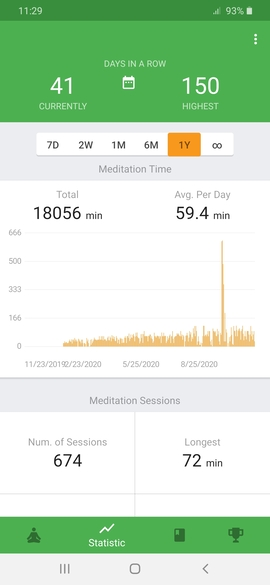

[home](./index.md)
------------------

*author: niplav, created: 2020-10-07, modified: 2020-12-12, language: english, status: notes, importance: 3, confidence: log*

> __Various things I tried, why I tried them, the effects they had,
and whether I recommend these things.__

Reports
=======

Sometimes, I perform little (and not so little) informal experiments.
Although I don't collect any data during the experiment, subjective
reports on their effects might be helpful for other people. Don't take
them too seriously.

Countings Smarts
----------------

### What I Did

When I was around 9 years old, I decided to create a counter
in my head that would increment when I saw a car of the brand
[Smart](https://en.wikipedia.org/wiki/Smart_(marque)). I did this for
around half a year, eventually reaching over 6000 (I don't remember
the exact number anymore, what a shame).  During this time, I created
some rules:

* I was not actively seeking out Smarts, but was looking out for them
* Because I'd learned the positions for Smarts in the village we were living in, I created a rule that a period of one hour was necessary for double-counting the same car
* Smarts of all varieties were valid

I remember location mattering a lot, a 2-week holiday in the US increasing
the counter by only 1 or two, and a weekend in a big european city
pushing the counter up by several hundred.

### Why I Did It

I don't remember my reasons for starting this. Perhaps I did it because
Smarts are relatively recognizable and I was bored.

### Whether It Was a Good Idea

I think the effects on my life were (and are) pretty neutral, though my
visual classifier for Smarts is still much better than for other cars. I
also still get a little bolt of attention when I see a Smart.

Also, the sportscar variant of Smarts looks kind of neat, besides the
[Tesla Cybertruck](https://en.wikipedia.org/wiki/Tesla_Cybertruck)
my preferred aesthetic for cars.<!--TODO: links for these-->

If you're a bored 9 year old, this is probably not too bad.

__5.5/10__

Eating Only Every Second Day
-----------------------------

### What I Did and Why I Did It

For two weeks in September 2018, I tried eating only every second day.
This ruled out any kind of nutritional intake on fasting days except
tap water.

I'd heard about people fasting for a week or more, and thought this
might be an interesting little experiment to try. I had no specific
reason for this particular spacing of fasting.

### What the Effects Were and Whether It Was a Good Idea

Apart from being quite hungry on the days when I didn't eat anything,
and eating a lot on the days when I was allowed to eat, there were no
interesting effects. I do not particularly recommend this.

__3/10__

Walking Barefoot
----------------

### What I Did and Why I Did It

From mid March 2019 to mid July 2019, I walked barefoot both inside the
house and outside.

I recall having read some people gesturing toward barefoot walking having
health benefits, but that was not my main reason for doing it, I wanted
to see whether it had any direct impacts on the quality of my life.

I stopped walking barefoot after steppipng into a glass shard for the
second time.

### What the Effects Were

The main effects were:

* In March, my feet were sometimes very cold when walking outside.
* I stepped into very small (2-4mm long) shards of glass twice, which I had to remove. That was kind of painful.
* People in my social circle were surprised, but tolerated it. I didn't have the feeling of losing many social opportunities.
* My feet became much more resilient against temperature & rough ground as time went on, in July I could run at full speed with relatively little pain.
* One day I slipped on a manhole cover during rain, and bent my ankle. It probably would have hurt less if I had worn shoes.
* My feet enjoyed much more varied and textured sensory input. (I was surprised by the difference in heat that different patches of road can have)
* I had to wash my feet everytime in entered my home, which was kind of annoying.
* I didn't have to put on shoes in the morning, giving me another minute in bed.
* I became very annoyed every time I saw glass shards on the pavement.

### Whether It Was a Good Idea

Walking barefoot was kind of cool, especially the long-term hardening of
my feet. That said, for most people the downsides probably outweigh the
upsides by a lot. To my younger self, I would recommend doing it for 2
weeks in summer, and then stopping.

__4/10__

Riding the Bike a Lot
---------------------

### What I Did

In October 2019, I decided to do all of my transportation either by foot
or by bike. I kept this up until February 2020.

This resulted in me biking on average ~25km a day for four months (my
way to university was ~20km, and sometimes I had to drive into the city
centre, which was another 10km).

During the time on my bike I usually listened to podcasts on
my IPod Shuffle<!--TODO: link-->, mostly the [80,000 Hours
Podcast](https://80000hours.org/podcast/).

### Why I Did It

I tried this to test several different things. I wanted to see how
independent of other methods of transportation I could be (public
transport, car etc.). I also wanted to observe whether these amounts
physical exercise and time spent outside (sometimes in the sun) would be
beneficial to me (both in terms of falling asleep easier in the evening
and becoming fitter).

I also wanted to see whether this was a good way of saving money for
public transport.

### What the Effects Were

I usually spent 2½ hours or more a day on my bike, very often under rough
conditions (cold weather, wind, me being tired/exhausted). Preparation
time for leaving the house was quite long: several minutes for packing
the backpack, adequately tying my shoes, putting on warm clothes (but
not too warm, since sometimes the weather was warm enough to being able
to leave the jacket inside my backpack), putting in the earphones, then
putting on the helmet, then gloves, and finally (if it was in the evening)
putting the lights onto the bike.

It doesn't sound like much, but doing this ~4 times a day (different
locations during the day) at two minutes, this cost me
`$4*2\hbox{min}*100=800\hbox{min} \approx 13.3h$`.

I was much hungrier in the evening, eating probably meals for 2 people.

I was usually very exhausted in the morning, making it harder to get out
of bed, and also during the day. Due to this, couldn't put as much energy
into university work as I would have wanted, leading to me receiving
quite bad grades during the semester.

I didn't notice my physical fitness improving very much except my legs
becoming much more muscular.

I had much less time during the day for hobbies and meeting friends.

### Whether It Was a Good Idea

On the whole, **I do not recommend doing this** at all. It was a mistake
of me not aborting the experiment after a month, and the benefits were
tiny to non-existent. I was more tired, had worse grades, less social
contact, slept in longer and didn't become fitter during those four
months. The money I saved by not having to use public transport was tiny
in comparison.

The only scenario where I can imagine this being a good idea is if you
truly enjoy riding your bike a lot, have a lot of free time and relatively
short commutes.

The only positive effect of the whole experiment was that I listened to
a whole lot of podcasts during that time.

__1.5/10__

Mostly Stopping to Bite My Nails
---------------------------------

### What I Did and Why I Did It

I used to bite my nails quite a lot. This was both unsanitary and
not very attractive, but for a long time I did not attack the problem
systematically.

After talking with a friend about this, I realized that I had only [tried
trying](https://www.lesswrong.com/s/3szfzHZr7EYGSWt92/p/WLJwTJ7uGPA5Qphbp "Use the Try Harder, Luke")
to stop biting my nails, and wanted to instead systematically attack
the issue.

I started by simply googling "How Do I Stop Biting My Nails" and read
[the first](https://www.webmd.com/a-to-z-guides/stop-nail-biting-tips)
[two](https://www.wikihow.com/Stop-Biting-Your-Nails) search results.

My first approach was to simply cut my fingernails whenever they became
too long.

### What the Effects Were

I now bite my nails 80% less than before I started cutting them regularly
(sometimes I forget cutting them, and then catch myself biting them
after they have become too long, but this happens relatively rarely).

I more often bite the skin around my nails, but still less than before
I was cutting them.

### Whether It Was a Good Idea

Although my nailbiting is not completely solved yet, I have made
significant progress on something that had resisted many attempts at
"just powering it through" (another win of systems over willpower).
I am surprised I hadn't noticed in previous attempts at stopping to
bite my nails that i actually had to cut them instead – highly obvious
once you think about it for even a couple of seconds, but apparently
not clear to myself in the moment.

I am glad I tried the "just google “How To X” and read the first
couple of results" approach to a relatively pertinent problem in my life
that was bugging me for a long time. I plan to attack other problems in
my life similarly in the future.

__7/10__

Melatonin
---------

### What I Did and Why I Did It

After being bullied into it by [Gwern
2019](https://www.gwern.net/Melatonin "Melatonin") and
reading more about dosage & administration in [Scott Alexander
2018](https://slatestarcodex.com/2018/07/10/melatonin-much-more-than-you-wanted-to-know/ "Melatonin: Much More Than You Wanted To Know"),
I decided to tackle my irregular sleeping rhythm and my late bedtimes
by taking Melatonin.

Getting enough high-quality sleep had been quite a problem for most of my
life, I just *could not* find the willpower to actually go to bed early on
most days. Most other advice relied on exactly bringing up this willpower
(just read before going to bed/just stay away from screens/just do sports
in the morning/just spend more time outside/just masturbate (actually
counter-productive in my case!)); Gwern's framing as an enforcement
mechanism appealed to me, and the cost-benefit analysis seemed sound.

I first tried buying Melatonin at a pharmacy, only to find out that
it is prescription only in my country. A friend told me he had bought
his from Ebay as a food supplement (laws have interesting loopholes),
I ordered 100 3mg pills for ~30€ and they arrived, together with around
10g of protein powder.

### What the Effects Were

I experimented around with administration time & dosage, finding out
that 1/8th (≈0.375g) of a pill, administered at ~20:00, was usually
sufficient to make me sleepy enough at 23:00 to actually go to bed
(though the pills are kind of hard to cut). I also realized that it was
not necessary to take Melatonin every evening, once a good rhythm had
been established, a dosage every 2 or 3 days was usually enough to keep
the habit of going to bed early.

In the last couple of weeks I feel like 1/8th of a pill is not enough,
perhaps this is adaption to the substance (though I remember reading
that adaption is negligible). Alternatively, the placebo effect might
be wearing off.

<!--TODO: follow up on this-->

While Melatonin was very useful at enforcing bedtimes, it wasn't making
me sleep less.

### Whether It Was a Good Idea

I am very glad I bought & tried Melatonin, it has to a large degree fixed
a significant problem in my life. I am now happier in the morning when
I wake up, less tired during the course of the day, and don't have to
feel guilty at 04:00 because I stayed up too late.

At my current usage, my stash will last me
`$95 \hbox{ pills }*8\frac{\hbox{dosages}}{\hbox{pill}}*2\frac{\hbox{days}}{\hbox{dosage}}=1520 \hbox{ days}$`:
more than 4 years! Even if the future effects are just half as good as
the past effects, this was an investment completely worth it.

__8/10__

300 Hours of Meditation
-------------------------

> There is the case where a monk, having gone to the wilderness, to
the shade of a tree, or to an empty building, sits down folding his
legs crosswise, holding his body erect, and setting mindfulness to
the fore. Always mindful, he breathes in; mindful he breathes out.
> Breathing in long, he discerns, ‘I am breathing in long’; or
breathing out long, he discerns, ‘I am breathing out long.’ Or
breathing in short, he discerns, ‘I am breathing in short’; or
breathing out short, he discerns, ‘I am breathing out short.’

*– [Ānāpānasati Sutta (MN 118)](https://www.dhammatalks.org/suttas/MN/MN118.html), [Author unknown](https://en.wikipedia.org/wiki/P%C4%81li_Canon#Authorship), ca. -100*

### What I Did and Why I Did It

Around the end of 2019, I started meditating. I had read about jhanas
on the blog [Qualia Computing](https://qualiacomputing.com),
especially in the post [Investing Time and Resources in
Happiness](https://qualiacomputing.com/2019/04/03/investing-time-and-resources-in-happiness),
and thought it would be worthwhile to try meditation.

I started by reading [Mindfulness in Plain
English](./doc/meditation_2020/mindfulness_in_plain_english_gunaratana_1990.pdf),
and sitting for around 20 to 30 minutes a day, doing simple concentration
practice on the breath. I sometimes added 20 minutes or so of walking
meditation, focusing on the sensations from the feet and legs. Over the
course of 2020, I mostly continued my concentration practice, rarely
adding some loving-kindness or noting. During that time, after enjoying
the practice more and more, I expanded my meditation time to around 75
minutes a day.

As of November 2020, I have meditated 300 hours.

### What The Effects Were

Note: I ascribe many positive changes in my life to my meditation
practice.  I feel like that is prudent, but inferring causality is very
difficult (especially over long time horizons), and it is possible that
I might be overrating my practice in its importance. That said, many of
the positive effects coincide pretty well with me starting my practice,
and seem to be similar to what other people are talking about.

Off the cushion, I noticed that my hedonic baseline increased by
around 15% (estimate, if such a number is indeed meaningful). I have
felt happier, more empathetic, more equanimous (and at the same time
more energized). I have learned to avoid many negative and unproductive
thought loops, and sometimes even addictive behavior (e.g. in relation
with the internet).

I sometimes experience a "dropping down into reality moment", where I
become acutely aware of the sensations in my body, or the sense of the
space around me, or the silence around me. This is always quite enjoyable.

I also experience negative sensations much less often, and if I do,
they last for a much shorter time and are less intense. For example,
I have noticed an 80% (again, estimate) reduction in

* Sadness
* Envy
* Jealousy
* Guilt
* Shame

The reduction of these negative states is partially (but not completely)
responsible for the raising of my hedonic baseline.

If I experience such states, it has become much easier to negotiate
with them by acknowledging their existence, observing them more closely,
and then "sending them down into the body". (I am not sure how coercive
this is, but at the moment, my best guess is that there is relatively
little coercion involved).

Ironically, while my meditation practice has noticeably improved most
aspects of my life, I do not notice as much progress in the quality of my
meditation as I would have expected. I have the impression that I tend
to experience less mind-wandering, and that my perception of sensations
is somewhat more clear, but that might just be a corollary of me fixing
my sleeping rhythm and not being quite tired during meditation.

Sometimes, most often during a one-hour sit, I enter a state that is
quite pleasant and clear. In it, I have no internal monologue, and feel
a pervasive inner silence (outer silence is also mostly present, though
I can still perceive auditory perceptions). There is also no drive to do
anything else/go anywhere else. Unfortunately, it always has disappeared
after only a few minutes.

But these kinds of states are relatively rare, and most of my meditation
sessions are like everyone else's: full of mind-wandering, short bursts
of attention on the breath etc. I do, however, enjoy meditation more
and more as time goes on.

### Whether I Recommend It

Recommending meditation, especially in the amounts that I do, is a very
risky move. Meditation can cause very negative states of mind, or lead
to mental changes that lead to radical changes in lifestyle. I have not
yet had any experience of e.g. the dukkha ñanas, but I have been well
informed about them, and have decided that the risk they pose can be
traded off against the benefits I have observed so far, and that other,
more advanced people have talked about.

If my descriptions have stimulated your curiosity, I do
recommend seeking out more information about meditation. If you
are relatively analytical, I can recommend the [/r/streamentry
wiki](https://old.reddit.com/r/streamentry/wiki/index), as well as the
writings of [Daniel M. Ingram](https://integrateddaniel.info).

I have still only read [Mindfulness in Plain
English](./doc/meditation_2020/mindfulness_in_plain_english_gunaratana_1990.pdf),
and I liked it.

__9/10__

Attempted 7-Day Meditation Retreat at Home
------------------------------------------

### What I Did

At the beginning of October 2020, I planned doing a 7-day meditation
retreat at home. My initial plan was to do nothing but meditate for all
7 days, at ~10h of meditation a day. During that time, I planned on not
leaving the house, using the internet, visiting friends etc.

I used [this reddit
post](https://old.reddit.com/r/Meditation/comments/393ktj/diy_10_day_meditation_retreat_at_home_mindfulness/)
as an inspiration for my schedule.

I removed all electronic devices from my room, keeping only my smartphone
(using it as a timer), but disabling nearly all apps & turning off wifi.

My schedule was to do sitting and walking meditation alternatingly,
1h each, and doing mostly concentration practice<!--TODO: anapanasati
for sitting, what for walking?-->.

### Why I Did It

At that time I had meditated ~250h, and had read several times that
retreats were the best option of inducing qualitative shifts in meditation
practice. But I didn't want to plan & pay for a meditation retreat just
yet, so I decided that I could try the cheaper option at home and see
how it worked out.

### What the Effects Were

I started the retreat off very strongly: Meditating for 10h each on the
first two days. Unfortunately, the social environment was not ideal for
intense practice, and I became less determined to continue practicing as
the days went on. I meditated 8, 6, ½, and 4 hours on the next 4 days,
leaving the seventh completely free.

However, the effects of doing intense concentration practice were still
quite strong. I had some episodes of very clear & vivid mindfulness,
following the breath easily for several minutes.

I did ½h of metta<!--TODO: link, formatting-->, which convinced me to
incorporate more loving-kindness meditation into daily practice as well.

On the evenings first and second day specifically, my head felt like a
swarm of busy tiny insects were performing a great amount of labour inside
of it – something was clearly happening, and I had the impression that
a lot of neural connections were being built.

### Whether It Was a Good Idea

Although I failed to stay consistent during the time and did not practice
as much as I wanted to, I am still very glad I did the retreat. My
concentration practice was markedly better afterwards, and it has helped
me in very subtle ways.

I now plan doing a retreat in the right social setting that encourages me
to be more disciplined about my practice.

I would tentatively recommend aiming for 2/3 days of intense practice
instead of 7, that seems a lot more doable on your own. But if you're
especially enthusiastic, you might very well succeed where I failed.

__7.5/10__

<!--
Kissing Hand as Goodbye
-----------------------

Becoming Marginally More Productive
------------------------------------
        * Follow Alexey Guzey's Advice, Leave the House
        * Internet Abstinence

Buying Socks of One Kind
-------------------------

Tracking A Lot
---------------

Chatting Up Random People
-------------------------

Asking the Hamming Question, "What is art?", or simply, "Would you like
to hold a conversation?"
-->
