[home](./index.md)
-------------------

*author: niplav, created: 2023-04-15, modified: 2025-04-08, language: english, status: in progress, importance: 8, confidence: highly likely*

> __I [consider](#Motivation) the problem of resolving preferences
that are inconsistent under the [von Neumann-Morgenstern
axioms](https://en.wikipedia.org/wiki/Von_Neumann-Morgenstern_axioms)
into consistent preferences. For [preferences over deterministic
options](#Inconsistent_Preferences_over_Deterministic_Options),
I model inconsistent preferences as [directed
graphs](https://en.wikipedia.org/wiki/Directed_Graph), and [the
resolution](#Finding_Consistent_Graphs_with_the_Smallest_GraphEdit_Distance)
as selecting acyclic
[tournaments](https://en.wikipedia.org/wiki/Tournament_\(graph_theory\))
with the same vertices and minimal [graph-edit
distance](https://en.wikipedia.org/wiki/Graph_edit_distance),
or [Hodge decomposition](#None). I [prove an impossibility
theorem](#Resolution_to_Polynomially_Many_Preferences_and_Preservation_of_Consistent_Subgraphs_are_Incompatible).__

> __For [preferences over
lotteries](#Inconsistent_Preferences_over_Lotteries), I offer
two different methods for modeling inconsistence and one method
for resolving them: as edge-weighted [weakly connected directed
graphs](https://en.wikipedia.org/wiki/Weakly-connected_digraph)
(resolution via [`HodgeRank`](#HodgeRank)) and as arbitrary
[relations](https://en.wikipedia.org/wiki/Relation_\(mathematics\))
over lotteries. None of those two
representations prove to be satisfactory. I [apply the
findings](#Ontology_Identification_Ontological_Shifts_and_Ontological_Crises)
to propose an algorithm for changing a [utility
function](https://en.wikipedia.org/wiki/Utility#Utility_function) as
the underlying set of objects changes.__

Resolving von Neumann-Morgenstern Inconsistent Preferences
===========================================================

<!--TODO: move proofs into an appendix-->

In economics, decision theory, game theory and parts of artificial
intelligence the standard approach to modeling actors is to assume those
actors have a fixed utility function they optimise [Peterson 2017, ch.
6](https://www.goodreads.com/book/show/11729796-an-introduction-to-decision-theory),
[Tadelis 2013,
ch. 2](https://www.goodreads.com/book/show/15930573-game-theory),
[Russel & Norvig 2010, ch. 16](http://aima.cs.berkeley.edu/),
following the foundations laid by von Neumann
and Morgenstern [von Neumann & Morgenstern 1947, ch.
3](https://www.goodreads.com/book/show/483055.Theory_of_Games_and_Economic_Behavior).


However, this model has come under criticism as being
non-descriptive of human preferences, which can be experimentally
shown to violate one or more of the von Neumann-Morgenstern
axioms [Allais 1953](https://www.jstor.org/stable/1907921), [El Gamal
2013](./doc/psychology/on_the_structural_consistency_of_preferences_el_gamal_2013.pdf).
Furthermore, the AI systems humanity has constructed so far usually have
no in-built utility functions and appear inconsistent, as they are often
programs selected by gradient descent to perform well on a loss or reward
function, and it is doubtful that they have internal goal representations
that correspond to the their loss or reward function [Hubinger
2019](./doc/cs/ai/alignment/risks_from_learned_optimization_hubinger_2019.pdf).

This tension between the normative theory of rational agency and the
observations I can make about intelligent systems in the real world
provides a stark contrast and brings up the question of how one could
modify the preferences of intelligent systems to be more consistent.

### Motivation

The intuitive case for focusing on resolving inconsistent preferences
is that __given we find a normative ideal for rationality__, real-life
systems will probably not perfectly conform to that ideal. So we'll have
an ideal and we have the real-life situation—it is natural to ask how
to get from here to there.

I claim the project of finding procedures for modifying preferences to
make them consistent is interesting and important for several different
reasons:

-   **Learning the preferences of weaker incoherent
    systems** [Dewey
    2010](./doc/cs/ai/alignment/value_learning/learning_what_to_value_dewey_2010.pdf):
    Assuming that one system `$S_1$` wants to learn the preferences of
    a less coherent system `$S_2$`, `$S_1$` might want to "correct"
    inconsistent preferences learned from `$S_2$` to avoid being
    exploitable via Dutch books. For example, an AI assistant trying to
    learn and then fulfill the preferences of a gambling-addicted human
    could notice that the human has a cyclic preference which results
    in them being predictably losing money at the casino, even though
    they otherwise care about money.
-   **Managing ontological crises**: If a system defines its preferences
    using a world model, but this world model changes, those preferences
    might now be inconsistent. Such situations would benefit from a
    method for resolving inconsistent preferences [de Blanc 2011](./doc/cs/ai/alignment/ontological_crises/ontological_crises_in_artificial_agents_value_systems_de_blanc_2011.pdf).
-   **Creating AI systems with consistent preferences**: Assuming that
    humans will build capable agentic AI systems, we might want to both
    describe how those agents might achieve coherence, and prescribe
    ways for them to reach coherence. There are three reasons why we
    might expect more capable agents to be more coherent:
    -   **Deliberate design**: If e.g. humans create AI systems, they
        might construct such AI systems to have or develop consistent
        preferences as to avoid unpredictable behavior.
    -   **Competitive pressure**: An agent could modify their
        preferences in response to competitive pressures that exploit
        any incoherencies it displays, for example through other
        agents that are attempting to money-pump it [Gustaffson
        2022](https://johanegustafsson.net/books/money-pump-arguments/).
    -   **Self-modification**: Agents might modify their own
        inconsistent preferences to adhere to the von
        Neumann-Morgenstern axioms, to avoid wasting resources and
        making it easier to reason about their own future behavior.

#### Why vNM?

The vNM axioms are in many senses quite appealing: A preference
that follows them assigns a real-numbered value to each
possible outcome, and several theorems establish that an
agent with a utility function can't be money-pumped [Gustaffson
2022](https://johanegustafsson.net/books/money-pump-arguments/),
and it is compatible with taking Pareto improvements [Wald
1947](https://projecteuclid.org/journals/annals-of-mathematical-statistics/volume-18/issue-4/An-Essentially-Complete-Class-of-Admissible-Decision-Functions/10.1214/aoms/1177730345.full).
Empirically, while humans don't reliably fulfill the
vNM axioms, cognitive abilities correlate positively
with having less intransitive preferences [Rustichini
2015](./doc/psychology/the_role_of_intelligence_in_economic_decision_making_rustichini_2015.pdf).

The von Neumann-Morgenstern axiom has
[been](https://www.lesswrong.com/posts/yCuzmCsE86BTu9PfA/there-are-no-coherence-theorems)
[critized](https://www.lesswrong.com/posts/NxF5G6CJiof6cemTw) and
[defended](https://www.lesswrong.com/posts/DkcdXsP56g9kXyBdq/coherence-arguments-imply-a-force-for-goal-directed-behavior)
as being the true theory of rationality. I don't have a very strong
position on this, and use vNM because it's the current "state of the
art" in decision theory—it seems plausible to me that vNM will
be superseded by some theory that is "better" along the relevant
dimensions<sub>57%</sub>. I hope that in that case the lessons learned
from resolving vNM-inconsistent preferences transfer over somewhat.

### Structure of the Text

This text starts by explaining the von Neumann-Morgenstern axioms and
various theorems relating the axioms to concepts such as Dutch books and
Pareto improvements. There is a well-developed literature discussing the
relevance of these axioms, and I tentatively conclude that these axioms
are worth taking as a standard for rational agency. I also observe that
humans do not satisfy those axioms.

I then examine the literature on inconsistent preferences, finding
investigations from economics on time-inconsistent preferences and some
scattered attempts in the non-academic literature, but no satisfactory
investigations into the topic that cover all possible violations of the
von Neumann-Morgenstern axioms.

I then proceed to analyse the problem of resolving inconsistent
preferences in two cases:

-   Deterministic case: I propose the set of all directed graphs as a
    mathematical structure that can represent inconsistent preferences
    over non-lottery options. I propose three algorithms for resolving
    inconsistent preferences of this type, prove two of the algorithms
    as being functionally equivalent, and analyse the algorithms in
    terms of computational complexity and five other criteria.
-   Lottery case: I propose two different mathematical structures for
    representing potentially inconsistent preferences over lotteries:
    Edge-weighted weakly connected directed graphs and arbitrary relations
    over lotteries. I propose Hodge decomposition as an efficient method
    for resolving inconsistencies in the first case, but find that
    edge-weighted weakly connected directed graphs are insufficient
    for representing common inconsistencies found in reported human
    preferences. I then note that arbitrary relations over lotteries are
    able to represent those inconsistencies, but I'm unable to find an
    algorithm for resolving inconsistencies in that format.

I finally speculate about one application of the methods for resolving
incoherence: Incorporating changes in the world model into preferences
defined over that world model.

## Related Work

As far as our literature review has revealed, the academic literature
has no investigation into the specific question I'm attempting to answer.

##### Modeling Inconsistent Preferences

In the economic literature, preferences are usually more restricted than
in the von Neumann-Morgenstern setting: It is usually assumed that there
is a set of goods `$B$` and a utility function `$U: B \times \mathbb{R}
\rightarrow \mathbb{R}$` that takes as argument a good and the amount of
that good that has been consumed. Consumption can take place at different
time steps: Let `$c: B \times \mathbb{N}$` be a function that returns
the consumption of a good at a specific timestep. With a single good `$b$`
and different quantities `$c(b, 1), c(b, 2), \dots, c(b, n)$` consumed
at `$n$` timesteps, the time-discounted utility (discount factor `$\delta$`)
of this consumption is `$\sum_{i=1}^n \delta^i U(b, c(b, i))$` (which
is equivalent to the use of discount rates in reinforcement learning
[Sutton 2020, ch.  3](http://incompleteideas.net/book/the-book.html).

A common form of modeling human preferences that are not exponentially
time-discounted in this way is hyperbolic discounting, in which the
discounting factor is a hyperbolic function with a parameter `$k$` instead
of an exponential. Let `$U_h(b, i, k)=\frac{1}{1+ki}U(b, c(b, i))$` be the
hyperbolically discounted utility of consuming `$b$` at time step `$i$`.

This kind of discounting leads to disproportionately preferring
small rewards soon over large rewards later, and might lead to
preference reversals: For two goods `$b$` and `$b'$`, an agent can have
the preference `$U_h(b, c(b, i))>U_h(b', c(b, i+c))$` at a time step
`$i$` and a time step `$i+c$`, but reverse that preference if it lies at
another timestep `$j$`: `$U_h(b, c(b, j))<U_h(b', c(b, j+c))$`. Such
hyperbolic discounting has been observed in humans [Myerson &
Green 1994](https://pubmed.ncbi.nlm.nih.gov/16812772/)
and pigeons [Ainslie & Herrnstein
1981](./doc/econ/behavioral/preference_reversal_and_delayed_reinforcement_ainslie_herrnstein_1981.pdf).
This kind of preference reversal does not occur with exponential
discounting.

Hyperbolic preferences can be modeled in a game-theoretic setup, in
which subagents in aggregation execute a Pareto-dominated strategy, and
via a single agent which follows an unchangeable plan [Caillaud & Jullien
2000](./doc/econ/behavioral/modelling_time_inconsistent_preferences_caillaud_jullien_2000.pdf).
Caillaud and Jullien do not attempt to resolve these
time-inconsistencies to make them time-consistent. Backus and
Zin explore further alternatives to the time-discounted utility
setup, though they still work with utility functions that are
invariant under positive affine transformation [Backus et al.
2004](https://pages.stern.nyu.edu/~dbackus/Exotic/BRZ%20exotic%20latest.pdf).

##### Resolving Inconsistent Preferences

In the context of taxonomical data, [Sun et al.
2017](./doc/preference/breaking_cycles_in_noisy_hierarchies_sun_et_al_2017.pdf "Breaking Cycles in Noisy Hierarchies")
investigate the problem of recovering hierarchies from noisy data.
They represent inconsistent taxonomies with directed acyclic
graphs and consistent hierarchical taxonomies using directed
graphs. They find that, when measuring the number of edges being
removed, a voting ensemble of several different techniques
such as [TrueSkill](https://en.wikipedia.org/wiki/TrueSkill)
does well on removing as few edges as possible, and usually
outperforms removing greedy approximations of the [feedback arc
set](https://en.wikipedia.org/wiki/Feedback_arc_set) [Sun et al.
2017](./doc/preference/breaking_cycles_in_noisy_hierarchies_sun_et_al_2017.pdf "Breaking Cycles in Noisy Hierarchies").

Outside of the academic literature, [Aird &
Shovelain 2020](https://www.lesswrong.com/posts/ky988ePJvCRhmCwGo/using-vector-fields-to-visualise-preferences-and-make-them "Using vector fields to visualise preferences and make them consistent") represent inconsistent preferences as [vector
fields](https://en.wikipedia.org/wiki/Vector_Field) on a state space
(for example states with more/less security and more/less wealth),
where a vector `$\mathbf{v}$` at a specific point `$\mathit{p}$` in the
vector field indicates a preference for a change in the direction of
`$\mathbf{v}$` at `$\mathit{p}$`.

However, as they note, such a vector field can have inconsistencies in the
form of [curl](https://en.wikipedia.org/wiki/Curl_\(mathematics\)). They
then discuss the restrictions on the vector field so that it
conforms to the von Neumann-Morgenstern axioms, which they conclude
to be potential vector fields, and outline how to use [Helmholtz
decomposition](https://en.wikipedia.org/wiki/Helmholtz_decomposition)
to decompose inconsistent preference vector fields with three
dimensions. Their approach bears a strong resemblance to the Hodge
decomposition we use with edge-weighted graphs.

Taking a very different approach, [Kirchner
2022](https://www.lesswrong.com/posts/QZiGEDiobFz8ropA5/inferring-utility-functions-from-locally-non-transitive)
investigates how to infer utility functions from non-transitive
preferences using a neural network.  Kirchner relates inferring such
preferences to sorting data in which comparisons sometimes are random,
resulting in cycles during comparison. He finds that this approach is
able to reconstruct orderings even when 10% of the results of comparisons
are noise.

* [Value Formation: An Overarching Model (Thane Ruthenis, 2022)](https://www.lesswrong.com/posts/kmpNkeqEGvFue7AvA/value-formation-an-overarching-model)
* [A logic to deal with inconsistent preferences (Bob Jacobs, 2023)](https://bobjacobs.substack.com/p/a-logic-to-deal-with-inconsistent)
* [Value systematization: how values become coherent (and misaligned) (Richard Ngo, 2023)](https://www.lesswrong.com/posts/J2kpxLjEyqh6x3oA4/value-systematization-how-values-become-coherent-and)
* [The Value Change Problem (Nora Amann, 2023)](https://www.lesswrong.com/s/3QXNgNKXoLrdXJwWE)
* [Crystal Healing — or the Origins of Expected Utility Maximizers (Alexander Gietelink Oldenziel/Kaarel/RP, 2023)](https://www.lesswrong.com/posts/tiftX2exZbrc3pNJt/)

<!--TODO: Other posts in the LW sequence draft, plus porby post
https://www.lesswrong.com/posts/vs49tuFuaMEd4iskA/one-path-to-coherence-conditionalization-->

##### Learning Inconsistent Preferences

The problem of *inferring* the preferences of
irrational agents has been formally posed [Mindermann & Armstrong
2018](https://proceedings.neurips.cc/paper/2018/file/d89a66c7c80a29b1bdbab0f2a1a94af8-Paper.pdf):
It is in general impossible learn such preferences, as any action
is equally compatible both with a preference for that action *and*
a systematic bias causing the action.  Nevertheless [Evans et al.
2016](./doc/cs/ai/alignment/value_learning/learning_the_preferences_of_ignorant_inconsistent_agents_evans_et_al_2016.pdf "Learning the Preferences of Ignorant, Inconsistent Agents")
find a framework that is experimentally successful at
inferring the preferences of an agent with time-inconsistent
hyperbolic discounting and incorrect beliefs using [Bayesian
inference](https://en.wikipedia.org/wiki/Bayesian_Inference).  Their
method for inferring preferences of inconsistent software agents gives
similar results to estimates made by humans. Their framework does not
cover all possible variants of inconsistent preferences, and makes no
statement about how to resolve the time-inconsistencies. Evans et al. also
give no theoretical guarantee about the performance of their method.

### The von Neumann-Morgenstern Axioms

The von Neumann-Morgenstern (vNM) axioms and the framework of utility
functions are widely regarded as the standard method of modeling
preferences over world-states.

There is an extensive philosophical debate about the reasonableness of
the vNM axioms, and a number of proposed alternatives. We have
explicitly decided not to contribute to this debate (though some of our
findings on the difficulty of establishing vNM-coherence might be
interesting to philosophers), and instead assume that preferences
conforming to the vNM axioms are a goal to be achieved.

Let `$\Omega$` be a set of `$n$` distinct outcomes, and let `$\Delta(\Omega)$`
be the set of all probability distributions on `$\Omega$`, which in von
Neumann and Morgenstern call "lotteries" [von Neumann & Morgenstern
1947](https://www.goodreads.com/book/show/483055.Theory_of_Games_and_Economic_Behavior).

For given `$\omega_1, \omega_2 \in \Omega$`, a lottery in which `$\omega_1$`
has a probability `$p_1$` and `$\omega_2$` has a probability `$p_2$` is
written as `$[p_1: \omega_1, p_2: \omega_2]$`[^1].

**Definition 1**. Let `$l_1, l_2, l_3 \in \Delta(\Omega)$`. Let `$\preceq$`
be a relation on all lotteries on `$\Omega$`, that is `$\preceq \subseteq \Delta(\Omega) \times \Delta(\Omega)$`.

If `$l_1 \preceq l_2$` and `$l_2 \preceq l_1$`, then we write
`$l_1 \sim l_2$`.

Then the relation `$\preceq$` is a **preference relation** if and only if
it fulfills the four von Neumann-Morgenstern axioms

1.  **Completeness**: For any lotteries `$l_1, l_2$`, it holds that
    `$l_1 \preceq l_2$` or `$l_2 \preceq l_1$`.
2.  **Transitivity**: For any lotteries `$l_1, l_2, l_3$`, if
    `$l_1 \preceq l_2$` and `$l_2 \preceq l_3$`, then it must also hold that
    `$l_1 \preceq l_3$`.
3.  **Continuity**: Given `$l_1, l_2, l_3$`, if it holds that
    `$l_1 \preceq l_2 \preceq l_3$`, then there must be a probability
    `$p \in [0,1]$` so that `$l_2 \sim [p: l_1, (1-p): l_3]$`.
4.  **Independence**: Given `$l_1, l_2, l_3$` it holds that
    `$l_1 \preceq l_2$` if and only if for any `$p \in [0;1]$` it holds that
    `$[p: l_1, (1-p): l_3] \preceq [p: l_2, (1-p): l_3]$`.

The axiom of completeness implies reflexivity: For all lotteries `$l$` it
holds that `$l \preceq l$`.

We denote the probability a lottery `$l$` assigns to `$\omega \in \Omega$`
as `$p_l(\omega)$`.

Given a preference relation `$\preceq$`, one can create a
function `$U\colon \Delta(\Omega) \rightarrow [0;1]$` for
which it holds that `$U(l_1) \ge U(l_2)$` if and only if
`$l_1 \preceq l_2$` [von Neumann & Morgenstern 1947, ch.
3.6](https://www.goodreads.com/book/show/483055.Theory_of_Games_and_Economic_Behavior).

**Definition 2**. This function is called a **utility function** for the
preference relation `$\preceq$`.

Let us as a shorthand write `$\omega$` for the lottery that assigns
probability 1 to `$\omega$`, and probability 0 to all other options (we
call such a lottery a "deterministic option").

`$U$` has the property that for any lottery `$l$` from `$\Delta(\Omega)$`, the
value `$U(l)$` is simply the *expected* value of `$l$`, that is the mean of
the utilities weighted by the probabilities:

<div>
	$$U(l)=\sum_{\omega \in \Omega} U(\omega) \cdot p_l(\omega)$$
</div>

#### Assuming Asymmetry

**Definition 3**. A relation
`$\prec \subseteq \Delta(\Omega) \times \Delta(\Omega)$` is a **strict
preference relation** if and only if it fulfills the four von
Neumann-Morgenstern axioms and also the additional criterion of
**antisymmetry**: `$l_1 \prec l_2$` and `$l_2 \prec l_1$` if and only if `$l_1=l_2$`.

The reason for this assumption is that one of the algorithms we
investigate (namely `EGEDmin`) produces a total order over `$\Omega$`.

This restriction does not change the fundamental structure of the vNM
axioms; specifically, it does not affect the continuity axiom (as even
with strict preferences over deterministic options, there can still be
non-strict preferences over lotteries).

## Inconsistent Preferences over Deterministic Options

A consistent preference over `$\Omega$` that fulfills **completeness**,
**transitivity** and **antisymmetry** can be represented by an acyclic
tournament `$G$`[^2], with `$E \subseteq \Omega \times \Omega$`.
That is, `$G$` itself is **complete**, **transitive** and
**antisymmetric**. We call such `$G$` a **consistent** graph (or
consistent directed graph, or acyclic tournament).

The set of possible preferences over `$\Omega$` (including inconsistent
preferences), `$\mathfrak{P}_{\Omega}$`, may be represented as the set of
all directed graphs with vertices `$\Omega$`. We will use `$\mathfrak{P}_n$`
to denote the set of all directed graphs with `$n$` vertices
(`$n=|\Omega|$`), allowing for reflexive edges (that is edges of the form
`$(\omega_1, \omega_1)$`). The set `$\mathfrak{P}_{\Omega}$` can be constructed by
enumerating the set of adjacency matrices (elements of `$\{0,1\}^{n \times n}$`)
and then, for each adjacency matrix, constructing the
corresponding graph. There are `$2^{n^2}$` possible preferences in
`$\mathfrak{P}_{\Omega}$`.

For a directed graph `$G \in \mathfrak{P}_{\Omega}$`, one can interpret
the presence of an edge `$(\omega_1, \omega_2) \in E_G$`, with `$\omega_1,
\omega_2 \in \Omega$`, as "`$\omega_1$` is preferred over `$\omega_2$`",
written `$\omega_1 \succ \omega_2$` or `$\omega_1 \rightarrow \omega_2$`.

Let `$\mathfrak{C}_{\Omega}$` be the set of **consistent graphs** over
`$\Omega$`, with `$\mathfrak{C}_{\Omega} \subset \mathfrak{P}_{\Omega}$`,
can be constructed by enumerating the set of permutations of `$\Omega$`,
constructing a strict total order out of each permutation, and taking
the transitive closure of that strict total order. There are `$n!$`
elements in `$\mathfrak{C}_{\Omega}$`.

We take the set of **inconsistent graphs** `$\mathfrak{I}_{\Omega}
\subset \mathfrak{P}_{\Omega}$` to be all graphs that are not consistent,
that is `$\mathfrak{I}_{\Omega}=\mathfrak{P}_{\Omega} \backslash
\mathfrak{C}_{\Omega}$`.

Let `$\mathfrak{W}_{\Omega}$` be the set of **weakly consistent** graphs
over `$\Omega$`, which may be represented as the set of all directed
graphs that are equivalent to some weak ordering. It can be constructed
by taking all weak orderings on `$\Omega$`, for each weak ordering
`$\preceq$` creating an edge from `$\omega_1$` to `$\omega_2$` if and
only if `$\omega_1 \preceq \omega_2$`, and then taking the transitive
closure of that graph.  The weak orderings are counted by the [ordered
Bell numbers](https://en.wikipedia.org/wiki/Ordered_Bell_number).

### Violating the von Neumann-Morgenstern Axioms

In the deterministic case there are only two vNM axioms that can be
violated: completeness and transitivity, since continuity and
independence rely on the underlying objects of the preference relation
being lotteries.

Directed graphs are well able to represent all violations of these vNM
axioms.

##### Incompleteness.

Incompleteness is distinct from indifference: indifference between
`$\omega_1$` and `$\omega_2$` exists if both `$\omega_1 \preceq \omega_2$` and
`$\omega_2 \preceq \omega_1$`, incompleteness (or incomparability) is the
case if neither `$\omega_2 \preceq \omega_1$` nor `$\omega_1 \preceq \omega_2$`.

The presence of an incomplete preference in an
agent is difficult to operationalize, [Gustaffson
2022](https://johanegustafsson.net/books/money-pump-arguments/) treats
incomparable options as interchangeable, but setups in which an agent
takes a default choice or randomizes when presented with incomparable
options are also possible (however, as Gustaffson notes, the randomization
offers an adversary the option to (in expectation) perform money-pumps).

In a graph-theoretic setting, incomparability between options `$\omega_1,
\omega_2$` is represented by the absence of any edge between `$\omega_1$`
and `$\omega_2$` in the graph `$G$` representing the preference.

##### Intransitivity.

Intransitivity is quite easy to represent in a graph `$G$`: If there is
an edge `$\omega_1 \rightarrow \omega_2 \in E$` and an edge `$\omega_2
\rightarrow \omega_3 \in E$`, but no edge `$\omega_1 \rightarrow \omega_3
\in E$`, then one has represented an intransitive preference `$\omega_1
\prec \omega_2, \omega_2 \prec \omega_3, \omega_1 \not \prec \omega_3$`.

##### Symmetry.

A symmetric (or indifferent) preference between `$\omega_1, \omega_2$`
(written as `$\omega_1 \sim \omega_2$`) can also easily be represented
by a directed graph by having the edges `$\omega_1 \rightarrow \omega_2,
\omega_2 \rightarrow \omega_1 \in E$`.

### Algorithms for Resolving Inconsistencies

Any method for resolving inconsistent graphs is a function `$f:
\mathfrak{P}_{\Omega} \rightarrow \mathcal{P}(\mathfrak{C}_{\Omega})$`
that maps any inconsistent graph to a set of consistent graphs which
might contain more than one element since the inconsistent graph might
not fully determine its consistent counterpart.

#### Finding Consistent Graphs with the Smallest Graph-Edit Distance

One potential class of such functions would be ones that minimize a
"distance" `$d: \mathfrak{G}_{\Omega} \times \mathfrak{C}_{\Omega}
\rightarrow \mathbb{R}$` between the (possibly inconsistent) graph and
its consistent counterparts.

The function `$f_m$` would then return

<div>
	$$f_d(G)=\underset{C \in C_{\Omega}}{\text{argmin }} d(C, G)$$
</div>

We propose a candidate for `$f_d$`, which minimizes the edge-graph-edit
distance between any `$G \in \mathfrak{P}_{\Omega}$` and the set of
consistent versions `$\mathbf{C} \subseteq \mathfrak{C}_{\Omega}$` of `$G$`.

Formally:

<div>
	$$f_{\text{EGED}}(G)=\underset{C \in C_{\Omega}}{\text{argmin }} \text{EGED}(C, G)$$
</div>

where `$\text{EGED}(X,Y)$` is the smallest number of edges that need to be
added or removed from `$X$` to create `$Y$`. The addition or removal of
vertices is not allowed, since the elements of `$\Omega$` can be
distinguished from one another.

This function is intuitively appealing: Let
`$G \in \mathfrak{P}_{\Omega}$` be a (possibly inconsistent) preference
over `$\Omega$`. Then let `$\omega_1, \omega_2 \in \Omega$` be two possible
outcomes. the existence of an edge `$(\omega_1, \omega_2) \in V_P$`
represents that `$\omega_1$` is preferred over `$\omega_2$`.

Then, given `$G$`, if one desired a consistent version of `$G$`, one would
want to give up *as few as possible* of such rankings of two options.
One must sometimes give up some of those rankings to achieve von
Neumann-Morgenstern consistent preferences (for example to break
cycles), but a high number of deletions or additions of rankings is
undesirable.

**Proposition 1**. For two directed graphs on the same set of vertices,
`$G_1=(\Omega, E_1), G_2=(\Omega, E_2)$` the edge-graph-edit distance is the same as the size
of the symmetrical difference of the sets of edges, that is
`$\text{EGED}(G_1, G_2)=|E_1 \Delta E_2|$`.

[*Proof.*](#Proposition_1)

*__Algorithm 1__: A naive algorithm for computing `EGEDmin`*

```
function EGEDmin(G)
	m=∞,R=∅
	for L∈ℭ_Ω: # L is a consistent graph with vertices Ω and edges E_L
		d=|EΔE_L|
		if d<m:
			R={L}, m=d
		else if d==m:
			R=R∪{L}
	return R
```

#### Establishing Consistency Stepwise

An alternative approach to resolve a graph `$G$` to a set `$\mathbf{C}$` of
consistent graphs is to proceed by establishing the desired properties
stepwise. Our proposed algorithm (which we call "`$\mathtt{stepwise}$`")
is to execute the following steps:

-   **Remove minimum feedback arc sets**. [Sun et al.
    2017](./doc/preference/breaking_cycles_in_noisy_hierarchies_sun_et_al_2017.pdf "Breaking Cycles in Noisy Hierarchies")
    use a greedy approximation algorithm
    to find and remove the [minimum feedback arc
    set](https://en.wikipedia.org/wiki/Minimum_feedback_arc_set) from a
    "noisy hierarchy" and create a directed acyclic graph. `stepwise`
    takes a similar approach by computing all minimum feedback arc sets
    for `$G$` and then removing them to ensure the graph is acyclic (so
    that later establishing transitivity does not violate asymmetry). The
    result is a set of directed acyclic graphs `$\mathbf{A}$`, one for each
    minimum feedback arc set removed from `$G$`. For this, one can use an
    algorithm for finding the minimum feedback arc set from [Baharev
    2021](https://dl.acm.org/doi/10.1145/3446429), called `mfas` in
    `stepwise`.
-   **Generate all compatible topological sortings**. The elements of
    `$\mathbf{A}$` are now to be converted into acyclic tournaments. We
    achieve this by computing all topological sortings for each element
    `$A \in \mathbf{A}$` with a recursive algorithm based on [Kahn's
    algorithm](https://en.wikipedia.org/wiki/Kahn's_algorithm) that
    appends nodes with in-degree 0 in front of a strict order `$C$`. The
    result is a set of acyclic tournaments `$\mathbf{C}$` on `$\Omega$`.

*__Algorithm 2__: Computing `stepwise`*

```
function stepwise(G)
	if G is consistent
		return {G}
	Remove reflexive edges from G
	A=∅, R=∅
	for fas∈mfas(G):
		A=A∪{G\fas}
	for a∈A
		R=R∪topological_sorts(a)
	return R

function topological_sorts(G)
	if |Ω|==0:
		return G
	R=∅
	for ω∈Ω so that ω has in-degree 0 in G:
		M=G with ω removed
		T=topological_sorts(M)
		for t∈T:
			R=R∪{t*} # t* is the transitive closure of t
	return R
```

We can now prove that `stepwise` has the same output as `EGEDmin`. First
we prove that all outputs of `stepwise` have the same edge-graph-edit
distance from `$G$`.

**Lemma 1**. For a given `$G=(\Omega, E_G)$`, all graphs returned by
`$\mathtt{stepwise}$` have the same edge-graph-edit distance from `$G$`.

[*Proof.*](#Lemma_1)

We then show that the edges removed by `EGEDmin` are always a minimum
feedback arc set.

**Lemma 2**. Given a directed graph `$G$`, let `$T=(\Omega, E_T)
\in \mathtt{EGEDmin}(G)$`. Let `$E^-_T=E \backslash E_T$` (the edges
removed from `$G$` to achieve `$T$`) and `$E^+_T=E_T \backslash E$`
(the edges added to `$G$` to create `$T$`). Then `$E^-_T$` is a minimum
feedback arc set of `$G$`.

[*Proof.*](#Lemma_2)

Using the fact that `$E_T^-$` is a minimum feedback arc set, and that all
outputs of stepwise have the same edge-edit distance from the input, we
can prove that all outputs of `stepwise` are contained in `EGEDmin`.

**Lemma 3**.
`$\forall G \in \mathfrak{P}: \mathtt{stepwise}(G) \subseteq \mathtt{EGEDmin}(G)$`.

[*Proof.*](#Lemma_3)

We now show that all outputs of `EGEDmin` are also outputs of
`stepwise`.

**Lemma 4**.
`$\forall G \in \mathfrak{P}: \mathtt{EGEDmin}(G) \subseteq \mathtt{stepwise}(G)$`.

[*Proof.*](#Lemma_4)

This concludes the proof that both algorithms always have the same
output.

**Theorem 5**.
`$\forall G \in \mathfrak{P}: \mathtt{stepwise}(G)=\mathtt{EGEDmin}(G)$`.

[*Proof.*](#Theorem_5)

#### Applying `HodgeRank`

Another option to resolve inconsistent preferences over deterministic
options into consistent preferences is to apply the `HodgeRank`
algorithm by Jiang et al. to an unweighted graph `$G$` [Jiang et al.
2009](./doc/preference/statistical_ranking_and_combinatorial_hodge_theory_jiang_et_al_2011.pdf).

`HodgeRank` is described in further detail in [this section](#HodgeRank).

To apply `HodgeRank` to unweighted graphs one simply sets both weights
of each edge to 1 (for `$e \in E$` it is then the case that `$w(e)=1$`,
`$l(e)=1$`).

Then, for a directed graph `$G$`, we can define an algorithm
`HodgeResolve` that applies `HodgeRank` to `$G$`, and then converts the
potential function `$p$` on `$\Omega$` into an acyclic tournament. Here
`$\omega_1 \rightarrow \omega_2$` if and only if
`$p_{\omega_1}>p_{\omega_2}$`.

One issue with `HodgeRank` is that the potentials of two options are
sometimes equal to each other, which violates the criterion of
asymmetry. There are two ways of dealing with this symmetry:

1.  Keep the symmetric edges and accept that the output is a weak
    ordering, and modify the criteria to be applicable.
2.  Resolve ties in the ordering by returning all topological sorts as a
    result. This has the disadvantage of potentially returning a set of
    results that is factorial in the size of `$\Omega$`.

We decide to take the first option, to preserve the polynomial runtime
of `HodgeRank`.

	function HodgeResolve(G)
		for all e∈E:
			w(e)=1, l(e)=1
		Gh=(Ω, E, w, l)
		p=HodgeRank(Gh) # pω is the potential that HodgeRank assigns to ω
		Er=∅
		for ω1, ω2∈Ω×Ω:
			if pω1≥pω2:
				Er=Er ∪ {(ω1, ω2)}
		Gr=(Ω, Er)
		return Gr

### Criteria

Given the algorithms outlined above, one might want to
compare them according to different criteria, similar
to the method of evaluating voting methods in social
choice theory by some criteria [Austen-Smith & Banks 2000, ch.
2](https://www.goodreads.com/book/show/2065791.Positive_Political_Theory_II),
such as the [Condorcet
criterion](https://en.wikipedia.org/wiki/Condorcet_Criterion) or
[manipulability](https://en.wikipedia.org/wiki/Strategic_Voting). For
this purpose, we examine the algorithms with regards to the computational
complexity, size of output, and two additional criteria.

#### Surjectivity and Identity

A fairly intuitive criterion is that for a given method of resolution
`$f$`, and for every `$C \in \mathfrak{C}_{\Omega}$`, there
should be a `$G \in \mathfrak{P}_{\Omega}$` so that `$C \in f(G)$`
(**Surjectivity**). This condition is implied by the stronger condition
of `$f$` being the identity function for already consistent graphs:
`$\forall C \in \mathfrak{C}_{\Omega}: f(C)=\{C\}$` (**Identity**).

#### Minimizing Graph-Edit Distance

`EGEDmin` fulfills both conditions: `$C$` trivially has the
smallest graph-edit distance to itself (namely zero), and is unique in
that regard.

#### Applying `HodgeRank`

[Jiang et al. 2011](./doc/preference/statistical_ranking_and_combinatorial_hodge_theory_jiang_et_al_2011.pdf) state that for complete graphs, computing the
potential function of a graph `$G$` via `HodgeRank` on the nodes is
equivalent to minimizing the squared distance between the edge-weights
of `$G$` and the edge-weights induced by the potential function. If `$G$`
already is consistent, the resulting potential function simply
re-creates `$G$`, since their distance is 0. So `HodgeResolve` maps every
consistent graph to itself, and therefore fulfills **Identity** and
therefore also **Surjectivity**.

#### Polynomial Time Complexity

Ideally, a method for resolving inconsistent graphs into consistent
graphs would be efficiently computable.

##### Minimizing Graph-Edit Distance

However, the method that attempts to find consistent graphs by
minimizing edge-graph-edit distance fails this criterion.

Finding all acyclic tournaments with the smallest edit-distance to a given
directed graph is [NP-hard](https://en.wikipedia.org/wiki/Np-hard). This
can be shown by a reduction to Slater's problem. Slater's problem
is the problem of, given any tournament `$T$`, finding a linear
order `$T_L$` (an acyclic tournament, also called a *Slater order*)
that has the smallest distance to `$T$`, where the distance between
two tournaments `$T_1, T_2$` is the number of edges that have to be
flipped in `$T_1$` to create `$T_2$`. Slater's problem (and a number
of related problems, such as finding *all* acyclic tournaments with the
smallest distance to a given tournament) is known to be NP-hard [Hudry
2010](./doc/cs/preference/on_the_complexity_of_slaters_problems_hudry_2010.pdf).

**Theorem 6**. Finding the set of acyclic tournaments with smallest
edge-graph-edit distance to a given graph `$G$` is NP-hard.

[*Proof.*](#Theorem_6)

Similarly, finding only *one* element from `$f_{\text{EGED}}(G)$`
is also NP-hard, by reducing it to `$P_2$` ("PROBLEM `$P_2$`. Given a
tournament `$T$`, compute a Slater order `$O^*(T)$` of `$T$`") [Hudry
2010](./doc/cs/preference/on_the_complexity_of_slaters_problems_hudry_2010.pdf).

##### Applying `HodgeRank`

[Jiang et al.
2011](./doc/preference/statistical_ranking_and_combinatorial_hodge_theory_jiang_et_al_2011.pdf)
state that computing the potential function of a graph `$G$` is equivalent
to solving a `$n \times n$` least-squares problem (`$n=|\Omega|$`), which
requires `$\mathcal{O}(n^3)$` time. `HodgeResolve` executes `HodgeRank`
and then iterates through all possible edges of `$G$`, which takes at
most `$\mathcal{O}(n^2)$` time, so the time complexity of `HodgeResolve`
is also `$\mathcal{O}(n^3)$`.

#### Uniqueness

It would be desirable if one could guarantee that the function `$f$`
that resolves inconsistent graphs returns a single consistent graph for
each inconsistent graph, that is `$\forall G \in \mathfrak{P}_{\Omega}:
|f(G)|=1$`.

##### Minimizing Graph-Edit Distance

`EGEDmin` does not fulfill this criterion.

**Theorem 7**. For a graph `$G_e$` with no edges and `$n$`
vertices `$\Omega$`, every acyclic tournament with the same set of
vertices has the same graph-edit distance to `$G_e$`. Therefore,
`$|\mathtt{EGEDmin}(G_e)|=n!$`, which is not unique.

[*Proof.*](#Theorem_7)

##### Applying `HodgeRank`

If one allows for the output of `HodgeResolve` to be a weak ordering,
then `HodgeResolve` has a unique output, since assigning each vertex a
real-valued potential `$p: \Omega \rightarrow \mathbb{R}$` and then
ordering vertices by that potential creates a weak ordering `$W$`.

However, if one demands that the output of `HodgeResolve` be a total
order then the output is dependent on the method of achieving that total
order. If one generates the total orders by generating all acyclic
tournaments with vertices `$\Omega$` that are subgraphs of `$W$`, the output
is no longer unique: In the worst case `$G=(\Omega, \emptyset)$`, which
results in `HodgeRank` assigning a potential of 0 to every node, and
`HodgeResolve` putting every vertex in the same equivalence class in the
weak ordering. As a graph this is the complete directed graph on
`$\Omega$`, which contains all acyclic tournaments on `$\Omega$` as
subgraphs. Then there are `$|\Omega|!$` acyclic tournaments generated from
this weak ordering, since all acyclic tournaments are equally compatible
with the weak ordering.

##### Further Considerations

Violating **Uniqueness** appears to have consequences for decision-making:
If we want to use the output of `$f$` for prioritising which actions
to take to achieve high-ranking options, having more than one result
leaves it unclear which options to prioritize (since there will be two
`$\omega_1, \omega_2 \in \Omega$` that are ranked differently by different
elements of the set of results).

However, results from two different fields apply to this case.

-   **Social Choice Theory**: Since all elements of `$\mathbf{C}_G=f(G)$`
    are complete, transitive, and asymmetric, one can apply the
    large toolbox of methods and results from [social choice
    theory](https://en.wikipedia.org/wiki/Social_choice_theory)
    to elements from `$\mathbf{C}_G$` by treating them as
    individual preferences in a preference profile by applying
    a social welfare function in sense of Arrow to it [Gaertner 2009,
    ch.2](https://www.goodreads.com/book/show/6390481-a-primer-in-social-choice-theory).
    Some impossibility results such as [Arrow's impossibility
    theorem](https://en.wikipedia.org/wiki/Arrow's_Impossibility_Theorem)
    still apply, but at least results about
    tactical voting (such as the [Gibbard-Satterthwaite
    theorem](https://en.wikipedia.org/wiki/Gibbard-Satterthwaite_theorem))
    are irrelevant in this case, since the inconsistent preference
    does not "control" outputs of `$f$`, and there are no reasons for
    manipulation.
-   **Moral Uncertainty**: [MacAskill et al. 2020, ch. 2](./doc/philosophy/ethics/moral_uncertainty_macaskill_et_al_2020.pdf#%5B%7B%22num%22%3A435%2C%22gen%22%3A0%7D%2C%7B%22name%22%3A%22Fit%22%7D%5D "Moral Uncertainty") outline how to make
    decisions given multiple ethical theories and credences on
    those ethical theories, using the so-called Maximum Expected
    Choiceworthiness rule.  In the case of ordinal preferences, they
    use the [Borda count](https://en.wikipedia.org/wiki/Borda_Count)
    for establishing cardinal values for options.

#### Resolution to Polynomially Many Preferences

If **uniqueness** can't be fulfilled (perhaps because the given graph `$G$`
is under-determined), a weaker criterion is that the number of consistent
graphs corresponding to `$G$` is polynomial in the size of `$\Omega$`
(`$\forall G \in \mathfrak{P}_{\Omega}: |f(G)| \le p(|\Omega|)$`, where
`$p(n)$` is some polynomial in `$n$`).

##### Minimizing Graph-Edit Distance

However, as proven in **Theorem**
[7](#omgedworstcase){reference-type="ref" reference="omgedworstcase"}
above, this criterion is not fulfilled for `EGEDmin`, instead
in the worst case the number is factorial in the size of `$\Omega$`.

We decided to also investigate the number of results for `EGEDmin` for
small graphs. For this purpose, we generated all directed graphs with
five nodes or less and computed `$\mathtt{EGEDmin}(G)$`.

**Definition 4**. Let `$G$` be any directed graph. Then the **confusion** of
`$G$` is the number of acyclic tournaments with the smallest edge-graph-edit
distance to `$G$`, that is the confusion `$c: \mathfrak{P} \rightarrow
\mathbb{N}^+$` of `$G$` is `$c(G)=|\mathtt{EGEDmin}(G)|$`. The set of graphs
with `$n$` vertices and confusion `$c$` shall be denoted `$\mathbf{G}_{n,c}$`.

The term "confusion" was chosen to emphasize that graphs with a lower
such number have fewer consistent versions. An acyclic tournament has
minimal confusion (namely 1, where the output of `EGEDmin` is simply
itself). `$G_e$` from **Theorem** 7 has maximal confusion, namely `$n!$`.

A natural question to ask is whether, with bigger graphs, the average
confusion converges to a certain value or diverges, or shows no clear
behavior. We generated all directed graphs with up to 5 vertices and
computed their confusion.

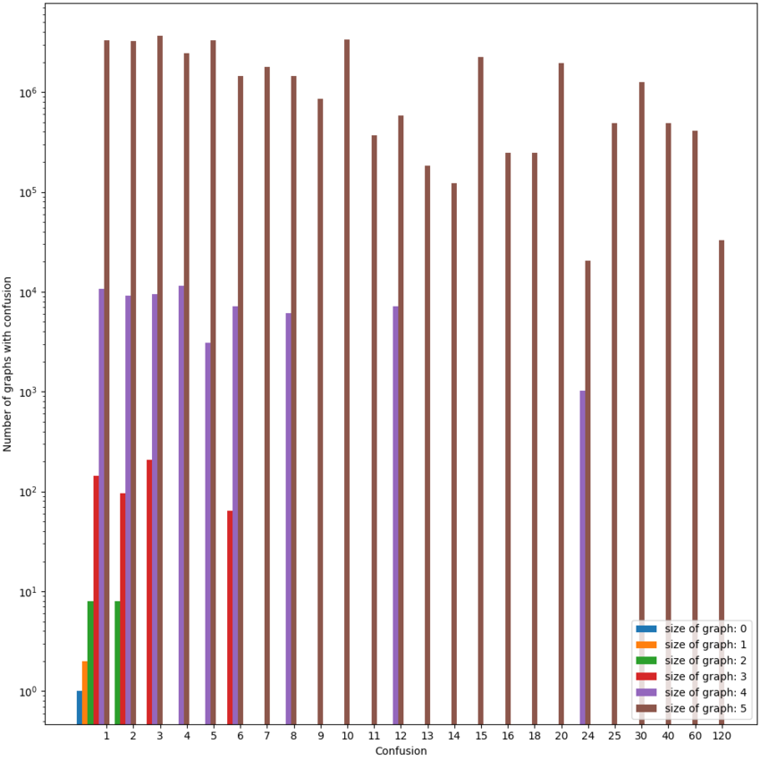

`$|\mathbf{G}_{n,1}|$` is the number of all graphs with `$n$` vertices and
confusion 1, and `$|\mathbf{G}_{n,1}|/n!$` is the same number but up to
isomorphism of the graphs. `$|\mathbf{G}_{n, n!}|$` is the number of
graphs with `$n$` vertices and maximal confusion.

For some given set of directed graphs `$\mathfrak{P}_n$`, not all numbers
between `$1$` and `$n!$` can be confusions. There are, for example,
no graphs of size 3 with confusion 4 (or 5).

| `$n$`   | Samples    | Average confusion   | `$\|\mathbf{G}_{n,1}\|$`     | `$\|\mathbf{G}_{n,1}\|/n!$` | `$\|\mathbf{G}_{n, n!}\|$` |
| ------- | ---------- | ------------------- | -------------------------- | ------------------------- | ------------------------ |
| 0       | 1          | 1                   | 100% (1)                   | 1                         | `$2^0$`                    |
| 1       | 2          | 1                   | 100% (2)                   | 2                         | `$2^1$`                    |
| 2       | 16         | 1.5                 | 50% (8)                    | 4                         | `$2^3$`                    |
| 3       | 512        | 2.625               | 28.125% (144)              | 24                        | `$2^6$`                    |
| 4       | 65536      | `$\approx$` 4.91      | `$\approx$` 16.4% (10752)    | 448                       | `$2^{10}$`                 |
| 5       | 33554432   | `$\approx$` 9.43      | `$\approx$` 9.853% (3306240) | 27552                     | `$2^{15}$`                 |
| 6       | 90927      | `$\approx$` 18.138    | `$\approx$` 6.225% (5660)    | ?[^3]                     | ?                        |
| 7       | 1580       | `$\approx$` 36.412    | `$\approx$` 3.608% (57)      | ?                         | ?                        |

Interestingly, neither `$|\mathbf{G}_{n,1}|$` nor
`$|\mathbf{G}_{n,1}|/n!$` are known integer sequences: a search on the
[OEIS](https://en.wikipedia.org/wiki/On-line_Encyclopedia_of_Integer_Sequences)
and via SuperSeeker [Sloane 2003](https://arxiv.org/pdf/math/0312448)
yield no matching results.

**Conjecture 1**. The average confusion of all directed graphs with size
`$n$` diverges to infinity:

<div>
	$$\underset{n \rightarrow \infty}{\lim} \frac{1}{2^{n^2}} \sum_{i=1}^{n!} |\mathbf{G}_{n,i}| \cdot i=\infty$$
</div>

We attempted to prove this conjecture, but were unable to do so.

**Proposition 2**. `$|\mathbf{G}_{n,1}|$` is always divisible by `$2^n$`.

[*Proof.*](#Proposition_2)

Dividing `$\mathbf{G}_{n,1}$` by both `$n!$` and `$2^n$` yields the
sequence `$1, 1, 1, 3, 28, 861$`, which also doesn't occur in the OEIS,
and also can't be found using SuperSeeker.

##### Applying `HodgeRank`

As seen in the case of **Uniqueness**, this depends on whether one
demands the output of `HodgeResolve` to be a total order: If a weak
ordering is allowed, the output of `HodgeResolve` is always a single
graph, so the output size is polynomial, but if we demand a total order
as an output the output size can be factorial in the number of nodes.

#### Preservation of Consistent Subgraphs

**Definition 5**. For a given `$G =(\Omega, E_P)$`, with `$G \in
\mathfrak{P}_{\Omega}$`, a subgraph `$\mathit{S}_G=(\Xi, E)$` of
`$G$` (with `$\Xi \subseteq \Omega$`, and the set of edges `$E$` of
`$\mathit{S}_G$` being a subset of `$E_P$`) is an **inclusion-maximal
consistent subgraph** of `$G$` if and only if:

-   `$\mathit{S}_G$` is a consistent graph (equivalently an acyclic
    tournament)[^4].
-   `$\mathit{S}_G$` inherits all available edges from `$G$`, that is if
    there are two `$\xi_1, \xi_2 \in \Xi$` and `$(\xi_1, \xi_2) \in E_P$`
    then `$(\xi_1, \xi_2) \in E$` as well.
-   `$\mathit{S}_G$` is inclusion-maximal, that is, there exists no
    `$\omega \in \Omega \backslash \Xi$` so that adding `$\omega$` and its
    edges adjacent to all `$\xi \in \Xi$` to `$\mathit{S}_G$` is still a
    consistent graph.

**Definition 6**. Let `$\mathcal{S}_G$` be the set of all
inclusion-maximal consistent subgraphs of `$G$` and let `$f: \mathfrak{P}
\rightarrow \mathcal{P}(\mathfrak{C})$` be a function that turns any `$G$`
into a set `$\mathbf{C}_G=f(G)$` of consistent graphs. Then `$f$` fulfills
**Preservation of Consistent Subgraphs** if and only if every element of
`$\mathcal{S}_G$` is a subgraph of at least one `$\mathbf{C}_G$`, that is

<div>
	$$\forall \mathit{S} \in \mathcal{S}_G: \exists C \in \mathbf{C}_G: V_{\mathit{S}} \subseteq V_{C} \land E_{\mathit{S}} \subseteq E_{C}$$
</div>

This criterion is quite strong, as we will show. Its intuitive appeal
can be explained as follows: Assume one has overall inconsistent
preferences, but there is some subset of objects one has consistent
preferences over, e.g. an agent has consistent preferences over all
fruit and consistent preferences over dairy products, but inconsistent
preferences over food in general. Then a method for resolving those
inconsistent preferences into consistent ones should "preserve" those
consistent preferences over subsets of options a non-zero amount —
after becoming consistent the agent still has the same preferences over
fruit and dairy product as before.

Furthermore, one can show that there are graphs with an exponential
number of inclusion-maximal consistent subgraphs in the number of nodes.

**Lemma 8**. Let `$G \in \mathfrak{P}_n$` be an arbitrary directed graph
with `$n$` nodes, and let `$\mathcal{S}_G$` be the set of inclusion-maximal
consistent subgraphs of `$G$`. Then there exists no polynomial `$p$` so
that `$\forall G \in \mathfrak{P}_n: |\mathcal{S}_G| \le p(n)$`.

[*Proof.*](#Lemma_8)

##### Minimizing Graph-Edit Distance

`EGEDmin` violates this criterion, which can be easily demonstrated:

**Example 1**.

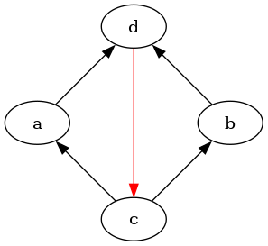

*Counterexample*

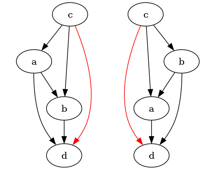

*Counterexample resolved versions*

`$G_c$` above is resolved into two acyclic tournaments, none of which
contain the edge `$d \rightarrow c$`.

The graph `$G_c$` above contains a subgraph
`$\mathit{S}_{cd}=(\{c,d\},\{(c,d)\})$` that is also an inclusion-maximal
acyclic tournament in `$G_c$`. The two acyclic tournaments with the lowest
graph-edit distance (namely 3: reversing the edge `$d \rightarrow c$`
(2 operations) and adding an edge between `$a$` and `$b$`) to `$G_c$`
are shown in the resolved graph. Note that none of them contain
`$\mathit{S}_{cd}$` as a subgraph.

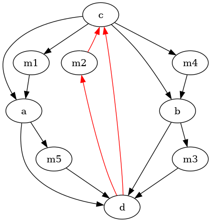

This counter-example can be generalized so that inclusion-maximal
consistent subgraphs with an arbitrary number of nodes `$n$` get reversed:
Each edge `$\omega_1 \rightarrow \omega_2$` of `$G_c$` gets replaced by an
acyclic tournament `$\mathit{T}_i=(\Xi_i, E_i)$` with `$n-2$` vertices,
so that there is an edge from `$\omega_1$` to every `$\xi_i \in \Xi_i$`
and an edge from every `$\xi_i \in \Xi_i$` to `$\omega_2$`. The graph
on the left has confusion 40, and the subgraph emphasized in red is
preserved in none of the outputs of `EGEDmin`.

We also investigated the number of inclusion-maximal consistent
subgraphs preserved by `EGEDmin`. We again did this by analyzing the
outputs of `EGEDmin` for all graphs with five nodes or less, and some
graphs with six or seven nodes.

**Definition 7**. Let `$\text{IMCS}: \mathfrak{P}_n \rightarrow
\mathfrak{P}_{1..n}$` be a function that returns the
**i**nclusion-**m**aximal **c**onsistent **s**ubgraphs for a given graph.

Given a directed graph `$G$`, let `$\mathcal{S}$` be the set of
inclusion-maximal consistent subgraphs of `$G$`. One can now ask: For a
given inclusion-maximal consistent subgraph, how often did that subgraph
occur in the set of outputs `$\mathtt{EGEDmin}(G)$`?

**Definition 8**. Let `$\text{RSP}(S, G)$` (with `$S \in \mathcal{S}$`)
be the **r**atio of **s**ubgraph **p**reservation:

<div>
	$$\text{RSP}_{\mathtt{EGEDmin}}(S, G)=\frac{|\{R \in \mathtt{EGEDmin}(G) | S \text{ subgraph of } R\}|}{|\mathtt{EGEDmin}(G)|}$$
</div>

(No relation to [responsible scaling
policies](https://www.lesswrong.com/posts/jyM7MSTvy8Qs6aZcz/what-s-up-with-responsible-scaling-policies).)

As we saw above, there are graphs with inclusion-maximal consistent
subgraphs `$S$` so that `$\text{RSP}(S)=0$`.

One can then use `$\text{RSP}$` to define a metric that tells us, for a
given graph, how often inclusion-maximal consistent subgraphs were
preserved on average.

**Definition 9**. Let `$\text{AMSP}_{\mathtt{EGEDmin}}(G)$` be the
average, for every inclusion-maximal consistent subgraph `$\mathit{S}$`,
of the number of times `$\mathit{S}$` appears in the output of `EGEDmin`
(**a**verage **m**aximal **s**ubgraph **p**reservation):

<div>
	$$\text{AMSP}_{\mathtt{EGEDmin}}(G)=\frac{1}{|\text{IMCS}(G)|} \sum_{\mathit{S} \in \text{IMCS}(G)} \text{RSP}_{\mathtt{EGEDmin}}(\mathit{S})$$
</div>

Both `$\text{RSP}_{\mathtt{EGEDmin}}$` and
`$\text{AMSP}_{\mathtt{EGEDmin}}$` can be adapted to different
methods for resolution, simply by swapping out the instances of
`EGEDmin` for something else (e.g. `HodgeRank`). By default, I will use
`$\text{RSP}$` and `$\text{AMSP}$` for `$\text{RSP}_{\mathtt{EGEDmin}}$`
and `$\text{AMSP}_{\mathtt{EGEDmin}}$`.

A higher number for AMSP is better: It means that more inclusion-maximal
consistent subgraphs get preserved more often by the method for
resolving inconsistent preferences.

| `$n$` | Samples   | Avg `$\#(\text{IMCS}(G))$`| Avg `$\text{AMSP}(G)$`  | Min `$\text{AMSP}(G)$` | Graphs with `$\text{AMSP}(G)=1$` |
|-------|-----------|---------------------------|-------------------------|------------------------|----------------------------------|
| 0     | 1         | 1                         | 1                       | 1                      | 1 (100%)                         |
| 1     | 2         | 1                         | 1                       | 1                      | 2 (100%)                         |
| 2     | 16        | 1.125                     | 1                       | 1                      | 16 (100%)                        |
| 3     | 512       | `$\approx$` 1.32          | `$\approx$` 0.995       | 2/3                    | 496 (`$\approx$` 98.4%)          |
| 4     | 65536     | `$\approx$` 1.568         | `$\approx$` 0.984       | 0                      | 57728 (`$\approx$` 94.4%)        |
| 5     | 33554432  | `$\approx$` 1.864         | `$\approx$` 0.969       | 0                      | 7803263 (`$\approx$` 80.1%)      |
| 6     | 90927     | `$\approx$` 2.207         | `$\approx$` 0.95        | 0                      | 72209 (`$\approx$` 79.4%)        |
| 7     | 1580      | `$\approx$` 2.618         | `$\approx$` 0.932       | 0                      | 1095 (`$\approx$` 69.3%)         |

One can see that the average number of inclusion-maximal consistent
subgraphs increases, albeit initially slowly. The number of times that
maximal consistent subgraphs are preserved (Avg `$\text{AMSP}(G)$`) starts
dropping, though the shrinking behavior isn't clear from the limited
amount of data. The number of graphs in which all inclusion-maximal
consistent subgraphs are preserved by `EGEDmin` shrinks even more
quickly, indicating that preserving all consistent subgraphs is a
property that is difficult to fulfill.

Only for small graphs (up to 3 vertices) it is guaranteed that at least
one inclusion-maximal consistent subgraph occurs in the output of
`EGEDmin`.

So we can pose some conjectures indicated by the datapoints observed
above:

**Conjecture 2**. In the limit of graph size, on average `EGEDmin`
preserves almost none of the inclusion-maximal consistent subgraphs:

<div>
	$$\underset{n \rightarrow \infty}{\lim} \frac{1}{|\mathfrak{P}_n|} \sum_{G \in \mathfrak{P}_n} \text{AMSP}(G)=0$$
</div>

**Conjecture 3**. For graphs with `$>7$` nodes it remains the case that
there are graphs for which the smallest number of inclusion-maximal
consistent subgraphs preserved by `EGEDmin` is zero:

<div>
	$$\underset{n \rightarrow \infty}{\lim} \min_{G \in \mathfrak{P}_n} \text{AMSP}(G)=0$$
</div>

**Conjecture 4**. In the limit of number of nodes in a graph, for almost
no graphs does `EGEDmin` preserve all inclusion-maximal consistent
subgraphs.

<div>
	$$\underset{n \rightarrow \infty}{\lim} \frac{1}{|\mathfrak{P}_n|} |\{G \in \mathfrak{P}_n | \text{AMSP}(G)=1\}|=0$$
</div>

##### Applying `HodgeRank`

If the output of `HodgeResolve` is allowed to be a weak ordering, then
the original definition of **Preservation of Consistent Subgraphs** does
not apply, as it presumes a mapping `$f$` from `$\mathfrak{P}$` to
`$\mathfrak{C}$`. However, the definition can easily be transferred by
defining `$f$` as a function from directed graphs to weakly consistent
graphs, that is `$f: \mathfrak{P}_{\Omega} \rightarrow
\mathfrak{W}_{\Omega}$`. The definition of **Preservation of Consistent
Subgraphs** stays otherwise unchanged[^5].

`HodgeResolve` does not fulfill **Preservation of Consistent
Subgraphs**. The following figure shows two graphs (both on the left
in their respective subfigures). For the graph in the left subfigure no
inclusion-maximal consistent subgraphs are preserved, for the right one
all but one inclusion-maximal consistent subgraphs are preserved.

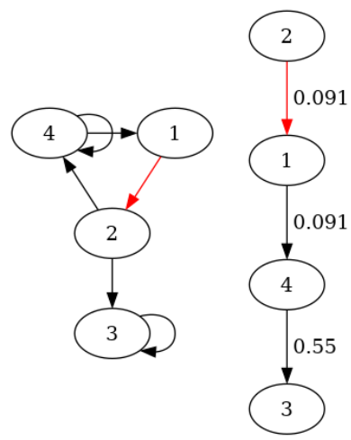

*`$1 \rightarrow 2$` is the only consistent subgraph, but it gets reversed.*

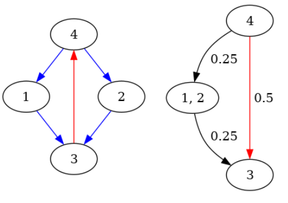

*Each edge is an inclusion-maximal consistent subgraph, and only the edge `$3 \rightarrow 4$` gets reversed. 1 and 2 in the result have the same potential.*

In the first image, a graph with 1 inclusion-maximal consistent subgraph
and its resolution through `HodgeResolve`, and in the second image a graph
with several inclusion-maximal consistent subgraphs and its resolution
through `HodgeResolve`. The labels at the edges are the gradients that
`HodgeRank` has computed.

In the following table, `$\text{AMSP}$` refers to
`$\text{AMSP}_{\mathtt{HodgeResolve}}$`, and `$\text{IMCS}$` refers to
`$\text{IMCS}_{\mathtt{HodgeResolve}}$`.

| `$n$`  |Samplesize  |Avg `$\#(\text{IMCS}(G))$`|Avg `$\text{AMSP}(G)$`  |Min `$\text{AMSP}(G)$`  |Graphs with `$\text{AMSP}(G)=1$`  |
| -----|------------|--------------------------|----------------------|----------------------|--------------------------------|
| 0    |1           |1                         |1                     |1                     | 1 (100%)                       |
| 1    |2           |1                         |1                     |1                     | 2 (100%)                       |
| 2    |16          |1.125                     |1                     |1                     | 16 (100%)                      |
| 3    |512         |`$\approx$` 1.32            |`$\approx$` 1           |1                     | 512 (100%)                     |
| 4    |65536       |`$\approx$` 1.568           |`$\approx$` 0.978       |0                     | 63232 (`$\approx$` 96.5%)        |
| 5    |33554432    |`$\approx$` 1.864           |`$\approx$` 0.932       |0                     | 29373632 (`$\approx$` 87.5%)     |
| 6    |65536       |`$\approx$` 2.209           |`$\approx$` 0.879       |0                     | 49680 (`$\approx$` 75.8%)        |
| 7    |65536       |`$\approx$` 2.612           |`$\approx$` 0.831       |0                     | 41926 (`$\approx$` 63.9%)        |
| 8    |65536       |`$\approx$` 3.064           |`$\approx$` 0.783       |0                     | 34227 (`$\approx$` 52.2%)        |
| 9    |65536       |`$\approx$` 3.567           |`$\approx$` 0.738       |0                     | 27138 (`$\approx$` 41.4%)        |
| 10   |65536       |`$\approx$` 4.13            |`$\approx$` 0.701       |0                     | 21349 (`$\approx$` 32.6%)        |

With this data, the next plot shows how well `EGEDmin` and `HodgeResolve`
perform at preserving inclusion-maximal consistent subgraphs.


*Comparing `EGEDmin` and `HodgeResolve` at how well they perform on
various metrics of preserving inclusion-maximal consistent subgraphs.*

One can see that on average, `EGEDmin` preserves inclusion-maximal
consistent subgraphs more often, and may also retain all
inclusion-maximal consistent subgraphs more often (although the low
sample sizes for graphs with six and seven nodes makes this difficult to
conclude without doubt).

### Preservation of Completely Dominating and Dominated Set

Inclusion-maximal consistent subgraphs are a way of formalizing
what it means for a preference to be *locally* consistent:
there is some subset of `$\Omega$` so that the preferences are
not "confused" about this subset. One can also try to find
a corresponding condition that would make a statement about
*global* consistency. Voting theory offers some inspiration
here: the **minimal undominated set** (also **Condorcet set**) [Miller
1977](./doc/voting_theory/graph_theoretical_approaches_to_the_theory_of_voting_miller_1977.pdf)
is defined for every tournament `$T=(V_T, E_T)$` as a set of vertices
`$V^*\subseteq V_T$` so that (1) there is no edge from `$V_T \backslash
V^*$` to `$V^*$` and (2) there is no proper subset of `$V^*$` that meets
(1).

One can create a related (but weaker) definition for directed graphs:

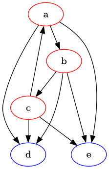

For a given `$G$`, let `$\Sigma_1, \Sigma_2$` be non-empty sets of vertices
of `$G$` such that `$\Sigma_1 \uplus \Sigma_2=\Omega$`. Then `$\Sigma_1$` is a
**completely dominating set** and `$\Sigma_2$` is a **completely dominated
set** if and only if `$\forall \sigma_1
\in \Sigma_1, \sigma_2 \in \Sigma_2: (\sigma_1, \sigma_2) \in E \land
(\sigma_2, \sigma_1) \not \in E$`.

This means that all elements in a completely dominating set are strictly
preferred to all elements in a completely dominated set—there is a
subset of options that are clearly better than all other options.

A change from the Condorcet set is that we don't demand the completely
dominating set to be minimal (which would always make the empty set the
completely dominating set). Additionally, the completely dominating set
is not unique: In an acyclic tournament, for `$1 \le i \le |\Omega|$`
the `$i$` greatest elements form a dominating set.

A completely dominating set then represents a global consistency in the
preference: within `$\Sigma_1$` and `$\Sigma_2$` we are unsure about our
preference, but we know that any element of `$\Sigma_1$` is better than
any element of `$\Sigma_2$`.

**Definition 10**. A function `$f: \mathfrak{P} \rightarrow
\mathcal{P}(\mathfrak{C})$` fulfills **Preservation of Complete
Domination** if and only if for any directed graph `$G$` with a completely
dominating set `$\Sigma_1$` and a completely dominated set `$\Sigma_2$`
it holds that `$\forall C \in f(G)$` the set of nodes `$\Sigma_1$`
is a completely dominating set of `$\Sigma_2$` in `$C$`.

**Proposition 3**. Let `$f$` be a function that fulfills **Preservation
of Complete Domination**. If for a graph `$G$` there are `$n$` sets
of vertices `$\Sigma_1, \dots, \Sigma_n$` so that `$\biguplus_{i=1}^n
\Sigma_i=\Omega$` and

<div>
	$$\forall c \in \{1, \dots, n\}: \bigcup_{i=1}^c \Sigma_i \text{ completely dominates } \bigcup_{j=c+1}^n \Sigma_j$$
</div>

then for any `$C\in f(G)$` with `$C=(\Omega, E_C)$` it holds that `$\forall
1<j<k<n: \forall \sigma_j \in \Sigma_j, \sigma_k \in \Sigma_k: (\sigma_j,
\sigma_k) \in E_C \land (\sigma_k, \sigma_j) \not \in E_C$` (or, less
formally, every element from a subset of a completely dominating set is
strictly preferred over any element from a subset of a completely
dominated set in the output of the resolution function `$f$`).

[*Proof.*](#Proposition_3)

**Remark 1**. Sets of such `$\Sigma_1, \dots, \Sigma_n$` such that there
is a relationship of complete domination between any two of them are
quite similar to graph quotients, but is somewhat stricter (demanding
that each `$\sigma_i \in
\Sigma_i$` be preferred to each other `$\sigma_j \in \Sigma_j$`).

**Remark 2**. Preservation of complete domination implies some other
criteria: If there is a consistent subgraph which is a completely
dominating set, then it will comprise the "greatest" subgraph in the
resolved preference, with the greatest element in `$G$` also being the
greatest element in `$f(G)$`. The same holds for the a completely
dominated consistent subgraph, which stays at the bottom.

#### Minimizing Graph-Edit Distance

**Theorem 9**. `EGEDmin` fulfills **Preservation of Complete Domination**.

[*Proof.*](#Theorem_9)

#### Applying `HodgeRank`

**Conjecture 5**. `$\mathtt{HodgeResolve}(G)$` fulfills **Preservation
of Complete Domination** for every `$G \in \mathfrak{P}$`.

This conjecture holds for all directed graphs with 5 nodes or less, by
computational experiment, and for random samples of graphs (`$2^{16}$`
graphs generated for each number of nodes, using the [Erdős-Rényi
model](https://en.wikipedia.org/wiki/Erdos-Renyi_model) with the
probability `$\frac{1}{2}$` of edge creation) with up to 13 nodes.

### Summary

We can now summarize how well the two algorithms fulfill the different
criteria:

| Criterion                              |  `EGEDmin`  |  `HodgeResolve`     |
| -------------------------------------- | ----------- | --------------------|
| Surjectivity                           | ✓           | ✓                   |
| Identity                               | ✓           | ✓                   |
| Worst-case computational complexity    | `$NP$`-hard   | `$\mathcal{O}(n^3)$`  |
| Uniqueness                             | ✗           | ~[^8]               |
| Polynomial output size                 | ✗           | ~                   |
| Preservation of consistent subgraphs   | ✗           | ✗                   |
| Preservation of complete domination    | ✓           | ?                   |

### Impossibilities

Some of the criteria listed in Section 3.3 are incompatible with each
other.

#### Resolution to Polynomially Many Preferences and Preservation of Consistent Subgraphs are Incompatible

It is not possible to have an algorithm that retains every maximal
consistent subgraph at least once in the set of outputs and has only
polynomially many outputs.

**Theorem 10**. Let `$f: \mathfrak{P} \rightarrow \mathcal{P}(\mathfrak{C})$` be a function
for resolving inconsistent graphs that fulfills **Preservation of
Consistent Subgraphs** for all graphs `$\mathfrak{P}$`. Then there exists
no polynomial `$p$` so that for all directed graphs `$\mathfrak{P}_n$` of
size `$n$` it holds that
`$\forall P_n \in \mathfrak{P}_n: |f(P_n)| \le p(n)$`.

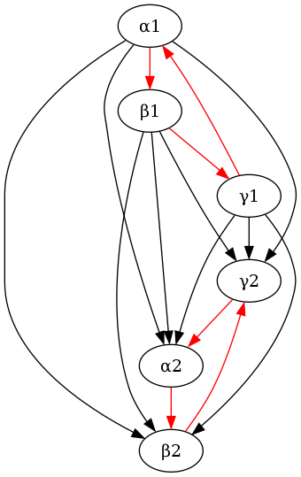

We show this with a graph that is a counterexample, i.e. for which such
a polynomial can not exist.

**Definition 11**. Let `$\mathit{V}$` denote a directed graph with three
vertices `$\alpha, \beta, \gamma$` and three edges
`$\alpha \rightarrow \beta, \beta \rightarrow \gamma, \gamma \rightarrow \alpha$`.
Let now denote `$E_n$` be a graph that is constructed out of `$n$` copies of
`$\mathit{V}$`, "stacked" on top of each other. More formally, let the
vertices of `$E_n$` be the set `$\{\alpha_1,
\ldots, \alpha_n, \beta_1, \ldots, \beta_n, \gamma_1, \ldots, \gamma_n\}$`
so that `$\alpha_i, \beta_i, \gamma_i$` are the vertices of the graph
`$\mathit{V}_i$`, and the edges of `$E_n$` are the edges of each
`$\mathit{V}_i$` and the edges
`$\{(u_i, v_j) | i>j \land u, v \in \{\alpha, \beta, \gamma\}\}$`.

We first prove that each inclusion-maximal consistent subgraph of `$E_n$`
only contains one edge from each `$\mathit{V}_i$`.

**Lemma 11**. Every inclusion-maximal consistent subgraph `$V$` of `$E_n$`
contains exactly one edge from each
`$\mathit{V}_i \in \{\mathit{V}_1, \dots, \mathit{V}_n\}$`.

[*Proof.*](#Lemma_11)

We then show that any consistent graph on the vertices of `$E_n$` can not
contain `$2^n+1$` inclusion-maximal consistent subgraphs of `$E_n$`.

**Lemma 12**. Let `$\mathcal{S}$` be a set of inclusion-maximal consistent
subgraphs of `$E_n$`, and `$|\mathcal{S}|=2^n+1$`. Then there exists no
consistent graph `$C$` on the vertices of `$E_n$` so that `$\forall S
\in \mathcal{S}: S \text{ is a subgraph of } C$`.

[*Proof.*](#Lemma_12)

We can now show that the set of consistent graphs that contain all
inclusion-maximal consistent subgraphs of `$E_n$` grows exponentially in
`$n$` (albeit with a small exponent).

**Lemma 13**. The set of consistent graphs `$\mathbf{C}$` on the vertices
of `$E_n$` that includes all inclusion-maximal consistent subgraphs of
`$E_n$` has size at least `$(\frac{3}{2})^n$`.

[*Proof.*](#Lemma_13)

Therefore, Theorem 10 is true.

**Corollary 1**. There is no polynomial `$p$` and function `$f: \mathfrak{P}
\rightarrow \mathcal{P}(\mathfrak{C})$` such that `$|f(E_n)|\le p(n)$` and
`$f$` fulfills **Preservation of Consistent Subgraphs**, so **Theorem**
10 is true (with `$E_n$` as a counterexample).

**Remark 3**. This bound is
`$(\frac{3}{2})^{\frac{v}{3}}=\sqrt[3]{\frac{3}{2}}^v \approx 1.145^v$`
for the number of vertices `$v$` in `$E_v$`, which is exponential but
can probably be improved upon.

#### Polynomial Time Complexity and Preservation of Consistent Subgraphs are Incompatible

Given that in the worst case, only a small proportion of consistent
subgraphs can be preserved, it also is not possible to have an algorithm
that returns, for each inclusion-maximal consistent subgraph
`$\mathit{S}$`, at least one consistent graph that contains `$\mathit{S}$`,
*and* computes its output in polynomial time.

**Theorem 14**. Let `$\mathtt{A}$` be an algorithm for resolving
inconsistent graphs that implements an `$f$` which fulfills **Preservation
of Consistent Subgraphs** for all graphs `$G \in \mathfrak{P}$`. Then
there exists no polynomial `$p$` so that for all directed graphs
`$P_n \in \mathfrak{P}_n$` of size `$n$` it holds that `$\mathtt{A}(P_n)$`
computes its output in less than `$p(n)$` steps.

[*Proof.*](#Theorem_14)

**Remark 4**. The set of inclusion-maximal consistent subgraphs on
`$E_n$` can be compactly represented as the Cartesian product of the
inclusion-maximal consistent subgraphs of the "levels" `$V_i$`:

<div>
	$$\newcommand{\bigtimes}{\mathop{\Large\times\normalsize}} \bigtimes_{i=1}^n \{\alpha_i \rightarrow \beta_i, \beta_i \rightarrow \gamma_i, \gamma_i \rightarrow \alpha_i\}$$
</div>

This might also allow for a compact representation of the result of `$f$`
which includes all inclusion-maximal consistent subgraphs. We suspect
there are counter-examples that don't allow for this, but haven't been
able to find any.

## Inconsistent Preferences over Lotteries

Von Neumann and Morgenstern formulate their famous theorem by defining
some restriction on relations over lotteries [von Neumann & Morgenstern
1947](https://www.goodreads.com/book/show/483055.Theory_of_Games_and_Economic_Behavior),
as explained in [this section](#The_von_NeumannMorgenstern_Axioms).

Finding a mathematical structure which can encode all inconsistent
preferences over lotteries *and* is still computationally tractable
remains an open problem, but we propose two structures which can either
tractably encode some subset of inconsistent preferences or are rich
enough to encode all inconsistent preferences, but too complex to be
compactly represented.

### Violating the Axioms

Introducing lotteries allows for a large variety of violations of the
von Neumann-Morgenstern axioms.

#### Discontinuity

Discontinuity in relations over lotteries can occur if we know that
`$l_1 \preceq l_2 \preceq l_3$`, but there is no `$p$` so that `$l_2 \sim
[p: l_1, (1-p): l_3]$`. A discontinuous preference that fulfills `$l_1
\preceq l_2 \preceq l_3$` could then state that for every `$p \in (0;1]$`
it holds that `$l_2 \succ [p: l_1, (1-p): l_3]$` but `$l_2 \prec l_3$`:
the lottery `$l_2$` is strictly preferred over any mixture of `$l_1,
l_3$`, but `$l_3$` is still strictly preferred to `$l_2$`. The equivalent
can occur if `$l_2$` is strictly dispreferred to any mixture of `$l_1,
l_3$`, but strictly preferred over `$l_1$`.

In humans, this can sometimes be observed as the [certainty
effect](https://en.wikipedia.org/wiki/Certainty_effect) from
[prospect theory](https://en.wikipedia.org/wiki/Prospect_Theory),
in which subjects systematically overrate the value of
certain (deterministic) option, which leads to the [Allais
paradox](https://en.wikipedia.org/wiki/Allais_Paradox).

A view under which discontinuities of this type make sense is if an
agent has a specific aversion to lotteries, irrespective of the options
they are comprised of (Von Neumann and Morgenstern call the continuity
axiom "excluding a "utility of gambling"" [von Neumann & Morgenstern 1947,
3.7.1](https://www.goodreads.com/book/show/483055.Theory_of_Games_and_Economic_Behavior),
and state that "concepts like a "specific utility of gambling" cannot
be formulated free of contradiction on this level." \[ibid.\]).

#### Dependence

Violations of the independence axiom ("dependence") occur if for two
lotteries `$l_1, l_2$` (with `$l_1 \preceq l_2$`) there is an option
`$l_3$` and a `$p \in [0; 1]$` so that `$[p: l_1, (1-p): l_3] \succ [p:
l_2, (1-p): l_3]$`: Mixing in `$l_3$` in equal proportion to both `$l_1,
l_2$` causes the preference to switch.

Together with a strong preference for certainty it is observed in
the [Allais paradox](https://en.wikipedia.org/wiki/Allais_Paradox):
In experiments with humans, the lottery `$A_1=[1: \$1 \text{mio.}]$`
is strictly preferred over the lottery `$B_1=[0.89: \$1 \text{mio.},
0.01: \$0, 0.1: \$5 \text{mio.}]$`, but the lottery `$B_2=[0.9: \$0,
0.1: \$5 \text{mio.}]$` is strictly preferred over `$A_2=[0.89: \$0,
0.11: \$1 \text{mio.}]$`.

By using the independence axiom, these two preferences can be shown to
be contradictory. This can be done by first "mixing out" 0.89 of \$1mio.
from `$A_1$` and `$B_1$`, that is representing `$[1: \$1 \text{mio.}]$` as
`$[0.89: \$1 \text{mio.}, 0.11: \$1 \text{mio.}]$` and then (by
independence) dropping `$0.89: \$1 \text{mio.}$` from `$A_1$` and `$B_1$`, and
then re-normalizing the probabilities so that they sum to 1. One can
then "mix in" 0.89 of \$0 into the two resulting distributions to create
`$A_2$` and `$B_2$`, so under the von Neumann-Morgenstern axioms `$A_1
\prec B_1$` and `$B_2 \prec A_2$` contradict each other.

<div>
	$$\begin{aligned}
	& A_1 \prec B_1 \\
	\Leftrightarrow & [1: \$1 \text{mio.}] \prec [0.89: \$1 \text{mio.}, 0.01: \$0, 0.1: \$5 \text{mio.}] \\
	\Leftrightarrow & [0.89: \$1 \text{mio.}, 0.11: \$1 \text{mio.}] \prec [0.89: \$1 \text{mio.}, 0.01: \$0, 0.1: \$5 \text{mio.}] \\
	\Leftrightarrow & [1: \$1 \text{mio.}] \prec [1/11: \$0, 10/11: \$5 \text{mio.}] \\
	\Leftrightarrow & [0.89: \$0, 0.11: \$1 \text{mio.}] \prec [0.9: \$0, 0.1: \$5 \text{mio.}] \\
	\Leftrightarrow & A_2 \prec B_2
	\end{aligned}$$
</div>

### Representing Inconsistencies

It is more difficult to find a mathematical structure to represent
arbitrary inconsistent preferences over lotteries over some set of
options `$\Omega$`.

#### Edge-Weighted Graphs

Given `$\Omega$`, some inconsistent preferences on lotteries on `$\Omega$`
can be represented by the set `$\mathfrak{G}_{\Omega}$` of edge-weighted
directed graphs on `$\Omega$`, where edge weights of a graph `$G$` can
be expressed as the values of a function `$w_G: \Omega \times \Omega
\rightarrow \mathbb{R}$`.

**Definition 12**. The subset `$\mathfrak{S}_{\Omega} \subset
\mathfrak{G}_{\Omega}$` of consistent preferences on `$\Omega$` is
the set of all edge-weighted directed graphs that is **complete**,
**transitive**, **irreflexive** and **weight-transitive**, where
a graph is weight-transitive if for all edges `$e \in E$` it holds
that `$w_G(\alpha \rightarrow \beta)=c_1 \land w_G(\beta \rightarrow
\omega_3)=c_2 \Rightarrow w_G(\alpha \rightarrow \omega_3)=c_1+c_2$`.

An element from `$\mathfrak{S}_{\Omega}$` assigns each element from
`$\Omega$` a cardinal value, equivalent to a utility function on
`$\Omega$`.

Edge-weighted directed graphs on `$\Omega$` are not expressive enough to
represent all relevant inconsistent preferences, though. As a trivial
example, let `$l_1=[0.25: \alpha, 0.75: \beta]$` and `$l_2=[0.75: \alpha,
0.25: \beta]$` with `$l_1 \prec l_2$`, but `$l_3=[0.3: \alpha, 0.7: \beta],
l_4=[0.7: \alpha, 0.3: \beta]$` with `$l_3 \succ l_4$`. The first
preference implies a positive weight for the edge
`$\alpha \rightarrow \beta$`, but the second preference implies a negative
weight for `$\alpha \rightarrow \beta$`.

Introducing two positively weighted edges between `$\alpha, \beta$`
(creating a two-cycle) is able to represent that such a preference
between lotteries *is* present, but it doesn't allow reconstruction of
which lotteries are preferred over which others: Given a preference of
`$\alpha$` over `$\beta$` by `$w_l$`, and of `$\beta$` over `$\alpha$` by
`$w_r$` doesn't enable reconstruction of whether `$l_1 \prec l_2$` or
`$l_1 \succ l_2$`.

#### Arbitrary Relations over the Lotteries

As [von Neumann & Morgenstern
1947](https://www.goodreads.com/book/show/483055.Theory_of_Games_and_Economic_Behavior)
uses lotteries on `$\Omega$` as the set of options over which agents
can have preferences, a natural instinct is to use arbitrary relations
over lotteries on `$\Omega$` as the mathematical object to represent
preferences.

However, if `$\Omega$` has at least one element, such a relation can be
uncountably large and without compact representation, making it
impossible to be handled computationally.

**Example 2**. A pathological example would be a relation `$\mathcal{R}
\in \Delta(\Omega) \times \Delta(\Omega)$` on probability distributions
of `$\Omega=\{\alpha, \beta\}$` in which `$[p: \alpha, (1-p): \beta]
\prec [q: \alpha, (1-q): \beta]$` if and only if `$p \in [0;1]$` is an
uncomputable real number and `$q \in [0;1]$` is a computable real number.

We were also unable to find a method for resolving such inconsistent
preferences into their consistent versions.

### Algorithms

After some search, we were able to identify `HodgeRank` from [Jiang et al.
2011](./doc/preference/statistical_ranking_and_combinatorial_hodge_theory_jiang_et_al_2011.pdf)
as a candidate algorithm for resolving an edge-weighted inconsistent
graph into an edge-weighted consistent graph.

Some other possible candidates for methods for resolving inconsistent
preferences over edge-weighted graphs were considered, and finally
rejected.

One option was the [`PageRank`](https://en.wikipedia.org/wiki/PageRank)
algorithm, also mentioned in [Sun et al.
2017](./doc/preference/breaking_cycles_in_noisy_hierarchies_sun_et_al_2017.pdf "Breaking Cycles in Noisy Hierarchies").
We rejected PageRank for the same reason as [Sun et al.
2017](./doc/preference/breaking_cycles_in_noisy_hierarchies_sun_et_al_2017.pdf "Breaking Cycles in Noisy Hierarchies")
did: In a directed acyclic graph, a unique greatest element does
not necessarily receive the highest ranking. This problem extends
to using other centrality measures for graphs such as [degree
centrality](https://en.wikipedia.org/wiki/Degree_centrality)
and [betweenness
centrality](https://en.wikipedia.org/wiki/Betweenness_centrality): In
graphs that are already consistent, the greatest element usually receives
a low centrality score, and elements closer to the center receive larger
scores, which is counter to our criteria.

#### `HodgeRank`

`HodgeRank`, introduced in [Jiang et al. 2011](./doc/preference/statistical_ranking_and_combinatorial_hodge_theory_jiang_et_al_2011.pdf), is an
algorithm based on Hodge theory from algebraic geometry for decomposing
a doubly edge-weighted, potentially not fully connected graph
`$G=(\Omega, E, w: E \rightarrow
\mathbb{R} \cup \{\mathtt{nan}\}, l: E \rightarrow \mathbb{N}\})$` into
the sum of three different edge weighted graphs:

-   A gradient graph `$G_g=(\Omega, E, w_g: E \rightarrow \mathbb{R})$`,
    in which `$w_g$` is derived from a potential function that assigns
    consistent values to vertices `$\omega \in \Omega$`: the potential
    `$p: \Omega \rightarrow \mathbb{R}$` of a node has a value so that
    `$g(e=(\omega_i, \omega_j))=p(\omega_j)-p(\omega_i)$`.
-   A curl graph `$G_c=(\Omega, E, w_c: E \rightarrow \mathbb{R})$`, where
    a function `$c$` assigns every 3-cycle in the graph a specific value,
    and the value `$w_c(e)$` for an edge is the sum of the values `$c$`
    assigns to all the 3-cycles `$e$` is in.
-   A harmonic graph `$G_h=(\Omega, E, w_h: E \rightarrow \mathbb{R})$`.

Then `$w(e)=w_g(e)+R(e)=w_g(e)+w_c(e)+w_h(e)$`, where `$R$` is a residual.

[Jiang et al. 2011](./doc/preference/statistical_ranking_and_combinatorial_hodge_theory_jiang_et_al_2011.pdf) develop `HodgeRank` from a social-choice
theoretic perspective: Given a set of incomplete cardinal ratings
`$\mathcal{C}$` of the type
`$(\mathbb{R} \cup \{\mathtt{nan}\})^{n \times m}$` by a set
`$V=\{1, \dots, m\}$` of voters on `$A=\{1, \dots, n\}$` alternatives, one
can construct an edge-weighted graph `$G_{\mathcal{C}}=(\Omega, E, w, l)$`
where the nodes are the options `$A$` and each edge weight is some
combination of the cardinal votes on the options `$\omega_1, \omega_2$`
that comprise the edge.

An edge weight can be for example the arithmetic mean

<div>
	$$w_{\mathcal{C}}(\omega_1 \rightarrow \omega_2)=\frac{\sum_{i=1}^n \mathcal{C}_{i, \omega_2}-\mathcal{C}_{i, \omega_1}}{|\{n|\mathcal{C}_{n, \omega_1}, \mathcal{C}_{n, \omega_2} \text{ both } \not=\mathtt{nan}\}|}$$
</div>

though [Jiang et al
2015](./doc/preference/statistical_ranking_and_combinatorial_hodge_theory_jiang_et_al_2011.pdf)
also discuss using other methods such as the geometric mean or the ratio
of preference to dispreference.

If every voter assigns `nan` to both `$\omega_1$` and `$\omega_2$`,
there is no edge between the two options.

The function `$l: E \rightarrow \mathbb{R}$` denotes the number of voters
which have a non-`nan` rating for both nodes in the edge. In the case
where we do not take the social choice view, we can assume that
`$\forall e \in E: l(e)=1$`, which does not change the process of
computing the output of `HodgeRank`.

	function HodgeRank(G) # G is a tuple (Ω, E, w, l)
		Revert all e∈E with w(e)<0 so thay they now have positive weight.
		f=(w(e₁, …, w(eₖ))
		L=diag(l(e₁), …, l(eₖ))
		O=zeros(|E|, |Ω|)
		for (u,v) in E
			O_eu=-1, O_ev=1
		s=-(O.T×L×O)⁺×O.T×L×f # A⁺ is the Moore-Penrose pseudo-inverse of A
		return s

*Computing `HodgeRank` from an edge-weighted directed graph*

This pseudocode is implemented in Python [here](./hodge.html).

**Remark 5**. One might ask, under the social choice view, whether it
makes sense for some voter `$v \in V$` to lie about their preferences
over `$A$` in order to change the output of `HodgeRank` to correspond
to their own ranking ordinally. In fact this is the case and therefore
`HodgeRank` is not strategy-free.

It is easy to find an example for this: Assume there are three options
`$A=\{a,b,c\}$`, and three voters `$V=\{1,2,3\}$`, and let the cardinal
values assigned to the options be `$u_1(a)=4, u_1(b)=3, u_2(b)=4,
u_2(c)=3, u_3(c)=4, u_3(a)=3$`, with the rest of the values assigned to
the options being `nan`. Then the values `HodgeRank` assigns to the
options are `$h(a)=h(b)=h(c)=0$`. But voter 1 can change their reported
assignments to be `$u_1'(a)=5, u_1'(b)=3, u_1'(c)=1$`, changing the
outputs of `HodgeRank` to `$h'(a)=1, h'(b)=0$` and `$h'(c)=-1$`, which is
more compatible with their preferences.

It would be interesting to investigate the computational complexity of
finding manipulations of existing preference of one voter to ordinally
change the output of `HodgeRank` to more strongly conform to that
voters' preferences.

Besides the disadvantage of allowing for strategic manipulation, the
decomposition returned by `HodgeRank` appears to display many desirable
properties as a method for resolving inconsistent preferences over
edge-weighted graphs:

-   **Existence**: It always exists.
-   **Uniqueness**: This decomposition is unique up to an additive constant.
-   **Polynomial time computability**: Finding `$w_g$` is equivalent to
solving an `$|V| \times |V|$` least-squares problem, which can be
solved in `$\mathcal{O}(n^3)$` time, for example by computing the
[Moore-Penrose pseudo-inverse](https://en.wikipedia.org/wiki/Moore–Penrose_inverse) of a specific matrix. Finding `$w_h$` and `$w_c$`
from `$R$` is more computationally intensive, but still polynomial:
they are equivalent to solving a least-squares problem of size
`${|V| \over 3} \approx \mathcal{O}(n^3)$`, and can therefore be found
in `$\mathcal{O}(n^9)$`.
-   **Robustness to incomplete and cyclic data**: `HodgeRank` still
returns a result, even if edges are missing or there are
positive-valued cycles in the data.
-   **Relation to known solution concepts from social choice theory**:
If `$G$` has no missing edges and `$w$` is defined for every edge,
`HodgeRank` returns an affine transformation of the result that the
Borda count would return.

In the context of inconsistent preferences, `HodgeRank` can be
interpreted as taking the observed preferences of an agent as an
edge-weighted directed graph, and decomposing it so that the potential
function `$p$` determines how much the agent values different
elements in `$V$`. Here `$p$` can act as a utility function. The
social-choice theoretic perspective offers an intriguing possibility
of modeling agents as being comprised of subagents [Demski & Garrabrant
2019](./doc/cs/ai/alignment/agent_foundations/embedded_agency_demski_garrabrant_2020.pdf),
[Minsky
1988](https://www.goodreads.com/book/show/326790.The_Society_of_Mind),
which we will not pursue further here.

#### Sondej Sampling

## Ontology Identification, Ontological Shifts and Ontological Crises

Equipped with a notion of how to represent inconsistent preferences and
how to resolve them, one can examine problems that have come up in other
contexts and apply the knowledge gained to them. I will examine one of
those: The problem of changing a preference as the underlying set of
options changes.

The term "ontological crisis" was introduced in de Blanc
and intuitively refers to a scenario in which an agent has
preferences, defined over some world model, and then the world
model changes without corresponding changes in the values [de Blanc
2011](./doc/cs/ai/alignment/ontological_crises/ontological_crises_in_artificial_agents_value_systems_de_blanc_2011.pdf).

An example of this can be observed in human values before and after
exposure to philosophy: A human might have a value they would formulate as
"I value the continuation of my life". However, after reading [Reasons
and Persons](https://en.wikipedia.org/wiki/Reasons_and_Persons), the
view of personal identity that justifies a notion of "continuation" might
seem much less defensible, as thought experiments around teleportation,
the fusion and fission of persons, gradual replacement of the body or
atom-by-atom recreation of the body all undermine the concept of a single
fixed personal identity.

However, this person would likely not just give up their value of their
continued existence, but instead attempt to "port it" to the new world
model.

Soares and Fallenstein motivate the problem of ontological crises in
the context of a problem they call **Ontology Identification**: Given
a Turing machine using the atomic model of physics, they ask how one
can identify which parts of the program and the tape represent atoms
or macroscopic objects, and repeat the question for a Turing machine
using a quantum-mechanical model of the world [Soares & Fallenstein
2017](./doc/cs/ai/alignment/agent_foundations/agent_foundations_for_aligning_machine_intelligence_soares_fallenstein_2017.pdf).
The problem is further elaborated on
outside of the academic literature early in [Dai
2012](https://www.lesswrong.com/s/kjcioCkqSSS4LiMAe/p/KLaJjNdENsHhKhG5m)
and [Dai
2019](https://www.lesswrong.com/s/kjcioCkqSSS4LiMAe/p/6RjL996E8Dsz3vHPk),
in [Yudkowsky et al. 2016](https://arbital.com/p/rescue_utility/)
and [Andreev & Yudkowsky
2016](https://arbital.com/p/ontology_identification/?l=6b),
and under the term "model splintering" in [Armstrong
2020](https://www.lesswrong.com/s/kjcioCkqSSS4LiMAe/p/k54rgSg7GcjtXnMHX),
[Armstrong & Gorman
2022](https://www.lesswrong.com/s/kjcioCkqSSS4LiMAe/p/i8sHdLyGQeBTGwTqq).

The word "ontology" here is a place-holder for a
more rigorously defined model, such as [Markov Decision
Processes](https://en.wikipedia.org/wiki/Markov_Decision_Process)
(MDPs) or [Partially Observable Markov Decision
Processes](https://en.wikipedia.org/wiki/Partially-observable_Markov_decision_process)
(POMDPs).

It seems useful to disambiguate some terms that appear in the
literature, to create clarity about what they mean:

-   **Ontology Identification**: "Given goals specified in some
ontology and a world model, how can the ontology of the goals
be identified in the world model? What types of world models
are amenable to ontology identification?" [Soares & Fallenstein
2017](./doc/cs/ai/alignment/agent_foundations/agent_foundations_for_aligning_machine_intelligence_soares_fallenstein_2017.pdf).
-   **Ontological Shift**: Given some goals specified in some ontology
and a world model in which those goals have already been identified,
an ontological shift occurs if the world model changes but the
ontology of the goals does not.
-   **Ontological Crisis**: An ontological crisis is the *result* of an
ontological shift, and the behavior of an agent after an ontological
crisis could be undefined.

### Existing Approaches

De Blanc approaches the problem of ontological crises
formally in the context of what they call "finite
state models" (they neglect to give a full definition) [de Blanc
2011](./doc/cs/ai/alignment/ontological_crises/ontological_crises_in_artificial_agents_value_systems_de_blanc_2011.pdf),
and one can refine their problem statement and their approach to
a solution by stating it in terms of Markov decision processes
[Russell & Norvig 2010, ch. 17.1](http://aima.cs.berkeley.edu/).

**Definition 13**. A finite **Markov decision process** (MDP)
`$\mathcal{M}=(S,
A, P, R, I)$` is a tuple of five elements, where `$S$` is a set of states
(in this case finite, with `$n=|S|$`), the set `$A$` is a set of actions
(also finite, with `$m=|A|$`) and
`$P(s, a, s'): S \times A \times S \rightarrow
[0,1]$` is a function that returns the probability of transitioning from
`$s$` to `$s'$` via the action `$a$`, that is
`$P(s, a, s')=\Pr(s_{t+1}=s'|s_t=s,
a_t=a)$`. The function `$R: S \rightarrow \mathbb{R}$` is a reward function
that returns a real-numbered value for reaching a certain state[^6], and
`$I: S \rightarrow [0,1]$` is a probability distribution for the states
that the agent is initially in.

Given some ordering of the states `$s_1, \dots, s_n$`,
the transition function `$P$` from `$\mathcal{M}$`
can also be represented as a family of [right-stochastic
matrices](https://en.wikipedia.org/wiki/Right_stochastic_matrix)
`$\mathbf{T}(a)$` (the transition matrices), `$R$` can be encoded as
a real-numbered vector with size `$n$`, and `$I$` can be described as
real-numbered vector of size `$n$` in which the elements sum to 1.

<!--TODO: off-by-one error, the numbering doesn't start at zero in the sequence above-->

<div>
$$\mathbf{T}(a)=\begin{pmatrix}
P(s_0 | a, s_0) & \cdots & P(s_0 | a, s_n) \cr
\vdots & \ddots & \vdots \cr
P(s_n | a, s_0) & \cdots & P(s_n | a, s_n) \cr
\end{pmatrix} \in [0,1]^{n \times n}$$
</div>

<div>
$$\mathbf{R}=\begin{pmatrix}
R(s_0) \cr
\vdots \cr
R(s_n) \cr
\end{pmatrix} \in \mathbb{R}^n$$
</div>

<div>
$$\mathbf{I}=\begin{pmatrix}
I(s_0) \cr
\vdots \cr
I(s_n) \cr
\end{pmatrix} \in \mathbb{R}^n$$
</div>

Consider two MDPs `$\mathcal{M}_1=(S_1, A, P_1, R_1, I_1)$` and
`$\mathcal{M}_2=(S_2, A, P_2, R_2, I_2)$`, but with `$R_2$` being unknown.
An agent who starts with `$\mathcal{M}_1$`, but who discovers that a
better model `$\mathcal{M}_2$` of the environment has a different set of
states and transition probabilities (however, the set of actions stays
the same) and thereby now wants to operate in `$\mathcal{M}_2$` has the
problem of defining `$R_2$`.

**Definition 14**. The method de Blanc uses to find `$R_2$`
is to find two linear maps `$\phi \in \mathbb{R}^{n_1 \times
n_2}$` and `$\psi \in \mathbb{R}^{n_2 \times n_1}$` (with sizes
`$n_1=|S_1|, n_2=|S_2$`) such that `$\phi$` and `$\psi$` can be used
to "translate" between `$\mathcal{M}_1$` and `$\mathcal{M}_2$` [de Blanc
2011](./doc/cs/ai/alignment/ontological_crises/ontological_crises_in_artificial_agents_value_systems_de_blanc_2011.pdf).
Then, for any `$a \in A$`, `$\phi$` and `$\psi$` should be selected so
that for any `$a \in A$`, it holds that `$\psi \mathbf{T}_1(a) \phi$`
is approximately equal to `$\mathbf{T}_2(a)$` (from here on out written as
`$\psi \mathbf{T}_1(a) \phi \approx \mathbf{T}_2(a)$`). It should also
hold that `$\phi \mathbf{T}_2(a) \psi \approx \mathbf{T}_1(a)$`.

De Blanc doesn't name `$\phi, \psi$`, but we will call such `$\phi, \psi$`
for MDPs a **de Blanc bisimulation**.

**Definition 15**. Let
`$\textbf{BisimulationDifference}(\mathcal{M}_1, \mathcal{M}_2,
\phi, \psi)$` for two MDPs `$\mathcal{M}_1, \mathcal{M}_2$` and a de Blanc
bisimulation `$\phi, \psi$` be

<div>
$$\begin{aligned}
\text{BisimulationDifference}(\mathcal{M}_1, \mathcal{M}_2, \phi, \psi)= &\sum_{a \in A} \sum_{i=1}^{n_1} D_{KL}((\mathbf{T}(a)_2)_{i, *}||(\psi \mathbf{T}(a)_1 \phi)_{i, *}) + \\
&\sum_{a \in A} \sum_{j=1}^{n_2} D_{KL}((\mathbf{T}(a)_1)_{j, *}||(\phi \mathbf{T}(a)_2 \psi)_{j, *}) + \\
&D_{KL}(I_2 || I_1^{\top} \phi) + D_{KL}(I_1 || I_2^{\top} \psi)
\end{aligned}$$
</div>

`$D_{KL}((\mathbf{T}(a)_2)_{i, *}||(\psi \mathbf{T}(a)_1
\phi)_{i, *})$` is difference between the `$i$`th row of
the state transition matrix of `$\mathcal{M}_2$` for action
`$a$` and the `$i$`th row of the state transition matrix of
`$\mathcal{M}_1$` transformed to `$\mathcal{M}_1$` via `$\phi$` and
`$\psi$` into `$\mathcal{M}_1$`. We compute the [Kullback-Leibler
divergence](https://en.wikipedia.org/wiki/Kullback-leibler_divergence)
row-wise because each row is a probability distribution. These differences
are summed up across all rows and actions.

We also add the sums over all actions and rows for
`$D_{KL}((\mathbf{T}(a)_1)_{j, *}||(\phi \mathbf{T} (a)_2 \psi)_{j,
*})$`, because the Kullback-Leibler divergence is asymmetric.

Finally, we add the Kullback-Leibler divergences between the initial
state distributions, again symmetrically.

**Definition 16**. We call a function that returns a de Blanc
bisimulation for two MDPs by minimizing the Kullback-Leibler divergence
between the MDPs **BisimulateShift**.

<div>
$$\begin{aligned}
\text{BisimulateShift}(\mathcal{M}_1, \mathcal{M}_2)=\underset{\phi, \psi}{\text{argmin }} \text{BisimulationDifference}(\mathcal{M}_1, \mathcal{M}_2)
\end{aligned}$$
</div>

The matrices `$\phi$` and `$\psi$` can be found by minimising
`$\text{BisimulationDifference}(\mathcal{M}_1, \mathcal{M}_2, \phi,
\psi)$` with a hill-climbing algorithm from random initial values,
or by gradient descent with `$\text{BisimulationDifference}$` as a
loss function.

De Blanc notes that both products of the matrices `$\phi, \psi$` are be
close to equal to the identity matrix after computing
`$\text{BisimulateShift}(\mathcal{M}_1, \mathcal{M}_2)$`, that is `$\phi \psi
\approx \mathbf{1}_{n_1}$` and `$\psi \phi \approx \mathbf{1}_{n_2}$`,
which implies that mapping from `$\mathcal{M}_1$` to `$\mathcal{M}_2$` and
back loses little information and the state transition probabilities can
be mapped to each other.

Given `$\phi$` and `$\psi$`, it is possible to infer `$\mathbf{R}_2$`
using `$\phi$`: It is `$\mathbf{R}_2=\mathbf{R}_1^{\top} \phi$`.

#### Advantages

There are some advantages to taking this approach for resolving
ontological crises. One is that it does not presuppose a known mapping
between `$S_1$` and `$S_2$`, and can infer the mapping solely from the
transition behavior of `$\mathcal{M}_1$` and `$\mathcal{M}_2$`.

Another advantage is that for an exact solution found by BisumlateShift,
the expected reward of repeating any action in `$\mathcal{M}_2$` only
depends on the expected reward of executing the same action in
`$\mathcal{M}_2$` with a linear transformation of the initial state
distribution.

**Proposition 4**. Let `$\mathcal{M}_1, \mathcal{M}_2$` be two MDPs, and
let `$\phi, \psi$` be two matrices found by BisimulateShift, so that
`$\phi \psi=\mathbf{1}_{n_1}, \psi \phi=\mathbf{1}_{n_2}$` and `$\psi
\mathbf{T}_1(a) \phi=\mathbf{T}_2(a)$`. For an action `$a \in A$`, let
`$r_2(a, k, \mathbf{i}_2)$` be the expected average reward of executing an
action `$a$` for `$k \in \mathbb{N}$` times in the MDP `$\mathcal{M}_2$` with
an initial state distribution `$\mathbf{i}_2 \in \mathbb{R}^{n_2}$`, and
`$r_1(a, k, \mathbf{i}_1)$` the equivalent for `$\mathcal{M}_1$` (where
`$\mathbf{i}_1 \in \mathbb{R}^{n_1}$`. In matrix notation the expected
average reward of executing `$a$` for `$k$` times in the two MDPs is

<div>
	$$r_1(a, k, \mathbf{i}_1)=\frac{1}{k} \sum_{i=1}^{k} \mathbf{R}_1^\top \times (\mathbf{T}_1(a))^i \times \mathbf{i}_1$$
</div>

and

<div>
	$$r_2(a, k, \mathbf{i}_2)=\frac{1}{k} \sum_{i=1}^{k} (\mathbf{R}_1^{\top} \phi) \times \mathbf{T}_2(a)^i \times \mathbf{i}_2$$
</div>

Then `$r_2(a, k, \mathbf{i}_2)=r_1(a, k, \mathbf{M} \mathbf{i}_2)$`, where
`$\mathbf{M} \in \mathbb{R}^{n_1 \times n_1}$` and therefore `$\mathbf{M}
\mathbf{i}_1$` is a linear transformation of the distribution over
initial states.

[*Proof.*](#Proposition_4)

**Conjecture 6**. There exists a linear function `$f(x)=ax+b$` so that for
any `$a \in A$`, `$k \in \mathbb{N}$`, it holds that
`$r_2(a, k, \mathbf{i}_2)=f(r_1(a, k, \mathbf{i}_1))$`.

#### Disadvantages

The approach de Blanc outlines has some limitations. As they remark,
their setting of what they call "finite state models" is a fairly
restrictive class of computational models of the environment. Similarly,
MDPs are also not able to represent some environments, especially ones
in which observations of states carry uncertainty.

They also remark that BisimulateShift "is not computationally tractable
for large ontologies", and their lack of clarity on the exact algorithm
used (as well as the absence of any formal analysis of their method)
makes it difficult to judge the computational complexity of the problem.
It might be fruitful to study the convergence behavior of using
different optimization procedures for finding `$\phi$` and `$\psi$` to make
further statements about the computational complexity of
BisimulateShift.

Finally, the setting of a "finite state model" or an MDP can't encode
certain types of consistent preferences. Let `$\mathcal{M}=(S=\{s, s'\},
A=\{a_1, a_2\}, I, P, R)$`, where `$P(s, a_1, s')=P(s', a_1, s)=P(s, a_2,
s)=P(s', a_2, s')=1$` (that is `$a_1$` causes the agent to switch states,
and `$a_2$` is the action where the agent stays in the same state).

Let now `$t_1, t_2 \in (S \times A)^k \times S$` be two trajectories in
`$\mathcal{M}$`, namely `$t_1=(s, a_1, s', a_1, s, a_2, s)$` and
`$t_2=(s, a_2, s, a_1, s', a_1, s)$`. Then the cumulative reward of both
trajectories is the same, no matter the reward function: `$R(t_1)=R(s,
a_1, s')+R(s', a_1, s)+R(s, a_2, s)=R(s, a_2, s)+R(s, a_1, s')+R(s', a_1,
s)=R(t_2)$`. However, intuitively there should way a way to differently
value these two trajectories: It should be possible to value be in `$s'$`
earlier rather than later.

### Using Inconsistent Preferences to Represent Ontological Crises

The framework of representing preferences as edge-weighted directed
graphs on a set `$\Omega$` of vertices, and consistent preferences as the
set of edge-weighted acyclic tournaments on a set of deterministic
options `$\Omega$`, can be used to represent ontological shifts.

#### Graph Sevolutions

See [here](./notes.html#Graph_Sevolution).

**Definition 17**. Given a consistent edge-weighted graph
`$G=(\Omega, E_G, w)$`, a **graph-based ontological shift** is a function
from `$\Omega$` to subsets of a new set of options `$\Xi$`, together with
coefficients: `$s: \Omega \rightarrow \mathcal{P}(\Xi \times [0,1])$`,
where `$(\xi, c)
\in s(\omega)$` means that `$\omega \in \Omega$` in the old set of options
turned out to be `$\xi \in \Xi$` to the degree `$c$`. The larger `$c$`, the
more `$\omega$` is `$\xi$`.

In this text, I will assume that `$\forall \omega \in \Omega: 0 \le
\sum_{(\xi, c) \in s(\omega)} c \le 1$`.

If the coefficients of the image of `$\omega$` sum to 1, that means that
`$\omega$` has been completely "ported over" to `$\Xi$`. If they sum to less
than 1, that means that `$\omega$` was a (partially) confused concept, if
the coefficients in the image sum to 0 (or `$s(\omega)=\emptyset$`), that
means that `$\omega$` was a wholly confused concept and does not actually
exist. If the sum of the coefficients are `$>1$`, that means that `$\omega$`
turned out to be "more real" than in the old set of options (which we
exclude as an option here).

**Definition 18**. Given `$G$`, the result
`$G^{\star}=(\Xi, E^{\star}, w^{\star}: \Xi \times \Xi \rightarrow \mathbb{R})$`
after a graph-based ontological shift `$s$` is an edge-weighted graph.

The output of the function `$t$` is a combination of the weights `$w$` of
`$G$` and the coefficients of `$s$` (for all `$\omega_1, \omega_2$`):

<div>
	$$t(\xi_1, \xi_2, G, s)=\sum_{(\omega_1, \omega_2) \in E} \sum_{(\xi_1, c_1) \in s(\omega_1), (\xi_2, c_2) \in s(\omega_2)} c_1 \cdot c_2 \cdot w(\omega_1, \omega_2)$$
</div>

Then for all `$\xi_1, \xi_2$` the value of `$w^{\star}(\xi_1, \xi_2)=t(\xi_1,
\xi_2, G, s)$`.

**Example 3**. Let
`$\Omega=\{L \text{ (Land animals)}, A \text{ (Air animals)}, W
\text{ (Water animals)}\}$`, and the current preference prefer land
animals over air animals over water animals, that is `$E_G=\{L
\overset{1}{\rightarrow} A, L \overset{1}{\rightarrow} W, A
\overset{2}{\rightarrow} W\}$`.

Let now `$\Xi=\{M \text{ (Mammals)}, B \text{ (Birds)}, F \text{ (Fish)},
I \text{ (Insects)}\}$` be a set that better represents the available
options, and let `$s$` be

<div>
	$$\begin{aligned}
	&s(L)=\{(M, 0.5), (I, 0.5)\} \\
	&s(A)=\{(B, 0.45), (I, 0.45), (M, 0.1)\}) \\
	&s(W)=\{(F, 0.9), (M, 0.1)\}
	\end{aligned}$$
</div>

That is, land animals turn out to be half mammals, half insects, air
animals are mostly birds and insects, and few mammals, and water animals
are mostly fishes, and few mammals.

(Ignoring, for the sake of simplicity of the example,
[*exocoetidae*](https://en.wikipedia.org/wiki/Exocoetidae)[^7] and
aquatic insects).

| The initial preference `$G$`, as an edge-weighted graph. | `$G^*$`, after applying the ontological shift `$s$` and determining the edge weights using `$t$`. Positive 3-cycle in red. | `$G'$` after applying a procedure for resolving the inconsistent preference `$G^*$`, in this case using `HodgeRank`. |
|:---------------------------------- |:---------------------------------- |:-----------------------------------|
| 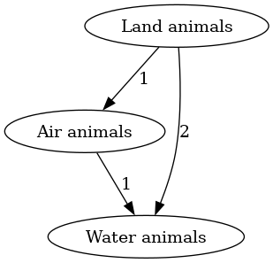 | 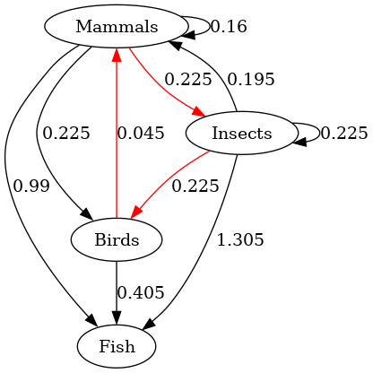 | 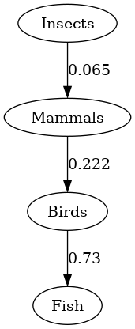 |

*Undergoing an ontological shift `$s$` and then resolving the ontological
crisis using `HodgeRank`. In the right image transitive correctly weighted
edges are ommitted for readability.*

The procedure for resolving ontological crises by representing them as
inconsistent preferences is in pseudocode below as `ResolveShift`. The
algorithm takes a consistent edge-weighted graph `$G$`, a graph-based
ontological shift `$s$` mapping elements from `$\Omega$` to a new
set `$\Xi$`, together with coefficients, and a method for resolving
inconsistent preferences on edge-weighted graphs.

It then creates a new graph `$G^{\star}$`, mapping all nodes using `$s$` and
creating new edges using the existing weights and coefficients with the
function `$t$` explained above. Finally, `$G^{\star}$` is resolved into a
consistent preference with the method `Resolve` (which may be specified
externally, e.g. by using `HodgeRank` or dropping the weights and using
`EGEDmin`).

	function ResolveShift(G, s, Resolve)
		E*=∅, w*=0
		for (ω₁, ω₂)∈E
			for (ξ₁, c₁)∈s(ω₁), (ξ₂, c₂)∈s(ω₂)
				w*(ξ₁, ξ₂)=w*(ξ₁, ξ₂)+c₁·c₂·w(ω₁, ω₂)
				E*=E*∪{(ξ₁, ξ₂)}
		G'=Resolve(G*)
		return G'

*Resolving an ontological shift `$s$` on an edge-weighted directed
graph. `$G$` is a tuple `$(Ω, E, w)$`, and `$s$` is of type
`$Ω\rightarrow \mathcal{P}(\Xi \times [0, 1])$`.*

#### Advantages

An advantage of `ResolveShift` over BisimulateShift is the set of
preferences that can be represented by `$G$` and `$G'$`. If `$\Omega$` is the
set of all finite sequences of state-action pairs `$((S \times A)^k
\times S)_{k \ge 0}$` then `$t_1=(s, a_1, s', a_1, s, a_2, s)$` and
`$t_2=(s,
a_2, s, a_1, s', a_1, s)$` are two different elements in `$\Omega$`, and a
preference of `$t_1$` over `$t_2$` can be represented e.g. with an edge
`$t_1 \rightarrow t_2$` in `$E$`.

A further advantage of `ResolveShift` is that it has a polynomial
runtime complexity of `$\mathcal{O}(|E| \cdot m^2)$`, which is a subset of
the functions in `$\mathcal{O}(n^2 \cdot m^2)$` (with `$n=|\Omega|$`, and
`$m=|\Xi|$`), unlike BisimulateShift, which offers no such guarantees.

#### Disadvantages

If the dynamics (e.g. the transition function) of the elements of
`$\Xi$` are known, then BisimulateShift is able to use this information
to construct `$R_2$`. Additionally, if no mapping `$s$` from `$\Omega$`
to `$\Xi$` exists (that is, only `$\Omega$` and `$\Xi$` are known,
but their relations are not), then `ResolveShift` is not applicable.

**Definition 19**. Let `$f: \mathfrak{G} \rightarrow \mathfrak{S}$`
be a method for resolving inconsistent preferences represented by
edge-weighted graphs, and let `$s_1, s_2, \dots, s_n$` (with `$s_i:
\Omega_i \rightarrow \mathcal{P}(\Omega_{i+1}) \times [0,1]$`) be a
family of functions describing ontological shifts.

Let `$g_1, g_2, \dots, g_n$` be a family of functions that return
the result of `ResolveShift` using the shift function `$s_i$`
for `$g_i$`, but without executing a resolution procedure:
`$g_i(G_i)=\mathtt{ResolveShift}(G_i, s_i, \text{id})$`,
where `$\text{id}: \mathfrak{P}_{\Omega_{i+1}} \rightarrow
\mathfrak{P}_{\Omega_{i+1}}$` is the identity function.

Let `$G_1=(\Omega_1, E_1, w_1)$` be any arbitrary consistent preference on
`$\Omega_1$`.

Then `$f$` is **distributive over ontological shifts** if and only if

<div>
$$(f \circ g_n \circ \dots \circ g_2 \circ g_1)(G_1)=(f\circ g_n \circ f \circ \dots \circ f \circ g_2 \circ f \circ g_1)(G_1)$$
</div>

Intuitively, this condition says that it shouldn't matter whether an
agent changes their mind on which things exist to have preferences over
multiple times, and then resolves the resulting preferences into
consistent ones, *or* resolve their preferences after each time they
undergo an ontological shift `$s_i$`.

**Proposition 5**. `HodgeRank` is not **distributive over ontological
shifts**.

*Proof.* It is easy to find examples where `HodgeRank` is not
**distributive over ontological shifts**.

Let `$G_1=(\Omega=\{a, b\}, E=\{(a \overset{1}{\rightarrow} b)\})$`. Let
`$s_1(a)=\{(d, 0.28)\}$`, `$s_1(b)=\{(c, 0.57), (e, 0.43)\}$`. And let
`$s_2(c)=\{(f, 0.014)\}$`, `$s_2(d)=\{\}$`, and `$s_2(e)=\{(f, 0.34),
(g, 0.66)\}$`.

Then **Figure** 17 shows applying the two ontological shifts `$s_1,
s_2$`, and resolving in the end using `HodgeRank`, and **Figure**
21 shows applying `HodgeRank` after `$s_1$` and then again after
`$s_2$`. The final graphs have different weights.

| The initial preference `$G_1$`, as an edge-weighted graph. | The unresolved preference `$g_1(G_1)$`. | `$g_2(g_1(G_1))$`, which has no edges. | Resolving `$g_2(g_1(G_1))$` using `HodgeRank` results in a graph in which there is indifference between the vertices `$f$` and `$g$`. |
|:---------------------------------- |:---------------------------------- |:-----------------------------------| :------------------------ |
| 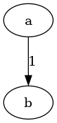 | 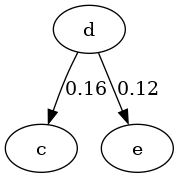 | 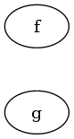 | 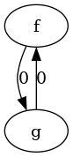 |

------

| The initial preference `$G_1$`. | `$\mathtt{HodgeRank}(g_1(G_1))$`, which has an edge between `$e$` and `$c$`, unlike the result of just `$g_1(G_1)$`. | The final preference, `$(\mathtt{HodgeRank}∘g_2∘\mathtt{HodgeRank}∘g_1)(G_1)$` is *not* indifferent between `$f$` and `$g$`, and slightly prefers `$f$`. |
|:-------------------------------------------- |:-------------------------------------------- |:---------------------------------------------|
|  | 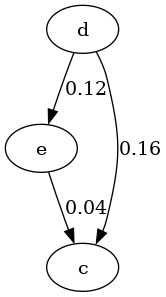 | 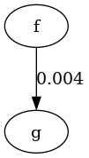 |

 ◻

This example works because `$d$` gets "deleted" from the set of
options, so having all preferences depend on `$d$` without resolving
the incomparability between `$c$` and `$e$` results in there being no
preference, while resolving retains a slight preference of `$e$` over
`$c$`, which remains with `$f$` and `$g$`.

**Conjecture 7**. There is a resolution function `$f$` for edge-weighted
graphs that is **distributive over ontological shifts** in this
framework.

## Value Learning

## Conclusion

In this investigation, we have identified the problem of resolving
preferences that are inconsistent under the von Neumann-Morgenstern
framework.

We first examined the restricted case of preferences over deterministic
options, using directed graphs as an underlying mathematical structure
to represent inconsistent preferences. We proposed two algorithms:
`EGEDmin` and `HodgeResolve` (based on the `HodgeRank` algorithm). We
analyzed both algorithms on several different criteria, with no clear
winner.

We also proved that the criteria **Resolution to Polynomially Many
Preferences** and **Preservation of Consistent Subgraphs** are
incompatible, as well as **Resolution to Polynomially Many Preferences**
and **Polynomial Time Complexity**.

For inconsistent preferences over lotteries, we examined a representation
using edge-weighted directed graphs. This representation is inadequate,
as it can not encode all possible inconsistent preferences, most
notably the violation of independence observed in the [Allais
paradox](https://en.wikipedia.org/wiki/Allais_Paradox).

We nevertheless reviewed the `HodgeRank` algorithm that allows for
resolving inconsistent edge-weighted directed graphs into utility
functions, and observe that `HodgeRank` has several desirable
properties, and that it also fails to conform to the (hard to fulfill)
criterion of strategy-freeness from social choice theory.

We then connected inconsistent preferences to the little-explored issue
of ontological crises, and offered a new perspective on what to do after
a change with a set of objects that a preference was defined over,
opening up many questions we didn't have the time to solve.

### Further Research

We believe that the topics discussed in this text offer some fruitful
lines of inquiry into the mathematical structure of wanting.

On a concrete level we stated several conjectures and questions we were
not able to prove, but might be relatively easy to answer. Of these,
**conjecture** 5 on whether `HodgeResolve` fulfills **Preservation
of Complete Domination** is most relevant, but **conjecture** 1
and **conjecture** 2 might also be interesting from graph-theoretic
perspective.

Additionally, we only analysed two methods of mapping from directed
graphs to acyclic tournaments, but are convinced that there are many
other methods that could be investigated, specifically methods that use
different methods of evaluating graph similarity or ones that result in
weak orderings, or methods that are selected to preserve as many
inclusion-maximal consistent subgraphs as possible.

Resolving inconsistent graphs could also be approached from a different
perspective using random walks on the graph, breaking cycles and
completing edges as they are encountered. An extension of this setup
could involve two agents: One trying to resolve its preferences through
a process of breaking cycles as it traverses the graph representing its
preferences, and an adversary attempting to money-pump the agent. This
setup also is amenable for an analysis of money-pumping under the light
of computational complexity: which violations of the von
Neumann-Morgenstern axioms are computationally easy or hard to find, and
what is the attack/defense balance between finding and exploiting such
violations?

In the context of preferences over lotteries, we are left with no
satisfactory mathematical structure that we can use: edge-weighted
graphs are not expressive enough, and arbitrary relations over
all lotteries too unwieldy. Finding such a structure or finding
a method for resolving arbitrary relations over lotteries would
be helpful for further progress. Inspiration could be found
in models of human decision making from mathematical psychology,
such as the Priority Heuristic and the Random Utility Model from [Gamal
2013](./doc/psychology/on_the_structural_consistency_of_preferences_el_gamal_2013.pdf)
and the BEAST model [Erev et
al. 2017](https://pubmed.ncbi.nlm.nih.gov/28277716/), as well as
alternatives to the utility framework from decision theory, such
as risk-weighted utility maximization or the Jeffrey-Bolker axioms
[Buchak 2013](http://www.larabuchak.net/risk-and-rationality), [Jeffrey
2004](https://www.fitelson.org/probability/jeffrey_subjective_probability_the_real_thing.pdf).

The problem of ontological crises appears under-researched. As
a first step, BisimulateShift could be extended to
[POMDPs](https://en.wikipedia.org/wiki/Partially-observable_Markov_decision_process),
but finding out how real-world systems change their internal
representations during learning could be valuable, with Nanda et al. being
a fascinating analysis of the toy case of modular addition in neural
networks [Nanda et al. 2023](https://arxiv.org/pdf/2301.05217). This
question could also be interesting for social scientists (discovering
how humans manage ontological crises in practice) and philosophers.

We would also like to see further exploration of value-learning [Dewey
2011](./doc/cs/ai/alignment/value_learning/learning_what_to_value_dewey_2010.pdf)
of inconsistent preferences, perhaps extending Evans et al. to allow
for a larger diversity of inconsistent preferences [Evans et al.
2016](./doc/cs/ai/alignment/value_learning/learning_the_preferences_of_ignorant_inconsistent_agents_evans_et_al_2016.pdf).

## Acknowledgements

This text has been long in the making, and has benefitted from much advice
and input. I thank Holger Dell for his help and suggestions. I'd also
like to thank the Crystal Healing Group for their inputs, especially
Kaarel Hänni for the gentle introduction to Hodge decomposition, and
Alexander Gietelink-Oldenziel for the hours of talking about decomposing
irrational preferences into rational ones. I also want to thank Felix
Harder for help with the impossibility result, and Filip Sondej for his
surprising ideas in the lottery case.

Appendix A: Hints in Prior Texts
---------------------------------

> Starting from a state of arbitrary incoherence and moving iteratively
in one of many pro-coherence directions produced by whatever whacky
mind you currently have isn’t obviously guaranteed to increasingly
approximate maximization of some sensical utility function. For instance,
take an entity with a cycle of preferences, apples > bananas = oranges >
pears > apples. The entity notices that it sometimes treats oranges as
better than pears and sometimes worse. It tries to correct by adjusting
the value of oranges to be the same as pears. The new utility function
is exactly as incoherent as the old one.

*—Katja Grace, [“Counterarguments to the basic AI x-risk case”](https://www.lesswrong.com/posts/LDRQ5Zfqwi8GjzPYG/counterarguments-to-the-basic-ai-x-risk-case), 2022*

Appendix B: Proofs
-------------------

I don't read proofs, and neither should you—unless they're
illustrative of some conceptual point. Probably I should
[lean](https://en.wikipedia.org/wiki/Lean_\(proof_assistant\))ize these.

### Proposition 1

1. `$\text{EGED}(G_1, G_2) \le |E_1 \Delta E_2|$`: To generate `$G_2$` from `$G_1$` it is necessary to remove edges from `$G_1$` not in `$G_2$`, and then add edges from `$G_2$` not in `$G_1$`. These comprise the set `$(E_1 \backslash E_2) \cup (E_2 \backslash E_1)$`. So the graph-edit distance is upper-bounded by the size of the symmetric difference.
2. `$\text{EGED}(G_1, G_2) \ge |E_1 \Delta E_2|$`: Assume that `$|E_1 \Delta E_2|<\text{EGED}(G_1, G_2)$`. Removing `$E^-=E_1 \backslash E_2$` from `$G_1$` and adding the edges `$E^+=E_2 \backslash E_1$` results in `$G_2$`. But then `$E^- \uplus E^+$` is already a graph edit that creates `$G_2$` from `$G_1$`, so `$\text{EGED}(G_1, G_2)$` can't be a minimal edge-graph-edit distance between `$G_1$` and `$G_2$`. ◻

### Lemma 1

Let `$\mathbf{S}=\mathtt{stepwise}(G)$`, and `$S=(\Omega,
E_S) \in \mathbf{S}$`. Since all `$S$` are transitive, complete and
reflexive, all `$S$` have the same number of edges, namely the triangular
number `$|E_S|=\frac{|\Omega|(|\Omega|+1)}{2}$`. We also know that
`$\text{EGED}(G, S)=|E_G \Delta E_S|$`, and `$E_G \Delta E_S=E_G
\backslash E_S \cup E_S \backslash E_G$` (the edges we remove from
`$E_G$` and the edges we add to `$E_S$`). The edges removed from
`$E_G$` are the minimal feedback arc sets, so they all have the same
size `$m=|E_G \backslash E_S|$`. It now suffices to show that `$i=E_S
\backslash E_G$`, the size of the edges added, is constant. It holds
that `$|E_G|-m+i=|E_S|$`, and then `$i=|E_S|-|E_G|+m$`, which must be
constant. So `$\text{EGED}(S, G)=m+i$` is also constant for a given `$G,
S \in \mathbf{S}$`. ◻

### Lemma 2

`$E^-_T$` is a feedback arc set: Assume for contradiction that
`$E^-_T$` was not a feedback arc set. Then `$G$` would need to contain a
cycle of directed edges `$E_c=\omega_1 \rightarrow \omega_2 \rightarrow
\dots \rightarrow \omega_{k-1} \rightarrow \omega_k \rightarrow \omega_1$`
so that the cycle was still present after removing `$E^-_T$`, that
is `$E_c \subseteq E \backslash E^-_T$`. We know that then `$E_T=(E
\backslash E^-_T) \cup E^+_T$`, but adding edges can't remove a subset,
so `$E_c \subseteq E \backslash E^-_T \Rightarrow E_c \subseteq (E
\backslash E^-_T) \cup E^+_T$`.

But then `$T$` can't be transitive, asymmetric and complete: If it was
transitive and complete, then there would need to be an edge `$\omega_1
\rightarrow \omega_3$` (created through `$\omega_1 \rightarrow \omega_2
\rightarrow \omega_3$`), an edge `$\omega_1 \rightarrow \omega_4$`
(created through `$\omega_1 \rightarrow \omega_3 \rightarrow
\omega_4$`), and so on. Then `$E_T$` would also contain the edge
`$\omega_1 \rightarrow \omega_{k-1}$`, and thereby also the edge
`$\omega_{k} \rightarrow \omega_{k-1}$` (through the transitivity of
`$\omega_k \rightarrow \omega_1 \rightarrow \omega_{k-1}$`). But since
both `$\omega_k \rightarrow \omega_{k-1} \in E_T$` and `$\omega_{k-1}
\rightarrow \omega_k \in E_T$`, it can't be asymmetric.

`$E^-_T$` is minimal: Assume `$E^-_T$` was a feedback arc set, but not
minimal. Then there would need to be another feedback arc set `$E^{-'}_T$`
so that `$|E^{-'}_T|<|E^-_T|$`. Then one can create `$T'=(\Omega, E_T')$`
from `$G$` by removing `$E^{-'}_T$` from `$E$` and then completing the
resulting directed acyclic graph to a consistent graph.

We know that `$|E_T|=|E_T'|=\frac{|\Omega|(|\Omega|+1)}{2}$`, since both
`$T$` and `$T'$` are acyclic tournaments.

Then it is the case that `$\text{EGED}(G, T) > \text{EGED}(G, T')$`:

<div>
	$$\begin{aligned}
	&\text{EGED}(G, T)>\text{EGED}(G, T') \\
	&\Leftrightarrow |E \Delta E_T| > |E \Delta E_T'| \\
	&\Leftrightarrow |E^-_T \uplus E^+_T| > |E^{-'}_T \uplus E^{+'}_T| \\
	&\Leftrightarrow |E^-_T|+|E_T|-(|E|-|E^-_T|)>|E^{-'}_T|+|E_T'|-(|E|-|E^{-'}_T|) \\
	&\Leftrightarrow |E^-_T|-|E|+|E^-_T|>|E^{-'}_T|-|E|+|E^{-'}_T| \\
	&\Leftrightarrow 2 \cdot |E^-_T|>2 \cdot |E^{-'}_T| \\
	\end{aligned}$$
</div>

So `$E^-_T$` must be minimal, since otherwise it is not a set of edges
removed by `EGEDmin`. ◻

### Lemma 3

Let `$S=(\Omega, E_S) \in \mathtt{stepwise}(G)$` for any `$G$`, and let
`$T=(\Omega, E_T) \in \mathtt{EGEDmin}(G)$`. Let `$E^-_S=E \backslash
E_S$` be the minimum feedback arc set we remove from `$S$` to create
`$G$`, and `$E^+_S=E_S \backslash E$` the edges we add to make `$G$`
complete. We similarly define `$E^-_T=E \backslash E_T$` and `$E^+_T=E_T
\backslash E_T$`.

We can now show that `$\text{EGED}(S, G) \le \text{EGED}(T, G)$`: Assume
that `$\text{EGED}(S, G) > \text{EGED}(T, G)$`. By **Lemma** 2 `$E^-_T$`
is a minimum feedback arc set, and so `$|E^-_T|=|E^-_S|$`. Furthermore,
`$|E_S|=|E_T|$`, since they are both acyclic tournaments on `$\Omega$`.

Then

<div>
	$$\begin{aligned}
	&\text{EGED}(G, S) = |E \Delta E_S| \\
	&= |(E \backslash E^-_S) \uplus E^+_S| \\
	&= (|E|-|E^-_S|)+|E^+_S| \\
	&= (|E|-|E^-_S|)+|E_S|-(|E|-|E^-_S|) \\
	&= (|E|-|E^-_T|)+|E_T|-(|E|-|E^-_T|) \\
	&= (|E|-|E^-_T|)+|E^+_T| \\
	&= |(E \backslash E^-_T) \uplus E^+_T| \\
	&= |E \Delta E_T| = \text{EGED}(G, T)
	\end{aligned}$$
</div>

So it can't be the case that `$\text{EGED}(S, G) > \text{EGED}(T, G)$`.

We can also show that `$\text{EGED}(S, G) \ge \text{EGED}(T, G)$`: Assume
that `$\text{EGED}(S, G) < \text{EGED}(T, G)$`. Since both `$S,
T \in \mathfrak{C}_{\Omega}$`, this contradicts the assumption that the
output of `EGEDmin` has minimal distance. ◻

### Lemma 4

Assume there exists a `$G \in \mathfrak{P}_{\Omega}$` so that
there exists a `$T=(\Omega, E_T) \in \mathtt{EGEDmin}(G)$` so that `$T \not
\in \mathtt{stepwise}(G)$`.

Then, by **Lemma** 2, `$E^-_T=E \backslash E_T$` is a minimum feedback
arc set. Therefore, removing `$E^-_T$` from `$E$` results in a directed
acyclic graph `$G_A$` which is an element of the intermediate set
`$\mathbf{A}$` of directed acyclic graphs in `stepwise`.

Let `$E^+_T=E_T \backslash E$`. Assume `$E^+_T$` was not a set of edges
added to `$G_A$` in a topological sort.

Then let `$\omega \in \Omega$` be the node in `$T$` that has no incoming
edges. `$\omega$` must also have had no incoming edges in `$G_A$`,
since we only add edges to `$G_A$` to achieve `$T$`, and therefore has
in-degree 0 in `$G_A$`, which means that `$\omega$` must have been added
first to some topological sort in **T** by `topological_sorts`.

One can now create `$T'$` and `$G_A'$` by removing `$\omega$` and
all edges from `$\omega$` from `$T$` and `$G_A$`. Let the node in
`$T'$` with no incoming edges be called `$\omega'$`. Then in `$G_A$`
the node `$\omega'$` either had no incoming edges or one incoming edge
from `$\omega$`, since one can create `$T'$` from `$G_A$` by adding
`$E^+_T$` and then (potentially) removing the edge `$\omega \rightarrow
\omega'$`. So in the graph `$G_A'$` with `$\omega$` and all its outgoing
edges removed from `$G_A$`, the node `$\omega'$` has in-degree zero,
and is therefore also selected as the first element in some topological
sort of `$G_A'$`, to which `$\omega$` is prepended after recursion. In
the base case of a `$T^{\star}$` with one element `$\omega^{\star}$`, this
element `$\omega^{\star}$` is the only element of `$G_A^{\star}$` and also
the only element of the topological sort of `$G_A^{\star}$`.

Therefore, by induction, given an acyclic tournament `$T$` and a set of
edges `$E^+_T=E_T \backslash E$`, this set `$E^+_T$` must be the edges added
by some topological sort of `$G_A=(\Omega, E \backslash E^-_T)$`. ◻

### Theorem 5

By **Lemma** 3 it holds that `$\mathtt{stepwise}(G)
\subseteq \mathtt{EGEDmin}(G)$` and by **Lemma** 4 it holds that
`$\mathtt{stepwise}(G) \supseteq \mathtt{EGEDmin}(G)$`, so the sets must
be equal. ◻

### Theorem 6

Reduction from finding all Slater orders with the smallest
distance to a given tournament `$T$`.

Assume we know an algorithm `A` to compute `$f_{\text{EGED}}(G)$`
efficiently, that is, to compute the set of all acyclic tournaments with
the minimal graph-edit distance to a given directed graph `$G$` in
polynomial time.

Then one could solve Slater's problem in polynomial time: For any
given tournament `$T$`, `A` would compute a set `$\mathbf{C}_T$` of
acyclic tournaments which have the same minimal graph-edit distance
`$2k$` to `$T$`, the distance is divisible by two because by editing
a tournament `$T$` into a tournament `$T'$`. Edges can only be
flipped, which engenders two edge operations (removing an edge and
then adding a new one). Then that set would also be the set of Slater
orders of `$T$` (with distance `$k$`), a solution to (`$P_3$`) from [Hudry
2010](./doc/cs/preference/on_the_complexity_of_slaters_problems_hudry_2010.pdf),
which is known to be NP-hard. ◻

### Theorem 6

Let `$T$` be any acyclic tournament with vertices
`$\Omega$`. Then `$T$` has `${n \choose 2}$` edges. Since
`$G_e$` has no edges, one can edit `$G_e$` to be `$T$` simply
by adding all edges of `$T$` to `$G_e$`. This is sufficient and
necessary for turning `$G_e$` into `$T$`. Since this holds for
any tournament `$T$`, the graph-edit distance from `$G_e$` to
any acyclic tournament is the same, namely `${n \choose 2}$`. So
`$|\mathtt{EGEDmin}(G_e)|=|\mathfrak{C}_{\Omega}|=n!$`. ◻

### Proposition 2

This is an artifact of including graphs with reflexive edges in
the set of graphs tested. Let `$G$` be a graph with confusion `$k$` and no
reflexive edges.

Let now `$\mathbf{G}^{\circ}$` be the set of all graphs that are variants
of `$G$` with reflexive edges added. This set include `$G$` itself, and `$G$`
with all reflexive edges, as well as each version of `$G$` with only one
reflexive edge. Every element in `$\mathbf{G}^{\circ}$` also has confusion
`$k$`: all reflexive edges must be removed to create a consistent
preference, yielding `$G$`, and there are `$k$` unique acyclic tournaments
that has the smallest edge-graph-edit distance to `$G$`.

Then it is the case `$|\mathbf{G}^{\circ}|=2^n$`: for each node,
the presence of a reflexive edge on that node can be described by
one bit of information, and since there are `$n$` nodes, the size of
`$|\mathbf{G}^{\circ}|$` is the same as the length of an `$n$` bit
bitstring. ◻

### Lemma 8

[Moon & Moser
1965](./doc/math/on_cliques_in_graphs_moon_moser_1965.pdf)
describe how to construct an undirected graph `$G_n=(V_G,E_G)$`
with `$n$` vertices and `$3^{\frac{n}{3}}$` inclusion-maximal
[cliques](https://en.wikipedia.org/wiki/Clique_\(graph_theory\)). Then
one can construct a directed graph `$P_n=(V_P,E_P)$` with
`$3^{\frac{n}{3}}\approx 1.4422^n$` inclusion-maximal consistent
subgraphs from `$G_n$`, which grows faster than any polynomial. First,
`$P_n$` receives the same vertices as `$G_n$`.  Then, every `$v \in V$` is
assigned a unique number `$j(v): V \rightarrow \mathbb{N}$`, and for each
`$\{u,v\} \in E_G$`, the set of edges `$E_P$` contains `$(u,v)$` if and
only if `$j(u)>j(v)$`, and `$(v,u)$` if and only if `$j(v)>j(u)$`. Now,
if a subgraph `$\mathit{S}_G$` of `$G_n$` with vertices `$V_{\mathit{S}}$`
is a maximal clique, then a subgraph `$\mathit{S}_P$` of `$P_n$` with
vertices `$V_{\mathit{S}}$` is an inclusion-maximal consistent subgraph in
`$P_n$`:

1.  `$\mathit{S}_P$` is complete, because for every `$\{u,v\}$` in
    `$\mathit{S}_G$`, either `$(u,v)$` or `$(v,u)$` exists in `$\mathit{S}_P$`.

2.  `$\mathit{S}_P$` is transitive. For any three vertices `$\{u,v,w\}$` in
    `$\mathit{S}_G$`, `$\mathit{S}_G$` contains the edges
    `$\{\{u,v\},\{v,w\},\{u,w\}\}$` (since it is a clique). Then, without
    loss of generality, assume that `$j(u)>j(v)>j(w)$`. Then
    `$(u, w) \in E_P$`. Therefore `$\mathit{S}_P$` contains the edges
    `$\{(u,v),(v,w),(u,w)\}$`.

3.  `$\mathit{S}_P$` is asymmetric, because for any edge `$\{u,v\}$` in
    `$\mathit{S}_G$` it is the case that `$j(u)>j(v)$` and `$j(v)>j(u)$` can't
    be true at the same time (since `$j$` assigns each vertex a unique
    natural number). So `$\mathit{S}_P$` can only contain either `$(u,v)$`
    or `$(v,u)$`.

4.  `$\mathit{S}_P$` is inclusion-maximal. If `$\mathit{S}_P$` were not
    inclusion-maximal, there'd exist a vertex `$u$` so that every vertex
    `$v$` of `$\mathit{S}_P$` had an edge with `$u$`. But since the procedure
    of constructing `$P_n$` above did not add any edges, that would mean
    that `$\mathit{S}_G$` was not a maximal clique.
◻

### Proposition 3

Fix `$1<j<k<n$`. Let `$\Sigma_l=\biguplus_{i=1}^{k-1} \Sigma_i$` and
`$\Sigma_r=\biguplus_{i=k}^n \Sigma_i$`. Then `$\Sigma_l$` dominates
`$\Sigma_r$` in `$G$`, and by assumption also in `$C \in f(G)$`. Since
`$\Sigma_j \subsetneq \Sigma_l$` and `$\Sigma_k \subsetneq \Sigma_r$`,
it holds that `$\forall \sigma_j \in \Sigma_j, \sigma_k \in \Sigma_k:
\sigma_j \rightarrow \sigma_k \in E_C \land \sigma_k \rightarrow \sigma_j
\not \in E_C$`. So `$\Sigma_j$` now completely dominates `$\Sigma_k$`
in `$C$`. ◻

### Theorem 9

Let `$C=(\Omega, E_C)$`, with `$C \in \mathtt{EGEDmin}(G)$` be a
consistent graph for a directed graph `$G$`, where `$G$` has a completely
dominating set `$\Sigma_1$` and a completely dominated set `$\Sigma_2$`.
Assume `$C$` does not have the completely dominating set `$\Sigma_1$`, and
let `$n=\mathtt{EGED}(G,C)$`. Then there must be a "highest" or "largest"
`$\sigma_2 \in \Sigma_2$` in `$C$` (one for which there is no other
`$\sigma_2' \in \Sigma_2$` so that `$\sigma_2' \rightarrow \sigma_2$`
is an edge in `$C$`). There must also be a "highest" or "largest"
`$\sigma_1^* \in \Sigma_1$` so that `$\sigma_2 \rightarrow \sigma_1^*$`
is an edge in `$C$`.

Let there be `$m \ge 0$` elements of `$\Sigma_1$` "between" `$\sigma_2$`
and `$\sigma_1^*$`, that is for `$\Sigma_2^*=\{\sigma_2^*| \sigma_2
\rightarrow \sigma_2^* \in E_C\ \land \sigma_2^* \rightarrow \sigma_1^*
\in E_C\}$` it holds that `$\Sigma_2^*=m$`.

One can now create a `$C'$` from `$C$` so that `$\mathtt{EGED}(G,
C')=n-2(m+1)$` by moving `$\sigma_1^*$` into the position directly above
`$\sigma_2$` by reversing the edges `$\sigma_2 \rightarrow \sigma_1^*$`
and `$\sigma_2^* \rightarrow \sigma_1^*$` for all `$\sigma_2^* \in
\Sigma_2^*$`. The modified `$C'$` now contains some edges from `$G$`
that need to be reversed to create `$C$`: `$\sigma_1^* \rightarrow
\sigma_2$` and `$\{\sigma_1^* \rightarrow \sigma_2^* | \sigma_2^* \in
\Sigma_2^*\}$` are already edges in `$G$`, and because edge reversals
have weight 2 (deleting and then adding one edge), this saves `$2(m+1)$`
edge operations.

Furthermore all other edge operations to minimally achieve `$C$` from
`$G$` can be held constant to create `$C'$`, so that the graph-edit
distance is not changed otherwise. `$C'$` is now an acyclic tournament
with a smaller edge-graph-edit distance from `$G$` than `$C$`. Thus
all other outputs `$\mathbf{C}=\mathtt{EGEDmin}(G)$` must also have a
smaller edge-graph-edit distance than `$C$` has to `$G$`.

If `$C'$` does not have the same completely dominating set `$\Sigma_1$`
that `$G$` has, one can create a new graph `$C''$` by finding a new
"highest" `$\sigma_2$` and corresponding `$\sigma_1^*$` and switching
them. This `$C''$` again has shorter edge-graph-edit distance.

This process can be repeated as long as `$\Sigma_1$` is not a completely
dominating set in the consistent graph, monotonically decreasing the
edge-graph-edit distance, until no further such modifications can be
found.

The final consistent graph resulting from this process contains
`$\Sigma_1$` as a completely dominating set: Every `$\sigma_1
\in \Sigma_1$` has a one-directional edge to every `$\sigma_2 \in
\Sigma_2$`. ◻

### Lemma 11

Assume `$S$` is a subgraph of `$E_n$`, and there exists (without
loss of generality) a `$\mathit{V}_i$` so that `$S \cap \mathit{V}_i$` has
two edges `$\alpha_i
\rightarrow \beta_i$` and `$\beta_i \rightarrow \gamma_i$`. Since `$S$` is
stipulated to be consistent, due to the transitivity requirement it must
also contain the edge `$\alpha_i \rightarrow \gamma_i$`. But then `$S$`
would no longer be a subgraph of `$E_n$`, since
`$\alpha_i \rightarrow \gamma_i$` is not an edge in `$\mathit{V}_i$`. If
`$S \cap \mathit{V}_i$` has three edges, `$S$` must be inconsistent, since
transivity or asymmetry are violated. Assume now there is a subgraph
`$\mathit{V}_i$` of `$E_n$` so that `$S \cap \mathit{V}_i$` has no edges. Then
one can add any one edge from `$\mathit{V}_i$` to `$S$` while retaining
consistency: If one adds (without loss of generality)
`$\alpha_i \rightarrow \beta_i$`, this preserves consistency, since

-   **Completeness** is preserved (`$\alpha_i, \beta_i$` are connected to
    all `$\omega_h, \omega_j$` (`$h <i<j$`)).
-   **Transitivity** is preserved
    (`$\omega_h \rightarrow \alpha_i, \alpha_i \rightarrow \beta_i$` also
    means that `$\omega_h \rightarrow \beta_i$` since `$h<i$`, and similar
    for `$\alpha_i \rightarrow \beta_i, \beta_i \rightarrow \omega_j$`).
-   **Asymmetry** is preserved because we add no reversed edges where
    there were edges in `$S$` before.

 ◻

### Lemma 12

We showed that each `$S \in \mathcal{S}$` contains exactly one
edge from each `$\mathit{V}_i$`. If two `$S_1, S_2$` for a given
`$\mathit{V}_i$` share the same edge (i.e.  `$S_1 \cap \mathit{V}_i=S_2
\cap \mathit{V}_i$`), `$S_1$` and `$S_2$` can be subgraphs of the same
consistent graph `$C$`. If two `$S_1, S_2 \in \mathcal{S}$`, for a
given `$\mathit{V}_i$`, *don't* share the same edge (that is `$S_1 \cap
\mathit{V}_i \not =S_2 \cap \mathit{V}_i$`), they can be nevertheless
still be subgraphs of the same consistent `$C$`:

If (without loss of generality) `$(S_1 \cap \mathit{V}_i)=\alpha_i
\rightarrow \beta_i$` and `$(S_2 \cap \mathit{V}_i) =\beta_i \rightarrow
\gamma_i$`, `$C$` can contain those edges as well as `$\alpha_i \rightarrow
\gamma_i$`.

If, though, there are three `$S_1, S_2, S_3 \in \mathcal{S}$` that each
don't share an edge on a given `$\mathit{V}_i$`, they can't be subgraphs
of any consistent `$C$`: Such a `$C$` would need to contain `$\{\alpha_i
\rightarrow \beta_i, \beta_i \rightarrow \gamma_i, \gamma_i \rightarrow
\alpha_i\}$`, but this would violate either asymmetry (if one added
`$\alpha_i \rightarrow \gamma_i$` as well) or transitivity (through the
absence of `$\alpha_i \rightarrow \gamma_i$`).

Therefore, for each `$\mathit{V}_i$`, only two edges from `$\mathit{V}_i$`
can occur in any element of `$\mathcal{S}$`. Then an `$S \in
\mathcal{S}$` can be uniquely identified by which edge from each
`$\mathit{V}_i$` it contains, since there are two edges for each
`$\mathit{V}_i$` and there are `$n$` such "levels" `$\mathit{V}_i$`,
and no two edges from different `$\mathit{V}_i, \mathit{V}_j$` are
mutually exclusive.

Therefore, `$|\mathcal{S}|\le 2^n$` if all elements of `$\mathcal{S}$` are
to be subgraphs of an acyclic tournament. But introducing an additional
distinct `$S_{2^n+1}$` to `$\mathcal{S}$` must add a third edge from
at least one `$\mathit{V}_i$`, thus `$2^n$` is the maximal size of
`$\mathcal{S}$`. ◻

### Lemma 13

Assume that one can partition the set `$\mathbf{C}$` of inclusion-maximal
consistent subgraphs of `$E_n$` into a set `$\mathbf{P}$` of disjoint sets
of size `$\le 2^n$` (that is `$\forall \mathcal{C}_i \in \mathbf{P}:
|\mathcal{C}_i|=2^n|$`) such that there exists a consistent graph `$C$`
that contains all `$\mathcal{C}_i$`. Then the number of such partitions
would be the number of consistent graphs required to "cover" all elements
in `$\mathbf{C}$`, since by Lemma 12 the sets of compatible graphs have
at most size `$2^n$`. Then the size of `$\mathbf{P}$` would be at least
`$\frac{3^n}{2^n}=1.5^n$`, which is exponential in `$n$`. ◻

### Theorem 14

Let `$\mathbf{C}=\mathtt{A}(E_n)$`. **Lemma** 13 shows that
`$\mathbf{C}$` is exponential in the number of vertices (by **remark**
3. Any `$\mathtt{A}$` would at least need to enumerate all `$C \in
\mathbf{C}$`, which would take exponential time. ◻

### Proposition 4

`$r_2(a, k, \mathbf{i}_2)$` can be expanded and simplified to

<div>
	$$\begin{aligned}
	&r_2(a, k, \mathbf{i}_2)= \\
	&\frac{1}{k} \sum_{i=1}^{k} (\mathbf{R}_1^{\top} \phi) \times \mathbf{T
	}_2(a)^i \times \mathbf{i}_2= \\
	&\frac{1}{k} \sum_{i=1}^{k} (\mathbf{R}_1^{\top} \phi) \times (\psi \mathbf{T}_1(a) \phi)^i \times (\mathbf{i}_2^{\top} \phi)^{\top}= \\
	&\frac{1}{k} \sum_{i=1}^{k} \mathbf{R}_1^{\top} \times \mathbf{T}_1(a)^i \phi \times \phi^{\top} \mathbf{i}_1= \\
	&\frac{1}{k} \sum_{i=1}^{k} \mathbf{R}_1^{\top} \times \mathbf{T}_1(a)^i \times \phi \phi^{\top} \times \mathbf{i}_2= \\
	& r_1(a, k, \phi \phi^{\top} \mathbf{i}_2)
	\end{aligned}$$
</div>

◻

[^1]: The notation for lotteries is common in social choice theory
    [Gaertner 2009, ch.
    8.2](https://www.goodreads.com/book/show/6390481-a-primer-in-social-choice-theory).
    Some sources would instead write this as `$p_1 \cdot
    \omega_1 + p_2 \cdot \omega_2$` [von Neumann & Morgenstern,
    1947](https://www.goodreads.com/book/show/483055.Theory_of_Games_and_Economic_Behavior),
    but I have decided against it, since no addition is actually taking
    place.

[^2]: Unless further specified, in this text it will always be the case
    that the nodes of `$G$` are called `$\Omega$` and its edges are called
    `$E$`.

[^3]: Sample size too small.

[^4]: Without reflexive edges `$(\xi, \xi) \in E$`.

[^5]: This definition allows for there to be graph `$G$`, a consistent
    subgraph `$\mathit{S}_G$` of `$G$` and resolved weakly consistent graph
    `$W=(\Omega, E_W) \in f(G)$` such that there exist nodes `$\omega_1,
    \omega_2 \in \Omega$` in `$\mathit{S}_G$` which are not *strictly*
    ordered in `$W$`, that is both `$\omega_1 \rightarrow \omega_2 \in
    E_W$` and `$\omega_2 \rightarrow \omega_1 \in E_W$`. It is possible
    to define a stronger criterion, **Strict Preservation of Consistent
    Subgraphs**, which requires that for such `$\omega_1, \omega_2$` *only*
    the edge `$\omega_1 \rightarrow \omega_2$` being present in `$E_W$`,
    but we will not work with that definition here.

[^6]: Russell and Norvig note that sometimes `$R$` takes actions into
    account as well: `$R: S \times A \times S \rightarrow \mathbb{R}$`
    (with different rewards for transitioning to a state with different
    actions), but also notes that this merely simplifies the description
    of some environments, but doesn't change which environments can be
    described [Russell & Norvig 2010, ch. 17](http://aima.cs.berkeley.edu/).

[^7]: Also known as flying fish.

[^8]: Only if the output is allowed to be a weak ordering.
