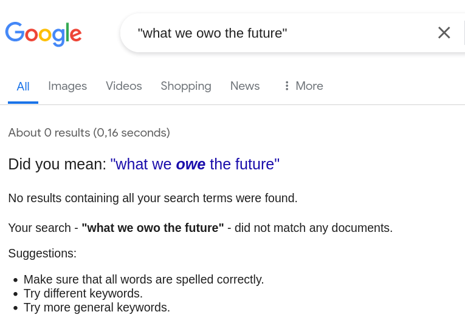

[home](./index.md)
-------------------

*author: niplav, created: 2020-12-30, modified: 2025-09-15, language: english, status: in progress, importance: 3, confidence: opinion*

> __Reviews of things.__

Reviews
========

Meditation Retreats
-------------------

### Dhammacari Basic Retreat

[Dhammacari](https://vipassana-dhammacari.com/en/home/)

- My experience
	- Big emotional processes/processing steps (two IIRC)
		- Changed attachment style away from avoidant
	- Crossed the A&P (lots of very strong absorption with much focus, followed by a very bright yellow-white & *loud* sensation with lots of energy rising up in the body, accumulating below the top of the skull)
	- Saw tanha, I think?
		- Like not *saw* saw, I didn't have a path moment, but there was something very clearly fast/grabby/suffering-inducing that my mind was involved in when it was *doing* stuff.
	- If there were dukkha-ñanas they were really mild
- Mice in the attic that one can hear in the meditation hall, it's kinda cute
- Now stomach aches and churns while meditating
	- Maybe just more awareness of sensations from the stomach
- The center itself
	- They tell you not to sleep for three nights in a row
		- This is bad, write whole rant on it?
		- Pretty clearly a monastic practice blindly applied to laypeople
		- This made the last few days useless for me, and I'm pretty sure it doesn't help with awakening
		- From now on I'll always ask before a retreat if there's days with sleep restriction below 4 hours, which is the minimum I need
	- They tell you some quite strict rules at the beginning, then don't supervise at all.
		- E.g. white clothes, right leg on left leg, right hand in left hand, prostating before the small altar before/after each meditation session…
- Meditation style:
	- Half walking meditation! It's great!
	- Sitting meditation:
		- Simple labeling, some light bodyscanning
		- Balances absorption and insight quite well imho
	- During sleep deprivation nights they make you do some strange exercises with a clicker, I don't quite understand why

Books
------

<!--
### Designing Data-Intensive Applications (Martin Kleppmann, 2017)
### Die Drei Sonnen (Cixin Liu, 2006)
### World War Z (Max Brooks, 2006)
### Avoiding the Worst (Tobias Baumann, 2022)
### Die Insel der Tausend Leuchttürme (Walter Moers, 2024)
### Schild's Ladder (Greg Egan, 2004)
### Bombay. Maximum City (Suketu Mehta, 2005)
-->

### Compassion, by the Pound (F. Bailey Norwood/Jayson L. Lusk, 2011)

"Compassion, by the Pound" by the economists F. Bailey Norwood and
Jayson L. Lusk is one of those books that are excellent in their first
half, and somewhat (but not utterly) disappointing in their second
half. The two economists, spurred by their own research and their
perceived lack of good information on the topic of farm animal welfare,
start off with a historical overview of animal agriculture and animal
welfare activism, proceed to talking about the sentience of animals,
give an enormous overview of standard animal agriculture praxis, push in
two completely unnecessary chapters about how philosophers and economists
see animal agriculture (the first one being massively oversimplifying,
the second one being annoyed), present a model for consumers to use for
deciding what to eat (although the links have fallen victim to linkrot),
copy-paste one of their papers into the book, and finish with those
kinds of general closing statements that are as so often too vacuous to
be interesting.

At its best, the book is just a delicious heap of information about
animal agriculture praxis. From detailed lists of surgeries performed
on animals without anaesthetics (dehorning, beak trimming, castration,
teeth clipping and tail docking) to the behaviour of cows in big pens
(they huddle together in a corner, and don't use up all the space)
to the hierarchical behavior in chickens (much more strongly than in
cows, actually a major factor of injury in cage-free egg production),
the book presents an industrial-scale mountain of interesting facts
about animal agriculture. The best parts of the book pretty much scream
to be flashcardized.

Norwood's & Lusk's judgement seems well informed and not particularly
strongly clouded by bias, and presented in a empathetic, but also
neutral tone (except in the case of them mentioning in a side remark
that surgeries such as castration on animals are nearly always performed
without anaesthetics, seemingly regarding this as completely acceptable).

However, not everything is golden under the sun. The chapter on
philosophy is especially painful (or might this just be my Gell-Mann
amnesia speaking?) – they seem dismissive of philosophers' arguments,
present them in short and watered-down form, and even state in a footnote:

> If there is one thing we have learned from reading the
> works of ethical philosophers; it is that no one ever, ever wins
> the debate

*— F. Bailey Norwood/Jayson L. Lusk, "Compassion, by the Pound" p. 388, 2011*

The chapter on Talking with Economists is better, but plagued with
the eternal problem of economics: people don't like it, and the same
debate about the very basic tenets of economics needs to be rehashed
over and over again. As it happens here, much to my own disappointment
("Yes, sure, I agree that things have a price, that regulation is often
nonsensical and consumers change their minds when presented with the same
scenario, worded slightly differently. Can we get back to fascinating
in-depth descriptions of animal agriculture now, please?").

Chapter 9, Consumer Expressions, is not _bad_ per se, but still sloppy: It
is abundantly clear that the chapter is simply a paper by the two authors
copy-pasted into the book. The experiments they perform are interesting
and scientifically sophisticated, but the chapter is nonetheless jarring
to the reader – clearly somewhat out of place in the rest of the book.

Two things stand out to me from this book:

1. They mention Brian Tomasik's early writings on wild-animal suffering in
a very positive tone, remarking that "It is one of the most interesting
and well researched narratives that is not officially published by any
organization."
2. After reading it, I remain mostly unshaken in my
vegetarianism. However, I have stopped eating eggs as a result of reading
this book, and I now assign a much higher probability to the hypothesis
that beef cows' lives on factory farms are actually net positive, although
I wouldn't go so far as to give it the majority of my probability mass.

"Compassion, by the Pound" is sometimes clearly a product of annoyance
– an annoyance at animal advocates who allegedly spread misinformation
about farming practices, annoyance at people who _just don't understand
economics_ (which I get, yes, it's frustrating), and yes, sometimes
also annoyance at the horrifying conditions many farm animals have to
live under. Hopefully both economists and animal advocates won't have
to be annoyed as much in the future, but for the time being, we're still
killing and eating animals.

__8/10__

### The Human Predicament (David Benatar, 2017)

"The Human Predicament" is a book about life philosophy, written
by the pessimistic analytic philosopher David Benatar. In it, Benatar
describes what he calls the human predicament (hence the title), which
consists of the fact that human lives are usually bad, and much worse
than people themselves think. In his view, human lives lack cosmic (and
sometimes terrestrial) meaning, are bad because they're much shorter
than they could be, much more filled with pain and discomfort than
humans think, and full of ignorance, unfulfilled desires and physical
deterioration during the course of one's lifetime.

However, according to Benatar, all alternatives are also bad: death,
because it often deprives of life, and annihilates the person dying;
and suicide, for much the same reasons, unless it annihilates a life
that is awful enough to justify death. Life extension, under Benatar's
view, is extremely unlikely, and even if achieved, would only prolong
the misery of human existence.

The only positive option is to not come into existence at all–or at
least not make others come into existence, even though one desires to.
He alludes several times to one of his other books, Better Never To Have
Been, in which he advocates for antinatalism.

Reading this book felt a little
bit pointless to me. Since [beliefs are for
actions](https://www.gwern.net/Research-criticism#beliefs-are-for-actions),
and Benatar is just applying a linear transformation to all
available options (if everything's bad, nothing is), you
act exactly the same. Although I had a phase where I believed
antinatalism quite strongly, and still don't plan on having kids
(although I know that this attitude might change with increasing
age), but overall antinatalism does not strike me as a [pragmatic
policy](https://reducing-suffering.org/strategic-considerations-moral-antinatalists/ "Strategic Considerations for Moral Antinatalists"),
me instead adopting an
[anti-pure-replicator](https://qualiacomputing.com/2017/12/20/the-universal-plot-part-i-consciousness-vs-pure-replicators/ "The Universal Plot: Part I – Consciousness vs. Pure Replicators")
strategy.

Especially the chapter on meaning felt irrelevant: I don't have an
internal experience of meaning (or the lack thereof), and oscillate
between believing it to be a subtype of high-valence qualia and believing
it to be a mechanism for the mind to do things that are in themselves
not enjoyable (a "second reward signal" next to pleasure).

Benatar mentions cryonics, life extension technology and
transhumanism in general, and while his treatment of these topics
is more respectful than most, he dismisses them fairly quickly. I
disagree with his underlying skepticism on these the feasibility of radically altering the human condition through technology, given that it seems that humanity
can expect to find itself in a period of [hyperbolic economic
growth](https://sideways-view.com/2017/10/04/hyperbolic-growth/ "Hyperbolic growth")
(see also [Roodman
2020](https://www.openphilanthropy.org/blog/modeling-human-trajectory "Modeling the Human Trajectory")).

I am also not a fan of the pessimism-optimism distinction. Benatar himself
touches on this:

> that a view is pessimistic should, in itself, neither
count in its favor nor against it. (The same, of course, is true
of an optimistic view.)

*— [David Benatar](https://en.wikipedia.org/wiki/David_Benatar), "The Human Predicament" p. 225, 2017*

It seems to me that humans can believe very bad things to be the case and
still be happier than most other humans in their lives (I know this is
at least true for one human, myself). This, combined with the fact that
Benatar simply shifts the utility function downwards, makes me inclined
to rejecting much of his worldview as simply a matter of emotional tone
on the same facts everyone else also believes.

Finally, I want to accuse Benatar of insufficient pessimism (on
his own criteria): The most likely outcome for humanity (and for
life in general) seems not to be total extinction, but instead a
universe filled with beings most capable of copying themselves, the
whole cosmos teeming with [subsistence-level beings with very boring
conscious experiences](https://slatestarcodex.com/2014/07/13/growing-children-for-bostroms-disneyland/ "Growing Children For Bostrom's Disneyland") until the stars go out. (Or even worse
scenarios from anti-aligned artificial intelligences, see [Tomasik
2019](https://reducing-suffering.org/near-miss/ "Astronomical suffering from slightly misaligned artificial intelligence")).

Overall, the book had some interesting points about suicide, the quality of
life and meaning, but felt rather pointless.

__3/10__

### Right Concentration (Leigh Brasington, 2015)

Illustrates the theory-practice gap, but in the other direction:
excellently practical first half (which helped me get into the first
jhāna (briefly) during a long retreat (the hard part is getting
the access concentration good enough, which the book doesn't spend
enough time on, in my opinion—only a short appendix (at least there's
recommendations for other books)). The anecdotes from his students and
their problems with entering the jhānas are fascinating (pīti that
doesn't go away? jhānas contraindicated with seizures?), as are his
reports of deep concentration states on long retreats (the visual field
turning white in the fourth jhāna, and reports about the the nimitta,
make me wonder what goes on in the visual cortex during absorption
meditation).

But Brasington just *wants* to believe that the Suttas are
basically infallible, **especially** when they report what the
Buddha said (Brasington has remarked on podcasts that we know
that the Buddha knew what he was talking about, which I don't
get—even if he was a great meditator and thinker, he could
just have been *wrong* sometimes): Expecting the Suttas to
accurately and coherently reflect reality in all its aspects is
a bit too optimistic for me. But Brasington goes full [memetic immune
disorder](https://www.lesswrong.com/posts/aHaqgTNnFzD7NGLMx/reason-as-memetic-immune-disorder)
on the Suttas, and the result is just…uninteresting?

__7/10__

### What We Owe The Future (William MacAskill, 2022)

Preceded by a [superior book on the same
topic](https://www.goodreads.com/book/show/50485582-the-precipice);
this one is sleeker, less filled with random interesting facts, less
scientific, less exuberant in its prose. I enjoyed the introduction of the
[SPC framework](https://forum.effectivealtruism.org/topics/spc-framework)
(though it may be relegated to the dustbin — unlike with
[ITN](https://forum.effectivealtruism.org/topics/itn-framework) I haven't
even seen anyone else pay lip service to it…), found the alleged first
popular introduction to population axiology cute, and liked the chapters
on stagnation.

But honestly? I enjoyed the research that led to those chapters
more than the chapters in the book themselves (especially [Rodriguez
2019](https://forum.effectivealtruism.org/s/HSA8wsaYiqdt4ouNF/p/pMsnCieusmYqGW26W)
and [Rodriguez
2020](https://forum.effectivealtruism.org/posts/GsjmufaebreiaivF7/what-is-the-likelihood-that-civilizational-collapse-would)),
and I think the team that made The Precipice would've done a nicer job
at exposition.

Similarly, I was not a huge fan of the chapter on risks from artificial
intelligence. Too conservative, which might've been warranted before
GPT-3, but mid-2022? Bad timing to be all "could be soon or bad, or both,
or not, idk". (Although apparently other reviewers have the opposite
issue, so perhaps a good compromise was struck for the purpose of public
communication).

I am unsure about the value lock-in frame. On the one hand,
it's a very rough description of some of the danger with AI
x-risk, but not all danger fits in that format: What if AI
systems don't lock in any specific value, but kill off humanity
and then go on to explore the space of all possible values, all [YOLOid
style](https://www.lesswrong.com/posts/BuaFZud9BwkiSCGpd/alignment-might-never-be-solved-by-humans-or-ai)?
Not lock-in, but it surely doesn't look "good" to me.

This framing also invites endless bickering about "who gets to control
the AIs values" and "democracy" and "social solutions", and the
*completely separate* issue of stable totalitarianism.

Finally: Who *the hell* decided this was a good way to do endnotes? In
general the best policy is to [under no circumstances use endnotes, *ever*,
__why__](https://entirelyuseless.com/2015/07/11/are-hyperlinks-a-bad-idea/).
But WWOTF makes it 10x worse: I usually read endnotes,
because I'm unusually curious and bad at priorization,
but WWOTF only has ~25% substantive endnotes, with the rest
being just incomplete references (which can be accessed on [the
website](https://whatweowethefuture.com/bibliography/))—so I found
myself flipping back and forth, only to be disappointed most of the
time. Surely there must be a better way of distinguishing between
citations and endnotes.

Maybe I should've avoided it: Pop philosophy that is already in my
own groundwater.

If you're reading this site, read The Precipice instead. (Not a *full*
condemnation of WWOTF).

__5/10__

### Attention Span (Gloria Mark, 2023)

> Curiosity is the drug of the internet.

*—Gloria Mark, "Attention Span" p. 114, 2023*

Read this while [researching attention spans](./spans.html), I
did not find what I was looking for (remaining mostly unconvinced
that the reported statistics are strong enough to justify the
claim that attention spans have been declining). Otherwise
acceptable; and in some parts genuinely novel to me, giving a
plethora of ways of measuring attention ([transcranial Doppler
sonography](https://en.wikipedia.org/wiki/Transcranial_Doppler),
[functional near-infrared
spectroscopy](https://en.wikipedia.org/wiki/Functional_near-infrared_spectroscopy),
facial [thermography](https://en.wikipedia.org/wiki/Thermography)
to measure cognitive effort, [blood
velocity](https://en.wikipedia.org/wiki/Hemodynamics#Velocity)…),
claims that the Pomodoro technique hasn't been experimentally tested
([now it has](./platforms.html#Pomodoros)). Apparently people often
*self-interrupt* while on a task, which I've noticed myself doing more &
more. The Big 5 relate to how humans perform tasks:

> Those who score high in Neuroticism in personality tests also tend
to perform worse on selective attention tasks where they have to pay
attention to some things and ignore distracting stimuli,²⁰ much like
the Stroop task.

*—Gloria Mark, "Attention Span" p. 154, 2023*

> We expected that conscientious people would be more likely to be
continuous email checkers, and that is exactly what we found. In fact,
it explained their email checking behavior to a striking extent […]
we found that people who score higher on the personality trait
of Openness perform better in environments with interruptions.

*—Gloria Mark, "Attention Span" p. 156, 2023*

This leads to conscientious people being more exhausted if possible
low-effort interruptions are taken away from them, they just work
continuously until exhaustion.

Mark's background in art gives some entertaining anecdotes and
statistics, I especially enjoyed learning about [dialectical
montage](https://en.wikipedia.org/wiki/Soviet_montage_theory) and
decreasing shot-lengths in movies, series and advertisements.

Apparently people want to use this as a self-help book‽ Bizarre.

But to me: Satisfactory.

__6/10__

### Human Compatible (Stuart Russell, 2019)

> It sounds odd to say that happiness should be an engineering discipline,
but that seems to be the inevitable conclusion.

*—Stuart Russell, "Human Compatible" p. 123, 2019*

[Another](#What_We_Owe_The_Future_William_MacAskill_2022) book with an
orange cover, and another popularization of an area I've spent a lot of
time thinking and reading about. But I like this one much more!

Thoroughly enjoyed the many tidbits from AI history, and the stories
about semi-successful systems, as well as a preference-utilitarian
definition of "sadism, envy, resentment and malice", a naive approach
to meta-reasoning ("just reason about a thing if the expected value of
reasoning is positive", without talking about the obvious bootstrapping
problems…but still), learning about the Baldwin effect and the quotes
about risks from artificial intelligence from Butler's Erewhon.

Skeptical about transformative AI soon, and about the [scaling
hypothesis](https://www.gwern.net/Scaling-hypothesis), but probably for
reasons I can't understand. Also this was written before GPT-3, so he
might've changed his mind since then.

The book *does* assume that [reward is the optimization
target](https://www.lesswrong.com/s/nyEFg3AuJpdAozmoX/p/pdaGN6pQyQarFHXF4),
and doesn't mention [inner
optimizers](https://www.lesswrong.com/posts/FkgsxrGf3QxhfLWHG), but your
popularization of alignment can only do so much. I should really read
into the whole CIRL/corrigibility debate, any day now.

The book *did* have endnotes, which I hate, but less so than with [What We
Owe The Future](#What_We_Owe_The_Future_William_MacAskill_2022)—perhaps
because I got to read the titles of the papers and not just a naked "Foo
et al. 2010", perhaps because there was just more content per footnote.

> The task is, fortunately, not the following: given a machine that
possesses a high degree of intelligence, work out how to control it. If
that were the task, we would be toast. A machine viewed as a black box,
a *fait accompli*, might as well have arrived from outer space. And
our chances of controlling a superintelligent entity from outer space
are roughly zero. Similar arguments apply to the methods of creating AI
systems that guarantee we won't understand how they work; these methods
include *whole-brain emulation*¹—creating souped-up electronic copies
of human brains—as well as methods based on simulated evolutions of
programs.² I won't say more about these proposals because they are so
obviously a bad idea.

*—Stuart Russell, "Human Compatible" p. 171, 2019*

__6.5/10__

### The Machinery of Freedom (David Friedman, 2014)

> As a moral philosopher I am a libertarian, insofar as I am anything. As
an economist I am a utilitarian.

*—David Friedman, "The Machinery of Freedom" p. 179, 2014*

Anarcho-capitalist cut from my people's cloth, namely of the consequentialist
variety, writes a series of blogposts in 1967-1973, again in 1989,
and again in 2014.

Unlike many other anarcho-capitalist this one's not completely
[mind-killed](https://www.lesswrong.com/rationality/politics-is-the-mind-killer),
able to acknowledge weaknesses in his position, capable to argue
against the arguments of his allies, and still bullet-biting when its
necessary. (For example on copyright).

Clever proposals for mechanism design that don't quite work, but feel
like they only need one more insight, plus a lot of very good very true
libertarian proposals.

Responsible for a certain cluster of people knowing surprisingly
much about medieval icelandic law. I learned it from here, as well as
[Friedman's law](https://en.wikipedia.org/wiki/Friedman's_Law) — not
yet used in a cost-benefit calculation, but surely feels like it could
come in handy. (Some empirical demonstration of it would be nice.)

Complaint: Instead of rewriting or updating sections of the text, as
one would think of a new edition, the things that have changed about the
world are usually appended to chapters in square brackets. This makes it
confusing while reading: I read a fact, which later is reverted. This
also happens to a lesser degree with the different eras the book was
written in: A strange mix of 90s cypherpunk, 70s quaintness and early
2010s internet culture (complete with a recommendation of Slate Star
Codex in the appendix).

Available online
[here](http://www.daviddfriedman.com/Machinery%203rd%20Edn.pdf), true
to its stance on copyright.

__7/10__

### Three Essays (Richard Rorty, 1983-1990)

__Solidarity or Objectivity (1983)__, __Freud and
Moral Reflection (1984)__, __The Priority of Democracy
to Philosophy (1990)__, read in German as [this
collection](https://www.goodreads.com/book/show/20343958-solidarit-t-oder-objektivit-t-drei-philosophische-essays).

Given his reputation as standing between analytic
and continental philosophy, I'd hoped to get the
*understanding* that I got from the analytics, and the
*poetry* from the continentals. I got neither, just as when I read
[Habermas](https://www.goodreads.com/book/show/321494.Zwischenbetrachtungen_Im_Proze_der_Aufkl_rung)
or
[Benjamin](https://www.goodreads.com/book/show/613761.Illuminationen_Ausgew_hlte_Schriften_1)
or
[Derrida](https://www.goodreads.com/book/show/1421797.Gesetzeskraft_Der_mystische_Grund_der_Autorit_t_).

I mostly didn't understand the essays, and what I understood, I didn't
like—I was confused, couldn't follow, lacked context.

Not for me.

__2/10__

### Growth (Vaclav Smil, 2019)

> Our ability to provide a reliable, adequate food supply thanks to
yields an oder of magnitude higher than in early agricultures has been
made possible by large energy subsidies and it has been accompanied
by excessive waste. A near-tripling of average life expectancies has
been achieved primarily by drastic reductions of infant mortality and
by effective control of bacterial infections. Our fastest mass-travel
speeds are now 50-150 times higher than walking. Per capita economic
product in affluent countries is roughly 100 times larger than in
antiquity, and useful energy deployed per capita is up to 200-250
times higher. Gains in destructive power have seen multiples of many
(5-11) orders of magnitude. And, for an average human, there has been
essentially an infinitely large multiple in access to stored information,
while the store of information civilization-wide will soon be a trillion
times larger than it was two millenia ago.

*—[Vaclav Smil](https://en.wikipedia.org/wiki/Vaclav_Smil) summarizing "Growth", p. 447-448, 2019*

Fact density: Extreme. Outstanding for that.

Read this as part of a [comprehensive information
gathering](https://www.lesswrong.com/posts/9LXxgXySTFsnookkw/exercises-in-comprehensive-information-gathering).
Good here too, but so dry that it sometimes feels like fucking a skeleton.

Uses sigmoid curve-fitting far too much: They can't be relied upon
for prediction, [especially if the inflection point is not in the data
yet](https://arxiv.org/pdf/2109.08065). A lot of Smil's curve-fits have a
smooth start and an abrupt bump into a ceiling; the bump into the ceiling
usually lies in the not-so-far-future. Growth was the first time I've
seen someone fit a logistic curve to GDP—not GDP *growth rates*, mind
you, no, gross domestic product *itself*. p. 412, I'm not making this up.

Smil also uses the words "upper bound" differently from my culture—in
my culture it means "limit imposed by physical law or mathematical
necessity", for Smil it means "plausible limitation". He throws these
bounds out like bread to ducks.

I'd be thrilled if he tried making a [track
record](http://www.overcomingbias.com/2006/12/the_80_forecast.html)
out of his predictions, having been an academic since 1972 he has had
a lot of time to accumulate predictions.

I might seem overly critical; truth be told that Growth was profoundly
informative and wide-ranging — a proper mind at work here. Might read
another one of his books; "How the World Really Works" truly is a
title every polymath can write in their life.

And finally: No endnotes. +½ points.

__8/10__

### Death By A Thousand Sluts Parts I & II (John Bodi, 2015)

F\*ck me these books are fun.

__8.5/10__

### Daygame Nitro (Nick Krauser, 2014)

So far my favorite daygame textbook, and I like it better than the parts
of Daygame Mastery and Daygame Infinite that I've skimmed. I remember
someone remarking that Nitro feels more "lived-in", and I agree. It's
remarkably practical, and solid for its length—the only downside
is that it centers around the same-day-lay. This is not optimal,
especially in a book ostensibly for beginners or early intermediate
players. It also means that it, if I remember correctly, doesn't talk
at all about texting, and only a bit about dates—and dates are imo the
most interesting and important part of daygame, similar to the complexity
of [midgame chess](https://en.wikipedia.org/wiki/Chess_middle_game). A
good approach can be approximated after a couple hundred approaches,
but dates are where your character really gets revealed.

It would've been better to compress the first ~50 pages on inner game,
squeeze in a small chapter about texting, ditch the focus on same-day
lays, and take a one- or two-date model, maybe with a section about
re-stoking the flame of attraction on the first date (where I've recently
been losing a lot of women).

But still, wow. Daygame rocks, this book rocks, and Krauser is cool too I
guess. So many excellent tid-bits, especially around approach mechanics
(keeping ones feet planted where they are, extended handshakes, "If she
is still standing in front of you, she is interested. If she doesn't
tell you to fuck off, plow", …).

I'll leave you with an (endorsed) quote from the book itself:

> You've now been through the full spectrum of daygame as it is conducted
by alpha males. If this is all you ever read on the subject, you'll do
fine. Just get into the streets and do it. Tight game is built in the
daily grind of set after set.

*—Nick Krauser, "Daygame Nitro" p. 154, 2014*

__8/10__

### Grand Futures (Anders Sandberg, 2023)

…wow.

How to describe? I've forgotten almost everything I read in this book,
and mostly remember that I was continuously surprised and delighted. How
can a single human *know* so much?

A taste:

* p. 93: "If we say that the minimal population of a civilization is 1×10¹⁵ bits to represent, it could be stored in 1×10²¹ atoms, about 0.01g of carbon: a tiny civilization, like a grain of sand."
* p. 126: "Chimpanzees produce more alarm calls about snakes when in the presence of apes that they think don't know about the snake than among knowledgeable apes"
* p. 194: "Perhaps somewhat surprising there are no quantum self-replicators. The no cloning theorem means that copying arbitrary quantum states is impossible. A corollary is that there is no universal quantum constructor since it would be able to clone itself, a "no self replication theorem"."
* p. 361: "There is a significant amount of water in the mantle, probably more than twice the surface water and possibly up to 10-20 times more"
* p. 420: "Daily human resource needs: oxygen 0.83 kg, food dry 0.62 kg, water (drink, food) 3.56 kg, water (hygiene, laundry, dishes): 26.0 kg. Daily human outputs: CO₂ 1kg, metabolic 0.11 kg solids, water 29.95 kg (urine 12.3 NAAS […])"
* p. 501: "A civilization that can merely travel 2 parsec can reach practically all of the galaxy corewards from the Sun."
* p. 635: "The supernova rate in the Milky Way is at present about 2 per 100 years. The rate is far lower (≈3 per 10⁵ years) in elliptical galaxies."

Grand Futures is *full* of those, a caravan of joyful estimates, robed in
strange units and gnarly little sentences that I often had to double-take
on to make sure they weren't typos.

I learned about the Penrose process, the Azolla event, galactic
superwinds, the Collingridge dilemma, trinitite, ramjet bussards, the
fact that general relativity doesn't respect conservation of energy
(though, the book explains (in detail), likely without an option for
anyone to exploit), neutrino stars & Wigner crystals, hydroponics
and the Hoagland-Arnon solution, physical limits to everything
(storage, computation, self-replication, braking, moving objects, beam
focussing…)… Thus, it's recommended to read the book with a copy of
the Wikipedia open by the side.

Around section 10 the book picks up in mathematical difficulty, I had to
take a stop to gather my strength and scale that part, it does reward,
and becomes easier around section 16 & 17.

A [friend of mine](https://mesaoptimizer.com/) suggested that this book
represents a big part of the research done at the slowly decaying FHI. I
like the idea.

The only thing I can think of that wasn't included in as much detail
as I expected were the consequences of successful quantum computation
(section 16.5.5) and acausalism (section 20.7) (though both of those
may as well be included in the newer versions).

I had so much fun reading this book, and it's so big I'll probably start
reading it again from the beginning again soon.

Fact density: Asymptoting towards Smil

__9.5/10__, to leave room for the finished book. (This was just a draft!!!!)

See also: [Gavin's review](https://www.goodreads.com/review/show/2670036848)

### Das Jahr 2000 findet nicht statt (Jean Baudrillard, 1990)

Enthält:

* Das Jahr 2000 findet nicht statt (Jean Baudrillard, 1984)
* Tauwetter im Osten und Ende der Geschichte (Jean Baudrillard, 1990)
* Die Hystere des Millenniums (Jean Baudrillard, 1990)

Ich weiß nicht, warum ich mich noch mit Kontinentalphilosophen
herumschlage—manchmal ist es ganz nett, aber den größten Teil der
Zeit fühle ich mich, als würde ich durch sumpfiges Dickicht waten. (Die
Ausnahme ist kontinentale Metaphysik, die häufig sehr spaßig ist,
weil sie versucht, genuin neue Metaphysik zu sein—Deleuze my beloved).

Die Hysterese des Millenniums enthält einen Absatz, in dem Baudrillard
bemerkt, dass die Dissidenten des ehemaligen Ostblocks teilweise
einflussreiche Politiker wurden, z.B. Havel und Wałęsa. Aber Baudrillard
scheint das als etwas *schlechtes* anzusehen—und genau dieser Impuls
pisst mich an, eine Psychologie, in der die Ästhetik der Dissidenz
wichtiger ist als wirklich etwas an den Umständen zu verbessern. Es ist
Havel und Wałęsa unfair gegenüber, die die Verantwortung akzeptierten
und ihre Nationen in heute demokratische Länder umwandelten!

> Eine der Folgen dieser Ost-West-Transfusion ist die Ausschaltung
der Überläufer, die als Nabelschnur zwischen den Blöcken dienten,
verstoßen von der einen Seite, gefeiert von der andern, verstrickt
jedoch in die Strategien der einen wie der anderen Seite. Vermittels
der Dissidenten als politischer Avantgarde der Länder im Osten und
Zuflucht der intellektuellen Avantgarde im Westen haben der Westen
und der Osten über Jahre hinweg wie beim Rüstungswettlauf eine Art
Dialog zwischen Gehörlosen geführt. Einige Dissidenten haben selbst die
Zweischneidigkeit dieser Situation analysiert. Zum Beispiel Sacharow. Aber
Sacharow ist tot. Er ist bezeichnenderweise in dem Moment gestorben, als
die erfolgreiche Dissidenz keinen Sinn mehr hatte. __Die Dissidenten halten
das Tauwetter der Freiheit nicht aus. Sie müssen sterben oder sie werden
Präsident (Walesa, Havel), in einer Art bitteren Rache, die in jedem
Fall ihren Tod als Dissident besiegelt. Sie leben im Stummfilmzeitalter
des Politischen, sie werden vom Tonfilm getötet. Sie, deren Kraft im
Schweigen (oder der Zensur) lag, sind zum Sprechen verurteilt, dazu,
vom gesprochenen Wort verschlungen zu werden.__ Wenn die Gesellschaften im
Osten ihre Dissidenten zurückholen und in sich aufnehmen und desgleichen
die westliche Gesellschaft ihre Avantgarde-Bewegungen zurückholen und
in sich aufnehmen, dann ist das Ende der Moderne gekommen.

*—Jean Baudrillard, "Die Hysterese des Millenniums" S. 54-55, 1990*

(Formatierung von mir.)

Aber die Hysterese enthält auch einen extrem poignanten Absatz über
künstliche Intelligenz, was für 1990 *extrem* vorwärtsblickend ist???

> Die westlichen Intellektuellen, die diesen Bruch verkörperten, diese
innere Teilung der Gesellschaften und des Bewußtseins, sind selbst dazu
verurteilt, wie die Akteure des Stummfilms zu verschwinden. (Sie werde
jedoch nicht von der Redefreiheit getötet, sondern von einer anderen
Befreiung, nämlich der mehr oder weniger __langfristigen Freisetzung
und aller intellektuellen Operationen im Zeichen der künstlichen
Intelligenz__).

*—Jean Baudrillard, "Die Hysterese des Millenniums" S. 55, 1990*

(Formatierung von mir.)

Oder, anders gefaßt, *»l'an deux-mille cent ne passera pas«*.

__2.5/10__, nicht zu lang, habe es in ~5 Fitnessstudiosessions zwischen
den Sets gelesen. Technisch gesehen bereue ich es nicht, dieses Buch
gelesen zu haben. Vielleicht findet sich in der Kontinentalphilosophie
noch was, ich versuche es weiter.

### Die Chinesen (Stefan Baron/Guangyan Yin-Baron, 2019)

Solide Einführung. Besonders nützlich fand ich die pragmatische
Beschreibung der Psyche der Chinesen, zusammen mit dem Faktoid, dass
Psychologie in China ein extrem vernachlässigtes Fach ist. (Vielleicht
zeigt das einfach die Weisheit der Chinesen, sich nicht mit Bullshit
abzugeben).

Hätte mir mehr Fakten zu industrieller Kapazität und Production,
sowie zur Energieproduktion und dem Energieverbrauch gewünscht, aber
ein Buch kann eben nur so lang sein. Relevant aber: Im gesamten Buch
ist *kein einziges* chinesisches Schriftzeichen, selbst im Kapitel über
die Sprache nicht!

__6/10__: Verlässlich, hat mich aber nicht vom Hocker gehauen. Eine
Prise Smil wäre hilfreich, aber ich schätze mal, dass jede solche
Prise die Leserschaft um 15% senkt. Keine Fuß- und Endnoten.

### The Native Tribes of Central Australia (Baldwin Spencer/Francis James Gillen, 1899)

I read all of William Buckner's blog [Traditions
of Conflict](https://traditionsofconflict.com/)
([substack](https://traditionsofconflict.substack.com/)), and saw him
tweet later that learning about how reading anthropologies is one of the
best ways of learning *what it means to be human*, because it allows to
see another facet of the whole edifice.

My father had had an interest in the aboriginals for quite a
while, so I snatched this anthropology from him after checking
that it wasn't a waste of time. I was also curious to learn
*specifically* about cultures separated from Afro-Eurasia, and
aboriginals have been *mostly* separated from Afro-Eurasia for >~50k
years (except for [some mild cultural, genetic and fauna inflow 4k years
ago](https://en.wikipedia.org/wiki/History_of_Indigenous_Australians#Changes_around_4,000_years_ago)),
so it's a different experiment in culture-formation.

I liked the book, though I feel like the focus a bit much on ritual
proceedings and less on the statistics of everyday life, which would
interest me more:

How often do aboriginals eat? How much? How varied? How long are periods
of starvation or thirst, how much food is there in time of plenty? (Food
sharing is described, a little bit.) How much and when do they sleep? How
often do they get sick, from which illnesses, how often do they recover,
to which degree? How much interchange between different groups? How
different are neighboring groups? How much childcare is happening,
by whom? How much intercourse do they have? How much time is spent on
toolmaking vs. hunting vs. foraging, hunting in groups vs. alone, stag
vs. hare dynamics? How often is there violence, to which degree? How much
status differentials, change in status over time? People living outside a
tribe? How often change of locations, how far are distances travelled per
day? How quickly do children acquire language, in which stages? How much
time is spent on rituals, hunting, foraging, cooking, other activities?

Some interesting sections from the book:

*Content warning*: description of gruesome (though consensual) mutilation,
detached description of what is possibly sexual assault.

Things that stood out about the aboriginals (highlighting not in the original text):

* Aboriginals experienced [nocebo effects](https://en.wikipedia.org/wiki/Nocebo_Effect) strong enough to result in death, even from mild injuries, *if* the weapon causing the injury was believed to be enchanted[^nocebo]
* Each aboriginal man had the right to at least one wife[^wife]
* Aboriginals were *very* good at [tracking](https://en.wikipedia.org/wiki/Tracking_\(hunting\)), for example easily able to identify a person from their tracks[^tracking]
* The central Australian aboriginals plausibly had a form of specialization/division of labour independent of differences in supply of resources[^specialization]
* Aboriginals had a lot of rituals resulting in injuries, sometimes gruesome ones, the cost of not engaging in these rituals in ridicule, which is highly aversive[^ridicule]
	* The most shocking one was [penile subincision](https://en.wikipedia.org/wiki/Penile_subincision) (extra content warning, very unpleasant images of mutilated penises)
		* Basically, penile subincision is a cutting-open of the urethra along the length of the penis starting from the tip, differing in how far it is cut[^subincision]
		* Very surprisingly to me, many men who willingly undergo the subincision a second (and even third!) time[^repeat]
	* In order to become capable of magic, aboriginals would make a hole in their tongue[^tongue] (without, apparently, any guidance on *how* to do that) and push small stones far under their fingernails[^fingernail]
	* One minor ceremony involved the knocking out of one or more teeth, both in men[^mantooth] and women[^womantooth]
	* *Commentary*: I find it interesting in how gruesome and costly social signals can become, penile subincision is *quite* fitness-reducing (ejaculate flows out along the subincision), but there are so many things Australian aboriginals do that reduce fitness by a large amount such as bloodletting, knocking out of teeth &c.
* Aboriginals didn't experience much sexual jealousy[^jealousy], but had strong norms on who was allowed to marry whom (noncompliance with which was severely punished, often by death), they also don't connect sex to conception[^intercourse], which is instead explained by spirits entering women in totem localities[^locality]
* A person was mostly not allowed to eat from their totem animal[^animal]
	* *Commentary*: This makes me wonder if food taboos are a way of implementing [Ostromian](https://en.wikipedia.org/wiki/Elinor_Ostrom) [common-pool resources](https://en.wikipedia.org/wiki/Common_pool_good), though it doesn't *quite* fit this case.

<!--TODO: Bold more-->
[^nocebo]: p. 537/538: "In addition to procuring death by giving an enemy a bone or stick it is a very common thing to charm a spear by singing over it. Any bone, stick, spear &c, which has thus been “sung” is supposed to be endowed with what the natives call *Arungquiltha*, that is magical poisonous properties, and **any native who believes that he has been struck by, say, a charmed spear is almost sure to die whether the would be slight or severe** unless he be saved by the counter magic of a medicine man. There is no doubt whatever that a native will die after the infliction of even a most superficial wound if only he believes that the weapon which inflicted the woulnd had been sung over and thus endowed with *Arungquiltha*. He simply lies down, refuses food and pines away. Not long ago a man from Barrow Creek received a slight wound in the groin. Though there was apparently nothing serious the matter with him, still he persisted in saying that the spear had been charmed and that he must die, which accordingly he did in the course of a few days. Another man coming down to the Alice Springs from the Tennant Creek contracted a slight cold, but the local men told him that the members of a group about twelve miles away to the east had taken his heart out, and believeing this to be so he simply laid himself down and wasted away. In a similar way a man at Charlotte Waters came to one of the authors with a slight spear woulnd in his back. He was assured that the wound was not serious, and it was dressed in the usual way, but he persisted in saying that the spear had been sung, and that though it could not be seen yet in reality it had broken his back and he was going to die, which accordingly he did. As a result of this a party was organized among the members of his group to avenge his death, and the man who had wounded him with the charmed weapon was killed. Instances of occurrences such as these could be multiplied, and though of course it is impossible to prove that death would not have followed under any circumstances, that is whether the native had or had not imagined the weapon to have been “sung,” yet with a knowledge of what wounds and what injuries he will survive if he does not suspect the intervention of magic, it is not possible to explain death under such circumstances except as associated directly with the firm belief of the injured man that *Arungquiltha* has entered his body, and that therefore he must die."
[^wife]: p. 554: "The use of these objects is a well recognised method of obtaining wives, as is shown by the fact that a man's right to a woman, secured by means of one or other of them, is supported by the men of his local group, provided always that the woman stands to the man in the relationship of *Unawa* or lawful wife."
[^tracking]: p. 483: "As to the question of tracking, the idea which has been generally held, that the shoes are used to prevent the tracks being seen will not be regarded as at all satisfactory by those who are acquainted with the remarkable power of the Australian native in this respect. They will neither hide the track nor, though they are shaped alike at each end, will they even suffice to prevent any native who cares to look from seeing at a glance which direction the wearer has come from, or gone towards. **Any even moderately experienced native will, without the slighest difficulty, tell from the faintest track—from an upturned stone, a down-bent piece of grass or a twig of shrub—not only that some one has passed by but also the direction in which he has travelled**. The only way in which they can be of use in hiding tracks is by preventing it from being recognised who was the particular individual, and in this way they might be of service, for when **once an experienced native—almost incredible though it may sound to those who have not had the opportunity of watching them —has seen the track of a man or woman he will distinguish it afterwards from that of any other individual of his acquaintance**."
[^specialization]: p. 586/587: "Together with the *pitchis* made out of the same wood, __the shields afford evidence of very considerable manipulative skill, and no small appreciation of beauty of form and symmetry of line on the part of their makers__. It may be mentioned here that these shields, or rather the best ones, are the work of men of the Warramunga tribe which inhabits the district in thei neighbourhood of Tennant Creek. They are also made by the northern Arunta, the Ilpirra and Kaitish people. In regard to these Central natives __it is a striking feature that men who live in particular districts are famous for making particular forms of implements and weapons, and that this is by no means wholly dependent upon the fact that suitable material for their construction is only to be found in the districts occupied__ by them. Thus the best *pitchis*, made of the bean tree, are the work of groups of natives who live out to the west of Alice Springs; the best shields, as we have just said, are those made away to the north, the best spear-throwers are made in the south-west, the best boomerangs away to the east and north-east, and the best spears in the north part of the Arunta tribe, in the Alice Springs district. The western men, for example, though they have the bean tree and make *pitchis* out of it, get their shields by exchange from the north; the Alice Springs blacks in like manner exchange their spears for the boomerangs of the eastern natives, and so on. Even in the old traditions we find reference to the excellence of the *pitchis* made by the western natives; in fact, according to tradition, one of the wandering ancestral groups named what is now called Mount Sonder, Urachipma, or the place of *pitchis*, because here they found an old bandicoot man engaged in making them. __The tradition may at any rate be regarded as indicative that this distribution of work is of very old standing__. It seems, generally speaking, to be independent of the existence in any particular locality of the material necessary for the manufacture of any particular article. It also shows that great care must be taken in dealing with the various implements which are commonly found amongst any particular tribe. Every Arunta man is sure to have one of these shields, and yet the majority of them have not been made in the tribe, nor, indeed, within a hundred miles of the district occupied by it, but by a tribe speaking a quite qifferent languages. __Why certain things, such as shields and boomerangs, should be traded over wide areas and be common to a number of tribes, and why certain other things, such as the spear-throwers, for example, should be local in distribution, it is difficult to understand__."
[^ridicule]: p. 451: "in fact any one, whatever his or her totem me, may undergo the rite at pleasure, but in the case of just the one totem it is obligatory, or practically so, though at the same time the non-observance of the custom would not prevent any man from being admitted to the secrets of the tribe, but **it would subject him to what is most dreaded by the native, and that is the constant ridicule of the other men and women**, with whom he is in daily contact."
[^subincision]: p. 285: "The oldest *Okilia* man now said “Who will be *Tapunga*?” Two men volunteered, one man a Panunga and the other a Purula. The former at once lay on his stomach on the ground and the latter on the top of him, and when this kind of living table was ready the Kumara *Arakurta* was led from the *Nurtunja*, close to which the men had laid down, and then placed lying at full length on his back on top of the *Tapunga*. As soon as ever he was in position another man sat astride of his body, grasped the penis and put the urethra on the stretch. The operator who is called *Pininga* and is chosen by the *Oknia* and *Okilia*, **then approached and quickly, with a stone knife, laid open the urethra from below**."
[^repeat]: p. 287: "It very often happens that, as soon as the operation has been performed on an *Arakurta*, __one or more of the younger men present, who have been operated on before, stand up and voluntarily undergo a second operation__. In such cases the men do not consider that the incision has been carried far enough. Standing out on the clear space close by the *Nurtunja*, with legs wide a part and hands behind his back, the man shouts out “*Mura Ariltha atnartinja yinga aritchika pitchi”;—“*Mura* mine come and __cut my *Ariltha* down to the root__.” Then one *Mura* man comes and pinions him from behind, while another comes up in front and seizing the penis first of all cuts out an oval shaped piece of skin which he throws away and then extends the slit to the root. __Most men at some time or other undergo the second operation and some come forward a third time__, though a man is often as old as thirty or thirty-five before he submits to his second operation which is called *ariltha erlitha atnartinja*."
[^tongue]: p. 523: "When any man feels that he is capable of becoming one [medicine man], he ventures away from the camp quite alone until he comes to the mouth of the cave. Here, with considerable trepidation, he lies down to sleep, not venturing to go inside, or else he would, instead of becoming endowed with magic power, be spirited away for ever. At break of day, one of the *Iruntarinia* comes to the mouth of the cave, and, finding the man asleep, throws at him an invisible lance which pierces the neck from behind, passes through the tongue, making therein a large hole, and then comes out through the mouth. The tongue remains throughout life perforated in the centre with a hole large enough to admit the little finger; and when all is over, the hole is the only visible and outward sign of the treatment of the *Iruntarinia*. __How the hole is really made it is impossible to say__, but as shown in the illustration it is always present in the genuine medicine man. __In some way of course the novice must make it himself__; but naturally no one will ever admit the fact"
[^fingernail]: p. 528: "The next operation consisted in one of the Nung-gara taking a 'pointing stick,' and after having tied some hair string round the middle joint of the first finger of the man's right hand __he forced the pointed end of the stick under the nail and for a considerable distance into the flesh, making thus a hole into which he pretended to press a crystal__. The man was then told to keep a finger pressed up against the hole so as to prevent the stone from coming out, after which he was told to remain perfectly quiet and go to sleep."
[^mantooth]: p. 485: "If the operation [of knocking out of teeth] be performed on a man he lies down on his back, resting his head on the lap of a sitting man who is his tribal *Oknia* (elder brother), or else a man who is *Unkulla* to him (mother's brother's son). The latter pinions his arms and then another *Okilia* or *Unkulla* fills his mouth with fur-string for the purpose, partly, they say, of absorbing the blood and party of deadening the pain,and partly also to prevent the tooth from being swallowed. The same man then takes a piece of wood, usually the sharp end of a spear, in which there is a hole made, and, pressing it firmly against the tooth, strikes it sharply with a stone. When the tooth is out, he holds it up for an instant so that it can be seen by all, and while uttering a peculiar, rolling, guttural sound throws it away as far as possible in the direction of the *Mira Mia Alcherringa*, which means the camp of the man's mother in the Alcheringa."
[^womantooth]: p. 486: "When a woman or girl is to be operated on, a little space is cleared near to the main camp where men and women all assemble, except only those who are Mura to the girl. A tribal Okilia sits down and the girl lies with her head in his lap, and the operation is conducted as in the case of the men and boys, being almost always performed by a tribal Okilia. The tooth when taken out is lifted up with the same guttural sound and thrown in the direction of the mother’s Alcheringa camp. The girl now springs to her feet, and seizing a small pitchi which has been placed close at hand for the purpose, fills it with sand, and dancing over the cleared space agitates the pitchi as if she were winnowing seed. When it is emptied she resumes her seat amongst the women."
[^jealousy]: p. 129: "In connection with this, it may be worth while noting that amongst the Australian natives with whom we have come in contact, __the feeling of sexual jealousy is not developed to anything like the extent to which it would appear to be in many other savage tribes__. For a man to have unlawful intercourse with any woman arouses a feeling which is due not so much to jealousy as to the fact that the delinquent has infringed a tribal custom."
[^intercourse]: p. 265: "We have amongst the Arunta, Luritcha, and Ilpirra tribes, and probably also amongst others such as the Warramunga, the idea firmly held that the child is not the direct result of intercourse, as it may come without this, which merely, as it were, prepares the mother for the reception and birth also of an already-formed spirit child who inhabits one of the totem centres. Time after time we have questioned them on this point, and always received the reply that the child was not the direct result of intercourse."
[^locality]: p. 133: "The tradition of the natives is that when the spirit child goes inside a woman the Churinga is dropped. When the child is born the mother tells the father the position of the tree or rock near to  which she supposes the child to have entered her, and he, together with one or two of the older men, […] goes to the locality […] and searches for the dropped Churinga. The latter is usually, but not always, supposed to be a stone one marked with a device peculiar to the totem of the spirit child and therefore of the newly-born one."
[^animal]: p. 202: "__A man will only eat very sparingly of his totem, and even if he does eat a little of it__, which is allowable to him, he is careful, in the case, for example, of an emu man, not to eat the best part, such as the fat. The totem of any man is regarded, just as it is elsewhere, as the same thing as himself: as a native once said to us when we were discussing the matter with him, 'that one,' pointing to his photograph which we had taken, 'is just the same as me; so is a kangaroo' (his totem)."

Things that stood out about the authors:

* The authors are slightly racist, but they are far more sexist than racist in tone (e.g. describing[^ugliness] old aboriginal women in derogatory terms[^hag])
	* They do not thank any aboriginals in the acknowledgements section despite having lived among aboriginals and having been introduced into the tribe
	* And yes, the book contains an appendix with a table of measurements of heads and faces (the authors inform that they couldn't desecrate graves to find skulls to measure[^skulls] without having soured relations to the aboriginals)
* The authors frequently make passing æsthetic judgements on aboriginal tribal objects and the skills of aboriginals, my vague recollection is that positive judgments are slightly more common than negative judgments<!--TODO: find and assemble here-->
* *Commentary*: Overall I find the authors to be fairly scientific my my modern WEIRD standards, but slightly disrespectful at times and rarely *highly* disrespectful. I enjoy that they attempt to directly report observations, and usually don't mix observations with inferences.
	* The racism of the authors is often marked by the *absence* rather than the presence of certain actions/statements (taking photos of [churinga](https://en.wikipedia.org/wiki/Churinga) (sacred objects) which should never seen by unintiated outsiders without even commenting on it, not acknowledging any individual aboriginals for their help), which I found curious; I believe this is because they didn't have the type of anti-racism to contrast themselves against, as many people explicitly racist today would have to; today you have to wear your racism on your sleeve to counter-signal.

[^ugliness]: p. 66: "The body is usually smooth with, at most, a development of very fine short hairs only perceptible on close examination, and there may be occasionally a well-marked development of hair on the lip or chin, which is especially noticeable in **the old women, some of whom are probably fifty years of age and have reached a stage of ugliness which baffles description**."
[^hag]: p. 72: "As is usual, however, in the case of savage tribes the drudgery of food-collecting and child-bearing tells upon them at an early age, and between twenty and twenty-five they begin to lose their graceful carriage; the face wrinkles, the breasts hang pendulous, and, as a general rule, the whole body begins to shrivel up, until, at about the age of thirty, all traces of an earlier well-formed figure and graceful carriage are lost, and **the woman develops into what can only be called an old and wrinkled hag**."
[^skulls]: p. 643: "We did not attempt to obtain any skulls, for the simple reason that while the desecration of native graves might have enabled us to secure a few, it would at once have put a stop to work in other branches which we have been as yet more anxious to study than to obtain anthropometric data. To have opened native graves would have meant the closing of sources of information with regard to habits and customs."

LessWrong Posts
----------------

### 2019

These were written for the [2019 LessWrong Review](https://www.lesswrong.com/posts/QFBEjjAvT6KbaA3dY/the-lesswrong-2019-review).

#### What failure looks like (Paul Christiano, 2019)

[Original Post](https://www.lesswrong.com/posts/HBxe6wdjxK239zajf/what-failure-looks-like).

I read [this
post](https://www.lesswrong.com/posts/HBxe6wdjxK239zajf/what-failure-looks-like)
only half a year ago after seeing it being referenced in several different
places, mostly as a newer, better alternative to the existing FOOM-type
failure scenarios. I also didn't follow the comments on this post when
it came out.

This post makes a lot of sense in Christiano's worldview, where we have a
relatively continuous, somewhat multipolar takeoff which to a large extent
inherits the problem in our current world. This is especially applies to
part I: we already have many different instances of scenarios where humans
follow measured incentives and produce unintended outcomes. [Goodhart's
law](https://en.wikipedia.org/wiki/Goodhart%27s_law) is a thing. Part
I ties in especially well with Wei Dai's concern that

> AI-powered memetic warfare makes all humans effectively insane.

While I haven't done research on this, I have a medium
strength intuition that this is already happening. Many
people I know are at least somewhat addicted to the internet,
having lost a lot of attention due to having their motivational
system hijacked, which is worrying because [Attention is your scarcest
resource](https://www.lesswrong.com/posts/aDtzAZf3LnwYvmBP7/attention-is-your-scarcest-resource).
I believe investigating the amount to which attention has
deteriorated (or has been monopolized by different actors)
would be valuable, as well as thinking about which incentives
will start when AI technologies become more powerful ([Daniel
Kokotajlo](https://www.lesswrong.com/users/daniel-kokotajlo) has been
writing especially interesting essays on this kind of problem).

As for part II, I'm a bit more skeptical. I would summarize "going
out with a bang" as a "collective treacherous turn", which would
demand somewhat high levels of coordination between agents of various
different levels of intelligence (agents would be incentivized to turn
early because of first-mover-advantages, but this would increase the
probability of humans doing something about it), as well as agents
knowing very early that they want to perform a treacherous turn to
influence-seeking behavior. I'd like to think about how the frequency of
premature treacherous turns relates to the intelligence of agents. Would
that be continuous or discontinuous? Unrelated to Christiano's post,
this seems like an important consideration (maybe work has gone into
this and I just haven't seen it yet).

Still, part II holds up pretty well, especially since we can expect AI
systems to cooperate effectively via merging utility functions, and we
can see systems in the real world that fail regularly, but not much is
being done about them (especially social structures that sort-of work).

I have referenced this post numerous times, mostly in connection with a
short explanation of how I think current attention-grabbing systems are
a variant of what is described in part I. I think it's pretty good, and
someone (not me) should flesh the idea out a bit more, perhaps connecting
it to existing systems (I remember the story about the recommender system
manipulating its users into political extremism to increase viewing time,
but I can't find a link right now).

The one thing I would like to see improved is at least some links to
prior existing work. Christiano writes that

> (None of the concerns in this post are novel.)

but it isn't clear whether he is just summarizing things he has thought
about, which are implicit knowledge in his social web, or whether he is
summarizing existing texts. I think part I would have benefitted from a
link to Goodhart's law (or an explanation why it is something different).

#### 1960: The Year The Singularity Was Cancelled (Scott Alexander, 2019)

[Original Post](https://www.lesswrong.com/posts/bYrF8rXFYwPqnfxTp/1960-the-year-the-singularity-was-cancelled).

I believe this is an important
[gears-level](https://www.lesswrong.com/posts/B7P97C27rvHPz3s9B/gears-in-understanding)
addition to posts like [hyperbolic
growth](https://sideways-view.com/2017/10/04/hyperbolic-growth/),
[long-term growth as a sequence of exponential
modes](http://mason.gmu.edu/~rhanson/longgrow.html) and an old Yudkowsky
post I am unable to find at the moment.<!--TODO: capitalization of Yudkowsky is wrong still on LW-->

I don't know how closely these
texts are connected, but [Modeling the Human
Trajectory](https://www.openphilanthropy.org/blog/modeling-human-trajectory)
picks up one year later, creating two technical models: one
stochastically fitting and extrapolating GDP growth; the other providing
a deterministic outlook, considering labor, capital, human capital,
technology and production (and, in one case, natural resources). Roodman
arrives at somewhat similar conclusions, too: The industrial revolution
was a _very_ big deal, and something happened around 1960 that has
slowed the previous strong growth (as far as I remember, it doesn't
provide an explicit reason for this).

A point in this post that I found especially interesting
was the speculation about the back plague being the spark
that ignited the industrial revolution. The reason given is
a good example of [slack catapulting a system out of a local
maximum](https://www.lesswrong.com/posts/GZSzMqr8hAB2dR8pk/studies-on-slack),
in this case a malthusian europe into the industrial revolution.

Interestingly, both this text and Roodman don't consider individual
intelligence as an important factor in global productivity. Despite the
well-known [Flynn-Effect](https://en.wikipedia.org/wiki/Flynn_effect)
that has mostly continued since 1960 (caveat caveat), no extraordinary
change in global productivity has occurred. This makes some sense: a
rise of less than 1 standard deviation might be appreciable, but not
groundbreaking. But the relation to artificial intelligence makes it
interesting: the purported (economic) advantage of AI systems is that
they can copy themselves, thereby making population growth not the
most constraining variable in this growth model. I don't believe this
is particularly anticipation-constraining, though: this could mean that
either the post-singularity ("singularity") world is multipolar, or the
singleton controlling everything has created many sub-agents.

I appreciate this post. I have referenced it a couple of
times in conversations. Together with the investigation
by OpenPhil it makes a solid case that [the gods of straight
lines](https://slatestarcodex.com/2018/11/26/is-science-slowing-down-2/)
have decided to throw us into [the most important century of
history](https://forum.effectivealtruism.org/posts/XXLf6FmWujkxna3E6/are-we-living-at-the-most-influential-time-in-history-1).
May the [godess of everything
else](https://www.lesswrong.com/posts/MFNJ7kQttCuCXHp8P/the-goddess-of-everything-else)
be merciful with us.

### 2020

These were written for the [2020 LessWrong
Review](https://www.lesswrong.com/posts/M9kDqF2fn3WH44nrv/the-2020-review-preliminary-voting).

#### Anti-Aging: State of the Art (JackH, 2020)

[Original post](https://www.lesswrong.com/posts/RcifQCKkRc9XTjxC2/anti-aging-state-of-the-art).

I read this post at the same time as reading [Ascani
2019](https://forum.effectivealtruism.org/s/8QHbqGpXnzcQxiAis)
and [Ricón 2021](https://nintil.com/longevity) in an
attempt to get clear about anti-aging research. Comparing
these three texts against each other, I would classify [Ascani
2019](https://forum.effectivealtruism.org/s/8QHbqGpXnzcQxiAis) as
trying to figure out whether focusing on anti-aging research is a
good idea, [Ricón 2021](https://nintil.com/longevity) trying to give
a gearsy overview of the field (objective unlocked: get Nintil posts
cross-posted to LessWrong), and this text as showing what has already
been accomplished.

In that regard it succeeds perfectly well: The structure of Part V is
so clean I suspect that it sweeps a bunch of complexity and alternative
approaches under the rug, and the results described seriously impressed
me and some of the people I was reading this text with at the time (We
can *reverse arthritis and cataracts in mice*‽ We can *double their
maximum lifespan*‽). It is excellent science propaganda: Inspiring
awe at what has been accomplished, desire to accomplish more, and
hope that this is possible.

While the post shines in parts III, IV and V, I have some
quibbles and complaints about the introduction, part I
and part II. First, I disliked the jab against cryonics
in the first paragraph [without considering the costs and
benefits](https://niplav.github.io/considerations_on_cryonics.html),
which rightly received some pushback in the comments (the strongest
counter-observation being that barring [some practical suggestions
for slowing down aging right now](https://www.gwern.net/Longevity),
cryonics and anti-aging research occupy very different parts of the
strategy for life-extension, and can be pursued in parallel). Part II
disappointed me because it was pro-longevity advocacy under the veneer
of a factual question: Has anybody actually tried to think through how a
world without aging might *actually look like*, instead of re-treading the
same pro-aging trance and anti-aging science arguments? That seems like
a question that is both interesting and pretty relevant, even when you
believe that ending aging is important enough that it should definitely
be done, if just to prepare for weird second- and third-order effects.

(Part I felt like I was a choir being preached to, which isn't *that bad*,
but still…)

I really liked learning a bunch of new facts about aging (as for example
the list of species that don't age, that aging is responsible for 30%
of lost DALYs, and distinction between gerontology, engineering and
geriatrics). Factposts are underrated.

The comments on this post were often very good, and had some nice
discussion about whether the advice in section VII was to be focused on.

I've been overly negative in this review, but overall I still like this
post, and have voted a 4 on it (which I might change to a 1). The parts
III-V are excellent, and I have only minor problems with the preceding
parts. This is the kind of post I would give a science-interested
skeptic of anti-aging research. I'd like to have this post in the review,
because it represents something some part of the core to the LessWrong
transhumanist aesthetic that often gets overlooked.

#### Persuasion Tools: AI takeover without AGI or agency? (Daniel Kokotajlo, 2020)

[Original post](https://www.lesswrong.com/posts/qKvn7rxP2mzJbKfcA/persuasion-tools-ai-takeover-without-agi-or-agency).

The problem outlined in this post results from two major concerns on
lesswrong: risks from advanced AI systems and irrationality due to
parasitic memes.

It presents the problem of persuasion tools as continuous with the
problems humanity has had with virulent ideologies and sticky memes,
exacerbated by the increasing capability of narrowly intelligent machine
learning systems to exploit biases in human thought. It provides (but
doesn't explore) two examples from history to support its hypothesis:
the printing press as a partial cause of the 30 years war, and the radio
as a partial cause of 20th century totalitarianism.

Especially those two concerns reminded me of [Is Clickbait
Destroying Our General Intelligence? (Eliezer Yudkowsky,
2018)](https://www.lesswrong.com/posts/YicoiQurNBxSp7a65), which could
be situated in this series of events:

> I suspect some culturally transmitted parts of the general intelligence
software got damaged by radio, television, and the Internet, with a key
causal step being an increased hypercompetition of ideas compared to
earlier years.

Kokotajlo also briefly considers the hypothesis that
epistemic conditions might have become better through the
internet, but rejects it (for reasons that are not spelled
out, but the answers to [Have epistemic conditions always been this
bad? (Wei Dai, 2021)](https://www.lesswrong.com/posts/PjfsbKrK5MnJDDoFr/have-epistemic-conditions-always-been-this-bad)
might be illuminating). (Survivorship bias probably plays a large
role here: epistemically unsound information is less likely to survive
long-term trials for truth, especially in an environment where memes on
the less truth-oriented side of the spectrum are in a harsher competition
than memes on the more truth-oriented side).

This post was written a year ago, and didn't make any concrete
predictions (for a vignette of the future by the author,
see [What 2026 looks like (Daniel's Median Future) (Daniel Kokotajlo,
2021)](https://www.lesswrong.com/posts/6Xgy6CAf2jqHhynHL/what-2026-looks-like-daniel-s-median-future)).
My personal implied predictions under this worldview are something
like this:

1. A large number (>100 mio.) of people in the western world (USA & EU) will interact with chatbots on a regular basis (e.g. more than once a week).
	* I think this isn't yet the case: I've encountered chatbots mainly in the context of customer service, and don't know anyone personally who has used a chatbot for entertainment for more than an afternoon (Western Europe). If we count automated personal assistants such as Alexa or Siri, this might be true.
2. It is revealed that a government spent a substantial amount of money (>$1B) on automating propaganda creation.
	* As far as I know, there hasn't been any reveal of such a large-scale automated propaganda campaign (the wikipedia pages on [Propaganda in China](https://en.wikipedia.org/wiki/Propaganda_in_China) and [in the US](https://en.wikipedia.org/wiki/Propaganda_in_the_US) mention no such operations.
3. Online ideological conflicts spill over into the real world more often.
	* As I haven't been following the news closely, I don't have many examples here, but the [2020–21 United States election protests](https://en.wikipedia.org/wiki/2020-21_United_States_election_protests) come to mind.
4. The internet becomes more fractured, into discrete walled gardens (e.g. into a Chinese Internet, [US Blue Internet, and US Red Internet](https://slatestarcodex.com/2014/09/30/i-can-tolerate-anything-except-the-outgroup/)).
	* This seems to become more and more true, with sites such as Gab and the Fediverse gaining in popularity. However, it doesn't seem like the US Red Internet has the technological capabilities to automate propaganda or build a complete walled garden, to the extent that the US Blue Internet or the Chinese internet do.

I found the text quite relevant both to thinking about possible alternative
stories about the way in which AI could go wrong, and also to my
personal life.

In the domain of AI safety, I became more convinced of the importance
of aligning recommender systems to human values (also mentioned in the
post), if they pose larger risk than commonly assumed, and provide
a good ground for experimentation on alignment techniques. Whether
[aligning recommender systems](https://arxiv.org/abs/2107.10939v1) is more
important than aligning large language models seems like an important crux
here: Are the short-term/long-term risks higher for recommender systems
(i.e. reinforcement learners) larger than the risks from large language
models? Which route appears more fruitful when trying to align more
generally capable systems? As far as I can see, the alignment community
is more interested in attempts to align large language models, compared
to recommender systems, probably due to recent progress in that area
and because it's easier to test alignment in language models (?).

The scenarios in which AI powered memetic warfare significantly harm
humanity can also be tied into research on the malicious use of AI,
e.g. [The Malicious Use of Artificial Intelligence: Forecasting,
Prevention, and Mitigation (Brundage et al. 2018)](https://www.eff.org/files/2018/02/20/malicious_ai_report_final.pdf). Policy tools from
diplomacy with regard to biological, chemical and nuclear warfare could
be applied to memetic and psychologcial warfare.

The text explicitely positions the dangers of persuasion tools as a risk
factor, but more speculatively, they might also pose an existential risk
in themselves, in two different scenarios:

* If humans are very easy to manipulate by AI systems that are narrowly superhuman in the domain of human psychology, a scenario similar to [Evolving to Extinction (Eliezer Yudkowsky, 2007)](https://www.lesswrong.com/rationality/evolving-to-extinction) might occur: nearly everybody goes [effectively insane](https://www.lesswrong.com/posts/HBxe6wdjxK239zajf/what-failure-looks-like?commentId=CB8ieALcHfSSuAYYJ#CB8ieALcHfSSuAYYJ) at approximately the same time, resulting in the collapse of civilization.
* Humans might become insane enough that further progress along relevant axes is halted, but not insane enough that civilization collapses. We get stuck oscillating around some technological level, until another existential catastrophe like nuclear war and resulting nuclear winter finishes us off.

On the personal side, after being fooled by [people using GPT-3 to
generate tweets](http://nitter.poast.org/lxrjl/status/1376830454075129858)
and seeing at least one instance of observing
someone [asking a commenter for the MD5 hashsum of a
string](https://old.reddit.com/r/TheMotte/comments/qzfptl/culture_war_roundup_for_the_week_of_november_22/hmhnkzg/)
to verify that the commenter was human (and the commenter failing that
challenge), along with observing the increasingly negative effects of
internet usage on my attention span, I decided to separate my place for
sleeping & eating from the place where I use internet, with a ~10 minute
commute between those two. I also decided to pay less attention to news
stories/reddit/twitter, especially from sources affiliated with large
governments, downloaded my favourite websites.

This post was relevant to my thoughts about alternative AI risk scenarios
as well as drastic personal decisions, and I expect to give it a 1 or
(more likely) a 4 in the final vote.

<!--TODO: import 2022 & 2023 reviews-->
<!--
See Also
---------

* Gwern's Reviews
* Gavin Leech's Reviews
* Yudhister Kumar's Reviews
-->
